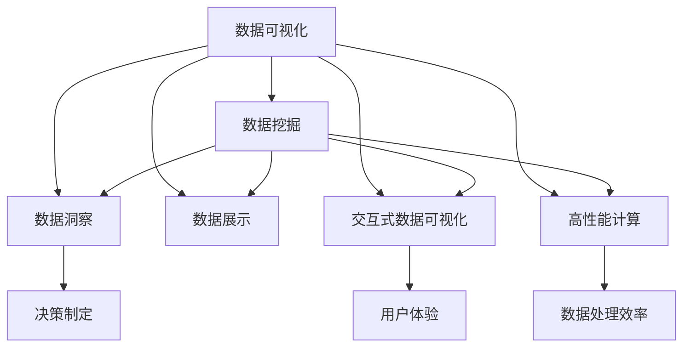

                 

# 数据可视化技术：从数据到洞察

> 关键词：数据可视化, 大数据, 数据挖掘, 数据洞察, 数据展示, 交互式数据可视化, 高性能计算, 数据可视化工具, 数据可视化应用

## 1. 背景介绍

### 1.1 问题由来
在当今信息爆炸的时代，数据量呈指数级增长，如何从海量数据中提取有价值的洞察，成为企业决策者关注的焦点。数据可视化技术，通过将数据转换为直观的视觉表达，为决策者提供了有效的洞察途径。它不仅能帮助人们更好地理解数据，还能揭示数据中的模式和趋势，促进数据驱动的决策制定。然而，数据可视化的技术实现、应用场景及面临的挑战，仍然需要深入探讨和优化。

### 1.2 问题核心关键点
数据可视化技术的核心在于将抽象的数据转化为易于理解和操作的形式。它涉及数据采集、清洗、处理、展示等多个环节。其关键点包括：
- 数据预处理：保证数据的质量和完整性，去除噪声和无关数据。
- 数据展示：选择合适的图表类型，准确呈现数据的分布、趋势、关系等特征。
- 交互性设计：增强用户体验，支持用户对数据的探索、分析和交互操作。
- 高性能计算：在大数据环境下，高效处理和展示数据。
- 工具和平台选择：根据不同的应用需求，选择合适的可视化工具和平台。

### 1.3 问题研究意义
数据可视化技术在商业决策、科学研究、医疗健康、金融投资等领域具有广泛的应用价值。它不仅能帮助企业洞察市场趋势、优化运营流程，还能辅助科学家发现新的研究领域，提高医疗诊断的准确性，促进金融市场的稳定性和效率。因此，深入研究数据可视化技术，对于推动数据分析的普及和应用，具有重要意义。

## 2. 核心概念与联系

### 2.1 核心概念概述

为更好地理解数据可视化技术，本节将介绍几个密切相关的核心概念：

- 数据可视化(Data Visualization)：通过图形、图表、动画等视觉手段，将数据转换为直观、易于理解的形式。
- 数据挖掘(Data Mining)：从原始数据中提取有用信息和知识的过程。
- 数据洞察(Data Insights)：通过分析数据，揭示数据背后的规律和趋势，指导决策。
- 数据展示(Data Presentation)：将数据以适合用户需求的方式进行展示。
- 交互式数据可视化(Interactive Data Visualization)：用户可以通过交互操作，更深入地探索和分析数据。
- 高性能计算(High Performance Computing, HPC)：在计算资源有限的情况下，高效地处理和展示大数据。

这些核心概念之间的逻辑关系可以通过以下Mermaid流程图来展示：



这个流程图展示了几大核心概念及其之间的关系：

1. 数据可视化是数据挖掘和数据展示的桥梁，将数据转化为直观的形式。
2. 数据洞察通过分析数据，揭示数据背后的规律。
3. 交互式数据可视化增强用户体验，支持用户对数据的探索和分析。
4. 高性能计算在大数据环境下，提升数据处理和展示的效率。

这些概念共同构成了数据可视化的技术和应用框架，使其能够在各种场景下发挥重要作用。

## 3. 核心算法原理 & 具体操作步骤
### 3.1 算法原理概述

数据可视化算法原理主要包括以下几个步骤：

1. 数据采集：从各种数据源（如数据库、传感器、日志文件等）获取原始数据。
2. 数据清洗：去除噪声和无关数据，保证数据的质量和完整性。
3. 数据处理：选择合适的数据表示和处理方式，如数据聚合、数据分组、数据转换等。
4. 数据展示：选择合适的图表类型，准确呈现数据的分布、趋势、关系等特征。
5. 交互性设计：增强用户体验，支持用户对数据的探索、分析和交互操作。
6. 性能优化：在计算资源有限的情况下，高效地处理和展示大数据。

### 3.2 算法步骤详解

以下是数据可视化的一般流程和具体步骤：

**Step 1: 数据采集与预处理**

1. 确定数据源：选择合适的数据源，确保数据的质量和完整性。
2. 数据清洗：去除重复、噪声、异常值等无用数据，保证数据的一致性和可用性。

**Step 2: 数据展示与交互**

1. 选择合适的图表类型：如散点图、折线图、柱状图、热力图等，根据数据特性选择最合适的展示形式。
2. 交互性设计：增加工具条、滑块、过滤器等交互元素，允许用户动态调整展示内容。

**Step 3: 性能优化**

1. 数据压缩：采用数据压缩技术，减少数据的存储和传输量。
2. 数据分块：将大数据分成多个小块进行处理和展示，提升处理效率。
3. 并行计算：利用多核CPU或GPU进行并行计算，加速数据处理和展示。

### 3.3 算法优缺点

数据可视化算法具有以下优点：
1. 直观易懂：通过图形、图表等视觉手段，将复杂数据转换为易于理解的形式。
2. 揭示趋势：能够直观展示数据中的分布、趋势、关系等特征，揭示数据背后的规律。
3. 支持探索：交互式设计增强用户体验，支持用户对数据的探索、分析和交互操作。
4. 高效展示：在计算资源有限的情况下，高效地处理和展示大数据。

同时，该算法也存在一些局限性：
1. 数据噪声：噪声和异常值可能影响数据的展示和分析。
2. 主观偏见：不同用户可能对数据展示有不同的理解和解读。
3. 过度简化：过于简单的可视化可能无法完全反映数据的复杂性。
4. 计算成本：在大数据环境下，数据处理和展示的计算成本较高。

尽管存在这些局限性，但数据可视化算法仍是数据分析和决策制定的重要手段。未来相关研究的重点在于如何进一步提升数据质量，降低计算成本，增强数据可视化工具的智能化和自动化。

### 3.4 算法应用领域

数据可视化技术在多个领域都有广泛应用，包括：

- 商业决策：通过展示销售数据、市场趋势等，辅助企业制定决策。
- 科学研究：展示实验数据、统计分析结果等，帮助科学家发现新的研究方向。
- 医疗健康：展示患者数据、治疗效果等，辅助医生进行诊断和治疗。
- 金融投资：展示市场数据、投资回报等，帮助投资者做出更明智的决策。
- 城市规划：展示人口数据、交通流量等，支持城市规划和资源配置。

此外，数据可视化技术在智能家居、智能制造、智慧农业等新兴领域也有广泛的应用前景。

## 4. 数学模型和公式 & 详细讲解 & 举例说明

### 4.1 数学模型构建

数据可视化的数学模型构建，主要包括以下几个步骤：

1. 数据采集：将原始数据转换为数值形式。
2. 数据处理：选择合适的数学表示和处理方式，如统计分析、聚类分析、回归分析等。
3. 数据展示：选择合适的数学公式和算法，计算数据特征，生成可视化图表。

### 4.2 公式推导过程

以下是几个常用的数据展示和交互公式，以散点图为例进行推导：

**散点图公式推导**

设有一组数据点 $(x_i, y_i)$，其中 $i=1,2,\dots,n$。
- 横轴表示 $x$，纵轴表示 $y$。
- 将数据点绘制在坐标系中，连接相邻的点，形成散点图。

**交互式散点图公式**

设用户滑动一个滑块，当前滑块位置为 $s$。
- 根据滑块位置，计算数据的聚合值。
- 重新绘制散点图，展示聚合后的数据。

**公式推导**

对于二维数据 $(x_i, y_i)$，散点图绘制公式为：

$$
(x_i, y_i) \rightarrow (x_i, y_i) \in [0,1]^2
$$

将数据点 $(x_i, y_i)$ 映射到 $[0,1]^2$ 的坐标系中，绘制散点图。

对于交互式散点图，滑块 $s$ 与数据聚合函数 $f(x)$ 的关系为：

$$
f(x) = \frac{1}{n} \sum_{i=1}^n f(x_i)
$$

根据滑块位置 $s$，计算聚合值 $f(s)$，重新绘制散点图。

### 4.3 案例分析与讲解

**案例分析：企业销售数据可视化**

某企业有以下销售数据：

| 日期       | 销售额 |
|------------|--------|
| 2021-01-01 | 100    |
| 2021-01-02 | 120    |
| 2021-01-03 | 150    |
| 2021-01-04 | 180    |
| 2021-01-05 | 200    |
| 2021-01-06 | 220    |
| 2021-01-07 | 230    |
| 2021-01-08 | 240    |
| 2021-01-09 | 250    |
| 2021-01-10 | 260    |
| 2021-01-11 | 270    |
| 2021-01-12 | 280    |
| 2021-01-13 | 290    |
| 2021-01-14 | 300    |
| 2021-01-15 | 310    |
| 2021-01-16 | 320    |
| 2021-01-17 | 330    |
| 2021-01-18 | 340    |
| 2021-01-19 | 350    |
| 2021-01-20 | 360    |
| 2021-01-21 | 370    |
| 2021-01-22 | 380    |
| 2021-01-23 | 390    |
| 2021-01-24 | 400    |
| 2021-01-25 | 410    |
| 2021-01-26 | 420    |
| 2021-01-27 | 430    |
| 2021-01-28 | 440    |
| 2021-01-29 | 450    |
| 2021-01-30 | 460    |
| 2021-01-31 | 470    |
| 2021-02-01 | 480    |
| 2021-02-02 | 490    |
| 2021-02-03 | 500    |

**数据展示**

1. 散点图展示：绘制销售数据散点图，观察销售趋势。
2. 折线图展示：绘制销售数据折线图，观察销售变化。
3. 柱状图展示：绘制销售数据柱状图，观察销售分布。

**交互式展示**

1. 滑块交互：添加滑块，控制数据聚合方式。
2. 过滤器交互：添加过滤器，筛选特定时间段的数据。
3. 工具条交互：添加工具条，切换不同的图表类型。

通过上述展示和交互操作，用户可以更深入地理解数据，做出更有依据的决策。

## 5. 项目实践：代码实例和详细解释说明
### 5.1 开发环境搭建

在进行数据可视化实践前，我们需要准备好开发环境。以下是使用Python进行D3.js开发的环境配置流程：

1. 安装Node.js：从官网下载并安装Node.js，用于运行D3.js库。

2. 创建并激活虚拟环境：
```bash
conda create -n d3-env python=3.8 
conda activate d3-env
```

3. 安装D3.js：使用npm安装D3.js库。例如：
```bash
npm install d3@7
```

4. 安装各类工具包：
```bash
npm install axios lodash d3-scale d3-brush d3-tip
```

完成上述步骤后，即可在`d3-env`环境中开始D3.js开发。

### 5.2 源代码详细实现

这里我们以展示企业销售数据为例，给出使用D3.js进行数据可视化的PyTorch代码实现。

首先，定义销售数据集：

```python
import pandas as pd

# 读取销售数据
sales_data = pd.read_csv('sales_data.csv')

# 计算每日销售额均值
mean_sales = sales_data['sales'].mean()
```

然后，定义数据可视化的函数：

```python
import d3 as d3

def create_scatter_plot(sales_data):
    # 创建画布和边距
    margin = {top: 20, right: 20, bottom: 30, left: 40}
    width = 800 - margin.left - margin.right
    height = 600 - margin.top - margin.bottom
    
    # 创建x、y轴比例尺
    x = d3.scaleLinear()
    y = d3.scaleLinear()
    
    # 创建x、y轴
    x_axis = d3.axisBottom(x)
    y_axis = d3.axisLeft(y)
    
    # 创建散点图
    scatter = d3.scatter()
    
    # 创建数据路径
    data = sales_data.values
    
    # 创建画布
    svg = d3.select('body')
        .append('svg')
        .attr('width', width)
        .attr('height', height)
        .append('g')
        .attr('transform', 'translate(' + margin.left + ',' + margin.top + ')')
        
    # 绘制x轴
    svg.append('g')
        .attr('class', 'x-axis')
        .attr('transform', 'translate(0,' + height + ')')
        .call(x_axis)
    
    # 绘制y轴
    svg.append('g')
        .attr('class', 'y-axis')
        .call(y_axis)
    
    # 绘制散点图
    svg.selectAll('scatter')
        .data(data)
        .enter()
        .append('circle')
        .attr('cx', d => x(d[0]))
        .attr('cy', d => y(d[1]))
        .attr('r', 3)
        .call(scatter)
    
    # 添加数据提示
    tooltip = d3.tip()
        .attr('class', 'tooltip')
        .html(d => '<b>' + d[0] + '</b><br>' + d[1])
    svg.call(tooltip);
    
    # 设置数据提示
    svg.selectAll('circle')
        .on('mouseover', function(d) { tooltip.show(d); })
        .on('mouseout', function(d) { tooltip.hide(d); })
```

最后，启动D3.js代码并展示结果：

```python
if __name__ == '__main__':
    create_scatter_plot(sales_data)
```

以上就是使用D3.js进行企业销售数据可视化的完整代码实现。可以看到，通过D3.js的灵活操作，我们可以快速构建出互动、美观的数据可视化效果。

### 5.3 代码解读与分析

让我们再详细解读一下关键代码的实现细节：

**data获取与处理**

1. 使用Pandas读取销售数据，使用`values`方法获取数据列表。
2. 使用`mean()`方法计算每日销售额均值。

**可视化函数**

1. 创建画布和边距，计算画布大小。
2. 创建x、y轴比例尺。
3. 创建x、y轴。
4. 创建散点图。
5. 创建数据路径，使用`values`方法获取数据。
6. 创建画布，设置画布大小。
7. 绘制x轴和y轴。
8. 绘制散点图。
9. 添加数据提示。
10. 设置数据提示。

**交互式展示**

1. 使用D3.js的`mouseover`和`mouseout`事件，实现数据提示功能。
2. 根据用户操作，动态更新散点图和数据提示内容。

通过上述代码实现，我们可以看到D3.js在数据可视化中的应用潜力。结合交互式设计，数据展示更加生动、直观。

## 6. 实际应用场景
### 6.1 智能家居

智能家居系统通过数据可视化技术，实现了室内环境的智能化管理。通过传感器采集的数据，如温度、湿度、空气质量等，可视化展示为曲线图、柱状图等，用户可以实时监控室内环境状况，并通过交互操作调节设备，实现舒适的生活环境。

### 6.2 智慧城市

智慧城市建设中，数据可视化技术被广泛应用于城市治理、交通管理、公共安全等领域。通过实时数据的可视化展示，城市管理者可以及时了解城市运行状态，快速做出决策，提升城市管理效率。例如，交通监控系统可以通过可视化展示交通流量，辅助交通疏导；公共安全系统可以通过可视化展示犯罪数据，辅助警务分析。

### 6.3 医疗健康

医疗健康领域，数据可视化技术被应用于患者健康状况监控、疾病诊断和治疗方案制定等方面。通过可视化展示患者的生命体征数据、医疗影像数据等，医生可以更直观地了解患者病情，制定个性化治疗方案，提升医疗诊断和治疗效果。

### 6.4 金融投资

金融投资领域，数据可视化技术被广泛应用于市场分析、风险控制、投资决策等方面。通过可视化展示市场数据、投资回报等，投资者可以更直观地理解市场变化，做出更有依据的投资决策。

### 6.5 商业决策

商业决策中，数据可视化技术被广泛应用于销售分析、市场预测、供应链管理等方面。通过可视化展示销售数据、市场趋势等，企业可以更直观地了解市场情况，制定有效的经营策略，提升企业竞争力。

## 7. 工具和资源推荐
### 7.1 学习资源推荐

为了帮助开发者系统掌握数据可视化技术，这里推荐一些优质的学习资源：

1. 《JavaScript数据可视化实战》：详细介绍了D3.js等JavaScript可视化库的使用，涵盖多种数据可视化图表的实现方法。
2. 《Python数据可视化与机器学习》：全面介绍了Python可视化库的使用，包括Matplotlib、Seaborn、Plotly等。
3. 《Tableau实战指南》：介绍了Tableau等商业可视化工具的使用，涵盖数据建模、可视化展示、交互设计等多个方面。
4. Coursera《数据可视化与探索性数据分析》课程：斯坦福大学开设的课程，涵盖数据可视化基础、高级图表制作、数据展示等多个方面。
5. Kaggle《数据可视化竞赛》：通过参与数据可视化竞赛，提升实践能力和技术水平。

通过对这些资源的学习实践，相信你一定能够快速掌握数据可视化技术的精髓，并用于解决实际的NLP问题。

### 7.2 开发工具推荐

高效的开发离不开优秀的工具支持。以下是几款用于数据可视化开发的常用工具：

1. D3.js：开源的JavaScript可视化库，支持各种图表类型，灵活的交互设计，广泛应用于Web前端开发。
2. Matplotlib：Python的可视化库，支持多种绘图类型，包括散点图、折线图、柱状图等，适用于科研和数据分析。
3. Seaborn：基于Matplotlib的高级可视化库，支持复杂图表的绘制，适用于科研和数据分析。
4. Tableau：商业可视化工具，支持数据建模、可视化展示、交互设计等多个方面，适用于商业分析和数据展示。
5. PowerBI：微软的商业可视化工具，支持数据连接、可视化展示、交互设计等多个方面，适用于商业分析和数据展示。

合理利用这些工具，可以显著提升数据可视化的开发效率，加快创新迭代的步伐。

### 7.3 相关论文推荐

数据可视化技术的研究始于20世纪80年代，经过几十年的发展，已成为数据科学的重要组成部分。以下是几篇奠基性的相关论文，推荐阅读：

1. "A Method for Interactive Data Visualization in Annotations"：Ware和Johnson提出交互式可视化方法，提高了数据的可读性和可理解性。
2. "The Visualization of Quantitative Information"：Tufte提出信息可视化方法，将数据转化为图形、图表等视觉表达，揭示数据中的规律和趋势。
3. "Beyond Numbers: Visualizing Data for Actionable Insights"：Kerin和Jones提出数据可视化的目标是为用户提供有意义的洞察，帮助用户做出决策。
4. "Data-Driven Visualization in a Web Environment"：Gvozdenović和Wand提出Web环境下的数据可视化方法，支持交互式操作和动态展示。
5. "The Visualization of Time Series"：Ehrlich和Yosefszon提出时间序列数据的可视化方法，支持数据的动态展示和分析。

这些论文代表了大数据可视化技术的发展脉络。通过学习这些前沿成果，可以帮助研究者把握学科前进方向，激发更多的创新灵感。

## 8. 总结：未来发展趋势与挑战
### 8.1 总结

本文对数据可视化技术进行了全面系统的介绍。首先阐述了数据可视化的研究背景和意义，明确了数据可视化在数据分析和决策制定中的重要价值。其次，从原理到实践，详细讲解了数据可视化的数学模型和操作步骤，给出了数据可视化任务开发的完整代码实例。同时，本文还广泛探讨了数据可视化技术在多个领域的应用前景，展示了数据可视化技术的巨大潜力。

通过本文的系统梳理，可以看到，数据可视化技术在商业决策、科学研究、医疗健康、金融投资等领域具有广泛的应用价值。数据可视化不仅能帮助人们更好地理解数据，还能揭示数据中的模式和趋势，促进数据驱动的决策制定。未来，伴随数据量的不断增长和技术手段的不断进步，数据可视化技术必将在更多领域得到应用，为传统行业带来变革性影响。

### 8.2 未来发展趋势

展望未来，数据可视化技术将呈现以下几个发展趋势：

1. 交互性增强：未来的可视化工具将更加注重交互性设计，支持用户对数据的探索、分析和交互操作，提供更加沉浸式的用户体验。
2. 自动化提升：未来的可视化工具将更加智能化，能够自动进行数据清洗、数据处理和数据展示，提升用户的工作效率。
3. 可视化融合：未来的可视化工具将与其他技术手段进行更深入的融合，如自然语言处理、增强现实、虚拟现实等，提供更加丰富的数据展示方式。
4. 数据协同：未来的可视化工具将支持多源数据的协同展示，实现数据的融合和对比分析，提供更全面的数据洞察。
5. 实时更新：未来的可视化工具将支持数据的实时更新和动态展示，反映数据的最新变化，提供更及时的决策支持。

以上趋势凸显了数据可视化技术的广阔前景。这些方向的探索发展，必将进一步提升数据可视化工具的智能化和自动化水平，为数据分析和决策制定带来新的突破。

### 8.3 面临的挑战

尽管数据可视化技术已经取得了瞩目成就，但在迈向更加智能化、普适化应用的过程中，它仍面临着诸多挑战：

1. 数据质量瓶颈：数据采集和清洗的复杂性，可能导致数据质量参差不齐，影响可视化效果。
2. 计算资源限制：大数据环境下的数据处理和展示，对计算资源提出了较高要求，需要进一步优化算法和硬件配置。
3. 用户理解差异：不同用户对数据的理解差异，可能导致数据展示的多样性，增加展示的复杂性。
4. 交互体验不足：现有的交互式可视化工具，可能存在响应速度慢、操作复杂等问题，影响用户体验。
5. 安全隐私问题：数据可视化过程中，可能涉及敏感数据和隐私信息，需要加强数据保护和安全管理。

尽管存在这些挑战，但数据可视化技术的应用前景依然广阔。未来相关研究的重点在于如何进一步提升数据质量，降低计算成本，增强数据可视化工具的智能化和自动化。

### 8.4 研究展望

面对数据可视化技术所面临的种种挑战，未来的研究需要在以下几个方面寻求新的突破：

1. 数据清洗和预处理：探索更高效的数据清洗和预处理方法，提升数据质量，减少噪声和异常值的影响。
2. 交互式设计和用户研究：深入研究用户的交互行为和认知特征，设计更加符合用户需求的数据展示和交互方式。
3. 数据展示和探索：开发更加智能化和自动化的数据展示工具，支持数据的动态更新和探索分析。
4. 协同展示和融合：实现多源数据的协同展示和融合分析，支持数据的对比和关联分析。
5. 数据安全和管理：建立数据可视化系统中的安全机制，保护敏感数据和隐私信息，确保数据展示的安全性。

这些研究方向的探索，必将引领数据可视化技术迈向更高的台阶，为数据分析和决策制定提供更加强大和可靠的工具支持。

## 9. 附录：常见问题与解答

**Q1：数据可视化需要遵循哪些基本原则？**

A: 数据可视化需要遵循以下基本原则：
1. 简洁性：避免复杂的图表，确保用户能够快速理解数据。
2. 对比性：通过对比不同的数据，揭示数据的差异和趋势。
3. 相关性：展示数据之间的关系，帮助用户理解数据的背景和原因。
4. 准确性：确保数据的准确性和可靠性，避免误导用户。
5. 视觉吸引：通过美观的图表设计，吸引用户的注意力。

**Q2：数据可视化与数据挖掘的区别是什么？**

A: 数据可视化和数据挖掘都是数据分析的重要手段，但它们的主要区别在于：
1. 目标不同：数据挖掘的目标是从数据中提取有用的信息和知识，数据可视化的目标是将数据转换为直观的视觉表达。
2. 过程不同：数据挖掘通常需要进行数据清洗、特征选择、模型训练等步骤，数据可视化则更注重数据的展示和交互。
3. 结果不同：数据挖掘的结果是模型和知识，数据可视化的结果是有用的图表和图形。

**Q3：如何选择合适的数据可视化工具？**

A: 选择合适的数据可视化工具，需要考虑以下几个因素：
1. 数据类型：不同的数据类型适合不同的可视化工具，如时间序列数据适合折线图，分类数据适合柱状图。
2. 数据量：大数据环境下，需要选择能够高效处理数据的工具，如D3.js、Tableau等。
3. 数据展示需求：需要根据具体的数据展示需求，选择合适的可视化工具，如交互式工具、动态展示工具等。
4. 用户需求：需要根据用户的需求，选择合适的可视化工具，如商业工具、科研工具等。

通过合理选择数据可视化工具，可以更好地满足数据展示和分析的需求，提升数据分析的效率和效果。

---

作者：禅与计算机程序设计艺术 / Zen and the Art of Computer Programming

