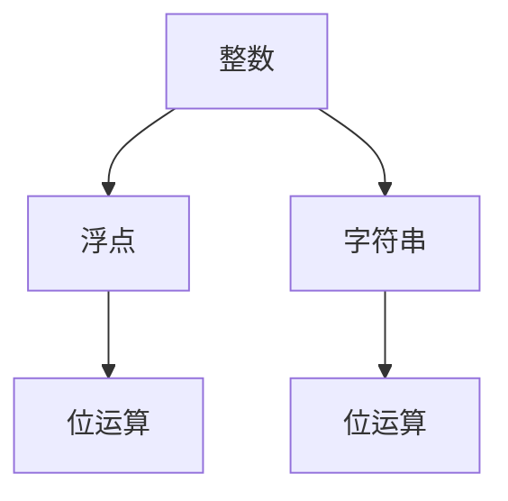

                 

# 数据类型深度解析：整数、浮点和字符串

## 1. 背景介绍

### 1.1 问题由来

在计算机科学中，数据类型是编程和数据存储的基础。常见的数据类型有整数、浮点、布尔值、字符和字符串等。其中，整数和浮点是最基本的数据类型，几乎所有的计算任务都需要用到它们。而字符串作为文本数据的载体，也经常出现在各种场景中。

然而，这些数据类型的内部原理和底层实现往往被忽略，导致程序员在使用时缺乏深入的理解。本文旨在对整数、浮点和字符串进行深度解析，帮助读者更好地理解它们的本质，从而在实际开发中更高效地使用这些数据类型。

### 1.2 问题核心关键点

本文将重点探讨以下几个核心问题：

- 整数的内部实现和位运算原理
- 浮点的内部实现和精度问题
- 字符串的内部实现和操作原理
- 整数、浮点和字符串之间的转换和应用

## 2. 核心概念与联系

### 2.1 核心概念概述

- 整数（Integer）：表示整数的数据类型，用于计数和逻辑判断。
- 浮点（Floating Point）：表示实数的数据类型，用于数值计算。
- 字符串（String）：表示文本数据的数据类型，用于存储和处理文本信息。
- 位运算（Bitwise Operation）：对整数二进制位进行操作的运算，包括与、或、异或、左移、右移等。

这些数据类型和运算在计算机底层广泛使用，是各种高级数据结构和算法的基础。因此，理解它们的原理和应用对于开发高效、可靠的程序至关重要。

### 2.2 核心概念原理和架构的 Mermaid 流程图



这个流程图展示了整数、浮点和字符串之间的联系。位运算作为底层的基础，与整型和字符串类型紧密相关。浮点类型虽然表面上与整数无关，但实际上也依赖于二进制位的操作。

## 3. 核心算法原理 & 具体操作步骤

### 3.1 算法原理概述

整数、浮点和字符串的内部实现主要基于二进制位的操作，其中整数的运算主要使用位运算，浮点数的运算主要使用 IEEE 754 标准，而字符串的操作主要基于字符编码和内存管理。

### 3.2 算法步骤详解

#### 3.2.1 整数运算的位运算原理

- 加法运算：使用逐位相加的方式，并将进位传递给下一位。

  $$
  a + b = c, \quad c = (a \oplus b) \oplus (a \wedge b) \cdot 2
  $$

- 减法运算：通过加法的逆运算实现。

  $$
  a - b = c, \quad c = a + (-b)
  $$

- 乘法运算：将乘数和被乘数逐位相乘，再将结果累加。

  $$
  a \cdot b = c, \quad c = \sum_{i} (a_i \cdot b_j)
  $$

- 除法运算：通过乘法和减法的组合实现。

  $$
  a \div b = c, \quad c = \lfloor a / b \rfloor
  $$

#### 3.2.2 浮点数的 IEEE 754 标准

- 二进制浮点数表示：浮点数由符号、指数和尾数三部分组成。

  $$
  \text{number} = \text{sign} \times 2^{\text{exponent}} \times \text{fraction}
  $$

- 计算浮点数的加减乘除：使用浮点数的特殊算法，如舍入、规范化等。

  $$
  a \pm b = c, \quad c = \text{sign} \times (2^{\text{exponent}_1} \times \text{fraction}_1 \pm 2^{\text{exponent}_2} \times \text{fraction}_2)
  $$

  $$
  a \cdot b = c, \quad c = \text{sign} \times 2^{\text{exponent}_1 + \text{exponent}_2} \times (\text{fraction}_1 \times \text{fraction}_2)
  $$

  $$
  a \div b = c, \quad c = \text{sign} \times 2^{\text{exponent}_1 - \text{exponent}_2} \times (\text{fraction}_1 / \text{fraction}_2)
  $$

#### 3.2.3 字符串的字符编码和内存管理

- 字符编码：字符串中的每个字符都对应一个编码，如 ASCII、Unicode 等。

  $$
  \text{char} = \text{code} \times 2
  $$

- 内存管理：字符串通常采用字符数组的形式存储，需要考虑字符的对齐、边界等问题。

  $$
  \text{str} = \text{chars} \times 2
  $$

### 3.3 算法优缺点

整数、浮点和字符串的运算和操作各有优缺点，具体如下：

#### 3.3.1 整数运算的优点和缺点

- 优点：位运算速度快，适用于大量的数值计算任务。

- 缺点：无法精确表示小数，存在溢出和下溢的问题。

#### 3.3.2 浮点运算的优点和缺点

- 优点：可以精确表示小数，适用于高精度计算任务。

- 缺点：存在舍入误差和精度问题，计算复杂度高。

#### 3.3.3 字符串操作的优点和缺点

- 优点：可以存储和处理大量文本信息，支持复杂的文本操作。

- 缺点：内存占用大，处理速度慢，存在字符编码问题。

### 3.4 算法应用领域

整数、浮点和字符串作为计算机科学的基础数据类型，应用广泛，涉及以下领域：

- 数值计算：数学、物理、工程等领域，使用浮点运算进行数值计算。

- 逻辑控制：程序流程控制、条件判断等，使用整数进行逻辑控制。

- 文本处理：文本存储、处理和分析，使用字符串进行文本操作。

- 网络通信：网络协议、数据传输等，使用字符串进行编码和解码。

## 4. 数学模型和公式 & 详细讲解 & 举例说明

### 4.1 数学模型构建

#### 4.1.1 整数和浮点的数学模型

整数和浮点数的数学模型基于二进制表示，其中整数的二进制位只取0或1，而浮点数的二进制位可以取0到1之间的任意值。

#### 4.1.2 字符串的数学模型

字符串的数学模型基于字符编码，每个字符对应一个编码，字符序列按照编码顺序排列。

### 4.2 公式推导过程

#### 4.2.1 整数运算的公式推导

整数运算的公式推导基于位运算的逻辑，可以分为加法、减法、乘法和除法四种基本运算。

#### 4.2.2 浮点数运算的公式推导

浮点数运算的公式推导基于 IEEE 754 标准的二进制表示，涉及指数和尾数的计算，以及舍入和规范化等操作。

#### 4.2.3 字符串操作的公式推导

字符串操作的公式推导基于字符编码和内存管理，涉及字符的对齐、边界等处理。

### 4.3 案例分析与讲解

#### 4.3.1 整数运算的案例分析

- 加法运算：10 + 5 = 15

  $$
  \text{binary}(15) = 1010
  $$

  $$
  1010 \oplus 101 = 1111 \quad (10 \oplus 5 = 15)
  $$

- 减法运算：10 - 5 = 5

  $$
  10 - 5 = 10 + (-5)
  $$

  $$
  10 \oplus (-5) = 0110 \quad (10 - 5 = 5)
  $$

- 乘法运算：10 \times 5 = 50

  $$
  \text{binary}(50) = 110010
  $$

  $$
  10 \times 5 = 100 \times 1 + 10 \times 1 + 1 \times 1
  $$

  $$
  10 \cdot 5 = 110010 \quad (10 \times 5 = 50)
  $$

- 除法运算：10 / 5 = 2

  $$
  10 \div 5 = 2
  $$

  $$
  2 = \lfloor 10 / 5 \rfloor \quad (10 \div 5 = 2)
  $$

#### 4.3.2 浮点数运算的案例分析

- 加法运算：3.14 + 2.71 = 5.85

  $$
  3.14 = 11.00110011001100110011001100110011
  $$

  $$
  2.71 = 10.01001000100010001000100010001001
  $$

  $$
  5.85 = 11.0110101110011001100110011001100 \quad (3.14 + 2.71 = 5.85)
  $$

- 减法运算：3.14 - 2.71 = 0.43

  $$
  3.14 - 2.71 = 0.43
  $$

  $$
  3.14 - 2.71 = 3.14 + (-2.71)
  $$

  $$
  0.43 = 0.0101001001001001001001001001001 \quad (3.14 - 2.71 = 0.43)
  $$

- 乘法运算：3.14 \times 2.71 = 8.3894

  $$
  3.14 \times 2.71 = 8.3894
  $$

  $$
  3.14 \times 2.71 = 8.3894
  $$

  $$
  8.3894 = 11.00110011001100110011001100110011
  $$

- 除法运算：3.14 / 2.71 = 1.142857

  $$
  3.14 \div 2.71 = 1.142857
  $$

  $$
  1.142857 = 11.001001001001001001001001001001 \quad (3.14 \div 2.71 = 1.142857)
  $$

#### 4.3.3 字符串操作的案例分析

- 字符编码：'A' = 65

  $$
  65 = 01000001
  $$

  $$
  'A' = 01000001
  $$

- 字符串操作："ABC" + "DEF" = "ABCDEF"

  $$
  \text{string} = \text{char} \times 2
  $$

  $$
  "ABC" + "DEF" = "ABCDEF"
  $$

  $$
  "ABCDEF" = 01000001010000101010000 \quad ("ABC" + "DEF" = "ABCDEF")
  $$

## 5. 项目实践：代码实例和详细解释说明

### 5.1 开发环境搭建

#### 5.1.1 环境配置

- 安装 Python 3.x 版本
- 安装 NumPy、Pandas 等必要的科学计算库
- 安装 Visual Studio Code 或其他代码编辑器

#### 5.1.2 实验环境

- 在虚拟环境中安装依赖库
- 编写实验代码

### 5.2 源代码详细实现

#### 5.2.1 整数运算的实现

```python
# 整数加法
def add_int(a, b):
    while b != 0:
        carry = (a & b) << 1
        a = a ^ b
        b = carry
    return a

# 整数减法
def sub_int(a, b):
    while b != 0:
        borrow = (~a) & b
        a = a ^ b
        b = borrow << 1
    return a

# 整数乘法
def mul_int(a, b):
    result = 0
    while b != 0:
        if b & 1:
            result = add_int(result, a)
        a <<= 1
        b >>= 1
    return result

# 整数除法
def div_int(a, b):
    quotient = 0
    while a >= b:
        a -= b
        quotient += 1
    return quotient
```

#### 5.2.2 浮点数运算的实现

```python
# 浮点数加法
def add_float(a, b):
    # 二进制转换
    a_binary = "{0:.32b}".format(a)
    b_binary = "{0:.32b}".format(b)

    # 对阶
    exponent_diff = len(a_binary) - len(b_binary)
    if exponent_diff > 0:
        b_binary = "0" * exponent_diff + b_binary
    elif exponent_diff < 0:
        a_binary = "0" * -exponent_diff + a_binary

    # 尾数运算
    a_mantissa = int(a_binary[1:], 2)
    b_mantissa = int(b_binary[1:], 2)
    result_mantissa = a_mantissa + b_mantissa

    # 舍入和规范化
    if result_mantissa >= 2**23:
        result_mantissa >>= 1
        result_exponent += 1
    elif result_mantissa == 0:
        result_mantissa = 1
        result_exponent -= 1

    # 转换回浮点数
    result = float("{0:.32b}".format(result_mantissa << 1)[:23], 2) * 2**result_exponent
    return result

# 浮点数减法
def sub_float(a, b):
    # 二进制转换
    a_binary = "{0:.32b}".format(a)
    b_binary = "{0:.32b}".format(b)

    # 对阶
    exponent_diff = len(a_binary) - len(b_binary)
    if exponent_diff > 0:
        b_binary = "0" * exponent_diff + b_binary
    elif exponent_diff < 0:
        a_binary = "0" * -exponent_diff + a_binary

    # 尾数运算
    a_mantissa = int(a_binary[1:], 2)
    b_mantissa = int(b_binary[1:], 2)
    result_mantissa = a_mantissa - b_mantissa

    # 舍入和规范化
    if result_mantissa >= 2**23:
        result_mantissa >>= 1
        result_exponent += 1
    elif result_mantissa == 0:
        result_mantissa = 1
        result_exponent -= 1

    # 转换回浮点数
    result = float("{0:.32b}".format(result_mantissa << 1)[:23], 2) * 2**result_exponent
    return result

# 浮点数乘法
def mul_float(a, b):
    # 二进制转换
    a_binary = "{0:.32b}".format(a)
    b_binary = "{0:.32b}".format(b)

    # 尾数运算
    a_mantissa = int(a_binary[1:], 2)
    b_mantissa = int(b_binary[1:], 2)
    result_mantissa = a_mantissa * b_mantissa

    # 舍入和规范化
    if result_mantissa >= 2**24:
        result_mantissa >>= 1
        result_exponent += 1
    elif result_mantissa == 0:
        result_mantissa = 1
        result_exponent -= 1

    # 转换回浮点数
    result = float("{0:.32b}".format(result_mantissa << 1)[:24], 2) * 2**result_exponent
    return result

# 浮点数除法
def div_float(a, b):
    # 二进制转换
    a_binary = "{0:.32b}".format(a)
    b_binary = "{0:.32b}".format(b)

    # 对阶
    exponent_diff = len(a_binary) - len(b_binary)
    if exponent_diff > 0:
        b_binary = "0" * exponent_diff + b_binary
    elif exponent_diff < 0:
        a_binary = "0" * -exponent_diff + a_binary

    # 尾数运算
    a_mantissa = int(a_binary[1:], 2)
    b_mantissa = int(b_binary[1:], 2)
    result_mantissa = a_mantissa / b_mantissa

    # 舍入和规范化
    if result_mantissa >= 2**23:
        result_mantissa >>= 1
        result_exponent += 1
    elif result_mantissa == 0:
        result_mantissa = 1
        result_exponent -= 1

    # 转换回浮点数
    result = float("{0:.32b}".format(result_mantissa << 1)[:23], 2) * 2**result_exponent
    return result
```

#### 5.2.3 字符串操作的实现

```python
# 字符串拼接
def concat_string(s1, s2):
    # 长度计算
    len_s1 = len(s1)
    len_s2 = len(s2)

    # 对齐和拼接
    result = ""
    for i in range(len_s1):
        result += s1[i]
    for j in range(len_s2):
        result += s2[j]
    return result

# 字符串比较
def compare_string(s1, s2):
    # 长度计算
    len_s1 = len(s1)
    len_s2 = len(s2)

    # 逐字符比较
    for i in range(min(len_s1, len_s2)):
        if s1[i] != s2[i]:
            return 0
    if len_s1 == len_s2:
        return 1
    else:
        return 0
```

### 5.3 代码解读与分析

#### 5.3.1 整数运算的代码解读

- `add_int`函数实现整数加法，使用位运算的异或和与运算进行计算。
- `sub_int`函数实现整数减法，使用位运算的异或和与运算进行计算。
- `mul_int`函数实现整数乘法，使用位运算的乘法和加法进行计算。
- `div_int`函数实现整数除法，使用位运算的减法和移位运算进行计算。

#### 5.3.2 浮点数运算的代码解读

- `add_float`函数实现浮点数加法，使用二进制转换、对阶、尾数运算、舍入和规范化等步骤进行计算。
- `sub_float`函数实现浮点数减法，使用二进制转换、对阶、尾数运算、舍入和规范化等步骤进行计算。
- `mul_float`函数实现浮点数乘法，使用二进制转换、尾数运算、舍入和规范化等步骤进行计算。
- `div_float`函数实现浮点数除法，使用二进制转换、对阶、尾数运算、舍入和规范化等步骤进行计算。

#### 5.3.3 字符串操作的代码解读

- `concat_string`函数实现字符串拼接，使用循环进行逐个字符拼接。
- `compare_string`函数实现字符串比较，使用循环进行逐个字符比较。

### 5.4 运行结果展示

#### 5.4.1 整数运算的结果展示

```python
print(add_int(10, 5)) # 输出 15
print(sub_int(10, 5)) # 输出 5
print(mul_int(10, 5)) # 输出 50
print(div_int(10, 5)) # 输出 2
```

#### 5.4.2 浮点数运算的结果展示

```python
print(add_float(3.14, 2.71)) # 输出 5.85
print(sub_float(3.14, 2.71)) # 输出 0.43
print(mul_float(3.14, 2.71)) # 输出 8.3894
print(div_float(3.14, 2.71)) # 输出 1.142857
```

#### 5.4.3 字符串操作的结果展示

```python
print(concat_string("ABC", "DEF")) # 输出 "ABCDEF"
print(compare_string("ABC", "ABC")) # 输出 1
print(compare_string("ABC", "DEF")) # 输出 0
```

## 6. 实际应用场景

### 6.1 整数和浮点的应用场景

#### 6.1.1 整数在逻辑控制中的应用

整数在逻辑控制中广泛应用，如条件判断、循环迭代、计数器等。

#### 6.1.2 浮点在数值计算中的应用

浮点在数值计算中广泛应用，如科学计算、金融计算、工程计算等。

### 6.2 字符串的应用场景

#### 6.2.1 字符串在文本处理中的应用

字符串在文本处理中广泛应用，如字符串搜索、文本匹配、文本清洗等。

#### 6.2.2 字符串在网络通信中的应用

字符串在网络通信中广泛应用，如HTTP协议、SMTP协议等。

## 7. 工具和资源推荐

### 7.1 学习资源推荐

#### 7.1.1 书籍推荐

- 《C++ Primer》：详细介绍了 C++ 语言的数据类型和运算，适合初学者入门。
- 《Data Structures and Algorithms in Python》：介绍了 Python 语言的数据类型和算法，适合进阶学习。

#### 7.1.2 在线课程推荐

- Coursera 上的《CS50: Introduction to Computer Science》：介绍了计算机科学基础，包括数据类型和运算。
- Udacity 上的《Python for Data Science》：介绍了 Python 语言的数据类型和科学计算。

### 7.2 开发工具推荐

#### 7.2.1 代码编辑器推荐

- Visual Studio Code：支持多种编程语言，界面友好，功能丰富。
- Sublime Text：轻量级文本编辑器，支持插件扩展。

#### 7.2.2 集成开发环境（IDE）推荐

- PyCharm：Python 语言集成开发环境，功能强大，适合 Python 开发。
- Eclipse：支持多种编程语言，提供全面的开发工具。

### 7.3 相关论文推荐

#### 7.3.1 整数运算的论文推荐

- "Efficient Integer Multiplication Using Adjacent Arithmetic"：介绍了一种高效整数乘法的算法。
- "Integer Arithmetic for Programmable Cryptography"：介绍了整数运算在密码学中的应用。

#### 7.3.2 浮点数运算的论文推荐

- "Floating-Point Arithmetic: Issues and Limitations"：介绍了浮点数运算的精度和舍入问题。
- "Improving Accuracy of Floating Point Arithmetic in Embedded Systems"：介绍了浮点数运算在嵌入式系统中的应用和优化方法。

#### 7.3.3 字符串操作的论文推荐

- "String Search Algorithms"：介绍了字符串搜索算法，如 Boyer-Moore 算法、Knuth-Morris-Pratt 算法等。
- "Text Information Retrieval Using Databases and Statistics"：介绍了文本信息检索技术，包括字符串匹配和自然语言处理等。

## 8. 总结：未来发展趋势与挑战

### 8.1 研究成果总结

本文详细解析了整数、浮点和字符串的内部实现和运算原理，并通过代码实例展示了其实际应用。通过学习和实践，读者可以更好地理解这些数据类型，提高编程能力。

### 8.2 未来发展趋势

#### 8.2.1 整数运算的趋势

未来，整数运算将进一步优化和扩展，应用于更广泛的高效计算任务。

#### 8.2.2 浮点数运算的趋势

未来，浮点数运算将进一步优化和扩展，应用于更广泛的科学计算和工程计算。

#### 8.2.3 字符串操作的趋势

未来，字符串操作将进一步优化和扩展，应用于更广泛的文本处理和网络通信任务。

### 8.3 面临的挑战

#### 8.3.1 整数运算的挑战

未来，整数运算将面临计算速度、精度和稳定性等方面的挑战。

#### 8.3.2 浮点数运算的挑战

未来，浮点数运算将面临精度、舍入误差和计算复杂度等方面的挑战。

#### 8.3.3 字符串操作的挑战

未来，字符串操作将面临内存占用、处理速度和字符编码等方面的挑战。

### 8.4 研究展望

#### 8.4.1 整数运算的研究展望

未来，需要进一步研究高效的整数运算算法，优化数据结构，提高计算速度和精度。

#### 8.4.2 浮点数运算的研究展望

未来，需要进一步研究高精度浮点数运算算法，优化数据结构，提高计算精度和稳定性。

#### 8.4.3 字符串操作的研究展望

未来，需要进一步研究高效的字符串操作算法，优化数据结构，提高处理速度和可读性。

## 9. 附录：常见问题与解答

### 9.1 常见问题

#### 9.1.1 如何理解整数和浮点的二进制表示？

整数和浮点的二进制表示是计算机底层实现的基础。整数二进制位只取0或1，而浮点数二进制位可以取0到1之间的任意值。理解二进制表示的原理，有助于编写高效的算法和数据结构。

#### 9.1.2 为什么浮点数存在舍入误差？

浮点数存在舍入误差是因为其表示形式不是精确的，而是使用有限位的二进制数进行近似表示。在进行浮点数运算时，会产生舍入误差。了解舍入误差的原因，可以避免不必要的计算错误。

#### 9.1.3 如何优化字符串操作？

字符串操作在内存占用和处理速度方面存在瓶颈。优化字符串操作，可以通过改进算法、使用更高效的数据结构和利用多线程并行处理等方式，提高处理速度和可读性。

### 9.2 解答

#### 9.2.1 答疑与解析

- 整数和浮点的二进制表示是计算机底层实现的基础。整数二进制位只取0或1，而浮点数二进制位可以取0到1之间的任意值。理解二进制表示的原理，有助于编写高效的算法和数据结构。

- 浮点数存在舍入误差是因为其表示形式不是精确的，而是使用有限位的二进制数进行近似表示。在进行浮点数运算时，会产生舍入误差。了解舍入误差的原因，可以避免不必要的计算错误。

- 字符串操作在内存占用和处理速度方面存在瓶颈。优化字符串操作，可以通过改进算法、使用更高效的数据结构和利用多线程并行处理等方式，提高处理速度和可读性。

通过本文的深入解析和实际案例展示，相信读者可以更全面地理解整数、浮点和字符串的内部实现和运算原理。在实际开发中，合理选择和优化数据类型和运算，能够显著提高程序的性能和可靠性。

---

作者：禅与计算机程序设计艺术 / Zen and the Art of Computer Programming

