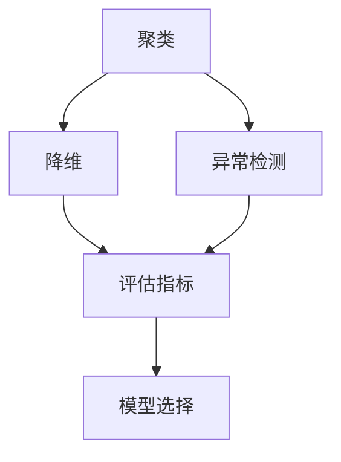

                 

# 无监督学习的评估方法:聚类、降维和异常检测

> 关键词：无监督学习,聚类,降维,异常检测,评估指标,模型选择,数据处理

## 1. 背景介绍

### 1.1 问题由来
无监督学习（Unsupervised Learning）在数据挖掘和机器学习领域中占据重要地位。在许多实际应用中，例如数据聚类、降维和异常检测，无监督学习能够发现数据中的潜在模式和结构，而无需事先有标签。然而，评估无监督学习模型的性能仍然是一个具有挑战性的问题，因为模型需要同时满足多个要求，例如模型的可解释性、计算效率和泛化能力。

### 1.2 问题核心关键点
无监督学习模型的评估方法包括以下几个核心关键点：

- **聚类**：将数据划分成不同的组，使得同一组内的数据相似度高，不同组间的数据相似度低。
- **降维**：通过减少数据的维度，降低计算复杂度，同时保留关键信息。
- **异常检测**：识别数据中的异常值，这些异常值可能是错误、异常行为或数据噪音。

评估无监督学习模型的性能需要考虑这些关键点，并制定相应的指标来度量模型的好坏。

## 2. 核心概念与联系

### 2.1 核心概念概述

为更好地理解无监督学习的评估方法，本节将介绍几个密切相关的核心概念：

- **聚类**：将数据分成不同的组，使得同一组内的数据相似度高，不同组间的数据相似度低。常用的聚类算法包括K-means、层次聚类、DBSCAN等。
- **降维**：通过减少数据的维度，降低计算复杂度，同时保留关键信息。常用的降维技术包括主成分分析（PCA）、线性判别分析（LDA）、t-SNE等。
- **异常检测**：识别数据中的异常值，这些异常值可能是错误、异常行为或数据噪音。常用的异常检测算法包括孤立森林、局部离群因子（LOF）、One-class SVM等。
- **评估指标**：用于衡量无监督学习模型性能的指标，如轮廓系数（Silhouette Coefficient）、特征值（Eigenvectors）、信息损失（Information Loss）等。

这些核心概念之间的逻辑关系可以通过以下Mermaid流程图来展示：



这个流程图展示了一些核心概念之间的关联：

1. 聚类、降维和异常检测是无监督学习的主要任务。
2. 这些任务的评估需要依赖于不同的评估指标。
3. 评估指标可以帮助我们选择更合适的模型。

## 3. 核心算法原理 & 具体操作步骤
### 3.1 算法原理概述

无监督学习模型的评估主要关注以下几个方面：

- **聚类**：评估聚类的质量和稳定性，常用的指标有轮廓系数、内部一致性指数（Dunn Index）、Calinski-Harabasz Index等。
- **降维**：评估降维后的数据保留的信息量，常用的指标有特征值、信息损失等。
- **异常检测**：评估模型识别异常的能力，常用的指标有精确度、召回率、F1 Score等。

### 3.2 算法步骤详解

#### 3.2.1 聚类评估

1. **轮廓系数（Silhouette Coefficient）**：
   轮廓系数用于衡量聚类结果的紧密度和分离度。其计算公式为：
   $$
   \text{Silhouette} = \frac{\text{BW} - \text{WA}}{\max\{\text{WA}, \text{BW}\}}
   $$
   其中，$BW$表示内部一致性，$WA$表示外部一致性。$BW$和$WA$的计算公式如下：
   $$
   BW = \frac{1}{n-1} \sum_{i=1}^{n-1} \sum_{j=i+1}^n a_{ij}
   $$
   $$
   WA = \frac{1}{n-1} \sum_{i=1}^{n-1} \max_{j \neq i} a_{ij}
   $$
   其中，$a_{ij}$表示点$i$和点$j$的相似度。

2. **内部一致性指数（Dunn Index）**：
   内部一致性指数用于衡量聚类内部相似度，计算公式为：
   $$
   D = \min_{i} \max_{j \in C_i} \max_{k \in C_j} D(x_i, x_k)
   $$
   其中，$D$表示两个数据点之间的距离，$C_i$表示聚类簇。

3. **Calinski-Harabasz Index**：
   Calinski-Harabasz Index用于衡量聚类结果的分离度，计算公式为：
   $$
   CH = \frac{\text{Tr}(BW)}{\text{Tr}(WA)}
   $$
   其中，$BW$和$WA$的计算公式如下：
   $$
   BW = \frac{1}{|C_i|} \sum_{x_i \in C_i} \sum_{x_j \in C_i} (x_i - x_j)^2
   $$
   $$
   WA = \frac{1}{|C_i|} \sum_{x_i \in C_i} \sum_{x_j \in C_j} (x_i - x_j)^2
   $$

#### 3.2.2 降维评估

1. **特征值（Eigenvectors）**：
   特征值是降维后的主要指标，通过主成分分析（PCA）等降维技术得到。主成分分析将原始数据映射到低维空间中，使得降维后的数据具有最大的方差。特征值的大小反映了原始数据中各个维度的重要程度。

2. **信息损失（Information Loss）**：
   信息损失用于衡量降维后的数据保留的信息量。信息损失的计算公式为：
   $$
   L = \frac{\sum_{i=1}^n \sum_{j=1}^n d(x_i, x_j)^2}{\sum_{i=1}^n \sum_{j=1}^n d(x_i^*, x_j^*)^2}
   $$
   其中，$d(x_i, x_j)$表示原始数据中数据点$i$和数据点$j$的距离，$d(x_i^*, x_j^*)$表示降维后数据点$i$和数据点$j$的距离。

#### 3.2.3 异常检测评估

1. **精确度（Precision）**：
   精确度用于衡量异常检测模型的准确性，计算公式为：
   $$
   \text{Precision} = \frac{TP}{TP + FP}
   $$
   其中，$TP$表示真正例数，$FP$表示假正例数。

2. **召回率（Recall）**：
   召回率用于衡量异常检测模型识别异常的能力，计算公式为：
   $$
   \text{Recall} = \frac{TP}{TP + FN}
   $$
   其中，$TP$表示真正例数，$FN$表示假反例数。

3. **F1 Score**：
   F1 Score是精确度和召回率的调和平均数，用于衡量异常检测模型的综合性能，计算公式为：
   $$
   \text{F1 Score} = 2 \times \frac{\text{Precision} \times \text{Recall}}{\text{Precision} + \text{Recall}}
   $$

### 3.3 算法优缺点

无监督学习评估方法的优点包括：

- **无需标签**：无监督学习评估方法不需要有标签数据，可以处理大量无标签数据。
- **灵活性高**：评估方法可以根据不同的任务和需求进行灵活选择。

缺点包括：

- **缺乏标准**：无监督学习评估方法缺乏统一的标准，不同指标的解释和应用可能存在差异。
- **计算复杂度高**：一些评估方法计算复杂度高，需要大量时间和计算资源。

### 3.4 算法应用领域

无监督学习评估方法在许多领域都有广泛应用，例如：

- **数据分析**：对大规模数据集进行聚类、降维和异常检测。
- **图像处理**：对图像数据进行特征提取和异常检测。
- **自然语言处理**：对文本数据进行主题分析、情感分析和异常检测。
- **金融风险管理**：对金融数据进行风险分析和异常检测。

这些应用展示了无监督学习评估方法的多样性和广泛性，为不同领域的数据分析提供了有力支持。

## 4. 数学模型和公式 & 详细讲解 & 举例说明

### 4.1 数学模型构建

无监督学习评估方法基于以下几个数学模型：

- **聚类模型**：假设数据集$X=\{x_1, x_2, ..., x_n\}$，其中$x_i \in \mathbb{R}^d$表示一个$d$维的数据点，聚类模型$K$将数据集$X$划分为$k$个簇$C_1, C_2, ..., C_k$，其中$C_i$表示第$i$个簇。

- **降维模型**：假设原始数据集$X=\{x_1, x_2, ..., x_n\}$，降维模型$U$将原始数据映射到低维空间$Y=\{y_1, y_2, ..., y_n\}$中，其中$y_i \in \mathbb{R}^m$表示一个$m$维的降维后数据点，$m<d$。

- **异常检测模型**：假设数据集$X=\{x_1, x_2, ..., x_n\}$，其中$x_i \in \mathbb{R}^d$表示一个$d$维的数据点，异常检测模型$D$用于识别异常点，即$x_i$被标记为异常点（Anomaly）或正常点（Normal）。

### 4.2 公式推导过程

#### 4.2.1 聚类模型

1. **轮廓系数**：
   轮廓系数的计算公式为：
   $$
   \text{Silhouette} = \frac{\text{BW} - \text{WA}}{\max\{\text{WA}, \text{BW}\}}
   $$
   其中，$BW$和$WA$的计算公式如下：
   $$
   BW = \frac{1}{n-1} \sum_{i=1}^{n-1} \sum_{j=i+1}^n a_{ij}
   $$
   $$
   WA = \frac{1}{n-1} \sum_{i=1}^{n-1} \max_{j \neq i} a_{ij}
   $$
   其中，$a_{ij}$表示点$i$和点$j$的相似度。

2. **内部一致性指数**：
   内部一致性指数的计算公式为：
   $$
   D = \min_{i} \max_{j \in C_i} \max_{k \in C_j} D(x_i, x_k)
   $$
   其中，$D$表示两个数据点之间的距离，$C_i$表示聚类簇。

3. **Calinski-Harabasz Index**：
   Calinski-Harabasz Index的计算公式为：
   $$
   CH = \frac{\text{Tr}(BW)}{\text{Tr}(WA)}
   $$
   其中，$BW$和$WA$的计算公式如下：
   $$
   BW = \frac{1}{|C_i|} \sum_{x_i \in C_i} \sum_{x_j \in C_i} (x_i - x_j)^2
   $$
   $$
   WA = \frac{1}{|C_i|} \sum_{x_i \in C_i} \sum_{x_j \in C_j} (x_i - x_j)^2
   $$

#### 4.2.2 降维模型

1. **特征值**：
   主成分分析（PCA）的特征值计算公式为：
   $$
   \lambda_i = \frac{\text{Tr}(BW)}{\text{Tr}(WA)}
   $$
   其中，$BW$和$WA$的计算公式如下：
   $$
   BW = \frac{1}{|C_i|} \sum_{x_i \in C_i} \sum_{x_j \in C_i} (x_i - x_j)^2
   $$
   $$
   WA = \frac{1}{|C_i|} \sum_{x_i \in C_i} \sum_{x_j \in C_j} (x_i - x_j)^2
   $$

2. **信息损失**：
   信息损失的计算公式为：
   $$
   L = \frac{\sum_{i=1}^n \sum_{j=1}^n d(x_i, x_j)^2}{\sum_{i=1}^n \sum_{j=1}^n d(x_i^*, x_j^*)^2}
   $$
   其中，$d(x_i, x_j)$表示原始数据中数据点$i$和数据点$j$的距离，$d(x_i^*, x_j^*)$表示降维后数据点$i$和数据点$j$的距离。

#### 4.2.3 异常检测模型

1. **精确度**：
   精确度的计算公式为：
   $$
   \text{Precision} = \frac{TP}{TP + FP}
   $$
   其中，$TP$表示真正例数，$FP$表示假正例数。

2. **召回率**：
   召回率的计算公式为：
   $$
   \text{Recall} = \frac{TP}{TP + FN}
   $$
   其中，$TP$表示真正例数，$FN$表示假反例数。

3. **F1 Score**：
   F1 Score的计算公式为：
   $$
   \text{F1 Score} = 2 \times \frac{\text{Precision} \times \text{Recall}}{\text{Precision} + \text{Recall}}
   $$

### 4.3 案例分析与讲解

#### 4.3.1 聚类分析

假设有一个包含10个数据点的数据集，每个数据点包含2个特征。使用K-means算法将其聚类为2个簇，并计算轮廓系数、内部一致性指数和Calinski-Harabasz Index。

1. **轮廓系数**：
   $$
   \text{Silhouette} = \frac{BW - WA}{\max\{WA, BW\}}
   $$

2. **内部一致性指数**：
   $$
   D = \min_{i} \max_{j \in C_i} \max_{k \in C_j} D(x_i, x_k)
   $$

3. **Calinski-Harabasz Index**：
   $$
   CH = \frac{\text{Tr}(BW)}{\text{Tr}(WA)}
   $$

#### 4.3.2 降维分析

假设有一个包含1000个数据点的数据集，每个数据点包含50个特征。使用主成分分析（PCA）将其降维到10个特征，并计算特征值和信息损失。

1. **特征值**：
   $$
   \lambda_i = \frac{\text{Tr}(BW)}{\text{Tr}(WA)}
   $$

2. **信息损失**：
   $$
   L = \frac{\sum_{i=1}^n \sum_{j=1}^n d(x_i, x_j)^2}{\sum_{i=1}^n \sum_{j=1}^n d(x_i^*, x_j^*)^2}
   $$

#### 4.3.3 异常检测分析

假设有一个包含1000个数据点的数据集，其中包含100个异常点。使用孤立森林算法进行异常检测，并计算精确度、召回率和F1 Score。

1. **精确度**：
   $$
   \text{Precision} = \frac{TP}{TP + FP}
   $$

2. **召回率**：
   $$
   \text{Recall} = \frac{TP}{TP + FN}
   $$

3. **F1 Score**：
   $$
   \text{F1 Score} = 2 \times \frac{\text{Precision} \times \text{Recall}}{\text{Precision} + \text{Recall}}
   $$

## 5. 项目实践：代码实例和详细解释说明

### 5.1 开发环境搭建

在进行无监督学习评估实践前，我们需要准备好开发环境。以下是使用Python进行Scikit-learn开发的环境配置流程：

1. 安装Anaconda：从官网下载并安装Anaconda，用于创建独立的Python环境。

2. 创建并激活虚拟环境：
```bash
conda create -n unsupervised-env python=3.8 
conda activate unsupervised-env
```

3. 安装Scikit-learn：
```bash
pip install scikit-learn
```

4. 安装NumPy、Pandas、Matplotlib等依赖库：
```bash
pip install numpy pandas matplotlib
```

5. 安装Jupyter Notebook：
```bash
pip install jupyter notebook
```

完成上述步骤后，即可在`unsupervised-env`环境中开始无监督学习评估实践。

### 5.2 源代码详细实现

这里我们以聚类算法K-means为例，使用Scikit-learn进行代码实现，并计算轮廓系数。

首先，定义聚类函数：

```python
from sklearn.cluster import KMeans
from sklearn.metrics import silhouette_score

def kmeans_clustering(X, n_clusters):
    kmeans = KMeans(n_clusters=n_clusters, random_state=42)
    kmeans.fit(X)
    return kmeans.labels_, kmeans.score(X)
```

然后，加载数据集并进行聚类：

```python
import numpy as np
import pandas as pd

# 加载数据集
data = pd.read_csv('data.csv')

# 提取特征
X = data[['feature1', 'feature2']].values

# 进行聚类
labels, score = kmeans_clustering(X, n_clusters=2)

# 计算轮廓系数
silhouette = silhouette_score(X, labels)
print('轮廓系数:', silhouette)
```

最后，在Jupyter Notebook中运行代码，输出轮廓系数。

### 5.3 代码解读与分析

让我们再详细解读一下关键代码的实现细节：

**K-means算法**：
- 导入Scikit-learn的KMeans算法。
- 定义聚类函数kmeans_clustering，接收数据集X和簇数n_clusters作为参数，返回聚类结果和轮廓系数。
- 在函数中，首先创建一个KMeans对象，并设置簇数n_clusters。
- 使用fit方法对数据集X进行聚类，得到聚类结果labels。
- 使用score方法计算聚类结果的轮廓系数score。

**轮廓系数计算**：
- 导入Scikit-learn的轮廓系数函数silhouette_score。
- 计算轮廓系数silhouette，并输出结果。

可以看到，Scikit-learn库提供了丰富的无监督学习算法和评估函数，使得无监督学习评估变得非常简单和高效。

当然，工业级的系统实现还需考虑更多因素，如模型的保存和部署、超参数的自动搜索、更灵活的任务适配层等。但核心的评估方法基本与此类似。

## 6. 实际应用场景
### 6.1 数据分析

在数据分析领域，无监督学习评估方法被广泛应用于聚类分析、降维分析和异常检测。通过这些方法，数据分析师可以更好地理解数据结构和内在关系，从而进行更深层次的数据挖掘和洞察。

### 6.2 图像处理

在图像处理领域，无监督学习评估方法被广泛应用于图像分割、图像压缩和图像特征提取。通过这些方法，计算机视觉专家可以更好地理解图像数据的内在结构，从而进行更加高效和准确的图像处理。

### 6.3 自然语言处理

在自然语言处理领域，无监督学习评估方法被广泛应用于文本分类、主题分析和情感分析。通过这些方法，NLP专家可以更好地理解文本数据的内在结构，从而进行更加高效和准确的文本处理。

### 6.4 金融风险管理

在金融风险管理领域，无监督学习评估方法被广泛应用于市场分析和信用评估。通过这些方法，金融分析师可以更好地理解金融市场和客户行为的内在结构，从而进行更加准确和高效的金融决策。

## 7. 工具和资源推荐
### 7.1 学习资源推荐

为了帮助开发者系统掌握无监督学习评估的理论基础和实践技巧，这里推荐一些优质的学习资源：

1. 《机器学习实战》：Wesley Chun所著，系统介绍了无监督学习的基本概念和常见算法。

2. 《Python数据科学手册》：Jake VanderPlas所著，详细介绍了NumPy、Pandas、Matplotlib等数据科学工具的使用。

3. 《无监督学习算法》：Ian McLaren所著，介绍了无监督学习的多种算法及其应用。

4. Scikit-learn官方文档：Scikit-learn库的官方文档，提供了丰富的算法和评估函数，是学习无监督学习评估的重要资源。

5. Kaggle数据科学竞赛：Kaggle提供了大量无监督学习的数据集和比赛任务，帮助开发者实践无监督学习评估。

通过对这些资源的学习实践，相信你一定能够快速掌握无监督学习评估的精髓，并用于解决实际的NLP问题。

### 7.2 开发工具推荐

高效的开发离不开优秀的工具支持。以下是几款用于无监督学习评估开发的常用工具：

1. Scikit-learn：Python中流行的机器学习库，提供了丰富的无监督学习算法和评估函数。

2. NumPy：Python中用于科学计算的基础库，提供了高效的数组操作和数学函数。

3. Pandas：Python中用于数据分析的库，提供了丰富的数据处理和操作功能。

4. Matplotlib：Python中用于绘制图形的库，提供了丰富的绘图函数。

5. Jupyter Notebook：Python中用于数据科学交互式编程的库，提供了高效的数据分析和可视化功能。

6. PyTorch：Python中流行的深度学习框架，提供了灵活的计算图和高效的模型训练功能。

合理利用这些工具，可以显著提升无监督学习评估任务的开发效率，加快创新迭代的步伐。

### 7.3 相关论文推荐

无监督学习评估技术的发展源于学界的持续研究。以下是几篇奠基性的相关论文，推荐阅读：

1. An Introduction to the K-means Clustering Algorithm：这篇文章介绍了K-means聚类算法的基本原理和应用。

2. Principal Component Analysis (PCA)：这篇文章介绍了主成分分析（PCA）的基本原理和应用。

3. Robust Clustering of Clustered Data using K-means Clustering with Alternate Optimization：这篇文章介绍了K-means聚类算法的优化方法和应用。

4. A Survey on Principal Component Analysis (PCA) Techniques：这篇文章介绍了PCA算法的多种变体及其应用。

5. Fast Anomaly Detection using the Isolation Forest Algorithm：这篇文章介绍了孤立森林算法的基本原理和应用。

这些论文代表了大规模无监督学习评估技术的发展脉络。通过学习这些前沿成果，可以帮助研究者把握学科前进方向，激发更多的创新灵感。

## 8. 总结：未来发展趋势与挑战

### 8.1 总结

本文对无监督学习评估方法进行了全面系统的介绍。首先阐述了无监督学习评估方法的研究背景和意义，明确了聚类、降维和异常检测评估方法的重要性和适用场景。其次，从原理到实践，详细讲解了无监督学习评估方法的核心算法，包括K-means聚类、主成分分析（PCA）、孤立森林等，并给出了具体的代码实现。同时，本文还探讨了无监督学习评估方法在实际应用中的广泛应用，展示了其在数据分析、图像处理、自然语言处理等领域的重要作用。

通过本文的系统梳理，可以看到，无监督学习评估方法在无标签数据处理中发挥了重要作用，为数据挖掘和机器学习提供了有力支持。无监督学习评估方法的应用前景广阔，未来在各个领域都将有更深入的研究和应用。

### 8.2 未来发展趋势

展望未来，无监督学习评估方法将呈现以下几个发展趋势：

1. **自动化评估**：随着自动化机器学习（AutoML）技术的发展，无监督学习评估方法也将逐渐自动化，使评估更加高效和准确。

2. **深度学习与无监督学习结合**：深度学习模型与无监督学习方法的结合将使模型更加复杂和强大，适用于更多样化的数据和任务。

3. **多模态数据处理**：多模态数据的融合将使无监督学习评估方法更加灵活和高效，适用于更加复杂的数据结构和任务。

4. **实时评估**：实时评估技术将使无监督学习评估方法更加实时和动态，适用于需要即时反馈和决策的场景。

5. **分布式评估**：分布式评估技术将使无监督学习评估方法更加高效和可扩展，适用于大规模数据集的处理。

这些趋势将使无监督学习评估方法更加强大和灵活，为各种应用场景提供更加可靠的评估支持。

### 8.3 面临的挑战

尽管无监督学习评估方法已经取得了一定的进展，但在实践中仍面临诸多挑战：

1. **数据质量和多样性**：无监督学习评估方法需要高质量和多样性的数据，但实际数据往往存在噪声和偏差。

2. **算法复杂度**：无监督学习评估方法计算复杂度较高，需要大量时间和计算资源。

3. **结果可解释性**：无监督学习评估方法的结果缺乏可解释性，难以理解其内部机制和决策逻辑。

4. **模型泛化能力**：无监督学习评估方法的泛化能力有待提高，使其在实际应用中更加可靠和稳定。

5. **数据隐私和安全**：无监督学习评估方法需要处理大量敏感数据，如何保护数据隐私和安全是一个重要问题。

这些挑战需要研究者不断探索和突破，以使无监督学习评估方法更加可靠、高效和可解释。

### 8.4 研究展望

未来，无监督学习评估方法的研究方向包括：

1. **新算法和新模型**：探索新的无监督学习算法和模型，提高评估方法的准确性和可解释性。

2. **自动化和可解释性**：研究自动化评估技术和可解释性方法，使评估方法更加高效和可靠。

3. **多模态和实时评估**：研究多模态数据处理和实时评估方法，使评估方法更加灵活和动态。

4. **分布式和大数据**：研究分布式和大数据处理技术，使评估方法更加高效和可扩展。

5. **数据隐私和安全**：研究数据隐私和安全保护技术，使评估方法更加安全可靠。

这些研究方向将使无监督学习评估方法更加强大和普适，为数据挖掘和机器学习提供更加可靠的评估支持。

## 9. 附录：常见问题与解答

**Q1：无监督学习评估方法适用于所有数据集吗？**

A: 无监督学习评估方法适用于不需要标签数据的数据集，但需要满足数据的某些条件，例如数据的分布必须满足一定的假设，数据必须具有足够的样本量等。对于不符合这些条件的数据集，可能需要先进行有监督学习或者特征工程，使得数据符合无监督学习的假设。

**Q2：无监督学习评估方法是否需要大量的计算资源？**

A: 无监督学习评估方法的计算复杂度较高，需要大量的计算资源。对于大规模数据集，可能需要使用分布式计算技术，如Spark、Hadoop等，以提高计算效率。

**Q3：无监督学习评估方法的结果是否可解释？**

A: 无监督学习评估方法的结果缺乏可解释性，难以理解其内部机制和决策逻辑。为了提高结果的可解释性，可以结合可视化工具，如Matplotlib、Seaborn等，帮助开发者更好地理解评估结果。

**Q4：无监督学习评估方法适用于哪种类型的任务？**

A: 无监督学习评估方法适用于各种类型的任务，包括聚类、降维、异常检测等。在实际应用中，需要根据具体任务选择合适的评估方法。

**Q5：无监督学习评估方法与有监督学习评估方法的区别是什么？**

A: 无监督学习评估方法与有监督学习评估方法的主要区别在于数据是否带有标签。无监督学习评估方法不需要标签数据，有监督学习评估方法需要标签数据。另外，无监督学习评估方法通常需要更多的数据和计算资源。

**Q6：无监督学习评估方法的优势是什么？**

A: 无监督学习评估方法的优势在于不需要标签数据，可以处理大量非结构化数据。无监督学习评估方法可以发现数据中的潜在模式和结构，适用于探索性数据分析和预处理。

---

作者：禅与计算机程序设计艺术 / Zen and the Art of Computer Programming

