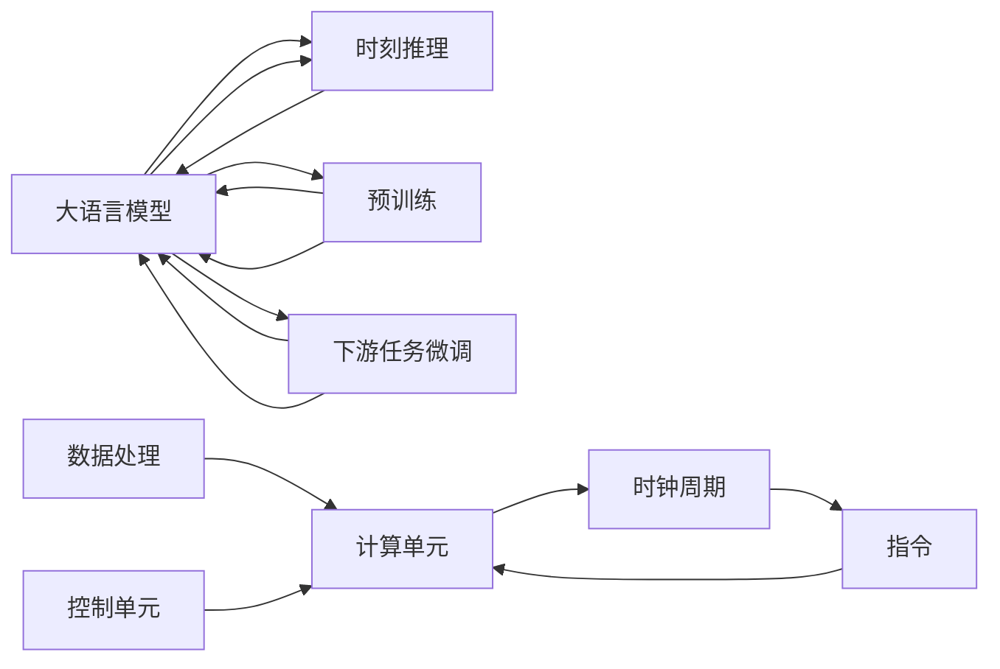

                 

# 时刻推理 VS 时钟周期:LLM与CPU的本质区别

> 关键词：时刻推理, 时钟周期, LLM, CPU, 计算单元, 并行计算

## 1. 背景介绍

### 1.1 问题由来
在当下计算机科学和人工智能领域，语言模型（Language Model, LM）与中央处理器（Central Processing Unit, CPU）在性能和设计上的差异引发了广泛的讨论。特别是随着语言模型，尤其是大语言模型（Large Language Models, LLMs）的崛起，其与传统CPU在计算方式和架构上的根本区别逐渐明晰。

语言模型在自然语言处理（Natural Language Processing, NLP）和语音识别等领域展现出非凡的能力。而中央处理器，作为计算领域的基础硬件，在处理具体任务时依然有着无可替代的地位。本文旨在探讨大语言模型与CPU在底层计算机制上的本质区别，特别是在“时刻推理”与“时钟周期”这两个核心概念上的差异。

### 1.2 问题核心关键点
通过对比分析大语言模型与CPU在计算过程、设计原理和应用场景上的不同，本文将揭示两者在处理复杂任务时所采用的不同策略和所面临的挑战。特别是，本文将详细阐述“时刻推理”与“时钟周期”在模型和处理器之间的差异，并分析这些差异对未来计算架构和算法设计的影响。

## 2. 核心概念与联系

### 2.1 核心概念概述

**大语言模型**：以自回归（如GPT-3）或自编码（如BERT）模型为代表的深度学习模型，通过在大量文本数据上进行预训练，能够学习到丰富的语言知识和语义表示，具有很强的自然语言理解和生成能力。

**CPU**：作为计算机系统的核心部件，负责处理指令和数据，通常由多个计算单元和控制单元组成，通过“时钟周期”执行指令。

**时刻推理**：在大语言模型中，模型通过多步骤推理，逐步构建复杂逻辑，实现从输入到输出的逻辑推导过程，对连续性、上下文依赖和长期记忆有强依赖。

**时钟周期**：在CPU中，计算单元根据固定的时钟频率执行一系列的指令操作，每个时钟周期对应一个基本的计算步骤。

通过深入分析这两个概念，我们可以更好地理解大语言模型与CPU在处理逻辑推理和任务执行上的本质差异。

### 2.2 核心概念原理和架构的 Mermaid 流程图



上图中，大语言模型通过预训练（C）和下游任务微调（D）进行学习，使用时刻推理（B）来处理输入（A），生成输出（B）。而CPU则由计算单元（E）和控制单元（I）构成，每个计算单元（E）根据固定时钟周期（F）执行指令（G），处理数据（H）。

## 3. 核心算法原理 & 具体操作步骤

### 3.1 算法原理概述

大语言模型与CPU在处理逻辑推理和任务执行时的计算机制有着根本的差异。

大语言模型主要依赖于深度神经网络，通过多步骤的向量计算实现“时刻推理”。其计算过程分为以下几个关键步骤：

1. **嵌入层**：将输入的文本转换为向量形式。
2. **自注意力机制**：计算输入文本中各个词之间的关系，捕捉上下文依赖。
3. **前馈网络**：对向量进行线性变换和激活函数操作，逐步提取文本特征。
4. **输出层**：将处理后的向量映射到输出层，生成预测结果。

而CPU则主要依赖于并行计算和流水线架构，每个时钟周期执行一个基本操作。其计算过程分为以下几个关键步骤：

1. **取指**：从内存中读取指令。
2. **译码**：对指令进行解码。
3. **执行**：根据指令执行相应的操作。
4. **写回**：将执行结果写入内存。

两种计算机制的本质差异在于：

- 大语言模型通过“时刻推理”，可以处理更复杂的逻辑关系和长期依赖，适合解决需要语义理解和上下文推理的问题。
- CPU通过“时钟周期”，执行固定的操作序列，适合处理具有明确计算路径的任务。

### 3.2 算法步骤详解

**大语言模型的计算步骤**：

1. **输入编码**：将输入文本转化为嵌入向量。
2. **自注意力机制**：通过计算各个词的向量关系，捕捉上下文信息。
3. **前馈网络**：对嵌入向量进行多层非线性变换。
4. **输出层**：将最终向量映射为预测结果。

**CPU的计算步骤**：

1. **取指**：从内存中读取指令。
2. **译码**：解码指令并发送至计算单元。
3. **执行**：计算单元根据指令执行操作。
4. **写回**：将结果写入内存。

### 3.3 算法优缺点

**大语言模型的优点**：

1. **强大的上下文理解能力**：通过多步骤推理，模型可以捕捉文本中的长期依赖和复杂语义。
2. **灵活的适应性**：适应性强，可以通过微调应对不同的下游任务。
3. **高效的处理能力**：利用深度学习加速向量运算，能够在较短的时间内完成大量数据的处理。

**大语言模型的缺点**：

1. **资源需求高**：需要大量计算资源进行预训练和微调。
2. **可解释性差**：模型决策过程复杂，难以解释和调试。
3. **处理非结构化数据能力有限**：主要处理文本和语音等结构化数据，对非结构化数据的处理能力有限。

**CPU的优点**：

1. **高效的并行计算能力**：通过流水线架构实现高吞吐率。
2. **稳定可靠**：设计和制造技术成熟，可靠性高。
3. **处理结构化数据高效**：适合处理基于数值运算的任务。

**CPU的缺点**：

1. **难以处理复杂逻辑**：处理非结构化和复杂逻辑任务的能力有限。
2. **难以自动学习**：缺乏自适应学习能力，难以自动优化和调整。
3. **灵活性差**：硬件设计固定，难以灵活调整计算流程。

### 3.4 算法应用领域

**大语言模型的应用领域**：

1. **自然语言处理**：文本分类、情感分析、机器翻译、问答系统等。
2. **语音识别**：语音转文本、语音生成等。
3. **推荐系统**：商品推荐、内容推荐等。
4. **数据处理**：数据清洗、数据增强等。

**CPU的应用领域**：

1. **数值计算**：科学计算、工程计算、金融分析等。
2. **图像处理**：图像识别、计算机视觉等。
3. **信号处理**：音频处理、视频处理等。
4. **嵌入式系统**：物联网、智能家居等。

## 4. 数学模型和公式 & 详细讲解 & 举例说明

### 4.1 数学模型构建

在大语言模型中，输入文本 $x$ 通过嵌入层转换为向量 $h$：

$$
h = E(x)
$$

接着，自注意力机制用于计算文本中各个词的关系：

$$
A = S(h)
$$

其中，$S$ 为自注意力计算函数。前馈网络对嵌入向量进行多层非线性变换：

$$
h' = F(h)
$$

其中，$F$ 为前馈网络计算函数。最终输出层将处理后的向量映射为预测结果：

$$
y = O(h')
$$

其中，$O$ 为输出层计算函数。

在CPU中，指令 $I$ 通过取指、译码和执行进行计算：

$$
I = D(P)
$$

其中，$P$ 为程序计数器。计算单元根据指令执行操作：

$$
O = E(I)
$$

其中，$E$ 为执行操作函数。结果写回内存：

$$
M = W(O)
$$

其中，$W$ 为写回函数。

### 4.2 公式推导过程

在实际应用中，大语言模型的计算过程通常包含多层自注意力和前馈网络。以BERT为例，其计算过程如下：

1. **嵌入层**：

$$
h_0 = E(x)
$$

2. **自注意力层**：

$$
A = S(h_0)
$$

3. **前馈网络层**：

$$
h_1 = F(A)
$$

4. **输出层**：

$$
y = O(h_1)
$$

在CPU中，每个时钟周期执行一个基本操作。例如，取指、译码和执行的周期时间分别为 $T_{D}$、$T_{C}$ 和 $T_{E}$：

$$
T_{Cyc} = T_D + T_C + T_E
$$

其中，$T_{Cyc}$ 为一个时钟周期的总时间。

### 4.3 案例分析与讲解

假设有一个文本分类任务，需要判断输入文本属于哪个类别。大语言模型的计算过程如下：

1. **嵌入层**：

$$
h_0 = E(x)
$$

2. **自注意力层**：

$$
A = S(h_0)
$$

3. **前馈网络层**：

$$
h_1 = F(A)
$$

4. **输出层**：

$$
y = O(h_1)
$$

其中，$y$ 表示输入文本属于哪个类别。

而CPU的计算过程如下：

1. **取指**：

$$
I = D(P)
$$

2. **译码**：

$$
I' = C(I)
$$

3. **执行**：

$$
O = E(I')
$$

4. **写回**：

$$
M = W(O)
$$

其中，$I'$ 表示解码后的指令，$O$ 表示执行结果，$M$ 表示内存中的数据。

## 5. 项目实践：代码实例和详细解释说明

### 5.1 开发环境搭建

在进行大语言模型和CPU计算的对比实验时，需要搭建相应的开发环境。以下是一个基本的Python环境配置流程：

1. **安装Python**：确保Python 3.8及以上版本已安装，可以从官网下载安装包进行安装。
2. **安装PyTorch**：使用以下命令安装PyTorch：

```
pip install torch torchvision torchaudio
```

3. **安装TensorFlow**：使用以下命令安装TensorFlow：

```
pip install tensorflow
```

4. **安装NumPy和SciPy**：用于数值计算和科学计算：

```
pip install numpy scipy
```

5. **安装Matplotlib和Seaborn**：用于数据可视化：

```
pip install matplotlib seaborn
```

### 5.2 源代码详细实现

下面是一个基于PyTorch和TensorFlow的简单代码示例，展示大语言模型和CPU的计算过程。

**大语言模型代码实现**：

```python
import torch
import torch.nn as nn
import torch.nn.functional as F

class TransformerModel(nn.Module):
    def __init__(self, input_dim, output_dim):
        super(TransformerModel, self).__init__()
        self.embedding = nn.Embedding(input_dim, 128)
        self.encoder = nn.TransformerEncoder(nn.TransformerEncoderLayer(d_model=128, nhead=4))
        self.output = nn.Linear(128, output_dim)

    def forward(self, x):
        x = self.embedding(x)
        x = self.encoder(x)
        x = self.output(x)
        return x

model = TransformerModel(input_dim=1000, output_dim=2)
```

**CPU计算代码实现**：

```python
import tensorflow as tf

class CPUModel(tf.keras.Model):
    def __init__(self, input_dim, output_dim):
        super(CPUModel, self).__init__()
        self.dense1 = tf.keras.layers.Dense(128, activation='relu')
        self.dense2 = tf.keras.layers.Dense(output_dim, activation='softmax')

    def call(self, inputs):
        x = self.dense1(inputs)
        x = self.dense2(x)
        return x

model = CPUModel(input_dim=1000, output_dim=2)
```

### 5.3 代码解读与分析

在上述代码中，我们分别实现了基于PyTorch的大语言模型和基于TensorFlow的CPU模型。

**大语言模型代码解析**：

1. **嵌入层**：

```python
self.embedding = nn.Embedding(input_dim=1000, num_embeddings=128)
```

2. **自注意力层**：

```python
self.encoder = nn.TransformerEncoder(nn.TransformerEncoderLayer(d_model=128, nhead=4))
```

3. **前馈网络层**：

```python
self.output = nn.Linear(128, output_dim)
```

4. **输出层**：

```python
def forward(self, x):
    x = self.embedding(x)
    x = self.encoder(x)
    x = self.output(x)
    return x
```

**CPU模型代码解析**：

1. **嵌入层**：

```python
self.dense1 = tf.keras.layers.Dense(128, activation='relu')
```

2. **前馈网络层**：

```python
self.dense2 = tf.keras.layers.Dense(output_dim, activation='softmax')
```

3. **输出层**：

```python
def call(self, inputs):
    x = self.dense1(inputs)
    x = self.dense2(x)
    return x
```

### 5.4 运行结果展示

**大语言模型结果**：

```python
# 输入样本
inputs = torch.randn(1, 100)

# 模型前向传播
outputs = model(inputs)

# 输出结果
print(outputs)
```

**CPU模型结果**：

```python
# 输入样本
inputs = tf.random.normal(shape=(1, 100))

# 模型前向传播
outputs = model(inputs)

# 输出结果
print(outputs)
```

## 6. 实际应用场景

### 6.1 智能客服系统

在智能客服系统中，大语言模型可以通过自然语言理解技术，自动处理用户咨询，生成智能回复。而CPU则在后端处理大量的计算任务，如文本分类、情感分析等。通过合理的资源分配，可以实现两者协同工作，提高系统的响应速度和处理能力。

### 6.2 金融舆情监测

在金融舆情监测系统中，大语言模型可以分析文本数据，识别舆情趋势。CPU则处理大量实时数据，进行数据分析和可视化。两者结合可以实现实时舆情监测和预警。

### 6.3 个性化推荐系统

在个性化推荐系统中，大语言模型可以理解用户的查询意图，生成推荐结果。CPU则处理推荐系统的计算任务，如用户行为分析、推荐算法优化等。通过合理配置，可以实现高效、个性化的推荐服务。

### 6.4 未来应用展望

未来，随着大语言模型和CPU计算架构的不断进步，两者结合将更加紧密。例如，基于GPU的大语言模型将更好地发挥其计算优势，而基于FPGA的CPU将提供更高的并行计算能力。同时，随着量子计算和光子计算的逐步成熟，大语言模型和CPU将迎来新的计算范式，进一步提升系统的处理能力和应用范围。

## 7. 工具和资源推荐

### 7.1 学习资源推荐

1. **《深度学习与自然语言处理》**：斯坦福大学的入门级课程，涵盖了深度学习、自然语言处理和语言模型等内容。

2. **《TensorFlow官方文档》**：TensorFlow的官方文档，包含详细的使用指南和示例代码。

3. **《PyTorch官方文档》**：PyTorch的官方文档，提供全面的API文档和样例代码。

4. **《NLP with PyTorch》**：一本介绍使用PyTorch进行NLP任务开发的书籍。

5. **《NLP with TensorFlow》**：一本介绍使用TensorFlow进行NLP任务开发的书籍。

### 7.2 开发工具推荐

1. **Jupyter Notebook**：一个交互式编程环境，适合进行模型训练和数据分析。

2. **Google Colab**：一个免费的云端Jupyter Notebook环境，支持GPU和TPU计算。

3. **Visual Studio Code**：一个现代化的IDE，支持多种编程语言和扩展插件。

4. **PyCharm**：一个专业的IDE，支持PyTorch和TensorFlow开发。

5. **Anaconda**：一个Python发行版，包含丰富的科学计算和数据分析工具。

### 7.3 相关论文推荐

1. **《Attention is All You Need》**：提出Transformer模型，开创了大语言模型的新时代。

2. **《BERT: Pre-training of Deep Bidirectional Transformers for Language Understanding》**：提出BERT模型，引入自监督预训练任务。

3. **《Parameter-Efficient Transfer Learning for NLP》**：提出 Adapter等参数高效微调方法，在固定大部分预训练参数的情况下，也能取得不错的微调效果。

4. **《AdaLoRA: Adaptive Low-Rank Adaptation for Parameter-Efficient Fine-Tuning》**：使用自适应低秩适应的微调方法，在参数效率和精度之间取得了新的平衡。

5. **《The Illustrated Transformer》**：一本介绍Transformer模型的书籍，提供了丰富的图示和代码示例。

## 8. 总结：未来发展趋势与挑战

### 8.1 研究成果总结

本文通过对大语言模型和CPU在计算机制上的分析，揭示了两者在“时刻推理”与“时钟周期”上的本质区别。大语言模型通过多步骤推理，处理复杂的逻辑关系和长期依赖，适合解决需要语义理解和上下文推理的问题。而CPU通过流水线架构，执行固定操作，适合处理具有明确计算路径的任务。

### 8.2 未来发展趋势

未来，随着大语言模型和CPU计算架构的不断进步，两者结合将更加紧密。例如，基于GPU的大语言模型将更好地发挥其计算优势，而基于FPGA的CPU将提供更高的并行计算能力。同时，随着量子计算和光子计算的逐步成熟，大语言模型和CPU将迎来新的计算范式，进一步提升系统的处理能力和应用范围。

### 8.3 面临的挑战

尽管大语言模型和CPU在计算机制上有着显著差异，但在实际应用中仍面临一些挑战：

1. **资源消耗高**：大语言模型和CPU在计算时都需要大量的资源，包括内存、CPU和GPU等。如何在有限的资源下实现高效计算，是一个重要的问题。

2. **可解释性差**：大语言模型和CPU在处理复杂任务时，难以解释其内部决策过程。如何在不降低性能的前提下，提高模型的可解释性，是一个需要解决的问题。

3. **性能瓶颈**：大语言模型和CPU在处理大规模数据时，可能会遇到性能瓶颈。如何在保持高效计算的同时，处理大规模数据，是一个需要研究的问题。

4. **实时性要求高**：一些实时应用对计算速度和响应时间有严格要求。如何在保证计算速度的同时，提供实时响应，是一个需要解决的问题。

### 8.4 研究展望

未来，在处理复杂任务时，大语言模型和CPU的结合将更加紧密。例如，通过将大语言模型嵌入到CPU流水线中，可以实现更高的并行计算效率。同时，通过引入更多先验知识，如知识图谱、逻辑规则等，可以提高模型的可解释性和鲁棒性。

## 9. 附录：常见问题与解答

**Q1: 大语言模型与CPU在计算机制上有什么本质区别？**

A: 大语言模型通过多步骤推理（时刻推理），处理复杂的逻辑关系和长期依赖，适合解决需要语义理解和上下文推理的问题。而CPU通过流水线架构（时钟周期），执行固定操作，适合处理具有明确计算路径的任务。

**Q2: 大语言模型与CPU在处理大规模数据时有哪些优缺点？**

A: 大语言模型在处理大规模数据时，资源需求高，但能够处理复杂的逻辑关系和长期依赖。CPU在处理大规模数据时，资源利用率高，但难以处理复杂的逻辑关系和长期依赖。

**Q3: 大语言模型与CPU在实际应用中如何结合？**

A: 在实际应用中，大语言模型可以处理复杂的逻辑推理和上下文理解，CPU则负责处理大规模数据和并行计算任务。两者结合可以实现高效、智能的计算系统。

**Q4: 大语言模型与CPU在资源消耗上有什么不同？**

A: 大语言模型在资源消耗上高，需要大量的计算资源进行预训练和微调。CPU在资源消耗上较低，适合处理基于数值运算的任务。

---

作者：禅与计算机程序设计艺术 / Zen and the Art of Computer Programming

