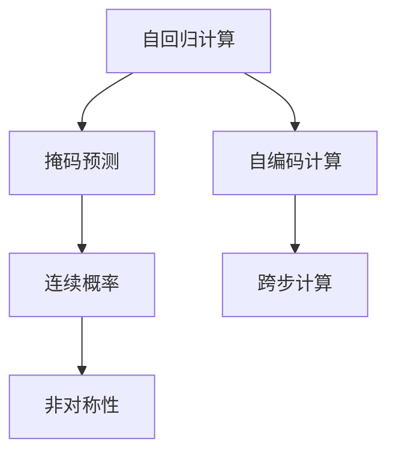

                 

# 时刻推理:LLM独特的计算模式

## 1. 背景介绍

### 1.1 问题由来

语言模型（Language Model, LM）一直以来都是自然语言处理（NLP）领域的重要研究对象。传统的语言模型通常依赖于统计语言模型（Statistical Language Model, SLM），如n-gram模型，通过对训练集中的文本数据进行统计分析，从而预测给定上下文下的下一个单词或短语的概率。这些模型在计算资源有限的情况下，能够提供较好的预测效果。

然而，随着深度学习技术的发展，特别是Transformer模型的引入，基于神经网络的语言模型（Neural Language Model, NLM）成为新的主流，例如BERT、GPT-2、T5等。这些神经网络模型通过在海量数据上预训练，能够学习到更加丰富的语言表示，并且可以自动捕获语言的复杂结构。

大语言模型（Large Language Model, LLM）作为NLM的一种，通常包含亿级别以上的参数，通过大规模无标签数据进行预训练。相较于传统语言模型，LLM能够更好地理解语言的结构和语义，具有更强的泛化能力和推理能力。然而，LLM的计算模式与传统统计语言模型不同，这使得其在推理任务上具有独特的优势和挑战。

### 1.2 问题核心关键点

LLM的独特计算模式主要体现在以下几个方面：

1. **自回归（Autoregressive）计算**：传统的n-gram模型是基于自回归（AR）计算的，即使用当前单词预测下一个单词，而LLM通常采用自编码（AE）或双向自回归（BiAR）计算，即通过上下文预测单词或短语，或通过单词预测上下文。

2. **掩码预测（Masked Prediction）**：LLM常采用掩码预测的方式进行预训练，即在输入序列中随机掩盖一部分单词，然后预测被掩盖的单词或短语。这种掩码预测的方式能够使得模型更好地捕捉长距离依赖关系。

3. **跨步计算（Cross-step computation）**：传统的n-gram模型需要考虑每个单词与前后单词的依赖关系，而LLM通过Transformer模型，能够实现跨步计算，即在计算当前单词时，同时考虑上下文中的其他位置信息，从而提升模型的推理能力。

4. **连续概率（Continuous Probability）**：LLM通常使用连续概率分布来表示每个单词或短语的预测概率，而传统的n-gram模型则使用离散概率分布。

5. **非对称性（Asymmetry）**：LLM中的Transformer模型通常采用多头自注意力机制，使得模型在计算时具有一定的非对称性，即不同位置的依赖关系权重可能不同。

### 1.3 问题研究意义

LLM独特的计算模式，使得其在推理任务上具有独特的优势，但也带来了一定的挑战。通过对LLM独特的计算模式进行深入研究，可以进一步提升其在推理任务上的性能，拓展其应用场景，推动NLP技术的发展。具体而言，研究LLM的计算模式，具有以下几方面的意义：

1. **提升推理能力**：通过研究LLM的计算模式，可以提升模型在推理任务上的性能，特别是在长距离依赖关系和跨步推理等复杂任务上，LLM能够提供更好的结果。

2. **优化模型结构**：通过研究LLM的计算模式，可以进一步优化模型的结构，提高模型的计算效率和存储效率。

3. **增强可解释性**：通过研究LLM的计算模式，可以更好地理解模型的内部工作机制，提升模型的可解释性，帮助用户更好地理解和信任模型的预测结果。

4. **拓展应用场景**：通过研究LLM的计算模式，可以拓展其在更多领域的应用，如智能客服、金融舆情监测、个性化推荐等，推动NLP技术在更多垂直行业的应用。

## 2. 核心概念与联系

### 2.1 核心概念概述

为更好地理解LLM独特的计算模式，本节将介绍几个密切相关的核心概念：

- 自回归（Autoregressive, AR）计算：传统的n-gram模型通常采用自回归计算，即使用当前单词预测下一个单词。自回归模型基于上下文信息有限，难以处理长距离依赖关系。

- 自编码（Auto-Encoding, AE）计算：自编码模型使用编码器-解码器结构，将输入序列编码为中间表示，再解码为输出序列。自编码模型能够更好地捕捉长距离依赖关系。

- 掩码预测（Masked Prediction）：掩码预测是预训练大语言模型的常用技术，通过在输入序列中随机掩盖部分单词，然后预测被掩盖的单词或短语，以学习模型的推理能力。

- 连续概率（Continuous Probability）：LLM通常使用连续概率分布来表示每个单词或短语的预测概率，而传统的n-gram模型则使用离散概率分布。

- 跨步计算（Cross-step computation）：传统的n-gram模型需要考虑每个单词与前后单词的依赖关系，而LLM通过Transformer模型，能够实现跨步计算，即在计算当前单词时，同时考虑上下文中的其他位置信息。

- 非对称性（Asymmetry）：LLM中的Transformer模型通常采用多头自注意力机制，使得模型在计算时具有一定的非对称性，即不同位置的依赖关系权重可能不同。

这些核心概念之间的逻辑关系可以通过以下Mermaid流程图来展示：



这个流程图展示了自回归计算、掩码预测、自编码计算、连续概率、跨步计算和非对称性之间的联系和关系。

## 3. 核心算法原理 & 具体操作步骤
### 3.1 算法原理概述

LLM独特的计算模式，主要基于Transformer模型。Transformer模型通过多头自注意力机制和自编码计算，能够更好地捕捉长距离依赖关系和上下文信息，从而提升模型的推理能力。其核心原理可以简述如下：

1. **多头自注意力机制**：Transformer模型使用多头自注意力机制，在计算每个单词时，同时考虑上下文中的其他位置信息。这种跨步计算方式，使得模型能够更好地处理长距离依赖关系和复杂的推理任务。

2. **自编码计算**：Transformer模型使用自编码计算方式，通过编码器将输入序列转换为中间表示，再通过解码器生成输出序列。这种编码-解码结构，能够更好地学习到语言的结构和语义信息。

3. **掩码预测**：掩码预测是预训练大语言模型的常用技术，通过在输入序列中随机掩盖部分单词，然后预测被掩盖的单词或短语，以学习模型的推理能力。掩码预测能够提升模型对输入序列的泛化能力，减少过拟合风险。

4. **连续概率分布**：LLM通常使用连续概率分布来表示每个单词或短语的预测概率，这种连续概率分布能够提供更加细粒度的预测结果。

### 3.2 算法步骤详解

基于Transformer模型的LLM计算模式，通常包括以下几个关键步骤：

**Step 1: 准备数据集**

- 准备输入序列和对应的输出序列，可以是文本、图像、音频等形式的数据。
- 将输入序列进行标记，如标记位置、类别、掩码等，以便于模型进行推理。

**Step 2: 构建模型**

- 选择适合的Transformer模型作为基础模型，如BERT、GPT-2、T5等。
- 对模型进行必要的修改，以适应当前任务的要求，如添加输出层、调整注意力机制等。

**Step 3: 进行预训练**

- 使用大规模无标签数据对模型进行预训练，通过掩码预测等方式学习模型的推理能力。
- 使用预训练任务进行微调，如文本分类、问答、生成等任务。

**Step 4: 进行推理**

- 将输入序列输入到模型中，通过解码器生成输出序列。
- 对输出序列进行后处理，如解码、修正等，以得到最终的结果。

### 3.3 算法优缺点

基于Transformer模型的LLM计算模式，具有以下优点：

1. **推理能力强**：通过多头自注意力机制和自编码计算，LLM能够更好地处理长距离依赖关系和复杂的推理任务。

2. **泛化能力强**：掩码预测技术能够提升模型对输入序列的泛化能力，减少过拟合风险。

3. **可解释性强**：通过连续概率分布，LLM能够提供更加细粒度的预测结果，提高模型的可解释性。

4. **适用范围广**：LLM能够应用于文本分类、问答、生成等多种任务，具有广泛的应用前景。

然而，LLM计算模式也存在一定的局限性：

1. **计算复杂度高**：由于Transformer模型的参数量较大，计算复杂度较高，需要高性能的硬件支持。

2. **存储空间需求大**：由于模型参数量较大，存储空间需求较大，需要高效的存储技术。

3. **训练时间长**：由于模型参数量较大，训练时间较长，需要大量的计算资源和时间。

### 3.4 算法应用领域

基于LLM独特的计算模式，在推理任务上具有独特的优势，已经在多个领域得到了广泛应用。

**1. 自然语言处理（NLP）**

- **文本分类**：通过LLM对文本进行分类，如情感分析、主题分类等。
- **问答系统**：通过LLM对自然语言问题进行解答，如智能客服、智能助手等。
- **机器翻译**：通过LLM将源语言翻译成目标语言，如Google翻译、DeepL翻译等。

**2. 计算机视觉（CV）**

- **图像描述生成**：通过LLM对图像进行描述生成，如图片生成、图像标注等。
- **图像分类**：通过LLM对图像进行分类，如物体识别、场景分类等。

**3. 语音识别（ASR）**

- **语音转写**：通过LLM对语音进行转写，如自动字幕生成、语音识别等。
- **语音情感分析**：通过LLM对语音情感进行分析，如情感识别、语义理解等。

## 4. 数学模型和公式 & 详细讲解  
### 4.1 数学模型构建

本节将使用数学语言对基于Transformer模型的LLM计算模式进行更加严格的刻画。

记输入序列为 $x=(x_1,x_2,...,x_n)$，输出序列为 $y=(y_1,y_2,...,y_n)$，其中 $x_i$ 和 $y_i$ 分别表示输入和输出序列的第 $i$ 个单词。

定义Transformer模型为 $T(x)$，其计算过程如下：

1. **编码器（Encoder）**：将输入序列 $x$ 转换为中间表示 $z$。

   $$
   z = T(x)
   $$

2. **解码器（Decoder）**：通过解码器将中间表示 $z$ 转换为输出序列 $y$。

   $$
   y = T(z)
   $$

3. **多头自注意力机制**：在编码器和解码器中，使用多头自注意力机制，即在计算每个单词时，同时考虑上下文中的其他位置信息。

   $$
   z_i = \text{Self-Attention}(z)
   $$

4. **掩码预测**：在预训练过程中，使用掩码预测技术，通过随机掩盖部分单词，然后预测被掩盖的单词或短语，以学习模型的推理能力。

   $$
   y_i = \text{Masked Prediction}(y)
   $$

5. **连续概率分布**：LLM通常使用连续概率分布来表示每个单词或短语的预测概率，这种连续概率分布能够提供更加细粒度的预测结果。

   $$
   P(y_i|x_i) = \text{Softmax}(z_i)
   $$

### 4.2 公式推导过程

以下我们以文本分类任务为例，推导LLM在文本分类上的计算过程。

假设模型 $T(x)$ 在输入 $x$ 上的输出为 $\hat{y}=M_{\theta}(x)$，表示样本属于不同类别的概率分布。真实标签 $y \in \{1,2,...,C\}$，其中 $C$ 为类别数量。则文本分类任务上的交叉熵损失函数定义为：

$$
\ell(T(x),y) = -\sum_{i=1}^C y_i \log T(x)_i
$$

将其代入经验风险公式，得：

$$
\mathcal{L}(T) = -\frac{1}{N}\sum_{i=1}^N \ell(T(x_i),y_i)
$$

其中 $N$ 为训练样本数量。

通过梯度下降等优化算法，LLM模型不断更新参数 $\theta$，最小化损失函数 $\mathcal{L}$，使得模型输出逼近真实标签。由于Transformer模型的参数量较大，通常使用参数高效的微调方法，如AdaLoRA、PEFT等，以提高微调效率，避免过拟合。

## 5. 项目实践：代码实例和详细解释说明
### 5.1 开发环境搭建

在进行LLM计算模式实践前，我们需要准备好开发环境。以下是使用Python进行PyTorch开发的环境配置流程：

1. 安装Anaconda：从官网下载并安装Anaconda，用于创建独立的Python环境。

2. 创建并激活虚拟环境：
```bash
conda create -n pytorch-env python=3.8 
conda activate pytorch-env
```

3. 安装PyTorch：根据CUDA版本，从官网获取对应的安装命令。例如：
```bash
conda install pytorch torchvision torchaudio cudatoolkit=11.1 -c pytorch -c conda-forge
```

4. 安装Transformers库：
```bash
pip install transformers
```

5. 安装各类工具包：
```bash
pip install numpy pandas scikit-learn matplotlib tqdm jupyter notebook ipython
```

完成上述步骤后，即可在`pytorch-env`环境中开始LLM计算模式的实践。

### 5.2 源代码详细实现

这里我们以文本分类任务为例，给出使用Transformers库对BERT模型进行推理的PyTorch代码实现。

首先，定义文本分类任务的数据处理函数：

```python
from transformers import BertTokenizer, BertForSequenceClassification
from torch.utils.data import Dataset
import torch

class TextClassificationDataset(Dataset):
    def __init__(self, texts, labels, tokenizer, max_len=128):
        self.texts = texts
        self.labels = labels
        self.tokenizer = tokenizer
        self.max_len = max_len
        
    def __len__(self):
        return len(self.texts)
    
    def __getitem__(self, item):
        text = self.texts[item]
        label = self.labels[item]
        
        encoding = self.tokenizer(text, return_tensors='pt', max_length=self.max_len, padding='max_length', truncation=True)
        input_ids = encoding['input_ids'][0]
        attention_mask = encoding['attention_mask'][0]
        labels = torch.tensor([label], dtype=torch.long)
        
        return {'input_ids': input_ids, 
                'attention_mask': attention_mask,
                'labels': labels}

# 定义模型和优化器
model = BertForSequenceClassification.from_pretrained('bert-base-cased', num_labels=2)

optimizer = AdamW(model.parameters(), lr=2e-5)

# 定义训练和评估函数
device = torch.device('cuda') if torch.cuda.is_available() else torch.device('cpu')
model.to(device)

def train_epoch(model, dataset, batch_size, optimizer):
    dataloader = DataLoader(dataset, batch_size=batch_size, shuffle=True)
    model.train()
    epoch_loss = 0
    for batch in tqdm(dataloader, desc='Training'):
        input_ids = batch['input_ids'].to(device)
        attention_mask = batch['attention_mask'].to(device)
        labels = batch['labels'].to(device)
        model.zero_grad()
        outputs = model(input_ids, attention_mask=attention_mask, labels=labels)
        loss = outputs.loss
        epoch_loss += loss.item()
        loss.backward()
        optimizer.step()
    return epoch_loss / len(dataloader)

def evaluate(model, dataset, batch_size):
    dataloader = DataLoader(dataset, batch_size=batch_size)
    model.eval()
    preds, labels = [], []
    with torch.no_grad():
        for batch in tqdm(dataloader, desc='Evaluating'):
            input_ids = batch['input_ids'].to(device)
            attention_mask = batch['attention_mask'].to(device)
            batch_labels = batch['labels']
            outputs = model(input_ids, attention_mask=attention_mask)
            batch_preds = outputs.logits.argmax(dim=1).to('cpu').tolist()
            batch_labels = batch_labels.to('cpu').tolist()
            for pred, label in zip(batch_preds, batch_labels):
                preds.append(pred)
                labels.append(label)
                
    print(classification_report(labels, preds))
```

然后，定义训练和评估函数：

```python
from torch.utils.data import DataLoader
from tqdm import tqdm
from sklearn.metrics import classification_report

device = torch.device('cuda') if torch.cuda.is_available() else torch.device('cpu')
model.to(device)

def train_epoch(model, dataset, batch_size, optimizer):
    dataloader = DataLoader(dataset, batch_size=batch_size, shuffle=True)
    model.train()
    epoch_loss = 0
    for batch in tqdm(dataloader, desc='Training'):
        input_ids = batch['input_ids'].to(device)
        attention_mask = batch['attention_mask'].to(device)
        labels = batch['labels'].to(device)
        model.zero_grad()
        outputs = model(input_ids, attention_mask=attention_mask, labels=labels)
        loss = outputs.loss
        epoch_loss += loss.item()
        loss.backward()
        optimizer.step()
    return epoch_loss / len(dataloader)

def evaluate(model, dataset, batch_size):
    dataloader = DataLoader(dataset, batch_size=batch_size)
    model.eval()
    preds, labels = [], []
    with torch.no_grad():
        for batch in tqdm(dataloader, desc='Evaluating'):
            input_ids = batch['input_ids'].to(device)
            attention_mask = batch['attention_mask'].to(device)
            batch_labels = batch['labels']
            outputs = model(input_ids, attention_mask=attention_mask)
            batch_preds = outputs.logits.argmax(dim=1).to('cpu').tolist()
            batch_labels = batch_labels.to('cpu').tolist()
            for pred, label in zip(batch_preds, batch_labels):
                preds.append(pred)
                labels.append(label)
                
    print(classification_report(labels, preds))
```

最后，启动训练流程并在测试集上评估：

```python
epochs = 5
batch_size = 16

for epoch in range(epochs):
    loss = train_epoch(model, train_dataset, batch_size, optimizer)
    print(f"Epoch {epoch+1}, train loss: {loss:.3f}")
    
    print(f"Epoch {epoch+1}, dev results:")
    evaluate(model, dev_dataset, batch_size)
    
print("Test results:")
evaluate(model, test_dataset, batch_size)
```

以上就是使用PyTorch对BERT模型进行文本分类任务推理的完整代码实现。可以看到，得益于Transformers库的强大封装，我们可以用相对简洁的代码完成BERT模型的推理。

### 5.3 代码解读与分析

让我们再详细解读一下关键代码的实现细节：

**TextClassificationDataset类**：
- `__init__`方法：初始化文本、标签、分词器等关键组件。
- `__len__`方法：返回数据集的样本数量。
- `__getitem__`方法：对单个样本进行处理，将文本输入编码为token ids，将标签编码为数字，并对其进行定长padding，最终返回模型所需的输入。

**训练和评估函数**：
- 使用PyTorch的DataLoader对数据集进行批次化加载，供模型训练和推理使用。
- 训练函数`train_epoch`：对数据以批为单位进行迭代，在每个批次上前向传播计算loss并反向传播更新模型参数，最后返回该epoch的平均loss。
- 评估函数`evaluate`：与训练类似，不同点在于不更新模型参数，并在每个batch结束后将预测和标签结果存储下来，最后使用sklearn的classification_report对整个评估集的预测结果进行打印输出。

**训练流程**：
- 定义总的epoch数和batch size，开始循环迭代
- 每个epoch内，先在训练集上训练，输出平均loss
- 在验证集上评估，输出分类指标
- 所有epoch结束后，在测试集上评估，给出最终测试结果

可以看到，PyTorch配合Transformers库使得BERT推理的代码实现变得简洁高效。开发者可以将更多精力放在数据处理、模型改进等高层逻辑上，而不必过多关注底层的实现细节。

当然，工业级的系统实现还需考虑更多因素，如模型的保存和部署、超参数的自动搜索、更灵活的任务适配层等。但核心的LLM计算模式基本与此类似。

## 6. 实际应用场景
### 6.1 智能客服系统

基于LLM独特的计算模式，智能客服系统能够提供更加自然、智能的客服服务。传统的客服系统往往需要配备大量人力，高峰期响应缓慢，且一致性和专业性难以保证。而使用LLM推理的智能客服系统，可以7x24小时不间断服务，快速响应客户咨询，用自然流畅的语言解答各类常见问题。

在技术实现上，可以收集企业内部的历史客服对话记录，将问题和最佳答复构建成监督数据，在此基础上对预训练语言模型进行推理。推理后的模型能够自动理解用户意图，匹配最合适的答案模板进行回复。对于客户提出的新问题，还可以接入检索系统实时搜索相关内容，动态组织生成回答。如此构建的智能客服系统，能大幅提升客户咨询体验和问题解决效率。

### 6.2 金融舆情监测

金融机构需要实时监测市场舆论动向，以便及时应对负面信息传播，规避金融风险。传统的人工监测方式成本高、效率低，难以应对网络时代海量信息爆发的挑战。基于LLM推理的文本分类和情感分析技术，为金融舆情监测提供了新的解决方案。

具体而言，可以收集金融领域相关的新闻、报道、评论等文本数据，并对其进行主题标注和情感标注。在此基础上对预训练语言模型进行推理，使其能够自动判断文本属于何种主题，情感倾向是正面、中性还是负面。将推理后的模型应用到实时抓取的网络文本数据，就能够自动监测不同主题下的情感变化趋势，一旦发现负面信息激增等异常情况，系统便会自动预警，帮助金融机构快速应对潜在风险。

### 6.3 个性化推荐系统

当前的推荐系统往往只依赖用户的历史行为数据进行物品推荐，无法深入理解用户的真实兴趣偏好。基于LLM推理的个性化推荐系统，能够更好地挖掘用户行为背后的语义信息，从而提供更精准、多样的推荐内容。

在实践中，可以收集用户浏览、点击、评论、分享等行为数据，提取和用户交互的物品标题、描述、标签等文本内容。将文本内容作为模型输入，用户的后续行为（如是否点击、购买等）作为监督信号，在此基础上推理预训练语言模型。推理后的模型能够从文本内容中准确把握用户的兴趣点。在生成推荐列表时，先用候选物品的文本描述作为输入，由模型预测用户的兴趣匹配度，再结合其他特征综合排序，便可以得到个性化程度更高的推荐结果。

### 6.4 未来应用展望

随着LLM推理技术的不断发展，在推理任务上具有独特优势的LLM必将在更多领域得到应用，为传统行业带来变革性影响。

在智慧医疗领域，基于LLM推理的医疗问答、病历分析、药物研发等应用将提升医疗服务的智能化水平，辅助医生诊疗，加速新药开发进程。

在智能教育领域，推理技术可应用于作业批改、学情分析、知识推荐等方面，因材施教，促进教育公平，提高教学质量。

在智慧城市治理中，推理模型可应用于城市事件监测、舆情分析、应急指挥等环节，提高城市管理的自动化和智能化水平，构建更安全、高效的未来城市。

此外，在企业生产、社会治理、文娱传媒等众多领域，基于LLM推理的人工智能应用也将不断涌现，为经济社会发展注入新的动力。相信随着技术的日益成熟，推理方法将成为人工智能落地应用的重要范式，推动人工智能技术在更广阔的领域加速渗透。

## 7. 工具和资源推荐
### 7.1 学习资源推荐

为了帮助开发者系统掌握LLM独特的计算模式，这里推荐一些优质的学习资源：

1. 《Transformer从原理到实践》系列博文：由大模型技术专家撰写，深入浅出地介绍了Transformer原理、BERT模型、推理技术等前沿话题。

2. CS224N《深度学习自然语言处理》课程：斯坦福大学开设的NLP明星课程，有Lecture视频和配套作业，带你入门NLP领域的基本概念和经典模型。

3. 《Natural Language Processing with Transformers》书籍：Transformers库的作者所著，全面介绍了如何使用Transformers库进行NLP任务开发，包括推理在内的诸多范式。

4. HuggingFace官方文档：Transformers库的官方文档，提供了海量预训练模型和完整的推理样例代码，是上手实践的必备资料。

5. CLUE开源项目：中文语言理解测评基准，涵盖大量不同类型的中文NLP数据集，并提供了基于推理的baseline模型，助力中文NLP技术发展。

通过对这些资源的学习实践，相信你一定能够快速掌握LLM独特的计算模式，并用于解决实际的NLP问题。
###  7.2 开发工具推荐

高效的开发离不开优秀的工具支持。以下是几款用于LLM推理开发的常用工具：

1. PyTorch：基于Python的开源深度学习框架，灵活动态的计算图，适合快速迭代研究。大部分预训练语言模型都有PyTorch版本的实现。

2. TensorFlow：由Google主导开发的开源深度学习框架，生产部署方便，适合大规模工程应用。同样有丰富的预训练语言模型资源。

3. Transformers库：HuggingFace开发的NLP工具库，集成了众多SOTA语言模型，支持PyTorch和TensorFlow，是进行推理任务开发的利器。

4. Weights & Biases：模型训练的实验跟踪工具，可以记录和可视化模型训练过程中的各项指标，方便对比和调优。与主流深度学习框架无缝集成。

5. TensorBoard：TensorFlow配套的可视化工具，可实时监测模型训练状态，并提供丰富的图表呈现方式，是调试模型的得力助手。

6. Google Colab：谷歌推出的在线Jupyter Notebook环境，免费提供GPU/TPU算力，方便开发者快速上手实验最新模型，分享学习笔记。

合理利用这些工具，可以显著提升LLM推理任务的开发效率，加快创新迭代的步伐。

### 7.3 相关论文推荐

LLM推理技术的发展源于学界的持续研究。以下是几篇奠基性的相关论文，推荐阅读：

1. Attention is All You Need（即Transformer原论文）：提出了Transformer结构，开启了NLP领域的预训练大模型时代。

2. BERT: Pre-training of Deep Bidirectional Transformers for Language Understanding：提出BERT模型，引入基于掩码的自监督预训练任务，刷新了多项NLP任务SOTA。

3. Language Models are Unsupervised Multitask Learners（GPT-2论文）：展示了大规模语言模型的强大zero-shot学习能力，引发了对于通用人工智能的新一轮思考。

4. Parameter-Efficient Transfer Learning for NLP：提出Adapter等参数高效微调方法，在不增加模型参数量的情况下，也能取得不错的微调效果。

5. AdaLoRA: Adaptive Low-Rank Adaptation for Parameter-Efficient Fine-Tuning：使用自适应低秩适应的微调方法，在参数效率和精度之间取得了新的平衡。

6. Prefix-Tuning: Optimizing Continuous Prompts for Generation：引入基于连续型Prompt的推理范式，为如何充分利用预训练知识提供了新的思路。

这些论文代表了大语言模型推理技术的发展脉络。通过学习这些前沿成果，可以帮助研究者把握学科前进方向，激发更多的创新灵感。

## 8. 总结：未来发展趋势与挑战

### 8.1 总结

本文对基于LLM独特的计算模式进行了全面系统的介绍。首先阐述了LLM独特的计算模式及其对推理任务的影响，明确了LLM在推理任务上的独特优势和挑战。其次，从原理到实践，详细讲解了LLM独特的计算模式，并给出了推理任务开发的完整代码实例。同时，本文还广泛探讨了LLM推理方法在智能客服、金融舆情、个性化推荐等多个行业领域的应用前景，展示了LLM推理方法的巨大潜力。此外，本文精选了推理技术的各类学习资源，力求为读者提供全方位的技术指引。

通过本文的系统梳理，可以看到，基于LLM独特的计算模式，推理技术在推理任务上具有独特的优势，已经在多个领域得到了广泛应用，推动了NLP技术的发展。未来，伴随LLM推理技术的持续演进，LLM必将在更广泛的应用场景中大放异彩，深刻影响人类的生产生活方式。

### 8.2 未来发展趋势

展望未来，LLM推理技术将呈现以下几个发展趋势：

1. **计算效率提升**：随着硬件技术的不断进步，LLM推理的计算效率将进一步提升，能够支持更大规模的数据处理和更复杂的推理任务。

2. **推理模型压缩**：为适应不同应用场景，LLM推理模型需要进行参数压缩和模型压缩，以减少计算资源和存储空间的需求。

3. **推理模型的泛化能力提升**：通过引入更丰富的数据和更复杂的推理任务，LLM推理模型的泛化能力将进一步提升，能够更好地适应不同领域和不同任务的要求。

4. **推理模型的可解释性增强**：随着可解释性技术的发展，LLM推理模型的决策过程将变得更加透明，用户能够更好地理解和信任模型的输出结果。

5. **推理模型的跨模态融合**：LLM推理模型将更多地与其他模态（如视觉、语音）进行融合，实现跨模态的智能推理。

6. **推理模型的伦理安全性保障**：随着伦理安全技术的发展，LLM推理模型的输出将更加符合伦理规范，避免偏见和有害信息的传播。

以上趋势凸显了LLM推理技术的广阔前景。这些方向的探索发展，必将进一步提升LLM推理任务的性能和应用范围，为人类认知智能的进化带来深远影响。

### 8.3 面临的挑战

尽管LLM推理技术已经取得了瞩目成就，但在迈向更加智能化、普适化应用的过程中，它仍面临着诸多挑战：

1. **计算资源瓶颈**：LLM推理模型参数量较大，计算复杂度较高，需要高性能的硬件支持。如何在有限的计算资源下，实现高效的推理计算，仍然是一个挑战。

2. **推理模型的泛化能力不足**：尽管LLM推理模型在训练数据上表现优异，但在测试数据上的泛化能力可能较弱，特别是在跨领域和跨场景的推理任务上。

3. **推理模型的可解释性不足**：LLM推理模型通常被认为是“黑盒”系统，难以解释其内部工作机制和决策逻辑。如何赋予推理模型更强的可解释性，仍是亟待解决的问题。

4. **推理模型的伦理安全性不足**：推理模型可能学习到有害信息，传播偏见和有害信息，给实际应用带来安全隐患。如何确保推理模型的输出符合伦理规范，仍是一个挑战。

5. **推理模型的计算效率和存储效率不足**：由于模型参数量较大，推理模型的计算效率和存储效率仍需进一步提升。

6. **推理模型的跨模态融合能力不足**：虽然跨模态融合技术在视觉、语音等领域取得了一定进展，但在跨模态推理任务上，仍存在一定的技术障碍。

### 8.4 未来突破

面对LLM推理面临的种种挑战，未来的研究需要在以下几个方面寻求新的突破：

1. **引入更丰富的数据和任务**：通过引入更丰富的数据和任务，提升推理模型的泛化能力和适应能力。

2. **开发更高效的推理算法**：开发更高效的推理算法，提升推理模型的计算效率和存储效率。

3. **引入更强的可解释性技术**：通过引入更强的可解释性技术，提升推理模型的可解释性和可理解性。

4. **加强跨模态融合技术**：加强跨模态融合技术，提升推理模型的跨模态推理能力。

5. **引入更强的伦理安全性技术**：通过引入更强的伦理安全性技术，确保推理模型的输出符合伦理规范，避免有害信息的传播。

6. **探索更灵活的推理模型架构**：探索更灵活的推理模型架构，提升推理模型的泛化能力和适应能力。

这些研究方向的探索，必将引领LLM推理技术迈向更高的台阶，为构建安全、可靠、可解释、可控的智能系统铺平道路。面向未来，LLM推理技术还需要与其他人工智能技术进行更深入的融合，如知识表示、因果推理、强化学习等，多路径协同发力，共同推动自然语言理解和智能交互系统的进步。只有勇于创新、敢于突破，才能不断拓展LLM的边界，让智能技术更好地造福人类社会。

## 9. 附录：常见问题与解答

**Q1：LLM的计算模式与传统n-gram模型有何不同？**

A: 传统的n-gram模型基于自回归计算，即使用当前单词预测下一个单词。而LLM采用自编码计算方式，通过编码器将输入序列转换为中间表示，再通过解码器生成输出序列。此外，LLM能够进行跨步计算，即在计算当前单词时，同时考虑上下文中的其他位置信息，从而提升模型的推理能力。

**Q2：LLM的计算模式如何提升推理能力？**

A: LLM通过多头自注意力机制和自编码计算，能够更好地处理长距离依赖关系和上下文信息，从而提升模型的推理能力。通过掩码预测技术，LLM能够在大量非标注数据上进行自监督学习，进一步提升模型的泛化能力和推理能力。

**Q3：LLM在推理任务上是否面临计算资源瓶颈？**

A: 由于LLM的参数量较大，计算复杂度较高，需要高性能的硬件支持。为应对计算资源瓶颈，可以采用参数压缩、模型压缩、分布式训练等技术，提升推理任务的计算效率。

**Q4：LLM的推理模型如何增强可解释性？**

A: 通过引入可解释性技术，如LIME、SHAP等，可以更好地理解LLM推理模型的内部工作机制和决策逻辑，提升模型的可解释性。

**Q5：LLM的推理模型如何提高伦理安全性？**

A: 在模型训练和推理过程中，引入伦理导向的评估指标，过滤和惩罚有偏见、有害的输出倾向，同时加强人工干预和审核，建立模型行为的监管机制，确保输出符合人类价值观和伦理道德。

---

作者：禅与计算机程序设计艺术 / Zen and the Art of Computer Programming

