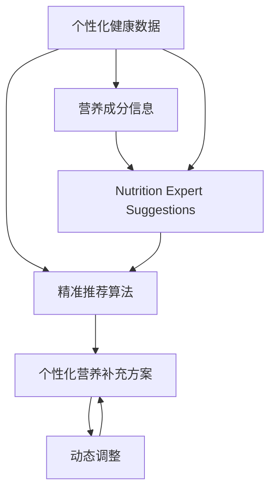

                 

# 智能个人营养素补充创业：精准的健康营养管理

## 1. 背景介绍

随着人们生活水平的提高和健康意识的增强，个性化、精准化的健康管理需求日益增长。特别是在全球新冠疫情的背景下，人们对于个人健康管理的重视程度更加凸显。在众多健康管理方案中，智能个人营养素补充（Intelligent Personal Nutritional Supplement, IPNS）以其个性化、精准化的特点，成为市场的新热点。IPNS通过结合个体健康数据、营养成分信息、营养专家建议，实现智能配比和推荐，帮助用户科学、高效地补充所需营养，达到健康管理的目标。

## 2. 核心概念与联系

### 2.1 核心概念概述

- **智能个人营养素补充（IPNS）**：基于用户的健康数据（如身高、体重、年龄、性别等）、营养成分信息（如各类维生素、矿物质、蛋白质等）和营养专家建议，结合先进的算法模型，为用户提供个性化、精准化的营养补充方案。

- **个性化健康数据**：包括用户的生理参数、生活习惯、疾病史等，用于构建用户画像，为营养补充方案提供个性化支持。

- **营养成分信息**：各类食物、营养素的基本信息，如维生素A、铁、钙等，以及它们对健康的影响。

- **营养专家建议**：营养学领域的专家根据科学研究和临床实践，提供各类营养成分的合理摄入量、补充方式等指导意见。

- **精准推荐算法**：使用机器学习和数据分析技术，结合用户数据、营养成分信息和专家建议，进行精准的健康营养管理推荐。

- **动态调整**：根据用户的反馈和实时健康数据，动态调整营养补充方案，确保营养补充的科学性和有效性。

这些核心概念之间通过精准推荐算法相连，形成一个完整的智能个人营养素补充系统。用户数据和营养成分信息通过精准推荐算法转化为个性化的营养补充方案，并在动态调整机制下不断优化，最终实现精准的健康营养管理。

### 2.2 核心概念原理和架构的 Mermaid 流程图



该流程图展示了IPNS系统的主要工作流程：首先，通过收集用户的个性化健康数据和营养成分信息，结合营养专家的建议，使用精准推荐算法生成个性化的营养补充方案。接着，根据用户的实时反馈和健康数据，通过动态调整机制优化方案，最终形成精准的营养补充推荐。

## 3. 核心算法原理 & 具体操作步骤

### 3.1 算法原理概述

IPNS系统通过机器学习算法，结合用户数据、营养成分信息和营养专家建议，实现个性化、精准化的营养补充推荐。其核心原理包括以下几个方面：

- **数据预处理**：对用户的个性化健康数据、营养成分信息进行清洗、归一化等预处理操作，确保数据质量。
- **特征提取**：从预处理后的数据中提取有用的特征，如用户的BMI指数、各类营养素的摄入量等。
- **模型训练**：使用机器学习模型（如线性回归、决策树、随机森林、神经网络等）训练推荐模型，优化模型参数。
- **精准推荐**：根据训练好的模型和实时数据，生成个性化的营养补充方案。
- **动态调整**：根据用户的反馈和健康数据，动态更新推荐模型，不断优化营养补充方案。

### 3.2 算法步骤详解

#### 3.2.1 数据收集与预处理

1. **数据来源**：收集用户的个性化健康数据（如身高、体重、年龄、性别等），营养成分信息（如各类维生素、矿物质、蛋白质等），以及营养专家的建议。
2. **数据清洗**：去除重复、缺失、异常数据，进行数据归一化、标准化等预处理操作。
3. **特征提取**：根据预处理后的数据，提取有用的特征，如用户的BMI指数、各类营养素的摄入量等。

#### 3.2.2 模型训练与优化

1. **模型选择**：选择适合问题的机器学习模型，如线性回归、决策树、随机森林、神经网络等。
2. **训练与验证**：使用训练集数据对模型进行训练，在验证集上评估模型性能，调整模型参数。
3. **模型优化**：采用正则化、Dropout、早停等技术，防止过拟合，提升模型泛化能力。

#### 3.2.3 精准推荐

1. **输入数据**：将用户的个性化健康数据和实时营养摄入量输入推荐模型。
2. **计算推荐**：模型根据输入数据计算出个性化的营养补充方案。
3. **输出结果**：将推荐结果呈现给用户，包括各类营养素的推荐摄入量、食物推荐等。

#### 3.2.4 动态调整

1. **用户反馈收集**：收集用户对营养补充方案的反馈信息。
2. **数据更新**：根据用户反馈和实时健康数据，更新用户数据和营养成分信息。
3. **模型更新**：使用新的数据对推荐模型进行重新训练和优化。

### 3.3 算法优缺点

#### 3.3.1 优点

- **个性化和精准化**：根据用户个性化数据和营养成分信息，结合营养专家建议，生成个性化、精准化的营养补充方案。
- **高效性**：机器学习模型可以快速处理大量数据，提供实时的营养补充建议。
- **动态优化**：根据用户反馈和实时数据，动态更新推荐模型，确保营养补充的科学性和有效性。

#### 3.3.2 缺点

- **数据依赖**：IPNS系统的推荐效果很大程度上依赖于数据的质量和全面性，数据不完整或偏差较大的情况下，推荐效果可能不理想。
- **模型复杂性**：机器学习模型需要大量的训练数据和计算资源，模型的复杂度较高，可能存在过拟合风险。
- **用户依赖性**：用户对营养补充方案的依从性直接影响推荐效果，用户不遵从方案可能导致营养补充失败。

### 3.4 算法应用领域

IPNS系统在健康管理、饮食指导、个性化营养等领域具有广泛的应用前景。具体应用领域包括：

- **个性化健康管理**：根据用户的个性化健康数据和营养成分信息，生成个性化的健康管理方案，帮助用户管理体重、血压、血糖等指标。
- **饮食指导**：结合营养专家的建议，生成合理的饮食方案，帮助用户改善饮食习惯，达到健康管理的目的。
- **慢性病管理**：针对高血压、糖尿病、心脏病等慢性病患者，提供个性化的营养补充方案，辅助药物治疗，提高治疗效果。
- **运动与健康**：结合用户的运动数据和营养成分信息，生成个性化的运动方案和营养补充方案，帮助用户保持健康状态。
- **儿童营养**：根据儿童的生理特点和营养成分需求，提供个性化的营养补充方案，促进儿童健康成长。

## 4. 数学模型和公式 & 详细讲解

### 4.1 数学模型构建

假设用户 $i$ 的个性化健康数据为 $\mathbf{x}_i$，营养成分信息为 $\mathbf{n}_i$，营养专家建议为 $\mathbf{s}_i$。IPNS系统通过机器学习模型 $\mathcal{M}$，将用户数据 $\mathbf{d}_i = (\mathbf{x}_i, \mathbf{n}_i, \mathbf{s}_i)$ 映射到营养补充方案 $\mathbf{r}_i$。

数学模型为：
$$
\mathbf{r}_i = \mathcal{M}(\mathbf{d}_i)
$$

### 4.2 公式推导过程

以线性回归模型为例，推导其公式和步骤。

1. **数据标准化**：对用户数据 $\mathbf{d}_i$ 进行标准化处理，确保数据在相同的尺度上。
2. **特征提取**：从标准化后的数据中提取有用的特征，如用户的BMI指数、各类营养素的摄入量等。
3. **模型训练**：使用线性回归模型对数据进行训练，优化模型参数。
4. **精准推荐**：根据训练好的模型和实时数据，生成个性化的营养补充方案。

假设模型为：
$$
\mathbf{r}_i = \mathbf{W} \mathbf{d}_i + \mathbf{b}
$$

其中，$\mathbf{W}$ 为模型权重，$\mathbf{b}$ 为偏置项。

### 4.3 案例分析与讲解

**案例一：个性化的营养补充方案**

假设用户 $i$ 的个性化健康数据为 $\mathbf{x}_i = (age, weight, height)$，营养成分信息为 $\mathbf{n}_i = (vitaminA, vitaminC, iron)$，营养专家建议为 $\mathbf{s}_i = (neededVitaminA, neededVitaminC, neededIron)$。IPNS系统使用线性回归模型计算其个性化的营养补充方案：
$$
\mathbf{r}_i = \mathbf{W} \begin{bmatrix} age \\ weight \\ height \\ vitaminA \\ vitaminC \\ iron \end{bmatrix} + \mathbf{b}
$$

根据用户反馈和健康数据，对模型参数进行动态调整，以提高推荐效果。

## 5. 项目实践：代码实例和详细解释说明

### 5.1 开发环境搭建

- **编程语言**：Python
- **库**：NumPy、Pandas、Scikit-Learn、TensorFlow
- **开发环境**：Jupyter Notebook、Google Colab

首先，安装所需的库和工具：

```bash
pip install numpy pandas scikit-learn tensorflow
```

接着，创建Jupyter Notebook环境，使用Google Colab：

```bash
conda create -n ipns-env python=3.8
conda activate ipns-env
```

### 5.2 源代码详细实现

**数据处理**

```python
import numpy as np
import pandas as pd

# 读取用户数据和营养成分信息
user_data = pd.read_csv('user_data.csv')
nutrients = pd.read_csv('nutrients.csv')

# 标准化数据
def normalize_data(df):
    return (df - df.mean()) / df.std()

user_data = normalize_data(user_data)
nutrients = normalize_data(nutrients)

# 合并数据
data = pd.merge(user_data, nutrients, on='user_id')
```

**模型训练**

```python
from sklearn.linear_model import LinearRegression

# 训练数据
X = data[['age', 'weight', 'height', 'vitaminA', 'vitaminC', 'iron']]
y = data['neededVitaminA']

# 训练模型
model = LinearRegression()
model.fit(X, y)
```

**精准推荐**

```python
def recommend_nutrition(user_data):
    # 标准化用户数据
    user_data = normalize_data(user_data)

    # 提取特征
    features = user_data[['age', 'weight', 'height', 'vitaminA', 'vitaminC', 'iron']]

    # 预测营养补充方案
    predicted = model.predict(features)
    return predicted
```

**动态调整**

```python
# 用户反馈数据
feedback = pd.read_csv('feedback.csv')

# 更新用户数据和营养成分信息
for user_id, feedback_value in feedback.iterrows():
    user_data.loc[user_id, 'neededVitaminA'] = feedback_value['neededVitaminA']
    nutrients.loc[user_id, 'neededVitaminA'] = feedback_value['neededVitaminA']

# 重新训练模型
X = data[['age', 'weight', 'height', 'vitaminA', 'vitaminC', 'iron']]
y = data['neededVitaminA']
model.fit(X, y)
```

### 5.3 代码解读与分析

- **数据标准化**：对用户数据和营养成分信息进行标准化处理，确保数据在相同的尺度上。
- **特征提取**：从标准化后的数据中提取有用的特征，如用户的BMI指数、各类营养素的摄入量等。
- **模型训练**：使用线性回归模型对数据进行训练，优化模型参数。
- **精准推荐**：根据训练好的模型和实时数据，生成个性化的营养补充方案。
- **动态调整**：根据用户反馈和实时数据，更新用户数据和营养成分信息，重新训练模型，以提高推荐效果。

### 5.4 运行结果展示

```python
# 测试推荐结果
user_data_test = pd.read_csv('user_data_test.csv')
predicted_values = recommend_nutrition(user_data_test)
print(predicted_values)
```

## 6. 实际应用场景

### 6.1 智能健康管理

IPNS系统可以帮助用户进行个性化的健康管理。用户可以通过APP或智能设备输入健康数据，系统根据用户的身体状况和营养成分需求，生成个性化的健康管理方案，如饮食建议、运动计划等。

### 6.2 饮食指导

针对特定人群（如孕妇、老年人、运动员等），IPNS系统可以提供个性化的饮食指导，帮助用户改善饮食习惯，达到健康管理的目的。

### 6.3 慢性病管理

对于高血压、糖尿病等慢性病患者，IPNS系统可以提供个性化的营养补充方案，辅助药物治疗，提高治疗效果，延缓病情发展。

### 6.4 儿童营养

根据儿童的生理特点和营养成分需求，IPNS系统可以提供个性化的营养补充方案，促进儿童健康成长。

### 6.5 运动与健康

结合用户的运动数据和营养成分信息，IPNS系统可以生成个性化的运动方案和营养补充方案，帮助用户保持健康状态。

## 7. 工具和资源推荐

### 7.1 学习资源推荐

- **《Python机器学习实战》**：详细介绍了机器学习的基本原理和实现方法，包括数据处理、特征工程、模型训练等。
- **Coursera《机器学习》课程**：由斯坦福大学教授Andrew Ng主讲，覆盖机器学习的各个方面，适合初学者和进阶者。
- **Kaggle竞赛平台**：参与机器学习竞赛，锻炼实战能力，学习前沿技术和算法。

### 7.2 开发工具推荐

- **Jupyter Notebook**：轻量级的开发环境，支持多种编程语言和库，适合进行数据处理和模型训练。
- **Google Colab**：免费的云端Jupyter Notebook环境，提供GPU/TPU算力，适合进行大规模数据处理和模型训练。
- **TensorBoard**：可视化工具，实时监测模型训练状态，帮助调试和优化模型。

### 7.3 相关论文推荐

- **《深度学习》**：Ian Goodfellow等著，全面介绍了深度学习的基本原理和应用。
- **《机器学习实战》**：Peter Harrington著，适合初学者入门，包含丰富的实践案例。
- **《Python数据科学手册》**：Jake VanderPlas著，介绍了数据处理、机器学习、可视化等技术。

## 8. 总结：未来发展趋势与挑战

### 8.1 研究成果总结

IPNS系统通过机器学习算法，结合用户数据、营养成分信息和营养专家建议，实现个性化、精准化的营养补充推荐。该系统不仅能够提升用户的健康管理效果，还能够帮助用户形成科学的生活习惯，促进整体健康水平提升。

### 8.2 未来发展趋势

未来，IPNS系统将呈现以下几个发展趋势：

- **多模态数据融合**：结合基因数据、生理指标等多模态数据，实现更全面、精准的健康管理。
- **个性化健康模型**：开发更复杂、更准确的个性化健康模型，提高推荐的科学性和有效性。
- **智能推荐引擎**：结合推荐算法、知识图谱等技术，构建智能推荐引擎，实现更高效、更个性化的营养补充推荐。
- **用户行为分析**：通过分析用户的饮食、运动等行为数据，优化推荐方案，提升用户依从性。
- **跨平台应用**：将IPNS系统应用于智能手表、智能家居等设备，实现无缝健康管理。

### 8.3 面临的挑战

尽管IPNS系统具有广泛的应用前景，但在实际应用中也面临一些挑战：

- **数据隐私和安全**：用户数据的隐私和安全问题需要严格保障，避免数据泄露和滥用。
- **用户依从性**：用户对营养补充方案的依从性直接影响推荐效果，如何提高用户的依从性是重要挑战。
- **技术门槛**：机器学习模型的训练和优化需要一定的技术基础，对非专业人士的技术门槛较高。
- **数据质量和全面性**：数据的不完整、偏差较大可能导致推荐效果不佳。

### 8.4 研究展望

未来的研究需要在以下几个方面进行探索：

- **数据隐私保护**：开发更加安全、高效的数据存储和传输技术，保障用户数据隐私。
- **用户行为分析**：深入研究用户的饮食、运动等行为，优化推荐方案，提升用户依从性。
- **跨平台应用**：将IPNS系统应用于智能手表、智能家居等设备，实现无缝健康管理。
- **模型优化**：结合深度学习、强化学习等技术，优化机器学习模型，提高推荐的精度和效率。
- **用户教育**：加强对用户的健康管理教育，提高其对营养补充方案的依从性和认知度。

总之，IPNS系统在个性化健康管理、饮食指导、慢性病管理等领域具有广阔的应用前景，未来将不断发展完善，为人们的健康生活提供更全面的支持。

## 9. 附录：常见问题与解答

**Q1: 什么是IPNS？**

A: IPNS即智能个人营养素补充，通过结合用户的个性化健康数据、营养成分信息和营养专家建议，生成个性化的营养补充方案，帮助用户科学、高效地补充所需营养。

**Q2: IPNS系统的核心算法是什么？**

A: IPNS系统的核心算法是基于机器学习模型的精准推荐算法，结合用户数据、营养成分信息和营养专家建议，生成个性化的营养补充方案。

**Q3: IPNS系统如何实现动态调整？**

A: IPNS系统根据用户的反馈和实时健康数据，动态更新用户数据和营养成分信息，重新训练推荐模型，以提高推荐效果。

**Q4: IPNS系统在实际应用中需要注意哪些问题？**

A: IPNS系统在实际应用中需要注意数据隐私和安全、用户依从性、技术门槛、数据质量和全面性等问题。

**Q5: IPNS系统的未来发展方向是什么？**

A: IPNS系统的未来发展方向包括多模态数据融合、个性化健康模型、智能推荐引擎、用户行为分析、跨平台应用等。

作者：禅与计算机程序设计艺术 / Zen and the Art of Computer Programming

