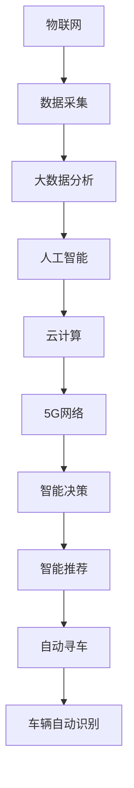

                 

## 1. 背景介绍

随着城市化进程的加快，汽车保有量的不断增加，城市停车问题变得越来越突出。如何有效地解决城市停车难、停车费用高、信息不对称等问题，成为各个城市面临的重大挑战。传统的城市停车管理手段，如人工监控、停车卡支付等，已经无法满足现代城市发展的需求。智能停车解决方案应运而生，通过智能化技术手段，提升城市停车管理的效率和便利性，优化城市资源配置，缓解城市停车压力。

本文将从智能停车系统的技术实现、实际应用场景以及未来发展方向等方面，深入探讨如何利用智能化技术手段，有效解决城市停车问题，助力智慧城市的建设。

## 2. 核心概念与联系

### 2.1 核心概念概述

在探讨智能停车解决方案前，我们首先介绍几个关键的概念及其联系：

- **智能停车**：利用智能化技术手段，如物联网、人工智能、大数据分析等，对城市停车资源进行管理和优化，提升停车效率，降低停车成本，提高用户体验。

- **物联网(IoT)**：利用感知设备、网络传输技术，将城市停车资源与云端平台连接起来，实现数据采集、传输、存储和分析，为智能化决策提供数据支撑。

- **人工智能(AI)**：通过对海量数据的分析和学习，实现城市停车场景的智能化处理，如智能推荐、自动寻车、车辆自动识别等，提升停车管理的智能化水平。

- **大数据分析**：通过收集、存储、处理和分析海量数据，实现对城市停车资源的动态监测和优化，优化资源配置，提高管理效率。

- **云计算(Cloud Computing)**：为智能停车系统的数据存储、计算和处理提供支持，实现资源的弹性扩展和按需分配，降低系统运行成本。

- **5G网络**：作为下一代通信技术，5G网络提供高带宽、低时延、广覆盖等特性，为智能停车系统的高效运行提供通信保障。

这些概念共同构成了智能停车系统的技术基础，通过物联网感知数据，大数据分析数据，人工智能处理数据，云计算和5G网络支撑数据处理，实现城市停车资源的智能化管理，提升用户体验，缓解城市停车压力。

### 2.2 核心概念原理和架构的 Mermaid 流程图



这个流程图展示了智能停车系统从数据采集到智能决策的完整流程。物联网技术通过感知设备采集城市停车资源的数据，大数据分析对海量数据进行存储和处理，人工智能技术在分析数据的基础上实现智能决策，云计算和5G网络提供数据处理和传输的支持，最终通过智能推荐、自动寻车、车辆自动识别等技术手段，实现城市停车的智能化管理。

## 3. 核心算法原理 & 具体操作步骤

### 3.1 算法原理概述

智能停车系统的核心算法原理主要基于以下几个方面：

- **数据采集与处理**：通过物联网技术，将城市停车资源的数据采集到云端平台，进行数据清洗和预处理，为后续分析提供数据基础。

- **数据分析与建模**：利用大数据分析技术，对海量数据进行建模和分析，发现城市停车资源的规律和趋势，为智能决策提供支持。

- **智能推荐**：通过机器学习算法，对用户的停车需求和习惯进行分析和预测，推荐最佳的停车位置和费用，提升用户体验。

- **自动寻车**：利用计算机视觉和图像处理技术，在停车场内自动寻找停车位和用户车辆，提高停车效率。

- **车辆自动识别**：通过车牌识别和车辆特征识别技术，自动识别进出停车场的车辆，实现无感支付，提升通行效率。

这些算法原理共同构成了智能停车系统的技术基础，通过数据采集、处理、分析和智能决策，实现城市停车资源的优化配置，提升停车管理的智能化水平。

### 3.2 算法步骤详解

智能停车系统的算法实现步骤如下：

1. **数据采集与清洗**：利用物联网感知设备，采集城市停车资源的位置、占用情况、收费信息等数据，并进行数据清洗和预处理，去除噪声和异常值。

2. **数据存储与分析**：将清洗后的数据存储到云端数据库，利用大数据分析技术，对数据进行建模和分析，发现城市停车资源的规律和趋势。

3. **智能推荐**：通过机器学习算法，对用户的停车需求和习惯进行分析和预测，推荐最佳的停车位置和费用。

4. **自动寻车**：利用计算机视觉和图像处理技术，在停车场内自动寻找停车位和用户车辆，提高停车效率。

5. **车辆自动识别**：通过车牌识别和车辆特征识别技术，自动识别进出停车场的车辆，实现无感支付，提升通行效率。

6. **智能决策与控制**：利用人工智能算法，对智能推荐、自动寻车、车辆自动识别等结果进行智能决策和控制，优化城市停车资源的配置。

### 3.3 算法优缺点

智能停车系统的算法实现具有以下优点：

- **高效便捷**：通过智能化技术手段，实现城市停车资源的快速查询和推荐，提高停车效率，节省用户时间。

- **成本节约**：利用自动寻车、车辆自动识别等技术，减少人力成本，降低停车费用。

- **数据驱动**：基于大数据分析，实现对城市停车资源的动态监测和优化，提高管理效率。

- **灵活可扩展**：云计算和5G网络提供弹性计算和存储支持，系统可根据需求进行灵活扩展。

同时，智能停车系统也存在一些缺点：

- **技术复杂**：系统涉及物联网、大数据、人工智能等多个技术领域，技术实现较为复杂，对技术要求较高。

- **数据隐私**：系统需要采集和存储大量敏感数据，如车辆位置、车牌信息等，数据隐私和安全问题需要重点关注。

- **初期投资高**：系统建设需要较高的初期投资，如感知设备、云计算资源等，对中小企业可能存在一定的门槛。

### 3.4 算法应用领域

智能停车系统在多个领域具有广泛的应用前景，包括但不限于：

- **城市交通管理**：通过智能停车系统的数据分析，优化城市交通资源的配置，缓解交通拥堵，提高通行效率。

- **停车场管理**：为停车场提供智能化管理方案，优化停车场的运营效率，提升用户体验。

- **旅游景区管理**：在旅游景区内部和周边，提供智能化的停车解决方案，提升景区管理和游客体验。

- **医院停车管理**：在医院内部和周边，提供智能化的停车推荐和支付方案，提高医院管理效率。

- **大型活动组织**：为大型活动提供智能化的停车解决方案，优化活动的停车资源配置，提升活动组织效率。

## 4. 数学模型和公式 & 详细讲解 & 举例说明

### 4.1 数学模型构建

智能停车系统的数学模型构建主要基于以下几个方面：

- **用户行为分析**：通过机器学习算法，对用户的停车需求和习惯进行分析和预测，建立用户行为模型。

- **位置推荐模型**：利用算法，对用户推荐的停车位置进行建模，预测推荐的准确性。

- **车辆自动识别模型**：通过计算机视觉技术，对车辆进行自动识别和分类，建立车辆识别模型。

### 4.2 公式推导过程

以用户行为分析为例，假设用户的历史停车数据为 $D = \{(x_i, y_i)\}_{i=1}^N$，其中 $x_i$ 为停车时间，$y_i$ 为停车位置，$t$ 为用户当前停车时间。设用户行为模型为 $P(t)$，可以通过历史数据进行训练，利用最大似然估计法求解模型参数 $\theta$：

$$
\hat{\theta} = \mathop{\arg\min}_{\theta} -\frac{1}{N}\sum_{i=1}^N\log P(x_i, y_i; \theta)
$$

在得到用户行为模型后，可以通过该模型对用户的当前停车需求进行预测，推荐最佳的停车位置和费用。

### 4.3 案例分析与讲解

假设某城市中心区域的停车需求较高，利用智能停车系统的数据分析，发现该区域的停车热点集中在某个时间段。通过机器学习算法，建立用户行为模型，对用户的停车需求进行分析和预测。设当前时间为 17:30，根据用户行为模型，预测用户可能前往的区域，推荐最佳的停车位置和费用。

## 5. 项目实践：代码实例和详细解释说明

### 5.1 开发环境搭建

在进行智能停车系统的开发前，需要先搭建好开发环境。以下是使用Python进行智能停车系统开发的开发环境配置流程：

1. **安装Python环境**：选择Python 3.x版本进行安装，推荐使用Anaconda或Miniconda。

2. **安装所需的第三方库**：包括Pandas、NumPy、Scikit-learn、TensorFlow等，使用pip命令进行安装。

3. **搭建数据采集系统**：利用物联网感知设备，搭建数据采集系统，将采集到的数据传输到云端平台。

4. **搭建数据存储与分析系统**：利用大数据平台，搭建数据存储与分析系统，对采集到的数据进行存储和分析。

5. **搭建智能推荐系统**：利用机器学习算法，搭建智能推荐系统，对用户的停车需求进行分析和预测。

6. **搭建自动寻车系统**：利用计算机视觉和图像处理技术，搭建自动寻车系统，在停车场内自动寻找停车位和用户车辆。

7. **搭建车辆自动识别系统**：利用车牌识别和车辆特征识别技术，搭建车辆自动识别系统，自动识别进出停车场的车辆。

8. **搭建智能决策与控制系统**：利用人工智能算法，搭建智能决策与控制系统，对智能推荐、自动寻车、车辆自动识别等结果进行智能决策和控制。

### 5.2 源代码详细实现

以下是一个简单的智能推荐系统的代码实现示例：

```python
import pandas as pd
from sklearn.ensemble import RandomForestRegressor
from sklearn.metrics import mean_squared_error

# 读取历史数据
data = pd.read_csv('parking_data.csv')

# 数据清洗与预处理
# ...

# 特征工程
# ...

# 训练随机森林模型
model = RandomForestRegressor()
model.fit(X_train, y_train)

# 预测推荐结果
y_pred = model.predict(X_test)

# 评估推荐结果
mse = mean_squared_error(y_test, y_pred)
print(f'Mean Squared Error: {mse}')
```

### 5.3 代码解读与分析

上述代码中，首先通过Pandas读取历史停车数据，并进行数据清洗和预处理。然后通过特征工程，提取有用的特征，训练随机森林回归模型，对用户的停车需求进行分析和预测，输出推荐结果。最后使用均方误差评估推荐结果的准确性。

## 6. 实际应用场景

### 6.1 智能推荐系统

智能推荐系统是智能停车系统的核心模块，通过分析用户的停车需求和习惯，推荐最佳的停车位置和费用，提升用户体验。

实际应用场景中，智能推荐系统可以通过以下几个步骤实现：

1. **数据采集**：利用物联网感知设备，采集用户的历史停车数据和实时停车需求数据。

2. **数据清洗与预处理**：对采集到的数据进行清洗和预处理，去除噪声和异常值。

3. **特征提取**：通过特征工程，提取有用的特征，如停车时间、位置、费用等。

4. **模型训练与预测**：利用机器学习算法，如随机森林、深度学习等，训练推荐模型，对用户的当前停车需求进行预测，推荐最佳的停车位置和费用。

5. **反馈与优化**：根据用户的反馈，不断优化推荐模型，提高推荐结果的准确性。

### 6.2 自动寻车系统

自动寻车系统利用计算机视觉和图像处理技术，在停车场内自动寻找停车位和用户车辆，提高停车效率。

实际应用场景中，自动寻车系统可以通过以下几个步骤实现：

1. **视频采集与传输**：利用摄像头采集停车场内的视频数据，并传输到云端平台。

2. **视频处理与分析**：利用计算机视觉技术，对视频数据进行处理和分析，识别出停车位和用户车辆。

3. **车辆定位**：通过车辆特征识别技术，对车辆进行定位，确定车辆的位置。

4. **路径规划与导航**：利用路径规划算法，生成从当前位置到停车位的导航路径，指引车辆前往停车位。

5. **反馈与优化**：根据车辆的反馈，不断优化自动寻车系统，提高寻车效率。

### 6.3 车辆自动识别系统

车辆自动识别系统通过车牌识别和车辆特征识别技术，自动识别进出停车场的车辆，实现无感支付，提升通行效率。

实际应用场景中，车辆自动识别系统可以通过以下几个步骤实现：

1. **车牌识别**：利用车牌识别技术，对进出停车场的车辆进行识别和记录。

2. **车辆特征识别**：利用计算机视觉技术，对车辆进行特征识别，确定车辆的类型和颜色等特征。

3. **身份验证**：利用身份验证技术，对车辆进行身份验证，确保车辆的身份信息与车牌信息一致。

4. **无感支付**：根据车辆的信息，自动完成停车费用的结算，提升通行效率。

5. **反馈与优化**：根据车辆的反馈，不断优化车辆自动识别系统，提高识别准确性和通行效率。

## 7. 工具和资源推荐

### 7.1 学习资源推荐

为了帮助开发者系统掌握智能停车系统的技术实现，这里推荐一些优质的学习资源：

1. **《智能停车系统设计与实现》**：一本详细介绍智能停车系统设计、实现和优化的书籍，涵盖了数据采集、数据分析、智能推荐等多个方面的内容。

2. **《Python大数据分析与机器学习》**：一本详细介绍Python在大数据分析和机器学习中的应用，包括数据清洗、特征工程、模型训练等多个方面的内容。

3. **《深度学习在自动驾驶中的应用》**：一本详细介绍深度学习在自动驾驶中的应用，包括计算机视觉、目标检测等多个方面的内容，为智能寻车系统提供参考。

4. **《物联网技术与应用》**：一本详细介绍物联网技术的应用，包括数据采集、网络传输、设备管理等多个方面的内容，为智能停车系统的开发提供参考。

5. **《智能推荐系统设计与实现》**：一本详细介绍智能推荐系统的设计与实现，包括推荐算法、特征工程、用户行为分析等多个方面的内容，为智能推荐系统提供参考。

通过对这些资源的学习实践，相信你一定能够快速掌握智能停车系统的技术实现，并用于解决实际的停车问题。

### 7.2 开发工具推荐

高效的开发离不开优秀的工具支持。以下是几款用于智能停车系统开发的常用工具：

1. **Python**：作为智能停车系统开发的主要语言，Python具有简单易用、功能强大的特点，适合快速迭代研究。

2. **TensorFlow**：由Google主导开发的开源深度学习框架，生产部署方便，适合大规模工程应用。

3. **Keras**：基于TensorFlow和Theano的高级神经网络API，使用起来更加简便，适合快速原型开发。

4. **OpenCV**：计算机视觉领域的重要工具，提供了丰富的图像处理和计算机视觉算法库。

5. **Amazon Web Services (AWS)**：全球领先的云计算平台，提供弹性计算、存储、网络等资源，为智能停车系统的部署提供支持。

6. **Microsoft Azure**：微软提供的云服务平台，提供弹性计算、存储、网络等资源，为智能停车系统的部署提供支持。

合理利用这些工具，可以显著提升智能停车系统的开发效率，加快创新迭代的步伐。

### 7.3 相关论文推荐

智能停车系统的发展离不开学界的持续研究。以下是几篇奠基性的相关论文，推荐阅读：

1. **《基于物联网的智能停车系统研究》**：介绍了物联网技术在智能停车系统中的应用，包括数据采集、传输、存储和分析。

2. **《基于深度学习的车辆自动寻车方法》**：介绍了深度学习在车辆自动寻车中的应用，包括目标检测、路径规划等技术。

3. **《基于车牌识别的智能停车系统》**：介绍了车牌识别技术在智能停车系统中的应用，包括车牌识别算法、特征提取等技术。

4. **《基于人工智能的智能推荐系统》**：介绍了人工智能在智能推荐系统中的应用，包括推荐算法、用户行为分析等技术。

这些论文代表了大规模城市停车智能化技术的发展脉络。通过学习这些前沿成果，可以帮助研究者把握学科前进方向，激发更多的创新灵感。

## 8. 总结：未来发展趋势与挑战

### 8.1 总结

本文对智能停车系统的技术实现进行了全面系统的介绍。从数据采集与处理、数据分析与建模、智能推荐、自动寻车、车辆自动识别等多个方面，详细讲解了智能停车系统的核心算法原理和操作步骤，给出了智能停车系统开发的环境搭建和代码实现，并探讨了智能停车系统的实际应用场景和未来发展方向。通过本文的系统梳理，相信读者能够全面了解智能停车系统的技术实现，为智能停车系统的开发和应用提供参考。

### 8.2 未来发展趋势

展望未来，智能停车系统将呈现以下几个发展趋势：

1. **智能化程度提升**：随着物联网、人工智能、大数据等技术的发展，智能停车系统的智能化水平将不断提高，能够更好地满足用户的停车需求，提升用户体验。

2. **系统集成与协同**：智能停车系统将与其他城市管理系统的集成与协同，实现城市交通、停车、安防等系统的高效协同。

3. **5G网络的应用**：5G网络的高带宽、低时延、广覆盖特性，将为智能停车系统的实时数据传输和处理提供支持，进一步提升系统的性能和用户体验。

4. **多模态数据的融合**：智能停车系统将融合视觉、声音、传感器等多模态数据，实现更全面、准确的城市停车资源监测和管理。

5. **联邦学习的应用**：联邦学习技术可以在不泄露用户数据的前提下，实现智能停车系统的本地数据优化，保护用户隐私。

6. **人工智能算法的优化**：智能推荐、自动寻车、车辆自动识别等算法将不断优化，提升系统的性能和用户体验。

### 8.3 面临的挑战

尽管智能停车系统已经取得了显著的进展，但在迈向更加智能化、普适化应用的过程中，仍面临诸多挑战：

1. **数据隐私和安全**：智能停车系统需要采集和存储大量敏感数据，如车辆位置、车牌信息等，如何保护数据隐私和安全，是一个重要的问题。

2. **技术复杂性**：智能停车系统涉及物联网、大数据、人工智能等多个技术领域，技术实现较为复杂，对技术要求较高。

3. **初期投资高**：系统建设需要较高的初期投资，如感知设备、云计算资源等，对中小企业可能存在一定的门槛。

4. **用户接受度**：智能停车系统的推广和应用需要用户的广泛接受，如何提升用户对智能停车系统的接受度，是一个重要的挑战。

5. **系统兼容性**：智能停车系统需要与其他城市管理系统集成，如何保证系统的兼容性和稳定性，是一个重要的问题。

### 8.4 研究展望

面对智能停车系统面临的挑战，未来的研究需要在以下几个方面寻求新的突破：

1. **数据隐私保护技术**：研究数据隐私保护技术，如联邦学习、差分隐私等，确保用户数据的安全和隐私。

2. **轻量化技术**：研究轻量化技术，如模型压缩、模型量化等，降低系统初期投资，提升系统的运行效率。

3. **边缘计算技术**：研究边缘计算技术，将部分计算任务在本地完成，降低数据传输和处理的时延，提升系统的响应速度。

4. **用户行为分析技术**：研究用户行为分析技术，通过分析用户的行为和需求，提升智能推荐系统的准确性和用户体验。

5. **多模态融合技术**：研究多模态融合技术，将视觉、声音、传感器等多模态数据融合，实现更全面、准确的城市停车资源监测和管理。

6. **联邦学习技术**：研究联邦学习技术，在不泄露用户数据的前提下，实现智能停车系统的本地数据优化，保护用户隐私。

这些研究方向的探索，必将引领智能停车系统向更高的台阶发展，为城市停车问题的解决提供更多的技术支撑。面向未来，智能停车系统还需要与其他城市管理系统进行更深入的融合，协同优化城市资源配置，提高城市管理的智能化水平，真正实现智慧城市的目标。

## 9. 附录：常见问题与解答

**Q1：智能停车系统如何实现数据的实时采集和传输？**

A: 智能停车系统可以通过多种方式实现数据的实时采集和传输，包括：

1. **传感器采集**：利用传感器技术，采集停车场内停车位占用情况、环境信息等数据。

2. **摄像头监控**：利用摄像头采集停车场内车辆进出、车位空余情况等视频数据。

3. **车牌识别设备**：利用车牌识别设备，自动记录进出停车场的车辆信息。

4. **移动设备采集**：利用手机APP、车载设备等移动设备，实时获取用户的停车需求信息。

采集到的数据可以通过物联网技术，如WiFi、4G、5G等网络传输到云端平台，实现数据的实时采集和传输。

**Q2：智能停车系统的数据存储和分析需要考虑哪些因素？**

A: 智能停车系统的数据存储和分析需要考虑以下几个因素：

1. **数据量大小**：智能停车系统需要存储大量的停车数据，因此需要选用高性能的存储设备，如云存储、分布式存储等。

2. **数据类型多样性**：智能停车系统需要存储多种类型的数据，如文本数据、图像数据、视频数据等，需要选用多模态存储解决方案。

3. **数据实时性**：智能停车系统需要实时处理和分析数据，需要选用高性能的计算平台，如云计算平台、边缘计算平台等。

4. **数据隐私和安全**：智能停车系统需要存储敏感的停车数据，需要选用安全的存储方案，如数据加密、访问控制等。

5. **数据管理复杂性**：智能停车系统需要管理大量的数据，需要选用先进的数据管理技术，如数据清洗、数据标注等。

通过对这些因素的综合考虑，智能停车系统可以更好地存储和分析数据，提升系统的性能和用户体验。

**Q3：智能停车系统的智能推荐系统如何提升用户体验？**

A: 智能停车系统的智能推荐系统可以通过以下几个方面提升用户体验：

1. **个性化推荐**：通过分析用户的停车需求和习惯，推荐最佳的停车位置和费用，提升用户的停车体验。

2. **实时更新**：根据实时停车数据，实时更新推荐结果，提高推荐的准确性和及时性。

3. **多维度推荐**：结合用户位置、时间、天气等因素，进行多维度推荐，提升推荐的全面性和多样性。

4. **用户反馈**：根据用户的反馈，不断优化推荐算法，提升推荐的准确性和用户满意度。

5. **推荐可信度**：提高推荐的可信度，让用户对推荐结果有信心，提升用户对智能停车系统的信任度。

通过这些方面的优化，智能推荐系统可以更好地满足用户的停车需求，提升用户体验。

**Q4：智能停车系统的自动寻车系统如何提升停车效率？**

A: 智能停车系统的自动寻车系统可以通过以下几个方面提升停车效率：

1. **路径规划**：利用计算机视觉和图像处理技术，在停车场内自动寻找停车位和用户车辆，生成导航路径，指引车辆前往停车位。

2. **实时监控**：利用摄像头监控停车场内的车辆进出情况，实时获取停车场的占用情况。

3. **自动泊车**：利用自动泊车技术，帮助用户自动停车，节省用户时间。

4. **推荐车位**：根据用户的停车需求，推荐最佳的停车位，提升停车效率。

5. **无感支付**：通过车牌识别和车辆自动识别技术，实现无感支付，提高停车效率。

通过这些方面的优化，自动寻车系统可以更好地满足用户的停车需求，提升停车效率。

**Q5：智能停车系统的车辆自动识别系统如何保护用户隐私？**

A: 智能停车系统的车辆自动识别系统可以通过以下几个方面保护用户隐私：

1. **数据加密**：对用户的车辆信息和车牌信息进行加密存储，防止数据泄露。

2. **访问控制**：对数据进行访问控制，只有授权用户才能访问相关数据。

3. **去标识化**：对数据进行去标识化处理，防止用户隐私被泄露。

4. **联邦学习**：利用联邦学习技术，在不泄露用户数据的前提下，实现模型的本地优化。

5. **隐私保护算法**：利用隐私保护算法，如差分隐私、同态加密等，保护用户隐私。

通过这些方面的优化，车辆自动识别系统可以更好地保护用户隐私，提升系统的可信度和用户满意度。

---

作者：禅与计算机程序设计艺术 / Zen and the Art of Computer Programming

