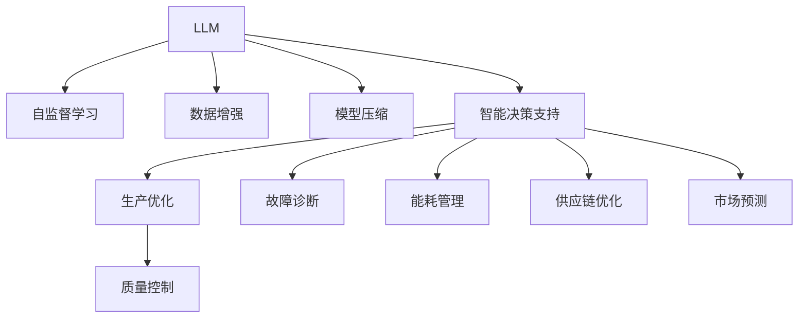

                 

# 智能制造新范式：LLM在工业4.0中的角色

> 关键词：
1. 大型语言模型(LLM)
2. 工业4.0
3. 智能制造
4. 工业数据分析
5. 自监督学习
6. 数据增强
7. 模型压缩

## 1. 背景介绍

### 1.1 问题由来

进入21世纪以来，全球制造业面临着巨大的转型挑战，特别是随着人工智能（AI）、大数据、云计算等技术的发展，制造业正在经历一场深刻的变革，即所谓的“工业4.0”。这一变革旨在通过信息技术与制造技术的深度融合，推动制造业向智能化、网络化、服务化方向发展，从而实现更高的效率、更低的成本和更强的市场竞争力。

在工业4.0时代，智能制造成为了关键驱动力之一。智能制造不仅包括工厂的自动化、智能化生产设备，还包括对生产数据的深度分析和应用，以提高制造过程的优化程度和预测能力。然而，在实际应用中，传统的数据分析方法往往难以满足复杂多变的制造需求，特别是在处理海量生产数据、提取有价值的信息方面存在局限性。

近年来，大型语言模型（LLM）在自然语言处理（NLP）领域取得了突破性进展，通过在大规模无标签文本数据上预训练，LLM具备了强大的自然语言理解和生成能力。这些能力是否也能被应用于工业制造领域？如果能，LLM又将如何发挥其价值？本文将对这些问题进行深入探讨，并展望LLM在工业4.0中的可能角色。

### 1.2 问题核心关键点

基于LLM的智能制造应用，核心在于如何利用其强大的语言处理能力，提升工业数据的理解和分析水平。具体来说，主要关注以下几个关键点：

1. 数据预处理与清洗：如何从原始制造数据中提取有用信息，去除噪声和冗余。
2. 数据增强：如何通过LLM对制造数据进行扩充和丰富，增强模型泛化能力。
3. 自监督学习：如何通过预训练数据让LLM学习到制造领域的通用知识，提升模型迁移学习能力。
4. 模型压缩：如何在保持性能的同时，减小模型的计算和存储开销。
5. 工业数据分析：如何将LLM应用于实际的制造过程分析，提高生产效率和质量控制。
6. 智能决策支持：如何构建基于LLM的智能决策系统，支持工厂的优化决策和运营管理。

### 1.3 问题研究意义

研究LLM在工业4.0中的应用，具有重要的现实意义和理论价值：

1. **提升制造效率**：通过LLM对海量制造数据的深度分析和理解，可以优化生产流程，降低制造成本，提升生产效率。
2. **提高决策质量**：LLM的智能决策支持系统可以为工厂管理层提供更准确的数据分析和预测结果，支持更科学的决策制定。
3. **增强数据分析能力**：LLM强大的语言处理能力，可以为制造领域带来新的数据分析范式，帮助工厂提取更有价值的信息。
4. **推动产业升级**：LLM的应用可以加速制造业的数字化、智能化转型，提升制造行业在产业链中的地位和竞争力。
5. **促进创新应用**：LLM的多模态学习能力，可以为制造领域的创新应用提供新思路，如智能维护、质量控制等。

## 2. 核心概念与联系

### 2.1 核心概念概述

为更好地理解LLM在工业4.0中的应用，本节将介绍几个密切相关的核心概念：

- 大型语言模型(LLM)：以Transformer为代表的深度学习模型，通过在大规模无标签文本数据上进行预训练，学习到丰富的语言知识和常识，具备强大的自然语言理解和生成能力。
- 自监督学习(SSL)：利用未标注数据进行训练，通过预训练任务学习到数据中的隐含结构和规律，如掩码语言模型、相对位置预测等。
- 数据增强(DE)：通过各种方式扩充和丰富数据集，提高模型的泛化能力，如回译、近义替换、文本生成等。
- 模型压缩(MC)：通过剪枝、量化、知识蒸馏等方法，减小模型的计算和存储开销，提高推理速度。
- 智能决策支持(IDS)：基于机器学习模型的决策支持系统，通过数据分析和预测，辅助决策制定。

这些核心概念之间的逻辑关系可以通过以下Mermaid流程图来展示：



这个流程图展示了大语言模型在工业4.0中的关键应用场景，包括生产优化、质量控制、故障诊断、能耗管理、供应链优化、市场预测等多个方面。这些应用不仅需要LLM强大的语言处理能力，也需要其他相关技术的支持。

## 3. 核心算法原理 & 具体操作步骤
### 3.1 算法原理概述

基于LLM的智能制造应用，本质上是一个数据预处理、增强、分析和应用的完整流程。其核心思想是：通过自监督学习任务对LLM进行预训练，然后利用数据增强技术扩充数据集，并在预训练数据上微调LLM，最终将其应用于实际的工业数据分析和决策支持。

形式化地，假设原始制造数据集为 $D=\{(x_i,y_i)\}_{i=1}^N$，其中 $x_i$ 为制造数据，$y_i$ 为标签（如生产状态、故障信息等）。微调的优化目标是最小化经验风险，即找到最优参数：

$$
\theta^* = \mathop{\arg\min}_{\theta} \mathcal{L}(M_{\theta},D)
$$

其中 $\mathcal{L}$ 为针对任务设计的损失函数，用于衡量模型预测输出与真实标签之间的差异。常见的损失函数包括交叉熵损失、均方误差损失等。

### 3.2 算法步骤详解

基于LLM的智能制造应用，一般包括以下几个关键步骤：

**Step 1: 数据预处理与清洗**

1. 收集原始制造数据，包括设备状态、生产参数、传感器数据等。
2. 清洗数据，去除噪声和冗余，确保数据的质量和一致性。
3. 将清洗后的数据转换为模型所需的格式，如文本、表格等。

**Step 2: 数据增强**

1. 利用LLM对数据进行扩充和丰富，如回译、近义替换、文本生成等，增强数据的多样性和覆盖面。
2. 通过数据增强技术，提升模型对异常数据和边缘情况的适应能力。

**Step 3: 自监督学习**

1. 在预训练数据上对LLM进行自监督学习，学习到制造领域的通用知识。
2. 常见的自监督学习任务包括掩码语言模型、相对位置预测、文本生成等。
3. 通过自监督学习，提升模型对制造数据的理解和处理能力。

**Step 4: 模型微调**

1. 在制造数据上对LLM进行微调，通过监督学习优化模型在该任务上的性能。
2. 选择合适的损失函数和优化器，设置学习率、批大小、迭代轮数等超参数。
3. 应用正则化技术，防止模型过拟合。

**Step 5: 模型应用**

1. 将微调后的LLM应用于实际的制造数据分析和决策支持。
2. 通过LLM分析制造数据，提取有用信息，如生产效率、故障原因、质量问题等。
3. 构建智能决策支持系统，根据分析结果进行优化决策。

### 3.3 算法优缺点

基于LLM的智能制造应用方法具有以下优点：

1. **数据处理能力**：LLM具备强大的自然语言处理能力，可以处理结构化、非结构化等多种形式的数据。
2. **泛化能力强**：通过数据增强和自监督学习，LLM能够学习到广泛的制造知识，提升模型的泛化能力。
3. **高效性**：利用数据增强和自监督学习，可以在小规模数据上获得较好的性能提升。
4. **灵活性**：LLM的预训练和微调过程相对简单，可以快速适配不同的制造任务。

同时，该方法也存在一定的局限性：

1. **数据依赖性强**：LLM的性能高度依赖于数据的质量和多样性，低质量数据可能导致模型性能下降。
2. **计算开销大**：LLM模型的参数量较大，训练和推理需要高性能硬件支持。
3. **模型复杂度高**：LLM模型结构复杂，难以解释其内部工作机制和决策逻辑。
4. **鲁棒性不足**：LLM对数据噪声和异常情况较为敏感，需要结合其他技术提升鲁棒性。

尽管存在这些局限性，但LLM在智能制造中的应用仍具有广阔前景，通过不断优化和改进，可以最大化其优势，克服其不足。

### 3.4 算法应用领域

基于LLM的智能制造应用，涵盖了制造领域的各个环节，具体应用领域包括：

1. **生产优化**：通过LLM对生产数据进行深度分析，优化生产流程，提升生产效率和设备利用率。
2. **质量控制**：利用LLM对产品质量进行分析和预测，及时发现和解决质量问题。
3. **故障诊断**：通过LLM对设备运行数据进行分析，预测设备故障，进行早期维护。
4. **能耗管理**：利用LLM对能耗数据进行分析和预测，优化能源使用，降低能耗。
5. **供应链优化**：通过LLM对供应链数据进行分析，优化库存管理，提升供应链效率。
6. **市场预测**：利用LLM对市场数据进行分析，预测市场趋势，指导企业决策。

## 4. 数学模型和公式 & 详细讲解 & 举例说明
### 4.1 数学模型构建

本节将使用数学语言对基于LLM的智能制造应用进行更加严格的刻画。

假设原始制造数据集为 $D=\{(x_i,y_i)\}_{i=1}^N$，其中 $x_i$ 为制造数据，$y_i$ 为标签（如生产状态、故障信息等）。

定义模型 $M_{\theta}$ 在输入 $x$ 上的输出为 $\hat{y}=M_{\theta}(x) \in [0,1]$，表示样本属于标签 $y$ 的概率。

定义模型 $M_{\theta}$ 在数据样本 $(x,y)$ 上的损失函数为 $\ell(M_{\theta}(x),y)$，则在数据集 $D$ 上的经验风险为：

$$
\mathcal{L}(\theta) = \frac{1}{N}\sum_{i=1}^N \ell(M_{\theta}(x_i),y_i)
$$

微调的优化目标是最小化经验风险，即找到最优参数：

$$
\theta^* = \mathop{\arg\min}_{\theta} \mathcal{L}(\theta)
$$

在实践中，我们通常使用基于梯度的优化算法（如SGD、Adam等）来近似求解上述最优化问题。设 $\eta$ 为学习率，$\lambda$ 为正则化系数，则参数的更新公式为：

$$
\theta \leftarrow \theta - \eta \nabla_{\theta}\mathcal{L}(\theta) - \eta\lambda\theta
$$

其中 $\nabla_{\theta}\mathcal{L}(\theta)$ 为损失函数对参数 $\theta$ 的梯度，可通过反向传播算法高效计算。

### 4.2 公式推导过程

以下我们以生产优化任务为例，推导基于LLM的生产优化模型和优化目标函数。

假设模型 $M_{\theta}$ 在输入 $x$ 上的输出为 $\hat{y}=M_{\theta}(x) \in [0,1]$，表示样本属于标签 $y$ 的概率。

在生产优化任务中，标签 $y$ 表示生产状态，如正常、停机、紧急停机等。利用二分类交叉熵损失函数定义模型的损失函数：

$$
\ell(M_{\theta}(x),y) = -[y\log \hat{y} + (1-y)\log(1-\hat{y})]
$$

将其代入经验风险公式，得：

$$
\mathcal{L}(\theta) = -\frac{1}{N}\sum_{i=1}^N [y_i\log M_{\theta}(x_i)+(1-y_i)\log(1-M_{\theta}(x_i))]
$$

根据链式法则，损失函数对参数 $\theta_k$ 的梯度为：

$$
\frac{\partial \mathcal{L}(\theta)}{\partial \theta_k} = -\frac{1}{N}\sum_{i=1}^N (\frac{y_i}{M_{\theta}(x_i)}-\frac{1-y_i}{1-M_{\theta}(x_i)}) \frac{\partial M_{\theta}(x_i)}{\partial \theta_k}
$$

其中 $\frac{\partial M_{\theta}(x_i)}{\partial \theta_k}$ 可进一步递归展开，利用自动微分技术完成计算。

在得到损失函数的梯度后，即可带入参数更新公式，完成模型的迭代优化。重复上述过程直至收敛，最终得到适应生产优化任务的最优模型参数 $\theta^*$。

### 4.3 案例分析与讲解

以智能维护为例，分析LLM在工业4.0中的应用。

假设工厂的传感器数据包含设备运行状态、温度、压力等参数。为了进行智能维护，需要将这些参数转换为文本形式，作为LLM的输入。通常，可以使用特征提取技术将原始数据转化为文本描述，如：

- 设备状态：正常运行、停机、紧急停机
- 温度：高温、低温
- 压力：高压、低压

将这些文本描述作为LLM的输入，利用自监督学习任务对模型进行预训练，如掩码语言模型（Masked Language Modeling, MLM）。预训练完成后，通过微调优化模型，使其能够预测设备故障的原因和维护建议。

具体地，微调的目标函数可以定义为：

$$
\mathcal{L}(\theta) = \sum_{i=1}^N \ell(M_{\theta}(x_i),y_i)
$$

其中 $\ell$ 为交叉熵损失函数，$x_i$ 为传感器数据，$y_i$ 为标签（故障原因）。通过优化目标函数，使得LLM在给定传感器数据的情况下，能够预测正确的故障原因，并给出相应的维护建议。

## 5. 项目实践：代码实例和详细解释说明
### 5.1 开发环境搭建

在进行LLM在智能制造中的应用实践前，我们需要准备好开发环境。以下是使用Python进行PyTorch开发的环境配置流程：

1. 安装Anaconda：从官网下载并安装Anaconda，用于创建独立的Python环境。

2. 创建并激活虚拟环境：
```bash
conda create -n pytorch-env python=3.8 
conda activate pytorch-env
```

3. 安装PyTorch：根据CUDA版本，从官网获取对应的安装命令。例如：
```bash
conda install pytorch torchvision torchaudio cudatoolkit=11.1 -c pytorch -c conda-forge
```

4. 安装Transformers库：
```bash
pip install transformers
```

5. 安装各类工具包：
```bash
pip install numpy pandas scikit-learn matplotlib tqdm jupyter notebook ipython
```

完成上述步骤后，即可在`pytorch-env`环境中开始微调实践。

### 5.2 源代码详细实现

下面我们以智能维护为例，给出使用Transformers库对BERT模型进行微调的PyTorch代码实现。

首先，定义智能维护任务的数据处理函数：

```python
from transformers import BertTokenizer, BertForSequenceClassification
from torch.utils.data import Dataset
import torch

class MaintenanceDataset(Dataset):
    def __init__(self, texts, labels, tokenizer, max_len=128):
        self.texts = texts
        self.labels = labels
        self.tokenizer = tokenizer
        self.max_len = max_len
        
    def __len__(self):
        return len(self.texts)
    
    def __getitem__(self, item):
        text = self.texts[item]
        label = self.labels[item]
        
        encoding = self.tokenizer(text, return_tensors='pt', max_length=self.max_len, padding='max_length', truncation=True)
        input_ids = encoding['input_ids'][0]
        attention_mask = encoding['attention_mask'][0]
        
        # 对标签进行编码
        encoded_label = [label] + [0] * (self.max_len - 1)
        labels = torch.tensor(encoded_label, dtype=torch.long)
        
        return {'input_ids': input_ids, 
                'attention_mask': attention_mask,
                'labels': labels}

# 标签与id的映射
label2id = {'正常': 0, '停机': 1, '紧急停机': 2}
id2label = {v: k for k, v in label2id.items()}

# 创建dataset
tokenizer = BertTokenizer.from_pretrained('bert-base-cased')

train_dataset = MaintenanceDataset(train_texts, train_labels, tokenizer)
dev_dataset = MaintenanceDataset(dev_texts, dev_labels, tokenizer)
test_dataset = MaintenanceDataset(test_texts, test_labels, tokenizer)
```

然后，定义模型和优化器：

```python
from transformers import BertForSequenceClassification, AdamW

model = BertForSequenceClassification.from_pretrained('bert-base-cased', num_labels=len(label2id))

optimizer = AdamW(model.parameters(), lr=2e-5)
```

接着，定义训练和评估函数：

```python
from torch.utils.data import DataLoader
from tqdm import tqdm
from sklearn.metrics import classification_report

device = torch.device('cuda') if torch.cuda.is_available() else torch.device('cpu')
model.to(device)

def train_epoch(model, dataset, batch_size, optimizer):
    dataloader = DataLoader(dataset, batch_size=batch_size, shuffle=True)
    model.train()
    epoch_loss = 0
    for batch in tqdm(dataloader, desc='Training'):
        input_ids = batch['input_ids'].to(device)
        attention_mask = batch['attention_mask'].to(device)
        labels = batch['labels'].to(device)
        model.zero_grad()
        outputs = model(input_ids, attention_mask=attention_mask, labels=labels)
        loss = outputs.loss
        epoch_loss += loss.item()
        loss.backward()
        optimizer.step()
    return epoch_loss / len(dataloader)

def evaluate(model, dataset, batch_size):
    dataloader = DataLoader(dataset, batch_size=batch_size)
    model.eval()
    preds, labels = [], []
    with torch.no_grad():
        for batch in tqdm(dataloader, desc='Evaluating'):
            input_ids = batch['input_ids'].to(device)
            attention_mask = batch['attention_mask'].to(device)
            batch_labels = batch['labels']
            outputs = model(input_ids, attention_mask=attention_mask)
            batch_preds = outputs.logits.argmax(dim=2).to('cpu').tolist()
            batch_labels = batch_labels.to('cpu').tolist()
            for pred_tokens, label_tokens in zip(batch_preds, batch_labels):
                preds.append(pred_tokens[:len(label_tokens)])
                labels.append(label_tokens)
                
    print(classification_report(labels, preds))
```

最后，启动训练流程并在测试集上评估：

```python
epochs = 5
batch_size = 16

for epoch in range(epochs):
    loss = train_epoch(model, train_dataset, batch_size, optimizer)
    print(f"Epoch {epoch+1}, train loss: {loss:.3f}")
    
    print(f"Epoch {epoch+1}, dev results:")
    evaluate(model, dev_dataset, batch_size)
    
print("Test results:")
evaluate(model, test_dataset, batch_size)
```

以上就是使用PyTorch对BERT进行智能维护任务微调的完整代码实现。可以看到，得益于Transformers库的强大封装，我们可以用相对简洁的代码完成BERT模型的加载和微调。

### 5.3 代码解读与分析

让我们再详细解读一下关键代码的实现细节：

**MaintenanceDataset类**：
- `__init__`方法：初始化文本、标签、分词器等关键组件。
- `__len__`方法：返回数据集的样本数量。
- `__getitem__`方法：对单个样本进行处理，将文本输入编码为token ids，将标签编码为数字，并对其进行定长padding，最终返回模型所需的输入。

**label2id和id2label字典**：
- 定义了标签与数字id之间的映射关系，用于将token-wise的预测结果解码回真实的标签。

**训练和评估函数**：
- 使用PyTorch的DataLoader对数据集进行批次化加载，供模型训练和推理使用。
- 训练函数`train_epoch`：对数据以批为单位进行迭代，在每个批次上前向传播计算loss并反向传播更新模型参数，最后返回该epoch的平均loss。
- 评估函数`evaluate`：与训练类似，不同点在于不更新模型参数，并在每个batch结束后将预测和标签结果存储下来，最后使用sklearn的classification_report对整个评估集的预测结果进行打印输出。

**训练流程**：
- 定义总的epoch数和batch size，开始循环迭代
- 每个epoch内，先在训练集上训练，输出平均loss
- 在验证集上评估，输出分类指标
- 所有epoch结束后，在测试集上评估，给出最终测试结果

可以看到，PyTorch配合Transformers库使得BERT微调的代码实现变得简洁高效。开发者可以将更多精力放在数据处理、模型改进等高层逻辑上，而不必过多关注底层的实现细节。

当然，工业级的系统实现还需考虑更多因素，如模型的保存和部署、超参数的自动搜索、更灵活的任务适配层等。但核心的微调范式基本与此类似。

## 6. 实际应用场景
### 6.1 智能维护系统

基于大语言模型微调的智能维护系统，可以广泛应用于工业设备的故障预测和维护。传统维护系统往往依赖人工巡检和定期维护，难以应对突发故障和设备老化问题。使用微调后的智能维护系统，可以实时监测设备运行状态，预测设备故障，自动生成维护建议，提高设备的可靠性和可用性。

在技术实现上，可以收集设备的传感器数据，提取设备状态描述，将状态描述作为输入，利用微调后的模型预测设备故障和维护建议。对于检测到的异常状态，系统自动生成维护工单，并通知维护人员进行处置。如此构建的智能维护系统，能大幅提升设备维护的效率和准确性，降低维护成本。

### 6.2 生产优化系统

基于大语言模型微调的智能生产优化系统，可以帮助工厂优化生产流程，提高生产效率和资源利用率。传统生产优化系统往往依赖经验和历史数据，难以适应复杂多变的生产环境。使用微调后的智能生产优化系统，可以实时分析生产数据，优化生产调度，提升产品质量和生产效率。

在技术实现上，可以收集生产设备的数据，提取生产过程中的关键指标，将指标描述作为输入，利用微调后的模型预测生产状态和优化方案。对于检测到的异常情况，系统自动调整生产参数，并通知操作员进行调整。如此构建的智能生产优化系统，能大幅提升生产效率和产品质量，降低生产成本。

### 6.3 质量控制系统

基于大语言模型微调的质量控制系统，可以帮助工厂实时监控产品质量，及时发现和解决质量问题。传统质量控制系统往往依赖人工抽检和历史数据，难以保证检测的全面性和准确性。使用微调后的智能质量控制系统，可以实时分析产品质量数据，识别质量问题，并自动生成质量报告，指导生产改进。

在技术实现上，可以收集产品质量数据，提取质量指标描述，将指标描述作为输入，利用微调后的模型预测产品质量和改进建议。对于检测到的质量问题，系统自动生成质量报告，并通知质检人员进行改进。如此构建的智能质量控制系统，能大幅提升产品质量，降低质量成本，提高客户满意度。

### 6.4 未来应用展望

随着大语言模型和微调方法的不断发展，基于微调范式将在更多领域得到应用，为工业制造带来变革性影响。

在智慧工厂领域，基于微调的智能维护、生产优化、质量控制等系统，可以为工厂管理层提供全面的数据支持，优化生产流程，提高生产效率和产品质量。

在智能供应链领域，微调系统可以实时分析供应链数据，预测物流趋势，优化库存管理，提升供应链效率。

在智能工业设计领域，微调系统可以自动分析设备性能数据，生成设计优化建议，提升设备设计水平。

此外，在智慧建筑、智慧城市、智慧农业等众多领域，基于大语言模型的智能制造技术也将不断涌现，为工业制造的数字化、智能化转型提供新的动力。相信随着技术的日益成熟，微调方法将成为智能制造应用的重要范式，推动工业制造业的全面升级。

## 7. 工具和资源推荐
### 7.1 学习资源推荐

为了帮助开发者系统掌握大语言模型微调的理论基础和实践技巧，这里推荐一些优质的学习资源：

1. 《Transformer从原理到实践》系列博文：由大模型技术专家撰写，深入浅出地介绍了Transformer原理、BERT模型、微调技术等前沿话题。

2. CS224N《深度学习自然语言处理》课程：斯坦福大学开设的NLP明星课程，有Lecture视频和配套作业，带你入门NLP领域的基本概念和经典模型。

3. 《Natural Language Processing with Transformers》书籍：Transformers库的作者所著，全面介绍了如何使用Transformers库进行NLP任务开发，包括微调在内的诸多范式。

4. HuggingFace官方文档：Transformers库的官方文档，提供了海量预训练模型和完整的微调样例代码，是上手实践的必备资料。

5. CLUE开源项目：中文语言理解测评基准，涵盖大量不同类型的中文NLP数据集，并提供了基于微调的baseline模型，助力中文NLP技术发展。

通过对这些资源的学习实践，相信你一定能够快速掌握大语言模型微调的精髓，并用于解决实际的工业制造问题。
### 7.2 开发工具推荐

高效的开发离不开优秀的工具支持。以下是几款用于大语言模型微调开发的常用工具：

1. PyTorch：基于Python的开源深度学习框架，灵活动态的计算图，适合快速迭代研究。大部分预训练语言模型都有PyTorch版本的实现。

2. TensorFlow：由Google主导开发的开源深度学习框架，生产部署方便，适合大规模工程应用。同样有丰富的预训练语言模型资源。

3. Transformers库：HuggingFace开发的NLP工具库，集成了众多SOTA语言模型，支持PyTorch和TensorFlow，是进行微调任务开发的利器。

4. Weights & Biases：模型训练的实验跟踪工具，可以记录和可视化模型训练过程中的各项指标，方便对比和调优。与主流深度学习框架无缝集成。

5. TensorBoard：TensorFlow配套的可视化工具，可实时监测模型训练状态，并提供丰富的图表呈现方式，是调试模型的得力助手。

6. Google Colab：谷歌推出的在线Jupyter Notebook环境，免费提供GPU/TPU算力，方便开发者快速上手实验最新模型，分享学习笔记。

合理利用这些工具，可以显著提升大语言模型微调任务的开发效率，加快创新迭代的步伐。

### 7.3 相关论文推荐

大语言模型和微调技术的发展源于学界的持续研究。以下是几篇奠基性的相关论文，推荐阅读：

1. Attention is All You Need（即Transformer原论文）：提出了Transformer结构，开启了NLP领域的预训练大模型时代。

2. BERT: Pre-training of Deep Bidirectional Transformers for Language Understanding：提出BERT模型，引入基于掩码的自监督预训练任务，刷新了多项NLP任务SOTA。

3. Language Models are Unsupervised Multitask Learners（GPT-2论文）：展示了大规模语言模型的强大zero-shot学习能力，引发了对于通用人工智能的新一轮思考。

4. Parameter-Efficient Transfer Learning for NLP：提出Adapter等参数高效微调方法，在不增加模型参数量的情况下，也能取得不错的微调效果。

5. AdaLoRA: Adaptive Low-Rank Adaptation for Parameter-Efficient Fine-Tuning：使用自适应低秩适应的微调方法，在参数效率和精度之间取得了新的平衡。

6. Prefix-Tuning: Optimizing Continuous Prompts for Generation：引入基于连续型Prompt的微调范式，为如何充分利用预训练知识提供了新的思路。

这些论文代表了大语言模型微调技术的发展脉络。通过学习这些前沿成果，可以帮助研究者把握学科前进方向，激发更多的创新灵感。

## 8. 总结：未来发展趋势与挑战
### 8.1 总结

本文对基于大语言模型的智能制造应用进行了全面系统的介绍。首先阐述了大语言模型和微调技术的研究背景和意义，明确了微调在提升工业制造效率、质量和安全等方面的重要作用。其次，从原理到实践，详细讲解了LLM在智能制造中的数学模型构建、算法步骤和优化目标，给出了微调任务开发的完整代码实例。同时，本文还广泛探讨了LLM在智能维护、生产优化、质量控制等多个应用场景中的实际应用，展示了LLM在工业4.0中的巨大潜力。

通过本文的系统梳理，可以看到，基于大语言模型的智能制造应用已经成为制造业智能化转型的新范式，极大地拓展了预训练语言模型的应用边界，为制造业的数字化、智能化转型提供了新的技术路径。未来，伴随大语言模型和微调方法的持续演进，相信LLM将在更多领域得到应用，进一步推动工业制造业的全面升级。

### 8.2 未来发展趋势

展望未来，大语言模型在智能制造中的应用将呈现以下几个发展趋势：

1. **模型规模持续增大**：随着算力成本的下降和数据规模的扩张，预训练语言模型的参数量还将持续增长。超大规模语言模型蕴含的丰富语言知识，有望支撑更加复杂多变的智能制造任务微调。

2. **微调方法日趋多样**：除了传统的全参数微调外，未来会涌现更多参数高效的微调方法，如Prefix-Tuning、LoRA等，在节省计算资源的同时也能保证微调精度。

3. **持续学习成为常态**：随着数据分布的不断变化，微调模型也需要持续学习新知识以保持性能。如何在不遗忘原有知识的同时，高效吸收新样本信息，将成为重要的研究课题。

4. **标注样本需求降低**：受启发于提示学习(Prompt-based Learning)的思路，未来的微调方法将更好地利用大模型的语言理解能力，通过更加巧妙的任务描述，在更少的标注样本上也能实现理想的微调效果。

5. **多模态微调崛起**：当前的微调主要聚焦于纯文本数据，未来会进一步拓展到图像、视频、语音等多模态数据微调。多模态信息的融合，将显著提升语言模型对现实世界的理解和建模能力。

6. **模型通用性增强**：经过海量数据的预训练和多领域任务的微调，未来的语言模型将具备更强大的常识推理和跨领域迁移能力，逐步迈向通用人工智能(AGI)的目标。

以上趋势凸显了大语言模型在智能制造中的应用前景。这些方向的探索发展，必将进一步提升智能制造系统的性能和应用范围，为制造业的数字化、智能化转型带来新的契机。

### 8.3 面临的挑战

尽管大语言模型在智能制造中的应用前景广阔，但在迈向更加智能化、普适化应用的过程中，仍面临诸多挑战：

1. **数据依赖性强**：LLM的性能高度依赖于数据的质量和多样性，低质量数据可能导致模型性能下降。如何进一步降低微调对标注样本的依赖，将是一大难题。

2. **计算开销大**：LLM模型的参数量较大，训练和推理需要高性能硬件支持。尽管可以通过数据增强和自监督学习减少部分计算开销，但总体计算成本依然较高。

3. **模型复杂度高**：LLM模型结构复杂，难以解释其内部工作机制和决策逻辑。对于高风险应用如工业控制，模型的可解释性和可审计性尤为重要。

4. **鲁棒性不足**：LLM对数据噪声和异常情况较为敏感，需要结合其他技术提升鲁棒性。特别是在工业制造领域，模型需要具备一定的抗干扰能力和自适应能力。

5. **知识整合能力不足**：现有的微调模型往往局限于任务内数据，难以灵活吸收和运用更广泛的先验知识。如何让微调过程更好地与外部知识库、规则库等专家知识结合，形成更加全面、准确的信息整合能力，还有很大的想象空间。

6. **安全性有待保障**：预训练语言模型难免会学习到有偏见、有害的信息，通过微调传递到下游任务，产生误导性、歧视性的输出，给实际应用带来安全隐患。如何从数据和算法层面消除模型偏见，避免恶意用途，确保输出的安全性，也将是重要的研究课题。

这些挑战需要从数据预处理、模型设计、算法优化等多个维度进行协同攻关，才能实现大语言模型在智能制造中的高效、安全、可靠应用。

### 8.4 研究展望

面对大语言模型在智能制造应用中面临的挑战，未来的研究需要在以下几个方面寻求新的突破：

1. **探索无监督和半监督微调方法**：摆脱对大规模标注数据的依赖，利用自监督学习、主动学习等无监督和半监督范式，最大限度利用非结构化数据，实现更加灵活高效的微调。

2. **研究参数高效和计算高效的微调范式**：开发更加参数高效的微调方法，在固定大部分预训练参数的同时，只更新极少量的任务相关参数。同时优化微调模型的计算图，减少前向传播和反向传播的资源消耗，实现更加轻量级、实时性的部署。

3. **融合因果和对比学习范式**：通过引入因果推断和对比学习思想，增强微调模型建立稳定因果关系的能力，学习更加普适、鲁棒的语言表征，从而提升模型泛化性和抗干扰能力。

4. **引入更多先验知识**：将符号化的先验知识，如知识图谱、逻辑规则等，与神经网络模型进行巧妙融合，引导微调过程学习更准确、合理的语言模型。同时加强不同模态数据的整合，实现视觉、语音等多模态信息与文本信息的协同建模。

5. **结合因果分析和博弈论工具**：将因果分析方法引入微调模型，识别出模型决策的关键特征，增强输出解释的因果性和逻辑性。借助博弈论工具刻画人机交互过程，主动探索并规避模型的脆弱点，提高系统稳定性。

6. **纳入伦理道德约束**：在模型训练目标中引入伦理导向的评估指标，过滤和惩罚有偏见、有害的输出倾向。同时加强人工干预和审核，建立模型行为的监管机制，确保输出符合人类价值观和伦理道德。

这些研究方向的探索，必将引领大语言模型微调技术迈向更高的台阶，为构建安全、可靠、可解释、可控的智能系统铺平道路。面向未来，大语言模型微调技术还需要与其他人工智能技术进行更深入的融合，如知识表示、因果推理、强化学习等，多路径协同发力，共同推动智能制造的全面升级。只有勇于创新、敢于突破，才能不断拓展语言模型的边界，让智能技术更好地造福制造业。

## 9. 附录：常见问题与解答
**Q1：大语言模型微调是否适用于所有NLP任务？**

A: 大语言模型微调在大多数NLP任务上都能取得不错的效果，特别是对于数据量较小的任务。但对于一些特定领域的任务，如医学、法律等，仅仅依靠通用语料预训练的模型可能难以很好地适应。此时需要在特定领域语料上进一步预训练，再进行微调，才能获得理想效果。此外，对于一些需要时效性、个性化很强的任务，如对话、推荐等，微调方法也需要针对性的改进优化。

**Q2：微调过程中如何选择合适的学习率？**

A: 微调的学习率一般要比预训练时小1-2个数量级，如果使用过大的学习率，容易破坏预训练权重，导致过拟合。一般建议从1e-5开始调参，逐步减小学习率，直至收敛。也可以使用warmup策略，在开始阶段使用较小的学习率，再逐渐过渡到预设值。需要注意的是，不同的优化器(如AdamW、Adafactor等)以及不同的学习率调度策略，可能需要设置不同的学习率阈值。

**Q3：采用大模型微调时会面临哪些资源瓶颈？**

A: 目前主流的预训练大模型动辄以亿计的参数规模，对算力、内存、存储都提出了很高的要求。GPU/TPU等高性能设备是必不可少的，但即便如此，超大批次的训练和推理也可能遇到显存不足的问题。因此需要采用一些资源优化技术，如梯度积累、混合精度训练、模型并行等，来突破硬件瓶颈。同时，模型的存储和读取也可能占用大量时间和空间，需要采用模型压缩、稀疏化存储等方法进行优化。

**Q4：如何缓解微调过程中的过拟合问题？**

A: 过拟合是微调面临的主要挑战，尤其是在标注数据不足的情况下。常见的缓解策略包括：
1. 数据增强：通过回译、近义替换、文本生成等方法扩充和丰富数据集，提高模型的泛化能力。
2. 正则化：使用L2正则、Dropout、Early Stopping等技术防止模型过度适应小规模训练集。
3. 对抗训练：引入对抗样本，提高模型鲁棒性。
4. 参数高效微调：只调整少量参数(如Adapter、Prefix等)，减小过拟合风险。
5. 多模型集成：训练多个微调模型，取平均输出，抑制过拟合。

这些策略往往需要根据具体任务和数据特点进行灵活组合。只有在数据、模型、训练、推理等各环节进行全面优化，才能最大限度地发挥大模型微调的威力。

**Q5：微调模型在落地部署时需要注意哪些问题？**

A: 将微调模型转化为实际应用，还需要考虑以下因素：
1. 模型裁剪：去除不必要的层和参数，减小模型尺寸，加快推理速度。
2. 量化加速：将浮点模型转为定点模型，压缩存储空间，提高计算效率。
3. 服务化封装：将模型封装为标准化服务接口，便于集成调用。
4. 弹性伸缩：根据请求流量动态调整资源配置，平衡服务质量和成本。
5. 监控告警：实时采集系统指标，设置异常告警阈值，确保服务稳定性。
6. 安全防护：采用访问鉴权、数据脱敏等措施，保障数据和模型安全。

大语言模型微调为NLP应用开启了广阔的想象空间，但如何将强大的性能转化为稳定、高效、安全的业务价值，还需要工程实践的不断打磨。唯有从数据、算法、工程、业务等多个维度协同发力，才能真正实现人工智能技术在垂直行业的规模化落地。总之，微调需要开发者根据具体任务，不断迭代和优化模型、数据和算法，方能得到理想的效果。

---

作者：禅与计算机程序设计艺术 / Zen and the Art of Computer Programming

