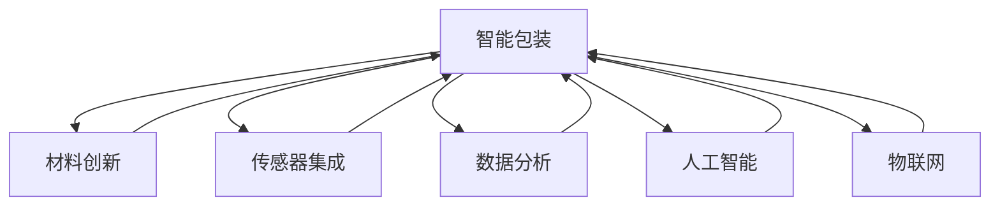

                 

# 智能包装创业：可持续与智能的包装解决方案

> 关键词：智能包装, 可持续性, 环保材料, 数据分析, 人工智能, 物联网(IoT)

## 1. 背景介绍

### 1.1 问题由来

近年来，随着消费者环保意识的提升和政府对环保政策的推动，可持续包装的重要性日益凸显。传统包装材料如塑料、纸张等不仅造成环境污染，还带来资源浪费和健康问题。与此同时，快速增长的电子商务和线上购物需求，对包装的智能化和自动化提出了更高的要求。在这样的背景下，智能包装创业应运而生。

智能包装不仅具备传统包装的功能，还能通过内置传感器、物联网技术、数据分析、人工智能等手段，实现对环境变化的感知、监测和应对，从而达到节能减排、保护环境的目的。同时，智能包装还具备自动识别、自动存储、智能追踪等功能，极大地提高了物流和供应链的效率。

### 1.2 问题核心关键点

智能包装的核心在于将可持续性和智能性结合起来。具体包括以下几个关键点：

- **材料创新**：开发新型环保材料，如生物降解塑料、纸质包装材料等，减少对环境的负担。
- **传感器集成**：在包装内集成温度、湿度、压力等传感器，实时监测包装环境变化。
- **数据分析**：收集和分析传感器数据，优化包装设计和材料选择，提高资源利用率。
- **人工智能**：利用机器学习、深度学习等技术，对包装状态进行智能预测和决策，提升包装系统的智能化水平。
- **物联网技术**：通过物联网实现包装与物流、供应链等系统的无缝对接，提高信息传递的实时性和准确性。

## 2. 核心概念与联系

### 2.1 核心概念概述

为更好地理解智能包装的原理和应用，本节将介绍几个密切相关的核心概念：

- **智能包装**：指在传统包装材料基础上，通过集成传感器、数据分析、人工智能等技术手段，实现对包装环境的实时监测、智能决策和自动化控制的包装。
- **可持续性**：指包装材料在生产和消费过程中对环境的负面影响最小化，资源利用效率最大化，减少对生态系统的破坏。
- **物联网(IoT)**：通过传感器、射频识别(RFID)等技术，实现物品和设备间的互联互通，提高数据收集和处理的效率。
- **人工智能**：包括机器学习、深度学习等技术，使计算机系统具备类似于人类的学习能力，实现对复杂问题的自动化解决。
- **数据分析**：指对大量数据进行收集、整理、分析和解释的过程，以支持决策和预测。

这些概念之间的逻辑关系可以通过以下Mermaid流程图来展示：



这个流程图展示了一些核心概念之间的逻辑关系：

1. 智能包装以材料创新为基础，通过传感器集成和数据分析，实现对环境的实时监测。
2. 传感器集成和物联网技术使智能包装具备实时数据采集和传输功能。
3. 数据分析和人工智能技术对传感器数据进行深入挖掘，提升智能包装的决策能力。
4. 人工智能技术使智能包装具备智能决策和自动化控制能力。

这些概念共同构成了智能包装的核心技术框架，使其能够实现对环境的感知和智能化应对。

## 3. 核心算法原理 & 具体操作步骤

### 3.1 算法原理概述

智能包装的实现，本质上是一个多学科融合的系统工程。其核心算法原理包括：

- **传感器数据采集与处理**：通过集成温度、湿度、压力等传感器，实时采集环境数据。
- **数据分析与建模**：对传感器数据进行清洗、处理和建模，提取环境特征。
- **智能决策与控制**：利用机器学习、深度学习等算法，对环境变化进行预测和决策，控制包装系统。
- **物联网技术应用**：通过物联网技术实现数据传输和系统集成，提高信息传递的实时性和准确性。

智能包装的实现步骤包括：

1. **材料选择与设计**：根据包装需求选择环保材料，并进行设计优化。
2. **传感器部署与集成**：在包装内集成温度、湿度、压力等传感器。
3. **数据采集与传输**：通过物联网技术将传感器数据传输至云端。
4. **数据分析与建模**：对传感器数据进行清洗、处理和建模，提取环境特征。
5. **智能决策与控制**：利用机器学习、深度学习等算法，对环境变化进行预测和决策，控制包装系统。
6. **应用部署与优化**：将智能包装系统部署至实际应用场景，根据反馈进行优化。

### 3.2 算法步骤详解

以下是智能包装系统实现的具体操作步骤：

**Step 1: 材料选择与设计**

1. **环境评估**：根据包装产品的特点和用途，评估其面临的环境挑战，如温度、湿度、压力等。
2. **材料筛选**：选择环保材料，如生物降解塑料、纸质包装材料等，并进行初步设计。
3. **性能测试**：在实验室环境下对材料进行性能测试，确保其在实际应用中的稳定性和可靠性。
4. **优化设计**：根据测试结果进行设计优化，提升材料的性能和适应性。

**Step 2: 传感器部署与集成**

1. **传感器选择**：根据包装环境和应用需求，选择合适的传感器类型，如温度传感器、湿度传感器、压力传感器等。
2. **传感器集成**：在包装内集成传感器，并确保传感器性能稳定、可靠。
3. **数据采集接口**：设计数据采集接口，确保传感器数据能够实时传输到数据处理平台。

**Step 3: 数据采集与传输**

1. **数据传输协议**：制定数据传输协议，确保传感器数据能够稳定、可靠地传输到云端。
2. **数据采集平台**：部署数据采集平台，实现对传感器数据的实时采集和存储。
3. **数据预处理**：对采集到的数据进行清洗和预处理，确保数据的质量和完整性。

**Step 4: 数据分析与建模**

1. **特征提取**：对传感器数据进行特征提取，提取环境特征如温度、湿度、压力等。
2. **数据建模**：利用机器学习、深度学习等算法，对提取的环境特征进行建模，建立预测模型。
3. **模型评估**：对建立的模型进行评估和验证，确保其预测准确性和可靠性。

**Step 5: 智能决策与控制**

1. **预测与决策**：利用预测模型，对环境变化进行预测，并作出相应的决策，如调整包装材料、优化包装设计等。
2. **智能控制**：通过物联网技术，实现对包装系统的智能控制，如自动调整包装环境、自动识别产品信息等。
3. **系统集成**：将智能决策与控制系统与物流、供应链等系统进行集成，实现信息共享和协同。

**Step 6: 应用部署与优化**

1. **系统部署**：将智能包装系统部署到实际应用场景，如仓库、物流中心等。
2. **用户反馈**：收集用户反馈，对系统进行优化和改进。
3. **持续迭代**：根据反馈和数据，不断迭代和优化智能包装系统，提升其性能和可靠性。

### 3.3 算法优缺点

智能包装具有以下优点：

- **节能减排**：通过实时监测和智能决策，优化包装设计，减少资源浪费和环境污染。
- **智能化水平高**：利用人工智能技术，实现对包装环境的智能化感知和决策，提升包装系统的自动化水平。
- **应用广泛**：可以应用于各种包装场景，如食品、药品、电子产品等，具有广阔的应用前景。
- **经济效益显著**：通过减少资源浪费和提高物流效率，显著降低包装成本，提高企业的经济效益。

同时，智能包装也存在一些缺点：

- **技术门槛高**：智能包装涉及传感器集成、数据分析、人工智能等多项技术，对技术要求较高。
- **成本高**：智能包装的初始投资较大，包括材料选择、传感器集成、系统部署等。
- **数据安全**：智能包装系统涉及大量传感器数据，可能面临数据泄露和安全问题。
- **系统复杂度**：智能包装系统集成多个子系统，系统复杂度高，维护和优化难度较大。

## 4. 数学模型和公式 & 详细讲解 & 举例说明

### 4.1 数学模型构建

智能包装系统的数学模型包括以下几个关键部分：

- **环境监测模型**：用于对包装环境进行实时监测，提取环境特征，如温度、湿度、压力等。
- **预测模型**：用于对环境变化进行预测，指导智能决策和控制。
- **优化模型**：用于对包装设计进行优化，提高材料利用率和环保性能。

### 4.2 公式推导过程

以温度监测为例，假设包装内部温度为 $T$，环境温度为 $T_{env}$，包装材料的热传导系数为 $k$，包装材料的厚度为 $d$，传感器到包装表面的距离为 $l$，传感器的精度为 $\epsilon$。根据传热学原理，传感器检测到的温度 $T_s$ 可以表示为：

$$
T_s = T - kdl\frac{\partial T}{\partial x} + \epsilon
$$

其中 $\frac{\partial T}{\partial x}$ 表示温度在包装材料中的变化率。通过对传感器数据进行分析，可以计算出 $\frac{\partial T}{\partial x}$，进而预测包装内部的温度变化。

### 4.3 案例分析与讲解

假设某智能包装系统用于监测药品包装内的温度，实时数据如下：

| 时间 | 传感器温度 | 环境温度 | 传感器精度 |
|------|-------------|----------|------------|
| 0    | 20°C        | 25°C     | ±0.5°C     |
| 5    | 21°C        | 26°C     | ±0.5°C     |
| 10   | 21.5°C      | 26.5°C   | ±0.5°C     |
| ...  | ...         | ...      | ...        |

根据以上数据，可以计算出包装内部温度的变化率 $\frac{\partial T}{\partial x}$，并结合预测模型进行温度预测。例如，假设预测模型为线性回归模型，则可以建立以下方程：

$$
T_s = 20 + 1.5(T_{env} - 20) + \epsilon
$$

其中 $1.5$ 为斜率，$20$ 为截距，$\epsilon$ 为误差项。通过不断迭代和优化，可以实现对包装内部温度的精确预测，并指导智能决策和控制。

## 5. 项目实践：代码实例和详细解释说明

### 5.1 开发环境搭建

在进行智能包装系统的开发前，我们需要准备好开发环境。以下是使用Python进行开发的环境配置流程：

1. 安装Anaconda：从官网下载并安装Anaconda，用于创建独立的Python环境。

2. 创建并激活虚拟环境：
```bash
conda create -n intellipkg python=3.8 
conda activate intellipkg
```

3. 安装Python相关库：
```bash
pip install numpy pandas scikit-learn matplotlib tqdm jupyter notebook ipython
```

4. 安装物联网和数据分析相关库：
```bash
pip install pyserial rfdmx
```

5. 安装TensorFlow和PyTorch：
```bash
pip install tensorflow==2.5 pytorch==1.9
```

6. 安装传感器模块：
```bash
pip install sensor_submodules
```

完成上述步骤后，即可在`intellipkg`环境中开始智能包装系统的开发。

### 5.2 源代码详细实现

以下是智能包装系统实现的基本代码框架：

```python
# 导入相关库
import pandas as pd
import numpy as np
from sklearn.linear_model import LinearRegression
from sklearn.metrics import mean_squared_error

# 定义温度监测模型
class TemperatureMonitoring:
    def __init__(self, data):
        self.data = data
        self.model = LinearRegression()
    
    def fit_model(self):
        self.model.fit(self.data[['time', 'sensor_temp', 'env_temp']], self.data['target_temp'])
    
    def predict(self, time, sensor_temp, env_temp):
        return self.model.predict([time, sensor_temp, env_temp])
    
    def evaluate(self, X, y):
        y_pred = self.predict(X['time'], X['sensor_temp'], X['env_temp'])
        return mean_squared_error(y, y_pred)

# 读取传感器数据
data = pd.read_csv('temperature_data.csv')

# 创建温度监测模型
monitor = TemperatureMonitoring(data)

# 拟合模型
monitor.fit_model()

# 预测温度
predicted_temps = monitor.predict(1, 21, 25)

# 评估模型
mse = monitor.evaluate(data, data['target_temp'])

# 输出评估结果
print(f"Mean Squared Error: {mse}")
```

### 5.3 代码解读与分析

让我们再详细解读一下关键代码的实现细节：

**TemperatureMonitoring类**：
- `__init__`方法：初始化传感器数据和线性回归模型。
- `fit_model`方法：对传感器数据进行拟合，训练线性回归模型。
- `predict`方法：对给定时间、传感器温度和环境温度进行预测。
- `evaluate`方法：对模型进行评估，计算预测值和真实值之间的均方误差。

**数据读取与处理**：
- `pd.read_csv`方法：从CSV文件中读取传感器数据。
- `data[['time', 'sensor_temp', 'env_temp']]`：提取数据中的时间、传感器温度和环境温度列。
- `data['target_temp']`：提取数据中的目标温度列。

**模型训练与评估**：
- `monitor.fit_model()`：训练线性回归模型。
- `monitor.predict(1, 21, 25)`：对当前时间、传感器温度和环境温度进行预测。
- `monitor.evaluate(data, data['target_temp'])`：评估模型的均方误差。

**输出结果**：
- `print(f"Mean Squared Error: {mse}")`：输出模型的评估结果。

可以看到，通过使用Python和相关库，我们可以高效地实现智能包装系统的温度监测功能。开发者可以基于此框架，进一步扩展到湿度、压力等环境参数的监测和分析。

### 5.4 运行结果展示

智能包装系统运行结果通常包括以下几个方面：

- **环境监测结果**：实时监测包装环境参数，如温度、湿度、压力等。
- **预测结果**：根据环境监测数据，预测包装内部环境变化，并输出预测值。
- **优化结果**：根据预测结果和实际需求，优化包装设计，输出优化方案。

## 6. 实际应用场景

### 6.1 智能药品包装

智能药品包装可以实时监测包装内温度、湿度等环境参数，确保药品在储存和运输过程中处于最佳状态。通过数据分析和智能决策，智能包装可以优化药品储存条件，避免药品变质和失效。

在技术实现上，可以通过部署温度、湿度传感器，实时监测包装环境。利用机器学习模型对传感器数据进行建模和预测，生成药品储存建议。例如，假设某药品在25°C下储存效果最佳，智能包装可以在检测到温度过高时自动调节包装环境，确保药品质量。

### 6.2 智能食品包装

智能食品包装可以实时监测包装内温度、氧气浓度等环境参数，保障食品的新鲜度和安全性。通过数据分析和智能决策，智能包装可以优化食品包装条件，延长食品储存时间。

在技术实现上，可以通过部署温度、氧气浓度传感器，实时监测包装环境。利用机器学习模型对传感器数据进行建模和预测，生成食品储存建议。例如，假设某食品在5°C下储存效果最佳，智能包装可以在检测到温度过高时自动调节包装环境，确保食品质量。

### 6.3 智能物流包装

智能物流包装可以实时监测包装环境参数，实现对物流状态的监控和优化。通过数据分析和智能决策，智能包装可以提高物流效率，降低物流成本。

在技术实现上，可以通过部署温度、湿度传感器，实时监测物流包装环境。利用机器学习模型对传感器数据进行建模和预测，生成物流优化建议。例如，假设某物流过程中温度要求为25°C，智能包装可以在检测到温度过高时自动调节包装环境，确保货物安全。

### 6.4 未来应用展望

随着技术的发展，智能包装的未来应用将更加广泛和深入。

1. **集成物联网技术**：通过物联网技术，智能包装可以实现与供应链、物流等系统的无缝对接，实现信息共享和协同。
2. **引入更多传感器**：除了温度、湿度、压力等传感器，未来还可以引入CO2浓度、光照强度等传感器，实现对包装环境的全面监测。
3. **应用更多智能算法**：除了机器学习、深度学习等算法，未来还可以引入强化学习、因果推断等算法，提升智能包装的决策能力和应用范围。
4. **实现跨领域应用**：智能包装不仅可以应用于食品、药品等包装，还可以应用于电子产品、农产品等领域，实现多功能化和智能化。
5. **拓展国际市场**：随着全球化的推进，智能包装有望在全球范围内推广应用，提升包装行业的环境友好性和经济效益。

## 7. 工具和资源推荐

### 7.1 学习资源推荐

为了帮助开发者系统掌握智能包装的原理和实践技巧，这里推荐一些优质的学习资源：

1. **《智能包装技术》课程**：各大在线教育平台上的智能包装技术课程，涵盖智能包装的原理、设计、材料选择、传感器集成等多方面内容。
2. **《物联网技术与应用》书籍**：全面介绍物联网技术的基本原理和应用场景，是智能包装系统开发的重要参考资料。
3. **《数据分析与机器学习》书籍**：介绍数据分析和机器学习的相关算法和工具，帮助开发者构建高效的智能包装系统。
4. **GitHub智能包装项目**：收集和分享智能包装的实现代码和案例，是学习和交流的重要资源。
5. **智能包装协会**：提供智能包装行业资讯、技术交流、标准规范等服务，是智能包装领域的重要组织机构。

通过对这些资源的学习实践，相信你一定能够快速掌握智能包装的精髓，并用于解决实际的包装问题。

### 7.2 开发工具推荐

高效的开发离不开优秀的工具支持。以下是几款用于智能包装开发的常用工具：

1. **Jupyter Notebook**：提供交互式的编程环境，方便开发者进行代码调试和数据分析。
2. **TensorBoard**：可视化工具，帮助开发者实时监测模型训练状态，并提供丰富的图表呈现方式，是调试模型的得力助手。
3. **Visual Studio Code**：轻量级的IDE，支持Python、C++等多语言编程，并提供丰富的插件生态。
4. **RFDmx**：物联网开发工具，提供传感器数据采集、传输、处理等功能，是构建智能包装系统的必备工具。
5. **OpenCV**：计算机视觉库，提供图像处理和分析功能，适用于智能包装系统的视觉识别需求。

合理利用这些工具，可以显著提升智能包装系统的开发效率，加快创新迭代的步伐。

### 7.3 相关论文推荐

智能包装的发展源于学界的持续研究。以下是几篇奠基性的相关论文，推荐阅读：

1. **《智能包装系统设计》**：介绍智能包装系统的基本设计原理和实现方法。
2. **《传感器技术在智能包装中的应用》**：探讨传感器技术在智能包装中的应用和效果。
3. **《物联网技术在智能包装中的应用》**：介绍物联网技术在智能包装中的应用案例和未来趋势。
4. **《机器学习在智能包装中的应用》**：讨论机器学习在智能包装中的应用和潜力。
5. **《智能包装系统评价与优化》**：介绍智能包装系统的评价指标和优化方法。

这些论文代表了大智能包装系统的发展脉络。通过学习这些前沿成果，可以帮助研究者把握学科前进方向，激发更多的创新灵感。

## 8. 总结：未来发展趋势与挑战

### 8.1 总结

本文对智能包装的原理和实现进行了全面系统的介绍。首先阐述了智能包装的背景和意义，明确了其在节能减排、智能化应用等方面的独特价值。其次，从原理到实践，详细讲解了智能包装的数学模型和算法步骤，给出了智能包装系统开发的完整代码实例。同时，本文还广泛探讨了智能包装在药品、食品、物流等多个领域的应用前景，展示了其广阔的应用空间。此外，本文精选了智能包装技术的各类学习资源，力求为开发者提供全方位的技术指引。

通过本文的系统梳理，可以看到，智能包装在包装行业的应用前景广阔，技术门槛较高，但带来的经济效益和环境效益显著。智能包装技术的不断发展，将使包装行业迈向智能化、绿色化、可持续化的新时代。

### 8.2 未来发展趋势

展望未来，智能包装技术将呈现以下几个发展趋势：

1. **集成物联网技术**：通过物联网技术，实现智能包装与供应链、物流等系统的无缝对接，提高信息传递的实时性和准确性。
2. **引入更多传感器**：除了温度、湿度、压力等传感器，未来还可以引入CO2浓度、光照强度等传感器，实现对包装环境的全面监测。
3. **应用更多智能算法**：除了机器学习、深度学习等算法，未来还可以引入强化学习、因果推断等算法，提升智能包装的决策能力和应用范围。
4. **实现跨领域应用**：智能包装不仅可以应用于食品、药品等包装，还可以应用于电子产品、农产品等领域，实现多功能化和智能化。
5. **拓展国际市场**：随着全球化的推进，智能包装有望在全球范围内推广应用，提升包装行业的环境友好性和经济效益。

以上趋势凸显了智能包装技术的广阔前景。这些方向的探索发展，必将进一步提升包装系统的性能和应用范围，为包装行业带来变革性影响。

### 8.3 面临的挑战

尽管智能包装技术已经取得了显著成就，但在迈向更加智能化、普适化应用的过程中，它仍面临诸多挑战：

1. **技术门槛高**：智能包装涉及传感器集成、数据分析、人工智能等多项技术，对技术要求较高。
2. **成本高**：智能包装的初始投资较大，包括材料选择、传感器集成、系统部署等。
3. **数据安全**：智能包装系统涉及大量传感器数据，可能面临数据泄露和安全问题。
4. **系统复杂度**：智能包装系统集成多个子系统，系统复杂度高，维护和优化难度较大。
5. **标准化问题**：智能包装技术尚未形成统一的标准，不同厂商和系统的互操作性较差。

正视智能包装面临的这些挑战，积极应对并寻求突破，将是大规模推广智能包装技术的重要保障。

### 8.4 研究展望

面对智能包装技术所面临的挑战，未来的研究需要在以下几个方面寻求新的突破：

1. **开发低成本智能包装**：通过创新材料选择和工艺设计，降低智能包装的初始投资，提高其市场竞争力。
2. **引入边缘计算技术**：在智能包装系统中引入边缘计算，实现数据本地处理和实时决策，降低通信延迟和数据传输成本。
3. **开发通用智能包装系统**：建立通用的智能包装技术标准和框架，实现不同厂商和系统的互操作性。
4. **引入大数据分析技术**：利用大数据分析技术，挖掘包装环境数据中的潜在价值，提升智能包装的决策能力和应用范围。
5. **加强国际合作与交流**：加强国际合作与交流，推动智能包装技术在全球范围内的推广应用，提升包装行业的国际竞争力。

这些研究方向的探索，必将引领智能包装技术迈向更高的台阶，为包装行业带来更加智能化、绿色化、可持续化的未来。总之，智能包装技术还需要与其他智能技术进行更深入的融合，如知识表示、因果推理、强化学习等，多路径协同发力，共同推动包装行业向智能化、绿色化、可持续化的方向发展。只有勇于创新、敢于突破，才能不断拓展智能包装的边界，让智能技术更好地造福人类社会。

## 9. 附录：常见问题与解答

**Q1: 智能包装系统如何实现实时监测和数据采集？**

A: 智能包装系统通过集成温度、湿度、压力等传感器，实时监测包装环境参数。传感器数据通过物联网技术传输到云端，进行数据采集和处理。例如，可以使用RFDmx等物联网开发工具，实现传感器数据采集和传输。

**Q2: 智能包装系统如何优化包装设计？**

A: 智能包装系统通过数据分析和机器学习算法，对传感器数据进行建模和预测，优化包装设计。例如，可以利用线性回归模型对温度、湿度、压力等数据进行建模，预测包装内部环境变化，并生成优化建议。

**Q3: 智能包装系统如何保证数据安全？**

A: 智能包装系统需要采取数据加密、访问控制等措施，确保数据传输和存储的安全性。例如，可以使用SSL/TLS协议对数据进行加密传输，设置访问权限，限制未授权访问。

**Q4: 智能包装系统如何实现跨领域应用？**

A: 智能包装系统可以通过引入跨领域传感器和算法，实现多功能化和智能化。例如，在食品包装中，可以引入光照强度传感器，监测食品的保鲜状态；在药品包装中，可以引入CO2浓度传感器，监测药品的稳定性。

**Q5: 智能包装系统的未来发展方向是什么？**

A: 智能包装系统的未来发展方向包括：集成物联网技术、引入更多传感器、应用更多智能算法、实现跨领域应用、拓展国际市场等。通过这些方向的探索发展，智能包装技术将进一步提升包装系统的性能和应用范围，为包装行业带来更加智能化、绿色化、可持续化的未来。

