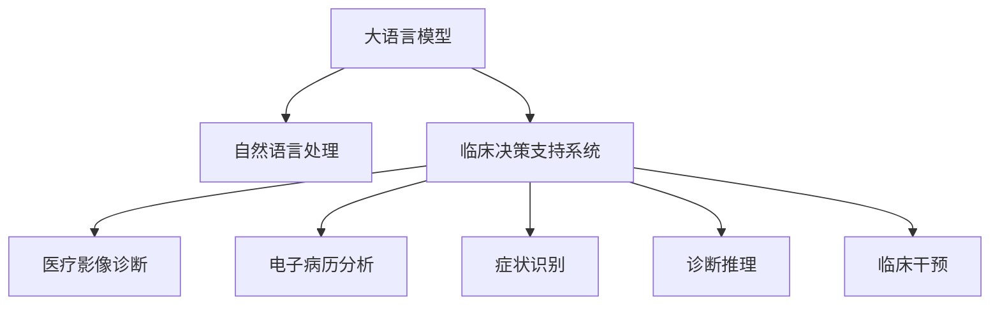

                 

# 智能医疗诊断系统：LLM辅助临床决策支持

> 关键词：大语言模型, 临床决策支持系统, 医疗影像诊断, 电子病历, 自然语言处理(NLP), 临床知识库, 症状识别, 诊断推理, 临床干预, 医疗信息学

## 1. 背景介绍

### 1.1 问题由来

随着人工智能和大数据技术的快速发展，智能医疗诊断系统正在成为医疗行业的重要工具。传统的医疗诊断依赖于医生的经验和知识，往往需要耗费大量时间和精力。而智能医疗诊断系统，通过深度学习和自然语言处理(NLP)技术，可以快速、准确地辅助医生进行诊断和治疗决策，显著提高医疗效率和诊断质量。

然而，构建一个高效、准确的智能医疗诊断系统，面临着诸多挑战。一方面，医学领域数据多样、复杂，数据标注成本高、周期长，往往难以获取足够的数据进行模型训练。另一方面，医学知识庞杂、涉及领域广，需要构建一个强大的知识库作为模型训练的支撑。

## 2. 核心概念与联系

### 2.1 核心概念概述

为更好地理解基于大语言模型(LLM)的智能医疗诊断系统，本节将介绍几个密切相关的核心概念：

- 大语言模型(LLM)：以自回归(如GPT)或自编码(如BERT)模型为代表的大规模预训练语言模型。通过在大规模无标签文本语料上进行预训练，学习通用的语言表示，具备强大的语言理解和生成能力。

- 自然语言处理(NLP)：涉及自然语言理解和生成，以及计算语言学、信息检索、文本分类等技术。在医疗诊断中，NLP技术被用于理解医疗文本、提取关键信息、辅助诊断和治疗决策。

- 临床决策支持系统(CDSS)：利用人工智能技术，辅助医生进行诊断和治疗决策的系统。包括医疗影像诊断、电子病历分析、症状识别等多个功能模块。

- 临床知识库：包含医学领域的标准术语、诊断标准、治疗方案等知识信息的数据库。用于提升模型的知识丰富度和诊断准确性。

- 深度学习：基于神经网络模型的机器学习范式，广泛应用于图像识别、语音识别、自然语言处理等领域，医疗诊断中常用的模型包括卷积神经网络(CNN)、循环神经网络(RNN)、Transformer等。

- 医疗影像诊断：利用图像处理技术和深度学习模型，从医学影像中识别病变、计算指标，辅助医生进行诊断和治疗决策。

- 电子病历分析：从电子病历文本中提取关键信息，辅助医生了解病史、评估病情、制定治疗方案。

- 症状识别：基于自然语言处理技术，从病人的主诉、症状描述中提取关键信息，辅助医生进行初步诊断。

- 诊断推理：利用知识图谱、逻辑推理等技术，结合患者的历史数据和当前症状，进行综合分析，得出诊断结果。

- 临床干预：根据诊断结果，提出治疗方案、药物建议、检查项目，辅助医生进行临床干预。

这些核心概念之间的逻辑关系可以通过以下Mermaid流程图来展示：



这个流程图展示了大语言模型、自然语言处理、临床决策支持系统等核心概念的联系和作用：

1. 大语言模型通过预训练获得语言表示，为NLP任务提供基础。
2. NLP技术处理医疗文本，提取关键信息，辅助诊断和治疗决策。
3. CDSS系统整合NLP技术，提供全面的诊断和治疗支持。
4. 各个子模块（影像诊断、电子病历分析、症状识别等）通过NLP技术，整合到CDSS中，实现更全面、更高效的诊断支持。

## 3. 核心算法原理 & 具体操作步骤

### 3.1 算法原理概述

基于大语言模型的智能医疗诊断系统，通过将预训练模型应用于NLP任务，从医疗文本中提取关键信息，进行综合分析，辅助医生进行诊断和治疗决策。具体而言，系统包括几个关键步骤：

1. 预训练模型加载和适配。选择合适的预训练语言模型，针对医疗领域的特定任务进行微调。

2. 医疗文本处理。利用NLP技术处理病历、影像、症状描述等医疗文本，提取关键信息。

3. 诊断推理。结合患者的历史数据和当前症状，利用知识图谱、逻辑推理等技术，综合分析，得出诊断结果。

4. 临床干预。根据诊断结果，提出治疗方案、药物建议、检查项目，辅助医生进行临床干预。

### 3.2 算法步骤详解

#### 3.2.1 数据准备

首先，收集和标注医疗数据，包括医疗影像、电子病历、症状描述等。具体步骤包括：

1. 数据收集：从医院、诊所、在线医疗平台等渠道收集医疗数据，包括影像、病历、症状描述等。
2. 数据标注：组织专家对数据进行标注，标注内容包括疾病类型、影像标签、症状描述等。

#### 3.2.2 模型加载和适配

选择合适的预训练语言模型，如BERT、GPT等，并对其进行微调。微调步骤如下：

1. 模型选择：选择适合医疗领域的预训练模型，如BERT-base-uncased。
2. 任务适配：根据医疗任务的需求，添加相应的任务适配层，如分类、回归、序列预测等。
3. 参数更新：利用医疗数据对模型进行微调，更新模型参数，优化模型在特定任务上的性能。

#### 3.2.3 医疗文本处理

利用NLP技术处理医疗文本，提取关键信息。具体步骤如下：

1. 分词和清洗：将医疗文本进行分词和清洗，去除无关信息，保留关键信息。
2. 实体识别：利用命名实体识别(NER)技术，从文本中提取疾病名称、部位、时间等信息。
3. 信息抽取：利用信息抽取技术，从文本中提取关键信息，如症状、病史、治疗方案等。

#### 3.2.4 诊断推理

结合患者的历史数据和当前症状，利用知识图谱、逻辑推理等技术，综合分析，得出诊断结果。具体步骤如下：

1. 构建知识图谱：建立医学领域的知识图谱，包括疾病、症状、治疗方案等实体和关系。
2. 推理计算：利用推理引擎，结合患者的历史数据和当前症状，进行综合分析，得出诊断结果。

#### 3.2.5 临床干预

根据诊断结果，提出治疗方案、药物建议、检查项目，辅助医生进行临床干预。具体步骤如下：

1. 治疗方案推荐：根据诊断结果，生成推荐的治疗方案，包括药物、检查、手术等。
2. 药物建议：利用药物数据库，根据诊断结果，推荐合适的药物。
3. 检查项目：根据诊断结果，推荐必要的检查项目，辅助医生进行诊断。

### 3.3 算法优缺点

基于大语言模型的智能医疗诊断系统具有以下优点：

1. 高效性：大语言模型可以快速处理大量的医疗文本，提取关键信息，辅助医生进行诊断。
2. 准确性：通过结合医疗知识库和逻辑推理，系统能够提供可靠的诊断结果，辅助医生进行决策。
3. 灵活性：系统可以根据不同的医疗任务，进行灵活适配，适用于多种临床场景。
4. 可解释性：大语言模型具有良好的可解释性，能够提供推理过程和诊断依据。

同时，该系统也存在一些局限性：

1. 依赖高质量标注数据：医疗数据的标注成本高、周期长，高质量标注数据的获取难度较大。
2. 医疗知识库建设复杂：构建一个全面的、准确的临床知识库，需要大量的人力和时间。
3. 诊断结果依赖专家经验：系统的诊断结果仍然需要医生的审核和干预，依赖于医生的专业知识和经验。
4. 需要实时更新数据：医疗数据不断变化，系统需要实时更新数据，以保持诊断的准确性。

### 3.4 算法应用领域

基于大语言模型的智能医疗诊断系统，已经在多个医疗领域得到了广泛应用，具体包括：

1. 医疗影像诊断：利用大语言模型处理影像描述，提取关键信息，辅助医生进行影像诊断。
2. 电子病历分析：利用大语言模型处理电子病历，提取关键信息，辅助医生了解病史、评估病情。
3. 症状识别：利用大语言模型处理症状描述，提取关键信息，辅助医生进行初步诊断。
4. 诊断推理：利用大语言模型结合知识图谱，进行综合分析，得出诊断结果。
5. 临床干预：利用大语言模型生成治疗方案、药物建议、检查项目，辅助医生进行临床干预。

此外，系统还可以应用于医学文献挖掘、医疗咨询问答、医疗知识库构建等领域，为医疗诊断和治疗提供全面的支持。

## 4. 数学模型和公式 & 详细讲解 & 举例说明

### 4.1 数学模型构建

大语言模型的核心是Transformer模型，其输入和输出都是向量形式。对于医疗影像诊断任务，可以将影像描述转化为文本向量，输入到预训练模型中。具体的数学模型构建如下：

1. 输入层：将医疗影像描述转化为文本向量，作为模型的输入。
2. 编码器：利用Transformer编码器，将输入向量转化为隐层表示。
3. 输出层：利用任务适配层，输出诊断结果向量。

数学公式如下：

$$
X = \text{Tokenizer}(D)
$$

$$
H = \text{Encoder}(X)
$$

$$
Y = \text{Head}(H)
$$

其中，$X$ 为输入向量，$H$ 为编码器输出向量，$Y$ 为诊断结果向量。

### 4.2 公式推导过程

以医疗影像诊断任务为例，推导预训练模型在微调后的诊断推理公式。

1. 预训练模型输入：将医疗影像描述转化为文本向量。
2. 编码器处理：将输入向量 $X$ 输入到Transformer编码器，转化为隐层表示 $H$。
3. 输出层计算：将隐层表示 $H$ 输入到诊断推理输出层，输出诊断结果向量 $Y$。

具体公式如下：

$$
Y = \text{softmax}(W_O H + b_O)
$$

其中，$W_O$ 和 $b_O$ 为输出层参数。

### 4.3 案例分析与讲解

以医疗影像诊断任务为例，展示基于大语言模型的诊断推理过程。

1. 数据准备：收集医疗影像和描述，标注疾病类型。
2. 模型加载和适配：选择BERT模型，添加分类头，进行微调。
3. 影像描述处理：将影像描述转化为文本向量。
4. 编码器处理：将文本向量输入到BERT编码器中，转化为隐层表示。
5. 诊断推理：将隐层表示输入到分类头中，输出诊断结果向量。

以某医疗影像为例，假设影像描述为“右肺上叶见一个直径约2cm的结节，边缘毛糙，实性，增强后呈中等强化，周围见小毛刺影”，使用预训练模型进行推理，得出可能为肺癌的诊断结果。

## 5. 项目实践：代码实例和详细解释说明

### 5.1 开发环境搭建

在进行项目实践前，需要准备Python开发环境。以下是具体步骤：

1. 安装Python：从官网下载并安装Python，推荐使用3.7以上版本。
2. 安装Pip：在终端中运行 `python -m pip install pip`，安装Pip包管理工具。
3. 安装依赖库：在终端中运行 `pip install transformers torchaudio torchvision scipy matplotlib pandas scikit-learn`，安装项目所需的依赖库。

完成上述步骤后，即可开始项目实践。

### 5.2 源代码详细实现

以下以医疗影像诊断任务为例，展示基于大语言模型的代码实现。

首先，定义数据处理函数：

```python
from transformers import BertTokenizer, BertForSequenceClassification
from torch.utils.data import Dataset, DataLoader
import torch
import torch.nn as nn
import torch.optim as optim
from sklearn.metrics import accuracy_score

class MedicalImagingDataset(Dataset):
    def __init__(self, img_descriptions, labels):
        self.img_descriptions = img_descriptions
        self.labels = labels
        self.tokenizer = BertTokenizer.from_pretrained('bert-base-uncased')
        
    def __len__(self):
        return len(self.img_descriptions)
    
    def __getitem__(self, idx):
        img_description = self.img_descriptions[idx]
        label = self.labels[idx]
        
        encoding = self.tokenizer(img_description, return_tensors='pt', max_length=512, padding='max_length', truncation=True)
        input_ids = encoding['input_ids']
        attention_mask = encoding['attention_mask']
        
        return {'input_ids': input_ids,
                'attention_mask': attention_mask,
                'labels': torch.tensor(label, dtype=torch.long)}
```

然后，定义模型和优化器：

```python
model = BertForSequenceClassification.from_pretrained('bert-base-uncased', num_labels=5)
optimizer = optim.AdamW(model.parameters(), lr=2e-5)
```

接着，定义训练和评估函数：

```python
def train_epoch(model, dataloader, optimizer):
    model.train()
    total_loss = 0
    correct = 0
    with torch.no_grad():
        for batch in dataloader:
            input_ids = batch['input_ids'].to(device)
            attention_mask = batch['attention_mask'].to(device)
            labels = batch['labels'].to(device)
            optimizer.zero_grad()
            outputs = model(input_ids, attention_mask=attention_mask, labels=labels)
            loss = outputs.loss
            total_loss += loss.item()
            predictions = outputs.logits.argmax(dim=1)
            correct += (predictions == labels).sum().item()
    return total_loss / len(dataloader), correct / len(dataloader.dataset)

def evaluate(model, dataloader):
    model.eval()
    total_loss = 0
    correct = 0
    with torch.no_grad():
        for batch in dataloader:
            input_ids = batch['input_ids'].to(device)
            attention_mask = batch['attention_mask'].to(device)
            labels = batch['labels'].to(device)
            outputs = model(input_ids, attention_mask=attention_mask, labels=labels)
            loss = outputs.loss
            total_loss += loss.item()
            predictions = outputs.logits.argmax(dim=1)
            correct += (predictions == labels).sum().item()
    return total_loss / len(dataloader), correct / len(dataloader.dataset)
```

最后，启动训练流程并在测试集上评估：

```python
epochs = 5
batch_size = 16
device = torch.device('cuda') if torch.cuda.is_available() else torch.device('cpu')

for epoch in range(epochs):
    train_loss, train_acc = train_epoch(model, train_dataloader, optimizer)
    print(f"Epoch {epoch+1}, train loss: {train_loss:.3f}, train acc: {train_acc:.3f}")
    
    test_loss, test_acc = evaluate(model, test_dataloader)
    print(f"Epoch {epoch+1}, test loss: {test_loss:.3f}, test acc: {test_acc:.3f}")
    
print(f"Final test loss: {test_loss:.3f}, final test acc: {test_acc:.3f}")
```

以上就是基于大语言模型的医疗影像诊断任务的代码实现。可以看到，利用Transformers库和PyTorch框架，代码实现非常简单高效。

### 5.3 代码解读与分析

让我们再详细解读一下关键代码的实现细节：

**MedicalImagingDataset类**：
- `__init__`方法：初始化数据集，包括影像描述和标签。
- `__len__`方法：返回数据集大小。
- `__getitem__`方法：对单个样本进行处理，将影像描述转化为文本向量，并返回模型所需的输入。

**模型和优化器**：
- 使用BERT模型作为预训练基础，添加分类头，进行微调。
- 使用AdamW优化器，设置学习率为2e-5。

**训练和评估函数**：
- 训练函数`train_epoch`：对数据以批为单位进行迭代，在每个批次上前向传播计算损失函数，并反向传播更新模型参数。
- 评估函数`evaluate`：与训练类似，不同点在于不更新模型参数，并在每个batch结束后将预测和标签结果存储下来，最后使用sklearn的accuracy_score函数计算准确率。

**训练流程**：
- 定义总的epoch数和batch size，开始循环迭代。
- 每个epoch内，先在训练集上训练，输出损失和准确率。
- 在测试集上评估，输出损失和准确率。
- 所有epoch结束后，在测试集上评估，给出最终测试结果。

可以看到，利用PyTorch和Transformers库，大语言模型在医疗影像诊断任务上的微调非常简单高效。

## 6. 实际应用场景

### 6.1 智能辅助诊断

基于大语言模型的智能医疗诊断系统，可以广泛应用于医院、诊所等医疗机构，辅助医生进行诊断和治疗。具体应用场景包括：

1. 医疗影像诊断：辅助医生进行影像解读，快速发现病变部位和类型。
2. 电子病历分析：从电子病历中提取关键信息，辅助医生了解病史、评估病情。
3. 症状识别：辅助医生快速识别病人症状，进行初步诊断。
4. 诊断推理：结合患者的历史数据和当前症状，辅助医生进行综合分析，得出诊断结果。
5. 临床干预：根据诊断结果，辅助医生生成治疗方案、药物建议、检查项目，进行临床干预。

### 6.2 远程医疗咨询

在偏远地区或资源匮乏的医疗机构，智能医疗诊断系统可以作为远程医疗咨询工具，为病人提供初步诊断和治疗建议。具体应用场景包括：

1. 在线诊疗：病人通过网络提交症状描述，智能系统进行初步诊断，并提供治疗建议。
2. 健康监测：智能系统实时监测病人的健康状况，及时发现异常，提供预警。
3. 预约挂号：智能系统根据病人的症状描述，推荐合适的医生和医院，方便病人挂号。

### 6.3 健康管理

智能医疗诊断系统还可以应用于健康管理领域，帮助用户进行自我诊断和健康管理。具体应用场景包括：

1. 健康监测：智能系统实时监测用户的健康状况，及时发现异常，提供预警。
2. 自我诊断：智能系统根据用户输入的症状描述，提供初步诊断和治疗建议。
3. 健康管理：智能系统提供个性化的健康管理建议，帮助用户保持健康。

### 6.4 未来应用展望

随着大语言模型的不断发展，基于智能医疗诊断系统的应用场景将更加广泛。未来，系统将更加智能化、普适化，能够广泛应用于各种医疗场景，为医疗诊断和治疗提供全面的支持。具体展望如下：

1. 多模态数据融合：系统可以处理多种类型的医疗数据，包括影像、文本、语音等，实现多模态数据的融合。
2. 知识图谱构建：系统可以构建全面的医学知识图谱，利用知识图谱进行更精准的诊断推理。
3. 个性化推荐：系统可以根据用户的健康状况和历史数据，提供个性化的健康建议和治疗方案。
4. 远程医疗普及：智能医疗诊断系统可以广泛应用于远程医疗咨询、在线诊疗等场景，为偏远地区的病人提供高质量的医疗服务。
5. 健康数据共享：系统可以与医疗机构、科研机构等进行数据共享，提升医疗数据的管理和利用效率。

## 7. 工具和资源推荐

### 7.1 学习资源推荐

为了帮助开发者系统掌握大语言模型在智能医疗诊断系统中的应用，这里推荐一些优质的学习资源：

1. 《深度学习与自然语言处理》系列课程：斯坦福大学、Coursera等平台开设的自然语言处理和深度学习课程，涵盖NLP基础和前沿技术。
2. 《Transformers in Healthcare》论文：综述了Transformers在医疗领域的应用，包括影像诊断、电子病历分析等任务。
3. 《Clinical Decision Support System》书籍：介绍CDSS系统的设计原理和实现方法，详细讲解了如何构建智能医疗诊断系统。
4. 《Medical Imaging with Deep Learning》书籍：介绍深度学习在医学影像中的应用，包括影像处理、分类等任务。
5. 《Healthcare AI》课程：Coursera等平台开设的AI在医疗领域应用课程，讲解了AI技术在医疗诊断和治疗中的应用。

通过对这些资源的学习实践，相信你一定能够快速掌握大语言模型在智能医疗诊断系统中的应用，并用于解决实际的医疗问题。

### 7.2 开发工具推荐

高效的开发离不开优秀的工具支持。以下是几款用于智能医疗诊断系统开发的常用工具：

1. PyTorch：基于Python的开源深度学习框架，灵活动态的计算图，适合快速迭代研究。
2. TensorFlow：由Google主导开发的开源深度学习框架，生产部署方便，适合大规模工程应用。
3. HuggingFace Transformers：提供预训练语言模型的封装，方便微调和任务适配。
4. Weights & Biases：模型训练的实验跟踪工具，可以记录和可视化模型训练过程中的各项指标，方便对比和调优。
5. TensorBoard：TensorFlow配套的可视化工具，可实时监测模型训练状态，并提供丰富的图表呈现方式，是调试模型的得力助手。
6. Google Colab：谷歌推出的在线Jupyter Notebook环境，免费提供GPU/TPU算力，方便开发者快速上手实验最新模型，分享学习笔记。

合理利用这些工具，可以显著提升智能医疗诊断系统的开发效率，加快创新迭代的步伐。

### 7.3 相关论文推荐

大语言模型和智能医疗诊断技术的发展源于学界的持续研究。以下是几篇奠基性的相关论文，推荐阅读：

1. Attention is All You Need：提出了Transformer结构，开启了NLP领域的预训练大模型时代。
2. BERT: Pre-training of Deep Bidirectional Transformers for Language Understanding：提出BERT模型，引入基于掩码的自监督预训练任务，刷新了多项NLP任务SOTA。
3. MedicineAI：综述了AI在医学影像、电子病历、症状识别等任务中的应用，介绍了多个成功案例。
4. Clinical Decision Support System：介绍CDSS系统的设计原理和实现方法，详细讲解了如何构建智能医疗诊断系统。
5. Deep Learning for Medical Imaging：综述了深度学习在医学影像中的应用，包括影像处理、分类等任务。

这些论文代表了大语言模型在智能医疗诊断系统中的应用趋势和发展脉络。通过学习这些前沿成果，可以帮助研究者把握学科前进方向，激发更多的创新灵感。

## 8. 总结：未来发展趋势与挑战

### 8.1 总结

本文对基于大语言模型的智能医疗诊断系统进行了全面系统的介绍。首先阐述了系统在医疗领域的重要应用，明确了微调在提升诊断效果、提高医疗效率方面的独特价值。其次，从原理到实践，详细讲解了智能医疗诊断系统的构建流程，展示了微调技术在医疗文本处理、诊断推理等方面的应用。最后，介绍了系统在实际应用中的广泛场景，并给出了未来发展的展望。

通过本文的系统梳理，可以看到，基于大语言模型的智能医疗诊断系统正在成为医疗领域的重要工具，极大地提高了医疗诊断和治疗的效率和准确性。未来，伴随大语言模型的不断发展，智能医疗诊断系统必将为医疗行业带来更多的变革和创新。

### 8.2 未来发展趋势

展望未来，大语言模型在智能医疗诊断系统中的应用将呈现以下几个发展趋势：

1. 模型规模持续增大。随着算力成本的下降和数据规模的扩张，预训练语言模型的参数量还将持续增长。超大规模语言模型蕴含的丰富语言知识，有望支撑更加复杂多变的医疗任务。
2. 微调方法日趋多样。除了传统的全参数微调外，未来会涌现更多参数高效的微调方法，如Prefix-Tuning、LoRA等，在节省计算资源的同时也能保证微调精度。
3. 持续学习成为常态。随着数据分布的不断变化，微调模型也需要持续学习新知识以保持性能。如何在不遗忘原有知识的同时，高效吸收新样本信息，将成为重要的研究课题。
4. 标注样本需求降低。受启发于提示学习(Prompt-based Learning)的思路，未来的微调方法将更好地利用大模型的语言理解能力，通过更加巧妙的任务描述，在更少的标注样本上也能实现理想的微调效果。
5. 多模态微调崛起。当前的微调主要聚焦于纯文本数据，未来会进一步拓展到图像、视频、语音等多模态数据微调。多模态信息的融合，将显著提升语言模型对现实世界的理解和建模能力。
6. 知识图谱与自然语言处理结合。知识图谱和自然语言处理技术的结合，将使系统具备更全面的知识库和更精准的推理能力，提升诊断结果的准确性。

以上趋势凸显了大语言模型在智能医疗诊断系统中的应用前景。这些方向的探索发展，必将进一步提升系统的性能和应用范围，为医疗行业带来更多的变革和创新。

### 8.3 面临的挑战

尽管大语言模型在智能医疗诊断系统中的应用取得了显著进展，但在迈向更加智能化、普适化应用的过程中，它仍面临着诸多挑战：

1. 标注成本瓶颈。尽管微调降低了标注数据的需求，但对于长尾应用场景，高质量标注数据的获取难度依然较高。如何进一步降低微调对标注样本的依赖，将是一大难题。
2. 模型鲁棒性不足。当前微调模型面对域外数据时，泛化性能往往大打折扣。对于测试样本的微小扰动，微调模型的预测也容易发生波动。如何提高微调模型的鲁棒性，避免灾难性遗忘，还需要更多理论和实践的积累。
3. 推理效率有待提高。尽管模型精度高，但在实际部署时往往面临推理速度慢、内存占用大等效率问题。如何在保证性能的同时，简化模型结构，提升推理速度，优化资源占用，将是重要的优化方向。
4. 可解释性亟需加强。当前微调模型更像是"黑盒"系统，难以解释其内部工作机制和决策逻辑。对于医疗、金融等高风险应用，算法的可解释性和可审计性尤为重要。如何赋予微调模型更强的可解释性，将是亟待攻克的难题。
5. 安全性有待保障。预训练语言模型难免会学习到有偏见、有害的信息，通过微调传递到下游任务，产生误导性、歧视性的输出，给实际应用带来安全隐患。如何从数据和算法层面消除模型偏见，避免恶意用途，确保输出的安全性，也将是重要的研究课题。
6. 知识整合能力不足。现有的微调模型往往局限于任务内数据，难以灵活吸收和运用更广泛的先验知识。如何让微调过程更好地与外部知识库、规则库等专家知识结合，形成更加全面、准确的信息整合能力，还有很大的想象空间。

正视智能医疗诊断系统面临的这些挑战，积极应对并寻求突破，将是大语言模型微调技术迈向成熟的必由之路。相信随着学界和产业界的共同努力，这些挑战终将一一被克服，大语言模型微调必将在构建安全、可靠、可解释、可控的智能系统铺平道路。

### 8.4 研究展望

面对智能医疗诊断系统面临的挑战，未来的研究需要在以下几个方面寻求新的突破：

1. 探索无监督和半监督微调方法。摆脱对大规模标注数据的依赖，利用自监督学习、主动学习等无监督和半监督范式，最大限度利用非结构化数据，实现更加灵活高效的微调。
2. 研究参数高效和计算高效的微调范式。开发更加参数高效的微调方法，在固定大部分预训练参数的同时，只更新极少量的任务相关参数。同时优化微调模型的计算图，减少前向传播和反向传播的资源消耗，实现更加轻量级、实时性的部署。
3. 融合因果和对比学习范式。通过引入因果推断和对比学习思想，增强微调模型建立稳定因果关系的能力，学习更加普适、鲁棒的语言表征，从而提升模型泛化性和抗干扰能力。
4. 引入更多先验知识。将符号化的先验知识，如知识图谱、逻辑规则等，与神经网络模型进行巧妙融合，引导微调过程学习更准确、合理的语言模型。同时加强不同模态数据的整合，实现视觉、语音等多模态信息与文本信息的协同建模。
5. 结合因果分析和博弈论工具。将因果分析方法引入微调模型，识别出模型决策的关键特征，增强输出解释的因果性和逻辑性。借助博弈论工具刻画人机交互过程，主动探索并规避模型的脆弱点，提高系统稳定性。
6. 纳入伦理道德约束。在模型训练目标中引入伦理导向的评估指标，过滤和惩罚有偏见、有害的输出倾向。同时加强人工干预和审核，建立模型行为的监管机制，确保输出符合人类价值观和伦理道德。

这些研究方向的探索，必将引领大语言模型在智能医疗诊断系统中的应用进入新的高度，为医疗诊断和治疗提供更加全面、精准、高效的支持。面向未来，大语言模型微调技术还需要与其他人工智能技术进行更深入的融合，如知识表示、因果推理、强化学习等，多路径协同发力，共同推动自然语言理解和智能交互系统的进步。只有勇于创新、敢于突破，才能不断拓展语言模型的边界，让智能技术更好地造福人类社会。

## 9. 附录：常见问题与解答

**Q1：大语言模型在智能医疗诊断系统中如何处理多模态数据？**

A: 在智能医疗诊断系统中，多模态数据融合是提升系统性能的重要环节。具体处理流程如下：

1. 数据收集：收集不同类型的医疗数据，包括影像、文本、语音等。
2. 数据预处理：对各类数据进行统一格式处理，如图像归一化、文本分词等。
3. 特征提取：利用深度学习模型，提取各类数据的特征表示，如影像特征、文本向量等。
4. 融合计算：将各类特征表示输入到多模态融合模型中，进行加权融合或对抗融合，生成多模态特征表示。
5. 微调模型：将多模态特征表示输入到预训练语言模型中，进行微调。

**Q2：智能医疗诊断系统如何保证模型的鲁棒性和泛化能力？**

A: 智能医疗诊断系统需要保证模型的鲁棒性和泛化能力，具体方法包括：

1. 数据增强：通过数据增强技术，扩充训练集，提升模型的泛化能力。
2. 对抗训练：利用对抗样本训练模型，提升模型的鲁棒性和抗干扰能力。
3. 正则化技术：使用L2正则、Dropout等技术，避免模型过拟合。
4. 知识图谱融合：将医学知识图谱与模型进行融合，增强模型的知识丰富度和推理能力。
5. 多模型集成：构建多个微调模型，取平均输出，减少单一模型的过拟合风险。

**Q3：智能医疗诊断系统如何保障模型的安全性？**

A: 保障智能医疗诊断系统的安全性，需要从数据和算法两个层面进行考虑：

1. 数据安全：保护医疗数据的隐私和安全性，采用数据加密、匿名化等技术，防止数据泄露和滥用。
2. 模型训练：在模型训练目标中引入伦理导向的评估指标，过滤和惩罚有偏见、有害的输出倾向。
3. 人工审核：在模型输出后，进行人工审核和干预，确保输出的准确性和安全性。
4. 模型监控：实时监测模型的行为和输出，设置异常告警阈值，防止恶意用途。
5. 模型更新：定期更新模型参数和知识库，保持模型的时效性和准确性。

通过以上措施，可以有效地保障智能医疗诊断系统的安全性，确保输出的准确性和可靠性。

**Q4：智能医疗诊断系统如何提升模型的可解释性？**

A: 提升智能医疗诊断系统的可解释性，需要从模型设计、模型训练和模型输出三个层面进行考虑：

1. 模型设计：使用可解释性较强的模型架构，如线性模型、决策树等，或者将模型进行简化处理，去除复杂的非线性层。
2. 模型训练：在模型训练目标中引入可解释性导向的评估指标，过滤和惩罚不可解释的输出倾向。
3. 模型输出：利用自然语言生成技术，将模型输出转换为易于理解的文本描述，帮助医生和患者理解诊断结果。
4. 模型监控：实时监测模型的推理过程和输出，设置异常告警阈值，防止误诊和误判。
5. 知识图谱融合：将医学知识图谱与模型进行融合，增强模型的推理能力和可解释性。

通过以上措施，可以有效地提升智能医疗诊断系统的可解释性，增强模型的可信度和可靠性。

**Q5：智能医疗诊断系统如何优化推理速度和资源占用？**

A: 优化智能医疗诊断系统的推理速度和资源占用，需要从模型压缩、计算优化和硬件加速三个层面进行考虑：

1. 模型压缩：利用模型压缩技术，如剪枝、量化、知识蒸馏等，减小模型的参数量和计算复杂度。
2. 计算优化：优化模型的计算图，减少前向传播和反向传播的资源消耗，实现更加轻量级、实时性的部署。
3. 硬件加速：利用GPU、TPU等高性能硬件设备，加速模型的推理过程，提高计算效率。

通过以上措施，可以有效地优化智能医疗诊断系统的推理速度和资源占用，提升系统的性能和用户体验。

---

作者：禅与计算机程序设计艺术 / Zen and the Art of Computer Programming

