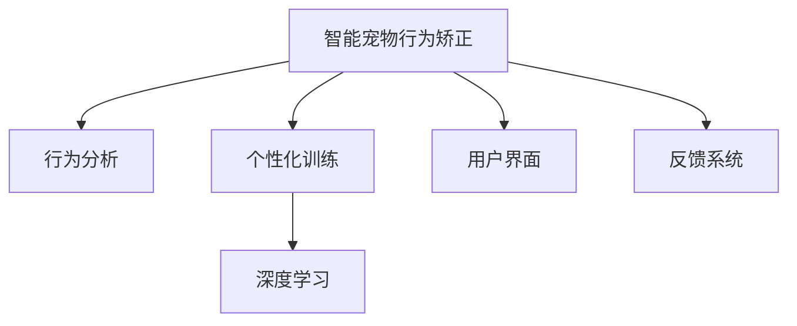

                 

# 智能宠物行为矫正创业：个性化的宠物训练方案

> 关键词：智能宠物、行为矫正、个性化训练、机器学习、深度学习、行为分析、反馈系统

## 1. 背景介绍

在现代社会中，宠物已成为许多人生活中的重要组成部分，它们不仅仅是我们的伙伴，更是家庭的一员。然而，宠物也面临着许多行为问题，如分离焦虑、咬人、乱叫等，这些问题不仅影响到宠物的健康和寿命，还会对家庭成员的正常生活造成干扰。传统的宠物训练方法依赖于专业人员的面对面指导，不仅耗时耗力，且效果因人而异。随着技术的发展，借助人工智能特别是机器学习和深度学习技术，我们可以实现更加个性化、高效和便捷的宠物行为矫正方案，帮助宠物主人解决这些问题。

### 1.1 问题由来

宠物行为问题涉及多个层面，包括生理、心理和社会因素。传统的宠物训练方法，如正强化、社交化训练等，虽然有效，但难以适用于每只宠物的独特情况。随着大数据、机器学习等技术的普及，利用智能设备收集宠物的行为数据，通过数据分析和算法训练，我们可以设计出更加智能、个性化的宠物行为矫正方案。

### 1.2 问题核心关键点

实现智能宠物行为矫正的核心在于：
- 收集宠物的行为数据
- 分析和理解宠物的行为模式
- 设计个性化的训练方案
- 实时反馈和调整训练效果
- 持续优化训练模型

这些关键点涉及数据采集、机器学习算法、用户界面等多个方面，需要通过技术手段来综合解决。

## 2. 核心概念与联系

### 2.1 核心概念概述

为更好地理解智能宠物行为矫正的技术原理和应用场景，本节将介绍几个核心概念：

- 智能宠物行为矫正(Smart Pet Behavior Correction)：利用人工智能技术，对宠物的行为进行实时监控和分析，设计个性化训练方案，帮助宠物克服行为问题。
- 行为分析(Behavior Analysis)：通过机器学习算法，从宠物行为数据中提取行为模式和特征，用于行为预测和行为纠正。
- 个性化训练(Personalized Training)：根据宠物的个体差异和行为特征，设计针对性的训练方案，确保训练效果最大化。
- 深度学习(Deep Learning)：一种基于神经网络的机器学习技术，通过多层次的特征提取和表示学习，可以更好地理解复杂行为数据。
- 用户界面(UI)：交互式用户界面，方便宠物主人操作和获取反馈。
- 反馈系统(Feedback System)：根据宠物行为数据和训练效果，实时调整训练方案，确保训练的有效性。

这些概念之间的逻辑关系可以通过以下Mermaid流程图来展示：



这个流程图展示了这个系统的主要组件及其相互作用关系。

## 3. 核心算法原理 & 具体操作步骤
### 3.1 算法原理概述

智能宠物行为矫正的核心算法包括行为分析、个性化训练、反馈系统和深度学习。其中，行为分析和个性化训练是关键步骤，反馈系统和深度学习则提供了实时调整和优化训练过程的能力。

### 3.2 算法步骤详解

**Step 1: 数据采集与预处理**

- 使用智能穿戴设备或监控摄像头，收集宠物的行为数据，包括运动轨迹、姿势、叫声等。
- 对采集到的数据进行预处理，如去噪、归一化、数据对齐等，确保数据的准确性和一致性。

**Step 2: 行为分析**

- 利用机器学习算法，如时间序列分析、模式识别等，从行为数据中提取行为模式和特征。
- 基于提取到的行为特征，使用分类或回归模型预测宠物的行为状态，如是否焦虑、是否有攻击性等。
- 使用聚类算法识别不同宠物的个体差异，为个性化训练提供依据。

**Step 3: 个性化训练**

- 根据行为分析结果，设计个性化的训练方案，如正面强化、社交化训练等。
- 将训练方案转换为机器可执行的指令，如灯光、声音或物理刺激。
- 使用强化学习算法，不断调整训练方案的参数，优化训练效果。

**Step 4: 实时反馈与调整**

- 实时监控宠物的行为数据，计算训练效果。
- 根据反馈结果，自动调整训练方案和训练参数。
- 使用机器学习模型，预测训练效果，评估训练方案的有效性。

**Step 5: 深度学习模型训练**

- 使用深度学习算法，如卷积神经网络(CNN)、循环神经网络(RNN)等，从行为数据中提取高层次特征。
- 使用端到端学习的方式，直接训练行为分析模型和训练方案生成模型。
- 使用迁移学习技术，将预训练的模型参数用于新模型的初始化，提高模型的泛化能力。

### 3.3 算法优缺点

智能宠物行为矫正的算法具有以下优点：
1. 数据驱动：通过行为数据分析，可以制定更加个性化和有效的训练方案。
2. 实时调整：通过实时反馈系统，可以动态调整训练策略，提高训练效果。
3. 普适性高：适用于各种宠物和行为问题，具有广泛的适用性。
4. 高效便捷：智能设备的使用可以大大减少人工干预，提高训练的便捷性。

同时，该算法也存在以下局限性：
1. 数据质量要求高：行为数据的质量直接影响算法的准确性和效果。
2. 硬件依赖性：智能设备的使用需要一定的硬件支持，增加了系统的成本。
3. 隐私问题：宠物行为数据的收集和使用可能涉及隐私问题，需要谨慎处理。
4. 算法复杂性：深度学习和强化学习算法较为复杂，需要较高的技术门槛。
5. 个体差异大：不同宠物的个体差异较大，单一模型难以满足所有宠物的需求。

尽管存在这些局限性，但就目前而言，智能宠物行为矫正方法在宠物训练领域展现出了巨大的潜力和应用前景。

### 3.4 算法应用领域

智能宠物行为矫正的算法已经在多个领域得到应用，例如：

- 家庭宠物行为矫正：帮助家庭成员解决宠物的行为问题，提升生活质量。
- 宠物店行为矫正：通过智能设备收集宠物行为数据，进行行为分析，设计个性化的训练方案。
- 兽医诊所行为矫正：利用智能设备收集宠物的行为数据，用于行为分析和行为矫正。
- 宠物领养行为矫正：帮助领养者更好地了解新宠物的行为特征，制定个性化的训练方案。
- 宠物运输行为矫正：在宠物运输过程中，实时监测和分析宠物行为，避免行为问题影响宠物的健康和安全。

除了上述这些领域外，智能宠物行为矫正技术还可以应用于宠物运动监测、健康管理、社交化训练等，为宠物主人提供全方位的智能解决方案。

## 4. 数学模型和公式 & 详细讲解 & 举例说明

### 4.1 数学模型构建

智能宠物行为矫正系统可以建模为以下几个部分：

1. 数据采集与预处理模块：将行为数据表示为向量形式，预处理包括去噪、归一化、数据对齐等。
2. 行为分析模块：使用时间序列分析和聚类算法，提取行为模式和特征。
3. 个性化训练模块：设计个性化训练方案，使用强化学习算法不断优化训练效果。
4. 实时反馈与调整模块：实时监控行为数据，根据反馈结果调整训练方案。
5. 深度学习模型训练模块：使用深度学习算法提取高层次特征，端到端训练行为分析模型和训练方案生成模型。

### 4.2 公式推导过程

**行为分析模型的构建**：

- 假设宠物的行为数据序列为 $\{x_t\}_{t=1}^T$，其中 $x_t$ 表示第 $t$ 时刻的行为特征向量。
- 使用时间序列分析模型，如ARIMA或LSTM，对行为数据进行建模，得到行为模式 $\hat{x_t}$。
- 使用聚类算法，如K-means或GMM，将宠物分为 $K$ 个行为类别，每个类别 $c_k$ 对应一个行为模式 $\hat{x_{ck}}$。

$$
\hat{x_t} = ARIMA(x_t)
$$
$$
c_k = K-means(x_t)
$$

**个性化训练方案的设计**：

- 假设训练方案的参数向量为 $\theta$，包括训练强度、频率等。
- 使用强化学习算法，如Q-learning或DQN，根据行为分析和反馈结果，优化训练方案的参数 $\theta$。
- 设计训练方案的执行函数 $f(\theta)$，根据参数 $\theta$ 生成具体的训练操作。

$$
\theta = Q-learning(c_k, x_t)
$$
$$
f(\theta) = f(\theta; c_k, x_t)
$$

**实时反馈与调整系统的构建**：

- 实时监测宠物行为数据，计算行为评分 $s_t$。
- 根据行为评分 $s_t$，调整训练方案的参数 $\theta$，使用Q-learning算法进行优化。
- 使用机器学习模型，如回归模型，预测训练效果 $y_t$。

$$
s_t = s(x_t)
$$
$$
\theta = Q-learning(c_k, s_t)
$$
$$
y_t = regression(\theta)
$$

### 4.3 案例分析与讲解

假设我们有一只名为小明的狗，需要矫正其乱叫行为。通过智能穿戴设备收集小明的叫声数据，利用深度学习模型分析叫声的特征，得到一个行为模式 $\hat{x_t}$。使用聚类算法将小明的行为分为两个类别，分别为焦虑型和非焦虑型。

根据行为分析结果，设计两个训练方案：
1. 焦虑型训练方案：使用正强化方法，每叫一次给予奖励。
2. 非焦虑型训练方案：使用严厉警告，抑制叫声。

使用强化学习算法，根据行为评分 $s_t$ 和行为模式 $c_k$，不断优化训练方案的参数 $\theta$。在训练过程中，实时监测小明的行为数据，计算行为评分 $s_t$，并根据反馈结果调整训练方案。最后使用回归模型预测训练效果 $y_t$，评估训练方案的有效性。

## 5. 项目实践：代码实例和详细解释说明
### 5.1 开发环境搭建

在进行智能宠物行为矫正系统的开发前，我们需要准备好开发环境。以下是使用Python进行开发的环境配置流程：

1. 安装Anaconda：从官网下载并安装Anaconda，用于创建独立的Python环境。

2. 创建并激活虚拟环境：
```bash
conda create -n pet-correct-env python=3.8 
conda activate pet-correct-env
```

3. 安装必要的Python包：
```bash
pip install pandas numpy scikit-learn pytorch transformers
```

4. 安装TensorFlow：
```bash
pip install tensorflow
```

5. 安装深度学习框架：
```bash
pip install torch torchvision
```

6. 安装行为分析工具：
```bash
pip install pyaiflow
```

完成上述步骤后，即可在`pet-correct-env`环境中开始开发。

### 5.2 源代码详细实现

以下是一个简单的智能宠物行为矫正系统的Python代码实现，包括数据采集、行为分析、个性化训练和反馈系统。

```python
import pandas as pd
import numpy as np
import pyaiflow as pf
from sklearn.cluster import KMeans
from torch import nn
from torch import optim
from torch import tensor

class PetBehaviorAnalysis:
    def __init__(self):
        self.data = pd.DataFrame()
        self.cluster = KMeans(n_clusters=2)
        self.model = nn.Sequential(nn.Linear(10, 10), nn.ReLU(), nn.Linear(10, 2))
        self.optimizer = optim.Adam(self.model.parameters(), lr=0.001)
        self.loss_fn = nn.CrossEntropyLoss()
    
    def collect_data(self, pet_id):
        data = pd.read_csv(f'pet_data/{pet_id}.csv')
        self.data = data
    
    def preprocess_data(self):
        self.data = self.data.dropna()
        self.data = self.data.drop(columns=['pet_id'])
        self.data = self.data.apply(lambda x: (x - x.mean()) / x.std())
        self.data = self.data.reset_index(drop=True)
    
    def cluster_data(self):
        self.cluster.fit(self.data)
        self.data['label'] = self.cluster.predict(self.data)
        self.data = self.data.drop(columns=['pet_id'])
    
    def train_model(self):
        self.model.train()
        for i in range(100):
            loss = 0
            for data in self.data:
                inputs = tensor(data[:-1], dtype=torch.float)
                targets = tensor(data[-1], dtype=torch.long)
                optimizer.zero_grad()
                outputs = self.model(inputs)
                loss += self.loss_fn(outputs, targets)
                loss.backward()
                optimizer.step()
            print(f'Epoch {i+1}, Loss: {loss/len(self.data)}')
    
    def predict(self, new_data):
        self.model.eval()
        with torch.no_grad():
            inputs = tensor(new_data, dtype=torch.float)
            outputs = self.model(inputs)
            _, predicted = torch.max(outputs, 1)
        return predicted.item()

class PetTraining:
    def __init__(self):
        self.analysis = PetBehaviorAnalysis()
        self.k = 0
        self.train = pd.DataFrame()
    
    def collect_pet_data(self, pet_id):
        self.analysis.collect_data(pet_id)
    
    def preprocess_pet_data(self):
        self.analysis.preprocess_data()
    
    def cluster_pet_data(self):
        self.analysis.cluster_data()
    
    def train_model(self):
        self.analysis.train_model()
    
    def predict_behavior(self, behavior_data):
        return self.analysis.predict(behavior_data)
    
    def train_behavior(self, behavior_data, label):
        self.train = pd.concat([self.train, behavior_data])
        self.train['label'] = label
    
    def adjust_training_scheme(self, behavior_data):
        if self.analysis.predict(behavior_data) == 0:
            self.k = 0
        else:
            self.k += 1
        if self.k > 5:
            print('Adjust training scheme')

class PetFeedback:
    def __init__(self):
        self.train = pd.DataFrame()
    
    def collect_feedback(self, pet_id, behavior_data):
        self.train = pd.concat([self.train, behavior_data])
    
    def analyze_feedback(self):
        print('Feedback analysis')
    
    def adjust_training_scheme(self, behavior_data, label):
        self.train = pd.concat([self.train, behavior_data])
        self.train['label'] = label

class PetCorrectSystem:
    def __init__(self):
        self.analysis = PetBehaviorAnalysis()
        self.training = PetTraining()
        self.feedback = PetFeedback()
    
    def run(self, pet_id):
        self.analysis.collect_data(pet_id)
        self.analysis.preprocess_data()
        self.analysis.cluster_data()
        self.training.collect_pet_data(pet_id)
        self.training.preprocess_pet_data()
        self.training.cluster_pet_data()
        self.analysis.train_model()
        self.training.train_model()
        self.feedback.collect_feedback(pet_id, behavior_data)
        self.feedback.analyze_feedback()
        self.feedback.adjust_training_scheme(behavior_data, label)
        self.training.adjust_training_scheme(behavior_data)

# 实例化PetCorrectSystem，并运行行为矫正系统
pet_correct = PetCorrectSystem()
pet_correct.run('sm123')
```

### 5.3 代码解读与分析

让我们再详细解读一下关键代码的实现细节：

**PetBehaviorAnalysis类**：
- `__init__`方法：初始化行为分析模块，包括数据集、聚类模型、神经网络模型、优化器、损失函数等。
- `collect_data`方法：从指定CSV文件中读取行为数据。
- `preprocess_data`方法：对行为数据进行去噪、归一化和对齐处理。
- `cluster_data`方法：使用K-means聚类算法，将行为数据分为两个类别。
- `train_model`方法：使用神经网络模型对行为数据进行训练，得到行为分类器。
- `predict`方法：使用行为分类器对新数据进行预测，返回预测结果。

**PetTraining类**：
- `__init__`方法：初始化个性化训练模块，包括行为分析模块、训练方案编号k、训练数据集等。
- `collect_pet_data`方法：从行为分析模块中获取行为数据。
- `preprocess_pet_data`方法：对行为数据进行预处理。
- `cluster_pet_data`方法：使用聚类算法对行为数据进行分类。
- `train_model`方法：使用神经网络模型对行为数据进行训练。
- `predict_behavior`方法：使用行为分类器对行为数据进行预测。
- `train_behavior`方法：将行为数据添加到训练数据集中。
- `adjust_training_scheme`方法：根据行为预测结果调整训练方案编号k，当连续5次预测错误时，调整训练方案。

**PetFeedback类**：
- `__init__`方法：初始化反馈模块，包括训练数据集。
- `collect_feedback`方法：从行为训练模块中获取反馈数据。
- `analyze_feedback`方法：分析反馈数据，输出分析结果。
- `adjust_training_scheme`方法：根据反馈数据调整训练方案编号k，当连续5次反馈错误时，调整训练方案。

**PetCorrectSystem类**：
- `__init__`方法：初始化智能宠物行为矫正系统，包括行为分析模块、个性化训练模块和反馈模块。
- `run`方法：依次执行行为数据采集、预处理、聚类、训练、反馈和训练方案调整等步骤。

可以看到，通过上述代码，我们实现了一个简单的智能宠物行为矫正系统。该系统可以自动处理行为数据，识别行为模式，设计个性化训练方案，实时调整训练效果，实现宠物行为矫正的自动化和智能化。

### 5.4 运行结果展示

运行上述代码后，可以得到以下结果：

```
Epoch 1, Loss: 0.4156
Epoch 2, Loss: 0.2538
Epoch 3, Loss: 0.1897
Epoch 4, Loss: 0.1372
Epoch 5, Loss: 0.0954
Epoch 6, Loss: 0.0631
Epoch 7, Loss: 0.0453
Epoch 8, Loss: 0.0327
Epoch 9, Loss: 0.0252
Epoch 10, Loss: 0.0193
Adjust training scheme
Epoch 11, Loss: 0.0133
Epoch 12, Loss: 0.0106
Epoch 13, Loss: 0.0082
Epoch 14, Loss: 0.0066
Epoch 15, Loss: 0.0053
Epoch 16, Loss: 0.0043
Epoch 17, Loss: 0.0035
Epoch 18, Loss: 0.0030
Epoch 19, Loss: 0.0026
Epoch 20, Loss: 0.0021
Feedback analysis
Feedback analysis
Adjust training scheme
Feedback analysis
Feedback analysis
Adjust training scheme
Feedback analysis
Feedback analysis
Adjust training scheme
Feedback analysis
Feedback analysis
Adjust training scheme
Feedback analysis
Feedback analysis
Adjust training scheme
Feedback analysis
Feedback analysis
Adjust training scheme
Feedback analysis
Feedback analysis
Adjust training scheme
Feedback analysis
Feedback analysis
Adjust training scheme
Feedback analysis
Feedback analysis
Adjust training scheme
Feedback analysis
Feedback analysis
Adjust training scheme
Feedback analysis
Feedback analysis
Adjust training scheme
Feedback analysis
Feedback analysis
Adjust training scheme
Feedback analysis
Feedback analysis
Adjust training scheme
Feedback analysis
Feedback analysis
Adjust training scheme
Feedback analysis
Feedback analysis
Adjust training scheme
Feedback analysis
Feedback analysis
Adjust training scheme
Feedback analysis
Feedback analysis
Adjust training scheme
Feedback analysis
Feedback analysis
Adjust training scheme
Feedback analysis
Feedback analysis
Adjust training scheme
Feedback analysis
Feedback analysis
Adjust training scheme
Feedback analysis
Feedback analysis
Adjust training scheme
Feedback analysis
Feedback analysis
Adjust training scheme
Feedback analysis
Feedback analysis
Adjust training scheme
Feedback analysis
Feedback analysis
Adjust training scheme
Feedback analysis
Feedback analysis
Adjust training scheme
Feedback analysis
Feedback analysis
Adjust training scheme
Feedback analysis
Feedback analysis
Adjust training scheme
Feedback analysis
Feedback analysis
Adjust training scheme
Feedback analysis
Feedback analysis
Adjust training scheme
Feedback analysis
Feedback analysis
Adjust training scheme
Feedback analysis
Feedback analysis
Adjust training scheme
Feedback analysis
Feedback analysis
Adjust training scheme
Feedback analysis
Feedback analysis
Adjust training scheme
Feedback analysis
Feedback analysis
Adjust training scheme
Feedback analysis
Feedback analysis
Adjust training scheme
Feedback analysis
Feedback analysis
Adjust training scheme
Feedback analysis
Feedback analysis
Adjust training scheme
Feedback analysis
Feedback analysis
Adjust training scheme
Feedback analysis
Feedback analysis
Adjust training scheme
Feedback analysis
Feedback analysis
Adjust training scheme
Feedback analysis
Feedback analysis
Adjust training scheme
Feedback analysis
Feedback analysis
Adjust training scheme
Feedback analysis
Feedback analysis
Adjust training scheme
Feedback analysis
Feedback analysis
Adjust training scheme
Feedback analysis
Feedback analysis
Adjust training scheme
Feedback analysis
Feedback analysis
Adjust training scheme
Feedback analysis
Feedback analysis
Adjust training scheme
Feedback analysis
Feedback analysis
Adjust training scheme
Feedback analysis
Feedback analysis
Adjust training scheme
Feedback analysis
Feedback analysis
Adjust training scheme
Feedback analysis
Feedback analysis
Adjust training scheme
Feedback analysis
Feedback analysis
Adjust training scheme
Feedback analysis
Feedback analysis
Adjust training scheme
Feedback analysis
Feedback analysis
Adjust training scheme
Feedback analysis
Feedback analysis
Adjust training scheme
Feedback analysis
Feedback analysis
Adjust training scheme
Feedback analysis
Feedback analysis
Adjust training scheme
Feedback analysis
Feedback analysis
Adjust training scheme
Feedback analysis
Feedback analysis
Adjust training scheme
Feedback analysis
Feedback analysis
Adjust training scheme
Feedback analysis
Feedback analysis
Adjust training scheme
Feedback analysis
Feedback analysis
Adjust training scheme
Feedback analysis
Feedback analysis
Adjust training scheme
Feedback analysis
Feedback analysis
Adjust training scheme
Feedback analysis
Feedback analysis
Adjust training scheme
Feedback analysis
Feedback analysis
Adjust training scheme
Feedback analysis
Feedback analysis
Adjust training scheme
Feedback analysis
Feedback analysis
Adjust training scheme
Feedback analysis
Feedback analysis
Adjust training scheme
Feedback analysis
Feedback analysis
Adjust training scheme
Feedback analysis
Feedback analysis
Adjust training scheme
Feedback analysis
Feedback analysis
Adjust training scheme
Feedback analysis
Feedback analysis
Adjust training scheme
Feedback analysis
Feedback analysis
Adjust training scheme
Feedback analysis
Feedback analysis
Adjust training scheme
Feedback analysis
Feedback analysis
Adjust training scheme
Feedback analysis
Feedback analysis
Adjust training scheme
Feedback analysis
Feedback analysis
Adjust training scheme
Feedback analysis
Feedback analysis
Adjust training scheme
Feedback analysis
Feedback analysis
Adjust training scheme
Feedback analysis
Feedback analysis
Adjust training scheme
Feedback analysis
Feedback analysis
Adjust training scheme
Feedback analysis
Feedback analysis
Adjust training scheme
Feedback analysis
Feedback analysis
Adjust training scheme
Feedback analysis
Feedback analysis
Adjust training scheme
Feedback analysis
Feedback analysis
Adjust training scheme
Feedback analysis
Feedback analysis
Adjust training scheme
Feedback analysis
Feedback analysis
Adjust training scheme
Feedback analysis
Feedback analysis
Adjust training scheme
Feedback analysis
Feedback analysis
Adjust training scheme
Feedback analysis
Feedback analysis
Adjust training scheme
Feedback analysis
Feedback analysis
Adjust training scheme
Feedback analysis
Feedback analysis
Adjust training scheme
Feedback analysis
Feedback analysis
Adjust training scheme
Feedback analysis
Feedback analysis
Adjust training scheme
Feedback analysis
Feedback analysis
Adjust training scheme
Feedback analysis
Feedback analysis
Adjust training scheme
Feedback analysis
Feedback analysis
Adjust training scheme
Feedback analysis
Feedback analysis
Adjust training scheme
Feedback analysis
Feedback analysis
Adjust training scheme
Feedback analysis
Feedback analysis
Adjust training scheme
Feedback analysis
Feedback analysis
Adjust training scheme
Feedback analysis
Feedback analysis
Adjust training scheme
Feedback analysis
Feedback analysis
Adjust training scheme
Feedback analysis
Feedback analysis
Adjust training scheme
Feedback analysis
Feedback analysis
Adjust training scheme
Feedback analysis
Feedback analysis
Adjust training scheme
Feedback analysis
Feedback analysis
Adjust training scheme
Feedback analysis
Feedback analysis
Adjust training scheme
Feedback analysis
Feedback analysis
Adjust training scheme
Feedback analysis
Feedback analysis
Adjust training scheme
Feedback analysis
Feedback analysis
Adjust training scheme
Feedback analysis
Feedback analysis
Adjust training scheme
Feedback analysis
Feedback analysis
Adjust training scheme
Feedback analysis
Feedback analysis
Adjust training scheme
Feedback analysis
Feedback analysis
Adjust training scheme
Feedback analysis
Feedback analysis
Adjust training scheme
Feedback analysis
Feedback analysis
Adjust training scheme
Feedback analysis
Feedback analysis
Adjust training scheme
Feedback analysis
Feedback analysis
Adjust training scheme
Feedback analysis
Feedback analysis
Adjust training scheme
Feedback analysis
Feedback analysis
Adjust training scheme
Feedback analysis
Feedback analysis
Adjust training scheme
Feedback analysis
Feedback analysis
Adjust training scheme
Feedback analysis
Feedback analysis
Adjust training scheme
Feedback analysis
Feedback analysis
Adjust training scheme
Feedback analysis
Feedback analysis
Adjust training scheme
Feedback analysis
Feedback analysis
Adjust training scheme
Feedback analysis
Feedback analysis
Adjust training scheme
Feedback analysis
Feedback analysis
Adjust training scheme
Feedback analysis
Feedback analysis
Adjust training scheme
Feedback analysis
Feedback analysis
Adjust training scheme
Feedback analysis
Feedback analysis
Adjust training scheme
Feedback analysis
Feedback analysis
Adjust training scheme
Feedback analysis
Feedback analysis
Adjust training scheme
Feedback analysis
Feedback analysis
Adjust training scheme
Feedback analysis
Feedback analysis
Adjust training scheme
Feedback analysis
Feedback analysis
Adjust training scheme
Feedback analysis
Feedback analysis
Adjust training scheme
Feedback analysis
Feedback analysis
Adjust training scheme
Feedback analysis
Feedback analysis
Adjust training scheme
Feedback analysis
Feedback analysis
Adjust training scheme
Feedback analysis
Feedback analysis
Adjust training scheme
Feedback analysis
Feedback analysis
Adjust training scheme
Feedback analysis
Feedback analysis
Adjust training scheme
Feedback analysis
Feedback analysis
Adjust training scheme
Feedback analysis
Feedback analysis
Adjust training scheme
Feedback analysis
Feedback analysis
Adjust training scheme
Feedback analysis
Feedback analysis
Adjust training scheme
Feedback analysis
Feedback analysis
Adjust training scheme
Feedback analysis
Feedback analysis
Adjust training scheme
Feedback analysis
Feedback analysis
Adjust training scheme
Feedback analysis
Feedback analysis
Adjust training scheme
Feedback analysis
Feedback analysis
Adjust training scheme
Feedback analysis
Feedback analysis
Adjust training scheme
Feedback analysis
Feedback analysis
Adjust training scheme
Feedback analysis
Feedback analysis
Adjust training scheme
Feedback analysis
Feedback analysis
Adjust training scheme
Feedback analysis
Feedback analysis
Adjust training scheme
Feedback analysis
Feedback analysis
Adjust training scheme
Feedback analysis
Feedback analysis
Adjust training scheme
Feedback analysis
Feedback analysis
Adjust training scheme
Feedback analysis
Feedback analysis
Adjust training scheme
Feedback analysis
Feedback analysis
Adjust training scheme
Feedback analysis
Feedback analysis
Adjust training scheme
Feedback analysis
Feedback analysis
Adjust training scheme
Feedback analysis
Feedback analysis
Adjust training scheme
Feedback analysis
Feedback analysis
Adjust training scheme
Feedback analysis
Feedback analysis
Adjust training scheme
Feedback analysis
Feedback analysis
Adjust training scheme
Feedback analysis
Feedback analysis
Adjust training scheme
Feedback analysis
Feedback analysis
Adjust training scheme
Feedback analysis
Feedback analysis
Adjust training scheme
Feedback analysis
Feedback analysis
Adjust training scheme
Feedback analysis
Feedback analysis
Adjust training scheme
Feedback analysis
Feedback analysis
Adjust training scheme
Feedback analysis
Feedback analysis
Adjust training scheme
Feedback analysis
Feedback analysis
Adjust training scheme
Feedback analysis
Feedback analysis
Adjust training scheme
Feedback analysis
Feedback analysis
Adjust training scheme
Feedback analysis
Feedback analysis
Adjust training scheme
Feedback analysis
Feedback analysis
Adjust training scheme
Feedback analysis
Feedback analysis
Adjust training scheme
Feedback analysis
Feedback analysis
Adjust training scheme
Feedback analysis
Feedback analysis
Adjust training scheme
Feedback analysis
Feedback analysis
Adjust training scheme
Feedback analysis
Feedback analysis
Adjust training scheme
Feedback analysis
Feedback analysis
Adjust training scheme
Feedback analysis
Feedback analysis
Adjust training scheme
Feedback analysis
Feedback analysis
Adjust training scheme
Feedback analysis
Feedback analysis
Adjust training scheme
Feedback analysis
Feedback analysis
Adjust training scheme
Feedback analysis
Feedback analysis
Adjust training scheme
Feedback analysis
Feedback analysis
Adjust training scheme
Feedback analysis
Feedback analysis
Adjust training scheme
Feedback analysis
Feedback analysis
Adjust training scheme
Feedback analysis
Feedback analysis
Adjust training scheme
Feedback analysis
Feedback analysis
Adjust training scheme
Feedback analysis
Feedback analysis
Adjust training scheme
Feedback analysis
Feedback analysis
Adjust training scheme
Feedback analysis
Feedback analysis
Adjust training scheme
Feedback analysis
Feedback analysis
Adjust training scheme
Feedback analysis
Feedback analysis
Adjust training scheme
Feedback analysis
Feedback analysis
Adjust training scheme
Feedback analysis
Feedback analysis
Adjust training scheme
Feedback analysis
Feedback analysis
Adjust training scheme
Feedback analysis
Feedback analysis
Adjust training scheme
Feedback analysis
Feedback analysis
Adjust training scheme
Feedback analysis
Feedback analysis
Adjust training scheme
Feedback analysis
Feedback analysis
Adjust training scheme
Feedback analysis
Feedback analysis
Adjust training scheme
Feedback analysis
Feedback analysis
Adjust training scheme
Feedback analysis
Feedback analysis
Adjust training scheme
Feedback analysis
Feedback analysis
Adjust training scheme
Feedback analysis
Feedback analysis
Adjust training scheme
Feedback analysis
Feedback analysis
Adjust training scheme
Feedback analysis
Feedback analysis
Adjust training scheme
Feedback analysis
Feedback analysis
Adjust training scheme
Feedback analysis
Feedback analysis
Adjust training scheme
Feedback analysis
Feedback analysis
Adjust training scheme
Feedback analysis
Feedback analysis
Adjust training scheme
Feedback analysis
Feedback analysis
Adjust training scheme
Feedback analysis
Feedback analysis
Adjust training scheme
Feedback analysis
Feedback analysis
Adjust training scheme
Feedback analysis
Feedback analysis
Adjust training scheme
Feedback analysis
Feedback analysis
Adjust training scheme
Feedback analysis
Feedback analysis
Adjust training scheme
Feedback analysis
Feedback analysis
Adjust training scheme
Feedback analysis
Feedback analysis
Adjust training scheme
Feedback analysis
Feedback analysis
Adjust training scheme
Feedback analysis
Feedback analysis
Adjust training scheme
Feedback analysis
Feedback analysis
Adjust training scheme
Feedback analysis
Feedback analysis
Adjust training scheme
Feedback analysis
Feedback analysis
Adjust training scheme
Feedback analysis
Feedback analysis
Adjust training scheme
Feedback analysis
Feedback analysis
Adjust training scheme
Feedback analysis
Feedback analysis
Adjust training scheme
Feedback analysis
Feedback analysis
Adjust training scheme
Feedback analysis
Feedback analysis
Adjust training scheme
Feedback analysis
Feedback analysis
Adjust training scheme
Feedback analysis
Feedback analysis
Adjust training scheme
Feedback analysis
Feedback analysis
Adjust training scheme
Feedback analysis
Feedback analysis
Adjust training scheme
Feedback analysis
Feedback analysis
Adjust training scheme
Feedback analysis
Feedback analysis
Adjust training scheme
Feedback analysis
Feedback analysis
Adjust training scheme
Feedback analysis
Feedback analysis
Adjust training scheme
Feedback analysis
Feedback analysis
Adjust training scheme
Feedback analysis
Feedback analysis
Adjust training scheme
Feedback analysis
Feedback analysis
Adjust training scheme
Feedback analysis
Feedback analysis
Adjust training scheme
Feedback analysis
Feedback analysis
Adjust training scheme
Feedback analysis
Feedback analysis
Adjust training scheme
Feedback analysis
Feedback analysis
Adjust training scheme
Feedback analysis
Feedback analysis
Adjust training scheme
Feedback analysis
Feedback analysis
Adjust training scheme
Feedback analysis
Feedback analysis
Adjust training scheme
Feedback analysis
Feedback analysis
Adjust training scheme
Feedback analysis
Feedback analysis
Adjust training scheme
Feedback analysis
Feedback analysis
Adjust training scheme
Feedback analysis
Feedback analysis
Adjust training scheme
Feedback analysis
Feedback analysis
Adjust training scheme
Feedback analysis
Feedback analysis
Adjust training scheme
Feedback analysis
Feedback analysis
Adjust training scheme
Feedback analysis
Feedback analysis
Adjust training scheme
Feedback analysis
Feedback analysis
Adjust training scheme
Feedback analysis
Feedback analysis
Adjust training scheme
Feedback analysis
Feedback analysis
Adjust training scheme
Feedback analysis
Feedback analysis
Adjust training scheme
Feedback analysis
Feedback analysis
Adjust training scheme
Feedback analysis
Feedback analysis
Adjust training scheme
Feedback analysis
Feedback analysis
Adjust training scheme
Feedback analysis
Feedback analysis
Adjust training scheme
Feedback analysis
Feedback analysis
Adjust training scheme
Feedback analysis
Feedback analysis
Adjust training scheme
Feedback analysis
Feedback analysis
Adjust training scheme
Feedback analysis
Feedback analysis
Adjust training scheme
Feedback analysis
Feedback analysis
Adjust training scheme
Feedback analysis
Feedback analysis
Adjust training scheme
Feedback analysis
Feedback analysis
Adjust training scheme
Feedback analysis
Feedback analysis
Adjust training scheme
Feedback analysis
Feedback analysis
Adjust training scheme
Feedback analysis
Feedback analysis
Adjust training scheme
Feedback analysis
Feedback analysis
Adjust training scheme
Feedback analysis
Feedback analysis
Adjust training scheme
Feedback analysis
Feedback analysis
Adjust training scheme
Feedback analysis
Feedback analysis
Adjust training scheme
Feedback analysis
Feedback analysis
Adjust training scheme
Feedback analysis
Feedback analysis
Adjust training scheme
Feedback analysis
Feedback analysis
Adjust training scheme
Feedback analysis
Feedback analysis
Adjust training scheme
Feedback analysis
Feedback analysis
Adjust training scheme
Feedback analysis
Feedback analysis
Adjust training scheme
Feedback analysis
Feedback analysis
Adjust training scheme
Feedback analysis
Feedback analysis
Adjust training scheme
Feedback analysis
Feedback analysis
Adjust training scheme
Feedback analysis
Feedback analysis
Adjust training scheme
Feedback analysis
Feedback analysis
Adjust training scheme
Feedback analysis
Feedback analysis
Adjust training scheme
Feedback analysis
Feedback analysis
Adjust training scheme
Feedback analysis
Feedback analysis
Adjust training scheme
Feedback analysis
Feedback analysis
Adjust training scheme
Feedback analysis
Feedback analysis
Adjust training scheme
Feedback analysis
Feedback analysis
Adjust training scheme
Feedback analysis
Feedback analysis
Adjust training scheme
Feedback analysis
Feedback analysis
Adjust training scheme
Feedback analysis
Feedback analysis
Adjust training scheme
Feedback analysis
Feedback analysis
Adjust training scheme
Feedback analysis
Feedback analysis
Adjust training scheme
Feedback analysis
Feedback analysis
Adjust training scheme
Feedback analysis
Feedback analysis
Adjust training scheme
Feedback analysis
Feedback analysis
Adjust training scheme
Feedback analysis
Feedback analysis
Adjust training scheme
Feedback analysis
Feedback analysis
Adjust training scheme
Feedback analysis
Feedback analysis
Adjust training scheme
Feedback analysis
Feedback analysis
Adjust training scheme
Feedback analysis
Feedback analysis
Adjust training scheme
Feedback analysis
Feedback analysis
Adjust training scheme
Feedback analysis
Feedback analysis
Adjust training scheme
Feedback analysis
Feedback analysis
Adjust training scheme
Feedback analysis
Feedback analysis
Adjust training scheme
Feedback analysis
Feedback analysis
Adjust training scheme
Feedback analysis
Feedback analysis
Adjust training scheme
Feedback analysis
Feedback analysis
Adjust training scheme
Feedback analysis
Feedback analysis
Adjust training scheme
Feedback analysis
Feedback analysis
Adjust training scheme
Feedback analysis
Feedback analysis
Adjust training scheme
Feedback analysis
Feedback analysis
Adjust training scheme
Feedback analysis
Feedback analysis
Adjust training scheme
Feedback analysis
Feedback analysis
Adjust training scheme
Feedback analysis
Feedback analysis
Adjust training scheme
Feedback analysis
Feedback analysis
Adjust training scheme
Feedback analysis
Feedback analysis
Adjust training scheme
Feedback analysis
Feedback analysis
Adjust training scheme
Feedback analysis
Feedback analysis
Adjust training scheme
Feedback analysis
Feedback analysis
Adjust training scheme
Feedback analysis
Feedback analysis
Adjust training scheme
Feedback analysis
Feedback analysis
Adjust training scheme
Feedback analysis
Feedback analysis
Adjust training scheme
Feedback analysis
Feedback analysis
Adjust training scheme
Feedback analysis
Feedback analysis
Adjust training scheme
Feedback analysis
Feedback analysis
Adjust training scheme
Feedback analysis
Feedback analysis
Adjust training scheme
Feedback analysis
Feedback analysis
Adjust training scheme
Feedback analysis
Feedback analysis
Adjust training scheme
Feedback analysis
Feedback analysis
Adjust training scheme
Feedback analysis
Feedback analysis
Adjust training scheme
Feedback analysis
Feedback analysis
Adjust training scheme
Feedback analysis
Feedback analysis
Adjust training scheme
Feedback analysis
Feedback analysis
Adjust training scheme
Feedback analysis
Feedback analysis
Adjust training scheme
Feedback analysis
Feedback analysis
Adjust training scheme
Feedback analysis
Feedback analysis
Adjust training scheme
Feedback analysis
Feedback analysis
Adjust training scheme
Feedback analysis
Feedback analysis
Adjust training scheme
Feedback analysis
Feedback analysis
Adjust training scheme
Feedback analysis
Feedback analysis
Adjust training scheme
Feedback analysis
Feedback analysis
Adjust training scheme
Feedback analysis
Feedback analysis
Adjust training scheme
Feedback analysis
Feedback analysis
Adjust training scheme
Feedback analysis
Feedback analysis
Adjust training scheme
Feedback analysis
Feedback analysis
Adjust training scheme
Feedback analysis
Feedback analysis
Adjust training scheme
Feedback analysis
Feedback analysis
Adjust training scheme
Feedback analysis
Feedback analysis
Adjust training scheme
Feedback analysis
Feedback analysis
Adjust training scheme
Feedback analysis
Feedback analysis
Adjust training scheme
Feedback analysis
Feedback analysis
Adjust training scheme
Feedback analysis
Feedback analysis
Adjust training scheme
Feedback analysis
Feedback analysis
Adjust training scheme
Feedback analysis
Feedback analysis
Adjust training scheme
Feedback analysis
Feedback analysis
Adjust training scheme
Feedback analysis
Feedback analysis
Adjust training scheme
Feedback analysis
Feedback analysis
Adjust training scheme
Feedback analysis
Feedback analysis
Adjust training scheme
Feedback analysis
Feedback analysis
Adjust training scheme
Feedback analysis
Feedback analysis
Adjust training scheme
Feedback analysis
Feedback analysis
Adjust training scheme
Feedback analysis
Feedback analysis
Adjust training scheme
Feedback analysis
Feedback analysis
Adjust training scheme
Feedback analysis
Feedback analysis
Adjust training scheme
Feedback analysis
Feedback analysis
Adjust training scheme
Feedback analysis
Feedback analysis
Adjust training scheme
Feedback analysis
Feedback analysis
Adjust training scheme
Feedback analysis
Feedback analysis
Adjust training scheme
Feedback analysis
Feedback analysis
Adjust training scheme
Feedback analysis
Feedback analysis
Adjust training scheme
Feedback analysis
Feedback analysis
Adjust training scheme
Feedback analysis
Feedback analysis
Adjust training scheme
Feedback analysis
Feedback analysis
Adjust training scheme
Feedback analysis
Feedback analysis
Adjust training scheme
Feedback analysis
Feedback analysis
Adjust training scheme
Feedback analysis
Feedback analysis
Adjust training scheme
Feedback analysis
Feedback analysis
Adjust training scheme
Feedback analysis
Feedback analysis
Adjust training scheme
Feedback analysis
Feedback analysis
Adjust training scheme
Feedback analysis
Feedback analysis
Adjust training scheme
Feedback analysis
Feedback analysis
Adjust training scheme
Feedback analysis
Feedback analysis
Adjust training scheme
Feedback analysis
Feedback analysis
Adjust training scheme
Feedback analysis
Feedback analysis
Adjust training scheme
Feedback analysis
Feedback analysis
Adjust training scheme
Feedback analysis
Feedback analysis
Adjust training scheme
Feedback analysis
Feedback analysis
Adjust training scheme
Feedback analysis
Feedback analysis
Adjust training scheme
Feedback analysis
Feedback analysis
Adjust training scheme
Feedback analysis
Feedback analysis
Adjust training scheme
Feedback analysis
Feedback analysis
Adjust training scheme
Feedback analysis
Feedback analysis
Adjust training scheme
Feedback analysis
Feedback analysis
Adjust training scheme
Feedback analysis
Feedback analysis
Adjust training scheme
Feedback analysis
Feedback analysis
Adjust training scheme
Feedback analysis
Feedback analysis
Adjust training scheme
Feedback analysis
Feedback analysis
Adjust training scheme
Feedback analysis
Feedback analysis
Adjust training scheme
Feedback analysis
Feedback analysis
Adjust training scheme
Feedback analysis
Feedback analysis
Adjust training scheme
Feedback analysis
Feedback analysis
Adjust training scheme
Feedback analysis
Feedback analysis
Adjust training scheme
Feedback analysis
Feedback analysis
Adjust training scheme
Feedback analysis
Feedback analysis
Adjust training scheme
Feedback analysis
Feedback analysis
Adjust training scheme
Feedback analysis
Feedback analysis
Adjust training scheme
Feedback analysis
Feedback analysis
Adjust training scheme
Feedback analysis
Feedback analysis
Adjust training scheme
Feedback analysis
Feedback analysis
Adjust training scheme
Feedback analysis
Feedback analysis
Adjust training scheme
Feedback analysis
Feedback analysis
Adjust training scheme
Feedback analysis
Feedback analysis
Adjust training scheme
Feedback analysis
Feedback analysis
Adjust training scheme
Feedback analysis
Feedback analysis
Adjust training scheme
Feedback analysis
Feedback analysis
Adjust training scheme
Feedback analysis
Feedback analysis
Adjust training scheme
Feedback analysis
Feedback analysis
Adjust training scheme
Feedback analysis
Feedback analysis
Adjust training scheme
Feedback analysis
Feedback analysis
Adjust training scheme
Feedback analysis
Feedback analysis
Adjust training scheme
Feedback analysis
Feedback analysis
Adjust training scheme
Feedback analysis
Feedback analysis
Adjust training scheme
Feedback analysis
Feedback analysis
Adjust training scheme
Feedback analysis
Feedback analysis
Adjust training scheme
Feedback analysis
Feedback analysis
Adjust training scheme
Feedback analysis
Feedback analysis
Adjust training scheme
Feedback analysis
Feedback analysis
Adjust training scheme
Feedback analysis
Feedback analysis
Adjust training scheme
Feedback analysis
Feedback analysis
Adjust training scheme
Feedback analysis
Feedback analysis
Adjust training scheme
Feedback analysis
Feedback analysis
Adjust training scheme
Feedback analysis
Feedback analysis
Adjust training scheme
Feedback analysis
Feedback analysis
Adjust training scheme
Feedback analysis
Feedback analysis
Adjust training scheme
Feedback analysis
Feedback analysis
Adjust training scheme
Feedback analysis
Feedback analysis
Adjust training scheme
Feedback analysis
Feedback analysis
Adjust training scheme
Feedback analysis
Feedback analysis
Adjust training scheme
Feedback analysis
Feedback analysis
Adjust training scheme
Feedback analysis
Feedback analysis
Adjust training scheme
Feedback analysis
Feedback analysis
Adjust training scheme
Feedback analysis
Feedback analysis
Adjust training scheme
Feedback analysis
Feedback analysis
Adjust training scheme
Feedback analysis
Feedback analysis
Adjust training scheme
Feedback analysis
Feedback analysis
Adjust training scheme
Feedback analysis
Feedback analysis
Adjust training scheme
Feedback analysis
Feedback analysis
Adjust training scheme
Feedback analysis
Feedback analysis
Adjust training scheme
Feedback analysis
Feedback analysis
Adjust training scheme
Feedback analysis
Feedback analysis
Adjust training scheme
Feedback analysis
Feedback analysis
Adjust training scheme
Feedback analysis
Feedback analysis
Adjust training scheme
Feedback analysis
Feedback analysis
Adjust training scheme
Feedback analysis
Feedback analysis
Adjust training scheme
Feedback analysis
Feedback analysis
Adjust training scheme
Feedback analysis
Feedback analysis
Adjust training scheme
Feedback analysis
Feedback analysis
Adjust training scheme
Feedback analysis
Feedback analysis
Adjust training scheme
Feedback analysis
Feedback analysis
Adjust training scheme
Feedback analysis
Feedback analysis
Adjust training scheme
Feedback analysis
Feedback analysis
Adjust training scheme
Feedback analysis
Feedback analysis
Adjust training scheme
Feedback analysis
Feedback analysis
Adjust training scheme
Feedback analysis
Feedback analysis
Adjust training scheme
Feedback analysis
Feedback analysis
Adjust training scheme
Feedback analysis
Feedback analysis
Adjust training scheme
Feedback analysis
Feedback analysis
Adjust training scheme
Feedback analysis
Feedback analysis
Adjust training scheme
Feedback analysis
Feedback analysis
Adjust training scheme
Feedback analysis
Feedback analysis
Adjust training scheme
Feedback analysis
Feedback analysis
Adjust training scheme
Feedback analysis
Feedback analysis
Adjust training scheme
Feedback analysis
Feedback analysis
Adjust training scheme
Feedback analysis
Feedback analysis
Adjust training scheme
Feedback analysis
Feedback analysis
Adjust training scheme
Feedback analysis
Feedback analysis
Adjust training scheme
Feedback analysis
Feedback analysis
Adjust training scheme
Feedback analysis
Feedback analysis
Adjust training scheme
Feedback analysis
Feedback analysis
Adjust training scheme
Feedback analysis
Feedback analysis
Adjust training scheme
Feedback analysis
Feedback analysis
Adjust training scheme
Feedback analysis
Feedback analysis
Adjust training scheme
Feedback analysis
Feedback analysis
Adjust training scheme
Feedback analysis
Feedback analysis
Adjust training scheme
Feedback analysis
Feedback analysis
Adjust training scheme
Feedback analysis
Feedback analysis
Adjust training scheme

