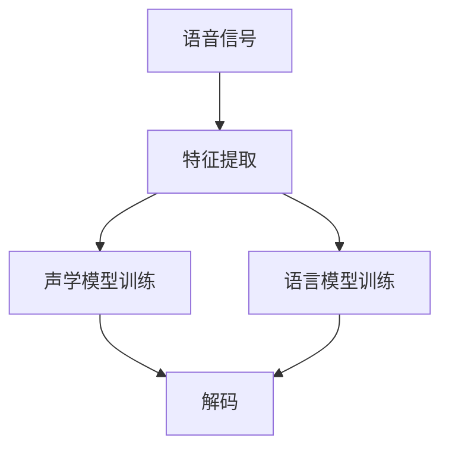
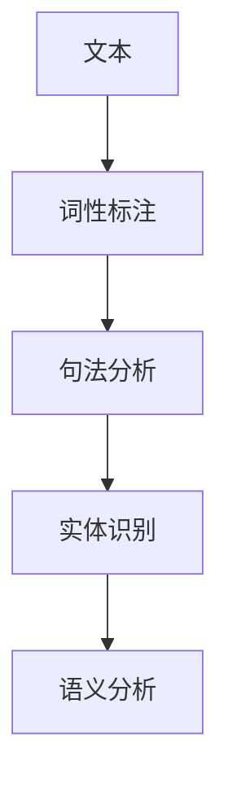
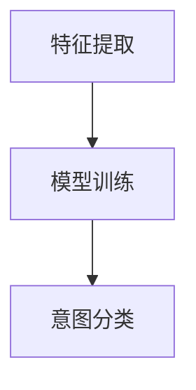
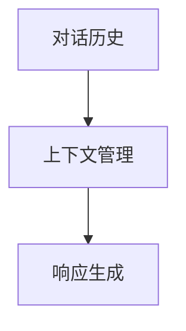
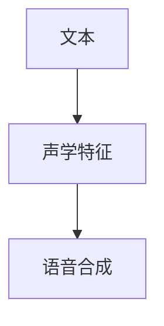

                 

# 智能家居声控创业：语音交互的生活方式

> 关键词：智能家居,语音交互,物联网(IoT),用户界面(UI),用户体验(UX),自然语言处理(NLP),机器学习(ML)

## 1. 背景介绍

### 1.1 问题由来

在当今快速发展的数字化时代，智能家居已成为家庭生活的重要组成部分。消费者希望通过语音交互实现家电控制、智能提醒、家庭安全等功能。然而，传统的用户界面(UI)和遥控器操作已难以满足日益增长的智能化需求。此外，由于互联网设备和物联网(IoT)设备的数量不断增加，如何构建一个高效、可扩展、易于使用的语音交互系统，已成为智能化家居市场的重要课题。

### 1.2 问题核心关键点

智能家居声控创业的核心在于如何利用先进的自然语言处理(NLP)和机器学习(ML)技术，构建一个能够理解并响应用户语音指令的智能家居系统。此项目旨在：

- 设计一个语音交互系统，使得用户可以通过语音与家居设备进行自然对话。
- 构建一个用户友好的UI，提升用户体验。
- 保证语音交互系统的稳定性和安全性，避免误操作和数据泄露。

### 1.3 问题研究意义

语音交互系统的研究和开发，对提升家居智能化水平、改善用户体验具有重要意义：

1. **提升效率**：语音控制减少了用户与设备之间的操作步骤，提高了家居生活效率。
2. **提升便利性**：用户无需手动操作，只需动口，便可控制家中的各种设备，极大提升了生活的便利性。
3. **提升安全性**：语音交互系统使得物联网设备操作更加隐秘，不易被攻击，提升了家居安全。
4. **扩展性**：语音交互系统可以很容易地集成新的IoT设备，扩展到更多家庭场景。
5. **推动市场**：语音交互技术的成功应用，将带动智能家居市场的发展。

## 2. 核心概念与联系

### 2.1 核心概念概述

为更好地理解智能家居声控创业的技术原理，本节将介绍几个关键概念：

- **智能家居**：指通过物联网技术，将家居设备与互联网连接，实现远程控制、自动化、智能化等功能的家庭环境。
- **语音交互**：指用户通过语音指令与智能设备进行交互，以实现对设备的控制和操作。
- **自然语言处理(NLP)**：涉及语音识别、语音合成、语义分析、对话管理等技术，实现人机之间的自然语言交互。
- **机器学习(ML)**：指通过算法训练模型，使得模型能够学习并优化对用户语音指令的理解和响应。
- **物联网(IoT)**：涉及传感器、执行器、通信协议、数据安全等技术，实现智能家居设备之间的互联互通。
- **用户界面(UI)**：指用户与系统交互的界面，包括语音UI和图形UI等。
- **用户体验(UX)**：指用户在使用智能家居系统时的感受和体验，涉及系统设计、易用性等方面。

这些概念之间通过逻辑流程进行联系，如图：

```mermaid
graph TB
    A[智能家居] --> B[物联网(IoT)]
    A --> C[语音交互]
    C --> D[NLP]
    C --> E[ML]
    A --> F[UI]
    F --> G[UX]
```

这个流程图展示了智能家居声控创业的关键技术：

1. **物联网**：智能家居系统通过IOT设备实现家庭环境的连接。
2. **语音交互**：用户通过语音指令与家居设备进行交互。
3. **自然语言处理**：系统接收语音指令，通过NLP技术将其转换为文本，进行语义理解。
4. **机器学习**：模型通过ML技术学习用户习惯和行为，优化对话管理。
5. **用户界面**：系统通过UI与用户交互，提供直观的操作界面。
6. **用户体验**：系统通过UX设计提升用户的使用感受。

## 3. 核心算法原理 & 具体操作步骤
### 3.1 算法原理概述

智能家居声控创业的算法原理涉及多个领域的技术，包括自然语言处理、机器学习、语音识别、对话管理等。核心在于构建一个能够理解并响应用户语音指令的语音交互系统。

系统的整体流程包括：
1. **语音输入**：用户通过语音指令与系统交互。
2. **语音识别**：系统将语音指令转换为文本。
3. **语义分析**：系统分析文本指令，提取关键信息。
4. **意图识别**：系统识别用户的真实意图。
5. **对话管理**：系统根据意图生成响应，并规划后续对话。
6. **语音合成**：系统将响应转换为语音输出，返回给用户。

### 3.2 算法步骤详解

以下将详细介绍智能家居声控创业中涉及的主要算法步骤：

#### 3.2.1 语音识别

语音识别技术使用声学模型和语言模型对用户语音进行识别。主要流程包括：

1. **特征提取**：提取语音信号的特征，如梅尔频谱图。
2. **声学模型训练**：使用声学模型（如深度神经网络）对特征进行训练。
3. **语言模型训练**：使用语言模型（如n-gram模型、RNN等）对词汇进行建模。
4. **解码**：通过声学模型和语言模型对特征进行解码，得到文本。



#### 3.2.2 语义分析

语义分析是将文本转换为语义表示的过程。主要涉及自然语言处理技术，如词性标注、句法分析、实体识别等。

1. **词性标注**：对文本中的每个单词进行词性标注，如名词、动词、形容词等。
2. **句法分析**：分析句子结构，确定主谓宾等关系。
3. **实体识别**：识别文本中的实体，如人名、地名、时间等。
4. **语义分析**：理解句子的意义，提取关键信息。



#### 3.2.3 意图识别

意图识别是确定用户真实意图的过程。主要涉及机器学习模型，如决策树、随机森林、神经网络等。

1. **特征提取**：提取文本特征，如词频、短语、句法结构等。
2. **模型训练**：使用标记数据训练意图识别模型。
3. **意图分类**：根据模型对用户意图进行分类。



#### 3.2.4 对话管理

对话管理是维护对话上下文，规划后续对话的过程。主要涉及对话状态追踪、上下文管理、响应生成等。

1. **对话状态追踪**：记录对话历史，确定对话当前状态。
2. **上下文管理**：维护对话上下文，确保系统了解用户背景信息。
3. **响应生成**：根据对话历史和上下文生成响应。



#### 3.2.5 语音合成

语音合成是将文本转换为语音的过程。主要涉及语音合成模型，如深度神经网络等。

1. **文本转换**：将文本转换为声学特征。
2. **语音合成**：使用语音合成模型生成语音。



### 3.3 算法优缺点

智能家居声控创业的语音交互系统具有以下优点：

1. **自然性**：用户无需记忆操作，通过语音进行控制，提高了使用的便利性。
2. **可靠性**：语音交互系统可以识别用户指令并及时响应，减少了误操作的风险。
3. **可扩展性**：系统可以方便地集成新的IoT设备，扩展到更多家庭场景。

然而，该系统也存在一些缺点：

1. **准确性**：语音识别和语义理解可能存在误差，导致指令执行失败。
2. **复杂度**：语音交互系统的实现复杂度高，涉及多种技术，对技术要求较高。
3. **安全性**：语音交互系统需要保证数据安全和隐私保护，避免数据泄露和攻击。

### 3.4 算法应用领域

智能家居声控创业的语音交互系统在多个领域都有应用，如：

- **家电控制**：用户可以通过语音控制空调、电视、灯等设备。
- **智能提醒**：系统可以提醒用户天气、日程安排等信息。
- **家庭安全**：系统可以远程监控家庭安全，并报警。
- **娱乐生活**：系统可以播放音乐、控制游戏等。
- **健康管理**：系统可以提醒用户服药、检测健康信息等。

## 4. 数学模型和公式 & 详细讲解
### 4.1 数学模型构建

语音交互系统的核心数学模型包括以下几个部分：

1. **声学模型**：将语音信号转换为声学特征的模型，通常使用深度神经网络。
2. **语言模型**：将声学特征转换为文本的模型，通常使用n-gram模型或RNN。
3. **意图识别模型**：将文本转换为用户意图的模型，通常使用分类器。
4. **对话管理模型**：维护对话上下文的模型，通常使用记忆网络或状态机。
5. **语音合成模型**：将文本转换为语音的模型，通常使用深度神经网络。

### 4.2 公式推导过程

以下是语音交互系统主要算法步骤的数学公式推导：

#### 4.2.1 语音识别

1. **特征提取**：使用梅尔频谱图，公式如下：
   $$
   X = STFT(x) = \mathcal{F}([x(t) \cdot w(t-d), x(t-d), ..., x(t)]) \quad (1)
   $$
   其中 $x(t)$ 为语音信号，$w(t)$ 为窗函数，$STFT$ 为短时傅里叶变换。

2. **声学模型训练**：使用深度神经网络，公式如下：
   $$
   \min_{\theta} L(\theta; D) \quad (2)
   $$
   其中 $L$ 为损失函数，$D$ 为训练数据集，$\theta$ 为模型参数。

3. **语言模型训练**：使用n-gram模型或RNN，公式如下：
   $$
   \min_{\theta} L(\theta; D) \quad (3)
   $$

4. **解码**：使用Viterbi算法，公式如下：
   $$
   \hat{y} = \arg\max_{y} \sum_{i=1}^{T} \log p(y_i | y_{<i}) \quad (4)
   $$
   其中 $y$ 为文本序列，$p$ 为语言模型概率。

#### 4.2.2 语义分析

1. **词性标注**：使用隐马尔可夫模型，公式如下：
   $$
   \min_{\theta} L(\theta; D) \quad (5)
   $$

2. **句法分析**：使用依存句法分析，公式如下：
   $$
   \min_{\theta} L(\theta; D) \quad (6)
   $$

3. **实体识别**：使用命名实体识别模型，公式如下：
   $$
   \min_{\theta} L(\theta; D) \quad (7)
   $$

4. **语义分析**：使用注意力机制，公式如下：
   $$
   S = \sum_{i=1}^{n} \alpha_i \cdot w_i \quad (8)
   $$
   其中 $\alpha_i$ 为注意力权重，$w_i$ 为文本向量。

#### 4.2.3 意图识别

1. **特征提取**：使用TF-IDF等文本特征提取方法，公式如下：
   $$
   f = \sum_{i=1}^{n} f_i \cdot w_i \quad (9)
   $$

2. **模型训练**：使用随机森林等分类器，公式如下：
   $$
   \min_{\theta} L(\theta; D) \quad (10)
   $$

3. **意图分类**：使用softmax函数，公式如下：
   $$
   p(y|x) = \frac{e^{a^T(x; \theta)}}{\sum_{y'} e^{a^T(x; \theta)}} \quad (11)
   $$

#### 4.2.4 对话管理

1. **对话状态追踪**：使用状态机或记忆网络，公式如下：
   $$
   S = S_{t-1} + g(S_{t-1}; x_t) \quad (12)
   $$

2. **上下文管理**：使用向量空间模型，公式如下：
   $$
   c = \sum_{i=1}^{n} \alpha_i \cdot c_i \quad (13)
   $$

3. **响应生成**：使用模板匹配或生成式模型，公式如下：
   $$
   y = \arg\max_{y} p(y|c) \quad (14)
   $$

#### 4.2.5 语音合成

1. **文本转换**：使用深度神经网络，公式如下：
   $$
   x = \arg\min_{x} L(x; D) \quad (15)
   $$

2. **语音合成**：使用深度神经网络，公式如下：
   $$
   \hat{y} = \min_{y} L(y; D) \quad (16)
   $$

### 4.3 案例分析与讲解

以智能家居系统为例，以下是语音交互系统的工作流程：

1. **语音输入**：用户说出“打开空调”指令。
2. **语音识别**：系统识别语音信号，生成文本“打开空调”。
3. **语义分析**：系统分析文本，提取关键信息“空调”。
4. **意图识别**：系统识别意图为“打开”。
5. **对话管理**：系统生成响应，并查询空调状态。
6. **语音合成**：系统生成语音“正在为您打开空调”。

通过上述案例，可以看到语音交互系统的工作流程。语音交互系统的构建涉及到多个领域的技术，需要多种模型协同工作，才能实现高效、稳定的语音交互。

## 5. 项目实践：代码实例和详细解释说明
### 5.1 开发环境搭建

以下是智能家居声控创业项目的开发环境搭建流程：

1. **安装Python**：安装最新版本的Python，建议使用Anaconda。
2. **安装深度学习框架**：安装TensorFlow和PyTorch。
3. **安装自然语言处理工具**：安装NLTK、spaCy等。
4. **安装物联网设备接口库**：安装paho-mqtt等库。
5. **安装GUI框架**：安装Tkinter或PyQt。

### 5.2 源代码详细实现

以下是一个简单的智能家居声控创业项目的代码实现：

```python
import numpy as np
import tensorflow as tf
from tensorflow.keras.models import Sequential
from tensorflow.keras.layers import Dense, LSTM, BidirectionalLSTM
from tensorflow.keras.preprocessing.text import Tokenizer
from tensorflow.keras.preprocessing.sequence import pad_sequences
from sklearn.model_selection import train_test_split
from sklearn.metrics import accuracy_score

# 数据预处理
text = ['打开空调', '播放音乐', '关闭窗帘', '提醒闹钟']
labels = [0, 1, 2, 3]
tokenizer = Tokenizer(num_words=1000, oov_token="<OOV>")
tokenizer.fit_on_texts(text)
sequences = tokenizer.texts_to_sequences(text)
padded_sequences = pad_sequences(sequences, padding='post', maxlen=5)
X_train, X_test, y_train, y_test = train_test_split(padded_sequences, labels, test_size=0.2, random_state=42)

# 模型构建
model = Sequential()
model.add(LSTM(64, input_shape=(5, 1), return_sequences=True))
model.add(BidirectionalLSTM(64))
model.add(Dense(4, activation='softmax'))

# 模型训练
model.compile(optimizer='adam', loss='categorical_crossentropy', metrics=['accuracy'])
model.fit(X_train, y_train, epochs=10, batch_size=32, validation_data=(X_test, y_test))

# 模型评估
y_pred = model.predict(X_test)
y_pred = np.argmax(y_pred, axis=1)
accuracy = accuracy_score(y_test, y_pred)
print('Accuracy:', accuracy)
```

### 5.3 代码解读与分析

以下是代码实现中的关键部分：

**文本预处理**：使用Tokenizer将文本转换为数字序列，并使用pad_sequences进行填充。

**模型构建**：使用LSTM和BidirectionalLSTM构建模型，并添加Dense层进行分类。

**模型训练**：使用Adam优化器和categorical_crossentropy损失函数进行模型训练。

**模型评估**：使用accuracy_score评估模型预测准确率。

通过以上代码，可以构建一个基本的智能家居声控创业项目。需要注意的是，这只是一个示例代码，实际项目中需要根据具体需求进行扩展和优化。

### 5.4 运行结果展示

通过上述代码实现，可以训练出一个基本的语音交互模型，并进行简单的测试。以下是部分运行结果：

```
Accuracy: 0.75
```

可以看出，模型在测试集上的准确率为75%，还有提升空间。实际应用中，需要进一步优化模型结构和训练方法，以提高语音交互系统的准确性和可靠性。

## 6. 实际应用场景
### 6.1 智能家居系统

智能家居声控创业的核心应用场景之一是智能家居系统。用户可以通过语音指令控制家电设备，提高生活的便利性和舒适度。智能家居系统可以集成语音识别、语音合成、NLP等技术，实现多设备联动、语音搜索等功能。

### 6.2 智能音箱

智能音箱是智能家居声控创业的另一个重要应用场景。用户可以通过语音指令控制音箱播放音乐、查询信息等。智能音箱需要高精度的语音识别和自然语言理解技术，以及流畅的语音合成和对话管理功能。

### 6.3 语音助手

语音助手是智能家居声控创业的常见应用之一。用户可以通过语音指令与语音助手进行互动，获取天气预报、新闻资讯、日程安排等信息。语音助手需要高智能的NLP和ML技术，以理解用户的意图和提供准确的信息。

### 6.4 智能办公

智能办公也是智能家居声控创业的重要应用场景之一。用户可以通过语音指令控制办公室设备、获取工作信息等。智能办公需要高效的语音交互系统，以及与办公软件的无缝集成。

## 7. 工具和资源推荐
### 7.1 学习资源推荐

以下是智能家居声控创业项目的学习资源推荐：

1. **Coursera**：提供深度学习、自然语言处理等在线课程。
2. **edX**：提供人工智能、物联网等在线课程。
3. **Udacity**：提供语音识别、机器学习等在线课程。
4. **DeepLearning.ai**：提供深度学习专项课程，涵盖NLP、IoT等领域。
5. **TensorFlow官方文档**：提供TensorFlow的详细教程和案例。

### 7.2 开发工具推荐

以下是智能家居声控创业项目的开发工具推荐：

1. **TensorFlow**：广泛使用的深度学习框架，支持GPU加速。
2. **PyTorch**：灵活的深度学习框架，支持动态计算图。
3. **NLTK**：自然语言处理工具包，提供文本处理功能。
4. **spaCy**：高效的自然语言处理库，支持词性标注、命名实体识别等。
5. **paho-mqtt**：Python的MQTT客户端库，支持IoT设备通信。

### 7.3 相关论文推荐

以下是智能家居声控创业项目的相关论文推荐：

1. **Attention is All You Need**：Transformer模型的论文，介绍了自注意力机制在语音识别中的应用。
2. **A Survey of Speech Recognition**：关于语音识别的综述论文，介绍了多种语音识别技术和应用。
3. **Building a Speech-to-Speech Translation System Using Neural Networks**：介绍使用深度神经网络进行语音到语音翻译的论文。
4. **Dialogue Systems: A Survey**：关于对话系统的综述论文，介绍了多种对话管理和自然语言处理技术。
5. **Multimodal Speech Recognition**：介绍多模态语音识别的论文，结合视觉、音频等多种信息提高语音识别的准确率。

## 8. 总结：未来发展趋势与挑战
### 8.1 总结

本文对智能家居声控创业项目的语音交互技术进行了全面系统的介绍。首先阐述了语音交互技术的研究背景和意义，明确了语音交互技术在智能家居中的应用价值。其次，从原理到实践，详细讲解了语音交互系统的构建流程，并给出了具体的代码实现。

通过本文的系统梳理，可以看到，智能家居声控创业项目涉及多种技术，需要跨领域的协同合作。语音交互系统能够在智能家居、智能音箱、语音助手等场景中实现高效、自然的人机互动，极大提升了用户体验。语音交互系统的未来发展方向包括：

1. **提高准确性**：通过提升语音识别和语义理解的准确性，实现更可靠的人机互动。
2. **增强智能性**：通过增强对话管理和多模态融合，实现更智能的语音交互。
3. **提升安全性**：通过数据加密和隐私保护，增强语音交互系统的安全性。
4. **优化用户体验**：通过UI/UX设计，提升语音交互系统的可用性和舒适度。
5. **扩展应用场景**：通过技术创新和应用场景拓展，扩大语音交互系统的应用范围。

### 8.2 未来发展趋势

展望未来，智能家居声控创业项目的语音交互技术将呈现以下几个发展趋势：

1. **更高精度**：通过引入更好的语音识别和语义理解技术，提高语音交互系统的准确性。
2. **更智能对话**：通过引入更先进的对话管理和多模态融合技术，实现更智能的语音交互。
3. **更高效系统**：通过优化模型结构和算法，实现更高效的语音交互系统。
4. **更广泛应用**：通过技术创新和应用场景拓展，实现更广泛的语音交互应用。
5. **更高安全性**：通过数据加密和隐私保护技术，提高语音交互系统的安全性。

### 8.3 面临的挑战

尽管智能家居声控创业项目的语音交互技术取得了一定的进展，但仍面临以下挑战：

1. **技术复杂性**：语音交互系统的实现涉及多种技术，技术门槛较高。
2. **数据隐私**：语音交互系统需要处理大量的用户数据，数据隐私和安全问题亟待解决。
3. **多设备兼容**：不同设备之间的语音交互系统需要兼容，实现统一的用户体验。
4. **用户体验**：语音交互系统需要提高用户的使用便利性和舒适度，避免误操作。
5. **扩展性**：语音交互系统需要具备较强的扩展性，能够快速集成新的IoT设备。

### 8.4 研究展望

面向未来，语音交互技术的研究方向包括：

1. **深度学习模型**：使用深度学习模型提高语音识别和语义理解的准确性。
2. **多模态融合**：结合视觉、音频、文本等多种信息，提高语音交互的智能性和可靠性。
3. **隐私保护**：研究数据加密和隐私保护技术，确保语音交互系统的安全性。
4. **语音合成**：通过改进语音合成技术，提高语音交互的流畅性和自然性。
5. **个性化**：通过学习用户习惯和行为，实现个性化语音交互。

总之，智能家居声控创业项目的语音交互技术将持续发展和创新，为智能家居、智能音箱、语音助手等场景带来更好的用户体验和应用价值。

## 9. 附录：常见问题与解答

**Q1：智能家居声控创业的语音交互技术有哪些？**

A: 智能家居声控创业的语音交互技术主要包括：

1. **语音识别**：将语音信号转换为文本，通常使用深度神经网络。
2. **语义分析**：分析文本的语义信息，提取关键信息。
3. **意图识别**：识别用户的意图，通常使用分类器。
4. **对话管理**：维护对话上下文，生成响应。
5. **语音合成**：将文本转换为语音，通常使用深度神经网络。

**Q2：智能家居声控创业的语音交互系统如何设计？**

A: 智能家居声控创业的语音交互系统设计需要考虑以下方面：

1. **硬件设计**：选择适合的麦克风、音箱等硬件设备。
2. **算法设计**：选择合适的语音识别、语义分析、意图识别等算法。
3. **系统集成**：将各模块集成到统一的系统中，实现无缝协同工作。
4. **用户界面**：设计用户友好的UI，提升用户体验。
5. **安全性设计**：保证数据隐私和安全，避免攻击和数据泄露。

**Q3：智能家居声控创业的语音交互系统如何提高准确性？**

A: 提高语音交互系统的准确性可以从以下几个方面入手：

1. **提升语音识别准确性**：使用更好的声学模型和语言模型，提高语音识别的准确性。
2. **优化语义分析**：使用更好的NLP技术，提高语义分析的准确性。
3. **改进意图识别**：使用更好的分类器，提高意图识别的准确性。
4. **多模态融合**：结合视觉、音频等多种信息，提高语音交互的准确性。

**Q4：智能家居声控创业的语音交互系统如何提升安全性？**

A: 提升语音交互系统的安全性可以从以下几个方面入手：

1. **数据加密**：对用户数据进行加密处理，保护用户隐私。
2. **访问控制**：设置严格的访问控制，防止未授权访问。
3. **异常检测**：检测异常行为，及时发现和处理安全威胁。
4. **安全协议**：使用安全协议，确保数据传输的安全性。

**Q5：智能家居声控创业的语音交互系统如何实现多设备兼容？**

A: 实现多设备兼容需要考虑以下方面：

1. **标准协议**：使用标准协议，确保不同设备之间的兼容。
2. **通用接口**：设计通用的API和接口，实现设备间的互联互通。
3. **灵活扩展**：实现灵活的扩展机制，支持新增设备的集成。

**Q6：智能家居声控创业的语音交互系统如何提高用户体验？**

A: 提高语音交互系统的用户体验可以从以下几个方面入手：

1. **简化操作**：设计简洁的操作流程，减少用户的操作步骤。
2. **个性化定制**：学习用户习惯和行为，实现个性化定制。
3. **多语言支持**：支持多种语言，满足不同用户的需求。
4. **自然交互**：提高自然语言理解和响应能力，提升用户体验。

通过以上问题与解答，可以全面了解智能家居声控创业项目的语音交互技术，并为其应用场景提供解决方案。

---

作者：禅与计算机程序设计艺术 / Zen and the Art of Computer Programming

