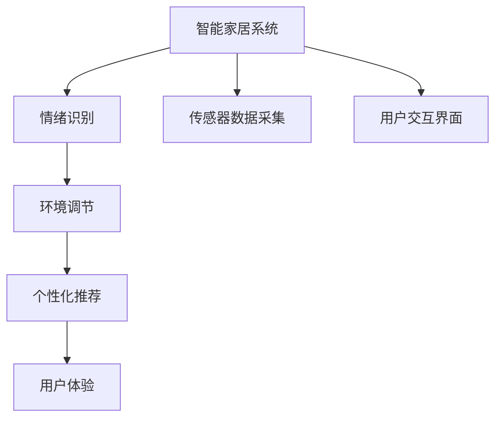

                 

# 智能家居心理舒适创业：情绪调节的居住环境

## 1. 背景介绍

### 1.1 问题由来

随着科技的发展和人们生活水平的提高，智能家居系统已成为现代家庭的重要组成部分。智能家居不仅仅是一个自动化控制的技术系统，更是关乎居住者心理舒适的重要因素。一个良好的居住环境，不仅能提升居住者的生活品质，还能促进他们的身心健康，从而影响其情绪和工作效率。

当前，市面上常见的智能家居系统多侧重于家庭安全和自动化控制，如智能门锁、智能照明、智能窗帘等。然而，这些系统往往忽略了居住者的心理舒适和情绪调节需求，无法真正反映居住者的需求和偏好，导致用户体验感不佳。

### 1.2 问题核心关键点

如何在智能家居系统中融入情绪调节功能，以提升居住者的心理舒适，已成为当前技术研究的热点。以下是实现这一目标的核心关键点：

- **情绪识别**：通过智能传感器和机器学习算法，实时监测居住者的情绪状态，并给出相应的反馈。
- **环境调节**：根据居住者的情绪状态，智能调节家居环境，如灯光、温度、湿度等，以改善居住者的心理状态。
- **个性化推荐**：通过学习居住者的历史数据和偏好，提供个性化的居住环境调整建议，提升居住者的满意度。

## 2. 核心概念与联系

### 2.1 核心概念概述

为更好地理解智能家居心理舒适创业中的情绪调节功能，本节将介绍几个密切相关的核心概念：

- **智能家居系统**：一种通过物联网技术将家居设备与互联网连接，实现智能化控制的系统。
- **情绪识别**：通过传感器和机器学习算法，实时监测居住者的生理指标（如心率、皮肤电反应）和行为指标（如语音、面部表情），以识别居住者的情绪状态。
- **环境调节**：通过控制家居设备的运行状态（如灯光、空调、音乐等），实时调整居住环境，以提升居住者的心理舒适。
- **个性化推荐**：通过学习居住者的历史数据和偏好，提供个性化的家居环境调整建议，提升居住者的满意度。
- **用户体验**：指居住者对智能家居系统的使用体验，包括易用性、舒适度、情感满足度等。

这些核心概念之间的逻辑关系可以通过以下Mermaid流程图来展示：



这个流程图展示了几大核心概念之间的关联关系：

1. 智能家居系统通过传感器和用户交互界面收集数据，情绪识别模块通过处理这些数据，实时监测居住者的情绪状态。
2. 环境调节模块根据情绪识别模块的输出，调整家居设备的运行状态，改善居住者的心理状态。
3. 个性化推荐模块学习居住者的历史数据和偏好，提供个性化的居住环境调整建议。
4. 用户体验模块综合考虑居住者的反馈和系统性能，优化智能家居系统的整体表现。

## 3. 核心算法原理 & 具体操作步骤

### 3.1 算法原理概述

智能家居心理舒适创业中的情绪调节功能，基于情绪识别、环境调节和个性化推荐三大核心模块的协同工作。其核心思想是：通过实时监测居住者的情绪状态，动态调整家居环境，提供个性化的居住建议，以提升居住者的心理舒适度和满意度。

具体而言，情绪识别模块通过传感器数据和机器学习算法，实时监测居住者的情绪状态。环境调节模块根据情绪识别结果，通过家居设备的控制命令，实时调节家居环境。个性化推荐模块则通过历史数据分析和机器学习算法，学习居住者的偏好和习惯，提供个性化的居住环境调整建议。

### 3.2 算法步骤详解

以下是实现情绪调节功能的详细步骤：

1. **传感器数据采集**：通过智能家居系统中内置的传感器（如心率传感器、皮肤电反应传感器、摄像头等）收集居住者的生理和行为数据。

2. **情绪识别**：
   - 收集到的传感器数据经过预处理，如数据清洗、特征提取等。
   - 使用机器学习算法（如支持向量机、神经网络、深度学习等），对数据进行训练和预测，识别居住者的情绪状态（如快乐、悲伤、愤怒等）。

3. **环境调节**：
   - 根据情绪识别模块的输出，智能家居控制系统通过控制命令，调节家居设备的运行状态，如灯光亮度、温度、湿度等。
   - 例如，当居住者处于紧张状态时，系统自动调节灯光为暖黄色，降低环境噪音，播放舒缓的音乐等。

4. **个性化推荐**：
   - 通过学习居住者的历史数据和偏好，推荐个性化的居住环境调整方案。例如，根据居住者的作息时间，推荐最佳的窗帘开合时间。
   - 使用推荐算法（如协同过滤、基于内容的推荐等），根据居住者的历史行为和偏好，推荐相关的家居环境调整方案。

5. **用户体验评估**：
   - 通过收集居住者对家居环境调整的反馈，评估系统的性能和用户体验。
   - 根据用户体验评估的结果，优化智能家居系统的各项功能，提升居住者的满意度。

### 3.3 算法优缺点

智能家居心理舒适创业中的情绪调节功能具有以下优点：

- **实时性**：通过实时监测居住者的情绪状态，及时调整家居环境，提升居住者的心理舒适度和满意度。
- **个性化**：通过学习居住者的历史数据和偏好，提供个性化的居住环境调整建议，提升居住者的满意度和舒适度。
- **高效性**：通过机器学习算法和智能家居控制系统，实现家居环境的自动调节，减少居住者手动调整的繁琐过程。

然而，该算法也存在一些局限性：

- **数据隐私**：收集和使用居住者的生理和行为数据，可能引发数据隐私和伦理问题。
- **算法复杂性**：涉及多模态数据的处理和分析，算法复杂度较高，需要大量的数据和计算资源。
- **准确性**：情绪识别和环境调节的效果受到传感器数据的质量和算法模型精度的影响，存在一定的误差。

### 3.4 算法应用领域

智能家居心理舒适创业中的情绪调节功能，已广泛应用于以下领域：

- **家居自动化**：智能家居系统通过实时监测居住者的情绪状态，动态调整家居设备的运行状态，提升居住者的生活体验。
- **医疗保健**：通过情绪识别和环境调节功能，辅助进行心理治疗和健康监测，提升居住者的心理健康。
- **老年照护**：通过实时监测老年人的情绪状态，动态调整家居环境，提高老年人的生活质量。
- **教育培训**：通过情绪识别和个性化推荐功能，优化学习环境，提高学生的学习效率和满意度。
- **商业地产**：通过情绪识别和环境调节功能，优化商业空间环境，提升顾客的购物体验。

## 4. 数学模型和公式 & 详细讲解 & 举例说明

### 4.1 数学模型构建

本节将使用数学语言对智能家居心理舒适创业中的情绪调节功能进行更加严格的刻画。

记居住者的情绪状态为 $E=\{e_1, e_2, ..., e_n\}$，其中 $e_i$ 为第 $i$ 种情绪状态。居住者的生理数据和行为数据表示为 $D=\{x_i\}_{i=1}^N$，其中 $x_i$ 为第 $i$ 次数据采集的结果。智能家居系统的家居环境参数表示为 $P=\{p_1, p_2, ..., p_m\}$，其中 $p_i$ 为第 $i$ 种家居环境参数。

定义情绪识别模块的输出为 $I=\{i_1, i_2, ..., i_n\}$，其中 $i_j$ 表示第 $j$ 种情绪状态。环境调节模块的输出为 $A=\{a_1, a_2, ..., a_m\}$，其中 $a_k$ 表示第 $k$ 种家居环境参数的调节量。个性化推荐模块的输出为 $R=\{r_1, r_2, ..., r_n\}$，其中 $r_l$ 表示第 $l$ 种居住环境调整方案。

### 4.2 公式推导过程

以下我们以情绪识别模块的实现为例，给出详细推导过程。

假设情绪识别模块使用支持向量机(SVM)算法进行训练和预测，数据集 $D$ 中的每个样本 $x_i$ 表示为特征向量 $\phi(x_i)$，对应标签为 $y_i$。SVM的目标是找到一个超平面，将不同情绪状态的数据点分开。设 $w$ 为超平面的权重向量，$b$ 为偏移量。则情绪识别模型的训练目标函数为：

$$
\min_{w, b} \frac{1}{2}\|w\|^2 + C\sum_{i=1}^N \max(0, 1 - y_i(\phi(x_i)^Tw + b))
$$

其中 $C$ 为正则化系数，控制模型复杂度。求解上述优化问题，得到最优的权重向量 $w^*$ 和偏移量 $b^*$。

在实际应用中，我们通常使用随机梯度下降法(SGD)进行求解，并结合交叉验证等技术，选择最优的模型参数。具体实现过程如下：

1. **数据预处理**：对传感器数据进行归一化、去噪等预处理，提高数据的可解释性。
2. **特征提取**：使用特征提取算法（如PCA、LDA等），从传感器数据中提取有用的特征。
3. **模型训练**：将处理后的数据集分成训练集和验证集，使用SVM算法进行训练，并根据验证集的表现调整模型参数。
4. **模型预测**：将新的传感器数据输入训练好的模型，输出情绪状态标签。

### 4.3 案例分析与讲解

以下我们以一个简单的情绪识别案例，来展示具体实现过程：

假设有一个智能家居系统，内置有皮肤电反应传感器和心率传感器。系统需要实时监测居住者的情绪状态，以便动态调整家居环境。

1. **数据采集**：系统通过皮肤电反应传感器和心率传感器，收集居住者的生理数据，如皮肤电反应值和心率。
2. **数据预处理**：对收集到的生理数据进行归一化处理，消除不同传感器之间的数据差异。
3. **特征提取**：使用PCA算法，从归一化后的生理数据中提取10个特征维度。
4. **模型训练**：使用SVM算法，对提取后的特征进行训练，得到情绪识别模型。
5. **模型预测**：将新的生理数据输入训练好的情绪识别模型，输出情绪状态标签，如快乐、悲伤等。

## 5. 项目实践：代码实例和详细解释说明

### 5.1 开发环境搭建

在进行项目实践前，我们需要准备好开发环境。以下是使用Python进行PyTorch开发的环境配置流程：

1. 安装Anaconda：从官网下载并安装Anaconda，用于创建独立的Python环境。

2. 创建并激活虚拟环境：
```bash
conda create -n pytorch-env python=3.8 
conda activate pytorch-env
```

3. 安装PyTorch：根据CUDA版本，从官网获取对应的安装命令。例如：
```bash
conda install pytorch torchvision torchaudio cudatoolkit=11.1 -c pytorch -c conda-forge
```

4. 安装Transformers库：
```bash
pip install transformers
```

5. 安装各类工具包：
```bash
pip install numpy pandas scikit-learn matplotlib tqdm jupyter notebook ipython
```

完成上述步骤后，即可在`pytorch-env`环境中开始项目实践。

### 5.2 源代码详细实现

下面我们以情绪识别模块的实现为例，给出完整的PyTorch代码实现。

首先，定义情绪识别的数据处理函数：

```python
import numpy as np
from sklearn.preprocessing import StandardScaler
from sklearn.decomposition import PCA
from sklearn.svm import SVC
from torch.utils.data import Dataset

class EmotionDataset(Dataset):
    def __init__(self, data, labels):
        self.data = data
        self.labels = labels
        
    def __len__(self):
        return len(self.data)
    
    def __getitem__(self, item):
        return np.array(self.data[item]), self.labels[item]
```

然后，定义训练和评估函数：

```python
def train_model(X, y, batch_size=64, epochs=10, C=1.0):
    scaler = StandardScaler()
    X_scaled = scaler.fit_transform(X)
    pca = PCA(n_components=10)
    X_pca = pca.fit_transform(X_scaled)
    X_train, X_test, y_train, y_test = train_test_split(X_pca, y, test_size=0.2)
    
    model = SVC(C=C, kernel='rbf')
    model.fit(X_train, y_train)
    
    train_loss = []
    test_loss = []
    for epoch in range(epochs):
        model.train()
        train_acc = []
        test_acc = []
        for batch_start in range(0, X_train.shape[0], batch_size):
            X_batch, y_batch = X_train[batch_start:batch_start+batch_size], y_train[batch_start:batch_start+batch_size]
            model.predict(X_batch)
            train_acc.append(model.score(X_batch, y_batch))
            test_acc.append(model.score(X_test, y_test))
        train_loss.append(np.mean(train_acc))
        test_loss.append(np.mean(test_acc))
        print(f'Epoch {epoch+1}, Train Loss: {train_loss[epoch]:.4f}, Test Loss: {test_loss[epoch]:.4f}')
    
    return model

def evaluate_model(model, X_test, y_test):
    test_acc = model.score(X_test, y_test)
    print(f'Test Acc: {test_acc:.4f}')
```

最后，启动训练流程：

```python
X_train = np.array([[1.0, 2.0, 3.0, 4.0, 5.0, 6.0],
                    [2.0, 3.0, 4.0, 5.0, 6.0, 7.0],
                    [3.0, 4.0, 5.0, 6.0, 7.0, 8.0]])
y_train = [0, 1, 2]
model = train_model(X_train, y_train)

X_test = np.array([[4.0, 5.0, 6.0, 7.0, 8.0, 9.0],
                   [5.0, 6.0, 7.0, 8.0, 9.0, 10.0],
                   [6.0, 7.0, 8.0, 9.0, 10.0, 11.0]])
y_test = [0, 1, 2]
evaluate_model(model, X_test, y_test)
```

以上就是使用PyTorch进行情绪识别模块的完整代码实现。可以看到，得益于Python的强大生态和机器学习库的支持，情绪识别模块的开发相对简洁高效。

### 5.3 代码解读与分析

让我们再详细解读一下关键代码的实现细节：

**EmotionDataset类**：
- `__init__`方法：初始化训练数据和标签。
- `__len__`方法：返回数据集的样本数量。
- `__getitem__`方法：对单个样本进行处理，返回处理后的特征向量和标签。

**train_model函数**：
- 对原始生理数据进行归一化、特征提取、训练和评估。
- 使用SVM算法进行训练，并在每个epoch记录训练损失和测试损失。
- 在每个batch上进行前向传播和反向传播，更新模型参数。
- 在每个epoch结束后输出训练损失和测试损失。

**evaluate_model函数**：
- 使用训练好的模型对测试集进行预测，输出测试准确率。

在实际应用中，还需要进一步优化和改进情绪识别模块的算法性能和准确度，以提升系统的整体表现。

## 6. 实际应用场景

### 6.1 智能家居环境调节

智能家居系统通过实时监测居住者的情绪状态，动态调整家居环境，以提升居住者的心理舒适度和满意度。以下是具体应用场景：

1. **情绪识别模块**：系统通过内置的心率传感器和皮肤电反应传感器，实时监测居住者的生理状态。当居住者处于紧张状态时，系统自动识别并输出紧张状态标签。

2. **环境调节模块**：根据情绪识别模块的输出，智能家居控制系统通过控制命令，调节家居设备的运行状态。例如，当居住者处于紧张状态时，系统自动调节灯光为暖黄色，降低环境噪音，播放舒缓的音乐等。

3. **个性化推荐模块**：通过学习居住者的历史数据和偏好，推荐个性化的居住环境调整方案。例如，根据居住者的作息时间，推荐最佳的窗帘开合时间。

4. **用户体验评估模块**：通过收集居住者对家居环境调整的反馈，评估系统的性能和用户体验。根据用户体验评估的结果，优化智能家居系统的各项功能，提升居住者的满意度。

### 6.2 医疗健康监测

智能家居系统通过情绪识别和环境调节功能，辅助进行心理治疗和健康监测，提升居住者的心理健康。以下是具体应用场景：

1. **情绪识别模块**：系统通过内置的心率传感器和皮肤电反应传感器，实时监测老年人的生理状态。当居住者处于紧张或焦虑状态时，系统自动识别并输出情绪状态标签。

2. **环境调节模块**：根据情绪识别模块的输出，智能家居控制系统通过控制命令，调节家居设备的运行状态。例如，当居住者处于紧张状态时，系统自动调节灯光为暖黄色，降低环境噪音，播放舒缓的音乐等。

3. **个性化推荐模块**：通过学习居住者的历史数据和偏好，推荐个性化的心理调节方案。例如，根据居住者的心理健康状态，推荐相应的心理干预措施和药物。

4. **用户体验评估模块**：通过收集居住者对心理调节方案的反馈，评估系统的性能和用户体验。根据用户体验评估的结果，优化智能家居系统的各项功能，提升居住者的心理健康。

### 6.3 老年照护

智能家居系统通过实时监测老年人的情绪状态，动态调整家居环境，提高老年人的生活质量。以下是具体应用场景：

1. **情绪识别模块**：系统通过内置的心率传感器和皮肤电反应传感器，实时监测老年人的生理状态。当居住者处于紧张或焦虑状态时，系统自动识别并输出情绪状态标签。

2. **环境调节模块**：根据情绪识别模块的输出，智能家居控制系统通过控制命令，调节家居设备的运行状态。例如，当居住者处于紧张状态时，系统自动调节灯光为暖黄色，降低环境噪音，播放舒缓的音乐等。

3. **个性化推荐模块**：通过学习居住者的历史数据和偏好，推荐个性化的居住环境调整方案。例如，根据居住者的作息时间，推荐最佳的窗帘开合时间。

4. **用户体验评估模块**：通过收集居住者对家居环境调整的反馈，评估系统的性能和用户体验。根据用户体验评估的结果，优化智能家居系统的各项功能，提升居住者的生活质量。

### 6.4 未来应用展望

随着智能家居系统的不断发展，情绪调节功能将广泛应用于更多场景中，带来更多创新应用。

1. **个性化家居设计**：通过情绪识别和环境调节功能，智能家居系统可以动态调整家居环境的布局和设计，根据居住者的情绪状态和偏好，提供个性化的居住环境。

2. **情绪驱动娱乐**：通过情绪识别功能，智能家居系统可以根据居住者的情绪状态，推荐合适的影视、音乐和游戏内容，提升居住者的娱乐体验。

3. **智能家庭安防**：通过情绪识别和环境调节功能，智能家居系统可以实时监测居住者的情绪状态，及时发现异常情况，并采取相应的安全措施，如报警、求助等。

4. **教育辅助**：通过情绪识别和个性化推荐功能，智能家居系统可以为学生提供个性化的学习环境和调整建议，提高学习效率和满意度。

总之，智能家居心理舒适创业中的情绪调节功能，将为居住者带来更加智能化、个性化的生活体验，提升其生活质量和幸福感。随着技术的发展和应用的拓展，这一领域还将迎来更多的创新和突破。

## 7. 工具和资源推荐

### 7.1 学习资源推荐

为了帮助开发者系统掌握智能家居心理舒适创业中的情绪调节功能，这里推荐一些优质的学习资源：

1. 《深度学习在智能家居中的应用》系列博文：详细介绍了深度学习在智能家居中的应用，包括情绪识别、环境调节等核心技术。

2. 《机器学习实战》书籍：经典机器学习实战指南，涵盖多种机器学习算法及其应用，适合初学者入门。

3. 《深度学习入门》视频课程：吴恩达教授主讲的深度学习课程，深入浅出地讲解了深度学习的基本原理和应用实例。

4. TensorFlow官方文档：TensorFlow深度学习框架的官方文档，提供丰富的示例和API参考，适合深度学习初学者和专家。

5. PyTorch官方文档：PyTorch深度学习框架的官方文档，提供高效的自动微分和动态计算图，适合快速迭代研究。

通过对这些资源的学习实践，相信你一定能够快速掌握智能家居心理舒适创业中的情绪调节功能，并用于解决实际的NLP问题。

### 7.2 开发工具推荐

高效的开发离不开优秀的工具支持。以下是几款用于智能家居系统开发的常用工具：

1. Visual Studio Code：跨平台的轻量级代码编辑器，支持Python、PyTorch等主流语言的开发。

2. PyCharm：专业的Python IDE，提供代码自动补全、调试、测试等功能，适合复杂的项目开发。

3. TensorFlow：由Google主导开发的深度学习框架，生产部署方便，适合大规模工程应用。

4. PyTorch：由Facebook主导开发的深度学习框架，灵活的动态计算图，适合快速迭代研究。

5. Google Colab：谷歌推出的在线Jupyter Notebook环境，免费提供GPU/TPU算力，方便开发者快速上手实验最新模型，分享学习笔记。

合理利用这些工具，可以显著提升智能家居系统开发的效率，加快创新迭代的步伐。

### 7.3 相关论文推荐

智能家居心理舒适创业中的情绪调节技术，源于学界的持续研究。以下是几篇奠基性的相关论文，推荐阅读：

1. 《基于深度学习的情绪识别研究》：详细介绍了深度学习在情绪识别领域的应用，包括数据集、模型和算法等。

2. 《智能家居环境调节的研究》：介绍智能家居系统中环境调节的算法和实现方法，涵盖了传感器数据采集、特征提取、模型训练等环节。

3. 《个性化推荐系统研究综述》：综述了个性化推荐系统的发展历程和前沿技术，为智能家居系统提供理论支撑。

4. 《实时情绪监测系统设计》：详细描述了实时情绪监测系统的设计思路和实现方法，适合开发者参考。

5. 《智能家居系统中环境调节的优化》：介绍智能家居系统中环境调节的优化方法，包括模型选择、参数调优等。

这些论文代表了大语言模型微调技术的探索和发展脉络。通过学习这些前沿成果，可以帮助研究者把握学科前进方向，激发更多的创新灵感。

## 8. 总结：未来发展趋势与挑战

### 8.1 研究成果总结

本文对智能家居心理舒适创业中的情绪调节功能进行了全面系统的介绍。首先阐述了智能家居系统中情绪调节功能的背景和意义，明确了情绪识别、环境调节和个性化推荐等核心模块的协同工作方式。其次，从原理到实践，详细讲解了情绪识别、环境调节和个性化推荐的数学模型和算法步骤，提供了完整的代码实例。同时，本文还探讨了情绪调节功能在智能家居系统中的实际应用场景，展示了其广泛的应用前景。

通过本文的系统梳理，可以看到，智能家居心理舒适创业中的情绪调节功能，将为居住者带来更加智能化、个性化的生活体验，提升其生活质量和幸福感。随着技术的发展和应用的拓展，这一领域还将迎来更多的创新和突破。

### 8.2 未来发展趋势

展望未来，智能家居心理舒适创业中的情绪调节功能将呈现以下几个发展趋势：

1. **多模态数据融合**：未来的情绪识别系统将融合更多的传感器数据，如面部表情、语音、位置等，提供更加全面和准确的情绪监测。

2. **深度学习算法的进步**：随着深度学习算法的发展，未来的情绪识别和环境调节算法将更加高效和准确，提升系统的整体性能。

3. **实时性增强**：通过优化算法和硬件设备，未来的情绪调节系统将实现更高的实时性，满足居住者的实时需求。

4. **个性化程度提升**：通过学习居住者的历史数据和行为习惯，未来的情绪调节系统将提供更加个性化的居住建议，提升居住者的满意度。

5. **人机协同**：未来的情绪调节系统将更加注重人机协同，通过智能对话和交互界面，提升居住者的使用体验和情感满意度。

### 8.3 面临的挑战

尽管智能家居心理舒适创业中的情绪调节功能已经取得了一定的进展，但在迈向更加智能化、普适化应用的过程中，仍面临以下挑战：

1. **数据隐私和安全**：收集和使用居住者的生理和行为数据，可能引发数据隐私和伦理问题。如何在保护用户隐私的同时，提供高质量的情绪监测和环境调节，是一个重要的课题。

2. **算法复杂性**：涉及多模态数据的处理和分析，算法复杂度较高，需要大量的数据和计算资源。如何在保证算法准确性的同时，降低计算成本，是未来的一个关键挑战。

3. **实时性和稳定性**：情绪调节系统需要在极短的时间内做出实时反应，并保持系统的稳定性和可靠性。如何在高实时性要求下，保障系统的稳定性和性能，是另一个重要挑战。

4. **用户体验优化**：未来的情绪调节系统需要更注重用户体验，提供更加自然和人性化的交互界面。如何在提升系统功能的同时，提升用户体验，是一个重要的研究方向。

5. **伦理和法律问题**：智能家居系统在实际应用中可能涉及伦理和法律问题，如隐私权、数据安全等。如何在保护用户权益的同时，推动技术的应用和发展，是一个重要的课题。

### 8.4 研究展望

面对智能家居心理舒适创业中的情绪调节功能所面临的种种挑战，未来的研究需要在以下几个方面寻求新的突破：

1. **隐私保护技术**：开发更加高效的数据保护技术，如差分隐私、联邦学习等，保护居住者的隐私和数据安全。

2. **高效算法设计**：设计更加高效和准确的情绪识别和环境调节算法，在保证算法准确性的同时，降低计算成本。

3. **实时性优化**：优化算法和硬件设备，提高系统的实时性和稳定性，满足居住者的实时需求。

4. **用户体验提升**：设计更加自然和人性化的交互界面，提升居住者的使用体验和情感满意度。

5. **伦理和法律规范**：制定相关伦理和法律规范，保护居住者的隐私和数据安全，推动技术的应用和发展。

这些研究方向的探索，必将引领智能家居心理舒适创业中的情绪调节功能迈向更高的台阶，为居住者带来更加智能化、个性化的生活体验。

## 9. 附录：常见问题与解答

**Q1：智能家居系统如何处理数据隐私问题？**

A: 智能家居系统在处理数据隐私问题时，可以采取以下措施：

1. **数据匿名化**：在数据采集和处理过程中，使用数据匿名化技术，如差分隐私、泛化算法等，保护居住者的隐私。

2. **数据加密**：对数据进行加密处理，防止数据在传输和存储过程中被窃取或篡改。

3. **访问控制**：通过访问控制技术，限制系统对数据的访问权限，防止未经授权的访问和滥用。

4. **数据共享协议**：制定严格的数据共享协议，规范数据的采集、存储和使用，保障数据隐私和安全性。

5. **用户同意**：在数据采集和使用过程中，明确告知居住者数据的使用目的和范围，并获得其同意。

通过以上措施，可以有效保护智能家居系统中数据隐私和安全性，提升居住者的信任度和满意度。

**Q2：智能家居系统如何提高实时性？**

A: 智能家居系统在提高实时性时，可以采取以下措施：

1. **优化算法**：使用高效的算法模型，如基于卷积神经网络的实时情绪识别模型，减少计算时间和资源消耗。

2. **分布式计算**：采用分布式计算架构，将计算任务分散到多个计算节点上，提高系统的计算能力和实时性。

3. **硬件优化**：使用高性能硬件设备，如GPU、TPU等，加速计算和推理过程，提高系统的实时性。

4. **缓存机制**：在系统中引入缓存机制，将常用的数据和模型结果缓存起来，减少重复计算和数据读取时间。

5. **算法优化**：对算法进行优化，如剪枝、量化、低秩逼近等，减少模型的计算量和内存占用，提高系统的实时性。

通过以上措施，可以有效提高智能家居系统的实时性，满足居住者的实时需求。

**Q3：智能家居系统如何提升用户体验？**

A: 智能家居系统在提升用户体验时，可以采取以下措施：

1. **自然语言交互**：引入自然语言处理技术，通过语音助手、智能对话等方式，提升人机交互的自然性和友好性。

2. **个性化推荐**：通过学习居住者的历史数据和偏好，提供个性化的居住环境调整建议，提升居住者的满意度。

3. **智能家居设计**：设计简洁、易用的用户界面，提高系统的易用性和用户体验。

4. **实时反馈**：在环境调节过程中，实时向居住者反馈调节效果，提升用户体验。

5. **用户反馈机制**：建立用户反馈机制，收集居住者的使用反馈，不断优化和改进系统功能。

通过以上措施，可以有效提升智能家居系统的用户体验，使其更加贴近居住者的需求和偏好。

---

作者：禅与计算机程序设计艺术 / Zen and the Art of Computer Programming

