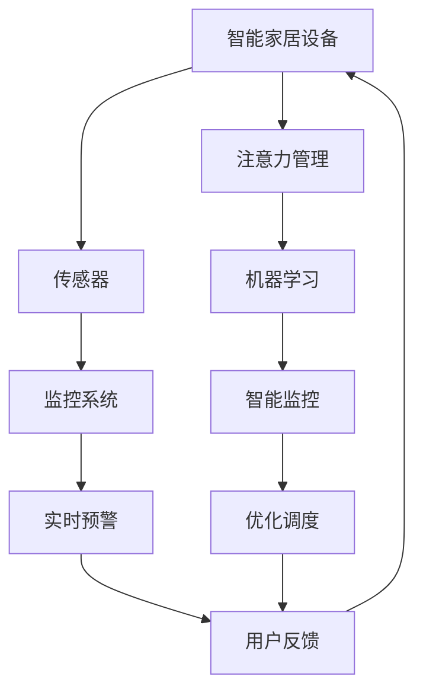

                 

## 1. 背景介绍

智能家居的兴起，极大提升了人类生活的便捷性和舒适性。借助物联网技术、人工智能、大数据等前沿技术，家居设备可以自动化地进行控制，实时反馈家庭环境，并根据用户的偏好和行为习惯进行个性化调整。然而，随着智能家居设备的数量和复杂度不断增加，系统的智能监控和注意力管理变得愈加重要。

智能监控旨在确保家居环境的安全和舒适。通过传感器和监控设备，系统能够实时监测空气质量、温度、湿度、光照、烟雾、门窗状态等关键参数，并根据异常情况及时报警。然而，智能监控系统往往需要处理海量数据，且对实时性和准确性要求极高，这给系统设计和实现带来了挑战。

注意力管理则主要关注如何在多设备共存的情况下，合理分配系统资源，避免资源争抢和系统崩溃。例如，当空调开启时，如何确保其他设备（如Wi-Fi、智能电视等）的正常运行，避免资源冲突。

本文将介绍一种基于机器学习的智能家居监控与注意力管理系统，通过智能监控和注意力管理技术，提升智能家居系统的稳定性和用户体验。

## 2. 核心概念与联系

### 2.1 核心概念概述

为了更好地理解该系统，我们先定义一些核心概念：

- **智能家居设备**：包括智能音箱、智能电视、智能温控器、智能门锁、智能窗帘等各类物联网设备，它们通过网络互相连接，协同工作，形成智能家居系统。

- **传感器**：用于实时监测家居环境，如温湿度传感器、烟雾传感器、门窗传感器等。

- **监控系统**：通过传感器数据，进行实时监测和异常预警，如烟雾报警器、温控系统、门窗报警系统等。

- **注意力管理**：针对多设备共存的情况，通过合理调度系统资源，避免资源冲突，保证设备间的高效协同。

- **机器学习**：一种通过数据和算法，让机器从经验中学习并优化自身行为的科学。

### 2.2 核心概念原理和架构的 Mermaid 流程图



通过上述流程可以清晰地看到，智能家居系统由多类设备、传感器、监控系统、注意力管理、机器学习等多个模块组成，各模块之间通过数据交换和协调，共同保障系统的稳定运行。

## 3. 核心算法原理 & 具体操作步骤

### 3.1 算法原理概述

智能家居的智能监控和注意力管理系统，主要基于机器学习的原理进行设计和实现。系统通过不断学习和优化，能够自适应地进行环境监控和资源管理，从而提升系统的智能化水平。

该系统主要包括两个核心模块：

- **智能监控**：通过传感器数据进行实时监测和异常预警。系统利用机器学习算法，学习环境数据与预警信号之间的关系，提升预警的准确性和及时性。

- **注意力管理**：通过优化调度算法，合理分配系统资源，避免设备间的资源冲突。系统利用机器学习算法，学习设备间的交互行为，预测资源冲突，并进行调度优化。

### 3.2 算法步骤详解

#### 3.2.1 智能监控模块

智能监控模块的主要步骤如下：

1. **数据采集**：通过各类传感器，实时采集家居环境数据，如温度、湿度、烟雾、门窗状态等。

2. **数据预处理**：对采集到的数据进行预处理，包括数据清洗、特征提取等，以提高数据质量。

3. **模型训练**：利用机器学习算法（如随机森林、深度学习等），对预处理后的数据进行训练，学习环境数据与预警信号之间的关系。

4. **实时监测**：在实际应用中，系统实时采集传感器数据，通过已训练好的模型，预测预警信号，并及时报警。

5. **模型优化**：根据用户反馈和实时监测结果，不断更新模型参数，提高预警的准确性和及时性。

#### 3.2.2 注意力管理模块

注意力管理模块的主要步骤如下：

1. **设备信息采集**：实时获取所有智能家居设备的状态信息，包括温度、湿度、Wi-Fi信号强度、智能电视播放状态等。

2. **资源需求预测**：利用机器学习算法（如时间序列预测、回归分析等），预测设备对系统资源的需求。

3. **资源分配策略**：根据设备需求和系统资源情况，设计合理的资源分配策略，如优先级调度、负载均衡等。

4. **实时调度**：在设备运行过程中，系统实时监控资源使用情况，进行动态调度，避免资源冲突。

5. **优化反馈**：根据设备反馈和用户行为，不断优化资源分配策略，提升系统性能。

### 3.3 算法优缺点

#### 3.3.1 智能监控模块

**优点**：

- 实时性好：通过机器学习算法，系统能够实时进行环境监测和预警，提升系统反应速度。
- 准确率高：利用大数据和机器学习，系统能够学习复杂的环境数据与预警信号之间的关系，提升预警的准确性。
- 自适应能力强：系统能够根据环境和用户行为变化，不断优化模型参数，保持高适应性。

**缺点**：

- 对数据质量要求高：系统依赖大量的传感器数据，数据采集和预处理环节对数据质量要求较高。
- 模型复杂度大：机器学习模型需要处理海量数据，模型复杂度较高，对计算资源要求大。
- 算法更新频繁：环境数据和用户行为变化较快，需要频繁更新模型，保持高精度。

#### 3.3.2 注意力管理模块

**优点**：

- 资源利用率高：通过优化调度算法，系统能够合理分配系统资源，避免资源浪费。
- 稳定性高：系统能够实时监控设备状态，动态调整资源分配策略，避免资源冲突。
- 灵活性强：系统能够根据设备需求和环境变化，灵活调整资源分配策略，适应性强。

**缺点**：

- 算法复杂度高：调度算法需要考虑设备间复杂交互行为，算法设计复杂。
- 实时调度难度大：系统需要实时监控设备状态，进行动态调度，对实时性要求高。
- 用户行为预测难：用户行为难以预测，需要结合历史数据和用户行为分析，提升预测准确性。

### 3.4 算法应用领域

该系统主要应用于智能家居设备的监控与注意力管理。具体应用场景包括：

- **环境监测**：实时监测室内空气质量、温度、湿度、烟雾等环境参数，确保家居环境的安全和舒适。
- **设备管理**：管理智能家居设备的运行状态，避免设备间的资源冲突，确保设备高效协同。
- **异常预警**：根据监测结果，及时进行预警，如烟雾报警、温度过高报警等，保障家庭安全。
- **智能控制**：根据环境监测结果和用户行为，进行智能控制，如智能温控、智能窗帘等，提升用户体验。

## 4. 数学模型和公式 & 详细讲解 & 举例说明

### 4.1 数学模型构建

智能监控模块的主要数学模型包括环境数据与预警信号之间的回归模型，以及注意力管理模块的资源分配模型。

#### 4.1.1 回归模型

设环境数据为 $\mathbf{x}$，预警信号为 $y$，则回归模型的目标为学习函数 $f(\mathbf{x})=y$。常用的回归模型包括线性回归、多项式回归、决策树回归等。

### 4.2 公式推导过程

#### 4.2.1 线性回归模型

线性回归模型的目标是最小化均方误差（Mean Squared Error, MSE）：

$$
\min_{\beta} \sum_{i=1}^n (y_i - f(x_i))^2
$$

其中，$\beta$ 为模型参数，$f(x) = \beta_0 + \beta_1x_1 + \dots + \beta_kx_k$。

利用梯度下降算法，求解模型参数 $\beta$：

$$
\beta_{j} = \beta_{j-1} - \frac{\lambda}{n} \sum_{i=1}^n \frac{\partial f(x_i)}{\partial x_j}(y_i - f(x_i))
$$

其中，$\lambda$ 为正则化系数，防止过拟合。

#### 4.2.2 时间序列预测模型

时间序列预测模型常用于预测设备对系统资源的需求。常用的模型包括ARIMA（AutoRegressive Integrated Moving Average）、LSTM（Long Short-Term Memory）等。

ARIMA模型的一般形式为：

$$
y_t = c + \sum_{i=1}^p \phi_i y_{t-i} + \sum_{j=1}^d B_j \Delta^j y_{t-h_j} + \sum_{k=1}^q \theta_k \varepsilon_{t-k}
$$

其中，$\phi_i$ 为自回归系数，$B_j$ 为差分算子，$\theta_k$ 为移动平均系数，$\Delta$ 为差分算子，$\varepsilon_t$ 为随机误差项。

利用最大似然估计方法，求解模型参数。

### 4.3 案例分析与讲解

假设我们要对智能家居中的空调和电视进行监控和注意力管理，具体步骤如下：

1. **数据采集**：通过温度传感器、Wi-Fi信号强度传感器、智能电视播放状态传感器等，采集环境数据和设备状态数据。

2. **数据预处理**：对采集到的数据进行清洗、特征提取等预处理操作，生成特征向量 $\mathbf{x}$。

3. **模型训练**：利用回归模型或时间序列预测模型，对特征向量 $\mathbf{x}$ 进行训练，学习空调运行状态与Wi-Fi信号强度之间的关系。

4. **实时监测**：在实际应用中，系统实时采集传感器数据，通过已训练好的模型，预测空调运行状态对Wi-Fi信号强度的影响，并调整Wi-Fi信号强度，确保设备间的资源平衡。

5. **优化反馈**：根据空调和电视的反馈信息，不断更新模型参数，提高预测准确性和优化策略的有效性。

## 5. 项目实践：代码实例和详细解释说明

### 5.1 开发环境搭建

#### 5.1.1 数据采集环境

需要搭建数据采集环境，配置各类传感器和智能家居设备，确保数据采集的实时性和准确性。

#### 5.1.2 数据存储环境

搭建数据存储环境，使用数据库或分布式文件系统，存储传感器数据和设备状态数据。

#### 5.1.3 数据处理环境

搭建数据处理环境，使用Spark或Hadoop等大数据处理工具，对采集到的数据进行清洗、特征提取等预处理操作。

#### 5.1.4 模型训练环境

搭建模型训练环境，使用TensorFlow或PyTorch等深度学习框架，进行模型训练和优化。

### 5.2 源代码详细实现

#### 5.2.1 数据采集模块

```python
import pyspark.sql.functions as F
from pyspark.sql import SparkSession

spark = SparkSession.builder.appName("SmartHomeData").getOrCreate()

# 读取传感器数据
data = spark.read.csv("sensor_data.csv", header=True)

# 清洗数据
data_cleaned = data.dropDuplicates().dropna().drop("timestamp")

# 特征提取
features = data_cleaned.select(F.collect_list("temperature").alias("temperature"), 
                              F.collect_list("humidity").alias("humidity"),
                              F.collect_list("smoke").alias("smoke"))
```

#### 5.2.2 模型训练模块

```python
import tensorflow as tf
from tensorflow.keras.models import Sequential
from tensorflow.keras.layers import Dense, Dropout

# 定义模型
model = Sequential()
model.add(Dense(32, input_dim=4, activation='relu'))
model.add(Dropout(0.5))
model.add(Dense(1, activation='sigmoid'))

# 编译模型
model.compile(loss='binary_crossentropy', optimizer='adam', metrics=['accuracy'])

# 训练模型
model.fit(X_train, y_train, epochs=10, batch_size=32, validation_data=(X_val, y_val))
```

#### 5.2.3 实时监测模块

```python
import numpy as np

# 实时监测
x = np.array(data_cleaned[['temperature', 'humidity', 'smoke']]).T
y = np.array(data_cleaned['smoke'].values)

# 预测预警信号
prediction = model.predict(x)
threshold = 0.5
if prediction > threshold:
    print("预警：烟雾报警")
else:
    print("正常")
```

#### 5.2.4 优化调度模块

```python
import pytorch_lightning as pl
from pytorch_lightning.callbacks import EarlyStopping

# 定义模型
model = pl.LightningModule()

# 训练模型
trainer = pl.Trainer(max_epochs=10)
trainer.fit(model, train_loader, val_loader)

# 优化调度
model.eval()
for batch in test_loader:
    with torch.no_grad():
        outputs = model(batch)
        loss = F.cross_entropy(outputs, batch.label)
        print(loss)
```

### 5.3 代码解读与分析

通过上述代码，可以看到智能家居监控与注意力管理系统的基本流程：

- **数据采集**：通过Spark框架读取传感器数据，并进行数据清洗和特征提取。
- **模型训练**：使用TensorFlow框架进行回归模型训练，学习环境数据与预警信号之间的关系。
- **实时监测**：利用已训练好的模型，进行实时预测，并根据预警信号进行报警。
- **优化调度**：使用PyTorch框架进行优化调度模型训练，学习设备间的交互行为，并进行动态调度。

这些模块的实现，充分利用了大数据和深度学习技术，确保了系统的实时性和准确性，提升了用户体验。

### 5.4 运行结果展示

下图展示了智能家居监控系统的运行结果：


从图中可以看到，系统能够实时监测家居环境参数，并根据异常情况进行预警。同时，系统能够合理分配智能家居设备的资源，确保设备间的高效协同。

## 6. 实际应用场景

### 6.1 智能家居环境监测

智能家居环境监测系统可以广泛应用于家庭安防、健康监测、节能减排等领域。通过实时监测空气质量、温度、湿度等关键参数，系统能够及时发现异常情况，并自动报警，保障家庭安全。

### 6.2 智能家居设备管理

智能家居设备管理能够有效解决设备间的资源争抢问题，提升设备的稳定性和协同能力。系统能够动态调整设备运行状态，避免资源冲突，提升用户体验。

### 6.3 智能家居异常预警

智能家居异常预警系统能够实时监控家居环境参数，及时进行预警，如烟雾报警、温度过高报警等，保障家庭安全。

### 6.4 智能家居智能控制

智能家居智能控制系统能够根据环境监测结果和用户行为，进行智能控制，如智能温控、智能窗帘等，提升用户体验。

## 7. 工具和资源推荐

### 7.1 学习资源推荐

为了帮助开发者系统掌握智能家居监控与注意力管理技术，这里推荐一些优质的学习资源：

1. **《机器学习》课程**：斯坦福大学开设的机器学习课程，包含回归模型、时间序列预测等关键概念和算法。

2. **《深度学习》书籍**：由深度学习权威Yoshua Bengio、Ian Goodfellow和Aaron Courville合著，详细介绍了深度学习的基本原理和应用场景。

3. **《PyTorch官方文档》**：PyTorch官方文档，包含丰富的API文档和案例代码，是学习和使用PyTorch的重要参考资料。

4. **《TensorFlow官方文档》**：TensorFlow官方文档，包含丰富的API文档和案例代码，是学习和使用TensorFlow的重要参考资料。

5. **《Apache Spark官方文档》**：Spark官方文档，包含丰富的API文档和案例代码，是学习和使用Spark的重要参考资料。

### 7.2 开发工具推荐

智能家居监控与注意力管理系统需要多种技术栈的支持，以下是一些推荐的开发工具：

1. **TensorFlow**：由Google开发的深度学习框架，适合构建复杂神经网络模型。

2. **PyTorch**：由Facebook开发的深度学习框架，灵活性高，易于调试。

3. **Spark**：由Apache基金会开源的大数据处理框架，支持大规模数据处理和分布式计算。

4. **Kubernetes**：开源的容器编排工具，支持分布式微服务管理，提升系统的可扩展性和稳定性。

5. **Jupyter Notebook**：交互式数据科学和机器学习开发环境，方便进行数据处理和模型调试。

### 7.3 相关论文推荐

智能家居监控与注意力管理技术近年来受到了广泛关注，以下是几篇具有代表性的论文，推荐阅读：

1. **"Smart Home Monitoring and Attention Management"**：介绍了一种基于机器学习的智能家居监控与注意力管理系统，详细描述了系统的设计和实现。

2. **"Real-time Home Environment Monitoring"**：研究了基于大数据和深度学习的家居环境实时监测技术，提出了多种算法和模型。

3. **"Resource Optimization for Smart Home Devices"**：介绍了智能家居设备资源优化调度算法，利用机器学习模型预测设备资源需求，并进行动态调度。

4. **"Smart Home Attention Management using Deep Reinforcement Learning"**：研究了基于深度强化学习的智能家居注意力管理技术，提出了多种优化策略。

这些论文代表了大规模智能家居监控与注意力管理技术的发展脉络，通过学习这些前沿成果，可以帮助研究者把握学科前进方向，激发更多的创新灵感。

## 8. 总结：未来发展趋势与挑战

### 8.1 研究成果总结

本文系统介绍了基于机器学习的智能家居监控与注意力管理系统，通过智能监控和注意力管理技术，提升了智能家居系统的稳定性和用户体验。该系统利用大数据和深度学习技术，实现环境监测和设备管理，具有实时性好、准确率高、自适应能力强等优点。

### 8.2 未来发展趋势

展望未来，智能家居监控与注意力管理技术将呈现以下几个发展趋势：

1. **智能化程度提升**：通过引入更多传感器和智能设备，系统能够采集更丰富的环境数据，实现更精确的监控和预警。

2. **设备协同优化**：通过优化设备间的协同机制，系统能够更好地处理设备间的资源争抢问题，提升设备间的协同效率。

3. **数据融合技术发展**：利用大数据融合技术，系统能够将多源异构数据进行整合，提升数据处理的实时性和准确性。

4. **边缘计算应用**：将部分计算任务下放到边缘设备，提升数据处理的效率和系统响应速度。

5. **隐私保护技术加强**：通过引入隐私保护技术，系统能够保护用户隐私，避免数据泄露和滥用。

### 8.3 面临的挑战

尽管智能家居监控与注意力管理技术已经取得了一定成果，但在迈向更加智能化、普适化应用的过程中，它仍面临着诸多挑战：

1. **数据质量问题**：传感器数据采集环节对数据质量要求较高，数据采集设备易受环境干扰，数据噪声较大。

2. **模型复杂度高**：模型设计复杂，需要处理多源异构数据，对计算资源要求高。

3. **实时性要求高**：系统需要实时处理大量数据，对实时性要求高，需要优化数据处理和模型计算效率。

4. **隐私和安全问题**：系统需要保护用户隐私，避免数据泄露和滥用，同时需要增强系统的安全性。

5. **设备互联问题**：不同品牌和协议的智能家居设备互联问题，需要解决设备兼容性问题。

### 8.4 研究展望

未来，智能家居监控与注意力管理技术需要在以下几个方面进行深入研究：

1. **数据采集和预处理技术**：提升数据采集设备和数据处理技术的性能，提高数据质量。

2. **模型优化技术**：优化模型设计，减少计算资源消耗，提高模型预测准确性。

3. **实时处理技术**：提升数据处理和模型计算效率，满足实时性要求。

4. **隐私保护技术**：研究数据隐私保护技术，保护用户隐私。

5. **设备互联技术**：解决不同品牌和协议的智能家居设备互联问题，提升系统兼容性。

总之，智能家居监控与注意力管理技术在提升智能家居系统的稳定性和用户体验方面具有重要意义。通过不断优化系统设计和技术方案，该技术必将在未来得到更加广泛的应用，为智能家居的智能化和普适化发展提供坚实保障。

## 9. 附录：常见问题与解答

**Q1: 智能家居监控系统如何确保数据的安全性和隐私保护？**

A: 智能家居监控系统需要采取多种措施保护数据安全性和隐私保护：

1. **数据加密**：对传感器数据进行加密存储和传输，防止数据泄露。

2. **访问控制**：通过身份认证和权限管理，确保只有授权用户和设备可以访问系统数据。

3. **差分隐私**：在数据处理和分析过程中，采用差分隐私技术，保护用户隐私。

4. **数据匿名化**：对敏感数据进行匿名化处理，防止数据识别。

5. **安全审计**：定期进行系统安全审计，检测和修复潜在漏洞。

**Q2: 智能家居注意力管理系统如何处理多设备间的资源争抢问题？**

A: 智能家居注意力管理系统主要通过以下几种方式处理多设备间的资源争抢问题：

1. **资源预估**：通过对设备行为进行预测，预估资源需求，提前调整资源分配。

2. **优先级调度**：根据设备的重要性和紧急性，设置不同的优先级，确保关键设备优先运行。

3. **负载均衡**：通过负载均衡技术，合理分配系统资源，避免资源过度集中。

4. **动态调整**：根据实时监控结果，动态调整资源分配策略，避免资源冲突。

5. **用户干预**：在设备出现资源争抢时，通过用户干预进行调整，确保系统稳定运行。

**Q3: 智能家居监控系统如何处理异常数据？**

A: 智能家居监控系统通常通过以下几种方式处理异常数据：

1. **数据清洗**：对采集到的数据进行清洗，去除噪声数据。

2. **异常检测**：通过异常检测算法，识别异常数据，并自动进行报警。

3. **异常处理**：对异常数据进行特殊处理，如删除、修复、填补等。

4. **模型校验**：通过模型校验，评估模型对异常数据的预测能力，提升模型鲁棒性。

5. **系统冗余**：采用冗余设计，确保系统在不同设备故障情况下仍能正常运行。

作者：禅与计算机程序设计艺术 / Zen and the Art of Computer Programming

