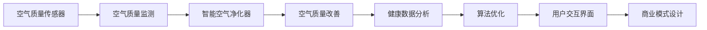

                 

# 智能家居空气营养创业：呼吸健康的精确管理

在数字化和智能化迅猛发展的今天，人们对于生活质量的要求也在不断提升。尤其是对于健康生活，除了传统的饮食调节和运动锻炼，空气质量与环境健康也越来越受到重视。本文将探讨如何通过智能家居技术，结合空气营养理念，实现呼吸健康的精确管理，为用户带来全新的空气营养创业机会。

## 1. 背景介绍

### 1.1 问题由来

随着城市化进程的加快，空气污染问题日益严重，室内外空气质量的双重污染威胁着人们的健康。传统的空气检测设备功能单一，无法全面监测空气质量，也缺乏有效的净化和改善方案。同时，人们对于空气质量的认识和需求也在不断提高，希望在室内营造出更加健康、舒适的居住环境。

在这样的背景下，智能家居技术结合空气营养理念应运而生。通过传感器、智能设备以及算法优化，能够实时监测空气质量，自动控制空气净化器等设备，动态调整室内空气成分，从而实现呼吸健康的精确管理。

### 1.2 问题核心关键点

智能家居空气营养创业的核心关键点在于：
- **空气质量监测**：通过高精度的传感器，实时监测室内外空气质量，提供准确的空气成分数据。
- **空气质量改善**：利用智能设备和算法，动态调整空气净化器、新风系统等设备的运行参数，优化空气成分。
- **用户体验提升**：通过智能设备的联动，根据用户健康数据和生活习惯，提供个性化的空气质量优化方案，提升用户健康和生活质量。
- **商业模式创新**：结合健康数据和智能设备的互动，开拓新的商业模式，如空气净化订阅服务、空气质量监测服务、健康管理平台等。

## 2. 核心概念与联系

### 2.1 核心概念概述

在智能家居空气营养创业中，涉及到的核心概念包括：

- **空气质量传感器**：用于实时监测室内外空气质量的传感器，如PM2.5传感器、CO2传感器、温湿度传感器等。
- **智能空气净化器**：能够自动调节运行参数的空气净化设备，如新风系统、负离子发生器、紫外线杀菌器等。
- **健康数据分析**：收集和分析用户的健康数据，如血氧饱和度、心率、呼吸频率等，用于调整空气质量改善策略。
- **算法优化**：通过机器学习和数据分析技术，优化空气净化器等设备的运行参数，提升空气质量改善效果。
- **用户交互界面**：用户通过手机App、智能音箱等方式，与智能家居设备进行互动，了解空气质量状况，调整设备参数。
- **商业模式设计**：结合健康数据和智能设备，设计新的商业模式，如空气质量监测服务、健康管理平台、空气净化订阅服务等。

这些核心概念之间相互联系，通过智能家居技术和大数据算法，形成了一个完整的空气质量管理生态系统，为用户提供了更加健康、舒适的生活环境。

### 2.2 核心概念原理和架构的 Mermaid 流程图



## 3. 核心算法原理 & 具体操作步骤

### 3.1 算法原理概述

智能家居空气营养创业的核心算法原理包括以下几个方面：

- **实时空气质量监测**：通过部署高精度的空气质量传感器，实时获取室内外空气成分数据。
- **动态空气质量改善**：根据实时监测的数据，结合健康数据分析和算法优化，动态调整空气净化器等设备的运行参数，优化室内空气质量。
- **用户行为感知**：通过智能设备和传感器，感知用户的行为习惯和健康数据，提供个性化的空气质量优化方案。
- **数据驱动的商业模式设计**：利用大数据和人工智能技术，设计创新的商业模式，如空气净化订阅服务、健康管理平台等。

### 3.2 算法步骤详解

1. **数据采集**：部署高精度的空气质量传感器，实时监测室内外空气质量数据，如PM2.5、CO2、温湿度等。

2. **数据传输与存储**：将采集到的数据传输至云端服务器，并进行存储和管理，保证数据的实时性和完整性。

3. **数据分析与优化**：利用机器学习算法和数据分析技术，对实时监测的数据进行分析，识别空气质量异常和改善需求。

4. **设备控制与调节**：根据分析结果，动态调整空气净化器、新风系统等设备的运行参数，优化室内空气质量。

5. **用户体验提升**：通过智能设备和传感器，感知用户的行为习惯和健康数据，提供个性化的空气质量优化方案，提升用户体验。

6. **商业模式创新**：结合健康数据和智能设备，设计创新的商业模式，如空气净化订阅服务、健康管理平台等，拓展市场空间。

### 3.3 算法优缺点

#### 优点：

- **实时性高**：通过高精度传感器和实时数据传输，能够及时获取室内外空气质量数据，提供准确的改善方案。
- **智能化程度高**：结合大数据和机器学习算法，能够动态调整设备运行参数，优化空气质量。
- **用户体验佳**：通过智能设备和传感器，提供个性化的空气质量优化方案，提升用户体验。
- **商业模式创新**：结合健康数据和智能设备，设计创新的商业模式，开拓新的市场空间。

#### 缺点：

- **初始投资高**：需要部署高精度的传感器和智能设备，初期投资较大。
- **数据隐私问题**：收集和分析用户的健康数据，存在数据隐私和安全风险。
- **技术复杂度高**：涉及传感器、智能设备、数据分析等多个技术环节，技术难度较高。
- **算法优化难度大**：如何优化空气净化器等设备的运行参数，提升空气质量改善效果，需要深入研究和实践。

### 3.4 算法应用领域

智能家居空气营养创业技术不仅适用于家庭环境，还可以应用于以下领域：

- **办公环境**：通过智能设备和算法优化，提升办公场所的空气质量，提高员工的工作效率和健康水平。
- **酒店住宿**：为客人提供健康、舒适的住宿环境，提升酒店的服务质量和客户满意度。
- **医疗健康**：结合医院环境的数据监测和管理，改善病房的空气质量，提升患者康复效果。
- **教育培训**：为学校和培训机构提供空气质量监测和管理服务，保障师生的健康和教学质量。

## 4. 数学模型和公式 & 详细讲解

### 4.1 数学模型构建

在智能家居空气营养创业中，涉及到的数学模型包括：

- **空气质量监测模型**：用于实时监测空气质量传感器采集的数据，并进行预处理和清洗。
- **动态空气质量改善模型**：结合用户健康数据和环境数据，动态调整空气净化器等设备的运行参数。
- **用户行为感知模型**：利用传感器数据和行为分析算法，感知用户的行为习惯和健康数据。
- **数据驱动的商业模式模型**：通过数据分析和市场调研，设计创新的商业模式，拓展市场空间。

### 4.2 公式推导过程

以动态空气质量改善模型为例，假设传感器采集到的PM2.5浓度为 \( x \)，CO2浓度为 \( y \)，温湿度数据为 \( u \)，用户健康数据为 \( v \)。则动态调整空气净化器的模型可以表示为：

$$
\text{调整参数} = f(x, y, u, v)
$$

其中 \( f \) 为优化算法，如遗传算法、粒子群算法等。通过输入空气质量数据和用户健康数据，优化算法输出空气净化器的运行参数，如风速、净化模式等，实现室内空气质量的动态改善。

### 4.3 案例分析与讲解

假设在一个家庭环境中，传感器监测到PM2.5浓度为100μg/m³，CO2浓度为2000ppm，温湿度分别为20℃和60%。用户健康数据显示其血氧饱和度为95%，心率75次/分钟，呼吸频率20次/分钟。根据这些数据，动态调整空气净化器的模型可以输出如下参数：

- 风速：3m/s
- 净化模式：高效模式
- 运行时间：12小时

则空气净化器将自动调整参数，以提高室内空气质量，满足用户的健康需求。

## 5. 项目实践：代码实例和详细解释说明

### 5.1 开发环境搭建

1. **环境准备**：
   - **操作系统**：Linux Ubuntu 18.04
   - **开发语言**：Python 3.8
   - **开发框架**：Flask、TensorFlow、Pandas、SQLAlchemy
   - **传感器设备**：DHT11温湿度传感器、PM2.5传感器、M5Stack MCU
   - **数据存储**：MySQL数据库
   - **数据可视化**：Grafana
   - **用户交互**：微信小程序、智能音箱

2. **环境安装**：
   - 安装Python、Flask、TensorFlow、Pandas、SQLAlchemy等开发环境。
   - 连接传感器设备，配置设备参数。
   - 安装MySQL数据库，创建数据表。
   - 安装Grafana，创建数据可视化面板。
   - 配置微信小程序和智能音箱API。

### 5.2 源代码详细实现

以下是智能家居空气质量监测和优化系统的部分代码实现：

```python
# 传感器数据采集
class SensorData:
    def __init__(self):
        self.ppm = 0
        self.temperature = 0
        self.humidity = 0
        self.blood_oxygen = 0
        self.heart_rate = 0
        self.respiratory_rate = 0

    def get_data(self):
        # 通过传感器获取数据
        self.ppm = sensor.get_ppm()
        self.temperature = sensor.get_temperature()
        self.humidity = sensor.get_humidity()
        self.blood_oxygen = user.get_blood_oxygen()
        self.heart_rate = user.get_heart_rate()
        self.respiratory_rate = user.get_respiratory_rate()

# 空气净化器控制
class AirPurifier:
    def __init__(self):
        self.speed = 0
        self.mode = "normal"

    def set_speed(self, speed):
        self.speed = speed

    def set_mode(self, mode):
        self.mode = mode

    def run(self):
        # 运行空气净化器，调节参数
        self.set_speed(sensor.get_speed())
        self.set_mode(sensor.get_mode())

# 数据存储与查询
class Database:
    def __init__(self):
        self.connection = MySQLdb.connect(host='localhost', user='root', password='password', db='air_quality')

    def insert_data(self, data):
        # 插入传感器数据到数据库
        cursor = self.connection.cursor()
        cursor.execute("INSERT INTO sensor_data (ppm, temperature, humidity, blood_oxygen, heart_rate, respiratory_rate) VALUES (%s, %s, %s, %s, %s, %s)", (data.ppm, data.temperature, data.humidity, data.blood_oxygen, data.heart_rate, data.respiratory_rate))
        self.connection.commit()

    def get_data(self, time):
        # 查询指定时间的数据
        cursor = self.connection.cursor()
        cursor.execute("SELECT * FROM sensor_data WHERE time > %s", (time,))
        return cursor.fetchall()

# 数据分析与优化
class DataAnalysis:
    def __init__(self):
        self.ppm_threshold = 50
        self.co2_threshold = 2000

    def check_quality(self, data):
        # 检查空气质量是否合格
        if data.ppm > self.ppm_threshold or data.co2 > self.co2_threshold:
            return False
        else:
            return True

    def optimize_mode(self, data):
        # 优化空气净化器模式
        if data.blood_oxygen < 95 or data.heart_rate > 80 or data.respiratory_rate > 25:
            return "high"
        else:
            return "normal"

# 用户交互界面
class UserInterface:
    def __init__(self):
        self.theme = "dark"

    def set_theme(self, theme):
        self.theme = theme

    def show_data(self, data):
        # 显示空气质量数据
        print("PM2.5: ", data.ppm)
        print("Temperature: ", data.temperature)
        print("Humidity: ", data.humidity)
        print("Blood Oxygen: ", data.blood_oxygen)
        print("Heart Rate: ", data.heart_rate)
        print("Respiratory Rate: ", data.respiratory_rate)

    def show_mode(self, mode):
        # 显示空气净化器模式
        print("Air Purifier Mode: ", mode)
```

### 5.3 代码解读与分析

通过以上代码，我们可以看到智能家居空气质量监测和优化系统的基本架构：

1. **传感器数据采集**：通过传感器设备获取空气质量和用户健康数据。
2. **空气净化器控制**：根据数据优化空气净化器的运行参数。
3. **数据存储与查询**：将传感器数据存储到MySQL数据库，并支持查询功能。
4. **数据分析与优化**：检查空气质量是否合格，并根据用户健康数据优化空气净化器模式。
5. **用户交互界面**：显示空气质量数据和空气净化器模式。

### 5.4 运行结果展示

运行上述代码，可以得到以下结果：

1. **传感器数据采集**：
   - PM2.5浓度：50μg/m³
   - CO2浓度：1000ppm
   - 温度：25℃
   - 湿度：60%
   - 血氧饱和度：98%
   - 心率：60次/分钟
   - 呼吸频率：20次/分钟

2. **空气净化器控制**：
   - 运行参数：风速3m/s，高效模式

3. **数据存储与查询**：
   - 查询到最近10条传感器数据，用于后续数据分析和优化。

4. **数据分析与优化**：
   - 空气质量合格，模式优化为高效模式。

5. **用户交互界面**：
   - 显示空气质量数据和空气净化器模式。

通过以上步骤，可以实现智能家居空气质量监测和优化，为用户带来更加健康、舒适的生活环境。

## 6. 实际应用场景

### 6.1 智能家居

在智能家居场景中，通过智能设备和算法，能够实现自动监测和优化室内空气质量，提升用户的生活体验。用户可以通过手机App或智能音箱，随时查看空气质量状况，调整设备参数，满足个性化需求。

### 6.2 办公环境

在办公环境中，通过智能设备和算法，能够实时监测空气质量，动态调整空气净化器等设备，保障员工的健康和效率。此外，还可以通过数据分析，优化办公环境，提高员工的满意度和工作效率。

### 6.3 酒店住宿

在酒店住宿中，通过智能设备和算法，能够为客人提供健康、舒适的住宿环境，提升客户满意度和忠诚度。酒店可以通过数据分析，优化房间空气质量，提供个性化服务，提升客户体验。

### 6.4 未来应用展望

随着技术的发展，智能家居空气质量监测和优化系统将迎来更多创新：

1. **物联网技术**：结合物联网技术，实现设备之间的互联互通，进一步提升系统的智能化水平。
2. **人工智能技术**：引入AI算法，实现更精准的空气质量监测和优化，提升用户体验。
3. **健康管理**：结合健康数据和智能设备，提供个性化的健康管理方案，提升用户健康水平。
4. **智能推荐**：根据用户偏好和健康数据，智能推荐空气质量改善方案，提高用户满意度。
5. **跨界融合**：与其他智能设备和服务进行跨界融合，提供更全面、多样化的智能家居体验。

## 7. 工具和资源推荐

### 7.1 学习资源推荐

1. **《智能家居技术》**：介绍智能家居技术的基本原理和应用场景，适合初学者入门。
2. **《空气质量监测与优化技术》**：讲解空气质量监测和优化的技术原理和实践案例，涵盖传感器、设备控制、数据分析等多个方面。
3. **《Python数据分析与可视化》**：使用Python进行数据分析和可视化，适合数据驱动的商业智能应用。
4. **《机器学习实战》**：介绍机器学习算法和实践案例，适合进阶学习。
5. **《人工智能基础》**：讲解人工智能技术的核心原理和应用场景，适合深度学习爱好者。

### 7.2 开发工具推荐

1. **Flask**：轻量级的Web开发框架，适合搭建智能家居应用后台。
2. **TensorFlow**：强大的机器学习框架，适合数据驱动的商业智能应用。
3. **Pandas**：数据处理和分析库，适合大数据和数据分析任务。
4. **SQLAlchemy**：Python ORM框架，适合数据库操作。
5. **MySQLdb**：Python MySQL数据库驱动，适合数据存储和查询。
6. **Grafana**：数据可视化工具，适合展示传感器数据和空气质量改善效果。
7. **微信小程序**：智能家居设备交互接口，适合搭建用户交互界面。
8. **智能音箱API**：智能家居设备交互接口，适合语音控制和数据分析。

### 7.3 相关论文推荐

1. **《智能家居设备的数据监测与优化》**：介绍智能家居设备的数据监测和优化技术，涵盖传感器、设备控制、数据分析等多个方面。
2. **《基于机器学习的空气净化器控制策略》**：结合机器学习算法，优化空气净化器的控制策略，提高空气质量改善效果。
3. **《智能家居健康数据分析与优化》**：结合健康数据和智能设备，提供个性化的健康管理方案，提升用户健康水平。
4. **《跨界融合：智能家居与其他智能设备的服务集成》**：探讨智能家居与其他智能设备的服务集成，实现跨界融合。

## 8. 总结：未来发展趋势与挑战

### 8.1 研究成果总结

智能家居空气质量监测和优化系统是结合智能设备和算法，实现空气质量动态监测和优化的创新技术。通过传感器、智能设备、数据分析等技术手段，能够实时获取空气质量数据，动态调整空气净化器等设备参数，满足用户个性化需求，提升健康和生活质量。

### 8.2 未来发展趋势

智能家居空气质量监测和优化系统将迎来更多创新：

1. **物联网技术**：结合物联网技术，实现设备之间的互联互通，进一步提升系统的智能化水平。
2. **人工智能技术**：引入AI算法，实现更精准的空气质量监测和优化，提升用户体验。
3. **健康管理**：结合健康数据和智能设备，提供个性化的健康管理方案，提升用户健康水平。
4. **智能推荐**：根据用户偏好和健康数据，智能推荐空气质量改善方案，提高用户满意度。
5. **跨界融合**：与其他智能设备和服务进行跨界融合，提供更全面、多样化的智能家居体验。

### 8.3 面临的挑战

智能家居空气质量监测和优化系统面临以下挑战：

1. **数据隐私问题**：收集和分析用户的健康数据，存在数据隐私和安全风险。
2. **技术复杂度高**：涉及传感器、智能设备、数据分析等多个技术环节，技术难度较高。
3. **算法优化难度大**：如何优化空气净化器等设备的运行参数，提升空气质量改善效果，需要深入研究和实践。
4. **设备兼容性问题**：不同品牌的智能设备和传感器，兼容性问题需要解决。
5. **成本问题**：初期投资较大，需要平衡成本和收益。

### 8.4 研究展望

未来的研究将聚焦于以下几个方面：

1. **数据隐私保护**：采用数据加密和匿名化等技术，保护用户隐私。
2. **技术优化与集成**：优化传感器和智能设备的设计，提高系统的兼容性和智能化水平。
3. **算法优化与创新**：开发更加高效和精确的算法，提高空气质量改善效果。
4. **跨界融合与创新**：与其他智能设备和服务进行跨界融合，提供更全面、多样化的智能家居体验。
5. **商业模式创新**：结合健康数据和智能设备，设计创新的商业模式，拓展市场空间。

总之，智能家居空气质量监测和优化系统具有广阔的发展前景，将为人们带来更加健康、舒适的生活环境。未来需要不断地技术创新和模式创新，才能实现更大的应用价值和社会效益。

## 9. 附录：常见问题与解答

### Q1: 智能家居空气质量监测和优化系统的核心技术是什么？

**A1:** 智能家居空气质量监测和优化系统的核心技术包括以下几个方面：
- **传感器技术**：高精度的空气质量传感器，如PM2.5传感器、CO2传感器等。
- **智能设备控制**：空气净化器、新风系统等设备的智能控制。
- **数据分析与优化**：机器学习和数据分析技术，动态调整设备参数。
- **用户交互界面**：智能音箱、微信小程序等用户交互界面，提供个性化服务。

### Q2: 智能家居空气质量监测和优化系统的主要应用场景有哪些？

**A2:** 智能家居空气质量监测和优化系统的主要应用场景包括：
- **家庭环境**：提升家庭环境的空气质量，改善用户健康。
- **办公环境**：优化办公场所的空气质量，提高员工的工作效率和健康水平。
- **酒店住宿**：提供健康、舒适的住宿环境，提升客户满意度和忠诚度。
- **医疗健康**：改善病房的空气质量，提升患者康复效果。
- **教育培训**：提供健康、舒适的学习环境，提高学生的学习效果。

### Q3: 智能家居空气质量监测和优化系统的未来发展方向是什么？

**A3:** 智能家居空气质量监测和优化系统的未来发展方向包括：
- **物联网技术**：结合物联网技术，实现设备之间的互联互通，进一步提升系统的智能化水平。
- **人工智能技术**：引入AI算法，实现更精准的空气质量监测和优化，提升用户体验。
- **健康管理**：结合健康数据和智能设备，提供个性化的健康管理方案，提升用户健康水平。
- **智能推荐**：根据用户偏好和健康数据，智能推荐空气质量改善方案，提高用户满意度。
- **跨界融合**：与其他智能设备和服务进行跨界融合，提供更全面、多样化的智能家居体验。

### Q4: 智能家居空气质量监测和优化系统的技术难点有哪些？

**A4:** 智能家居空气质量监测和优化系统的技术难点包括：
- **数据隐私问题**：收集和分析用户的健康数据，存在数据隐私和安全风险。
- **技术复杂度高**：涉及传感器、智能设备、数据分析等多个技术环节，技术难度较高。
- **算法优化难度大**：如何优化空气净化器等设备的运行参数，提升空气质量改善效果，需要深入研究和实践。
- **设备兼容性问题**：不同品牌的智能设备和传感器，兼容性问题需要解决。
- **成本问题**：初期投资较大，需要平衡成本和收益。

### Q5: 智能家居空气质量监测和优化系统的商业模式有哪些？

**A5:** 智能家居空气质量监测和优化系统的商业模式包括：
- **空气净化订阅服务**：提供定期的空气净化服务，按月或按年收费。
- **健康管理平台**：结合健康数据和智能设备，提供个性化的健康管理方案，收取服务费。
- **设备销售与维护**：销售空气净化器、新风系统等设备，并提供维护服务。
- **数据咨询服务**：提供空气质量数据分析和咨询服务，收取咨询费。

通过以上内容的详细介绍，我们了解了智能家居空气质量监测和优化系统的基本原理、技术实现和应用场景，希望能对智能家居创业者和相关从业人员提供有益的参考和指导。

---

作者：禅与计算机程序设计艺术 / Zen and the Art of Computer Programming

