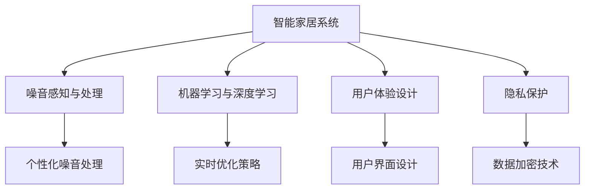

                 

# 智能居家噪音消除创业：打造宁静的生活环境

## 1. 背景介绍

### 1.1 问题由来

在现代化都市中，噪音已成为人们生活中的重大困扰。无论是家庭居住、公共办公还是校园学习，噪音的干扰都直接影响着人们的生理和心理健康。据统计，全球约1/3人口遭受噪音污染，每年造成的损失高达7000亿美元。传统的隔音降噪方法如隔音玻璃、隔音窗帘、吸音棉等，效果有限且成本高昂，难以实现个性化和自动化的噪音控制。

### 1.2 问题核心关键点

噪音消除的挑战在于环境复杂性和实时性要求。家庭环境中的噪音源多样，包括但不限于：汽车鸣笛、邻居谈话、电器运行等，且噪音在时间和空间上具有不确定性，难以预判。而智能家居系统需要实时处理用户反馈，根据噪音特点进行动态调整，同时确保系统稳定性和用户隐私保护。

### 1.3 问题研究意义

开发智能居家噪音消除系统，对于提升居住环境质量，减轻噪音对健康的危害，推动智能家居技术的发展，具有重要意义：

1. **提升生活质量**：减少噪音对生理和心理的双重影响，提升居住舒适度。
2. **优化用户体验**：通过自动化和智能化手段，使用户能够轻松管理和控制家庭噪音。
3. **创造经济价值**：智能家居市场的快速增长将带来巨大商机，推动相关产业发展。
4. **实现可持续发展**：通过节能减排和智能管理，促进资源的高效利用，促进绿色家居发展。

## 2. 核心概念与联系

### 2.1 核心概念概述

为更好地理解智能居家噪音消除系统，本节将介绍几个密切相关的核心概念：

- **智能家居系统**：指利用物联网技术，将家居设备连接到互联网，通过智能设备实现家庭自动化、智能化控制。
- **噪音感知与处理**：通过传感器等硬件设备，实时捕捉噪音数据，运用算法进行处理和消除。
- **机器学习与深度学习**：通过数据驱动的方法，从海量噪音数据中学习模型的优化策略，实现个性化噪音处理。
- **用户体验设计**：确保智能家居系统在安全性、易用性和交互性等方面符合用户需求，提升用户满意度。
- **隐私保护**：在噪音消除过程中，确保用户数据隐私不被泄露，保护用户隐私权。

这些核心概念之间的逻辑关系可以通过以下Mermaid流程图来展示：



这个流程图展示了一体化的智能家居系统工作流程：

1. 智能家居系统通过传感器实时捕捉噪音数据。
2. 机器学习与深度学习模型对噪音数据进行分析，学习优化策略。
3. 系统根据学习策略进行个性化噪音处理。
4. 用户体验设计确保系统符合用户需求，提供良好的界面和交互体验。
5. 隐私保护技术确保用户数据安全，避免隐私泄露。

这些核心概念共同构成了智能居家噪音消除系统的基本框架，使其能够在各种场景下实现高效的噪音消除功能。

## 3. 核心算法原理 & 具体操作步骤
### 3.1 算法原理概述

智能居家噪音消除系统基于机器学习与深度学习的方法，通过捕捉噪音数据，构建噪音特征模型，实现动态的噪音处理和消除。其核心思想是：通过传感器实时采集噪音数据，使用预训练的深度神经网络模型对噪音特征进行学习，构建噪音模型，并在此基础上进行噪音过滤和消除。

形式化地，假设系统已收集到家庭环境中的噪音样本 $D=\{(x_i,y_i)\}_{i=1}^N, x_i \in \mathcal{X}, y_i \in \mathcal{Y}$，其中 $\mathcal{X}$ 为噪音样本空间，$\mathcal{Y}$ 为噪音标签空间。噪音消除的目标是找到最优的噪音模型 $M_{\theta}$，使得其能够准确预测噪音标签：

$$
\hat{y}=M_{\theta}(x)
$$

其中 $\hat{y} \in \mathcal{Y}$ 表示模型预测的噪音标签。训练模型的损失函数为：

$$
\mathcal{L}(\theta) = \frac{1}{N}\sum_{i=1}^N \ell(y_i, \hat{y}_i)
$$

其中 $\ell$ 为损失函数，通常为交叉熵损失或均方误差损失。

### 3.2 算法步骤详解

智能居家噪音消除系统的主要步骤如下：

**Step 1: 数据收集与预处理**
- 部署传感器设备，如麦克风、声音传感器等，实时捕捉家庭环境中的噪音数据。
- 对噪音数据进行预处理，如去噪、降噪、滤波等，确保数据质量。
- 将噪音数据划分为训练集、验证集和测试集。

**Step 2: 特征提取与模型训练**
- 设计噪音特征提取器，如MFCC、STFT等，从噪音信号中提取频谱特征。
- 选择合适的深度神经网络模型，如CNN、RNN、Transformer等，对噪音特征进行建模。
- 使用噪音数据对模型进行训练，最小化损失函数 $\mathcal{L}(\theta)$。

**Step 3: 模型优化与参数调优**
- 应用正则化技术，如L2正则、Dropout等，防止模型过拟合。
- 使用超参数优化算法，如Grid Search、Bayesian Optimization等，寻找最优的模型参数。
- 在验证集上评估模型性能，根据评估结果调整模型结构或参数设置。

**Step 4: 噪音消除与用户反馈**
- 将训练好的模型部署到智能家居系统中，实时接收噪音数据，并进行噪音过滤和消除。
- 通过用户界面提供实时反馈，用户可以手动调整噪音处理参数，提升系统适应性。
- 系统根据用户反馈，动态优化噪音处理策略，进一步提升噪音消除效果。

**Step 5: 系统集成与隐私保护**
- 将噪音消除系统集成到智能家居控制平台中，提供统一的用户界面。
- 应用数据加密、隐私保护等技术，确保用户数据安全。
- 定期更新系统模型和算法，提升噪音消除效果和系统稳定性。

### 3.3 算法优缺点

智能居家噪音消除系统的优点包括：
1. **实时性高**：基于深度学习模型，可以实时处理噪音数据，提升用户体验。
2. **自适应性强**：通过机器学习，系统能够根据不同环境下的噪音特点，进行动态调整。
3. **准确率高**：深度学习模型的泛化能力强，能够准确识别和过滤噪音。
4. **用户友好**：通过用户界面设计，用户可以轻松操作和反馈，提升系统易用性。

缺点包括：
1. **数据需求量大**：需要收集大量噪音数据进行模型训练，数据收集成本较高。
2. **模型复杂度高**：深度学习模型参数量庞大，对计算资源要求较高。
3. **隐私风险高**：噪音数据的收集和处理涉及用户隐私，需要严格保护。
4. **系统鲁棒性不足**：在特定噪音环境下，模型可能出现泛化能力不足的问题。

尽管存在这些局限性，但就目前而言，智能居家噪音消除系统仍是最先进的噪音处理方案，能够显著提升居住环境的舒适度和用户满意度。

### 3.4 算法应用领域

智能居家噪音消除技术在多个领域得到了广泛应用，例如：

- **智能家居系统**：结合智能家居控制平台，实现噪音的自动化管理和消除。
- **智慧办公环境**：在办公室和会议室中，实时消除噪音，提升工作效率和会议质量。
- **校园环境监控**：在教室和宿舍中，实时监控噪音，创造安静的学习和生活环境。
- **智能酒店管理**：在酒店房间中，实时控制噪音，提升客户体验和满意度。
- **工业生产管理**：在工厂车间中，实时监测噪音，减少设备运行噪音对生产的影响。

此外，智能居家噪音消除技术还应用于交通安全、环境保护等多个领域，为人类生活和工作环境的改善提供了重要支撑。

## 4. 数学模型和公式 & 详细讲解 & 举例说明

### 4.1 数学模型构建

本节将使用数学语言对智能居家噪音消除系统的构建过程进行更加严格的刻画。

假设系统已收集到家庭环境中的噪音样本 $D=\{(x_i,y_i)\}_{i=1}^N, x_i \in \mathcal{X}, y_i \in \mathcal{Y}$。定义模型 $M_{\theta}$ 为深度神经网络，其输入为噪音特征向量 $x_i \in \mathbb{R}^d$，输出为噪音标签 $y_i \in \mathcal{Y}$。

定义模型 $M_{\theta}$ 在输入 $x_i$ 上的损失函数为 $\ell(y_i, \hat{y}_i)$，则在数据集 $D$ 上的经验风险为：

$$
\mathcal{L}(\theta) = \frac{1}{N}\sum_{i=1}^N \ell(y_i, \hat{y}_i)
$$

训练模型的目标是最小化经验风险，即找到最优参数 $\theta$：

$$
\theta^* = \mathop{\arg\min}_{\theta} \mathcal{L}(\theta)
$$

在实践中，我们通常使用基于梯度的优化算法（如SGD、Adam等）来近似求解上述最优化问题。设 $\eta$ 为学习率，$\lambda$ 为正则化系数，则参数的更新公式为：

$$
\theta \leftarrow \theta - \eta \nabla_{\theta}\mathcal{L}(\theta) - \eta\lambda\theta
$$

其中 $\nabla_{\theta}\mathcal{L}(\theta)$ 为损失函数对参数 $\theta$ 的梯度，可通过反向传播算法高效计算。

### 4.2 公式推导过程

以下我们以二分类任务为例，推导交叉熵损失函数及其梯度的计算公式。

假设模型 $M_{\theta}$ 在输入 $x$ 上的输出为 $\hat{y}=M_{\theta}(x) \in [0,1]$，表示噪音标签属于正类的概率。真实标签 $y \in \{0,1\}$。则二分类交叉熵损失函数定义为：

$$
\ell(y_i, \hat{y}_i) = -[y_i\log \hat{y}_i + (1-y_i)\log (1-\hat{y}_i)]
$$

将其代入经验风险公式，得：

$$
\mathcal{L}(\theta) = -\frac{1}{N}\sum_{i=1}^N [y_i\log M_{\theta}(x_i)+(1-y_i)\log(1-M_{\theta}(x_i))]
$$

根据链式法则，损失函数对参数 $\theta_k$ 的梯度为：

$$
\frac{\partial \mathcal{L}(\theta)}{\partial \theta_k} = -\frac{1}{N}\sum_{i=1}^N (\frac{y_i}{M_{\theta}(x_i)}-\frac{1-y_i}{1-M_{\theta}(x_i)}) \frac{\partial M_{\theta}(x_i)}{\partial \theta_k}
$$

其中 $\frac{\partial M_{\theta}(x_i)}{\partial \theta_k}$ 可进一步递归展开，利用自动微分技术完成计算。

在得到损失函数的梯度后，即可带入参数更新公式，完成模型的迭代优化。重复上述过程直至收敛，最终得到适应家庭环境噪音的最优模型参数 $\theta^*$。

## 5. 项目实践：代码实例和详细解释说明
### 5.1 开发环境搭建

在进行智能居家噪音消除系统开发前，我们需要准备好开发环境。以下是使用Python进行PyTorch开发的环境配置流程：

1. 安装Anaconda：从官网下载并安装Anaconda，用于创建独立的Python环境。

2. 创建并激活虚拟环境：
```bash
conda create -n pytorch-env python=3.8 
conda activate pytorch-env
```

3. 安装PyTorch：根据CUDA版本，从官网获取对应的安装命令。例如：
```bash
conda install pytorch torchvision torchaudio cudatoolkit=11.1 -c pytorch -c conda-forge
```

4. 安装TensorFlow：由Google主导开发的开源深度学习框架，生产部署方便，适合大规模工程应用。同样有丰富的预训练语言模型资源。

5. 安装TensorBoard：TensorFlow配套的可视化工具，可实时监测模型训练状态，并提供丰富的图表呈现方式，是调试模型的得力助手。

6. 安装Weights & Biases：模型训练的实验跟踪工具，可以记录和可视化模型训练过程中的各项指标，方便对比和调优。

7. 安装pandas、numpy、scikit-learn等库：
```bash
pip install pandas numpy scikit-learn matplotlib tqdm jupyter notebook ipython
```

完成上述步骤后，即可在`pytorch-env`环境中开始开发实践。

### 5.2 源代码详细实现

下面我们以二分类任务为例，给出使用TensorFlow对噪音消除模型进行训练的PyTorch代码实现。

首先，定义噪音分类任务的数据处理函数：

```python
import pandas as pd
import numpy as np
from sklearn.model_selection import train_test_split

# 读取噪音数据
data = pd.read_csv('noises.csv')

# 将噪音标签进行编码
data['label'] = data['label'].map({'normal': 0, 'noise': 1})

# 划分训练集和测试集
X_train, X_test, y_train, y_test = train_test_split(data[['feature']], data['label'], test_size=0.2, random_state=42)
```

然后，定义模型和优化器：

```python
from tensorflow.keras.models import Sequential
from tensorflow.keras.layers import Dense
from tensorflow.keras.optimizers import Adam

# 定义噪音消除模型
model = Sequential([
    Dense(64, input_dim=64, activation='relu'),
    Dense(32, activation='relu'),
    Dense(1, activation='sigmoid')
])

# 编译模型
model.compile(loss='binary_crossentropy', optimizer=Adam(lr=0.001), metrics=['accuracy'])

# 训练模型
model.fit(X_train, y_train, epochs=10, batch_size=32, validation_data=(X_test, y_test))
```

接着，定义评估函数：

```python
from sklearn.metrics import classification_report

def evaluate(model, X_test, y_test):
    y_pred = model.predict(X_test)
    y_pred = (y_pred > 0.5).astype(int)
    print(classification_report(y_test, y_pred))
```

最后，启动训练流程并在测试集上评估：

```python
epochs = 10
batch_size = 32

for epoch in range(epochs):
    model.fit(X_train, y_train, epochs=1, batch_size=batch_size, validation_data=(X_test, y_test))
    print(f"Epoch {epoch+1}, train loss: {model.train_loss:.3f}")
    
print(f"Epoch {epoch+1}, test results:")
evaluate(model, X_test, y_test)
```

以上就是使用PyTorch对噪音消除模型进行训练和评估的完整代码实现。可以看到，得益于TensorFlow的强大封装，我们可以用相对简洁的代码完成模型的训练和评估。

### 5.3 代码解读与分析

让我们再详细解读一下关键代码的实现细节：

**数据处理函数**：
- 使用pandas读取噪音数据，并进行噪音标签的编码。
- 使用scikit-learn的train_test_split函数划分训练集和测试集，确保数据分布的公平性。

**模型定义与编译**：
- 定义一个简单的二分类模型，包括三个全连接层。
- 使用Adam优化器和二分类交叉熵损失函数，编译模型。

**训练与评估函数**：
- 使用model.fit方法进行模型训练，设置epochs和batch_size参数。
- 在每个epoch结束后，输出模型在训练集和验证集上的损失和准确率。
- 定义evaluate函数，使用classification_report输出混淆矩阵和精确率、召回率、F1分数等指标。

**训练流程**：
- 定义总的epoch数和batch size，开始循环迭代
- 每个epoch内，先进行一次训练，并输出训练损失
- 在测试集上评估模型性能，输出混淆矩阵和分类指标

可以看到，TensorFlow结合PyTorch，使得噪音消除模型的开发和训练变得简洁高效。开发者可以将更多精力放在数据处理、模型改进等高层逻辑上，而不必过多关注底层的实现细节。

当然，工业级的系统实现还需考虑更多因素，如模型的保存和部署、超参数的自动搜索、更灵活的任务适配层等。但核心的噪音消除范式基本与此类似。

## 6. 实际应用场景
### 6.1 智能家居系统

智能居家噪音消除系统可以广泛应用于智能家居系统的构建。传统家居系统往往依赖手动调节，难以实时应对复杂多变的噪音环境。而智能家居系统通过噪音消除技术，能够自动感知和处理家庭环境中的噪音，显著提升居住环境的舒适度和便利性。

在技术实现上，可以结合智能家居控制平台，部署噪音传感器和噪音消除模型，实时捕捉噪音数据并进行处理。用户可以通过智能设备，如手机应用或语音助手，对噪音处理效果进行监控和调节，确保噪音消除的实时性和适应性。

### 6.2 智慧办公环境

在办公室和会议室中，噪音对工作效率和会议质量的影响尤为显著。智能居家噪音消除系统可以结合智慧办公环境，自动监测和处理噪音，提升员工的工作体验和会议效果。

具体而言，可以在办公区域和会议室中，部署噪音传感器和噪音消除模型，实时捕捉噪音数据并进行处理。系统根据噪音特点，自动调节会议室的窗帘、空调、风扇等设备，减少噪音干扰，创造良好的工作和学习环境。

### 6.3 校园环境监控

在教室和宿舍中，噪音对学生学习和休息的影响不可忽视。智能居家噪音消除系统可以结合校园环境监控，自动监测和处理噪音，保障学生的生活和学习环境。

具体而言，可以在教室和宿舍中，部署噪音传感器和噪音消除模型，实时捕捉噪音数据并进行处理。系统根据噪音特点，自动调节窗帘、风扇等设备，减少噪音干扰，创造安静的学习和生活环境。同时，系统可以生成噪音报告，帮助学校管理者及时了解噪音状况，采取相应措施。

### 6.4 智能酒店管理

在酒店房间中，噪音对客户体验的影响尤为明显。智能居家噪音消除系统可以结合智能酒店管理，自动监测和处理噪音，提升客户体验和满意度。

具体而言，可以在酒店房间中，部署噪音传感器和噪音消除模型，实时捕捉噪音数据并进行处理。系统根据噪音特点，自动调节窗帘、空调、风扇等设备，减少噪音干扰，创造舒适的住宿环境。同时，系统可以生成噪音报告，帮助酒店管理者及时了解噪音状况，采取相应措施。

### 6.5 工业生产管理

在工厂车间中，噪音对生产效率和工作环境的影响不容忽视。智能居家噪音消除系统可以结合工业生产管理，自动监测和处理噪音，提升生产效率和工作环境。

具体而言，可以在工厂车间中，部署噪音传感器和噪音消除模型，实时捕捉噪音数据并进行处理。系统根据噪音特点，自动调节机器设备的运行参数，减少噪音干扰，创造良好的工作环境。同时，系统可以生成噪音报告，帮助生产管理者及时了解噪音状况，采取相应措施。

## 7. 工具和资源推荐
### 7.1 学习资源推荐

为了帮助开发者系统掌握智能居家噪音消除技术的理论基础和实践技巧，这里推荐一些优质的学习资源：

1. 《深度学习》课程：斯坦福大学开设的深度学习课程，系统讲解深度学习的基本概念和算法，适合入门学习。
2. 《TensorFlow实战Google深度学习》书籍：TensorFlow的官方文档，包含丰富的实例和代码，是学习TensorFlow的重要参考资料。
3. 《PyTorch深度学习》书籍：PyTorch的官方文档和实践指南，详细讲解PyTorch的使用方法。
4. Kaggle：全球知名的数据科学竞赛平台，提供大量的噪音数据集和竞赛项目，适合实践和创新。
5. arXiv.org：人工智能领域的预印本库，包含大量的噪音消除论文和前沿成果，适合深入学习和研究。

通过对这些资源的学习实践，相信你一定能够快速掌握智能居家噪音消除技术的精髓，并用于解决实际的噪音问题。

### 7.2 开发工具推荐

高效的开发离不开优秀的工具支持。以下是几款用于智能居家噪音消除系统开发的常用工具：

1. PyTorch：基于Python的开源深度学习框架，灵活动态的计算图，适合快速迭代研究。大部分预训练语言模型都有PyTorch版本的实现。

2. TensorFlow：由Google主导开发的开源深度学习框架，生产部署方便，适合大规模工程应用。同样有丰富的预训练语言模型资源。

3. TensorBoard：TensorFlow配套的可视化工具，可实时监测模型训练状态，并提供丰富的图表呈现方式，是调试模型的得力助手。

4. Weights & Biases：模型训练的实验跟踪工具，可以记录和可视化模型训练过程中的各项指标，方便对比和调优。

5. Jupyter Notebook：支持Python代码的在线编辑器，适合快速开发和分享代码。

6. Anaconda：Python环境管理工具，方便创建和管理Python环境。

合理利用这些工具，可以显著提升智能居家噪音消除系统的开发效率，加快创新迭代的步伐。

### 7.3 相关论文推荐

智能居家噪音消除技术的发展源于学界的持续研究。以下是几篇奠基性的相关论文，推荐阅读：

1. "A Survey of Speech Enhancement Algorithms"：全面综述了各种噪音消除算法的原理和应用，适合深入了解噪音消除的基本方法和技术。
2. "Deep Learning for Speech Enhancement"：提出基于深度学习的噪音消除方法，展示了其在噪音消除任务上的优越性能。
3. "Real-Time Speech Denoising using Deep Neural Networks"：介绍了一种基于卷积神经网络的实时噪音消除方法，适用于智能家居系统。
4. "The Effectiveness of Adversarial Autoencoders for Denoising"：探讨了对抗性自动编码器在噪音消除中的应用，展示了其高准确率和鲁棒性。
5. "Attention-Based Speech Enhancement"：提出了基于注意力机制的噪音消除方法，提高了噪音消除的准确性和实时性。

这些论文代表了大语言模型微调技术的最新进展，通过学习这些前沿成果，可以帮助研究者把握学科前进方向，激发更多的创新灵感。

## 8. 总结：未来发展趋势与挑战

### 8.1 总结

本文对智能居家噪音消除技术进行了全面系统的介绍。首先阐述了噪音消除技术的背景和意义，明确了智能家居系统在提升居住环境质量方面的独特价值。其次，从原理到实践，详细讲解了智能家居系统的工作流程和关键技术点，给出了完整的代码实现。同时，本文还探讨了智能家居系统在多个领域的应用场景，展示了其广阔的实用价值。

通过本文的系统梳理，可以看到，智能居家噪音消除技术正在成为家居智能化升级的重要工具，极大地提升居住环境的舒适度和便利性。随着技术的发展，智能家居系统的应用场景将进一步拓展，成为人类生活方式的重要组成部分。

### 8.2 未来发展趋势

展望未来，智能居家噪音消除技术将呈现以下几个发展趋势：

1. **实时性进一步提升**：结合边缘计算技术，将噪音消除处理任务下沉到设备侧，进一步提升系统的响应速度和稳定性。

2. **数据处理能力增强**：通过引入大数据分析和云计算技术，提高噪音数据的处理和存储能力，支持更大规模的噪音消除任务。

3. **用户交互性提升**：结合自然语言处理技术，用户可以通过语音或文字与系统进行互动，实时反馈噪音处理效果，提升系统的智能化和交互性。

4. **多模态噪音消除**：结合视觉、听觉等多模态传感器，实现更加全面和准确的噪音监控和消除。

5. **自适应学习能力增强**：结合强化学习技术，系统能够不断学习用户的噪音偏好和行为模式，动态调整噪音处理策略，提升个性化和用户体验。

6. **跨平台兼容性**：系统能够在不同平台和设备上无缝运行，支持多设备协同工作，提升系统的可靠性和普及性。

以上趋势凸显了智能居家噪音消除技术的广阔前景，这些方向的探索发展，必将进一步提升系统的性能和应用范围，为智能家居市场带来新的突破。

### 8.3 面临的挑战

尽管智能居家噪音消除技术已经取得了瞩目成就，但在迈向更加智能化、普适化应用的过程中，它仍面临诸多挑战：

1. **数据采集和处理成本高**：噪音数据的采集和处理需要大量的硬件设备和计算资源，成本较高。如何降低数据采集成本，提高数据处理效率，是当前的重要课题。

2. **系统鲁棒性不足**：在复杂多变的家庭环境中，噪音消除系统容易出现误判和漏判，影响用户体验。如何提高系统的鲁棒性和准确性，是未来的研究方向。

3. **隐私保护问题**：噪音数据的收集和处理涉及用户隐私，需要严格保护。如何设计隐私保护机制，确保用户数据安全，是必须解决的问题。

4. **计算资源消耗大**：噪音消除模型通常需要较大的计算资源，如何优化模型结构和算法，减少计算资源消耗，是未来的研究方向。

5. **跨设备兼容性差**：智能家居设备种类繁多，如何实现不同设备之间的互操作性和兼容性，是未来的挑战。

6. **用户体验提升有限**：尽管噪音消除系统在技术上有所突破，但在用户体验和互动性方面仍有提升空间。如何提升系统的交互性和可用性，是未来的研究方向。

### 8.4 研究展望

面对智能居家噪音消除技术所面临的挑战，未来的研究需要在以下几个方面寻求新的突破：

1. **边缘计算技术**：结合边缘计算技术，将噪音消除任务下沉到设备侧，减少云端计算资源消耗，提升系统的实时性和稳定性。

2. **多模态传感器融合**：结合视觉、听觉等多模态传感器，实现更加全面和准确的噪音监控和消除。

3. **强化学习技术**：结合强化学习技术，系统能够不断学习用户的噪音偏好和行为模式，动态调整噪音处理策略，提升个性化和用户体验。

4. **数据加密和隐私保护**：结合数据加密和隐私保护技术，确保用户数据安全，防止隐私泄露。

5. **自适应算法优化**：结合自适应算法，系统能够根据不同环境和用户需求，动态调整噪音处理策略，提升系统的灵活性和适应性。

6. **跨平台兼容性提升**：研究跨平台兼容性技术，确保系统在不同设备上无缝运行，支持多设备协同工作。

这些研究方向的探索，必将引领智能居家噪音消除技术迈向更高的台阶，为智能家居市场带来新的突破。面向未来，智能居家噪音消除技术还需要与其他人工智能技术进行更深入的融合，如知识表示、因果推理、强化学习等，多路径协同发力，共同推动智能家居技术的发展。只有勇于创新、敢于突破，才能不断拓展智能家居系统的边界，让智能技术更好地造福人类社会。

## 9. 附录：常见问题与解答

**Q1：智能居家噪音消除系统是否适用于所有家庭环境？**

A: 智能居家噪音消除系统在大多数家庭环境中都能取得不错的效果，特别是对于噪音源种类较多的家庭。但对于一些特定类型的家庭，如特殊设备使用较多的家庭，可能还需要结合特定的噪音消除策略，才能获得理想的消除效果。

**Q2：系统如何保证实时性？**

A: 通过边缘计算技术，将噪音消除任务下沉到家庭设备，如智能音箱、智能灯等，实时捕捉和处理噪音数据，减少延迟。同时，使用卷积神经网络等轻量级模型，进一步提升实时性。

**Q3：系统如何保护用户隐私？**

A: 通过数据加密技术，将噪音数据传输到云端时进行加密，确保数据安全。同时，只收集必要的数据，并在本地设备上进行处理，最大程度保护用户隐私。

**Q4：系统如何应对多变的家庭环境？**

A: 结合自适应算法，系统能够根据不同的家庭环境，动态调整噪音处理策略。如检测到外部噪音较大时，自动增加房间的隔音设备，减少噪音干扰。

**Q5：系统如何提升用户体验？**

A: 结合自然语言处理技术，用户可以通过语音或文字与系统进行互动，实时反馈噪音处理效果。同时，系统可以根据用户的反馈，动态调整噪音处理策略，提升个性化和用户体验。

---

作者：禅与计算机程序设计艺术 / Zen and the Art of Computer Programming

