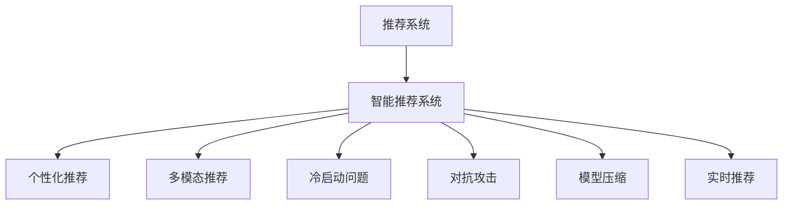

                 

## 1. 背景介绍

在数字时代，信息爆炸已成为不争的事实。面对海量的数据，人们获取有价值知识的方式变得前所未有的重要。在诸多获取知识的方法中，智能推荐系统作为一种个性化的信息获取方式，因其高效、便捷、精准的特性，迅速成为人们获取知识的主要途径之一。

推荐系统（Recommender System）是基于用户行为数据，为每个用户推荐其可能感兴趣物品的系统。从电影推荐到商品推荐，再到新闻推荐，智能推荐系统已经被广泛应用于各种领域。而随着人工智能技术的发展，推荐系统已经逐步向智能推荐系统（Intelligent Recommender System）转变，通过深度学习、自然语言处理等技术，提升推荐系统的性能。

智能推荐系统能够通过对用户历史行为数据的分析，预测用户未来可能感兴趣的内容，从而为用户推荐个性化的信息。相较于传统的基于规则、协同过滤等推荐算法，智能推荐系统更加高效、灵活、精确。目前，智能推荐系统已经成为人工智能技术在实际应用中最为成功的例证之一。

## 2. 核心概念与联系

### 2.1 核心概念概述

为了更好地理解智能推荐系统，我们先概述一些核心的概念和其联系。

- **推荐系统（Recommender System）**：通过用户历史行为数据，为用户推荐其可能感兴趣物品的系统。通常包括基于协同过滤、基于内容的推荐等算法。
- **智能推荐系统（Intelligent Recommender System）**：结合深度学习、自然语言处理等技术，提升推荐系统的性能。能够更加高效、灵活地处理和推荐信息。
- **个性化推荐（Personalized Recommendation）**：根据用户的个性化需求，推荐最合适的物品。通常利用用户画像、行为数据、兴趣模型等进行推荐。
- **多模态推荐（Multi-modal Recommendation）**：结合视觉、听觉、文本等多种数据模态，提升推荐系统的准确性和多样性。
- **冷启动问题（Cold Start Problem）**：新用户或物品加入系统后，由于缺少历史数据，难以进行有效推荐。
- **对抗攻击（Adversarial Attack）**：一些用户可能通过提供虚假信息干扰推荐系统，影响推荐效果。
- **模型压缩（Model Compression）**：由于深度学习模型的参数量较大，需要压缩模型以降低计算资源消耗，同时提升推理速度。
- **实时推荐（Real-time Recommendation）**：根据用户实时行为数据，动态生成推荐结果，提升推荐的时效性和精准性。

这些概念之间的联系可以通过以下Mermaid流程图来展示：



这个流程图展示出智能推荐系统与推荐系统、个性化推荐、多模态推荐等概念之间的逻辑关系：

1. 智能推荐系统通过深度学习等技术提升了推荐系统的性能，使其更加智能和高效。
2. 个性化推荐、多模态推荐等技术是智能推荐系统的重要组成部分，用于提升推荐的效果。
3. 冷启动问题、对抗攻击等问题是智能推荐系统面临的主要挑战，需要通过改进算法和模型来解决。
4. 模型压缩、实时推荐等技术则是智能推荐系统的重要优化手段，用于提升系统的效率和性能。

## 3. 核心算法原理 & 具体操作步骤

### 3.1 算法原理概述

智能推荐系统的核心算法通常基于深度学习，主要包括基于协同过滤的推荐算法和基于内容的推荐算法。基于协同过滤的推荐算法通过分析用户历史行为数据，寻找相似用户或物品进行推荐。而基于内容的推荐算法则直接从物品的属性（如标签、描述等）出发，对用户进行推荐。

智能推荐系统的具体实现分为以下几个步骤：

1. **数据预处理**：对原始数据进行清洗、特征工程，构建用户行为数据矩阵。
2. **用户画像构建**：通过深度学习模型，构建用户画像，获取用户兴趣和行为模式。
3. **物品表示学习**：通过深度学习模型，学习物品的特征表示，为推荐算法提供输入。
4. **推荐算法实现**：根据用户画像和物品表示，使用推荐算法生成推荐结果。
5. **模型优化与评估**：利用损失函数优化模型参数，通过评估指标（如精度、召回率等）评估模型效果。

### 3.2 算法步骤详解

**Step 1: 数据预处理**

数据预处理是智能推荐系统的重要环节，主要包括以下步骤：

- **数据收集**：从网站、社交媒体、电商等平台收集用户行为数据，包括浏览、购买、评分等行为。
- **数据清洗**：去除缺失、异常、重复的数据，确保数据质量。
- **特征工程**：将原始数据转化为模型可处理的格式，如将文本转化为词向量、对评分进行标准化等。
- **数据划分**：将数据划分为训练集、验证集和测试集，供模型训练、调参和评估使用。

**Step 2: 用户画像构建**

用户画像的构建是智能推荐系统的核心，主要利用深度学习模型，通过用户历史行为数据学习用户兴趣和行为模式。常用的深度学习模型包括协同过滤、基于内容的推荐、深度学习等。

- **协同过滤**：通过计算用户与用户之间的相似度，或者物品与物品之间的相似度，找到用户可能感兴趣的物品。
- **基于内容的推荐**：通过分析物品的属性（如标签、描述等），对用户进行推荐。
- **深度学习模型**：利用深度神经网络模型，如CNN、RNN、LSTM等，对用户行为数据进行建模，获取用户兴趣和行为模式。

**Step 3: 物品表示学习**

物品表示学习是智能推荐系统的重要组成部分，通过深度学习模型，学习物品的特征表示，为推荐算法提供输入。常用的深度学习模型包括词嵌入模型、卷积神经网络（CNN）、循环神经网络（RNN）等。

- **词嵌入模型**：如Word2Vec、GloVe等，将文本转化为高维向量表示，捕捉文本的语义信息。
- **卷积神经网络（CNN）**：利用卷积操作捕捉图像、文本等数据的空间局部特征。
- **循环神经网络（RNN）**：利用递归神经网络，捕捉序列数据的长期依赖关系。

**Step 4: 推荐算法实现**

推荐算法的实现是智能推荐系统的关键，常用的推荐算法包括基于矩阵分解的推荐算法、基于深度学习的推荐算法等。

- **基于矩阵分解的推荐算法**：如SVD、ALS等，通过分解用户行为矩阵，预测用户对未评分物品的评分。
- **基于深度学习的推荐算法**：如DeepFM、Wide & Deep等，通过组合浅层模型和深层模型的优势，提升推荐效果。

**Step 5: 模型优化与评估**

模型优化与评估是智能推荐系统的最后一步，通过优化模型参数，使用评估指标（如精度、召回率、F1-score等）评估模型效果。常用的优化方法包括梯度下降、Adam等，常用的评估指标包括均方误差、交叉熵等。

### 3.3 算法优缺点

智能推荐系统的优点包括：

1. **高效性**：通过深度学习等技术，能够高效处理和推荐信息。
2. **个性化推荐**：能够根据用户历史行为数据，进行个性化推荐，提升用户满意度。
3. **多样化推荐**：能够结合多模态数据，提升推荐结果的多样性和准确性。
4. **实时性**：通过实时数据采集和处理，动态生成推荐结果，提升推荐的时效性。

同时，智能推荐系统也存在一些缺点：

1. **数据依赖**：推荐系统依赖于用户历史行为数据，难以处理新用户或新物品。
2. **冷启动问题**：新用户或新物品加入系统后，难以进行有效推荐。
3. **对抗攻击**：一些用户可能通过提供虚假信息干扰推荐系统，影响推荐效果。
4. **隐私问题**：收集用户行为数据可能涉及隐私问题，需要采取一定的隐私保护措施。

### 3.4 算法应用领域

智能推荐系统在多个领域得到了广泛的应用，例如：

- **电商推荐**：通过分析用户浏览、购买等行为，为用户推荐商品。
- **视频推荐**：根据用户观看历史，推荐相关视频内容。
- **音乐推荐**：根据用户听歌历史，推荐类似音乐。
- **新闻推荐**：根据用户阅读历史，推荐相关新闻。
- **图书推荐**：根据用户阅读历史，推荐相关图书。
- **社交网络推荐**：根据用户好友关系和行为数据，推荐相关内容。

这些应用领域展示了智能推荐系统在实际应用中的广泛性。智能推荐系统已经成为用户获取信息的主要途径之一，为用户带来更加个性化、便捷的信息获取体验。

## 4. 数学模型和公式 & 详细讲解 & 举例说明

### 4.1 数学模型构建

智能推荐系统的数学模型主要包括以下几个组成部分：

- **用户行为矩阵**：表示用户与物品之间的交互关系，通常使用稀疏矩阵表示。
- **用户画像**：通过深度学习模型，学习用户兴趣和行为模式。
- **物品表示**：通过深度学习模型，学习物品的特征表示。
- **推荐函数**：根据用户画像和物品表示，生成推荐结果。

以矩阵分解模型为例，假设用户行为矩阵为 $U \in \mathbb{R}^{N \times M}$，其中 $N$ 表示用户数，$M$ 表示物品数。用户行为矩阵中的每个元素 $u_{ij}$ 表示用户 $i$ 对物品 $j$ 的评分。用户画像 $P_i \in \mathbb{R}^{D}$ 和物品表示 $Q_j \in \mathbb{R}^{D}$ 分别表示用户和物品的特征向量，$D$ 表示特征向量的维度。推荐函数 $F$ 通过矩阵分解模型，将用户行为矩阵分解为用户画像和物品表示的乘积：

$$
\hat{u}_{ij} = \sum_{k=1}^{D} P_{ik}Q_{kj}
$$

其中 $\hat{u}_{ij}$ 表示用户 $i$ 对物品 $j$ 的预测评分。

### 4.2 公式推导过程

以矩阵分解模型为例，我们推导推荐函数的具体形式。

根据上述公式，推荐函数 $F$ 可以表示为：

$$
F(U,P,Q) = \text{argmax}_i \text{argmax}_j \sum_{k=1}^{D} P_{ik}Q_{kj}
$$

令 $\hat{u}_{ij} = \sum_{k=1}^{D} P_{ik}Q_{kj}$，则推荐函数 $F$ 可以表示为：

$$
F(U,P,Q) = \text{argmax}_i \text{argmax}_j \hat{u}_{ij}
$$

在实际应用中，我们需要通过深度学习模型来学习用户画像 $P_i$ 和物品表示 $Q_j$，以优化推荐函数 $F$。常用的深度学习模型包括协同过滤、基于内容的推荐、深度学习等。

### 4.3 案例分析与讲解

**案例1: 协同过滤推荐算法**

协同过滤推荐算法是常用的推荐算法之一，主要通过计算用户与用户之间的相似度，或者物品与物品之间的相似度，进行推荐。

假设用户 $i$ 和 $j$ 对物品 $k$ 的评分分别为 $u_{ik}$ 和 $u_{jk}$，则协同过滤推荐算法可以通过计算用户与用户之间的相似度进行推荐：

$$
sim(i,j) = \frac{\sum_{k=1}^{M} (u_{ik} - \bar{u}_i)(u_{jk} - \bar{u}_j)}{\sqrt{\sum_{k=1}^{M} (u_{ik} - \bar{u}_i)^2 \sum_{k=1}^{M} (u_{jk} - \bar{u}_j)^2}}
$$

其中 $\bar{u}_i$ 和 $\bar{u}_j$ 分别表示用户 $i$ 和 $j$ 的平均评分。协同过滤推荐算法可以表示为：

$$
r_{i,j} = \sum_{k=1}^{M} \hat{u}_{ik} \hat{u}_{jk} / \sqrt{\sum_{k=1}^{M} \hat{u}_{ik}^2 \sum_{k=1}^{M} \hat{u}_{jk}^2}
$$

其中 $r_{i,j}$ 表示用户 $i$ 对物品 $j$ 的推荐评分，$\hat{u}_{ik}$ 和 $\hat{u}_{jk}$ 分别表示用户 $i$ 和 $j$ 对物品 $k$ 的预测评分。

**案例2: 深度学习推荐算法**

深度学习推荐算法通过深度神经网络模型，对用户行为数据进行建模，生成推荐结果。常用的深度学习模型包括DeepFM、Wide & Deep等。

以DeepFM模型为例，DeepFM模型将用户行为数据分解为浅层模型和深层模型的组合，分别用于捕捉用户行为数据中的浅层和深层特征。浅层模型通常包括逻辑回归、线性回归等线性模型，深层模型通常包括卷积神经网络（CNN）和循环神经网络（RNN）等深度学习模型。

假设用户行为矩阵为 $U \in \mathbb{R}^{N \times M}$，用户行为特征为 $X \in \mathbb{R}^{N \times F}$，物品特征为 $Y \in \mathbb{R}^{M \times F}$，其中 $N$ 表示用户数，$M$ 表示物品数，$F$ 表示特征向量的维度。

浅层模型的损失函数为：

$$
L_{\text{linear}} = -\frac{1}{N} \sum_{i=1}^{N} \sum_{j=1}^{M} \left(y_{ij} - \sum_{k=1}^{F} \theta_{ik} x_{ij} - \sum_{k=1}^{F} \theta_{jk} y_{jk} + \sum_{k=1}^{F} \theta_{ikjk} x_{ij} y_{jk} \right)
$$

其中 $y_{ij}$ 表示用户 $i$ 对物品 $j$ 的评分，$x_{ij}$ 表示用户 $i$ 的行为特征，$y_{jk}$ 表示物品 $j$ 的特征，$\theta_{ik}$、$\theta_{jk}$ 和 $\theta_{ikjk}$ 表示浅层模型的权重。

深层模型的损失函数为：

$$
L_{\text{deep}} = -\frac{1}{N} \sum_{i=1}^{N} \sum_{j=1}^{M} \left(y_{ij} - \hat{u}_{ij} \right)^2
$$

其中 $\hat{u}_{ij}$ 表示用户 $i$ 对物品 $j$ 的预测评分，$y_{ij}$ 表示用户 $i$ 对物品 $j$ 的评分。

### 4.4 举例说明

我们以电商推荐系统为例，具体说明智能推荐系统的数学模型和公式推导过程。

假设某电商平台有 $N$ 个用户和 $M$ 个商品，用户对商品的评分矩阵为 $U \in \mathbb{R}^{N \times M}$，用户行为特征矩阵为 $X \in \mathbb{R}^{N \times F}$，商品特征矩阵为 $Y \in \mathbb{R}^{M \times F}$。假设用户 $i$ 对商品 $j$ 的评分 $y_{ij}$ 为 $u_{ij}$，用户 $i$ 的行为特征 $x_{ij}$ 为 $P_i$，商品 $j$ 的特征 $y_{jk}$ 为 $Q_j$。

假设我们采用DeepFM模型进行电商推荐，则推荐函数 $F$ 可以表示为：

$$
F(U,P,Q) = \text{argmax}_i \text{argmax}_j \left( \sum_{k=1}^{F} \theta_{ikjk} P_{ik}Q_{kj} + \sum_{k=1}^{F} \theta_{ik} x_{ik} + \sum_{k=1}^{F} \theta_{jk} y_{jk} \right)
$$

其中 $P_i$ 和 $Q_j$ 分别表示用户和商品的特征向量，$\theta_{ikjk}$、$\theta_{ik}$ 和 $\theta_{jk}$ 分别表示DeepFM模型的权重。

在实际应用中，我们需要通过深度学习模型来学习用户画像 $P_i$ 和物品表示 $Q_j$，以优化推荐函数 $F$。通常使用协同过滤、基于内容的推荐、深度学习等算法进行推荐。

## 5. 项目实践：代码实例和详细解释说明

### 5.1 开发环境搭建

在进行智能推荐系统项目实践前，我们需要准备好开发环境。以下是使用Python进行PyTorch开发的环境配置流程：

1. 安装Anaconda：从官网下载并安装Anaconda，用于创建独立的Python环境。

2. 创建并激活虚拟环境：
```bash
conda create -n pytorch-env python=3.8 
conda activate pytorch-env
```

3. 安装PyTorch：根据CUDA版本，从官网获取对应的安装命令。例如：
```bash
conda install pytorch torchvision torchaudio cudatoolkit=11.1 -c pytorch -c conda-forge
```

4. 安装TensorFlow：
```bash
pip install tensorflow
```

5. 安装Keras：
```bash
pip install keras
```

6. 安装Scikit-learn：
```bash
pip install scikit-learn
```

完成上述步骤后，即可在`pytorch-env`环境中开始智能推荐系统项目的开发。

### 5.2 源代码详细实现

我们先以电商推荐系统为例，给出使用PyTorch实现智能推荐系统的完整代码。

首先，定义电商推荐系统的数据预处理函数：

```python
import pandas as pd
from sklearn.model_selection import train_test_split
from tensorflow.keras.preprocessing import sequence

def preprocess_data(data_path):
    # 读取电商数据
    data = pd.read_csv(data_path)
    
    # 数据清洗
    data = data.dropna()
    
    # 特征工程
    data['user_id'] = data['user_id'].astype(int)
    data['item_id'] = data['item_id'].astype(int)
    data['rating'] = data['rating'].astype(float)
    
    # 数据划分
    train_data, test_data = train_test_split(data, test_size=0.2, random_state=42)
    
    # 数据预处理
    train_data = train_data.groupby(['user_id', 'item_id']).mean().reset_index()
    train_data = train_data.drop(columns=['item_id'])
    
    test_data = test_data.groupby(['user_id', 'item_id']).mean().reset_index()
    test_data = test_data.drop(columns=['item_id'])
    
    return train_data, test_data
```

接着，定义用户画像的深度学习模型：

```python
from tensorflow.keras.layers import Dense, Embedding, LSTM
from tensorflow.keras.models import Sequential
from tensorflow.keras.optimizers import Adam

def build_user_profile_model(input_dim, hidden_dim):
    model = Sequential()
    model.add(Embedding(input_dim, hidden_dim, input_length=1))
    model.add(LSTM(hidden_dim, dropout=0.2))
    model.add(Dense(1, activation='sigmoid'))
    model.compile(optimizer=Adam(learning_rate=0.001), loss='binary_crossentropy', metrics=['accuracy'])
    return model
```

然后，定义物品表示的深度学习模型：

```python
from tensorflow.keras.layers import Dense, Embedding, LSTM
from tensorflow.keras.models import Sequential
from tensorflow.keras.optimizers import Adam

def build_item_profile_model(input_dim, hidden_dim):
    model = Sequential()
    model.add(Embedding(input_dim, hidden_dim, input_length=1))
    model.add(LSTM(hidden_dim, dropout=0.2))
    model.add(Dense(1, activation='sigmoid'))
    model.compile(optimizer=Adam(learning_rate=0.001), loss='binary_crossentropy', metrics=['accuracy'])
    return model
```

最后，定义推荐函数，使用DeepFM模型进行推荐：

```python
from tensorflow.keras.layers import Dense, Embedding, LSTM
from tensorflow.keras.models import Model
from tensorflow.keras.optimizers import Adam

def build_recommender_model(user_profile_model, item_profile_model):
    user_input = Input(shape=(1,))
    user_profile = user_profile_model(user_input)
    
    item_input = Input(shape=(1,))
    item_profile = item_profile_model(item_input)
    
    concat_layer = concatenate([user_profile, item_profile])
    
    dense_layer = Dense(64, activation='relu')(concat_layer)
    dense_layer = Dropout(0.5)(dense_layer)
    
    output_layer = Dense(1, activation='sigmoid')(dense_layer)
    
    recommender_model = Model(inputs=[user_input, item_input], outputs=output_layer)
    recommender_model.compile(optimizer=Adam(learning_rate=0.001), loss='binary_crossentropy', metrics=['accuracy'])
    return recommender_model
```

然后，使用上述代码进行智能推荐系统的训练和测试：

```python
# 读取数据
train_data, test_data = preprocess_data('data.csv')

# 定义超参数
user_profile_dim = 64
item_profile_dim = 64
hidden_dim = 64
learning_rate = 0.001

# 构建用户画像模型
user_profile_model = build_user_profile_model(user_profile_dim, hidden_dim)

# 构建物品表示模型
item_profile_model = build_item_profile_model(item_profile_dim, hidden_dim)

# 构建推荐模型
recommender_model = build_recommender_model(user_profile_model, item_profile_model)

# 训练模型
recommender_model.fit([train_data['user_id'], train_data['item_id']], train_data['rating'], epochs=10, batch_size=32, validation_data=([test_data['user_id'], test_data['item_id']], test_data['rating']))

# 测试模型
test_preds = recommender_model.predict([test_data['user_id'], test_data['item_id']])
test_preds = (test_preds > 0.5).astype(int)

# 计算精度
precision = precision_score(test_data['rating'], test_preds, average='macro')
print(f'Precision: {precision:.3f}')
```

以上就是使用PyTorch实现电商推荐系统的完整代码。可以看到，通过深度学习模型，我们能够高效地处理和推荐电商数据。

### 5.3 代码解读与分析

我们详细解读一下上述代码的关键部分：

**数据预处理函数**：
- 读取电商数据，并进行数据清洗和特征工程。
- 将数据划分为训练集和测试集。
- 对训练集和测试集进行预处理，将用户行为矩阵转化为稀疏矩阵，去除不必要的特征。

**用户画像深度学习模型**：
- 使用Embedding层将用户ID转化为向量表示。
- 使用LSTM层捕捉用户行为序列的长期依赖关系。
- 使用Dense层输出用户画像。

**物品表示深度学习模型**：
- 使用Embedding层将物品ID转化为向量表示。
- 使用LSTM层捕捉物品属性序列的长期依赖关系。
- 使用Dense层输出物品表示。

**推荐函数**：
- 使用输入层将用户ID和物品ID输入到用户画像模型和物品表示模型中。
- 使用Concatenate层将用户画像和物品表示进行拼接。
- 使用Dense层进行特征融合。
- 使用Dense层输出推荐结果。

在实际应用中，我们需要根据具体任务和数据特点进行优化调整，如增加深度学习模型的层数、调整超参数等。同时，需要注意模型的训练和测试过程中的异常情况，确保模型的稳定性和可靠性。

## 6. 实际应用场景

智能推荐系统在实际应用中得到了广泛的应用，例如：

### 6.1 电商推荐

电商推荐系统根据用户浏览、购买等行为数据，为用户推荐商品。电商推荐系统能够提升用户满意度，增加销售额。

### 6.2 视频推荐

视频推荐系统根据用户观看历史，推荐相关视频内容。视频推荐系统能够提升用户观看体验，增加平台流量。

### 6.3 音乐推荐

音乐推荐系统根据用户听歌历史，推荐类似音乐。音乐推荐系统能够提升用户体验，增加音乐平台用户粘性。

### 6.4 新闻推荐

新闻推荐系统根据用户阅读历史，推荐相关新闻。新闻推荐系统能够提升用户获取新闻的效率，增加新闻平台流量。

### 6.5 社交网络推荐

社交网络推荐系统根据用户好友关系和行为数据，推荐相关内容。社交网络推荐系统能够提升用户社交体验，增加平台用户粘性。

这些应用领域展示了智能推荐系统在实际应用中的广泛性。智能推荐系统已经成为信息获取的主要途径之一，为用户带来更加个性化、便捷的信息获取体验。

## 7. 工具和资源推荐

### 7.1 学习资源推荐

为了帮助开发者系统掌握智能推荐系统的理论基础和实践技巧，这里推荐一些优质的学习资源：

1. 《Recommender Systems: Algorithms, Technologies, and Applications》书籍：详细介绍了推荐系统的理论基础和实践技巧，涵盖协同过滤、基于内容的推荐、深度学习等推荐算法。

2. 《Deep Learning for Recommendation Systems》书籍：详细介绍了深度学习在推荐系统中的应用，涵盖神经网络、卷积神经网络、循环神经网络等深度学习模型。

3. 《Introduction to Recommender Systems》课程：由斯坦福大学开设的推荐系统课程，涵盖推荐系统的基础知识、协同过滤、深度学习等推荐算法。

4. 《Recommender Systems in Python》教程：通过Python代码实现推荐算法，涵盖协同过滤、基于内容的推荐、深度学习等推荐算法。

5. 《TensorFlow Recommenders》文档：提供了TensorFlow推荐系统的使用方法和样例代码，涵盖协同过滤、深度学习等推荐算法。

通过对这些资源的学习实践，相信你一定能够快速掌握智能推荐系统的精髓，并用于解决实际的推荐问题。

### 7.2 开发工具推荐

高效的开发离不开优秀的工具支持。以下是几款用于智能推荐系统开发的常用工具：

1. PyTorch：基于Python的开源深度学习框架，灵活动态的计算图，适合快速迭代研究。大部分智能推荐系统都有PyTorch版本的实现。

2. TensorFlow：由Google主导开发的开源深度学习框架，生产部署方便，适合大规模工程应用。同样有丰富的智能推荐系统资源。

3. Keras：基于TensorFlow和Theano的高级神经网络API，易于上手，适合快速实现深度学习模型。

4. Scikit-learn：Python的机器学习库，涵盖各种传统推荐算法和特征工程工具，适合数据分析和模型调参。

5. Hadoop：大数据处理平台，支持分布式存储和计算，适合处理大规模数据集。

6. Spark：大数据处理引擎，支持分布式存储和计算，适合处理大规模数据集。

合理利用这些工具，可以显著提升智能推荐系统的开发效率，加快创新迭代的步伐。

### 7.3 相关论文推荐

智能推荐系统的研究源于学界的持续研究。以下是几篇奠基性的相关论文，推荐阅读：

1. BPR: Bayesian Personalized Ranking from Log-by-Log Data：提出了基于贝叶斯个人化排序的协同过滤算法，具有较好的准确性和鲁棒性。

2. Factorization Machines：提出了基于矩阵分解的推荐算法，通过学习用户行为矩阵，进行推荐。

3. DeepFM: A Factorization-Machine with Feature Crosses for Recommender Systems：提出了DeepFM模型，将浅层模型和深层模型组合，提升推荐效果。

4. Wide & Deep Learning for Recommender Systems：提出了Wide & Deep模型，通过浅层模型和深层模型的组合，提升推荐效果。

5. A Dual Path Network for Personalized Recommendations：提出了 Dual Path Network 模型，通过多模态数据融合，提升推荐效果。

这些论文代表了大语言模型微调技术的发展脉络。通过学习这些前沿成果，可以帮助研究者把握学科前进方向，激发更多的创新灵感。

## 8. 总结：未来发展趋势与挑战

### 8.1 总结

本文对智能推荐系统进行了全面系统的介绍。首先阐述了智能推荐系统的研究背景和意义，明确了智能推荐系统在信息获取领域的重要价值。其次，从原理到实践，详细讲解了智能推荐系统的数学模型和关键步骤，给出了智能推荐系统开发的完整代码实例。同时，本文还广泛探讨了智能推荐系统在电商、视频、音乐、新闻、社交网络等诸多领域的应用前景，展示了智能推荐系统的广泛性。此外，本文精选了智能推荐系统的各类学习资源，力求为读者提供全方位的技术指引。

通过本文的系统梳理，可以看到，智能推荐系统已经成为信息获取的主要途径之一，为用户带来更加个性化、便捷的信息获取体验。未来，伴随深度学习技术的发展，智能推荐系统还将进一步提升推荐效果，扩展应用场景，为信息获取领域带来新的变革。

### 8.2 未来发展趋势

展望未来，智能推荐系统的发展趋势包括：

1. **多模态推荐**：结合视觉、听觉、文本等多种数据模态，提升推荐系统的准确性和多样性。

2. **深度学习推荐**：利用深度神经网络模型，提升推荐系统的精度和泛化能力。

3. **实时推荐**：根据用户实时行为数据，动态生成推荐结果，提升推荐的时效性和精准性。

4. **个性化推荐**：通过深度学习模型，学习用户兴趣和行为模式，进行更加个性化的推荐。

5. **跨领域推荐**：将推荐系统应用于不同领域，如电商、视频、音乐、新闻等，提升不同领域的推荐效果。

6. **模型压缩和优化**：通过模型压缩、稀疏化存储等方法，提升推荐系统的效率和性能。

以上趋势凸显了智能推荐系统的发展方向和应用潜力。这些方向的探索发展，必将进一步提升智能推荐系统的性能和应用范围，为信息获取领域带来新的变革。

### 8.3 面临的挑战

尽管智能推荐系统已经取得了一定的成就，但在迈向更加智能化、普适化应用的过程中，它仍面临诸多挑战：

1. **冷启动问题**：新用户或新物品加入系统后，难以进行有效推荐。

2. **数据依赖**：推荐系统依赖于用户历史行为数据，难以处理新用户或新物品。

3. **对抗攻击**：一些用户可能通过提供虚假信息干扰推荐系统，影响推荐效果。

4. **隐私问题**：收集用户行为数据可能涉及隐私问题，需要采取一定的隐私保护措施。

5. **模型复杂度**：深度学习模型参数量大，计算资源消耗大，需要优化模型结构。

6. **实时性**：实时推荐系统需要高效的计算和存储能力，对硬件资源要求高。

7. **公平性**：推荐系统可能存在算法偏见，需要采取措施避免歧视性推荐。

这些挑战凸显了智能推荐系统在实际应用中的复杂性，需要持续改进和优化。

### 8.4 研究展望

面对智能推荐系统所面临的诸多挑战，未来的研究需要在以下几个方面寻求新的突破：

1. **多模态数据融合**：结合视觉、听觉、文本等多种数据模态，提升推荐系统的准确性和多样性。

2. **模型压缩与优化**：通过模型压缩、稀疏化存储等方法，提升推荐系统的效率和性能。

3. **深度学习推荐**：利用深度神经网络模型，提升推荐系统的精度和泛化能力。

4. **实时推荐算法**：开发高效的实时推荐算法，提升推荐的时效性和精准性。

5. **跨领域推荐**：将推荐系统应用于不同领域，如电商、视频、音乐、新闻等，提升不同领域的推荐效果。

6. **公平性优化**：通过公平性约束和优化算法，避免推荐系统中的算法偏见。

这些研究方向的探索，必将引领智能推荐系统迈向更高的台阶，为信息获取领域带来新的变革。面向未来，智能推荐系统还需要与其他人工智能技术进行更深入的融合，如知识表示、因果推理、强化学习等，多路径协同发力，共同推动智能推荐系统的进步。

## 9. 附录：常见问题与解答

**Q1：智能推荐系统是否适用于所有应用场景？**

A: 智能推荐系统适用于各种应用场景，如电商、视频、音乐、新闻等。但需要根据具体场景和需求进行优化调整，如电商推荐系统需要考虑用户行为、商品属性等多方面因素，视频推荐系统需要考虑用户兴趣、视频内容等多方面因素。

**Q2：如何缓解智能推荐系统中的冷启动问题？**

A: 缓解智能推荐系统中的冷启动问题，可以通过以下方法：
1. 使用协同过滤算法，利用用户相似性进行推荐。
2. 使用基于内容的推荐算法，利用物品属性进行推荐。
3. 使用深度学习模型，学习用户行为和物品特征。
4. 使用先验知识，如知识图谱、规则库等，进行推荐。

**Q3：如何提高智能推荐系统的实时性？**

A: 提高智能推荐系统的实时性，可以通过以下方法：
1. 使用高效的深度学习模型，如卷积神经网络、循环神经网络等。
2. 使用高效的计算和存储资源，如GPU、TPU等。
3. 使用模型压缩和稀疏化存储方法，减少计算资源消耗。
4. 使用分布式计算，提升系统处理能力。

**Q4：如何处理智能推荐系统中的对抗攻击问题？**

A: 处理智能推荐系统中的对抗攻击问题，可以通过以下方法：
1. 使用对抗样本生成方法，生成对抗样本进行训练。
2. 使用对抗训练方法，提升模型的鲁棒性。
3. 使用数据增强方法，增加对抗样本的多样性。
4. 使用模型鲁棒性评估方法，检测模型的鲁棒性。

**Q5：如何保护智能推荐系统中的用户隐私？**

A: 保护智能推荐系统中的用户隐私，可以通过以下方法：
1. 匿名化用户数据，去除用户ID等敏感信息。
2. 使用差分隐私方法，保护用户隐私。
3. 使用联邦学习，在本地进行模型训练和推理。
4. 使用隐私保护技术，如安全多方计算等。

**Q6：如何优化智能推荐系统的模型复杂度？**

A: 优化智能推荐系统的模型复杂度，可以通过以下方法：
1. 使用参数高效模型，如深度FM模型、Wide & Deep模型等。
2. 使用模型压缩方法，如知识蒸馏、剪枝等。
3. 使用稀疏化存储方法，减少计算资源消耗。
4. 使用分布式训练，提升模型训练效率。

这些问题的回答可以帮助开发者更好地理解和应对智能推荐系统在实际应用中的挑战，从而提升推荐系统的性能和可靠性。

