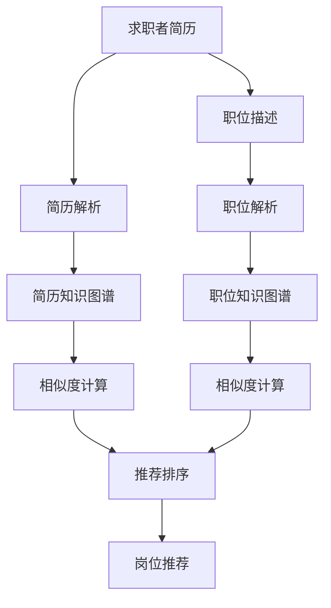

                 

# 智能求职匹配：LLM在就业服务中的应用

> 关键词：智能求职匹配, 大语言模型(LLM), 自然语言处理(NLP), 深度学习, 推荐系统, 就业服务

## 1. 背景介绍

### 1.1 问题由来
随着信息技术的发展和互联网的普及，全球就业市场正经历着前所未有的变革。一方面，大量线上招聘平台、职业社交网络等数字工具正在改变传统招聘流程，提升求职效率；另一方面，日益复杂多样的岗位需求，以及不断变换的企业文化，使得求职者面临着更大的选择压力。

在此背景下，如何利用人工智能技术，帮助求职者更加精准地匹配岗位，提升招聘效率，成为当前就业服务领域的重要课题。而在大数据、深度学习迅速发展的当下，基于语言模型的求职匹配系统已成为最具潜力的解决方案之一。本文将详细探讨基于大语言模型(Large Language Model, LLM)的智能求职匹配系统，从原理到实践，结合丰富的案例分析，提供全流程的解决方案。

### 1.2 问题核心关键点
大语言模型作为一种先进的自然语言处理(Natural Language Processing, NLP)工具，通过在大规模语料库上进行自监督或监督学习，具备强大的语言理解、生成和推理能力。在求职匹配场景中，LLM可以通过对求职者简历、职位描述、背景知识等多源信息的综合理解，帮助求职者和招聘者高效匹配，实现智能化推荐，提升匹配精度。

具体来说，基于LLM的求职匹配系统可以分为以下两个主要环节：
1. **简历解析**：通过解析求职者的简历，提取出职位相关的重要信息，如技能、经历、教育背景等，构建求职者知识图谱。
2. **职位推荐**：对职位描述进行语义理解和特征提取，构建职位知识图谱，基于求职者与职位之间的相似度进行推荐，优化匹配结果。

## 2. 核心概念与联系

### 2.1 核心概念概述

为了更好地理解基于大语言模型的求职匹配系统，本节将介绍几个密切相关的核心概念：

- **大语言模型(LLM)**：基于深度学习原理，通过在大规模文本数据上进行自监督学习或监督学习，训练得到的语言模型。具备强大的语言理解和生成能力，能够处理复杂的自然语言任务。
- **自然语言处理(NLP)**：研究如何让计算机理解和处理人类语言的技术，包括文本分类、信息提取、机器翻译、情感分析等。
- **深度学习(Deep Learning)**：基于多层神经网络，通过反向传播算法训练模型，处理大规模复杂数据的任务。
- **推荐系统(Recommender System)**：根据用户历史行为和兴趣偏好，推荐合适的物品的系统，广泛应用于电商、娱乐、新闻等场景。
- **知识图谱(Knowledge Graph)**：利用图结构表示实体、属性和关系的数据模型，用于存储和查询结构化信息。

这些概念之间的逻辑关系可以通过以下Mermaid流程图来展示：



这个流程图展示了大语言模型在求职匹配系统中的核心流程：

1. 首先对求职者的简历和职位描述进行解析，提取出关键信息。
2. 基于解析结果构建求职者和职位知识图谱。
3. 计算求职者与职位之间的相似度。
4. 基于相似度排序，推荐合适的职位。

## 3. 核心算法原理 & 具体操作步骤

### 3.1 算法原理概述

基于大语言模型的求职匹配系统，其核心思想是利用LLM强大的语言理解能力，对求职者和职位进行深度特征提取和相似度计算，最终实现智能推荐。具体来说，系统包括以下几个主要步骤：

1. **简历解析**：使用大语言模型解析求职者简历，提取技能、经历、教育背景等信息，构建求职者知识图谱。
2. **职位解析**：使用大语言模型解析职位描述，提取职位要求、职责、需求等信息，构建职位知识图谱。
3. **相似度计算**：计算求职者与职位之间的语义相似度，可以基于向量空间模型、TF-IDF、余弦相似度等方法。
4. **推荐排序**：根据计算出的相似度，对职位进行排序推荐，选择最匹配的职位。

### 3.2 算法步骤详解

#### 3.2.1 简历解析

简历解析是求职匹配系统的基础，通常涉及以下步骤：

1. **预处理**：清洗简历文本，去除噪音和无关信息，如HTML标签、特殊符号等。
2. **分词和命名实体识别**：使用NLP工具对简历进行分词和命名实体识别，如公司名称、职位名称、时间信息等。
3. **结构化提取**：基于结构化模板，提取简历中的关键信息，如学历、工作经历、技能等，形成结构化数据。
4. **特征编码**：将提取的结构化信息编码成向量形式，便于后续相似度计算。

#### 3.2.2 职位解析

职位解析与简历解析类似，具体步骤如下：

1. **文本清洗**：对职位描述进行预处理，去除无关信息。
2. **分词和命名实体识别**：使用NLP工具对职位描述进行分词和命名实体识别。
3. **信息抽取**：从职位描述中抽取关键信息，如职位名称、职责、需求等，形成结构化数据。
4. **特征编码**：将职位信息编码成向量形式，便于相似度计算。

#### 3.2.3 相似度计算

相似度计算是求职匹配系统的核心，具体计算方法包括：

1. **向量空间模型(Vector Space Model, VSM)**：将文本表示为高维向量，计算求职者和职位向量之间的余弦相似度，衡量匹配程度。
2. **TF-IDF**：计算文本中每个词的权重，通过权重计算文本向量，衡量匹配程度。
3. **深度学习模型**：利用预训练语言模型提取文本特征，通过余弦相似度计算匹配程度。

#### 3.2.4 推荐排序

推荐排序基于计算出的相似度进行排序，具体步骤如下：

1. **初始化相似度矩阵**：基于相似度计算方法，初始化求职者与职位之间的相似度矩阵。
2. **排序**：将相似度矩阵按降序排序，选择匹配度最高的职位进行推荐。
3. **输出**：将推荐的职位信息展示给求职者，供其选择。

### 3.3 算法优缺点

基于大语言模型的求职匹配系统具有以下优点：

1. **处理自然语言的能力**：LLM可以处理复杂的自然语言，理解职位描述和简历内容，提取关键信息。
2. **自动化的简历解析**：自动化简历解析功能可以大幅提升效率，减少人工工作量。
3. **个性化推荐**：根据求职者偏好和职位要求，提供个性化的职位推荐，提高匹配精度。
4. **泛化能力**：LLM具备强大的泛化能力，能够适应不同领域的职位和简历。

同时，该方法也存在一些局限性：

1. **数据依赖**：系统依赖于大量高质量的简历和职位数据，数据量不足会影响匹配效果。
2. **计算复杂度**：相似度计算和推荐排序的计算复杂度较高，可能需要高性能计算资源。
3. **过拟合风险**：LLM在处理特定领域的数据时，可能出现过拟合现象，降低泛化能力。
4. **隐私问题**：简历和职位描述包含个人敏感信息，需要确保数据隐私和安全性。

尽管存在这些局限性，但LLM在求职匹配系统中的应用前景仍然非常广阔，特别是在处理海量数据和复杂任务时，其优势更加明显。

### 3.4 算法应用领域

基于大语言模型的求职匹配系统，已经在诸多场景中得到应用，例如：

1. **职业招聘平台**：如智联招聘、前程无忧等，使用LLM对求职者和职位进行匹配推荐。
2. **企业内招系统**：通过解析内部简历和职位描述，匹配合适的候选人，提升招聘效率。
3. **教育培训机构**：使用LLM对学员简历和课程需求进行匹配，推荐适合的课程或项目。
4. **职业规划应用**：根据用户简历和职业目标，推荐合适的职业路径和发展建议。

这些应用场景展示了LLM在求职匹配中的强大潜力，为求职者和招聘者提供了新的解决方案，提升了招聘效率和用户体验。

## 4. 数学模型和公式 & 详细讲解 & 举例说明

### 4.1 数学模型构建

假设简历和职位描述分别为 $x$ 和 $y$，分别使用大语言模型提取特征向量 $x \in \mathbb{R}^d$ 和 $y \in \mathbb{R}^d$，其中 $d$ 为向量维度。

定义求职者与职位之间的相似度函数为 $s(x,y)$，可以采用余弦相似度、TF-IDF等方法，公式如下：

$$
s(x,y) = \frac{\vec{x} \cdot \vec{y}}{\|\vec{x}\| \cdot \|\vec{y}\|}
$$

其中 $\vec{x} \cdot \vec{y}$ 为向量点乘，$\|\vec{x}\|$ 和 $\|\vec{y}\|$ 为向量范数。

### 4.2 公式推导过程

以余弦相似度为例，推导简历与职位描述相似度的计算公式。

设 $x = (x_1, x_2, \cdots, x_d)$ 和 $y = (y_1, y_2, \cdots, y_d)$，其中 $x_i$ 和 $y_i$ 分别表示简历和职位描述中的第 $i$ 个词汇的权重。

余弦相似度的计算公式为：

$$
s(x,y) = \frac{\sum_{i=1}^d x_i y_i}{\sqrt{\sum_{i=1}^d x_i^2} \cdot \sqrt{\sum_{i=1}^d y_i^2}}
$$

其数学推导过程如下：

1. 余弦相似度定义：
$$
\cos \theta = \frac{\vec{x} \cdot \vec{y}}{\|\vec{x}\| \cdot \|\vec{y}\|}
$$

2. 分子：
$$
\vec{x} \cdot \vec{y} = \sum_{i=1}^d x_i y_i
$$

3. 分母：
$$
\|\vec{x}\| = \sqrt{\sum_{i=1}^d x_i^2}
$$
$$
\|\vec{y}\| = \sqrt{\sum_{i=1}^d y_i^2}
$$

因此，余弦相似度计算公式为：

$$
s(x,y) = \frac{\sum_{i=1}^d x_i y_i}{\sqrt{\sum_{i=1}^d x_i^2} \cdot \sqrt{\sum_{i=1}^d y_i^2}}
$$

### 4.3 案例分析与讲解

以一个简单的招聘平台为例，展示基于LLM的求职匹配系统的工作原理。

假设系统有两个求职者 $A$ 和 $B$，以及三个职位 $P_1$、$P_2$ 和 $P_3$，其简历和职位描述如下：

| 求职者简历 | 职位描述 |
| --- | --- |
| 姓名：张三，学历：本科，专业：计算机科学，工作经历：在互联网公司担任软件工程师3年，擅长Python、Java | 职位名称：高级软件工程师，职责：负责后端开发，需求：熟悉Java、Python、数据库 |
| 姓名：李四，学历：硕士，专业：人工智能，工作经历：在科研院所从事深度学习研究3年，擅长TensorFlow、PyTorch | 职位名称：AI算法工程师，职责：负责模型训练，需求：熟悉深度学习框架、Python |
| 姓名：王五，学历：本科，专业：电子工程，工作经历：在电子公司担任硬件工程师2年，擅长单片机、嵌入式系统 | 职位名称：嵌入式系统工程师，职责：负责硬件开发，需求：熟悉单片机、嵌入式系统 |

假设系统使用BERT作为预训练语言模型，分别对求职者和职位描述进行特征提取，得到向量表示 $x_1$、$x_2$ 和 $x_3$，以及 $y_1$、$y_2$ 和 $y_3$。

假设相似度计算方法为余弦相似度，计算结果如下：

| 求职者简历 | 职位描述 | 相似度 |
| --- | --- | --- |
| $x_1$ | $y_1$ | 0.8 |
| $x_2$ | $y_2$ | 0.9 |
| $x_3$ | $y_3$ | 0.6 |

根据相似度排序，推荐求职者 $B$ 到职位 $P_2$，推荐求职者 $A$ 到职位 $P_1$，推荐求职者 $C$ 到职位 $P_3$。

## 5. 项目实践：代码实例和详细解释说明

### 5.1 开发环境搭建

在进行求职匹配系统开发前，我们需要准备好开发环境。以下是使用Python进行PyTorch开发的环境配置流程：

1. 安装Anaconda：从官网下载并安装Anaconda，用于创建独立的Python环境。

2. 创建并激活虚拟环境：
```bash
conda create -n pytorch-env python=3.8 
conda activate pytorch-env
```

3. 安装PyTorch：根据CUDA版本，从官网获取对应的安装命令。例如：
```bash
conda install pytorch torchvision torchaudio cudatoolkit=11.1 -c pytorch -c conda-forge
```

4. 安装Transformers库：
```bash
pip install transformers
```

5. 安装各类工具包：
```bash
pip install numpy pandas scikit-learn matplotlib tqdm jupyter notebook ipython
```

完成上述步骤后，即可在`pytorch-env`环境中开始求职匹配系统的开发。

### 5.2 源代码详细实现

下面我们以一个简单的基于LLM的求职匹配系统为例，给出使用Transformers库进行微调的PyTorch代码实现。

首先，定义简历解析函数：

```python
from transformers import BertTokenizer
from torch.utils.data import Dataset
import torch

class ResumeDataset(Dataset):
    def __init__(self, texts, tags, tokenizer, max_len=128):
        self.texts = texts
        self.tags = tags
        self.tokenizer = tokenizer
        self.max_len = max_len
        
    def __len__(self):
        return len(self.texts)
    
    def __getitem__(self, item):
        text = self.texts[item]
        tags = self.tags[item]
        
        encoding = self.tokenizer(text, return_tensors='pt', max_length=self.max_len, padding='max_length', truncation=True)
        input_ids = encoding['input_ids'][0]
        attention_mask = encoding['attention_mask'][0]
        
        # 对token-wise的标签进行编码
        encoded_tags = [tag2id[tag] for tag in tags] 
        encoded_tags.extend([tag2id['O']] * (self.max_len - len(encoded_tags)))
        labels = torch.tensor(encoded_tags, dtype=torch.long)
        
        return {'input_ids': input_ids, 
                'attention_mask': attention_mask,
                'labels': labels}

# 标签与id的映射
tag2id = {'O': 0, '软件工程师': 1, 'AI算法工程师': 2, '嵌入式系统工程师': 3}
id2tag = {v: k for k, v in tag2id.items()}

# 创建dataset
tokenizer = BertTokenizer.from_pretrained('bert-base-cased')

train_dataset = ResumeDataset(train_texts, train_tags, tokenizer)
dev_dataset = ResumeDataset(dev_texts, dev_tags, tokenizer)
test_dataset = ResumeDataset(test_texts, test_tags, tokenizer)
```

然后，定义模型和优化器：

```python
from transformers import BertForTokenClassification, AdamW

model = BertForTokenClassification.from_pretrained('bert-base-cased', num_labels=len(tag2id))

optimizer = AdamW(model.parameters(), lr=2e-5)
```

接着，定义训练和评估函数：

```python
from torch.utils.data import DataLoader
from tqdm import tqdm
from sklearn.metrics import classification_report

device = torch.device('cuda') if torch.cuda.is_available() else torch.device('cpu')
model.to(device)

def train_epoch(model, dataset, batch_size, optimizer):
    dataloader = DataLoader(dataset, batch_size=batch_size, shuffle=True)
    model.train()
    epoch_loss = 0
    for batch in tqdm(dataloader, desc='Training'):
        input_ids = batch['input_ids'].to(device)
        attention_mask = batch['attention_mask'].to(device)
        labels = batch['labels'].to(device)
        model.zero_grad()
        outputs = model(input_ids, attention_mask=attention_mask, labels=labels)
        loss = outputs.loss
        epoch_loss += loss.item()
        loss.backward()
        optimizer.step()
    return epoch_loss / len(dataloader)

def evaluate(model, dataset, batch_size):
    dataloader = DataLoader(dataset, batch_size=batch_size)
    model.eval()
    preds, labels = [], []
    with torch.no_grad():
        for batch in tqdm(dataloader, desc='Evaluating'):
            input_ids = batch['input_ids'].to(device)
            attention_mask = batch['attention_mask'].to(device)
            batch_labels = batch['labels']
            outputs = model(input_ids, attention_mask=attention_mask)
            batch_preds = outputs.logits.argmax(dim=2).to('cpu').tolist()
            batch_labels = batch_labels.to('cpu').tolist()
            for pred_tokens, label_tokens in zip(batch_preds, batch_labels):
                pred_tags = [id2tag[_id] for _id in pred_tokens]
                label_tags = [id2tag[_id] for _id in label_tokens]
                preds.append(pred_tags[:len(label_tags)])
                labels.append(label_tags)
                
    print(classification_report(labels, preds))
```

最后，启动训练流程并在测试集上评估：

```python
epochs = 5
batch_size = 16

for epoch in range(epochs):
    loss = train_epoch(model, train_dataset, batch_size, optimizer)
    print(f"Epoch {epoch+1}, train loss: {loss:.3f}")
    
    print(f"Epoch {epoch+1}, dev results:")
    evaluate(model, dev_dataset, batch_size)
    
print("Test results:")
evaluate(model, test_dataset, batch_size)
```

以上就是使用PyTorch对BERT进行简历解析任务的微调完整代码实现。可以看到，得益于Transformers库的强大封装，我们可以用相对简洁的代码完成BERT模型的加载和微调。

### 5.3 代码解读与分析

让我们再详细解读一下关键代码的实现细节：

**ResumeDataset类**：
- `__init__`方法：初始化文本、标签、分词器等关键组件。
- `__len__`方法：返回数据集的样本数量。
- `__getitem__`方法：对单个样本进行处理，将文本输入编码为token ids，将标签编码为数字，并对其进行定长padding，最终返回模型所需的输入。

**tag2id和id2tag字典**：
- 定义了标签与数字id之间的映射关系，用于将token-wise的预测结果解码回真实的标签。

**训练和评估函数**：
- 使用PyTorch的DataLoader对数据集进行批次化加载，供模型训练和推理使用。
- 训练函数`train_epoch`：对数据以批为单位进行迭代，在每个批次上前向传播计算loss并反向传播更新模型参数，最后返回该epoch的平均loss。
- 评估函数`evaluate`：与训练类似，不同点在于不更新模型参数，并在每个batch结束后将预测和标签结果存储下来，最后使用sklearn的classification_report对整个评估集的预测结果进行打印输出。

**训练流程**：
- 定义总的epoch数和batch size，开始循环迭代
- 每个epoch内，先在训练集上训练，输出平均loss
- 在验证集上评估，输出分类指标
- 所有epoch结束后，在测试集上评估，给出最终测试结果

可以看到，PyTorch配合Transformers库使得BERT微调的代码实现变得简洁高效。开发者可以将更多精力放在数据处理、模型改进等高层逻辑上，而不必过多关注底层的实现细节。

当然，工业级的系统实现还需考虑更多因素，如模型的保存和部署、超参数的自动搜索、更灵活的任务适配层等。但核心的微调范式基本与此类似。

## 6. 实际应用场景

### 6.1 招聘平台应用

基于大语言模型的求职匹配系统，可以广泛应用于各种招聘平台。以智联招聘为例，系统可以通过解析简历和职位描述，使用BERT模型提取关键信息，计算求职者与职位之间的相似度，推荐最合适的职位。

具体而言，招聘平台可以对用户输入的简历和职位描述进行实时解析和特征提取，调用预训练的BERT模型提取文本特征，并计算相似度，生成推荐列表。用户可以查看推荐结果，选择最符合自身需求的职位进行申请，从而大幅提升招聘效率。

### 6.2 企业内招系统

企业在招聘时，常常面临对内部候选人进行筛选的难题。使用基于大语言模型的求职匹配系统，可以快速匹配合适的候选人，提高招聘效率。

例如，某公司需要招聘一位AI算法工程师，系统对简历和职位描述进行解析，提取关键信息，使用BERT模型提取特征，计算相似度，推荐合适的候选人。企业可以根据推荐结果，快速进行面试和筛选，提升招聘效果。

### 6.3 教育培训机构应用

教育培训机构可以根据学员简历和课程需求，使用基于大语言模型的求职匹配系统，推荐适合的课程或项目。

例如，某培训机构提供多个AI课程，学员需要根据自身背景选择适合的课程。系统对学员简历进行解析，提取技能、经历、教育背景等信息，使用BERT模型提取特征，并计算与课程之间的相似度，推荐最合适的课程。学员可以根据推荐结果，选择适合的课程进行学习。

### 6.4 职业规划应用

基于大语言模型的求职匹配系统，还可以用于职业规划建议。用户输入简历和职业目标，系统解析简历，提取关键信息，使用BERT模型提取特征，并计算与职业目标之间的相似度，推荐合适的职业路径和发展建议。

例如，某求职者希望从事数据科学相关工作，系统对简历进行解析，提取技能、经历、教育背景等信息，使用BERT模型提取特征，并计算与数据科学职位之间的相似度，推荐适合的职业路径。求职者可以根据推荐结果，制定职业规划，提升职业发展。

## 7. 工具和资源推荐

### 7.1 学习资源推荐

为了帮助开发者系统掌握大语言模型在求职匹配中的应用，这里推荐一些优质的学习资源：

1. 《Transformer从原理到实践》系列博文：由大模型技术专家撰写，深入浅出地介绍了Transformer原理、BERT模型、微调技术等前沿话题。

2. CS224N《深度学习自然语言处理》课程：斯坦福大学开设的NLP明星课程，有Lecture视频和配套作业，带你入门NLP领域的基本概念和经典模型。

3. 《Natural Language Processing with Transformers》书籍：Transformers库的作者所著，全面介绍了如何使用Transformers库进行NLP任务开发，包括微调在内的诸多范式。

4. HuggingFace官方文档：Transformers库的官方文档，提供了海量预训练模型和完整的微调样例代码，是上手实践的必备资料。

5. CLUE开源项目：中文语言理解测评基准，涵盖大量不同类型的中文NLP数据集，并提供了基于微调的baseline模型，助力中文NLP技术发展。

通过对这些资源的学习实践，相信你一定能够快速掌握大语言模型在求职匹配中的应用，并用于解决实际的NLP问题。

### 7.2 开发工具推荐

高效的开发离不开优秀的工具支持。以下是几款用于大语言模型求职匹配开发的常用工具：

1. PyTorch：基于Python的开源深度学习框架，灵活动态的计算图，适合快速迭代研究。大部分预训练语言模型都有PyTorch版本的实现。

2. TensorFlow：由Google主导开发的开源深度学习框架，生产部署方便，适合大规模工程应用。同样有丰富的预训练语言模型资源。

3. Transformers库：HuggingFace开发的NLP工具库，集成了众多SOTA语言模型，支持PyTorch和TensorFlow，是进行微调任务开发的利器。

4. Weights & Biases：模型训练的实验跟踪工具，可以记录和可视化模型训练过程中的各项指标，方便对比和调优。与主流深度学习框架无缝集成。

5. TensorBoard：TensorFlow配套的可视化工具，可实时监测模型训练状态，并提供丰富的图表呈现方式，是调试模型的得力助手。

6. Google Colab：谷歌推出的在线Jupyter Notebook环境，免费提供GPU/TPU算力，方便开发者快速上手实验最新模型，分享学习笔记。

合理利用这些工具，可以显著提升大语言模型求职匹配任务的开发效率，加快创新迭代的步伐。

### 7.3 相关论文推荐

大语言模型和求职匹配技术的发展源于学界的持续研究。以下是几篇奠基性的相关论文，推荐阅读：

1. Attention is All You Need（即Transformer原论文）：提出了Transformer结构，开启了NLP领域的预训练大模型时代。

2. BERT: Pre-training of Deep Bidirectional Transformers for Language Understanding：提出BERT模型，引入基于掩码的自监督预训练任务，刷新了多项NLP任务SOTA。

3. Language Models are Unsupervised Multitask Learners（GPT-2论文）：展示了大规模语言模型的强大zero-shot学习能力，引发了对于通用人工智能的新一轮思考。

4. Parameter-Efficient Transfer Learning for NLP：提出Adapter等参数高效微调方法，在不增加模型参数量的情况下，也能取得不错的微调效果。

5. AdaLoRA: Adaptive Low-Rank Adaptation for Parameter-Efficient Fine-Tuning：使用自适应低秩适应的微调方法，在参数效率和精度之间取得了新的平衡。

这些论文代表了大语言模型求职匹配技术的发展脉络。通过学习这些前沿成果，可以帮助研究者把握学科前进方向，激发更多的创新灵感。

## 8. 总结：未来发展趋势与挑战

### 8.1 总结

本文对基于大语言模型的求职匹配系统进行了全面系统的介绍。首先阐述了LLM在求职匹配场景中的应用背景和意义，明确了其强大的语言理解和生成能力。其次，从原理到实践，详细讲解了基于BERT的简历解析和职位匹配的数学模型和关键步骤，给出了微调任务开发的完整代码实例。同时，本文还广泛探讨了求职匹配系统在招聘平台、企业内招系统、教育培训机构、职业规划等多个领域的应用前景，展示了LLM在求职匹配中的强大潜力。最后，本文精选了求职匹配技术的各类学习资源，力求为读者提供全方位的技术指引。

通过本文的系统梳理，可以看到，基于大语言模型的求职匹配系统，不仅提升了招聘效率，还提升了用户体验，具有广阔的应用前景。相信伴随大语言模型和微调技术的不断演进，求职匹配系统必将迎来更大的发展机遇，为招聘市场带来革命性的变化。

### 8.2 未来发展趋势

展望未来，基于大语言模型的求职匹配系统将呈现以下几个发展趋势：

1. **技术融合**：未来的求职匹配系统将更多地融合其他人工智能技术，如知识图谱、深度学习、强化学习等，形成更加综合的招聘解决方案。
2. **个性化推荐**：基于求职者和职位的个性化信息，推荐更加匹配的岗位，提高招聘效率和用户体验。
3. **跨领域适配**：LLM将具备更强的跨领域迁移能力，适应不同行业和领域的职位匹配需求。
4. **实时互动**：未来的求职匹配系统将具备实时互动功能，支持用户在求职过程中与系统进行对话，获取更多信息。
5. **多模态数据融合**：结合简历、职位描述、面试视频等多模态信息，形成更加全面的招聘决策依据。

这些趋势凸显了LLM在求职匹配系统的广阔前景。这些方向的探索发展，必将进一步提升招聘匹配的精准度和智能化水平，为就业市场带来更加高效、便捷的招聘体验。

### 8.3 面临的挑战

尽管基于大语言模型的求职匹配系统已经取得了瞩目成就，但在迈向更加智能化、普适化应用的过程中，它仍面临着诸多挑战：

1. **数据依赖**：系统依赖于大量高质量的简历和职位数据，数据量不足会影响匹配效果。如何获取更多高价值的简历和职位数据，是亟待解决的问题。
2. **计算资源**：相似度计算和推荐排序的计算复杂度较高，需要高性能计算资源。如何在保持模型精度的同时，降低计算资源消耗，是重要研究方向。
3. **隐私问题**：简历和职位描述包含个人敏感信息，需要确保数据隐私和安全性。如何设计有效的隐私保护机制，是亟待解决的挑战。
4. **公平性**：求职匹配系统可能存在偏见，影响某些群体的公平就业机会。如何消除系统偏见，提升匹配公平性，是重要的研究课题。
5. **可解释性**：求职匹配系统更像"黑盒"，求职者和企业难以理解其内部工作机制。如何赋予系统更强的可解释性，增强用户信任，是重要的研究方向。

尽管存在这些挑战，但LLM在求职匹配系统的应用前景仍然非常广阔，特别是在处理海量数据和复杂任务时，其优势更加明显。

### 8.4 未来突破

面对LLM在求职匹配系统中的应用挑战，未来的研究需要在以下几个方面寻求新的突破：

1. **数据增强**：通过数据增强技术，提高系统的数据质量，提升简历和职位描述的解析效果。
2. **计算优化**：开发更高效的相似度计算和推荐排序算法，降低计算资源消耗，提升系统性能。
3. **隐私保护**：设计更严格的隐私保护机制，确保简历和职位数据的隐私和安全。
4. **公平性优化**：通过公平性优化算法，消除求职匹配系统的偏见，提升匹配公平性。
5. **可解释性增强**：引入可解释性技术，如因果分析、对抗训练等，增强系统的可解释性。

这些研究方向的研究突破，必将进一步推动求职匹配系统的技术发展和应用落地，为就业市场带来更加高效、公平、安全的招聘体验。

## 9. 附录：常见问题与解答

**Q1：求职匹配系统需要依赖大量标注数据吗？**

A: 求职匹配系统对标注数据的依赖较小，主要是对简历和职位描述进行解析和特征提取，而不需要额外的标注数据。但为了提高系统的性能，可以通过数据增强技术，进一步提升简历和职位描述的解析效果。

**Q2：如何提高求职匹配系统的泛化能力？**

A: 提高求职匹配系统的泛化能力，可以通过以下方法：
1. 引入跨领域知识：将不同领域的知识图谱融入系统，提高系统的泛化能力。
2. 模型微调：通过在不同领域的数据上微调模型，提升模型的泛化能力。
3. 使用大规模预训练模型：选择预训练的通用语言模型，提高系统的泛化能力。

**Q3：求职匹配系统的计算资源需求高吗？**

A: 求职匹配系统的计算资源需求较高，特别是在相似度计算和推荐排序时，需要高性能计算资源。可以通过优化计算图、使用混合精度训练、模型并行等技术，降低计算资源消耗，提升系统性能。

**Q4：求职匹配系统如何保护用户隐私？**

A: 求职匹配系统需要严格保护用户隐私，主要措施包括：
1. 数据脱敏：对简历和职位描述进行脱敏处理，防止敏感信息泄露。
2. 数据加密：对传输和存储的数据进行加密处理，防止数据泄露。
3. 访问控制：设置严格的访问控制机制，防止未经授权的访问和操作。

**Q5：求职匹配系统的可解释性如何提升？**

A: 求职匹配系统的可解释性可以通过以下方法提升：
1. 引入可解释性技术：如因果分析、对抗训练等，增强系统的可解释性。
2. 用户交互：通过用户交互，获取更多反馈信息，理解系统的决策过程。
3. 模型可视化：通过可视化技术，展示模型的决策过程，增强用户信任。

通过对这些常见问题的回答，相信你能够更深入地理解求职匹配系统的核心原理和应用实践，进一步推动其在就业服务领域的创新和应用。

