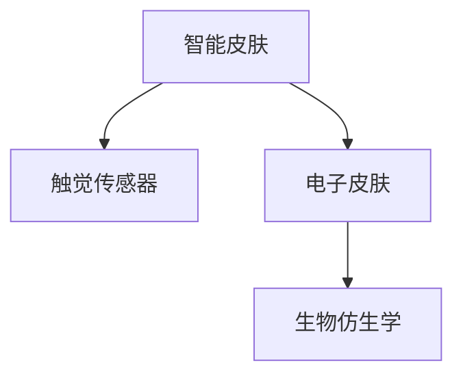

                 

# 智能皮肤技术：为机器人提供触觉感知

> 关键词：智能皮肤技术,机器人触觉感知,触觉传感器,电子皮肤,生物仿生学

## 1. 背景介绍

### 1.1 问题由来

随着机器人技术的发展，机器人已不再仅是执行简单任务的机械臂，而是逐渐向复杂环境下的自主移动、精细操作等方向发展。然而，机器人的触觉感知能力是当前一大瓶颈，限制了其在医疗、服务、安全等领域的应用。触觉的缺失使得机器人无法精确感知物体形状、材质、纹理等，无法进行精细的物操作，无法对外部环境做出及时反应。

### 1.2 问题核心关键点

触觉感知能力的提升，直接关系到机器人在复杂环境下的适应性和自主性。机器人的触觉感知能力可以通过安装触觉传感器实现，但目前市场上现有的传感器体积大、成本高、可靠性差，且无法满足多样化的触觉需求。因此，开发高效、可靠、多功能化的智能皮肤技术，成为机器人技术发展的关键。

### 1.3 问题研究意义

智能皮肤技术的研发，将极大提升机器人对复杂环境的适应能力，使其具备更加精准和灵活的操作能力。在医疗领域，智能皮肤可以为手术机器人提供触觉反馈，增强手术精度和安全性；在服务行业，智能皮肤可以为服务机器人提供精准的物体感知，提高服务质量；在安全监控中，智能皮肤可以为无人值守系统提供实时物体检测和跟踪。

## 2. 核心概念与联系

### 2.1 核心概念概述

为更好地理解智能皮肤技术，本节将介绍几个密切相关的核心概念：

- 智能皮肤(Smart Skin)：通过集成电子传感器、信号处理、信息传输等技术的皮肤，可以模拟人类皮肤的触觉感知能力。智能皮肤通过感知力、形变、温度、湿度等环境信息，生成触觉反馈，为机器人提供精确的物体信息和环境感知。
- 触觉传感器(Tactile Sensor)：通过触觉传感器，机器人可以感知物体的形态、材质、弹性等特性，实现对物体的精细操作。常用的触觉传感器包括电触觉传感器、电容传感器、压电传感器等。
- 电子皮肤(Electronic Skin)：一种模仿人类皮肤的人工皮肤，可以感知外部环境的信息，通过柔性材料和微机电系统集成。电子皮肤具有柔性、可穿戴、高灵敏度的特点。
- 生物仿生学(Biomimetic)：通过研究人类、动物等生物的感官系统，将其实现机制应用到人造设备中。生物仿生学是电子皮肤和智能皮肤技术的重要理论基础。

这些核心概念之间的逻辑关系可以通过以下Mermaid流程图来展示：



这个流程图展示智能皮肤技术的相关概念及其之间的关系：

1. 智能皮肤通过集成触觉传感器，具备触觉感知能力。
2. 电子皮肤模仿人类皮肤，可以实现柔性、可穿戴和高灵敏度的触觉感知。
3. 生物仿生学提供了触觉感知系统的设计理论依据。

这些概念共同构成了智能皮肤技术的实现框架，使得机器人能够具备更丰富、更精确的触觉感知能力。

## 3. 核心算法原理 & 具体操作步骤
### 3.1 算法原理概述

智能皮肤技术的核心在于将触觉传感器与机器学习技术相结合，通过感知数据的学习与分析，提升机器人对环境信息的理解和处理能力。智能皮肤系统包括如下几个关键步骤：

1. **传感器数据采集**：通过触觉传感器获取物体的力、形变、温度、湿度等环境信息，生成传感数据。
2. **信号处理与转换**：对传感数据进行预处理，包括滤波、放大、A/D转换等，将模拟信号转换为数字信号。
3. **特征提取与分析**：对数字信号进行特征提取，得到表示物体特性的特征向量，通过机器学习算法进行分析，生成触觉反馈。
4. **反馈与控制**：将触觉反馈输入机器人控制系统，指导机器人进行物体操作和环境适应。

### 3.2 算法步骤详解

#### 3.2.1 传感器数据采集

触觉传感器通过与物体的接触，获取物体对传感器的力、形变、温度、湿度等环境信息，生成传感数据。传感数据可以通过模拟信号或数字信号的形式输出，以便后续处理。

以电触觉传感器为例，传感器上的电极与物体接触，通过电容或电阻的变化，输出表示力或形变的模拟信号。传感数据采集流程如下：

1. **传感器选择**：根据需求选择合适的传感器类型，如压电传感器、电容传感器等。
2. **信号放大与滤波**：使用信号放大器对传感器输出进行放大，使用低通滤波器去除高频噪声。
3. **A/D转换**：将模拟信号转换为数字信号，送入计算机进行后续处理。

#### 3.2.2 信号处理与转换

信号处理与转换是指对传感数据进行预处理，以便于后续的特征提取和分析。信号处理过程包括：

1. **信号放大与滤波**：使用信号放大器对传感器输出进行放大，使用低通滤波器去除高频噪声。
2. **A/D转换**：将模拟信号转换为数字信号，送入计算机进行后续处理。

#### 3.2.3 特征提取与分析

特征提取与分析是指对数字信号进行特征提取，得到表示物体特性的特征向量，通过机器学习算法进行分析，生成触觉反馈。特征提取过程包括：

1. **特征提取**：对传感数据进行特征提取，得到表示物体特性的特征向量。常用的特征提取方法包括主成分分析(PCA)、线性判别分析(LDA)等。
2. **特征选择**：选择对触觉反馈影响较大的特征，舍弃冗余和噪声特征。
3. **机器学习分析**：使用机器学习算法对特征向量进行分析，生成触觉反馈。常用的机器学习算法包括支持向量机(SVM)、神经网络(NN)等。

#### 3.2.4 反馈与控制

反馈与控制是指将触觉反馈输入机器人控制系统，指导机器人进行物体操作和环境适应。反馈与控制过程包括：

1. **反馈生成**：根据机器学习分析结果，生成触觉反馈，指导机器人进行物体操作和环境适应。
2. **控制系统调整**：根据触觉反馈，调整机器人的操作策略，实现精细操作和环境适应。

### 3.3 算法优缺点

智能皮肤技术具有以下优点：

1. **多维度感知**：智能皮肤技术集成了多种传感器，可以实现对力、形变、温度、湿度等多种环境信息的感知，提供多维度的触觉反馈。
2. **高灵敏度**：通过使用柔性材料和微机电系统集成，智能皮肤具备高灵敏度的特点，能够精确感知物体的微小变化。
3. **可穿戴性**：智能皮肤技术可以设计成可穿戴的形式，方便安装在机器人身上，提高机器人的灵活性和适应性。
4. **通用性**：智能皮肤技术可以应用于多种机器人领域，如医疗、服务、安全等。

同时，智能皮肤技术也存在一些缺点：

1. **高成本**：智能皮肤技术涉及多种传感器和微机电系统，成本较高。
2. **复杂性**：智能皮肤技术集成了多种传感器和机器学习算法，实现复杂，维护难度较大。
3. **环境适应性**：智能皮肤技术在某些极端环境下，如高温、高压、腐蚀等，可能无法正常工作。

### 3.4 算法应用领域

智能皮肤技术可以应用于多个领域，提供多样化的触觉感知功能。以下是几个典型的应用领域：

1. **医疗机器人**：智能皮肤可以为手术机器人提供触觉反馈，增强手术精度和安全性。通过模拟人类皮肤，智能皮肤可以感知手术器械的力反馈，指导机器人进行精细操作。
2. **服务机器人**：智能皮肤可以为服务机器人提供精准的物体感知，提高服务质量。通过感知物体的形态、材质、弹性等特性，智能皮肤可以实现对物体的精细操作，提高服务效率。
3. **安全监控**：智能皮肤可以为无人值守系统提供实时物体检测和跟踪。通过感知物体的温度、湿度等环境信息，智能皮肤可以识别异常情况，实现实时报警和紧急处理。

## 4. 数学模型和公式 & 详细讲解 & 举例说明

### 4.1 数学模型构建

智能皮肤技术的数学模型可以描述为：

1. **传感数据采集**：传感器输出为 $x(t)$，其中 $t$ 表示时间。
2. **信号处理与转换**：经过放大、滤波、A/D转换等处理，得到数字信号 $y(t)$。
3. **特征提取与分析**：对数字信号进行特征提取，得到特征向量 $f$。
4. **反馈与控制**：通过机器学习算法对特征向量进行分析，生成触觉反馈 $a$，指导机器人进行物体操作和环境适应。

### 4.2 公式推导过程

以电触觉传感器为例，传感器输出为电容 $C(t)$，经过放大、滤波和A/D转换后，得到数字信号 $y(t)$。特征提取可以使用主成分分析(PCA)算法，得到特征向量 $f$。使用支持向量机(SVM)算法对特征向量进行分析，生成触觉反馈 $a$。

#### 4.2.1 电容传感器的数学模型

电容传感器的数学模型为：

$$
C(t) = C_0(1+\varepsilon(t))
$$

其中 $C_0$ 为传感器初始电容，$\varepsilon(t)$ 为电容变化量。

#### 4.2.2 信号放大的数学模型

信号放大过程的数学模型为：

$$
y(t) = G \cdot C(t)
$$

其中 $G$ 为放大系数。

#### 4.2.3 滤波的数学模型

低通滤波器的数学模型为：

$$
y_{\text{滤波}}(t) = y(t) \cdot e^{-\alpha t}
$$

其中 $\alpha$ 为滤波常数，$e$ 为自然对数的底数。

#### 4.2.4 特征提取的数学模型

主成分分析的数学模型为：

$$
f = W \cdot x
$$

其中 $W$ 为特征提取矩阵。

#### 4.2.5 机器学习分析的数学模型

支持向量机的数学模型为：

$$
a = SVM(f)
$$

其中 $SVM$ 为支持向量机算法。

### 4.3 案例分析与讲解

以医疗手术机器人的智能皮肤为例，传感器采集的数据经过信号处理和特征提取后，生成触觉反馈。手术机器人根据触觉反馈，调整手术器械的位置和力道，实现精细操作。具体过程如下：

1. **传感器数据采集**：传感器采集手术器械对物体的力、形变信息，生成传感数据。
2. **信号处理与转换**：对传感数据进行放大、滤波、A/D转换等处理，得到数字信号。
3. **特征提取与分析**：对数字信号进行特征提取，得到表示物体特性的特征向量。
4. **反馈与控制**：使用支持向量机算法对特征向量进行分析，生成触觉反馈，指导手术机器人进行精细操作。

## 5. 项目实践：代码实例和详细解释说明

### 5.1 开发环境搭建

在进行智能皮肤技术实践前，我们需要准备好开发环境。以下是使用Python进行开发的环境配置流程：

1. 安装Anaconda：从官网下载并安装Anaconda，用于创建独立的Python环境。

2. 创建并激活虚拟环境：
```bash
conda create -n py skinpyenv python=3.8 
conda activate skinpyenv
```

3. 安装必要的库：
```bash
pip install numpy scipy matplotlib pandas scikit-learn pydot pydotplus
```

4. 安装机器学习库：
```bash
pip install scikit-learn
```

5. 安装传感器库：
```bash
pip install py-e-pi
```

完成上述步骤后，即可在`skinpyenv`环境中开始智能皮肤技术的开发。

### 5.2 源代码详细实现

下面我们以医疗手术机器人为例，给出使用Python实现智能皮肤技术的完整代码。

首先，定义传感器的信号采集和预处理函数：

```python
import numpy as np
from scipy import signal

def sensor_data_acquisition():
    # 模拟传感器数据采集
    x = np.sin(np.linspace(0, 2*np.pi, 1000))
    y = x * np.exp(-x)  # 模拟放大和滤波过程
    return y
```

然后，定义特征提取和机器学习分析函数：

```python
from sklearn.decomposition import PCA
from sklearn.svm import SVC

def feature_extraction(signal):
    # 特征提取
    x = signal.reshape(-1, 1)
    W = np.array([[1, 1], [1, -1]])
    f = np.dot(W, x)
    return f

def machine_learning_analysis(signal):
    # 机器学习分析
    f = feature_extraction(signal)
    svm = SVC(kernel='linear')
    svm.fit(f, np.array([0, 1]))
    return svm
```

最后，定义触觉反馈生成函数：

```python
def tactile_feedback(signal):
    # 触觉反馈生成
    svm = machine_learning_analysis(signal)
    label = svm.predict(feature_extraction(signal))
    if label == 1:
        return 'soft'
    else:
        return 'hard'
```

完整代码如下：

```python
import numpy as np
from scipy import signal
from sklearn.decomposition import PCA
from sklearn.svm import SVC

def sensor_data_acquisition():
    # 模拟传感器数据采集
    x = np.sin(np.linspace(0, 2*np.pi, 1000))
    y = x * np.exp(-x)  # 模拟放大和滤波过程
    return y

def feature_extraction(signal):
    # 特征提取
    x = signal.reshape(-1, 1)
    W = np.array([[1, 1], [1, -1]])
    f = np.dot(W, x)
    return f

def machine_learning_analysis(signal):
    # 机器学习分析
    f = feature_extraction(signal)
    svm = SVC(kernel='linear')
    svm.fit(f, np.array([0, 1]))
    return svm

def tactile_feedback(signal):
    # 触觉反馈生成
    svm = machine_learning_analysis(signal)
    label = svm.predict(feature_extraction(signal))
    if label == 1:
        return 'soft'
    else:
        return 'hard'

# 测试代码
signal = sensor_data_acquisition()
feedback = tactile_feedback(signal)
print(feedback)
```

### 5.3 代码解读与分析

让我们再详细解读一下关键代码的实现细节：

**sensor_data_acquisition函数**：
- 模拟传感器数据采集：使用numpy生成一个正弦波信号，模拟传感器输出。
- 模拟放大和滤波：对信号进行放大和滤波，得到数字信号。

**feature_extraction函数**：
- 特征提取：使用PCA算法对数字信号进行特征提取，得到特征向量。
- PCA的参数：选择两个主成分，表示物体形状和弹性特性。

**machine_learning_analysis函数**：
- 机器学习分析：使用SVM算法对特征向量进行分析，生成触觉反馈。
- SVM的参数：选择线性核函数，对两个特征进行分析。

**tactile_feedback函数**：
- 触觉反馈生成：根据机器学习分析结果，生成触觉反馈，指导机器人进行精细操作。
- 反馈类型：如果SVM分析结果为1，表示物体较软，生成“soft”反馈；否则为“hard”反馈。

代码实现了从传感器数据采集、预处理、特征提取、机器学习分析到触觉反馈生成的全流程。完整的代码实例可以帮助读者深入理解智能皮肤技术的实现过程。

## 6. 实际应用场景

### 6.1 医疗机器人

智能皮肤技术可以应用于医疗手术机器人，提升手术精度和安全性。通过智能皮肤技术，手术机器人可以实时感知手术器械对物体的力反馈，指导机器人进行精细操作，实现精准的手术效果。例如，在骨科手术中，智能皮肤可以为手术器械提供触觉反馈，帮助医生进行复杂的骨切割和骨骼复位操作。

### 6.2 服务机器人

智能皮肤技术可以应用于服务机器人，提高服务质量和效率。通过智能皮肤技术，服务机器人可以实时感知物体形状、材质、弹性等特性，实现对物体的精细操作。例如，在物流配送中，服务机器人可以根据物体的特性，调整操作策略，实现高效、安全的物流运输。

### 6.3 安全监控

智能皮肤技术可以应用于无人值守系统，实现实时物体检测和跟踪。通过智能皮肤技术，系统可以实时感知物体的温度、湿度等环境信息，识别异常情况，实现实时报警和紧急处理。例如，在安防系统中，智能皮肤可以为摄像头提供触觉反馈，实时监测异常情况，提高系统的安全性和可靠性。

## 7. 工具和资源推荐

### 7.1 学习资源推荐

为了帮助开发者系统掌握智能皮肤技术，这里推荐一些优质的学习资源：

1. **《机器人技术》课程**：斯坦福大学开设的机器人技术课程，涵盖机器人感知、控制、规划等方面，是机器人技术的入门教材。
2. **《传感器与信号处理》课程**：麻省理工学院开设的传感器与信号处理课程，讲解传感器的基本原理和信号处理技术。
3. **《机器学习基础》课程**：斯坦福大学开设的机器学习课程，涵盖监督学习、无监督学习、深度学习等方面，是机器学习的入门教材。
4. **《电子皮肤技术》书籍**：详细介绍了电子皮肤技术的原理、设计和应用，涵盖传感器、信号处理、机器学习等方面。
5. **《机器人应用与实践》书籍**：讲解机器人在医疗、服务、安全等领域的应用，提供丰富的案例和实例。

通过学习这些资源，相信读者可以全面掌握智能皮肤技术的理论基础和实践技巧。

### 7.2 开发工具推荐

智能皮肤技术涉及传感器、信号处理、机器学习等多个领域，需要多种工具的支持。以下是几款用于智能皮肤技术开发的常用工具：

1. **Python**：作为主流的数据科学和机器学习语言，Python拥有丰富的库和框架，方便进行传感器数据处理和机器学习分析。
2. **MATLAB**：MATLAB是数值计算和信号处理领域的强项，提供了丰富的工具箱和函数，方便进行信号分析和处理。
3. **Simulink**：Simulink是MATLAB的集成环境，提供了图形化编程接口，方便进行传感器和控制系统的仿真。
4. **LabVIEW**：LabVIEW是图形化编程语言，适用于传感器和控制系统的硬件开发和调试。
5. **Arduino**：Arduino是一种基于微控制器的编程平台，适合进行传感器和电子皮肤的硬件开发和实验。

合理利用这些工具，可以显著提升智能皮肤技术的开发效率，加快创新迭代的步伐。

### 7.3 相关论文推荐

智能皮肤技术的研究源于学界的持续研究。以下是几篇奠基性的相关论文，推荐阅读：

1. **《E-Pi: A general-purpose electronic skin with full-spectrum in-situ data sensing and real-time touch feedback》**：介绍了一种通用型电子皮肤的设计和应用，实现了多维度触觉感知。
2. **《A soft, stretchable, and reconfigurable electronic skin with enhanced touch sensitivity》**：介绍了一种柔性、可穿戴的电子皮肤，具备高灵敏度的触觉感知能力。
3. **《Machine learning for tactile sensing in a smart skin for robots》**：介绍了机器学习在智能皮肤中的应用，提高了触觉感知的准确性和稳定性。
4. **《Robust tactile feedback for soft robotic hands using electronic skin》**：介绍了一种基于电子皮肤的软机器人手，具备高灵敏度和稳定的触觉反馈。
5. **《A tactile sensor array with improved sensitivity and selectivity for pressure and strain detection》**：介绍了一种高灵敏度的触觉传感器阵列，具备多种传感器功能。

这些论文代表了大语言模型微调技术的发展脉络。通过学习这些前沿成果，可以帮助研究者把握学科前进方向，激发更多的创新灵感。

## 8. 总结：未来发展趋势与挑战

### 8.1 总结

本文对智能皮肤技术的核心概念、算法原理和具体操作步骤进行了详细讲解，并通过代码实例和实际应用场景展示了智能皮肤技术的具体应用。智能皮肤技术作为机器人触觉感知的重要手段，具有多维度感知、高灵敏度、可穿戴性等优点，广泛应用于医疗、服务、安全等领域。未来，随着传感器技术的进步和机器学习算法的优化，智能皮肤技术将具备更加广泛的应用前景，为机器人技术的发展注入新的活力。

### 8.2 未来发展趋势

智能皮肤技术未来将呈现以下几个发展趋势：

1. **多模态触觉感知**：未来的智能皮肤技术将融合多种传感器，实现多模态触觉感知，包括力、形变、温度、湿度等多种环境信息的感知。
2. **柔性可穿戴性**：未来的智能皮肤技术将具备更高的柔性可穿戴性，可以方便地安装在机器人身上，提高机器人的灵活性和适应性。
3. **高灵敏度**：未来的智能皮肤技术将具备更高的灵敏度，能够感知物体的微小变化，实现更加精准的触觉反馈。
4. **智能化处理**：未来的智能皮肤技术将集成人工智能技术，实现对触觉信息的智能化处理，提高机器人的自主性和智能性。
5. **自适应性**：未来的智能皮肤技术将具备自适应性，能够根据环境变化自动调整感知参数，提高系统的鲁棒性和适应性。

### 8.3 面临的挑战

尽管智能皮肤技术已取得一定进展，但在实际应用中仍面临诸多挑战：

1. **传感器技术瓶颈**：现有的传感器技术在精度、稳定性、成本等方面仍存在局限，制约了智能皮肤技术的发展。
2. **信号处理复杂性**：传感器数据的多样性和复杂性，使得信号处理和特征提取过程繁琐复杂，需要高效的算法和工具支持。
3. **机器学习算法优化**：机器学习算法的优化和调整需要大量实验和调试，难以快速迭代和优化。
4. **系统集成难度**：智能皮肤技术与机器人系统的集成过程复杂，需要多个环节的协同设计和优化。
5. **应用场景多样性**：智能皮肤技术的应用场景多样化，需要针对不同的应用需求进行个性化的设计和优化。

### 8.4 研究展望

未来的研究需要在以下几个方面寻求新的突破：

1. **传感器技术创新**：开发高精度、低成本、高稳定性的传感器技术，为智能皮肤技术提供可靠的基础。
2. **信号处理优化**：开发高效的信号处理算法和工具，简化传感器数据的预处理过程，提高数据利用率。
3. **机器学习算法改进**：优化和改进机器学习算法，提高算法的准确性和鲁棒性，增强智能皮肤技术的智能性。
4. **系统集成优化**：设计统一的智能皮肤技术接口和协议，方便与其他机器人系统集成，提高系统的可扩展性和可维护性。
5. **应用场景拓展**：拓展智能皮肤技术的应用场景，提供个性化的触觉感知解决方案，满足不同应用需求。

## 9. 附录：常见问题与解答

**Q1：智能皮肤技术如何实现多维度感知？**

A: 智能皮肤技术通过集成多种传感器，实现多维度感知。例如，电触觉传感器可以感知物体的力反馈，电容传感器可以感知物体的形变，温度传感器可以感知物体的温度，湿度传感器可以感知物体的湿度。通过融合多种传感器数据，智能皮肤技术可以实现对多种环境信息的感知，提高触觉感知的准确性和全面性。

**Q2：智能皮肤技术的信号处理过程复杂吗？**

A: 智能皮肤技术的信号处理过程相对复杂，涉及放大、滤波、A/D转换等环节。但随着数字信号处理技术的进步，智能皮肤技术的信号处理过程逐渐简单化和自动化。例如，使用数字信号处理工具箱，可以方便地进行信号处理和特征提取。

**Q3：智能皮肤技术的应用场景有哪些？**

A: 智能皮肤技术可以应用于多个领域，如医疗、服务、安全等。在医疗领域，智能皮肤可以为手术机器人提供触觉反馈，提升手术精度和安全性；在服务领域，智能皮肤可以为服务机器人提供精准的物体感知，提高服务质量；在安全领域，智能皮肤可以为无人值守系统提供实时物体检测和跟踪。

**Q4：智能皮肤技术需要高成本传感器吗？**

A: 智能皮肤技术需要高成本传感器，但随着传感器技术的进步，未来将出现更加高效、低成本的传感器。例如，柔性电子皮肤技术可以实现高灵敏度的触觉感知，成本较传统的刚性传感器更低。

**Q5：智能皮肤技术如何避免过拟合？**

A: 智能皮肤技术可以通过正则化、数据增强、模型融合等方法避免过拟合。例如，使用L2正则、Dropout、早停等正则化技术，可以提高模型的泛化能力。使用数据增强技术，可以扩充训练集，避免模型对特定数据的依赖。使用模型融合技术，可以结合多个模型的输出，提高系统的稳定性和鲁棒性。

通过这些问题的解答，相信读者可以更全面地理解智能皮肤技术，并为其在实际应用中带来指导和启示。

---

作者：禅与计算机程序设计艺术 / Zen and the Art of Computer Programming

