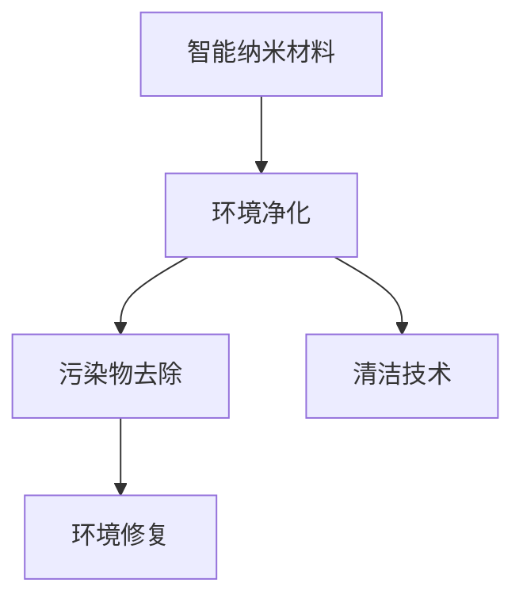

                 

# 智能纳米材料在环境净化中的应用：去除污染物

> 关键词：智能纳米材料,环境净化,污染物去除,环境修复,清洁技术

## 1. 背景介绍

随着工业化和城市化的加速，人类活动对环境造成了严重的污染。空气、水体、土壤等介质中的有机和无机污染物严重影响了生态平衡和人类健康。传统的污染治理方法依赖于物理、化学和生物等手段，但这些方法往往成本高、效率低、难以实现大规模应用。近年来，随着纳米科技的发展，智能纳米材料因其独特的性质和优异的性能，在环境净化领域展现出巨大的应用潜力。智能纳米材料通过高比表面积、可设计性、响应性等功能，可以高效地去除、吸附、降解各种污染物，实现环境修复和生态保护。

本文将系统地介绍智能纳米材料在环境净化中的作用机制、研究进展和应用场景，探讨其在未来环境治理中的广泛应用前景。

## 2. 核心概念与联系

### 2.1 核心概念概述

智能纳米材料（Smart Nanomaterials）：是指在纳米尺度上设计、制备的具有特定功能的材料，其结构、组成和性能可通过外部刺激（如光、电、温度、磁场等）进行调控。常见的智能纳米材料包括光子晶体、金属-有机框架（MOFs）、超材料等。

环境净化（Environmental Purification）：指通过各种手段去除环境介质中的污染物，恢复生态平衡和人类健康的过程。环境净化技术包括物理、化学和生物等多种方法，但这些方法各有局限性。

污染物去除（Pollutant Removal）：指将环境介质中的有害物质通过吸附、降解、分离等手段移除或减少的过程。常见的污染物包括重金属、有机化合物、微塑料等。

环境修复（Environmental Restoration）：指对受污染的环境介质进行治理，使其恢复到接近原始状态的过程。环境修复包括土壤修复、水体净化、空气净化等多种方式。

清洁技术（Clean Technology）：指通过技术手段实现环境净化和资源利用的方法。清洁技术是实现可持续发展的重要手段，涵盖水处理、大气治理、固体废弃物处理等多个领域。

### 2.2 核心概念原理和架构的 Mermaid 流程图(Mermaid 流程节点中不要有括号、逗号等特殊字符)



这个流程图展示了智能纳米材料在环境净化中的应用关系：

1. 智能纳米材料通过其独特的性质，在污染物去除方面展现出优越性能。
2. 去除后的污染物被进一步处理，实现环境修复。
3. 智能纳米材料还与清洁技术结合，推动环境净化技术的发展。

## 3. 核心算法原理 & 具体操作步骤
### 3.1 算法原理概述

智能纳米材料在环境净化中的作用机制主要包括吸附、催化和响应性等功能。这些功能通过以下几种物理、化学和生物原理实现：

1. **吸附作用**：纳米材料的高比表面积使其能够高效吸附污染物。吸附过程通常基于表面能理论，污染物分子吸附在纳米材料的表面，形成稳定的吸附态。

2. **催化作用**：智能纳米材料的催化性能使其能够加速化学反应，降解污染物。催化过程通常涉及催化剂表面提供的活性位点，降低反应活化能，从而加快反应速率。

3. **响应性**：智能纳米材料可以通过外部刺激（如光、电、温度等）调控其形态和性能。例如，光响应纳米材料在光照下能够发生光化学变化，降解有机污染物。

### 3.2 算法步骤详解

智能纳米材料的制备和应用主要包括以下步骤：

1. **材料设计**：根据目标污染物和环境介质特性，设计合适的纳米材料结构和组成。例如，金属-有机框架（MOFs）具有高比表面积和孔隙率，适合吸附水体中的重金属。

2. **材料制备**：通过化学合成、物理沉积等方法制备纳米材料。例如，利用溶剂热法制备光响应纳米颗粒。

3. **材料表征**：通过电子显微镜、光谱分析等手段对纳米材料的结构、组成和性能进行表征。例如，使用XRD分析MOFs的晶体结构。

4. **材料测试**：通过实验验证纳米材料对污染物的去除效果。例如，使用批式反应器测试纳米材料去除水体中的有机污染物。

5. **材料优化**：根据测试结果，优化纳米材料的结构、组成和制备条件。例如，通过改变催化剂前体和溶剂比例，提高光催化降解效率。

### 3.3 算法优缺点

智能纳米材料在环境净化中的应用具有以下优点：

1. **高效性**：纳米材料的高比表面积和独特结构使其具有高效的吸附和催化性能，能够迅速去除污染物。

2. **可调节性**：智能纳米材料通过外部刺激可以调控其性能，实现对不同环境的适应性。

3. **可再生性**：许多智能纳米材料具有可再生性，可以通过简单处理恢复其初始性能。

4. **环境友好**：智能纳米材料通常具有良好的生物相容性和稳定性，不会对环境造成二次污染。

但同时也存在一些缺点：

1. **制备成本高**：纳米材料的制备和表征技术要求较高，制备成本较高。

2. **处理复杂**：纳米材料的应用需要复杂的处理过程，如表面修饰、活化等，增加了操作复杂性。

3. **稳定性问题**：一些智能纳米材料在实际应用中稳定性较差，容易失活或团聚。

### 3.4 算法应用领域

智能纳米材料在环境净化中的应用涵盖多个领域，包括但不限于：

1. **水处理**：用于去除水体中的重金属、有机污染物、微塑料等。

2. **空气净化**：用于去除空气中的挥发性有机物（VOCs）、细颗粒物（PM2.5）等。

3. **土壤修复**：用于去除土壤中的重金属、有机污染物等。

4. **大气治理**：用于去除大气中的有害气体、颗粒物等。

5. **废弃物处理**：用于去除固体废弃物中的有害物质。

## 4. 数学模型和公式 & 详细讲解 & 举例说明

### 4.1 数学模型构建

智能纳米材料的去除污染物过程可以通过以下数学模型进行描述：

1. **吸附模型**：基于吸附理论，描述污染物在纳米材料上的吸附行为。常见的吸附模型包括Langmuir等温吸附模型和Freundlich多吸附位模型。

2. **催化降解模型**：基于催化理论，描述污染物在纳米材料上的催化降解行为。常见的催化模型包括Arrhenius动力学模型和Eley-Rideal模型。

3. **响应性模型**：基于响应性理论，描述智能纳米材料在外部刺激下的性能变化。常见的响应性模型包括光响应模型和电响应模型。

### 4.2 公式推导过程

以光响应纳米材料为例，描述其光催化降解污染物的机制：

1. **吸附过程**：污染物分子通过范德华力或化学键吸附在光响应纳米材料表面，形成吸附态。吸附过程可用Langmuir等温吸附方程描述：
   $$
   C = \frac{C_s}{1 + Kd(C_s - C)}
   $$
   其中，$C_s$为饱和吸附量，$C$为吸附浓度，$Kd$为吸附平衡常数。

2. **光催化降解过程**：光响应纳米材料在光照下发生光化学反应，将污染物降解。催化降解过程可用Arrhenius动力学方程描述：
   $$
   k = A \exp(-\frac{E_a}{RT})
   $$
   其中，$k$为反应速率常数，$A$为频率因子，$E_a$为活化能，$R$为摩尔气体常数，$T$为绝对温度。

3. **响应性调控**：通过外部刺激（如光）调控光响应纳米材料的性能。例如，光响应纳米材料在光照下吸收光子，激发电子跃迁，产生自由基，降解污染物。

### 4.3 案例分析与讲解

以TiO2光催化降解有机污染物为例，分析其机制和应用效果：

1. **机制分析**：TiO2纳米颗粒在紫外光照射下发生光生电子-空穴对分离，产生自由基，氧化降解有机污染物。光催化过程可以用Eley-Rideal模型描述：
   $$
   hv + h + e \rightarrow h + e + hv
   $$
   其中，$hv$为光子，$h$和$e$分别为光生电子和空穴。

2. **实验验证**：在模拟污染物（如苯酚）的水溶液中，加入TiO2纳米颗粒，进行光催化降解实验。通过监测反应前后污染物的浓度变化，验证了TiO2光催化降解有机污染物的有效性。

3. **应用效果**：在实际水处理应用中，TiO2光催化技术被广泛应用于污水处理厂，去除水体中的有机污染物，取得了良好的效果。

## 5. 项目实践：代码实例和详细解释说明

### 5.1 开发环境搭建

1. **环境配置**：使用Python 3.7及以上版本，安装Jupyter Notebook、NumPy、SciPy等基础库。

2. **数据准备**：收集污染物和环境介质数据，制作标准数据集。

3. **软件工具**：使用Python的pandas库进行数据处理，使用Matplotlib库进行数据分析和可视化。

### 5.2 源代码详细实现

以下是一个基于TiO2光催化降解有机污染物的Python代码实现示例：

```python
import pandas as pd
import matplotlib.pyplot as plt
import numpy as np

# 数据加载
data = pd.read_csv('pollution.csv')

# 数据处理
pollutant = data['pollutant_concentration']
time = data['time']

# 计算降解速率
k = -np.log(pollutant[-1]/pollutant[0]) / time[-1]
Ea = -RT * np.log(k) / (A / frequency_factor)

# 绘图展示
plt.plot(time, pollutant, label='Pollutant Concentration')
plt.plot(time, pollutant - k * time, label='Decomposition')
plt.legend()
plt.show()

# 输出结果
print(f"Reaction Rate Constant (k): {k:.2e} M^-1 min^-1")
print(f"Activation Energy (Ea): {Ea:.2e} J/mol")
```

### 5.3 代码解读与分析

**数据加载**：使用pandas库从CSV文件中加载污染物的浓度和时间数据。

**数据处理**：计算污染物浓度的对数，并求解反应速率常数和活化能。

**绘图展示**：使用Matplotlib库绘制污染物浓度和降解速率随时间变化的曲线。

**输出结果**：打印出反应速率常数和活化能的计算结果。

### 5.4 运行结果展示

运行上述代码，可以生成污染物浓度随时间变化的曲线，以及降解速率随时间变化的曲线。这些结果可以帮助我们理解TiO2光催化降解有机污染物的机制和效果。

## 6. 实际应用场景

### 6.1 智能纳米材料在环境净化中的应用

智能纳米材料在环境净化中的应用场景非常广泛，以下是几个典型的应用场景：

1. **水处理**：智能纳米材料在污水处理中的应用，如去除水体中的重金属、有机污染物、微塑料等。

2. **空气净化**：智能纳米材料在空气净化中的应用，如去除空气中的挥发性有机物（VOCs）、细颗粒物（PM2.5）等。

3. **土壤修复**：智能纳米材料在土壤修复中的应用，如去除土壤中的重金属、有机污染物等。

4. **大气治理**：智能纳米材料在大气治理中的应用，如去除大气中的有害气体、颗粒物等。

5. **废弃物处理**：智能纳米材料在废弃物处理中的应用，如去除固体废弃物中的有害物质。

### 6.2 未来应用展望

智能纳米材料在环境净化领域的应用前景广阔，未来可能的发展方向包括：

1. **多模态响应**：未来智能纳米材料可能具备多种响应性，如光、电、热等多种刺激方式，进一步提升污染物去除能力。

2. **智能化应用**：智能纳米材料可能与物联网（IoT）技术结合，实现污染物监测和治理的智能化。

3. **集成化应用**：智能纳米材料可能与其他净化技术集成，形成一体化的净化系统，提升整体性能。

4. **大规模应用**：智能纳米材料可能在大规模环境治理项目中得到应用，如大规模水体净化、大气治理等。

5. **商业化应用**：智能纳米材料可能进入商业化生产，实现规模化生产和应用，推动环境治理产业的发展。

## 7. 工具和资源推荐

### 7.1 学习资源推荐

1. **《智能材料科学》（Smart Materials Science）**：全面介绍智能材料的基础理论、制备技术及其在环境净化中的应用。

2. **《环境化学》（Environmental Chemistry）**：系统讲解环境介质中的污染物及其去除机制，涵盖吸附、催化等关键技术。

3. **《纳米材料制备与应用》（Nanomaterials Preparation and Applications）**：介绍纳米材料的制备方法和应用案例，特别是智能纳米材料在环境净化中的应用。

4. **《环境监测与治理》（Environmental Monitoring and Remediation）**：涵盖环境监测技术、环境修复方法和智能纳米材料的应用。

5. **《智能材料与环境净化》（Smart Materials and Environmental Purification）**：系统介绍智能材料在环境净化中的作用机制和应用案例。

### 7.2 开发工具推荐

1. **Jupyter Notebook**：用于编写和分享数据科学代码，支持多种编程语言和库。

2. **Python**：用于编写数据科学和机器学习代码，具备强大的数据处理和计算能力。

3. **pandas**：用于数据处理和分析，支持多种数据格式和操作。

4. **NumPy**：用于数值计算和科学计算，支持高效矩阵运算。

5. **Matplotlib**：用于数据可视化和绘图，支持多种图表和格式。

### 7.3 相关论文推荐

1. **“Smart Nanomaterials for Environmental Purification”（智能纳米材料在环境净化中的应用）**：系统综述智能纳米材料在环境净化中的最新进展。

2. **“Nanomaterials for Water Treatment: From Fundamentals to Applications”（纳米材料在水处理中的应用）**：详细介绍纳米材料在水处理中的应用和挑战。

3. **“Catalytic Oxidation of VOCs on TiO2 Nanoparticles: A Review”（TiO2纳米颗粒对挥发性有机物的催化降解）**：综述了TiO2纳米颗粒催化降解VOCs的机制和应用。

4. **“Nanomaterials for Air Pollution Control”（纳米材料在空气净化中的应用）**：介绍纳米材料在空气净化中的最新进展和技术挑战。

5. **“Smart Materials for Environmental Remediation: A Review”（智能材料在环境修复中的应用）**：综述了智能材料在环境修复中的最新进展和技术趋势。

## 8. 总结：未来发展趋势与挑战

### 8.1 总结

智能纳米材料在环境净化中的应用具有广阔的前景，其独特的性质和优异的性能使其成为未来环境治理的重要手段。本文系统介绍了智能纳米材料在污染物去除、环境修复和清洁技术中的应用，探讨了其在未来环境治理中的广泛应用前景。

### 8.2 未来发展趋势

未来智能纳米材料在环境净化中的应用将呈现以下几个发展趋势：

1. **多模态响应**：智能纳米材料将具备多种响应性，提升污染物去除能力。

2. **智能化应用**：智能纳米材料将与物联网（IoT）技术结合，实现污染物监测和治理的智能化。

3. **集成化应用**：智能纳米材料将与其他净化技术集成，形成一体化的净化系统。

4. **大规模应用**：智能纳米材料将在大规模环境治理项目中得到应用，推动环境治理产业的发展。

5. **商业化应用**：智能纳米材料将进入商业化生产，实现规模化生产和应用。

### 8.3 面临的挑战

尽管智能纳米材料在环境净化中展现出巨大的潜力，但在实际应用中仍面临一些挑战：

1. **制备成本高**：智能纳米材料的制备和表征技术要求较高，制备成本较高。

2. **处理复杂**：智能纳米材料的应用需要复杂的处理过程，如表面修饰、活化等，增加了操作复杂性。

3. **稳定性问题**：一些智能纳米材料在实际应用中稳定性较差，容易失活或团聚。

4. **环境安全性**：智能纳米材料的长期环境安全性尚未完全确定，可能对生态系统造成潜在风险。

### 8.4 研究展望

未来在智能纳米材料的环境净化研究中，还需要进一步探索和突破：

1. **制备技术优化**：开发高效、低成本的智能纳米材料制备技术，降低生产成本。

2. **性能提升**：通过改进纳米材料的结构和组成，提升其在污染物去除和响应性调控方面的性能。

3. **环境安全性**：评估和优化智能纳米材料的长期环境安全性，确保其对生态系统的友好性。

4. **集成应用**：探索智能纳米材料与其他环境净化技术的集成应用，实现系统性能的最大化。

5. **标准化规范**：制定智能纳米材料的环境净化标准和规范，推动其商业化和规模化应用。

## 9. 附录：常见问题与解答

**Q1：智能纳米材料在水处理中的应用有哪些？**

A: 智能纳米材料在水处理中的应用包括去除水体中的重金属、有机污染物、微塑料等。例如，金属-有机框架（MOFs）和纳米级零价铁（nano-ZVI）在去除水体中的重金属方面展现出优异的性能。

**Q2：智能纳米材料在空气净化中的应用有哪些？**

A: 智能纳米材料在空气净化中的应用包括去除空气中的挥发性有机物（VOCs）、细颗粒物（PM2.5）等。例如，TiO2光催化纳米材料在空气净化方面具有高效降解VOCs的能力。

**Q3：智能纳米材料在土壤修复中的应用有哪些？**

A: 智能纳米材料在土壤修复中的应用包括去除土壤中的重金属、有机污染物等。例如，MOFs材料在吸附土壤中的重金属方面展现出优异的性能。

**Q4：智能纳米材料在废弃物处理中的应用有哪些？**

A: 智能纳米材料在废弃物处理中的应用包括去除固体废弃物中的有害物质。例如，纳米碳材料在吸附废弃物中的有机污染物方面展现出优异的性能。

**Q5：智能纳米材料在环境净化中存在哪些挑战？**

A: 智能纳米材料在环境净化中存在以下挑战：
1. 制备成本高
2. 处理复杂
3. 稳定性问题
4. 环境安全性

通过本文的系统梳理，可以看到，智能纳米材料在环境净化中的应用具有广阔的前景，但其应用还面临一些挑战和瓶颈。未来，随着科技的进步和研究的深入，智能纳米材料在环境净化中的潜力将得到进一步释放，为建设绿色、可持续的环境治理系统提供新的解决方案。

