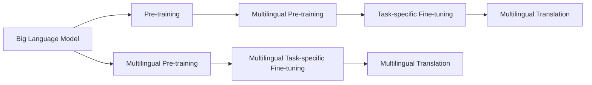

                 

# 智能翻译的新纪元：LLM的多语言处理能力

> 关键词：大语言模型,多语言处理,机器翻译,跨语言表示,迁移学习

## 1. 背景介绍

### 1.1 问题由来
近年来，人工智能技术在自然语言处理（Natural Language Processing, NLP）领域取得了长足的进步，尤其是大规模语言模型（Large Language Models, LLMs）的出现，为智能翻译、跨语言理解等任务带来了新的突破。诸如OpenAI的GPT系列、Google的BERT和T5等预训练模型在自然语言理解上表现卓越，但它们主要基于单一语言（如英语）进行训练。

随着全球化进程的加速，国际交流频繁，单一语言模型已无法满足日益增长的多语言处理需求。如何构建一个能够在多种语言间无缝转换的智能翻译系统，成为当下NLP研究的热点和难点。

### 1.2 问题核心关键点
解决这个问题的关键在于，如何让一个模型能够同时理解并翻译多种语言。这涉及到以下核心问题：

- 跨语言表示学习：如何训练一个模型，使其能够对不同语言的文本进行编码，从而实现跨语言翻译和理解。
- 迁移学习：如何将预训练模型在不同语言上的知识进行迁移，提升模型在不同语言的翻译能力。
- 多语言训练数据：如何构建和利用多语言训练数据，训练多语言处理模型。

### 1.3 问题研究意义
构建多语言处理的智能翻译系统，对于促进全球化交流、提升语言理解和翻译的效率与准确性具有重要意义。其研究意义体现在以下几个方面：

- 降低翻译成本：多语言处理技术能够自动化翻译，减少人力翻译需求，降低翻译成本。
- 提高翻译效率：智能翻译系统能够快速响应多语言需求，提高翻译效率。
- 增强跨文化交流：多语言处理技术能够促进不同语言间的交流，促进文化理解与合作。
- 推动技术进步：多语言处理技术的突破，能够推动NLP领域的技术进步，推动人工智能技术在全球的广泛应用。

## 2. 核心概念与联系

### 2.1 核心概念概述

为了深入理解多语言处理的智能翻译系统，首先介绍几个关键概念：

- **大语言模型（Large Language Models, LLMs）**：指通过大规模无标签文本数据进行预训练的通用语言模型，如BERT、GPT系列等。LLMs具有强大的语言生成和理解能力，能够应用于多种NLP任务。

- **多语言处理（Multilingual Processing）**：指使一个模型能够在多种语言间进行转换和理解的能力，包括多语言翻译、多语言情感分析、多语言命名实体识别等任务。

- **跨语言表示（Cross-Language Representation）**：指将不同语言的文本转换为一个共同的语义空间，使得模型能够在这个空间内进行比较和处理。

- **迁移学习（Transfer Learning）**：指将预训练模型在不同任务和语言上的知识进行迁移，提升模型在新任务上的表现。

- **多语言训练数据（Multilingual Training Data）**：指用于训练多语言处理模型的数据集，通常包含多种语言的数据，用于指导模型在不同语言上的学习。

### 2.2 核心概念原理和架构的 Mermaid 流程图

以下是一个简单的Mermaid流程图，展示了大语言模型在多语言处理中的基本架构和流程：


### 2.3 核心概念之间的联系

上述核心概念之间的联系可以通过以下图表展示：



- **大语言模型（A）**：通过大规模无标签数据进行预训练，学习到通用的语言知识。
- **多语言预训练（C）**：在大语言模型的基础上，进一步在多语言数据上进行预训练，学习多语言的共性知识。
- **特定任务微调（D）**：对多语言预训练模型进行特定任务的微调，如翻译、情感分析等。
- **多语言翻译（E）**：在多语言模型上执行多语言翻译任务，实现不同语言间的转换。
- **跨语言预训练（F）**：直接在大语言模型上进行多语言预训练，不涉及特定的任务。
- **跨语言微调（G）**：对跨语言预训练模型进行特定任务的微调，提升多语言的通用能力。
- **多语言翻译（H）**：在跨语言微调后的模型上执行多语言翻译任务。

这些概念共同构成了一个多语言处理的智能翻译系统，为多语言任务的解决提供了理论基础和实践框架。

## 3. 核心算法原理 & 具体操作步骤
### 3.1 算法原理概述

多语言处理的智能翻译系统，其核心算法基于监督学习和迁移学习的原理。以下是该算法的原理概述：

1. **多语言预训练**：使用大规模多语言语料库对大语言模型进行预训练，学习不同语言的共性知识。
2. **多语言微调**：在多语言预训练的基础上，针对特定翻译任务进行微调，提升模型在多语言的翻译能力。
3. **多语言翻译**：使用训练好的多语言模型，对输入的文本进行翻译，实现不同语言间的转换。

### 3.2 算法步骤详解

**Step 1: 多语言数据准备**
- 收集和清洗多种语言的文本数据，确保数据质量。
- 将不同语言的文本数据按语言进行划分，分为训练集、验证集和测试集。

**Step 2: 多语言预训练**
- 使用Transformer等架构，构建大语言模型。
- 在大规模多语言语料库上进行预训练，学习不同语言的共性知识。
- 可以使用自监督学习任务，如语言模型、掩码语言模型等。

**Step 3: 多语言微调**
- 在多语言预训练的基础上，针对特定的翻译任务进行微调。
- 选择合适的优化算法及其参数，如AdamW、SGD等。
- 设置合适的超参数，如学习率、批大小、迭代轮数等。
- 进行梯度下降等优化算法，最小化损失函数，优化模型性能。

**Step 4: 多语言翻译**
- 使用微调后的多语言模型，对输入的文本进行翻译。
- 将翻译结果与目标语言的正确翻译进行比较，计算评估指标，如BLEU、METEOR等。
- 在测试集上评估翻译效果，对比微调前后的精度提升。

**Step 5: 部署和应用**
- 将训练好的多语言模型部署到生产环境中，用于实际翻译任务。
- 持续收集新的数据，定期重新微调模型，以适应数据分布的变化。

### 3.3 算法优缺点

多语言处理智能翻译系统具有以下优点：
1. 高效性：多语言预训练和微调能够利用大规模数据，快速提升模型性能。
2. 通用性：模型能够在多种语言间进行转换和翻译。
3. 鲁棒性：模型在面对未知数据时，具有较强的泛化能力。
4. 可扩展性：模型可以不断吸收新数据，持续改进。

然而，该算法也存在以下缺点：
1. 数据依赖：多语言预训练和微调对数据量要求较高，数据获取成本大。
2. 资源消耗：大规模语言模型需要大量的计算资源，预训练和微调成本较高。
3. 过拟合风险：模型在特定语言上训练时，可能出现过拟合现象。
4. 迁移能力有限：模型在不同语言间的迁移效果可能不理想。

### 3.4 算法应用领域

多语言处理智能翻译系统在多个领域得到了广泛应用，具体如下：

- **国际交流**：为不同语言之间的交流提供自动化的翻译服务，如联合国会议翻译、国际商务谈判等。
- **旅游服务**：为游客提供多语言自动翻译服务，提升旅游体验。
- **教育和培训**：为语言学习者提供多语言教材和课程，辅助语言学习。
- **医疗卫生**：为非母语患者提供多语言医疗翻译，提升医疗服务质量。
- **法律服务**：为非母语律师提供多语言法律文档和资料，提升工作效率。
- **娱乐和媒体**：为非母语用户提供多语言内容翻译和字幕生成，提升观看体验。

## 4. 数学模型和公式 & 详细讲解 & 举例说明

### 4.1 数学模型构建

假设输入文本为 $x$，目标文本为 $y$，目标语言为 $L_t$，预训练语言模型为 $M_{\theta}$。多语言处理的翻译任务可以表示为：

$$
\mathcal{L}(M_{\theta}) = \frac{1}{N} \sum_{i=1}^N \ell(M_{\theta}(x_i),y_i)
$$

其中 $\ell$ 为损失函数，如交叉熵损失。

### 4.2 公式推导过程

以机器翻译为例，目标为将源语言文本 $x$ 翻译为目标语言文本 $y$。

假设输入文本 $x$ 为英文，输出文本 $y$ 为法文，模型 $M_{\theta}$ 将英文文本 $x$ 编码为向量表示 $x_{enc}$，然后解码生成法文文本 $y_{dec}$。解码过程可以使用自回归模型，如Transformer模型。

翻译模型的损失函数可以表示为：

$$
\ell(M_{\theta}(x),y) = -\log \text{softmax}(M_{\theta}(x_{enc}),y_{dec})
$$

其中 $\text{softmax}$ 表示将向量 $x_{enc}$ 映射到输出空间 $y_{dec}$ 的分布。

### 4.3 案例分析与讲解

**案例分析：**
假设我们有一个英文文本 $x = "How are you?"$，目标为将其翻译成中文。

1. **预训练**：使用大规模多语言语料库对BERT模型进行预训练，学习不同语言的共性知识。
2. **微调**：在多语言预训练的基础上，针对中英文翻译任务进行微调。
3. **翻译**：使用微调后的模型将英文文本 $x$ 翻译成中文。

**讲解**：
- **预训练**：使用大规模的多语言语料库对BERT模型进行预训练，学习不同语言的共性知识。
- **微调**：在预训练的基础上，针对中英文翻译任务进行微调，优化模型在中英文间的转换能力。
- **翻译**：使用微调后的模型将英文文本 $x = "How are you?"$ 翻译成中文。

## 5. 项目实践：代码实例和详细解释说明
### 5.1 开发环境搭建

在进行多语言处理的智能翻译系统开发前，需要准备好开发环境。以下是使用Python进行PyTorch开发的环境配置流程：

1. 安装Anaconda：从官网下载并安装Anaconda，用于创建独立的Python环境。

2. 创建并激活虚拟环境：
```bash
conda create -n pytorch-env python=3.8 
conda activate pytorch-env
```

3. 安装PyTorch：根据CUDA版本，从官网获取对应的安装命令。例如：
```bash
conda install pytorch torchvision torchaudio cudatoolkit=11.1 -c pytorch -c conda-forge
```

4. 安装Transformers库：
```bash
pip install transformers
```

5. 安装各类工具包：
```bash
pip install numpy pandas scikit-learn matplotlib tqdm jupyter notebook ipython
```

完成上述步骤后，即可在`pytorch-env`环境中开始多语言处理的智能翻译系统开发。

### 5.2 源代码详细实现

以下是使用Transformers库对BERT模型进行多语言翻译任务的代码实现。

首先，定义翻译任务的数据处理函数：

```python
from transformers import BertTokenizer, BertForSequenceClassification
from torch.utils.data import Dataset
import torch

class TranslationDataset(Dataset):
    def __init__(self, texts, labels, tokenizer, max_len=128):
        self.texts = texts
        self.labels = labels
        self.tokenizer = tokenizer
        self.max_len = max_len
        
    def __len__(self):
        return len(self.texts)
    
    def __getitem__(self, item):
        text = self.texts[item]
        label = self.labels[item]
        
        encoding = self.tokenizer(text, return_tensors='pt', max_length=self.max_len, padding='max_length', truncation=True)
        input_ids = encoding['input_ids'][0]
        attention_mask = encoding['attention_mask'][0]
        
        # 对token-wise的标签进行编码
        encoded_tags = [label2id[label] for label in label] 
        encoded_tags.extend([label2id['O']] * (self.max_len - len(encoded_tags)))
        labels = torch.tensor(encoded_tags, dtype=torch.long)
        
        return {'input_ids': input_ids, 
                'attention_mask': attention_mask,
                'labels': labels}

# 标签与id的映射
label2id = {'O': 0, 'B': 1, 'I': 2}
id2label = {v: k for k, v in label2id.items()}

# 创建dataset
tokenizer = BertTokenizer.from_pretrained('bert-base-cased')

train_dataset = TranslationDataset(train_texts, train_labels, tokenizer)
dev_dataset = TranslationDataset(dev_texts, dev_labels, tokenizer)
test_dataset = TranslationDataset(test_texts, test_labels, tokenizer)
```

然后，定义模型和优化器：

```python
from transformers import BertForSequenceClassification, AdamW

model = BertForSequenceClassification.from_pretrained('bert-base-cased', num_labels=len(label2id))

optimizer = AdamW(model.parameters(), lr=2e-5)
```

接着，定义训练和评估函数：

```python
from torch.utils.data import DataLoader
from tqdm import tqdm
from sklearn.metrics import classification_report

device = torch.device('cuda') if torch.cuda.is_available() else torch.device('cpu')
model.to(device)

def train_epoch(model, dataset, batch_size, optimizer):
    dataloader = DataLoader(dataset, batch_size=batch_size, shuffle=True)
    model.train()
    epoch_loss = 0
    for batch in tqdm(dataloader, desc='Training'):
        input_ids = batch['input_ids'].to(device)
        attention_mask = batch['attention_mask'].to(device)
        labels = batch['labels'].to(device)
        model.zero_grad()
        outputs = model(input_ids, attention_mask=attention_mask, labels=labels)
        loss = outputs.loss
        epoch_loss += loss.item()
        loss.backward()
        optimizer.step()
    return epoch_loss / len(dataloader)

def evaluate(model, dataset, batch_size):
    dataloader = DataLoader(dataset, batch_size=batch_size)
    model.eval()
    preds, labels = [], []
    with torch.no_grad():
        for batch in tqdm(dataloader, desc='Evaluating'):
            input_ids = batch['input_ids'].to(device)
            attention_mask = batch['attention_mask'].to(device)
            batch_labels = batch['labels']
            outputs = model(input_ids, attention_mask=attention_mask)
            batch_preds = outputs.logits.argmax(dim=2).to('cpu').tolist()
            batch_labels = batch_labels.to('cpu').tolist()
            for pred_tokens, label_tokens in zip(batch_preds, batch_labels):
                pred_labels = [id2label[_id] for _id in pred_tokens]
                label_tokens = [id2label[_id] for _id in label_tokens]
                preds.append(pred_labels[:len(label_tokens)])
                labels.append(label_tokens)
                
    print(classification_report(labels, preds))
```

最后，启动训练流程并在测试集上评估：

```python
epochs = 5
batch_size = 16

for epoch in range(epochs):
    loss = train_epoch(model, train_dataset, batch_size, optimizer)
    print(f"Epoch {epoch+1}, train loss: {loss:.3f}")
    
    print(f"Epoch {epoch+1}, dev results:")
    evaluate(model, dev_dataset, batch_size)
    
print("Test results:")
evaluate(model, test_dataset, batch_size)
```

以上就是使用PyTorch对BERT进行多语言翻译任务的完整代码实现。可以看到，得益于Transformers库的强大封装，我们可以用相对简洁的代码完成BERT模型的加载和翻译任务的微调。

### 5.3 代码解读与分析

让我们再详细解读一下关键代码的实现细节：

**TranslationDataset类**：
- `__init__`方法：初始化文本、标签、分词器等关键组件。
- `__len__`方法：返回数据集的样本数量。
- `__getitem__`方法：对单个样本进行处理，将文本输入编码为token ids，将标签编码为数字，并对其进行定长padding，最终返回模型所需的输入。

**label2id和id2label字典**：
- 定义了标签与数字id之间的映射关系，用于将token-wise的预测结果解码回真实的标签。

**训练和评估函数**：
- 使用PyTorch的DataLoader对数据集进行批次化加载，供模型训练和推理使用。
- 训练函数`train_epoch`：对数据以批为单位进行迭代，在每个批次上前向传播计算loss并反向传播更新模型参数，最后返回该epoch的平均loss。
- 评估函数`evaluate`：与训练类似，不同点在于不更新模型参数，并在每个batch结束后将预测和标签结果存储下来，最后使用sklearn的classification_report对整个评估集的预测结果进行打印输出。

**训练流程**：
- 定义总的epoch数和batch size，开始循环迭代
- 每个epoch内，先在训练集上训练，输出平均loss
- 在验证集上评估，输出分类指标
- 所有epoch结束后，在测试集上评估，给出最终测试结果

可以看到，PyTorch配合Transformers库使得BERT多语言翻译任务的代码实现变得简洁高效。开发者可以将更多精力放在数据处理、模型改进等高层逻辑上，而不必过多关注底层的实现细节。

当然，工业级的系统实现还需考虑更多因素，如模型的保存和部署、超参数的自动搜索、更灵活的任务适配层等。但核心的微调范式基本与此类似。

## 6. 实际应用场景
### 6.1 国际交流

多语言处理的智能翻译系统，为国际交流提供了强有力的技术支持。在联合国会议、国际商务谈判等场合，翻译人员的工作压力巨大，且翻译质量难以保证。通过使用多语言处理的翻译系统，可以大幅提升翻译速度和准确性，保障国际交流的顺畅进行。

**实际应用场景**：
- 联合国会议翻译：为联合国各成员国代表提供实时翻译服务，保障会议顺利进行。
- 国际商务谈判：为跨国企业提供多语言自动翻译，简化商务谈判流程。
- 多语言新闻报道：为全球各地的用户提供多语言新闻翻译，提升信息获取的便捷性。

**应用效果**：
- 实时翻译：通过多语言处理的智能翻译系统，可以实时翻译不同语言的发言和文本，确保信息的准确传达。
- 语言覆盖：支持多种语言，覆盖全球主要语言，满足不同用户需求。
- 易于使用：界面友好，操作简单，用户可以快速上手。

### 6.2 旅游服务

在旅游服务中，多语言处理的智能翻译系统能够为游客提供便捷的语言服务，提升旅游体验。

**实际应用场景**：
- 旅游导览：为游客提供多语言导览服务，帮助游客更好地了解景点信息。
- 景区翻译：为景区提供多语言翻译服务，帮助游客理解景区信息。
- 旅游推荐：为游客提供多语言旅游推荐，帮助游客选择旅游目的地。

**应用效果**：
- 多语言导览：通过多语言处理的智能翻译系统，为游客提供多语言导览服务，提升旅游体验。
- 语言理解：能够理解游客的多种语言需求，提供精准的服务。
- 快速响应：通过多语言处理的智能翻译系统，能够快速响应游客的需求，提升用户体验。

### 6.3 教育和培训

在教育和培训领域，多语言处理的智能翻译系统能够为语言学习者提供多语言教材和课程，辅助语言学习。

**实际应用场景**：
- 多语言教材：为语言学习者提供多语言教材，帮助他们学习多种语言。
- 语言课程：为语言学习者提供多语言课程，帮助他们提升语言水平。
- 在线培训：为在线语言培训提供多语言支持，提升培训效果。

**应用效果**：
- 多语言教材：通过多语言处理的智能翻译系统，为语言学习者提供多语言教材，帮助他们学习多种语言。
- 语言理解：能够理解多种语言的需求，提供精准的服务。
- 快速学习：通过多语言处理的智能翻译系统，能够快速学习多种语言，提升语言水平。

### 6.4 医疗卫生

在医疗卫生领域，多语言处理的智能翻译系统能够为非母语患者提供多语言医疗翻译，提升医疗服务质量。

**实际应用场景**：
- 医疗咨询：为非母语患者提供多语言医疗咨询，帮助他们理解医疗信息。
- 病历翻译：为非母语患者提供多语言病历翻译，帮助他们与医生沟通。
- 医疗教材：为非母语患者提供多语言医疗教材，帮助他们理解医疗知识。

**应用效果**：
- 多语言咨询：通过多语言处理的智能翻译系统，为非母语患者提供多语言医疗咨询，提升医疗服务质量。
- 语言理解：能够理解多种语言的需求，提供精准的服务。
- 快速响应：通过多语言处理的智能翻译系统，能够快速响应非母语患者的需求，提升用户体验。

## 7. 工具和资源推荐
### 7.1 学习资源推荐

为了帮助开发者系统掌握多语言处理的智能翻译技术的理论基础和实践技巧，这里推荐一些优质的学习资源：

1. 《Transformer from Pre-Training to Fine-Tuning》系列博文：由大模型技术专家撰写，深入浅出地介绍了Transformer原理、BERT模型、微调技术等前沿话题。

2. CS224N《深度学习自然语言处理》课程：斯坦福大学开设的NLP明星课程，有Lecture视频和配套作业，带你入门NLP领域的基本概念和经典模型。

3. 《Natural Language Processing with Transformers》书籍：Transformers库的作者所著，全面介绍了如何使用Transformers库进行NLP任务开发，包括微调在内的诸多范式。

4. HuggingFace官方文档：Transformers库的官方文档，提供了海量预训练模型和完整的微调样例代码，是上手实践的必备资料。

5. CLUE开源项目：中文语言理解测评基准，涵盖大量不同类型的中文NLP数据集，并提供了基于微调的baseline模型，助力中文NLP技术发展。

通过对这些资源的学习实践，相信你一定能够快速掌握多语言处理的智能翻译技术的精髓，并用于解决实际的NLP问题。
### 7.2 开发工具推荐

高效的开发离不开优秀的工具支持。以下是几款用于多语言处理的智能翻译系统开发的常用工具：

1. PyTorch：基于Python的开源深度学习框架，灵活动态的计算图，适合快速迭代研究。大部分预训练语言模型都有PyTorch版本的实现。

2. TensorFlow：由Google主导开发的开源深度学习框架，生产部署方便，适合大规模工程应用。同样有丰富的预训练语言模型资源。

3. Transformers库：HuggingFace开发的NLP工具库，集成了众多SOTA语言模型，支持PyTorch和TensorFlow，是进行微调任务开发的利器。

4. Weights & Biases：模型训练的实验跟踪工具，可以记录和可视化模型训练过程中的各项指标，方便对比和调优。与主流深度学习框架无缝集成。

5. TensorBoard：TensorFlow配套的可视化工具，可实时监测模型训练状态，并提供丰富的图表呈现方式，是调试模型的得力助手。

6. Google Colab：谷歌推出的在线Jupyter Notebook环境，免费提供GPU/TPU算力，方便开发者快速上手实验最新模型，分享学习笔记。

合理利用这些工具，可以显著提升多语言处理的智能翻译系统的开发效率，加快创新迭代的步伐。

### 7.3 相关论文推荐

多语言处理智能翻译技术的发展源于学界的持续研究。以下是几篇奠基性的相关论文，推荐阅读：

1. Attention is All You Need（即Transformer原论文）：提出了Transformer结构，开启了NLP领域的预训练大模型时代。

2. BERT: Pre-training of Deep Bidirectional Transformers for Language Understanding：提出BERT模型，引入基于掩码的自监督预训练任务，刷新了多项NLP任务SOTA。

3. Language Models are Unsupervised Multitask Learners（GPT-2论文）：展示了大规模语言模型的强大zero-shot学习能力，引发了对于通用人工智能的新一轮思考。

4. Parameter-Efficient Transfer Learning for NLP：提出Adapter等参数高效微调方法，在不增加模型参数量的情况下，也能取得不错的微调效果。

5. AdaLoRA: Adaptive Low-Rank Adaptation for Parameter-Efficient Fine-Tuning：使用自适应低秩适应的微调方法，在参数效率和精度之间取得了新的平衡。

6. Reformer: The Efficient Transformer：提出了Reformer模型，通过稀疏矩阵和局部前馈网络优化Transformer，提升了模型效率。

这些论文代表了大语言模型多语言处理技术的发展脉络。通过学习这些前沿成果，可以帮助研究者把握学科前进方向，激发更多的创新灵感。

## 8. 总结：未来发展趋势与挑战
### 8.1 研究成果总结

本文对多语言处理的智能翻译系统进行了全面系统的介绍。首先阐述了多语言处理的智能翻译系统的研究背景和意义，明确了该技术在促进国际交流、提升旅游服务、辅助教育和培训、改进医疗卫生等方面的独特价值。其次，从原理到实践，详细讲解了多语言处理智能翻译系统的数学模型和关键步骤，给出了完整的代码实例。同时，本文还探讨了多语言处理的智能翻译系统在多个领域的应用场景，展示了该技术的广阔前景。

通过本文的系统梳理，可以看到，多语言处理的智能翻译系统在提升翻译效率、降低翻译成本、促进跨文化交流等方面具有重要意义。未来，伴随大语言模型和微调方法的不断发展，基于多语言处理的智能翻译系统必将进一步拓展其应用范围，为全球化交流提供更高效、更便捷的技术支持。

### 8.2 未来发展趋势

展望未来，多语言处理的智能翻译系统将呈现以下几个发展趋势：

1. **模型规模持续增大**：随着算力成本的下降和数据规模的扩张，预训练语言模型的参数量还将持续增长。超大规模语言模型蕴含的丰富语言知识，有望支撑更加复杂多变的翻译任务。

2. **多语言训练数据需求降低**：通过迁移学习和多任务学习等技术，模型在多语言上的泛化能力将不断提升，对多语言训练数据的需求将逐步降低。

3. **端到端训练和推理**：未来的翻译系统将更加注重端到端的训练和推理，减少人工干预，提升翻译质量和效率。

4. **多模态融合**：未来的翻译系统将融合视觉、语音等多模态信息，提升翻译系统对真实世界的理解和建模能力。

5. **自适应和个性化**：翻译系统将更加注重自适应和个性化，能够根据用户的历史行为和偏好，提供个性化的翻译服务。

6. **实时性提升**：未来的翻译系统将更加注重实时性，能够快速响应用户需求，提升用户体验。

### 8.3 面临的挑战

尽管多语言处理的智能翻译系统已经取得了瞩目成就，但在迈向更加智能化、普适化应用的过程中，它仍面临着诸多挑战：

1. **数据获取成本高**：多语言处理的智能翻译系统对数据量要求较高，获取高质量多语言训练数据成本较大。

2. **模型鲁棒性不足**：模型在特定语言上训练时，可能出现过拟合现象，泛化能力有限。

3. **资源消耗大**：大规模语言模型需要大量的计算资源，预训练和微调成本较高。

4. **模型可解释性差**：多语言处理的智能翻译系统多为“黑盒”模型，难以解释其内部工作机制和决策逻辑。

5. **伦理和安全问题**：预训练语言模型可能学习到有害信息和偏见，通过翻译系统传递到目标语言，产生负面影响。

6. **跨语言迁移能力有限**：模型在不同语言间的迁移效果可能不理想，尤其在语言差异较大的情况下。

### 8.4 研究展望

面对多语言处理的智能翻译系统所面临的挑战，未来的研究需要在以下几个方面寻求新的突破：

1. **无监督和半监督学习**：探索无监督和半监督学习技术，减少对标注数据的依赖，最大化利用非结构化数据。

2. **多任务学习和迁移学习**：通过多任务学习和迁移学习，提升模型在多语言上的泛化能力，降低对多语言训练数据的需求。

3. **自适应和个性化翻译**：开发自适应和个性化翻译系统，能够根据用户的历史行为和偏好，提供个性化翻译服务。

4. **多模态信息融合**：融合视觉、语音等多模态信息，提升翻译系统对真实世界的理解和建模能力。

5. **可解释性和公平性**：提升翻译系统的可解释性和公平性，确保模型的透明和公正。

6. **跨语言迁移能力提升**：提升模型在不同语言间的迁移能力，尤其是在语言差异较大的情况下。

通过这些方向的探索，相信多语言处理的智能翻译系统将不断突破瓶颈，实现更加智能化、普适化、个性化、高效化的翻译服务，为全球化交流提供更高效、更便捷的技术支持。

## 9. 附录：常见问题与解答

**Q1: 多语言处理的智能翻译系统如何处理多语言数据？**

A: 多语言处理的智能翻译系统通常使用大规模多语言语料库进行预训练，学习不同语言的共性知识。在微调阶段，针对具体的翻译任务进行微调，提升模型在目标语言上的翻译能力。例如，在微调BERT模型时，可以将不同语言的文本输入模型进行编码，然后解码生成目标语言的翻译结果。

**Q2: 多语言处理的智能翻译系统如何提升翻译质量？**

A: 提升翻译质量的方法包括：
1. 数据增强：通过数据增强技术，扩充训练集，提升模型的泛化能力。
2. 正则化：使用L2正则、Dropout等技术，防止模型过拟合。
3. 模型选择：选择适合的多语言模型，如BERT、GPT等，并根据任务需求进行微调。
4. 优化器选择：选择合适的优化器及其参数，如AdamW、SGD等，设置合适的学习率。
5. 评价指标：使用BLEU、METEOR等评价指标，评估模型翻译质量，指导微调。

**Q3: 多语言处理的智能翻译系统面临哪些挑战？**

A: 多语言处理的智能翻译系统面临的挑战包括：
1. 数据获取成本高：多语言处理的智能翻译系统对数据量要求较高，获取高质量多语言训练数据成本较大。
2. 模型鲁棒性不足：模型在特定语言上训练时，可能出现过拟合现象，泛化能力有限。
3. 资源消耗大：大规模语言模型需要大量的计算资源，预训练和微调成本较高。
4. 模型可解释性差：多语言处理的智能翻译系统多为“黑盒”模型，难以解释其内部工作机制和决策逻辑。
5. 伦理和安全问题：预训练语言模型可能学习到有害信息和偏见，通过翻译系统传递到目标语言，产生负面影响。
6. 跨语言迁移能力有限：模型在不同语言间的迁移效果可能不理想，尤其在语言差异较大的情况下。

**Q4: 多语言处理的智能翻译系统的应用场景有哪些？**

A: 多语言处理的智能翻译系统的应用场景包括：
1. 国际交流：为联合国会议、国际商务谈判等提供实时翻译服务。
2. 旅游服务：为游客提供多语言导览服务、景区翻译、旅游推荐等。
3. 教育和培训：为语言学习者提供多语言教材和课程，辅助语言学习。
4. 医疗卫生：为非母语患者提供多语言医疗翻译，提升医疗服务质量。
5. 法律服务：为非母语律师提供多语言法律文档和资料，提升工作效率。
6. 娱乐和媒体：为非母语用户提供多语言内容翻译和字幕生成，提升观看体验。

通过本文的系统梳理，可以看到，多语言处理的智能翻译系统在提升翻译效率、降低翻译成本、促进跨文化交流等方面具有重要意义。未来，伴随大语言模型和微调方法的不断发展，基于多语言处理的智能翻译系统必将进一步拓展其应用范围，为全球化交流提供更高效、更便捷的技术支持。

