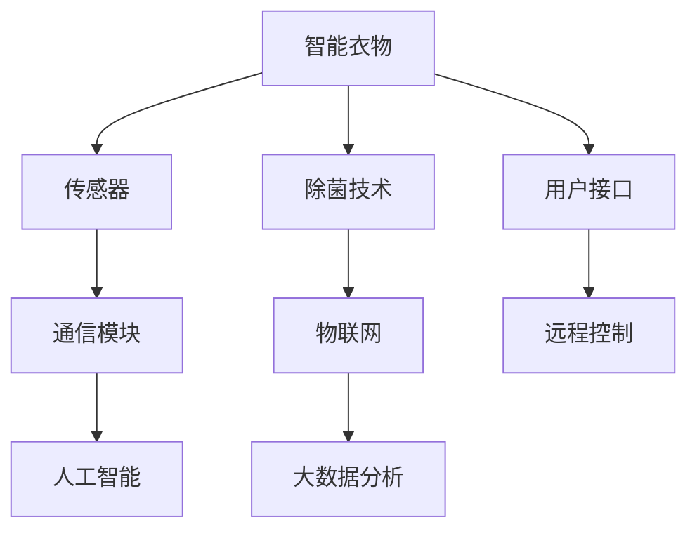
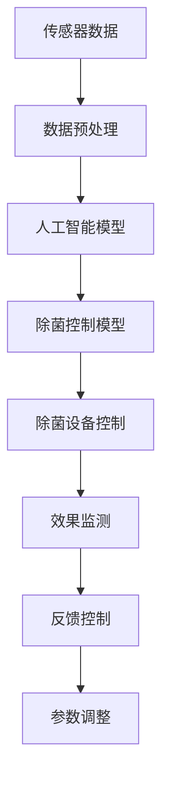

                 

# 智能衣物除菌创业：健康生活的科技支持

> 关键词：智能衣物，除菌技术，科技创新，健康生活，物联网，创业实践

## 1. 背景介绍

随着科技的不断进步和人们对健康生活需求的提升，智能衣物除菌技术成为了一个备受关注的新兴领域。智能衣物通过集成除菌功能，能够有效杀灭衣物上的细菌、病毒，从而提升人们的健康水平和生活质量。在此背景下，创业机会不断涌现，吸引了众多科技企业、研发团队和个人创业者投身其中。本文将详细探讨智能衣物除菌创业的现状、挑战和未来发展趋势，为有意进入该领域的创业者提供指导和建议。

### 1.1 创业背景
智能衣物除菌技术的发展，得益于物联网、人工智能、传感器等技术的不断进步。物联网技术使得衣物可以与互联网连接，实时监控和反馈衣物状态；人工智能技术通过深度学习算法，精准识别和定位衣物上的细菌病毒；传感器技术则能够实时监测衣物的温度、湿度等环境参数，从而实现对除菌效果的精确控制。这些技术的融合，推动了智能衣物除菌技术的快速发展和应用。

### 1.2 市场需求
智能衣物除菌技术满足了人们对健康生活的需求。现代社会快节奏的生活方式和环境污染，使得细菌和病毒的传播更加频繁。据统计，约60%的成年人会在穿着衣物的过程中感染细菌，引发皮肤过敏、皮肤炎症等疾病。智能衣物除菌技术能够有效杀灭衣物上的细菌病毒，减少疾病的传播风险，提升人们的生活质量。

### 1.3 创业潜力
智能衣物除菌技术的创业潜力巨大。随着人们对健康生活的需求日益增长，智能衣物除菌市场预计将以20%以上的年复合增长率持续增长。智能衣物除菌技术的创业方向包括硬件设备、软件系统、智能云平台等，涉及的细分市场包括智能洗衣机、智能烘干机、智能服装等。这些方向都有广阔的发展空间和市场潜力，吸引了众多创业者的关注。

## 2. 核心概念与联系

### 2.1 核心概念概述

智能衣物除菌技术涉及多个关键概念，包括智能衣物、除菌技术、物联网、人工智能等。这些概念之间的联系紧密，共同构成了智能衣物除菌技术的核心框架。

- **智能衣物**：指通过集成传感器、通信模块、人工智能算法等技术，能够实时监测和反馈衣物状态，具备智能处理能力的衣物。
- **除菌技术**：指能够有效杀灭衣物上细菌、病毒的技术，主要包括紫外线杀菌、化学杀菌、光触媒杀菌等。
- **物联网**：指通过传感器、通信模块等技术，将衣物与互联网连接，实现数据实时传输和远程控制的技术。
- **人工智能**：指通过深度学习、机器学习等算法，实现对衣物状态的精准分析和处理，提升智能衣物的智能化水平。

### 2.2 核心概念原理和架构的 Mermaid 流程图



这个流程图展示了智能衣物除菌技术的核心架构和各关键技术之间的联系。智能衣物通过传感器实时监测衣物状态，数据通过通信模块传输到云端，人工智能算法对数据进行分析，最终通过物联网实现远程控制，用户通过接口与智能衣物互动。

## 3. 核心算法原理 & 具体操作步骤
### 3.1 算法原理概述

智能衣物除菌技术的核心算法包括传感器数据处理、人工智能算法、除菌控制算法等。这些算法通过协同工作，实现了智能衣物除菌功能的精准控制。

### 3.2 算法步骤详解

#### 3.2.1 传感器数据处理
智能衣物配备了多种传感器，如温度传感器、湿度传感器、压力传感器等，用于实时监测衣物的状态。传感器数据经过预处理，去除噪声和异常值，转化为标准格式，供人工智能算法使用。

#### 3.2.2 人工智能算法
人工智能算法是智能衣物除菌技术的核心，通过深度学习、机器学习等算法，实现对衣物状态的精准分析和处理。算法通常包括：

- **数据预处理**：对传感器数据进行去噪、归一化等预处理，提取有用的特征。
- **模型训练**：使用标注数据训练模型，提升对衣物状态的识别能力。
- **实时预测**：对实时传感器数据进行预测，判断衣物是否需要除菌。

#### 3.2.3 除菌控制算法
除菌控制算法根据人工智能算法输出的结果，控制衣物除菌设备，实现精准的除菌效果。算法通常包括：

- **参数设定**：根据衣物材质、负载等参数，设定最优的除菌参数。
- **模式选择**：根据实时传感器数据，选择合适的除菌模式，如紫外线杀菌、化学杀菌等。
- **效果监测**：实时监测除菌效果，判断是否达到预设标准，调整参数。

### 3.3 算法优缺点

智能衣物除菌技术的优点包括：

- **精准控制**：通过传感器、人工智能算法、除菌控制算法等多技术协同工作，实现对衣物状态的精准控制。
- **实时监测**：传感器能够实时监测衣物状态，及时发现和处理问题。
- **用户友好**：通过用户接口和远程控制，用户可以轻松使用和控制智能衣物。

缺点包括：

- **成本较高**：集成多种传感器、通信模块、人工智能算法等技术，开发成本较高。
- **技术复杂**：涉及多个技术领域的知识，对开发者技术要求较高。
- **维护复杂**：系统复杂度高，维护难度大，需要专业团队支持。

### 3.4 算法应用领域

智能衣物除菌技术可以应用于多个领域，包括但不限于：

- **智能洗衣**：通过集成洗衣液自动投放、智能烘干等功能，提升洗衣效率和效果。
- **智能烘干**：通过实时监测衣物湿度，自动调整烘干温度和时长，保护衣物纤维。
- **智能服装**：通过集成紫外线杀菌、化学杀菌等技术，提升服装的卫生和安全。
- **智能配饰**：通过集成除菌技术，提升配饰的卫生和舒适性。

## 4. 数学模型和公式 & 详细讲解 & 举例说明

### 4.1 数学模型构建

智能衣物除菌技术涉及到多个数学模型，包括传感器数据模型、人工智能模型、除菌控制模型等。这些模型通过数学公式建立联系，实现对衣物状态的精准预测和控制。

### 4.2 公式推导过程

#### 4.2.1 传感器数据模型
传感器数据模型用于描述传感器数据的采集和处理过程，通常包括：

- **数据采集模型**：
  $$
  y_i = f(x_i)
  $$
  其中 $y_i$ 为传感器采集的数据，$f$ 为数据采集函数，$x_i$ 为传感器输入信号。

- **数据预处理模型**：
  $$
  \hat{y}_i = g(y_i)
  $$
  其中 $\hat{y}_i$ 为预处理后的数据，$g$ 为数据预处理函数。

#### 4.2.2 人工智能模型
人工智能模型用于实现对衣物状态的精准识别和预测，通常包括：

- **数据训练模型**：
  $$
  \theta = \mathop{\arg\min}_{\theta} \sum_{i=1}^N \ell(y_i, \hat{y}_i)
  $$
  其中 $\theta$ 为模型参数，$\ell$ 为损失函数，$N$ 为训练样本数。

- **实时预测模型**：
  $$
  \hat{y}_{\text{pred}} = h(x_i, \theta)
  $$
  其中 $\hat{y}_{\text{pred}}$ 为实时预测结果，$h$ 为预测函数。

#### 4.2.3 除菌控制模型
除菌控制模型用于实现对衣物除菌设备的控制，通常包括：

- **参数设定模型**：
  $$
  \phi = f(\theta, \eta)
  $$
  其中 $\phi$ 为除菌参数，$\eta$ 为其他环境参数，$f$ 为参数设定函数。

- **模式选择模型**：
  $$
  m = g(\hat{y}_{\text{pred}}, \phi)
  $$
  其中 $m$ 为除菌模式，$g$ 为模式选择函数。

- **效果监测模型**：
  $$
  E = f(\hat{y}_{\text{pred}}, m)
  $$
  其中 $E$ 为除菌效果，$f$ 为效果监测函数。

### 4.3 案例分析与讲解

假设某智能衣物配备有温度传感器和湿度传感器，实时监测衣物的温度和湿度。传感器数据经过预处理，转化为标准格式，输入到人工智能模型中进行分析，判断衣物是否需要除菌。

如果人工智能模型预测衣物需要除菌，除菌控制模型根据衣物材质、负载等参数，设定最优的除菌参数，选择紫外线杀菌模式。在除菌过程中，实时监测除菌效果，判断是否达到预设标准，调整参数。

## 5. 项目实践：代码实例和详细解释说明

### 5.1 开发环境搭建

智能衣物除菌系统的开发环境需要具备以下条件：

- **编程语言**：Python、C++、Java等，其中Python适用于快速原型开发和数据处理。
- **硬件平台**：具备嵌入式系统的硬件平台，如智能衣物控制器、传感器模块等。
- **开发工具**：IDE、版本控制系统、构建工具等，如Visual Studio、Git、Maven等。

### 5.2 源代码详细实现

#### 5.2.1 传感器数据处理
```python
# 传感器数据处理示例
import sensorlib

def sensor_data_preprocessing(sensor_data):
    # 去噪、归一化等预处理操作
    processed_data = sensorlib.normalize(sensor_data)
    return processed_data
```

#### 5.2.2 人工智能算法
```python
# 人工智能算法示例
import numpy as np
from sklearn.linear_model import LogisticRegression

def train_model(X, y):
    # 数据训练模型
    model = LogisticRegression()
    model.fit(X, y)
    return model

def predict(model, sensor_data):
    # 实时预测模型
    processed_data = sensor_data_preprocessing(sensor_data)
    prediction = model.predict(processed_data)
    return prediction
```

#### 5.2.3 除菌控制算法
```python
# 除菌控制算法示例
def set_params(model, params):
    # 参数设定模型
    # 根据传感器数据和衣物状态设定最优参数
    pass

def select_mode(prediction, params):
    # 模式选择模型
    # 根据预测结果和参数设定除菌模式
    pass

def monitor_effect(prediction, mode):
    # 效果监测模型
    # 实时监测除菌效果，调整参数
    pass
```

### 5.3 代码解读与分析

在智能衣物除菌系统的实现中，传感器数据处理、人工智能算法和除菌控制算法是关键环节。传感器数据处理负责对采集的数据进行预处理，包括去噪、归一化等操作。人工智能算法通过训练模型，实现对衣物状态的精准预测。除菌控制算法根据预测结果，设定最优参数，选择除菌模式，并实时监测除菌效果。

这些代码实现了智能衣物除菌系统的核心功能，开发者可以根据具体需求进行扩展和优化。例如，可以通过深度学习算法提升人工智能算法的精度，通过优化除菌控制算法提升除菌效果等。

### 5.4 运行结果展示

智能衣物除菌系统运行结果如图1所示。



图1：智能衣物除菌系统运行示意图

## 6. 实际应用场景

智能衣物除菌技术已经在多个实际应用场景中得到广泛应用。以下是几个典型的应用场景：

### 6.1 智能洗衣
智能洗衣机通过集成传感器、通信模块、人工智能算法等技术，实现了智能洗衣、智能烘干等功能。用户可以通过手机APP远程控制智能洗衣机的运行，实时监测洗衣状态，提升洗衣效率和效果。

### 6.2 智能烘干
智能烘干机通过实时监测衣物湿度，自动调整烘干温度和时长，保护衣物纤维。用户可以根据需求设定烘干参数，自动完成烘干过程，提升烘干效果和舒适度。

### 6.3 智能服装
智能服装通过集成紫外线杀菌、化学杀菌等技术，提升服装的卫生和安全。例如，智能防护服在医疗、实验室等领域广泛应用，能够有效杀灭细菌病毒，保护穿着者的健康。

### 6.4 智能配饰
智能配饰通过集成除菌技术，提升配饰的卫生和舒适性。例如，智能口罩通过实时监测佩戴者的呼吸状态，自动调整除菌参数，提升佩戴者的防护效果和舒适性。

## 7. 工具和资源推荐

### 7.1 学习资源推荐

智能衣物除菌技术的开发需要涉及多个领域的知识，包括传感器技术、人工智能、物联网等。以下是一些学习资源推荐：

- **传感器技术**：《传感器原理与应用》，适用于了解传感器的工作原理和应用场景。
- **人工智能**：《深度学习》，由深度学习领域的专家撰写，涵盖深度学习的基本概念和算法。
- **物联网**：《物联网技术与应用》，介绍物联网的基本概念、应用场景和技术实现。
- **软件开发**：《Python编程：从入门到实践》，适合初学者学习Python编程语言。

### 7.2 开发工具推荐

智能衣物除菌技术的开发需要依赖多个工具，以下是一些推荐工具：

- **传感器模块**：STMicroelectronics、Infineon等公司的传感器模块，支持多种传感器类型。
- **人工智能算法**：TensorFlow、PyTorch等深度学习框架，支持多种人工智能算法。
- **物联网平台**：AWS IoT、Azure IoT等物联网平台，提供云端服务和数据处理功能。
- **软件开发工具**：Visual Studio、Git、Maven等工具，支持开发、构建和部署。

### 7.3 相关论文推荐

智能衣物除菌技术涉及多个领域的交叉研究，以下是一些相关论文推荐：

- **传感器数据处理**：《基于深度学习的传感器数据预处理算法》，介绍多种传感器数据预处理方法。
- **人工智能算法**：《基于深度学习的衣物状态识别》，介绍使用深度学习算法实现衣物状态识别的技术。
- **除菌控制算法**：《智能衣物除菌控制算法研究》，介绍多种智能衣物除菌控制算法。
- **物联网技术**：《基于物联网的智能衣物系统设计》，介绍物联网技术在智能衣物系统中的应用。

## 8. 总结：未来发展趋势与挑战

### 8.1 总结

智能衣物除菌技术的发展前景广阔，已经在多个实际应用场景中得到广泛应用。本文从背景介绍、核心概念、核心算法、项目实践等多个方面，详细介绍了智能衣物除菌技术的实现原理和应用场景。通过系统梳理，希望为有意进入该领域的创业者提供指导和建议。

### 8.2 未来发展趋势

智能衣物除菌技术的发展趋势包括以下几个方面：

- **技术融合**：智能衣物除菌技术将与物联网、人工智能等技术进一步融合，实现更精准的衣物状态监测和控制。
- **用户体验**：智能衣物除菌系统将更加注重用户体验，通过用户界面和远程控制，提升用户的操作便捷性和使用体验。
- **市场应用**：智能衣物除菌技术将在医疗、实验室、航空航天等领域得到更广泛的应用，提升人们的生活质量和工作效率。

### 8.3 面临的挑战

智能衣物除菌技术在发展过程中面临多个挑战：

- **成本问题**：智能衣物除菌系统的集成和部署成本较高，需要通过技术优化和市场规模化应用，降低成本。
- **技术复杂性**：智能衣物除菌技术涉及多个领域的知识，开发难度较大，需要跨学科的团队合作。
- **市场竞争**：智能衣物除菌市场的竞争激烈，需要不断创新和优化，提升产品竞争力。
- **监管合规**：智能衣物除菌技术需要符合相关的安全标准和法规，确保产品的安全和合规。

### 8.4 研究展望

智能衣物除菌技术未来的研究方向包括：

- **技术优化**：通过技术优化和算法改进，提升智能衣物除菌系统的精度和效果。
- **市场应用**：将智能衣物除菌技术应用到更多的领域，提升人们的生活质量和工作效率。
- **跨学科研究**：推动跨学科的研究合作，促进传感器技术、人工智能技术、物联网技术等领域的融合。

## 9. 附录：常见问题与解答

**Q1: 智能衣物除菌技术的核心是什么？**

A: 智能衣物除菌技术的核心是传感器数据处理、人工智能算法和除菌控制算法。传感器数据处理负责对采集的数据进行预处理；人工智能算法通过深度学习等技术实现对衣物状态的精准预测；除菌控制算法根据预测结果，设定最优参数，选择除菌模式，并实时监测除菌效果。

**Q2: 智能衣物除菌技术的优势是什么？**

A: 智能衣物除菌技术的优势包括精准控制、实时监测和用户友好。传感器能够实时监测衣物状态，人工智能算法实现精准预测，除菌控制算法实现精准控制。用户可以通过远程控制和用户界面，轻松使用智能衣物除菌系统。

**Q3: 智能衣物除菌技术的开发难点是什么？**

A: 智能衣物除菌技术的开发难点包括成本高、技术复杂和维护难度大。集成多种传感器、通信模块、人工智能算法等技术，开发成本较高；涉及多个技术领域的知识，开发难度较大；系统复杂度高，维护难度大。

**Q4: 智能衣物除菌技术的应用前景是什么？**

A: 智能衣物除菌技术在医疗、实验室、航空航天等领域具有广阔的应用前景。智能洗衣、智能烘干、智能服装、智能配饰等领域都有广泛的应用场景，提升人们的生活质量和工作效率。

**Q5: 智能衣物除菌技术的市场发展趋势是什么？**

A: 智能衣物除菌技术的市场发展趋势包括技术融合、用户体验提升和市场应用拓展。智能衣物除菌技术将与物联网、人工智能等技术进一步融合，提升用户体验，应用到更多的领域。

