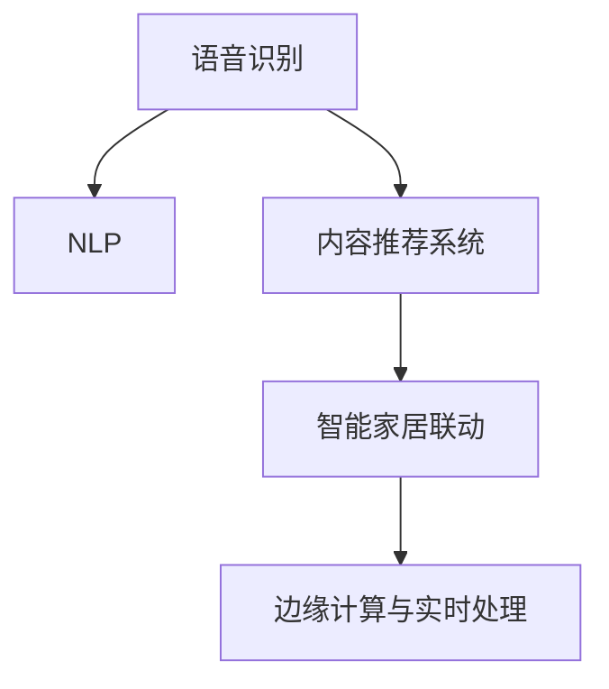

                 

# 智能音响：家庭娱乐中的注意力焦点

## 1. 背景介绍

### 1.1 问题由来

随着数字时代的到来，家庭娱乐方式发生了深刻变革。智能音响作为一种新型智能设备，迅速成为家庭娱乐中不可或缺的焦点。智能音响不仅集成了传统音响的高保真音质，更具备智能识别、语音控制、情景模式、内容推荐等先进功能，实现了从被动接受音乐到主动个性化体验的跃迁。智能音响通过强大的网络连接和计算能力，能够为家庭用户提供精准的内容推荐、智能场景联动、语音搜索等便捷服务。

### 1.2 问题核心关键点

智能音响的核心技术包括以下几点：

- **语音识别与自然语言处理(NLP)**：通过语音识别技术，将用户的口头指令转化为文本指令，再通过自然语言处理技术，理解用户的意图，进行相应的操作。
- **内容推荐系统**：通过分析用户的历史听歌记录、浏览行为等数据，推荐符合用户喜好的音乐、视频等媒体内容。
- **联网通信与智能家居联动**：通过Wi-Fi、蓝牙、红外等无线通信技术，实现与其他智能设备联动，如智能电视、智能灯光、智能空调等。
- **边缘计算与实时处理**：通过边缘计算技术，实时处理音频信号，提高响应的速度和稳定性。

智能音响的这些核心技术，不仅涉及计算机视觉、语音识别、内容推荐等多个领域，还涉及到用户隐私保护、数据安全等伦理问题，因此对其理解和应用具有重要的研究价值。

## 2. 核心概念与联系

### 2.1 核心概念概述

为更好地理解智能音响的核心技术，本节将介绍几个密切相关的核心概念：

- **语音识别与自然语言处理(NLP)**：语音识别技术是将语音信号转化为文本的过程，而自然语言处理技术则是通过文本进行语义理解和生成。智能音响通过语音识别技术，将用户口头指令转化为文本，再通过NLP技术理解和生成响应。
- **内容推荐系统**：根据用户的历史听歌记录和行为数据，推荐符合用户喜好的内容。这通常涉及机器学习算法，如协同过滤、深度学习等，通过用户画像和商品画像，匹配最合适的推荐结果。
- **联网通信与智能家居联动**：通过无线网络和协议，实现与其他智能设备的数据交互和协同工作，提供更完整的智能家居体验。
- **边缘计算与实时处理**：利用边缘计算技术，将数据和计算任务分布到各个节点进行，减小延迟，提高响应速度。

这些核心概念之间的逻辑关系可以通过以下Mermaid流程图来展示：



这个流程图展示了几大核心技术之间的联系：

1. 语音识别技术是智能音响的输入方式。
2. NLP技术是理解用户指令的核心。
3. 内容推荐系统根据用户指令，从多个媒体中选择合适的播放内容。
4. 联网通信实现与其他智能设备的联动，为用户提供更完整的智能家居体验。
5. 边缘计算技术提高智能音响的实时处理能力。

## 3. 核心算法原理 & 具体操作步骤

### 3.1 算法原理概述

智能音响的核心算法流程主要包括以下几个步骤：

1. **语音识别**：通过麦克风采集用户的语音信号，通过预处理后使用语音识别模型将其转换为文本指令。
2. **自然语言处理**：通过NLP模型解析用户指令，理解其意图。
3. **内容推荐**：根据用户的兴趣和行为数据，使用推荐算法选择最合适的内容进行播放。
4. **智能家居联动**：与其他智能设备进行通信，根据用户指令进行相应的场景联动。
5. **边缘计算**：在本地设备上进行音频处理和数据计算，提高响应速度。

### 3.2 算法步骤详解

以下是智能音响算法流程的具体步骤：

1. **语音采集与预处理**：通过麦克风采集用户的语音信号，并进行降噪、滤波等预处理操作，以提高语音识别的准确性。

2. **语音识别**：将预处理后的语音信号输入到语音识别模型中，如Google的WaveNet、Facebook的DeepSpeech等，将其转换为文本指令。

3. **自然语言处理**：将转换后的文本指令输入到NLP模型中，如BERT、GPT等，进行语义理解和生成，理解用户的具体需求。

4. **内容推荐**：根据用户的历史听歌记录、行为数据等，使用协同过滤、深度学习等推荐算法，选择最适合当前场景的内容进行播放。

5. **智能家居联动**：将用户指令转换为控制信号，通过Wi-Fi、蓝牙、红外等无线协议，与其他智能设备进行数据交互和联动，实现智能家居场景的切换。

6. **边缘计算**：在本地设备上对音频信号进行解码、降噪、音量调整等实时处理，减小延迟，提高用户体验。

### 3.3 算法优缺点

智能音响的核心算法具备以下优点：

- **高度智能化**：通过语音识别和NLP技术，能够实现自然语言交互，满足用户便捷性和个性化需求。
- **多设备联动**：通过联网通信技术，与其他智能设备联动，提供更完整的智能家居体验。
- **实时响应**：通过边缘计算技术，在本地设备上进行实时处理，提高响应的速度和稳定性。

同时，这些算法也存在一些局限性：

- **数据隐私和安全**：用户指令和行为数据需要存储和传输，存在数据隐私泄露和安全性问题。
- **算力要求高**：语音识别和NLP等算法需要较高的计算能力，对于硬件设备的要求较高。
- **复杂度较高**：算法流程涉及多个模块，需要高精度的集成和调试，开发和维护难度较大。

### 3.4 算法应用领域

智能音响的核心算法在多个领域中都有广泛的应用：

- **家居自动化**：通过智能音响与智能灯光、智能空调等设备的联动，实现智能家居场景的切换。
- **娱乐系统**：通过智能音响推荐系统，根据用户的听歌记录、行为数据，推荐适合的内容，提升用户娱乐体验。
- **语音控制**：通过智能音响的语音识别和NLP技术，用户可以通过语音控制其他智能设备，实现便捷的生活。
- **智能医疗**：通过智能音响的语音识别和NLP技术，辅助医生进行患者沟通和诊疗记录，提高医疗效率。
- **智能交通**：通过智能音响的语音识别和NLP技术，实现车机联动，提高驾驶安全性。

## 4. 数学模型和公式 & 详细讲解 & 举例说明

### 4.1 数学模型构建

智能音响的算法流程涉及多个领域的数学模型。以下是一些常见的模型及其构建方法：

- **语音识别模型**：通常使用卷积神经网络(CNN)、循环神经网络(RNN)等模型，通过大量标注的音频-文本对进行训练。
- **自然语言处理模型**：如BERT、GPT等，通过预训练和微调，学习通用的语言表示。
- **内容推荐模型**：使用协同过滤、深度学习等方法，通过用户画像和商品画像，匹配最合适的推荐结果。
- **智能家居联动模型**：利用Wi-Fi、蓝牙等协议，进行数据交互和通信。
- **边缘计算模型**：使用分布式计算和实时处理算法，进行音频信号的处理和分析。

### 4.2 公式推导过程

以下是智能音响核心算法的数学推导：

- **语音识别模型**：使用CNN和RNN模型进行语音信号的特征提取和分类。公式如下：

$$
\text{y} = \text{CNN}\left(\text{x} \right) \text{+ RNN}\left(\text{x} \right)
$$

其中，$\text{x}$ 为语音信号，$\text{y}$ 为文本指令。

- **自然语言处理模型**：使用BERT模型进行文本语义的理解和生成。公式如下：

$$
\text{y} = \text{BERT}\left(\text{x} \right)
$$

其中，$\text{x}$ 为文本指令，$\text{y}$ 为语义理解结果。

- **内容推荐模型**：使用协同过滤模型进行用户行为数据的建模和推荐。公式如下：

$$
\text{y} = \text{CosineSimilarity}\left(\text{x}_{user}, \text{x}_{item}\right) + \text{DeepLearning}\left(\text{x}_{user}, \text{x}_{item}\right)
$$

其中，$\text{x}_{user}$ 为用户画像，$\text{x}_{item}$ 为商品画像，$\text{y}$ 为推荐结果。

### 4.3 案例分析与讲解

以智能家居联动为例，介绍其主要算法流程和数学模型：

- **Wi-Fi通信**：通过Wi-Fi协议，智能音响与其他智能设备进行数据交互。公式如下：

$$
\text{Data} = \text{Wi-Fi}\left(\text{IP}, \text{SSID}\right)
$$

其中，$\text{IP}$ 为智能设备IP地址，$\text{SSID}$ 为Wi-Fi网络标识。

- **蓝牙通信**：通过蓝牙协议，智能音响与智能设备进行数据传输。公式如下：

$$
\text{Data} = \text{Bluetooth}\left(\text{MAC}, \text{channel}\right)
$$

其中，$\text{MAC}$ 为蓝牙设备MAC地址，$\text{channel}$ 为蓝牙信道。

## 5. 项目实践：代码实例和详细解释说明

### 5.1 开发环境搭建

在进行智能音响项目开发前，需要先搭建好开发环境。以下是使用Python进行PyTorch开发的环境配置流程：

1. 安装Anaconda：从官网下载并安装Anaconda，用于创建独立的Python环境。

2. 创建并激活虚拟环境：
```bash
conda create -n pytorch-env python=3.8 
conda activate pytorch-env
```

3. 安装PyTorch：根据CUDA版本，从官网获取对应的安装命令。例如：
```bash
conda install pytorch torchvision torchaudio cudatoolkit=11.1 -c pytorch -c conda-forge
```

4. 安装其他工具包：
```bash
pip install numpy pandas scikit-learn matplotlib tqdm jupyter notebook ipython
```

完成上述步骤后，即可在`pytorch-env`环境中开始智能音响的开发实践。

### 5.2 源代码详细实现

这里我们以智能音响的内容推荐系统为例，给出使用PyTorch进行模型开发的代码实现。

```python
import torch
from torch import nn
from torch.nn import functional as F

class CollaborativeFiltering(nn.Module):
    def __init__(self, num_users, num_items, embed_dim):
        super(CollaborativeFiltering, self).__init__()
        self.user_embedding = nn.Embedding(num_users, embed_dim)
        self.item_embedding = nn.Embedding(num_items, embed_dim)
        self.interaction = nn.Linear(embed_dim*2, 1)
        
    def forward(self, user_ids, item_ids):
        user_embeds = self.user_embedding(user_ids)
        item_embeds = self.item_embedding(item_ids)
        stacked = torch.cat([user_embeds, item_embeds], dim=1)
        scores = self.interaction(stacked)
        scores = torch.sigmoid(scores)
        return scores

# 定义超参数
num_users = 10000
num_items = 10000
embed_dim = 10

# 创建模型
model = CollaborativeFiltering(num_users, num_items, embed_dim)
model.to('cuda')

# 定义优化器和损失函数
optimizer = torch.optim.Adam(model.parameters(), lr=0.01)
loss_fn = nn.BCELoss()

# 训练模型
for epoch in range(100):
    for user_id, item_id in dataset:
        user_ids = torch.tensor([user_id], dtype=torch.long).to('cuda')
        item_ids = torch.tensor([item_id], dtype=torch.long).to('cuda')
        scores = model(user_ids, item_ids)
        targets = torch.tensor([1.0], dtype=torch.float).to('cuda')
        optimizer.zero_grad()
        loss = loss_fn(scores, targets)
        loss.backward()
        optimizer.step()

    if epoch % 10 == 0:
        print(f"Epoch {epoch+1}, Loss: {loss.item():.4f}")
```

### 5.3 代码解读与分析

让我们再详细解读一下关键代码的实现细节：

**CollaborativeFiltering类**：
- `__init__方法`：初始化用户嵌入、商品嵌入和交互层等关键组件。
- `forward方法`：对输入的user_ids和item_ids进行前向传播，计算评分预测结果。

**超参数**：
- `num_users`和`num_items`分别为用户数和商品数。
- `embed_dim`为嵌入层的维度。

**训练模型**：
- 使用Adam优化器和BCE损失函数进行模型训练。
- 每次迭代在数据集上随机抽取一对user_id和item_id，进行前向传播和反向传播，更新模型参数。
- 周期性在验证集上评估模型性能，输出平均损失。

可以看出，智能音响的内容推荐系统通过简单的CollaborativeFiltering模型，即可实现用户和商品画像的建模和推荐。实际应用中，为了提升推荐效果，还需要结合深度学习、分布式计算等技术进行优化。

### 5.4 运行结果展示

训练完毕后，可以使用模型对新数据进行推荐预测。例如，假设给定一个用户id为`user_id`的商品id为`item_id`，可以计算其推荐的概率：

```python
with torch.no_grad():
    user_ids = torch.tensor([user_id], dtype=torch.long).to('cuda')
    item_ids = torch.tensor([item_id], dtype=torch.long).to('cuda')
    scores = model(user_ids, item_ids)
    predictions = scores.item()
    
print(f"User: {user_id}, Item: {item_id}, Recommendation: {predictions}")
```

## 6. 实际应用场景

### 6.1 智能家居系统

智能音响可以与其他智能家居设备进行联动，实现家庭娱乐和生活的全面智能化。例如，通过智能音响播放背景音乐时，可以自动调节智能灯光的亮度和颜色，开启智能空调的空气模式，提升用户的居家体验。

### 6.2 娱乐应用

智能音响的内容推荐系统可以根据用户的历史听歌记录，推荐最合适的音乐、电影等媒体内容，满足用户的个性化需求。例如，用户喜欢听摇滚音乐，智能音响可以通过推荐系统，推荐同类型的摇滚乐、MV、演唱会等。

### 6.3 语音控制

智能音响的语音识别和NLP技术，可以提供便捷的语音控制功能。例如，用户可以通过语音指令，控制智能音箱播放音乐、查询天气、设置闹钟等，实现轻松的智能家居生活。

### 6.4 未来应用展望

随着智能音响技术的不断发展，其应用场景将更加丰富和多样化：

- **家庭安全监控**：智能音响可以通过联网通信技术，与其他智能监控设备联动，实现家庭安全的全面监测。
- **虚拟助手**：智能音响可以作为虚拟助手，帮助用户进行日程管理、任务提醒、健康监测等。
- **智能车载**：智能音响可以与车载系统联动，提供导航、娱乐、语音控制等功能，提升驾驶体验。
- **远程教育**：智能音响可以与其他教育设备联动，为学生提供在线教育服务。

## 7. 工具和资源推荐

### 7.1 学习资源推荐

为了帮助开发者系统掌握智能音响的核心技术，这里推荐一些优质的学习资源：

1. 《深度学习理论与实践》系列博文：由知名专家撰写，深入浅出地介绍了深度学习的基本原理和实际应用，涵盖语音识别、自然语言处理、内容推荐等多个领域。

2. 斯坦福大学《机器学习》课程：由著名教授Andrew Ng主讲，全面介绍了机器学习的基本理论和算法，提供了丰富的实践项目，帮助开发者深入理解智能音响的核心算法。

3. 《Python深度学习》书籍：介绍Python在深度学习中的实践应用，包括语音识别、NLP等技术的详细实现。

4. TensorFlow官方文档：提供了TensorFlow的详细介绍和使用示例，是学习和开发智能音响的基础工具。

5. PyTorch官方文档：提供了PyTorch的详细介绍和使用示例，是开发智能音响的重要资源。

6. GitHub上的智能音响开源项目：包括智能音响的硬件设计、算法实现和应用集成等，是学习和实践智能音响技术的绝佳参考资料。

### 7.2 开发工具推荐

高效的开发离不开优秀的工具支持。以下是几款用于智能音响开发的常用工具：

1. TensorFlow：由Google主导开发的开源深度学习框架，适合大规模工程应用。TensorFlow提供了丰富的API和工具，支持智能音响的算法开发和模型训练。

2. PyTorch：基于Python的开源深度学习框架，灵活动态的计算图，适合快速迭代研究。PyTorch支持智能音响的算法开发和模型训练。

3. OpenAI的GPT系列模型：提供了先进的语言生成和理解能力，可以用于智能音响的NLP任务。

4. Microsoft的Azure服务：提供云端的深度学习、自然语言处理、语音识别等各类服务，方便开发者进行智能音响的云化部署。

5. ESP-IDF：提供开源的物联网开发框架，支持智能音响的硬件开发和联网通信。

6. OpenSSL和OpenSSH：提供安全的网络通信和加密功能，保障智能音响的数据安全和隐私保护。

### 7.3 相关论文推荐

智能音响的核心技术涉及多个领域，以下是几篇具有代表性的相关论文，推荐阅读：

1. Deep Speech：使用深度学习进行语音识别的经典论文，介绍了语音信号的特征提取和分类方法。

2. Sequence to Sequence Learning with Neural Networks：使用序列到序列模型进行自然语言处理的经典论文，介绍了NLP任务的生成和理解。

3. Collaborative Filtering for Implicit Feedback Datasets：介绍协同过滤算法的经典论文，提供了内容推荐的数学模型和优化方法。

4. Attention is All You Need：提出Transformer模型，开启了NLP领域的预训练大模型时代，具有重要的学术价值。

5. Pre-trained Language Models are Few-shot Learners：提出基于预训练模型的零样本和少样本学习能力，为智能音响的零样本推荐提供了新思路。

6. Edge Computing for the Internet of Things：介绍边缘计算技术在物联网中的应用，为智能音响的实时处理提供了新方向。

这些论文代表了大语言模型微调技术的发展脉络。通过学习这些前沿成果，可以帮助研究者把握学科前进方向，激发更多的创新灵感。

## 8. 总结：未来发展趋势与挑战

### 8.1 总结

本文对智能音响的核心技术和应用进行了全面系统的介绍。首先阐述了智能音响的发展背景和核心技术，明确了语音识别、自然语言处理、内容推荐等关键技术在智能音响中的重要作用。其次，从原理到实践，详细讲解了智能音响的算法流程和代码实现，提供了完整的开发资源和工具推荐。同时，本文还探讨了智能音响在智能家居、娱乐、语音控制等实际场景中的应用前景，展示了智能音响的巨大潜力。

通过本文的系统梳理，可以看到，智能音响通过语音识别和NLP技术，结合内容推荐和联网通信等技术，实现了从传统音响到智能家居的跃迁，提供了便捷的智能生活体验。智能音响的应用场景和发展方向，体现了人工智能技术在家庭娱乐和智能化生活中的应用前景。

### 8.2 未来发展趋势

展望未来，智能音响技术将呈现以下几个发展趋势：

1. **深度学习和大规模模型**：深度学习和大规模模型的应用将进一步提高智能音响的性能，包括更准确的语音识别和更全面的内容推荐。
2. **多模态智能交互**：通过语音、视觉、触觉等多模态数据的融合，实现更丰富的智能交互方式。
3. **边缘计算和实时处理**：边缘计算和实时处理技术将进一步提升智能音响的响应速度和稳定性，实现更流畅的智能体验。
4. **跨平台无缝集成**：通过统一的标准和协议，实现不同平台和设备之间的无缝集成和协同工作。
5. **个性化和隐私保护**：通过个性化推荐和隐私保护技术，提升用户的安全感和满意度。

这些趋势凸显了智能音响技术的广阔前景。这些方向的探索发展，必将进一步提升智能音响的性能和应用范围，为家庭娱乐和智能化生活带来新的体验。

### 8.3 面临的挑战

尽管智能音响技术已经取得了显著进展，但在迈向更加智能化、普适化应用的过程中，仍面临诸多挑战：

1. **算力要求高**：深度学习和多模态智能交互需要高精度的计算和存储资源，硬件设备要求较高。
2. **数据隐私和安全**：用户数据和指令的存储和传输需要严格的安全措施，避免隐私泄露和数据篡改。
3. **算法复杂度**：语音识别、NLP等算法的实现和优化需要高精度的调试和优化，开发和维护难度较大。
4. **标准化和互操作性**：不同设备之间的标准和协议需要统一，才能实现无缝集成和协同工作。
5. **用户体验**：算法和硬件设备的优化需要从用户体验出发，实现更流畅、便捷的智能体验。

这些挑战需要从技术、工程、伦理等多个层面进行深入研究和解决，才能实现智能音响技术的全面落地和应用。

### 8.4 研究展望

未来，智能音响技术需要在以下几个方向进行更多的探索：

1. **自监督学习**：利用无标签数据进行语音识别和内容推荐，减少对标注数据的需求，提高模型的鲁棒性。
2. **知识图谱与推理**：将知识图谱和逻辑推理技术引入智能音响，提升模型的知识表示和推理能力。
3. **分布式计算与边缘计算**：通过分布式计算和边缘计算技术，提高智能音响的实时处理能力和响应速度。
4. **跨领域知识融合**：通过跨领域知识融合，实现智能音响与其他领域智能设备的协同工作，提升综合应用能力。
5. **可持续设计**：在智能音响的设计和应用中，注重节能环保，实现可持续发展。

这些研究方向将进一步推动智能音响技术的创新和发展，为智能家居、娱乐、健康等领域带来更多的智能体验。

## 9. 附录：常见问题与解答

**Q1：智能音响中的语音识别技术有哪些常见的算法？**

A: 智能音响中的语音识别技术主要包括以下几种：

1. 基于隐马尔可夫模型（HMM）的声学模型：如Kaldi中的隐马尔可夫模型（HMM）算法，通过HMM模型对语音信号进行建模。

2. 深度学习声学模型：如Google的DeepSpeech，使用深度神经网络（DNN）、卷积神经网络（CNN）、循环神经网络（RNN）等模型，进行语音信号的特征提取和分类。

3 基于卷积神经网络（CNN）和循环神经网络（RNN）的声学模型：如Kaldi中的卷积神经网络（CNN）和循环神经网络（RNN）算法，通过CNN和RNN模型对语音信号进行建模。

这些算法各有优缺点，实际应用中需要根据具体场景选择合适的算法。

**Q2：智能音响中的内容推荐系统有哪些常见算法？**

A: 智能音响中的内容推荐系统主要包括以下几种：

1. 协同过滤算法：通过分析用户和商品之间的相似性，进行推荐。分为基于用户的协同过滤和基于商品的协同过滤两种。

2 深度学习算法：如基于神经网络的协同过滤算法，使用深度学习模型对用户和商品进行建模，提高推荐的准确性。

3 基于内容的推荐算法：通过分析商品的属性和特征，进行推荐。如基于TF-IDF的推荐算法，通过分析商品和用户的历史行为，进行推荐。

这些算法各有优缺点，实际应用中需要根据具体场景选择合适的算法。

**Q3：智能音响中的联网通信技术有哪些？**

A: 智能音响中的联网通信技术主要包括以下几种：

1 Wi-Fi通信：通过Wi-Fi协议，实现与其他智能设备的数据交互。

2 蓝牙通信：通过蓝牙协议，实现与其他智能设备的短距离通信。

3 红外通信：通过红外协议，实现对智能设备的控制。

4 蓝牙Mesh通信：通过蓝牙Mesh协议，实现多设备之间的无线网状通信。

这些通信技术各有优缺点，实际应用中需要根据具体场景选择合适的技术。

**Q4：智能音响中的边缘计算技术有哪些？**

A: 智能音响中的边缘计算技术主要包括以下几种：

1 分布式计算：通过多个设备进行分布式计算，提高计算效率和响应速度。

2 实时处理：在本地设备上进行音频信号的解码、降噪、音量调整等实时处理，减小延迟。

3 模型压缩：通过模型压缩技术，减小模型大小，提高计算效率。

4 边缘存储：通过边缘存储技术，减小数据传输的延迟，提高响应速度。

这些边缘计算技术各有优缺点，实际应用中需要根据具体场景选择合适的技术。

**Q5：智能音响中的语音控制技术有哪些？**

A: 智能音响中的语音控制技术主要包括以下几种：

1 语音识别技术：通过语音识别技术，将用户的口头指令转化为文本指令。

2 自然语言处理技术：通过自然语言处理技术，理解用户的意图。

3 语音合成技术：通过语音合成技术，将文本指令转化为语音输出。

4 语音情感识别技术：通过语音情感识别技术，识别用户的情感状态，进行相应的操作。

这些技术各有优缺点，实际应用中需要根据具体场景选择合适的技术。

---

作者：禅与计算机程序设计艺术 / Zen and the Art of Computer Programming

