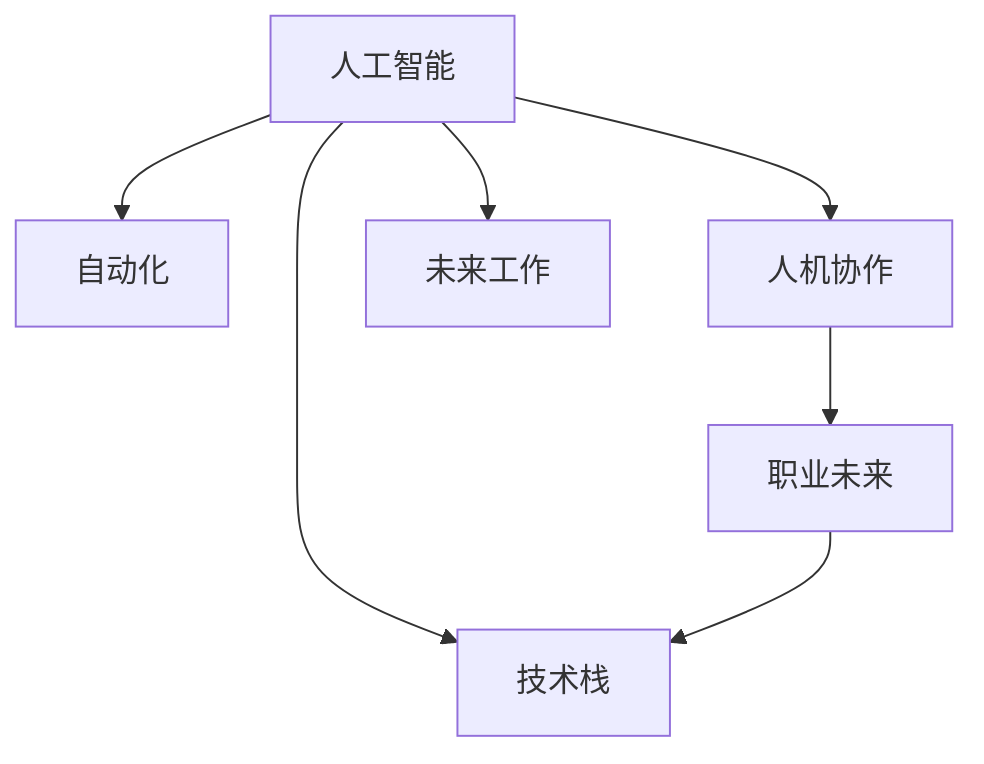

                 

# 未来工作：人机协作，重塑职业未来图景

> 关键词：未来工作, 人机协作, 人工智能, 自动化, 重塑职业, 自动化技术, 职业发展, 人类与机器协同

## 1. 背景介绍

### 1.1 问题由来

当前，随着人工智能技术的飞速发展，自动化和智能化正在深刻改变我们的工作方式和生活习惯。从自动驾驶汽车到工业机器人，从智能客服到AI写作，技术正以前所未有的速度渗透到社会的各个角落。然而，这些技术的迅猛发展也带来了新的挑战和不确定性，特别是对人类职业未来的影响，更是引起了广泛的关注和讨论。

在这样一个充满变革的时代，人们不禁思考：未来的工作将是什么样的？人工智能和自动化技术将如何重塑职业的未来图景？这些问题不仅关乎个人的职业生涯发展，也关乎社会经济结构的调整和变迁。因此，本文将从人工智能与人机协作的角度出发，探讨未来工作的可能变化，以及职业发展的全新路径。

## 2. 核心概念与联系

### 2.1 核心概念概述

要理解未来工作的图景，首先需要明确几个关键概念：

- **人工智能**：指通过计算机系统模拟人类智能过程的技术，包括机器学习、自然语言处理、计算机视觉、机器人学等多个领域。
- **自动化**：指通过技术手段，使机器或软件系统能够自动执行人类原本需要手动完成的任务。
- **人机协作**：指人类与机器之间协同工作，实现互补优势，提高工作效率和质量。
- **职业未来**：指随着技术的发展，职业结构和需求的变化，对个人职业生涯规划和职业发展的影响。
- **技术栈**：指开发人工智能系统和自动化技术所需的各种编程语言、框架、工具等技术手段。

这些概念之间的联系可以通过以下Mermaid流程图来展示：



这个流程图展示了各个概念之间的逻辑关系：人工智能和自动化技术为未来工作提供了技术基础，而人机协作则强调了人类与机器之间的协同，职业未来则是这些技术对人类职业发展的深远影响。技术栈则是实现未来工作的关键工具和手段。

## 3. 核心算法原理 & 具体操作步骤

### 3.1 算法原理概述

未来工作的实现离不开人工智能和自动化技术的支持。其中，人机协作的核心算法原理主要包括：

- **机器学习**：通过数据驱动的模型训练，让机器能够理解和执行特定任务。
- **自然语言处理(NLP)**：使机器能够理解、生成和处理自然语言，提高人机交互的流畅度。
- **计算机视觉**：使机器能够处理和分析图像、视频等视觉数据。
- **机器人学**：使机器能够在物理世界中执行复杂的任务。

这些算法的核心目标是通过技术手段，提高任务的执行效率和准确性，同时减少人类工作的负担，让人类能够专注于更具创造性和战略性的工作。

### 3.2 算法步骤详解

未来工作的构建可以分为以下几个关键步骤：

**Step 1: 需求分析**

- 确定业务目标和需求，明确需要解决的具体问题。
- 分析业务流程，识别出可以自动化和优化的环节。

**Step 2: 数据收集与预处理**

- 收集相关的数据，包括业务数据、用户反馈、市场数据等。
- 对数据进行清洗、去重、标注等预处理工作，确保数据的质量和可用性。

**Step 3: 模型设计与训练**

- 根据需求分析结果，设计合适的算法模型。
- 使用机器学习算法对模型进行训练，优化模型参数。

**Step 4: 系统集成与部署**

- 将训练好的模型集成到现有系统中，实现自动化功能。
- 对系统进行测试和优化，确保系统的稳定性和可靠性。

**Step 5: 持续优化与迭代**

- 根据实际使用情况，收集反馈信息，不断优化和改进模型和系统。
- 采用持续集成和持续交付(CI/CD)技术，实现快速迭代和更新。

### 3.3 算法优缺点

未来工作的实现具有以下优点：

1. **提高效率**：通过自动化和智能化手段，可以大幅提高工作效率，减少人为错误。
2. **降低成本**：自动化可以降低人力成本，同时减少资源浪费，提高经济效益。
3. **提升质量**：机器能够保证一致性和准确性，提高工作质量。
4. **创新可能性**：释放人类潜能，让人类专注于更具创造性和战略性的工作，促进技术创新。

然而，技术的发展也带来了一些挑战：

1. **技能差距**：自动化技术的发展可能会导致某些职业的消失，对相关从业者造成冲击。
2. **隐私与安全**：自动化和智能化系统的使用可能带来隐私泄露和数据安全问题。
3. **伦理与道德**：自动化系统的决策过程可能缺乏透明性，引发伦理和道德问题。
4. **失业风险**：自动化可能会增加某些行业的失业风险，导致社会不平等问题。

### 3.4 算法应用领域

未来工作的实现可以广泛应用于多个领域，包括但不限于：

- **制造业**：自动化生产线、机器人臂、智能仓库等。
- **金融业**：智能投顾、自动交易、风险控制等。
- **医疗业**：智能诊断、手术辅助、健康监测等。
- **服务业**：智能客服、自动调度、在线教育等。
- **零售业**：智能推荐、库存管理、物流优化等。

## 4. 数学模型和公式 & 详细讲解 & 举例说明

### 4.1 数学模型构建

未来工作的构建通常涉及以下几个数学模型：

- **回归模型**：用于预测连续型数值，如销售量预测。
- **分类模型**：用于分类问题，如客户分类、疾病诊断。
- **聚类模型**：用于发现数据中的群组或模式，如客户分群、市场细分。

这些模型通常使用机器学习算法（如线性回归、逻辑回归、支持向量机、随机森林等）来构建和训练。

### 4.2 公式推导过程

以线性回归模型为例，其基本公式为：

$$
y = \beta_0 + \beta_1 x_1 + \beta_2 x_2 + \ldots + \beta_n x_n + \epsilon
$$

其中，$y$ 为预测值，$x_i$ 为输入变量，$\beta_i$ 为模型系数，$\epsilon$ 为误差项。

通过最小二乘法，可以求解模型系数：

$$
\beta = (X^T X)^{-1} X^T y
$$

其中，$X$ 为特征矩阵，$y$ 为标签向量。

### 4.3 案例分析与讲解

假设我们要预测一家电商平台的销售量，可以使用线性回归模型。首先，收集相关数据，包括销售时间、促销活动、广告投放、季节性因素等。然后，将这些数据作为输入变量，销售量为输出变量，构建回归模型。使用历史数据进行训练，优化模型系数，最终得到一个预测销售量的模型。

## 5. 项目实践：代码实例和详细解释说明

### 5.1 开发环境搭建

在进行未来工作项目实践前，需要准备好开发环境。以下是使用Python进行Scikit-Learn开发的环境配置流程：

1. 安装Anaconda：从官网下载并安装Anaconda，用于创建独立的Python环境。

2. 创建并激活虚拟环境：
```bash
conda create -n sklearn-env python=3.8 
conda activate sklearn-env
```

3. 安装Scikit-Learn及其依赖：
```bash
conda install scikit-learn numpy pandas matplotlib scikit-optimize tqdm jupyter notebook ipython
```

完成上述步骤后，即可在`sklearn-env`环境中开始未来工作项目实践。

### 5.2 源代码详细实现

以下是一个使用Scikit-Learn进行线性回归预测的PyTorch代码实现：

```python
import pandas as pd
from sklearn.model_selection import train_test_split
from sklearn.linear_model import LinearRegression
from sklearn.metrics import mean_squared_error
import matplotlib.pyplot as plt

# 读取数据集
data = pd.read_csv('sales_data.csv')

# 数据预处理
X = data[['促销活动', '广告投放', '季节性因素']]
y = data['sales量']

# 数据拆分
X_train, X_test, y_train, y_test = train_test_split(X, y, test_size=0.2, random_state=42)

# 建立模型
model = LinearRegression()

# 训练模型
model.fit(X_train, y_train)

# 预测
y_pred = model.predict(X_test)

# 评估
mse = mean_squared_error(y_test, y_pred)
print(f'Mean Squared Error: {mse}')

# 可视化
plt.scatter(y_test, y_pred)
plt.xlabel('Actual Sales')
plt.ylabel('Predicted Sales')
plt.title('Sales Prediction')
plt.show()
```

### 5.3 代码解读与分析

让我们再详细解读一下关键代码的实现细节：

**读取数据集**：
- `pd.read_csv('sales_data.csv')`：使用Pandas读取销售数据集。

**数据预处理**：
- `X = data[['促销活动', '广告投放', '季节性因素']]`：选择输入变量。
- `y = data['sales量']`：选择输出变量。

**数据拆分**：
- `X_train, X_test, y_train, y_test = train_test_split(X, y, test_size=0.2, random_state=42)`：将数据集划分为训练集和测试集，保留20%作为测试集。

**建立模型**：
- `model = LinearRegression()`：创建线性回归模型。

**训练模型**：
- `model.fit(X_train, y_train)`：使用训练集数据训练模型。

**预测与评估**：
- `y_pred = model.predict(X_test)`：使用测试集数据进行预测。
- `mse = mean_squared_error(y_test, y_pred)`：计算均方误差，评估模型预测的准确性。

**可视化**：
- `plt.scatter(y_test, y_pred)`：绘制实际值与预测值的关系图。
- `plt.xlabel('Actual Sales')`：设置横轴标签。
- `plt.ylabel('Predicted Sales')`：设置纵轴标签。
- `plt.title('Sales Prediction')`：设置图表标题。
- `plt.show()`：显示图表。

可以看到，使用Scikit-Learn进行线性回归预测的代码实现非常简洁高效。开发者可以将更多精力放在数据处理、模型改进等高层逻辑上，而不必过多关注底层的实现细节。

## 6. 实际应用场景

### 6.1 智能制造

智能制造是未来工作的重要应用场景之一。通过自动化和智能化的生产线，可以实现生产过程的数字化和智能化，提高生产效率和质量。例如，使用机器人臂和自动化仓储系统，可以实现无人工干预的物流和装配。这些技术能够实时监测生产状态，自动调整生产参数，优化生产流程。

### 6.2 智慧医疗

智慧医疗通过人工智能和自动化技术，实现了医疗服务的智能化。智能诊断系统可以根据病人的病历和症状，提供初步的诊断建议。智能手术机器人可以进行高精度的微创手术，提高手术的成功率和安全性。健康监测设备可以实时监控病人的生命体征，及时发现异常情况，提供预警。

### 6.3 金融风控

金融风控是未来工作的另一个重要应用场景。智能投顾系统可以根据市场数据和历史交易记录，自动生成投资策略和交易指令。自动化的风险控制系统可以实时监控市场动态，及时发现潜在的风险点，提供预警。这些技术能够提高金融市场的稳定性和透明度。

### 6.4 未来应用展望

随着人工智能和自动化技术的不断发展，未来工作的应用场景将更加丰富和多样化。未来的工作将更加注重人机协作，让人类能够专注于更具创造性和战略性的工作。以下是对未来工作的展望：

1. **全面自动化**：自动化技术将渗透到各个行业，实现全面的智能化转型。
2. **个性化服务**：基于数据的个性化推荐和定制化服务将成为新的业务模式。
3. **智能决策**：人工智能将帮助人类进行更高效的决策，提高管理效率。
4. **跨界融合**：不同行业之间的融合将带来更多创新机会。
5. **人机协作**：人机协作将成为新的工作方式，释放人类潜能。

## 7. 工具和资源推荐

### 7.1 学习资源推荐

为了帮助开发者系统掌握未来工作的相关知识，这里推荐一些优质的学习资源：

1. **Coursera《人工智能导论》**：由斯坦福大学Andrew Ng教授讲授，涵盖人工智能的基本概念和应用。
2. **Udacity《机器学习工程师》**：提供从入门到高级的机器学习课程，适合初学者和中级开发者。
3. **Kaggle**：数据科学竞赛平台，提供大量数据集和竞赛任务，适合实践和竞赛练习。
4. **GitHub**：开源社区，提供大量高质量的代码和项目，适合学习和借鉴。
5. **PyTorch官方文档**：深度学习框架PyTorch的官方文档，提供丰富的教程和样例代码，适合实践和调试。

通过对这些资源的学习实践，相信你一定能够快速掌握未来工作的关键技术，并用于解决实际问题。

### 7.2 开发工具推荐

高效的开发离不开优秀的工具支持。以下是几款用于未来工作开发的常用工具：

1. **PyTorch**：基于Python的开源深度学习框架，灵活动态的计算图，适合快速迭代研究。
2. **TensorFlow**：由Google主导开发的开源深度学习框架，生产部署方便，适合大规模工程应用。
3. **Jupyter Notebook**：交互式的编程环境，适合编写和调试代码，分享学习笔记。
4. **Visual Studio Code**：轻量级的代码编辑器，支持多种编程语言和扩展。
5. **Git**：版本控制工具，适合团队协作和代码管理。

合理利用这些工具，可以显著提升未来工作的开发效率，加快创新迭代的步伐。

### 7.3 相关论文推荐

未来工作的相关研究源于学界的持续探索。以下是几篇奠基性的相关论文，推荐阅读：

1. **《机器学习：理论与算法》**：Tom Mitchell著，介绍了机器学习的基本概念和算法。
2. **《深度学习》**：Ian Goodfellow、Yoshua Bengio、Aaron Courville著，涵盖了深度学习的基础理论和应用。
3. **《自动驾驶：从感知到决策》**：Ulrich Küchler著，介绍了自动驾驶技术的核心算法和应用。
4. **《医疗AI：从数据到应用》**：Andrew Ng著，探讨了人工智能在医疗领域的应用和挑战。
5. **《智能投顾：构建自动化交易系统》**：Clifford Asness、Bradley Trombley著，介绍了智能投顾系统的设计思路和实现方法。

这些论文代表了未来工作的研究脉络，通过学习这些前沿成果，可以帮助研究者把握学科前进方向，激发更多的创新灵感。

## 8. 总结：未来发展趋势与挑战

### 8.1 总结

本文对未来工作的实现过程进行了全面系统的介绍。首先阐述了未来工作的技术基础和应用前景，明确了自动化和智能化对职业未来的深远影响。其次，从算法原理到实际操作，详细讲解了未来工作的构建流程，给出了具体代码实例。同时，本文还广泛探讨了未来工作在多个行业领域的应用，展示了未来工作的广阔前景。此外，本文精选了未来工作的各类学习资源，力求为读者提供全方位的技术指引。

通过本文的系统梳理，可以看到，未来工作在提高效率、降低成本、提升质量等方面具有显著优势，但也面临着技能差距、隐私安全、伦理道德等挑战。技术栈的不断优化和工程实践的持续改进，将是实现未来工作的关键。

### 8.2 未来发展趋势

展望未来，未来工作的实现将呈现以下几个发展趋势：

1. **智能化水平提升**：自动化和智能化技术将进一步提升，实现更高效、更精确的任务执行。
2. **人机协作深化**：人机协作将更加广泛和深入，释放人类潜力，提高工作效率。
3. **跨界融合加速**：不同领域的融合将带来更多创新机会，实现跨领域协同。
4. **社会责任增强**：自动化技术的应用将更加注重社会责任和伦理道德。
5. **持续学习常态化**：机器和系统将具备持续学习的能力，适应不断变化的需求。

这些趋势凸显了未来工作的广阔前景。未来的工作将更加注重人工智能和人类协作，为社会和经济带来新的机遇和挑战。

### 8.3 面临的挑战

尽管未来工作的实现具有巨大的潜力，但在迈向更加智能化、普适化应用的过程中，它仍面临着诸多挑战：

1. **技能差距**：自动化技术的发展可能会导致某些职业的消失，对相关从业者造成冲击。
2. **隐私与安全**：自动化和智能化系统的使用可能带来隐私泄露和数据安全问题。
3. **伦理与道德**：自动化系统的决策过程可能缺乏透明性，引发伦理和道德问题。
4. **失业风险**：自动化可能会增加某些行业的失业风险，导致社会不平等问题。
5. **技术复杂性**：未来工作的实现需要掌握多种技术栈，增加了技术难度和复杂性。

### 8.4 研究展望

面对未来工作的挑战，未来的研究需要在以下几个方面寻求新的突破：

1. **技能培训与转岗**：提供针对自动化技术发展的职业培训和转岗指导，帮助从业者顺利过渡。
2. **数据隐私保护**：加强数据隐私保护，确保数据安全。
3. **伦理道德规范**：制定伦理道德规范，确保自动化系统的透明性和公平性。
4. **跨领域融合**：探索跨领域融合的实现路径，实现多领域的协同创新。
5. **持续学习机制**：研究如何实现机器和系统的持续学习，适应不断变化的需求。

这些研究方向将引领未来工作的技术演进，为人类职业未来的发展提供新的可能性。

## 9. 附录：常见问题与解答

**Q1：未来工作是否会取代所有职业？**

A: 未来工作将取代某些重复性、低技能的工作，但并不会完全取代所有职业。人类在创新、艺术、战略决策等领域仍然具有不可替代的价值。未来工作将更多地与人类协作，提升工作效率和质量。

**Q2：自动化技术的发展是否会导致失业？**

A: 自动化技术的发展确实会对某些行业造成影响，导致部分职位消失。但同时，也会创造新的岗位，提升就业质量。关键在于如何平衡技术发展与社会责任。

**Q3：未来工作是否需要掌握多种技术栈？**

A: 是的，未来工作的实现需要掌握多种技术栈，包括编程语言、框架、工具等。开发者需要不断学习和实践，才能应对不断变化的技术需求。

**Q4：未来工作对个人职业生涯规划有哪些影响？**

A: 未来工作将改变职业生涯的发展路径和目标。开发者需要更加注重技能的学习和提升，关注新兴技术和应用场景。同时，也需要关注伦理和社会责任，确保技术的健康发展。

**Q5：如何应对未来工作的挑战？**

A: 应对未来工作的挑战需要多方面的努力，包括技能培训、技术研发、伦理规范等。开发者需要积极应对技术变革，寻找新的职业机会。

总之，未来工作的实现将带来巨大的机遇和挑战。只有积极应对，不断学习，才能在技术变革中取得成功，实现职业的可持续发展。

---

作者：禅与计算机程序设计艺术 / Zen and the Art of Computer Programming

