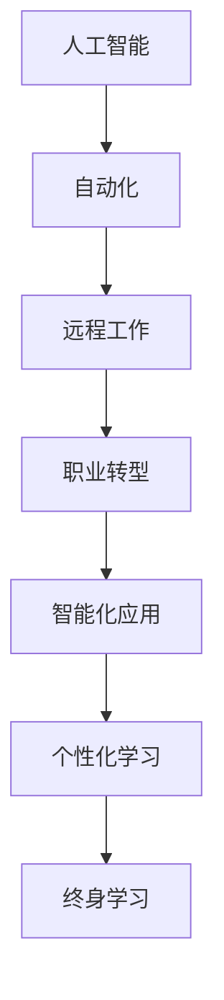

                 

# 未来工作：人机协作，重塑职业未来蓝图

> 关键词：人工智能,人机协作,自动化,远程工作,职业转型,智能化应用,职业发展,智能助理,个性化学习,技能提升,未来职场

## 1. 背景介绍

### 1.1 问题由来

当前，全球正经历着前所未有的技术变革，以人工智能为代表的第四次工业革命正在重塑我们的工作和生活方式。人工智能的迅猛发展，尤其是深度学习和大数据技术的进步，已经深刻改变了许多行业和职业的运作方式。未来，随着AI技术的不断演进，工作环境和职业形态将迎来重大的变革，传统的职位和技能可能面临挑战，新的职业和岗位也将诞生。

### 1.2 问题核心关键点

未来工作的主要变化趋势包括以下几个方面：

- **自动化普及**：越来越多的重复性、结构化任务将被机器和自动化系统所取代。
- **远程工作常态化**：技术让远程协作成为可能，促进了远程工作模式的兴起。
- **职业转型加速**：随着新技术的涌现，原有的职业和岗位将逐渐被淘汰，新的岗位和职业将应运而生。
- **智能化应用深入**：人工智能在各个领域的渗透和应用，将提升工作效率和质量，但同时也会带来对人类技能的新需求。
- **个性化学习兴起**：基于AI的个性化学习平台将根据个人能力和兴趣提供定制化的学习路径。
- **终身学习成为必备**：不断变化的技术环境要求从业者不断学习和更新知识，保持持续的学习和发展。

这些变化将对职业未来产生深远影响，要求劳动者具备更高的适应性和学习能力，同时也为职业发展带来了新的机遇和挑战。

## 2. 核心概念与联系

### 2.1 核心概念概述

未来工作的核心概念主要包括以下几个方面：

- **人工智能**：以深度学习和机器学习为核心的智能技术，能够模拟人类的决策和推理能力。
- **自动化**：利用计算机系统替代人类完成重复性、结构化任务。
- **远程工作**：通过网络和协作工具，实现远程的团队协作和工作。
- **职业转型**：根据技术发展和市场需求，劳动者需要调整职业路径和技能。
- **智能化应用**：将人工智能应用于各个行业和领域，提升效率和创新能力。
- **个性化学习**：根据个人需求和兴趣，提供定制化的学习和培训。
- **终身学习**：不断更新知识和技术，以适应快速变化的工作环境。

这些概念之间的联系紧密，共同构成了未来工作的整体框架，旨在提升效率、创造新价值，同时要求劳动者具备适应新技术的能力。

### 2.2 核心概念原理和架构的 Mermaid 流程图



这个流程图展示了人工智能与其他核心概念之间的关系，表明人工智能在各个方面都起着关键作用。自动化、远程工作、职业转型、智能化应用、个性化学习和终身学习都是基于人工智能技术的发展和应用，共同塑造了未来工作的形态。

## 3. 核心算法原理 & 具体操作步骤

### 3.1 算法原理概述

未来工作的主要算法原理可以概括为以下几个方面：

- **深度学习和强化学习**：通过深度神经网络模型，实现复杂问题的自动学习和决策。
- **自然语言处理和计算机视觉**：利用NLP和CV技术，提升数据处理和智能应用的能力。
- **自动化流程和机器人流程自动化(RPA)**：利用计算机程序自动执行重复性任务，提高效率。
- **云计算和大数据**：通过云平台和数据分析技术，支持大规模计算和数据处理。
- **协作工具和远程通信**：利用协作工具和远程通信技术，实现高效远程工作。

这些技术共同构成了未来工作的算法基础，旨在提升效率、降低成本，同时提升工作的智能化水平。

### 3.2 算法步骤详解

未来工作的主要算法步骤包括以下几个方面：

1. **数据收集与预处理**：收集相关数据，并对其进行清洗和预处理，以便后续分析和应用。
2. **模型训练与优化**：使用深度学习等技术训练模型，并进行超参数调优，以获得最佳的性能。
3. **应用部署与监控**：将训练好的模型部署到实际应用中，并进行性能监控和优化。
4. **用户交互与反馈**：设计用户友好的界面，收集用户反馈，进行持续改进。
5. **安全性与隐私保护**：确保数据和模型的安全性，保护用户隐私。

这些步骤构成了未来工作的核心算法流程，需要跨学科协作，从数据、模型、应用到用户反馈，各个环节都需细致考虑，以确保项目的成功实施。

### 3.3 算法优缺点

未来工作的主要算法具有以下优点：

- **提升效率**：自动化和智能化应用大幅提升了工作效率，减少了重复性劳动。
- **降低成本**：通过自动化和远程工作，降低了人力和运营成本。
- **增强灵活性**：远程工作模式和个性化学习提升了工作的灵活性和适应性。
- **促进创新**：智能化应用带来了新的工作方式和商业模式，促进了技术创新。

但同时，这些算法也存在一些缺点：

- **技术门槛高**：需要较高的技术水平和专业知识，对普通劳动者来说可能存在一定的门槛。
- **就业不稳定**：部分岗位可能会被自动化和智能化应用所取代，导致就业不稳定。
- **数据隐私和安全**：大量数据处理和远程协作带来了数据隐私和安全问题。
- **技能差距扩大**：技术和知识更新速度快，可能会加剧技能差距。

在实际应用中，需要平衡这些优点和缺点，合理规划和实施未来工作的各个环节，以实现最佳效果。

### 3.4 算法应用领域

未来工作的算法在多个领域都有广泛的应用，主要包括：

- **制造业**：通过自动化和智能化改造，提升生产效率和质量。
- **医疗健康**：利用AI进行疾病诊断、治疗方案推荐等，提高医疗服务水平。
- **金融服务**：使用智能投顾和自动化交易系统，提升金融服务效率和风险管理。
- **教育培训**：通过个性化学习和智能化辅导，提供更优质的教育体验。
- **零售电商**：应用智能推荐和自动化客服，提升客户体验和运营效率。
- **公共服务**：利用AI进行数据分析和决策支持，提升公共服务质量。

这些应用展示了未来工作算法的广泛性和潜力，为各个行业的转型升级提供了新的思路和方向。

## 4. 数学模型和公式 & 详细讲解 & 举例说明

### 4.1 数学模型构建

未来工作的主要数学模型包括：

- **神经网络模型**：通过多层神经网络结构，实现数据的自动学习和特征提取。
- **强化学习模型**：利用奖励机制和策略优化，实现智能决策和行为控制。
- **自然语言处理模型**：基于NLP技术，实现文本数据的处理和分析。
- **图像识别模型**：利用CV技术，实现图像数据的分类和识别。

这些模型在不同的应用场景中，通常使用不同的数据集和算法，但共同的目标都是通过深度学习和智能技术，提升数据的处理和应用能力。

### 4.2 公式推导过程

以下以神经网络模型的公式为例，进行推导：

设神经网络模型为 $M_{\theta}(x)$，其中 $x$ 为输入数据， $\theta$ 为模型参数。假设模型包含 $n$ 个隐层神经元，输出层神经元数为 $m$。输入层和隐层之间连接权重为 $w^{(1)}$，隐层和输出层之间连接权重为 $w^{(2)}$，激活函数为 $f(x)$。则模型的前向传播过程可以表示为：

$$
h = f(\sum_{i=1}^n w_i^{(1)} x_i)
$$

$$
y = f(\sum_{j=1}^m w_j^{(2)} h)
$$

其中 $h$ 为隐层输出， $y$ 为模型输出。反向传播过程中，对参数 $\theta$ 的梯度可以通过链式法则计算：

$$
\frac{\partial \mathcal{L}}{\partial \theta} = \frac{\partial \mathcal{L}}{\partial y} \frac{\partial y}{\partial \theta}
$$

其中 $\mathcal{L}$ 为损失函数，通常使用交叉熵损失。

### 4.3 案例分析与讲解

以图像识别模型为例，使用卷积神经网络(CNN)进行手写数字识别。假设输入数据为 $x$，输出标签为 $y$，模型参数为 $\theta$。模型的损失函数为交叉熵损失：

$$
\mathcal{L}(\theta) = -\frac{1}{N}\sum_{i=1}^N \sum_{j=1}^{10} y_i^j \log \hat{y}_i^j
$$

其中 $N$ 为样本数， $10$ 为数字类别数。在实际训练中，通常使用随机梯度下降(SGD)优化算法，更新参数 $\theta$：

$$
\theta \leftarrow \theta - \eta \frac{\partial \mathcal{L}}{\partial \theta}
$$

其中 $\eta$ 为学习率。通过不断迭代训练，模型在手写数字识别任务上可以获得较高的准确率。

## 5. 项目实践：代码实例和详细解释说明

### 5.1 开发环境搭建

在进行未来工作项目开发前，需要准备好开发环境。以下是使用Python进行TensorFlow开发的环境配置流程：

1. 安装Anaconda：从官网下载并安装Anaconda，用于创建独立的Python环境。

2. 创建并激活虚拟环境：
```bash
conda create -n tf-env python=3.8 
conda activate tf-env
```

3. 安装TensorFlow：根据CUDA版本，从官网获取对应的安装命令。例如：
```bash
conda install tensorflow -c pytorch -c conda-forge
```

4. 安装TensorBoard：
```bash
pip install tensorboard
```

5. 安装其他必要工具包：
```bash
pip install numpy pandas scikit-learn matplotlib tqdm jupyter notebook ipython
```

完成上述步骤后，即可在`tf-env`环境中开始项目开发。

### 5.2 源代码详细实现

以下是使用TensorFlow进行图像识别项目开发的完整代码实现：

```python
import tensorflow as tf
from tensorflow import keras

# 加载MNIST数据集
(x_train, y_train), (x_test, y_test) = keras.datasets.mnist.load_data()

# 数据预处理
x_train = x_train.reshape(-1, 28*28) / 255.0
x_test = x_test.reshape(-1, 28*28) / 255.0

# 构建卷积神经网络模型
model = keras.Sequential([
    keras.layers.Dense(256, activation='relu'),
    keras.layers.Dense(10, activation='softmax')
])

# 编译模型
model.compile(optimizer='adam',
              loss='sparse_categorical_crossentropy',
              metrics=['accuracy'])

# 训练模型
model.fit(x_train, y_train, epochs=10, batch_size=32)

# 评估模型
test_loss, test_acc = model.evaluate(x_test, y_test, verbose=2)
print('Test accuracy:', test_acc)
```

### 5.3 代码解读与分析

让我们再详细解读一下关键代码的实现细节：

**加载和预处理数据**：
- 使用`keras.datasets.mnist.load_data()`加载MNIST手写数字数据集。
- 将输入数据展平为一维向量，并进行归一化处理。

**构建模型**：
- 使用`Sequential`模型，添加两个全连接层，其中第二层为输出层，使用softmax激活函数，输出10个类别的概率。

**编译和训练模型**：
- 使用`compile`方法设置优化器和损失函数。
- 使用`fit`方法进行模型训练，设置训练轮数为10，批量大小为32。

**评估模型**：
- 使用`evaluate`方法在测试集上评估模型性能，输出测试准确率。

可以看到，使用TensorFlow进行图像识别任务的开发相对简单高效，代码结构清晰，易于理解和维护。TensorFlow的高级API和可视化工具，也使得模型训练和调试更加便捷。

## 6. 实际应用场景

### 6.1 制造业自动化

未来工作在制造业中的应用主要集中在自动化和智能化改造上。通过引入自动化系统和机器人流程自动化(RPA)，提升生产效率和质量，减少人为错误。例如，使用智能传感器和机器视觉系统，实现质量检测和异常检测，减少人工干预。利用智能物流系统，优化物料管理和供应链管理，提高生产协调性。

### 6.2 医疗健康智能化

医疗健康领域将大规模应用人工智能技术，提升诊断和治疗的智能化水平。利用深度学习进行医学影像分析，提高诊断准确率。开发智能问诊系统，根据病历和症状提供诊断建议。利用自然语言处理技术，自动整理和分析病历记录，提升医疗数据分析效率。

### 6.3 金融服务智能化

金融服务行业将借助人工智能技术，提升风险管理和客户服务水平。使用智能投顾和算法交易，实现个性化投资建议和自动化交易。利用自然语言处理技术，分析新闻和社交媒体数据，进行市场情绪分析。通过智能客服和聊天机器人，提升客户咨询和投诉处理效率。

### 6.4 教育培训个性化

教育培训领域将应用人工智能技术，实现个性化学习和智能化辅导。开发个性化学习平台，根据学生的学习情况和兴趣，提供定制化的学习资源和路径。利用自然语言处理技术，分析学生的学习行为和反馈，提供及时的个性化辅导和反馈。通过智能化的考试和评估系统，提高评估的准确性和效率。

### 6.5 零售电商智能化

零售电商行业将借助人工智能技术，提升客户体验和运营效率。应用智能推荐系统，根据用户历史行为和偏好，提供个性化的商品推荐。利用自然语言处理技术，进行情感分析和客户反馈分析，提升客户满意度和忠诚度。通过智能化的库存管理系统，优化库存管理和供应链管理，降低运营成本。

### 6.6 公共服务智能化

公共服务领域将应用人工智能技术，提升公共服务的智能化水平。利用智能数据分析，进行城市交通管理、环境监测和公共安全管理。开发智能客服和投诉处理系统，提高公共服务响应速度和处理效率。通过智能化的政策分析和决策支持系统，提升公共政策的制定和执行效率。

## 7. 工具和资源推荐

### 7.1 学习资源推荐

为了帮助开发者系统掌握未来工作的相关知识，这里推荐一些优质的学习资源：

1. **TensorFlow官方文档**：提供了TensorFlow的详细教程、API文档和实战案例，是学习和使用TensorFlow的必备资料。
2. **《深度学习》课程**：由斯坦福大学Andrew Ng教授开设，深入浅出地介绍了深度学习的基本原理和应用。
3. **《人工智能》系列书籍**：包括《人工智能简史》、《人工智能：一种现代的方法》等，全面介绍了人工智能的发展历程和前沿技术。
4. **Coursera和edX在线课程**：提供了大量人工智能相关的在线课程，包括深度学习、机器学习、计算机视觉等，适合不同层次的学习者。
5. **Kaggle竞赛平台**：提供了丰富的数据集和挑战，鼓励开发者进行实战练习，提升技术能力。

通过这些资源的学习实践，相信你一定能够快速掌握未来工作的精髓，并用于解决实际的业务问题。

### 7.2 开发工具推荐

高效的开发离不开优秀的工具支持。以下是几款用于未来工作开发的常用工具：

1. **PyTorch**：基于Python的开源深度学习框架，灵活动态的计算图，适合快速迭代研究。
2. **TensorFlow**：由Google主导开发的开源深度学习框架，生产部署方便，适合大规模工程应用。
3. **Jupyter Notebook**：开源的交互式编程环境，支持多种编程语言和库，适合进行数据分析和模型训练。
4. **GitHub**：全球最大的代码托管平台，支持版本控制和协作开发，方便团队协作和代码共享。
5. **Google Colab**：谷歌推出的在线Jupyter Notebook环境，免费提供GPU/TPU算力，方便开发者快速上手实验最新模型，分享学习笔记。

合理利用这些工具，可以显著提升未来工作的开发效率，加快创新迭代的步伐。

### 7.3 相关论文推荐

未来工作的研究源于学界的持续探索。以下是几篇奠基性的相关论文，推荐阅读：

1. **ImageNet Classification with Deep Convolutional Neural Networks**：AlexNet论文，标志着深度学习在图像识别领域的突破。
2. **Google's Inception Architecture for Computer Vision**：Inception论文，提出了GoogleNet，提升了图像分类模型的准确率。
3. **Deep Residual Learning for Image Recognition**：ResNet论文，提出了残差网络结构，解决了深度网络训练过程中的梯度消失问题。
4. **Attention is All You Need**：Transformer论文，提出了Transformer模型，开启了NLP领域的预训练大模型时代。
5. **BERT: Pre-training of Deep Bidirectional Transformers for Language Understanding**：BERT论文，提出了BERT模型，利用自监督学习任务进行预训练，刷新了多项NLP任务SOTA。

这些论文代表了大语言模型和微调技术的发展脉络。通过学习这些前沿成果，可以帮助研究者把握学科前进方向，激发更多的创新灵感。

## 8. 总结：未来发展趋势与挑战

### 8.1 总结

本文对未来工作的核心算法和操作步骤进行了全面系统的介绍。首先阐述了未来工作的背景和核心概念，明确了人工智能和自动化在未来工作中的关键作用。其次，从原理到实践，详细讲解了深度学习模型的构建和训练过程，给出了模型开发和评估的完整代码实例。同时，本文还广泛探讨了未来工作在各个行业领域的应用前景，展示了未来工作的广阔前景。

通过本文的系统梳理，可以看到，未来工作正在通过人工智能和自动化技术，重塑我们的工作方式和职业未来。受益于深度学习和智能技术的普及，各行各业的工作效率和质量将得到显著提升，同时也带来了新的职业机遇和挑战。未来，伴随技术的不停演进，我们必须不断学习、适应和创新，才能在新的工作环境中保持竞争力。

### 8.2 未来发展趋势

展望未来，未来工作的发展趋势包括以下几个方面：

1. **技术进步加速**：深度学习和计算机视觉技术的持续进步，将进一步提升自动化的智能化水平。
2. **跨领域应用广泛**：未来工作将在更多领域得到应用，如医疗、金融、教育等，带来新的业务模式和商业模式。
3. **协同工作增强**：远程协作和智能助理的普及，将增强团队的协同能力和效率。
4. **个性化服务提升**：基于人工智能的个性化学习和智能化辅导，将提升服务质量和客户体验。
5. **终身学习普及**：不断变化的技术环境要求从业者不断学习和更新知识，保持持续的学习和发展。

这些趋势将推动未来工作迈向更加智能化、自动化和个性化，为各行各业带来新的机遇和挑战。

### 8.3 面临的挑战

尽管未来工作带来了诸多机遇，但在迈向更加智能化、普适化应用的过程中，仍面临诸多挑战：

1. **技术门槛高**：需要较高的技术水平和专业知识，对普通劳动者来说可能存在一定的门槛。
2. **就业不稳定**：部分岗位可能会被自动化和智能化应用所取代，导致就业不稳定。
3. **数据隐私和安全**：大量数据处理和远程协作带来了数据隐私和安全问题。
4. **技能差距扩大**：技术和知识更新速度快，可能会加剧技能差距。

在实际应用中，需要平衡这些优点和缺点，合理规划和实施未来工作的各个环节，以实现最佳效果。

### 8.4 研究展望

未来的研究需要在以下几个方面寻求新的突破：

1. **跨领域协作**：跨学科协作，融合多领域的知识和技能，推动未来工作的快速发展。
2. **智能化工具普及**：开发更加智能化、易用的工具，降低技术门槛，推动人工智能在各个行业的应用。
3. **技能培训和提升**：建立终身学习体系，提供多样化的技能培训和提升途径，帮助从业者适应新的工作环境。
4. **伦理和隐私保护**：在技术应用中注重伦理和隐私保护，确保数据和模型的安全性，构建可信的未来工作环境。

这些研究方向的探索，将引领未来工作技术迈向更高的台阶，为构建安全、可靠、可解释、可控的智能系统铺平道路。面向未来，未来工作需要与其他人工智能技术进行更深入的融合，如知识表示、因果推理、强化学习等，多路径协同发力，共同推动自然语言理解和智能交互系统的进步。只有勇于创新、敢于突破，才能不断拓展人工智能的边界，让智能技术更好地造福人类社会。

## 9. 附录：常见问题与解答

**Q1：未来工作是否适用于所有行业？**

A: 未来工作的主要算法和技术在各个行业都有广泛的应用，但具体的实施细节和效果可能因行业特性不同而有所差异。需要根据各行业的特点，合理选择和应用相应的技术方案。

**Q2：未来工作的技术门槛是否较高？**

A: 是的，未来工作涉及深度学习、计算机视觉、自然语言处理等多个领域的知识和技能，需要较高的技术水平和专业知识。但随着技术的发展和普及，越来越多的工具和平台可以帮助开发者降低技术门槛。

**Q3：未来工作是否会导致就业不稳定？**

A: 是的，部分岗位可能会被自动化和智能化应用所取代，但也会带来新的职业和岗位，如数据科学家、智能工程师等。需要从业者不断学习和更新技能，以适应新的工作环境。

**Q4：未来工作的技术发展是否会影响社会公平？**

A: 是的，技术的不平衡发展可能会加剧社会不公平现象。需要在技术应用中注重伦理和隐私保护，确保数据和模型的安全性，构建可信的未来工作环境。

**Q5：未来工作是否会改变人类工作的本质？**

A: 是的，未来工作将通过人工智能和自动化技术，提升工作效率和质量，但同时也会改变人类工作的本质。需要从业者不断学习、适应和创新，才能在新的工作环境中保持竞争力。

---

作者：禅与计算机程序设计艺术 / Zen and the Art of Computer Programming

