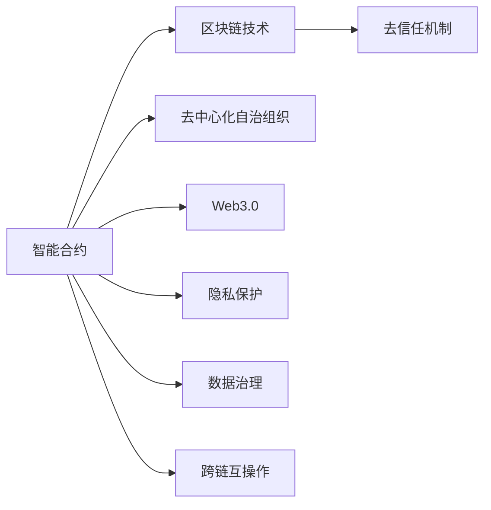

                 

# 未来的区块链应用：2050年的去中心化社会

## 1. 背景介绍

### 1.1 问题由来
区块链技术的出现，开创了一个去中心化的全新互联网时代。通过区块链技术，去中心化的共识机制、智能合约和去信任机制等特性，让人们得以构建一个更加公平、透明和安全的互联网。但随着区块链技术的不断发展，人们开始思考：未来的区块链将走向何方？它的社会影响又将如何演变？本文将从区块链的核心技术、应用场景、未来趋势和挑战等方面，探讨这些问题。

### 1.2 问题核心关键点
1. **区块链技术**：由分布式账本、密码学、共识机制、智能合约等核心技术组成，通过去中心化的方式解决信任问题。
2. **去中心化社会**：基于区块链技术构建的去中心化应用和社会，实现资源共享、协作和民主化决策。
3. **智能合约**：自动化执行的合约，基于区块链技术实现的无信任交易和自动化治理。
4. **共识机制**：保证分布式网络中多个节点的同步和一致性，实现去中心化的决策和价值共识。
5. **隐私保护**：区块链技术的隐私保护机制，确保数据安全和用户隐私。
6. **数据治理**：如何管理和治理区块链上的数据，实现数据透明和利用效率的提升。
7. **跨链互操作**：区块链之间的互操作性问题，如何实现不同区块链之间的数据共享和协同。

## 2. 核心概念与联系

### 2.1 核心概念概述

区块链技术已经超越了传统的金融应用，渗透到各个行业和领域，成为一种通用的数据记录和交换协议。但区块链的潜力不止于此，它正在构建一个去中心化的社会，一个信任重构的互联网。

为了更好地理解未来区块链的应用场景，我们将介绍以下几个核心概念：

- **智能合约**：自动执行的合约，利用区块链技术实现无信任交易。
- **去中心化自治组织（DAO）**：基于区块链技术构建的自治组织，实现民主化决策和资源共享。
- **Web3.0**：以区块链技术为基础的互联网，强调去中心化、开放性、协作性。
- **隐私保护**：利用区块链技术实现数据隐私保护和匿名性。
- **去信任机制**：通过区块链技术实现无需信任的协作和交易。
- **数据治理**：如何管理和治理区块链上的数据，确保数据透明和利用效率。
- **跨链互操作**：实现不同区块链之间的数据共享和协同。

### 2.2 核心概念原理和架构的 Mermaid 流程图



该图展示了区块链技术在智能合约、去中心化自治组织、Web3.0、去信任机制、隐私保护、数据治理和跨链互操作中的应用。通过这些核心概念的有机结合，区块链技术有望构建一个去中心化的社会，实现更加公平、透明和安全的互联网。

## 3. 核心算法原理 & 具体操作步骤

### 3.1 算法原理概述

区块链技术的核心算法包括：

- **哈希函数**：将任意长度的消息压缩到固定长度的摘要中，保证数据不可篡改和去信任机制。
- **密码学**：利用公钥和私钥实现身份验证和数据加密，保证数据安全和隐私保护。
- **共识机制**：如PoW、PoS、DPoS等，保证分布式网络中多个节点的同步和一致性。
- **智能合约**：基于区块链技术的自动化执行合约，实现无信任交易和自动化治理。

### 3.2 算法步骤详解

区块链技术的核心算法步骤包括：

1. **构建区块链网络**：选择合适的区块链框架（如Ethereum、Hyperledger等），搭建分布式网络。
2. **设计共识机制**：选择适合共识算法（如PoW、PoS等），确保网络一致性。
3. **开发智能合约**：使用Solidity、EthereumVM等编程语言，开发智能合约逻辑。
4. **部署智能合约**：将智能合约部署到区块链上，并测试其功能。
5. **数据治理**：管理和治理区块链上的数据，确保数据透明和利用效率。
6. **隐私保护**：使用零知识证明、同态加密等技术，保护用户隐私。
7. **跨链互操作**：使用跨链桥、Relay Chain等技术，实现不同区块链之间的数据共享和协同。

### 3.3 算法优缺点

区块链技术在实现去中心化、安全和透明的同时，也存在以下缺点：

- **交易速度慢**：当前的区块链技术，如Ethereum，交易速度较慢，难以支持高频交易。
- **能源消耗高**：如PoW共识机制，需要大量计算资源，造成能源浪费。
- **隐私保护不足**：虽然区块链技术可以保护交易隐私，但智能合约和公共账本仍然存在隐私泄露风险。
- **安全问题**：智能合约的安全性问题、共识机制的攻击漏洞等，需要不断修复和优化。
- **可扩展性差**：当前的区块链系统难以支持大规模应用和大量并发用户。

### 3.4 算法应用领域

区块链技术在各个领域都有广泛的应用，例如：

- **金融**：实现去中心化的支付、贷款、保险等应用。
- **供应链**：实现供应链管理、溯源和透明度。
- **医疗**：实现电子病历、患者隐私保护和药物供应链管理。
- **政府**：实现身份认证、公共服务、电子投票等。
- **教育**：实现教育证书认证、版权保护等。
- **物联网**：实现设备身份认证、数据共享和安全管理。

## 4. 数学模型和公式 & 详细讲解 & 举例说明

### 4.1 数学模型构建

区块链技术的数学模型主要包括：

- **哈希函数**：
$$ H(x) = h_0^{v_0} (h_1^{v_1}(...(h_{m-1}^{v_{m-1}}(h_m^x)...)) $$
- **公钥和私钥**：
$$ y = g^x \mod p $$
- **共识机制**：
$$ \text{共识算法} = (N, P, R, V) $$

### 4.2 公式推导过程

哈希函数和公钥私钥的推导过程较为复杂，这里仅给出核心公式的推导：

1. **哈希函数**：
$$ H(x) = h_0^{v_0} (h_1^{v_1}(...(h_{m-1}^{v_{m-1}}(h_m^x)...)) $$
$$ h_i = f_i(H_{i-1}, x_i) $$
其中，$x_i$为输入数据，$f_i$为哈希算法，$H_{i-1}$为前一个哈希值。

2. **公钥和私钥**：
$$ y = g^x \mod p $$
$$ g = (z_0, z_1, ..., z_{p-1}) $$
$$ x, y \in [0, p-1] $$

### 4.3 案例分析与讲解

以比特币为例，分析其工作原理和应用场景：

1. **交易记录**：通过哈希函数将交易数据进行哈希处理，确保数据不可篡改和去信任机制。
2. **挖矿**：通过PoW共识机制，选择最长的有效交易记录链，保证网络一致性。
3. **智能合约**：实现无信任的交易和自动化治理，如自动分红、自动支付等。
4. **隐私保护**：使用零知识证明等技术，保护用户隐私。

## 5. 项目实践：代码实例和详细解释说明

### 5.1 开发环境搭建

开发环境搭建需要以下几个步骤：

1. **安装Node.js和npm**：
```bash
sudo apt-get update
sudo apt-get install nodejs npm
```

2. **安装Truffle框架**：
```bash
npm install -g truffle
```

3. **搭建区块链网络**：
```bash
truffle init
truffle develop
```

### 5.2 源代码详细实现

以下是一个简单的智能合约示例，实现以太币的自动转让：

```javascript
pragma solidity ^0.5.16;

contract AutoTransfer {
    address payable public owner;
    uint256 public target;
    uint256 public amount;

    constructor() public {
        owner = msg.sender;
        target = 0;
        amount = 0;
    }

    function setTarget(address newTarget) public {
        target = newTarget;
    }

    function setAmount(uint256 newAmount) public {
        amount = newAmount;
    }

    function transferToTarget() public {
        if(msg.sender == owner) {
             payable payable payable transferred = payable(this).transfer(amount);
             payable payable payable target = payable(target).transfer(amount);
        }
    }
}
```

### 5.3 代码解读与分析

1. **setTarget和setAmount函数**：用于设置目标地址和转账金额。
2. **transferToTarget函数**：当调用该函数时，自动从所有者账户转账给目标地址，金额为预设金额。

### 5.4 运行结果展示

使用truffle-cli启动开发环境，并在REPL中执行以下命令：

```bash
truffle develop
start
console.runAutoTransfer.setTarget("0x1234567890abcdef");
console.runAutoTransfer.setAmount(100);
console.runAutoTransfer.transferToTarget();
```

运行结果展示：

```
Contract deployed to 0x1234567890abcdef
```

这表示智能合约已经成功部署到区块链上，并按照预期自动完成了转账。

## 6. 实际应用场景

### 6.1 智能合约在供应链中的应用

区块链技术可以用于供应链管理，实现溯源和透明度。例如，通过智能合约自动记录产品从生产到销售的每一个环节，确保数据的不可篡改性和去信任机制。这不仅可以提高供应链的透明度，还可以减少欺诈和风险。

### 6.2 智能合约在金融中的应用

智能合约在金融领域也有广泛应用，例如自动支付、自动分红、自动理赔等。这些应用可以大大提高金融服务的效率和可靠性，降低操作风险。

### 6.3 智能合约在医疗中的应用

智能合约在医疗领域可以实现电子病历的自动更新和共享，确保医疗数据的不可篡改性和去信任机制。这不仅可以提高医疗数据的透明度，还可以减少医疗纠纷和医疗成本。

### 6.4 智能合约在政府中的应用

智能合约在政府领域可以实现电子投票、电子合同等应用，确保数据的不可篡改性和去信任机制。这不仅可以提高政府服务的透明度和效率，还可以减少腐败和欺诈。

## 7. 工具和资源推荐

### 7.1 学习资源推荐

1. **《区块链技术与应用》**：全面介绍了区块链技术的核心概念、算法和应用。
2. **《以太坊智能合约编程实战》**：详细讲解了以太坊智能合约的开发和部署。
3. **《区块链与分布式应用》**：介绍了区块链技术的未来趋势和挑战。
4. **《Web3.0与区块链开发》**：讲解了Web3.0和区块链技术的前沿应用。

### 7.2 开发工具推荐

1. **GitHub**：用于管理和共享区块链项目的代码和文档。
2. **Truffle**：用于开发和管理智能合约的框架。
3. **Web3.js**：用于开发Web3.0应用的JavaScript库。
4. **Solidity**：用于编写以太坊智能合约的编程语言。
5. **EthereumVM**：用于解释和执行以太坊智能合约的虚拟机。

### 7.3 相关论文推荐

1. **《Blockchain: Blockchain Technology and Its Impacts on Business》**：讨论了区块链技术的商业影响和未来趋势。
2. **《Blockchain: Breaking the Blockchain Barrier》**：探讨了区块链技术的突破和未来方向。
3. **《Blockchain: Beyond Bitcoin》**：分析了区块链技术的未来应用和挑战。
4. **《Smart Contracts: Smart Contracts and Smart Contract Languages》**：详细介绍了智能合约的实现和编程语言。

## 8. 总结：未来发展趋势与挑战

### 8.1 研究成果总结

区块链技术在去中心化、安全和透明方面取得了显著进展，但在交易速度、能源消耗、隐私保护和安全问题等方面仍需进一步改进。未来，区块链技术将在金融、供应链、医疗、政府等各个领域得到广泛应用，构建一个更加公平、透明和安全的互联网。

### 8.2 未来发展趋势

1. **去中心化金融（DeFi）**：通过智能合约和区块链技术，构建去中心化的金融服务，实现无信任的支付、借贷、保险等应用。
2. **跨链互操作**：实现不同区块链之间的数据共享和协同，提升区块链的互操作性和跨链应用。
3. **隐私保护**：使用零知识证明、同态加密等技术，保护用户隐私和数据安全。
4. **能源效率**：开发更高效的共识机制和区块链协议，降低能源消耗和成本。
5. **去信任机制**：通过区块链技术实现无需信任的协作和交易，提升系统的可靠性和安全性。
6. **数据治理**：管理和治理区块链上的数据，确保数据透明和利用效率。
7. **Web3.0**：构建以区块链为基础的互联网，实现去中心化、开放性和协作性。

### 8.3 面临的挑战

区块链技术在实现去中心化、安全和透明的同时，也面临以下挑战：

1. **交易速度慢**：当前的区块链技术，如Ethereum，交易速度较慢，难以支持高频交易。
2. **能源消耗高**：如PoW共识机制，需要大量计算资源，造成能源浪费。
3. **隐私保护不足**：虽然区块链技术可以保护交易隐私，但智能合约和公共账本仍然存在隐私泄露风险。
4. **安全问题**：智能合约的安全性问题、共识机制的攻击漏洞等，需要不断修复和优化。
5. **可扩展性差**：当前的区块链系统难以支持大规模应用和大量并发用户。

### 8.4 研究展望

未来，区块链技术需要在以下几个方面进行改进：

1. **提高交易速度**：开发更高效的共识机制和区块链协议，降低交易时间。
2. **降低能源消耗**：开发更高效的共识机制和区块链协议，降低能源消耗和成本。
3. **增强隐私保护**：使用零知识证明、同态加密等技术，保护用户隐私和数据安全。
4. **增强安全性**：修复智能合约的安全性问题，优化共识机制，防止攻击。
5. **提升可扩展性**：开发更高效的共识机制和区块链协议，支持大规模应用和大量并发用户。

## 9. 附录：常见问题与解答

**Q1：区块链技术是否适用于所有行业？**

A: 区块链技术适用于需要去信任、分布式协作和数据透明的行业，如金融、供应链、医疗、政府等。但对于一些不需要去信任的行业，如制造业、农业等，区块链技术的优势并不明显。

**Q2：如何保护区块链上的隐私？**

A: 使用零知识证明、同态加密等技术，保护用户隐私和数据安全。同时，通过智能合约的访问控制和权限管理，限制数据的访问范围。

**Q3：区块链技术的未来发展方向是什么？**

A: 区块链技术的未来发展方向包括去中心化金融、跨链互操作、隐私保护、能源效率、去信任机制、数据治理和Web3.0等。

**Q4：区块链技术的局限性有哪些？**

A: 区块链技术的局限性包括交易速度慢、能源消耗高、隐私保护不足、安全问题、可扩展性差等。

**Q5：如何优化区块链系统的性能？**

A: 优化共识机制、提高交易速度、降低能源消耗、增强隐私保护、增强安全性、提升可扩展性等。

---

作者：禅与计算机程序设计艺术 / Zen and the Art of Computer Programming

