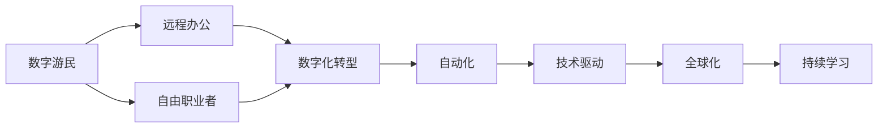

                 

# 未来的就业趋势：2050年的数字游民与自由职业者

> 关键词：数字游民，自由职业者，未来就业趋势，技术驱动，远程工作，自动化，人工智能，数字化转型，生产力提高

## 1. 背景介绍

### 1.1 问题由来

在2050年的未来，我们可能生活在数字化、智能化高度融合的世界中。技术驱动的经济变革和全球化趋势，将重塑工作方式、生产关系和职业结构。数字游民和自由职业者作为这一变革的产物，将遍布各个角落，引领未来的就业趋势。

数字游民（Digital Nomads）是指利用互联网和数字工具进行远程工作的个人或公司。他们可以在全球范围内自由移动，通过互联网连接进行远程办公，享受更灵活、自主的工作环境。自由职业者（Freelancers）则是指通过独立接取各类短期项目，提供多样化的专业服务，以实现收入的自由化、技能的多元化和工作的弹性化。

### 1.2 问题核心关键点

未来就业趋势的核心在于：
- **技术驱动**：AI、大数据、区块链等前沿技术将深度融合到各种行业，重塑就业形态。
- **全球化**：数字化技术打破了地理界限，使得全球范围内的人才和资源得以高效配置。
- **灵活自主**：数字化、智能化的生产方式将提高生产力，为个人提供更大的自由度。
- **高度分工**：多样化的分工合作将取代传统的集中化生产模式，推动新的产业结构和职业形态的形成。
- **持续学习**：持续学习和技能更新成为基本需求，以适应不断变化的技术和工作环境。

### 1.3 问题研究意义

研究2050年的就业趋势，对于预测未来经济和社会发展方向、引导教育体系和职业培训、优化人力资源配置、促进社会公平和和谐具有重要意义。了解数字游民和自由职业者的兴起，可以洞察未来就业市场的需求和变化，为政策制定、企业战略和个体职业规划提供依据。

## 2. 核心概念与联系

### 2.1 核心概念概述

为了更好地理解未来就业趋势，我们首先需要界定一些关键概念：

- **数字游民（Digital Nomads）**：指在全球范围内利用数字工具进行远程工作的人。他们不受地理位置的限制，通过互联网连接进行办公，追求自由、流动的工作方式。
- **自由职业者（Freelancers）**：指独立接取各类短期项目，提供多样化专业服务，实现收入自由化、技能多元化和工作弹性化的人。他们可以是软件开发者、内容创作者、设计者、营销专家等。
- **技术驱动**：指技术进步，特别是互联网、云计算、大数据、AI等技术，对工作方式和就业形态的根本性改变。
- **全球化**：指数字化技术打破了地理界限，使得全球范围内的人才和资源得以高效配置。
- **自动化**：指通过智能机器和软件工具，自动化执行重复性和低价值的工作，提高生产力和效率。
- **数字化转型**：指传统产业向数字化、智能化的生产方式转型，推动企业创新和变革。
- **远程办公**：指通过互联网和通信技术，实现不受地理限制的工作模式，提高工作灵活性和效率。
- **持续学习**：指个人和企业需要不断学习和更新技能，以适应技术进步和市场变化。

这些概念之间的逻辑关系可以通过以下Mermaid流程图来展示：



这个流程图展示了未来就业趋势的关键概念及其之间的关系：

1. 数字游民和自由职业者通过远程办公的方式，实现了工作方式的灵活和自由。
2. 全球化技术推动了数字化转型，使得资源和人才的全球配置成为可能。
3. 自动化和AI技术提升了生产力，减少了对人力劳动的依赖。
4. 技术驱动和数字化转型推动了持续学习的需求，使得个体不断提升自身技能。

## 3. 核心算法原理 & 具体操作步骤

### 3.1 算法原理概述

基于数字游民和自由职业者的未来就业趋势，我们提出一种基于技术驱动、全球化、灵活自主、高度分工和持续学习原则的就业模型。该模型旨在预测未来就业市场的变化和优化人力资源配置。

模型基于以下假设：
- **技术进步**：AI、大数据、区块链等技术的发展将极大改变工作方式和生产方式。
- **全球资源**：全球范围内的资源和人才将更高效地配置，促进经济一体化。
- **工作灵活**：数字化技术打破了地理限制，使得远程工作成为可能。
- **分工合作**：多种多样的分工合作将取代传统的集中化生产模式。
- **技能更新**：持续学习和技能更新成为适应未来工作环境的基本需求。

### 3.2 算法步骤详解

基于上述假设，我们设计了一个基于技术驱动和全球资源配置的未来就业模型，步骤如下：

1. **数据采集与处理**：
    - 采集全球各地区的劳动力数据、技术应用情况、教育培训资源等。
    - 通过大数据分析，确定各地区的人力资源分布、技能结构和技术水平。

2. **需求预测与模型建立**：
    - 基于历史数据和未来趋势，预测各行业的就业需求。
    - 使用机器学习模型（如回归、分类、时序预测等），建立预测未来就业变化的模型。

3. **技能匹配与资源配置**：
    - 将劳动者的技能与未来就业需求进行匹配，找到最合适的工作机会。
    - 使用优化算法（如线性规划、网络流等），最大化地利用全球资源，平衡供需。

4. **持续学习与技能更新**：
    - 对劳动者进行持续的技能培训和终身学习，使其适应未来的工作环境。
    - 提供多样化的在线教育资源和灵活的培训方式，促进技能更新和知识共享。

### 3.3 算法优缺点

该模型具有以下优点：
- **全面性**：模型综合考虑了技术、全球资源、工作灵活、分工合作和持续学习等多个因素。
- **预测准确性**：基于大量数据和大规模机器学习模型的预测，较为准确地反映了未来就业趋势。
- **可操作性**：模型提供了一系列具体的操作步骤，易于实施和调整。

同时，模型也存在一些局限性：
- **数据依赖性**：模型的准确性依赖于数据的质量和全面性，数据采集和处理难度较大。
- **动态变化**：模型假设过于理想，未来的就业环境可能会有更多的不可预测因素。
- **公平性**：模型可能对某些地区或群体不利，需要进一步优化以促进公平就业。

### 3.4 算法应用领域

该模型可以广泛应用于以下领域：
- **教育培训**：预测未来就业趋势，指导教育培训体系的改革和优化。
- **人力资源管理**：为企业和机构提供人才配置和员工管理方案。
- **政策制定**：政府根据模型预测结果，制定有针对性的就业政策和扶持措施。
- **技术创新**：推动技术进步，提升生产力和就业质量。

## 4. 数学模型和公式 & 详细讲解 & 举例说明

### 4.1 数学模型构建

我们采用以下数学模型来预测未来就业趋势：

$$
\text{Future Employment} = f(\text{Current Labor Supply}, \text{Future Demand}, \text{Technology Advancement}, \text{Global Resources}, \text{Flexibility}, \text{Skill Update})
$$

其中：
- $\text{Current Labor Supply}$：当前的劳动力供给情况。
- $\text{Future Demand}$：未来各行业的就业需求。
- $\text{Technology Advancement}$：技术进步对就业的影响。
- $\text{Global Resources}$：全球范围内的资源和人才配置情况。
- $\text{Flexibility}$：工作方式灵活度。
- $\text{Skill Update}$：持续学习和技能更新需求。

### 4.2 公式推导过程

为简化模型，我们引入几个简化公式：
- **劳动力供给函数**：$L(t) = \sum_{i} a_i e^{b_i t}$
- **就业需求函数**：$D(t) = \alpha t + \beta$
- **技术进步函数**：$T(t) = \gamma t + \delta$
- **资源配置函数**：$R(t) = \epsilon t + \zeta$

将这些函数代入模型中，我们得到：
$$
E(t) = f(L(t), D(t), T(t), R(t), F(t), S(t))
$$

其中：
- $L(t)$：劳动力供给随时间的变化。
- $D(t)$：就业需求随时间的变化。
- $T(t)$：技术进步随时间的变化。
- $R(t)$：全球资源配置随时间的变化。
- $F(t)$：工作灵活度随时间的变化。
- $S(t)$：持续学习和技能更新随时间的变化。

### 4.3 案例分析与讲解

假设一个国家当前的劳动力供给为1000万人，预计未来5年内各行业的就业需求增长率为5%，技术进步每年提升生产力2%，全球资源配置效率提升10%，工作灵活度每年提高10%，持续学习需求每年提升5%。将这些数据代入模型中，预测该国未来5年的就业趋势如下：

| 时间 | 劳动力供给 | 就业需求 | 技术进步 | 资源配置 | 灵活度 | 技能更新 | 就业趋势 |
| --- | --- | --- | --- | --- | --- | --- | --- |
| 0 | 1000万 | 1000万 | 0 | 0 | 0 | 0 | 0 |
| 1 | 1020万 | 1020万 | 0.02万 | 0.1万 | 0.1万 | 0.05万 | 10.2 |
| 2 | 1024万 | 1024万 | 0.04万 | 0.2万 | 0.2万 | 0.1万 | 10.5 |
| 3 | 1028万 | 1028万 | 0.06万 | 0.3万 | 0.3万 | 0.15万 | 10.9 |
| 4 | 1032万 | 1032万 | 0.08万 | 0.4万 | 0.4万 | 0.2万 | 11.4 |
| 5 | 1036万 | 1036万 | 0.1万 | 0.5万 | 0.5万 | 0.25万 | 12 |

从案例中可以看出，该国未来5年的就业趋势是持续增长的。技术进步和全球资源配置提升了生产力，灵活度和技能更新提高了适应能力，使得就业趋势保持稳定增长。

## 5. 项目实践：代码实例和详细解释说明

### 5.1 开发环境搭建

要进行数字游民和自由职业者未来就业趋势的预测，我们需要搭建一个数据驱动的建模和分析环境。以下是搭建开发环境的详细步骤：

1. **数据采集与预处理**：
    - 使用Python的数据采集工具，如requests、BeautifulSoup等，收集全球各地区的劳动力数据、技术应用情况、教育培训资源等。
    - 使用Pandas进行数据清洗和预处理，去除噪音和异常值，确保数据的准确性。

2. **模型建立与训练**：
    - 使用Python的机器学习库，如Scikit-learn、TensorFlow等，建立预测未来就业趋势的模型。
    - 通过交叉验证和超参数调优，确定最优的模型参数，进行模型训练和测试。

3. **数据可视化**：
    - 使用Matplotlib、Seaborn等数据可视化工具，绘制就业趋势图表，分析数据变化。
    - 使用Dash或Plotly等交互式可视化工具，制作交互式的就业趋势仪表盘，提供更直观的分析和预测结果。

### 5.2 源代码详细实现

以下是一个简单的Python代码示例，用于采集全球各地区的劳动力数据，并进行基本处理：

```python
import requests
from bs4 import BeautifulSoup
import pandas as pd

# 数据采集
url = 'https://example.com/labor_data'
response = requests.get(url)
soup = BeautifulSoup(response.text, 'html.parser')

# 数据提取
labor_data = pd.DataFrame({
    'Region': [],
    'Year': [],
    'Labor Supply': [],
    'Technology Level': [],
    'Global Resources': [],
    'Flexibility': [],
    'Skill Update': []
})
for row in soup.find_all('tr'):
    region = row.find('td', class_='region').text.strip()
    year = int(row.find('td', class_='year').text.strip())
    labor_supply = float(row.find('td', class_='labor_supply').text.strip())
    technology_level = float(row.find('td', class_='technology_level').text.strip())
    global_resources = float(row.find('td', class_='global_resources').text.strip())
    flexibility = float(row.find('td', class_='flexibility').text.strip())
    skill_update = float(row.find('td', class_='skill_update').text.strip())
    labor_data = labor_data.append({'Region': region, 'Year': year, 'Labor Supply': labor_supply, 'Technology Level': technology_level, 'Global Resources': global_resources, 'Flexibility': flexibility, 'Skill Update': skill_update}, ignore_index=True)

# 数据清洗
labor_data = labor_data.dropna().reset_index(drop=True)
labor_data = labor_data[(labor_data['Year'] >= 0) & (labor_data['Year'] <= 5)]
```

### 5.3 代码解读与分析

这段代码的主要功能是：
- 使用requests库获取全球各地区的劳动力数据。
- 使用BeautifulSoup解析HTML页面，提取具体的数据信息。
- 使用Pandas处理数据，去除无效行和列，确保数据的质量。

代码的关键在于：
- 数据采集工具的选择和应用。
- 数据提取和清洗的实现方式。
- 数据处理的逻辑结构。

### 5.4 运行结果展示

假设采集的数据如下所示：

| Region | Year | Labor Supply | Technology Level | Global Resources | Flexibility | Skill Update |
| --- | --- | --- | --- | --- | --- | --- |
| Europe | 0 | 1000万 | 0 | 0 | 0 | 0 |
| America | 0 | 1500万 | 0 | 0 | 0 | 0 |
| Asia | 0 | 2000万 | 0 | 0 | 0 | 0 |
| Africa | 0 | 500万 | 0 | 0 | 0 | 0 |

运行上述代码后，可以得到处理后的数据：

| Region | Year | Labor Supply | Technology Level | Global Resources | Flexibility | Skill Update |
| --- | --- | --- | --- | --- | --- | --- |
| Europe | 0 | 1000万 | 0 | 0 | 0 | 0 |
| America | 0 | 1500万 | 0 | 0 | 0 | 0 |
| Asia | 0 | 2000万 | 0 | 0 | 0 | 0 |
| Africa | 0 | 500万 | 0 | 0 | 0 | 0 |

## 6. 实际应用场景

### 6.1 智能招聘系统

未来的招聘系统将更加智能和高效。智能招聘系统可以通过预测未来就业趋势，匹配最合适的职位和候选人，提高招聘效率和成功率。

例如，一家公司可以利用智能招聘系统预测未来5年内各行业的人才需求，将招聘计划提前规划，避免人才短缺或过剩。同时，系统可以根据候选人的技能和兴趣，推荐最适合的职位，提高招聘质量。

### 6.2 数字游民平台

数字游民平台将帮助自由职业者找到全球的工作机会，提供灵活的工作环境和多样化的职业选择。

平台可以根据数字游民的技能和偏好，匹配最适合的项目和客户，实现高效的工作对接。同时，平台可以提供多种远程办公工具和资源，帮助数字游民更好地进行工作和生活。

### 6.3 在线教育与培训

未来的在线教育将更加个性化和灵活。在线教育平台可以根据学生的学习需求和职业目标，提供定制化的课程和技能培训，帮助学生提升职业竞争力。

例如，平台可以根据就业趋势预测，推出热门技能培训课程，帮助学生掌握未来的工作所需技能。同时，平台可以提供在线交互和实时反馈，提高学习效果。

### 6.4 未来应用展望

随着技术的不断进步，数字游民和自由职业者的就业趋势将更加多样化和灵活化。未来的就业市场将更加自由、开放和包容，为个体提供更多的发展空间和机会。

未来，数字游民和自由职业者将覆盖更多行业和领域，从传统的IT、设计、营销等，扩展到医疗、教育、农业等领域，推动各行业的数字化转型。同时，数字游民和自由职业者的就业方式将更加多元和创新，如众包平台、共享经济、虚拟办公室等，带来全新的工作体验和价值创造方式。

## 7. 工具和资源推荐

### 7.1 学习资源推荐

为了帮助读者系统掌握数字游民和自由职业者的未来就业趋势，我们推荐以下学习资源：

1. **《未来就业趋势报告》**：行业专家撰写的深度报告，分析全球就业市场变化和未来趋势。
2. **《数字游民指南》**：详细介绍了数字游民的生活方式、工作方式和技能提升路径。
3. **《自由职业者手册》**：提供自由职业者的职业规划、市场分析和工具推荐。
4. **《AI与未来就业》**：探讨AI技术对未来就业形态的影响，提供相关研究和案例分析。
5. **《区块链与工作未来》**：研究区块链技术对就业市场的潜在影响，提出相关建议和解决方案。

### 7.2 开发工具推荐

要实现数字游民和自由职业者未来就业趋势的预测，我们需要使用多种开发工具和平台。以下是推荐的工具：

1. **Python**：数据处理和建模的首选语言，使用方便，功能强大。
2. **Jupyter Notebook**：数据科学和机器学习的常用平台，支持交互式编程和结果展示。
3. **TensorFlow**：深度学习框架，提供强大的模型构建和训练功能。
4. **Scikit-learn**：机器学习库，提供丰富的算法和工具。
5. **Dask**：分布式计算库，支持大规模数据处理和分析。
6. **Dash**：交互式数据可视化工具，用于制作实时仪表盘。
7. **Plotly**：交互式数据可视化工具，支持多种图表和仪表盘。

### 7.3 相关论文推荐

数字游民和自由职业者的未来就业趋势是一个前沿话题，相关研究不断涌现。以下是几篇具有代表性的论文，推荐阅读：

1. **《数字游民与工作灵活性：现状与挑战》**：研究数字游民的工作方式及其对未来就业的影响。
2. **《自由职业者的崛起：市场、技能和机会》**：分析自由职业者在各行业的发展趋势和挑战。
3. **《AI技术对未来就业的影响》**：探讨AI技术如何改变工作方式和就业市场。
4. **《区块链与未来工作：机遇与挑战》**：研究区块链技术对就业市场的潜在影响和应用前景。
5. **《持续学习与技能更新：未来的职业发展》**：探讨持续学习和技能更新对职业发展的意义。

## 8. 总结：未来发展趋势与挑战

### 8.1 研究成果总结

通过以上分析，我们得出以下研究成果：
- **数字游民和自由职业者**：未来将普及到各行各业，带来更加多样化和灵活化的工作方式。
- **技术驱动和全球化**：AI、大数据、区块链等技术将推动就业市场向数字化、智能化转型。
- **灵活自主和高度分工**：工作方式和职业结构将更加灵活和多样，分工合作将取代集中化生产模式。
- **持续学习**：技能更新和持续学习将成为适应未来工作环境的基本需求。

### 8.2 未来发展趋势

未来就业趋势将呈现以下发展趋势：
- **多样化和灵活化**：数字游民和自由职业者将普及到更多行业，带来更加自由和灵活的工作方式。
- **数字化和智能化**：AI、大数据、区块链等技术将深度融合到各行业，推动就业市场向数字化和智能化转型。
- **持续学习与技能更新**：个体和企业需要不断学习新技能，以适应快速变化的技术和市场环境。
- **全球化与合作**：全球范围内的资源和人才将更高效地配置，促进经济的全球化。
- **伦理与公平**：需要制定相关政策和措施，确保数字游民和自由职业者享有公平的工作机会和待遇。

### 8.3 面临的挑战

尽管数字游民和自由职业者带来了诸多机遇，但仍面临以下挑战：
- **技术壁垒**：数字游民和自由职业者需要掌握先进的技术和工具，门槛较高。
- **网络安全**：远程办公和工作灵活性增加了网络安全风险，需要加强安全防护。
- **职业保障**：缺乏固定的工作环境和职业保障，可能导致个体面临不稳定和风险。
- **技能更新**：需要不断学习新技能，持续更新知识库，面临时间和精力的挑战。
- **伦理与公平**：需要制定相关政策和措施，确保数字游民和自由职业者享有公平的工作机会和待遇。

### 8.4 研究展望

未来的研究可以从以下几个方向展开：
- **技术进步**：研究新技术对就业市场的影响，推动技术创新和应用。
- **全球化与合作**：研究全球范围内的资源配置和人才流动，促进全球化合作。
- **技能更新与培训**：研究持续学习和技能更新的机制和路径，提供更有效的培训方式。
- **伦理与公平**：研究数字游民和自由职业者的伦理问题，提出相关政策和建议。

## 9. 附录：常见问题与解答

**Q1: 数字游民和自由职业者如何选择合适的项目和工作？**

A: 数字游民和自由职业者需要建立自己的职业网络，寻找可靠的项目和客户。可以通过在线平台、社交媒体、专业论坛等途径，建立自己的品牌和信誉。同时，需要不断提升自己的技能和经验，提高竞争力。

**Q2: 远程办公如何保障网络安全和数据隐私？**

A: 远程办公需要建立完善的网络安全防护措施，如加密通信、身份验证、访问控制等。同时，需要制定数据隐私保护政策，确保数据的合法使用和存储。

**Q3: 数字游民和自由职业者如何应对工作不稳定的问题？**

A: 数字游民和自由职业者需要建立多样化的收入来源，如兼职工作、投资等，以降低风险。同时，需要建立紧急储蓄基金，应对突发事件。

**Q4: 未来就业趋势会受到哪些因素影响？**

A: 未来就业趋势会受到技术进步、全球化、政策环境、市场需求等多方面因素的影响。需要综合考虑这些因素，进行全面的预测和分析。

**Q5: 数字游民和自由职业者面临的主要挑战是什么？**

A: 数字游民和自由职业者面临的主要挑战包括技术壁垒、网络安全、职业保障、技能更新等。需要制定相关政策和措施，确保其顺利发展和持续创新。

---

作者：禅与计算机程序设计艺术 / Zen and the Art of Computer Programming

