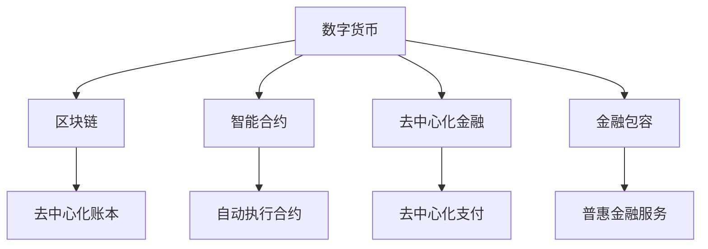

                 

# 未来的数字货币：从数字货币到全球货币体系重构的金融变革

## 1. 背景介绍

### 1.1 数字货币的发展历程

数字货币的兴起，是21世纪金融领域的一场革命。2008年，中本聪（Satoshi Nakamoto）发表了比特币白皮书，提出了一种去中心化的数字货币体系，即区块链技术。比特币的诞生，不仅改变了人们对于货币和支付的认知，也为后续数字货币的广泛应用奠定了基础。

在比特币之后，各类数字货币（如以太坊、莱特币、瑞波币等）纷纷涌现。它们不仅解决了中心化金融系统的弊端，还为去中心化金融（DeFi）、金融包容（Finclusion）等新型金融应用提供了可能。但与此同时，数字货币也面临诸多挑战，如波动性大、监管不明确、技术复杂等问题，制约了其大规模应用。

### 1.2 数字货币对传统金融体系的影响

随着数字货币的快速发展，传统金融体系受到了前所未有的挑战。传统的银行和金融机构在支付、清算、结算等方面，面临被区块链、智能合约等新技术所替代的风险。而央行也意识到，数字货币有望提升支付效率、降低交易成本、增加货币政策的灵活性等，因此许多央行纷纷开始探索数字货币的发行与使用。

近年来，中国央行推出了数字人民币（e-CNY），美联储也在积极研发CBDC（Central Bank Digital Currency），探索中央银行发行数字货币的可能性。全球范围内，数字货币正在逐步从边缘化的金融产品，走向中心化金融体系的核心地位，成为未来金融的重要组成部分。

### 1.3 数字货币的潜力和应用前景

数字货币不仅能够解决传统金融系统的诸多痛点，还能推动全球金融体系的重构。未来的数字货币有望成为全球通用货币，消除跨国汇款、交易成本高昂等问题，促进全球经济的互联互通。同时，数字货币还具备智能合约、隐私保护、去中心化金融等特性，为各类金融创新提供了广阔空间。

本文将围绕数字货币的核心概念、算法原理、应用场景等展开详细讨论，为读者提供一个全面的视角，洞察数字货币未来的发展趋势和挑战。

## 2. 核心概念与联系

### 2.1 核心概念概述

为更好地理解数字货币及其未来发展，本节将介绍几个密切相关的核心概念：

- 数字货币（Digital Currency）：基于区块链、分布式账本技术，实现去中心化的货币体系，具有透明、去中介、抗篡改等特点。
- 中央银行数字货币（CBDC）：由央行发行的数字货币，旨在实现数字时代的货币政策，同时保障金融稳定和公众信任。
- 智能合约（Smart Contract）：自动执行的、具有密码学保障的合约，可用于各种金融合约的自动执行，如借贷、抵押等。
- 去中心化金融（DeFi）：基于区块链和智能合约的金融服务，实现去中心化、去中介、低成本等优点，被视为未来金融发展的方向。
- 金融包容（Finclusion）：通过数字货币和区块链技术，为没有银行账户的人群提供金融服务，促进全球金融公平和普惠。

这些核心概念共同构成了数字货币的基本框架，使其在未来的金融变革中扮演重要角色。

### 2.2 核心概念原理和架构的 Mermaid 流程图



以上Mermaid流程图展示了数字货币与核心概念之间的关系：

1. 数字货币基于区块链技术，形成去中心化账本。
2. 智能合约作为区块链的重要应用，可以实现自动执行的合约功能。
3. 去中心化金融通过智能合约等技术，提供去中介、低成本的金融服务。
4. 金融包容利用数字货币和区块链技术，实现普惠金融服务。

这些概念相互依存，共同推动了数字货币的广泛应用和未来金融体系的变革。

## 3. 核心算法原理 & 具体操作步骤

### 3.1 算法原理概述

数字货币的算法原理主要围绕区块链技术和分布式账本展开。区块链通过去中心化的共识机制，实现数据的透明和不可篡改。数字货币则在此基础上，通过智能合约和加密算法，实现去中介、去信任的货币交易。

在数字货币中，每个交易都是通过区块链网络广播和验证，由节点共同记录在账本中。智能合约则通过编程语言，实现交易的自动执行和条件触发。数字货币的发行和管理，一般由央行或自治组织进行。

### 3.2 算法步骤详解

数字货币的核心算法步骤包括以下几个关键环节：

1. **交易广播**：用户通过区块链网络广播交易信息，交易信息包含发送方、接收方、金额等基本信息。

2. **节点验证**：区块链网络中的节点对交易信息进行验证，包括交易的合法性、金额的计算、签名有效性等。

3. **共识达成**：网络中的节点通过共识算法（如PoW、PoS、DPoS等）达成共识，决定哪个交易被记录在区块链上。

4. **区块生成**：经过验证和共识达成的交易，被打包成区块，通过共识算法形成新区块。

5. **账本更新**：新区块被广播到网络，所有节点更新账本，实现数据的透明和不可篡改。

6. **智能合约执行**：在交易达成后，智能合约根据预设规则自动执行，如自动转账、智能借贷等。

### 3.3 算法优缺点

数字货币的核心算法具有以下优点：

- **去中心化**：无中央权威，所有节点共同维护账本，提高了系统的鲁棒性和安全性。
- **透明公开**：所有交易和账本信息公开透明，提高了系统的透明度和可信度。
- **不可篡改**：通过区块链技术，所有交易一旦记录，便不可篡改，保障了数据的安全性和完整性。
- **高效低成本**：通过智能合约等技术，降低了交易成本和中介费用。

但同时，数字货币也存在以下缺点：

- **波动性大**：数字货币市场易受市场情绪影响，价格波动较大，难以稳定币值。
- **技术复杂**：区块链和智能合约等技术复杂，需要较高的技术门槛。
- **监管困难**：传统金融机构难以监管数字货币，增加了金融风险。
- **易受攻击**：数字货币交易容易被黑客攻击，存在安全风险。

### 3.4 算法应用领域

数字货币的应用领域非常广泛，涉及金融、支付、供应链、物联网等多个行业。以下是几个典型的应用场景：

1. **跨境支付**：数字货币可以消除跨国汇款的高额手续费和时间长的问题，实现实时、低成本的跨境支付。

2. **供应链金融**：通过区块链技术，数字货币可以实现供应链上下游的信息透明和资金流动自动化，提升供应链效率。

3. **物联网**：数字货币可以实现物联网设备间的去中心化支付和交易，推动物联网的广泛应用。

4. **智能合约**：数字货币结合智能合约技术，可以实现各种自动化合约，如自动保险、自动贷款等。

5. **数字资产**：数字货币可以作为数字资产的形式存在，用于各种去中心化金融应用。

## 4. 数学模型和公式 & 详细讲解 & 举例说明

### 4.1 数学模型构建

数字货币的数学模型主要基于区块链和分布式账本技术。假设数字货币网络中有 $N$ 个节点，每个节点维护一个账本 $L$，账本中包含所有交易记录 $T$。账本的更新规则如下：

$$
L_{i+1} = L_i + T_i
$$

其中 $L_i$ 表示第 $i$ 轮次的网络账本，$T_i$ 表示第 $i$ 轮次的交易记录。交易记录 $T_i$ 包括交易双方地址 $A$ 和金额 $M$，以及交易签名 $S$，表示交易的合法性。

### 4.2 公式推导过程

假设网络中的某个节点 $A$ 发起一笔交易 $T_A$，通过网络广播交易信息：

$$
T_A = (A, B, M, S)
$$

节点 $A$ 的交易需要其他节点的验证和共识。假设节点 $B$ 验证交易合法，并在共识算法中达成共识。则交易 $T_A$ 被记录在账本 $L$ 中：

$$
L_{i+1} = L_i + (A, B, M, S)
$$

此时，其他节点也需要更新自己的账本，实现数据的同步和一致。

### 4.3 案例分析与讲解

以比特币为例，其数学模型和算法步骤如下：

1. **交易广播**：比特币交易通过区块链网络广播，每个节点将交易信息存入自己的本地账本。

2. **节点验证**：节点通过校验交易签名和共识算法（如PoW）验证交易的合法性。

3. **共识达成**：经过PoW算法计算，网络节点达成共识，决定哪个交易被记录在区块链上。

4. **区块生成**：经过验证的交易被打包成区块，新区块通过PoW算法生成。

5. **账本更新**：所有节点更新账本，新区块被广播到网络。

6. **智能合约执行**：比特币中的智能合约功能较弱，主要依赖中心化的交易所进行。

## 5. 项目实践：代码实例和详细解释说明

### 5.1 开发环境搭建

在进行数字货币开发前，我们需要准备好开发环境。以下是使用Python进行比特币开发的环境配置流程：

1. 安装Anaconda：从官网下载并安装Anaconda，用于创建独立的Python环境。

2. 创建并激活虚拟环境：
```bash
conda create -n bitcoin-env python=3.8 
conda activate bitcoin-env
```

3. 安装比特币相关库：
```bash
pip install bitcoinlib
```

4. 安装必要的开发工具：
```bash
pip install requests
```

完成上述步骤后，即可在`bitcoin-env`环境中开始比特币开发。

### 5.2 源代码详细实现

下面我们以比特币交易为例，给出使用Python比特币库进行比特币交易的代码实现。

```python
from bitcoin import Bitcoin

# 创建比特币对象
bitcoin = Bitcoin()

# 创建比特币钱包
wallet = bitcoin.Wallet()

# 获取比特币地址
address = wallet.new_address()

# 查询比特币余额
balance = wallet.get_balance(address)

# 创建比特币交易
transaction = bitcoin.Transaction()
transaction.add_input(wallet.get_private_key(address), address, 0.1)

# 设置交易输出
transaction.add_output(address, 0.1)

# 广播交易
broadcast = bitcoin.BroadcastTransaction(transaction)
```

以上就是使用Python比特币库进行比特币交易的完整代码实现。可以看到，比特币开发相对简洁，但仍然需要掌握一定的密码学和交易规则。

### 5.3 代码解读与分析

让我们再详细解读一下关键代码的实现细节：

**Bitcoin库**：
- 比特币库提供了Python接口，可以用于创建比特币钱包、生成比特币地址、查询比特币余额、创建比特币交易等操作。

**钱包(Wallet)**：
- 钱包用于存储比特币地址和私钥，通过私钥生成公钥，用于签名验证和交易。

**交易(Transaction)**：
- 交易包括输入和输出，输入为签名和地址，输出为金额和地址。

**广播交易(BroadcastTransaction)**：
- 将交易广播到比特币网络，由网络节点进行验证和共识，最终记录在区块链上。

以上代码展示了比特币开发的几个关键步骤，帮助读者理解比特币的交易和广播过程。

## 6. 实际应用场景

### 6.1 跨境支付

比特币和数字货币在跨境支付领域具备巨大的优势。传统银行汇款通常需要数天时间，费用高昂。而比特币交易可以实时完成，且无中间机构，大大降低了跨境支付的成本和周期。

以比特币为例，用户可以通过比特币钱包生成比特币地址，将比特币发送到对方的地址。由于比特币交易公开透明，所有交易记录都可以查询，增加了交易的可信度和安全性。

### 6.2 供应链金融

区块链技术结合数字货币，可以实现供应链金融的数字化和自动化。例如，供应商可以通过智能合约自动获得货款，减少融资成本和时间。

在供应链中，各节点通过比特币地址进行身份认证和交易，智能合约可以自动触发支付和清算，提升供应链效率和透明度。

### 6.3 物联网

数字货币和区块链技术，可以实现物联网设备间的去中心化支付和交易。例如，智能家居设备可以通过比特币地址进行通信和支付，提高了设备间的协同和互动。

物联网设备通过比特币地址进行身份验证和交易，提高了设备的安全性和可靠性。同时，智能合约可以实现设备间的自动化支付，提升设备的管理和维护效率。

### 6.4 未来应用展望

随着数字货币的不断发展和应用，其未来前景令人期待。以下是几个未来应用展望：

1. **全球通用货币**：数字货币有望成为全球通用货币，消除跨国汇款、交易成本高昂等问题，促进全球经济的互联互通。

2. **金融包容**：通过数字货币和区块链技术，为没有银行账户的人群提供金融服务，促进全球金融公平和普惠。

3. **去中心化金融（DeFi）**：数字货币结合智能合约，实现去中心化、去中介、低成本的金融服务，成为未来金融发展的方向。

4. **跨链技术**：数字货币通过跨链技术，实现不同区块链之间的互操作，提升系统的灵活性和扩展性。

5. **智能合约应用**：智能合约作为数字货币的重要应用，可以应用于各种金融合约的自动执行，如自动保险、自动贷款等。

6. **监管科技（RegTech）**：数字货币结合区块链技术，可以实现监管科技，提升金融监管的效率和透明度。

## 7. 工具和资源推荐

### 7.1 学习资源推荐

为了帮助开发者系统掌握数字货币的理论基础和实践技巧，这里推荐一些优质的学习资源：

1. 《区块链：去中心化金融的未来》：一本全面介绍区块链技术的书籍，涵盖区块链原理、加密算法、智能合约等内容。

2. 比特币白皮书（Bitcoin Whitepaper）：中本聪发表的比特币白皮书，详细阐述了比特币的原理和实现细节，是理解数字货币的基础。

3. 《区块链与数字货币》课程：Coursera平台上的比特币和区块链课程，由比特币开发者讲授，内容深入浅出。

4. 比特币官方文档：比特币官方提供的API和开发文档，详细介绍了比特币的编程接口和使用方法。

5. 比特币开发者社区：比特币社区提供了丰富的开发者资源和交流平台，帮助开发者解决实际问题。

通过对这些资源的学习实践，相信你一定能够快速掌握数字货币的精髓，并用于解决实际的金融问题。

### 7.2 开发工具推荐

高效的开发离不开优秀的工具支持。以下是几款用于比特币开发和区块链开发的常用工具：

1. BitcoinLib：比特币开发的Python库，提供比特币钱包、交易、加密等功能的API接口。

2. Web3.py：用于以太坊开发的Python库，支持智能合约、钱包、交易等功能的开发。

3. Truffle：以太坊开发的集成开发环境（IDE），提供智能合约的开发、测试和部署功能。

4. MetaMask：以太坊开发的浏览器扩展，用于以太坊钱包的创建和管理。

5. Node.js：用于区块链网络开发的JavaScript运行环境，支持分布式账本、智能合约等功能。

合理利用这些工具，可以显著提升数字货币开发的效率，加快创新迭代的步伐。

### 7.3 相关论文推荐

数字货币的研究源于学界的持续探索。以下是几篇奠基性的相关论文，推荐阅读：

1. Bitcoin: A Peer-to-Peer Electronic Cash System：中本聪发表的比特币白皮书，详细阐述了比特币的原理和实现细节。

2. On the Economics and Game Theory of Blockchain Protocols with Asynchronous Peers：分析了区块链协议的经济和游戏理论基础，提出了异步节点共识机制。

3. Smart Contracts: Concepts, Languages, and Architectures：探讨了智能合约的概念、语言和架构，为智能合约的开发提供了理论基础。

4. Secure and Trustworthy Decentralized Finance（DeFi）：分析了DeFi的潜在风险和安全问题，提出了解决方案和建议。

5. Blockchain: Build Blockchain Applications with Python：介绍如何使用Python进行区块链开发，涵盖区块链的原理、编程接口等内容。

这些论文代表了大数字货币的发展脉络。通过学习这些前沿成果，可以帮助研究者把握学科前进方向，激发更多的创新灵感。

## 8. 总结：未来发展趋势与挑战

### 8.1 总结

本文对数字货币的核心概念、算法原理、应用场景等进行了全面系统的介绍。首先阐述了数字货币的发展历程和影响，明确了数字货币在金融体系中的重要地位。其次，从原理到实践，详细讲解了数字货币的数学模型和算法步骤，给出了数字货币项目开发的完整代码实例。同时，本文还探讨了数字货币在跨境支付、供应链金融、物联网等领域的广泛应用前景，展示了数字货币技术的巨大潜力。

通过本文的系统梳理，可以看到，数字货币正逐步成为未来金融体系的核心，对传统金融体系产生深远影响。未来的数字货币有望实现全球通用，推动金融包容和普惠，促进金融创新和科技发展。

### 8.2 未来发展趋势

展望未来，数字货币的发展趋势包括：

1. **全球通用货币**：数字货币有望成为全球通用货币，消除跨国汇款、交易成本高昂等问题，促进全球经济的互联互通。

2. **金融包容**：通过数字货币和区块链技术，为没有银行账户的人群提供金融服务，促进全球金融公平和普惠。

3. **去中心化金融（DeFi）**：数字货币结合智能合约，实现去中心化、去中介、低成本的金融服务，成为未来金融发展的方向。

4. **跨链技术**：数字货币通过跨链技术，实现不同区块链之间的互操作，提升系统的灵活性和扩展性。

5. **智能合约应用**：智能合约作为数字货币的重要应用，可以应用于各种金融合约的自动执行，如自动保险、自动贷款等。

6. **监管科技（RegTech）**：数字货币结合区块链技术，可以实现监管科技，提升金融监管的效率和透明度。

这些趋势凸显了数字货币技术的广阔前景，预示着未来金融体系的巨大变革。

### 8.3 面临的挑战

尽管数字货币技术在不断发展，但在迈向更加智能化、普适化应用的过程中，它仍面临着诸多挑战：

1. **波动性大**：数字货币市场易受市场情绪影响，价格波动较大，难以稳定币值。

2. **技术复杂**：区块链和智能合约等技术复杂，需要较高的技术门槛。

3. **监管困难**：传统金融机构难以监管数字货币，增加了金融风险。

4. **易受攻击**：数字货币交易容易被黑客攻击，存在安全风险。

5. **隐私保护**：数字货币交易隐私性高，增加了监管和审计难度。

6. **用户接受度**：数字货币需要用户接受度高的应用场景，才能实现广泛应用。

正视数字货币面临的这些挑战，积极应对并寻求突破，将是大数字货币走向成熟的必由之路。

### 8.4 研究展望

面对数字货币技术所面临的挑战，未来的研究需要在以下几个方面寻求新的突破：

1. **稳定币机制**：开发稳定币机制，稳定数字货币的价格波动，增强数字货币的实用性和稳定性。

2. **跨链协议**：开发跨链协议，实现不同区块链之间的互操作，提升系统的灵活性和扩展性。

3. **隐私保护技术**：研究隐私保护技术，如零知识证明、同态加密等，增强数字货币交易的隐私性和安全性。

4. **智能合约优化**：优化智能合约的设计和执行，提高智能合约的安全性和可靠性。

5. **监管合规**：研究数字货币的监管合规机制，确保数字货币应用符合法律法规要求。

6. **用户教育**：加强用户教育，提升公众对数字货币的认知和接受度，推动数字货币的广泛应用。

这些研究方向的探索，必将引领数字货币技术迈向更高的台阶，为构建安全、可靠、可解释、可控的数字货币系统铺平道路。面向未来，数字货币技术还需要与其他金融科技技术进行更深入的融合，如区块链、大数据、人工智能等，多路径协同发力，共同推动数字货币技术的进步。只有勇于创新、敢于突破，才能不断拓展数字货币的边界，让数字货币技术更好地造福人类社会。

## 9. 附录：常见问题与解答

**Q1：数字货币和传统货币有什么区别？**

A: 数字货币和传统货币的最大区别在于其去中心化的特性。数字货币基于区块链和分布式账本技术，实现了去中介、去信任的货币体系，具备透明、不可篡改的特点。而传统货币由中央银行发行和管理，需要通过银行等中介机构进行交易，存在信任风险和中介费用。

**Q2：数字货币的波动性大，如何解决这个问题？**

A: 数字货币的波动性主要源于市场投机行为和供需关系。为了稳定币值，可以采用稳定币机制，如 pegged tokens，将数字货币与法定货币或资产挂钩，实现价格稳定。此外，还可以使用去中心化交易所（DeFi exchanges）进行套利交易，缓解市场波动。

**Q3：数字货币的安全性如何保障？**

A: 数字货币的安全性主要依赖于区块链和智能合约等技术。区块链通过共识算法和加密技术，保障了数据的安全性和不可篡改性。智能合约通过编程语言，实现自动执行和条件触发，提高了交易的透明性和可信度。但同时，数字货币也面临黑客攻击和漏洞的风险，需要不断更新和维护系统安全。

**Q4：数字货币的应用前景如何？**

A: 数字货币的应用前景非常广阔，涉及金融、支付、供应链、物联网等多个行业。通过数字货币和区块链技术，可以实现去中介、去信任、低成本的交易和支付，提升金融系统的效率和透明度。同时，数字货币结合智能合约、DeFi等技术，可以实现各类金融创新应用，推动金融科技的发展。

**Q5：数字货币的监管问题如何解决？**

A: 数字货币的监管问题需要多方面协同解决。央行和监管机构可以制定相关法律法规，明确数字货币的法律地位和监管框架。数字货币平台和交易所需要加强自律，建立反洗钱和反恐融资机制。同时，公众也需要提高对数字货币的认知和接受度，积极配合监管要求。

这些常见问题的解答，帮助读者更好地理解数字货币的基本概念和应用前景，进一步深入探讨数字货币技术的发展和挑战。

---

作者：禅与计算机程序设计艺术 / Zen and the Art of Computer Programming

