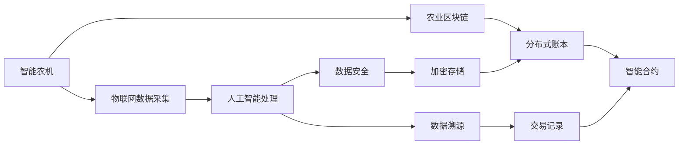

                 

# 未来的智慧农业：2050年的智能农机与农业区块链

## 1. 背景介绍

随着科技的不断进步，智慧农业（Smart Agriculture）正逐渐从概念走向现实，对未来农业生产方式产生深远影响。特别是在2050年的展望中，随着物联网（IoT）、人工智能（AI）、区块链（Blockchain）等前沿技术的融合，智能农机与农业区块链将带来农业生产方式的革命性变化。本文将深入探讨智能农机和农业区块链的核心概念、应用原理、算法原理与操作步骤，旨在为智慧农业的未来发展提供有价值的参考。

## 2. 核心概念与联系

### 2.1 核心概念概述

智能农机（Smart Agricultural Machinery）结合了物联网、人工智能和大数据分析技术，能够实时监控和管理农田环境，精确执行农业操作，极大提高农业生产效率。

农业区块链（Agricultural Blockchain）则利用区块链的分布式账本、智能合约和去中心化特性，保障食品供应链的透明与安全，促进农业资源的合理分配和管理。

这两个核心概念的联系在于，智能农机通过物联网和人工智能技术采集海量数据，而农业区块链则利用这些数据进行安全、透明的溯源与交易，从而共同构建一个高度智能化、可追溯的智慧农业生态系统。

### 2.2 核心概念原理和架构的 Mermaid 流程图



这个流程图展示了智能农机与农业区块链之间的数据流与技术联系：

1. 智能农机通过物联网采集农田环境数据。
2. 这些数据经过人工智能处理后，通过区块链进行安全存储和溯源。
3. 区块链中的智能合约执行农业交易和操作，确保透明性与不可篡改性。

## 3. 核心算法原理 & 具体操作步骤

### 3.1 算法原理概述

智能农机的核心算法原理包括物联网（IoT）数据采集、人工智能（AI）数据分析和区块链（Blockchain）数据管理三个方面。

农业区块链的算法原理则涉及分布式账本（Distributed Ledger）、智能合约（Smart Contracts）和共识机制（Consensus）。

### 3.2 算法步骤详解

#### 智能农机算法步骤

1. **数据采集**：部署传感器采集土壤湿度、温度、光照、作物生长数据。
2. **数据分析**：利用机器学习算法分析数据，预测作物生长状态和病虫害情况。
3. **自动化操作**：根据分析结果，智能农机自动执行播种、浇水、施肥、病虫害防治等操作。
4. **数据记录与分析**：将操作数据记录在区块链中，供后期溯源与分析使用。

#### 农业区块链算法步骤

1. **分布式账本构建**：建立分布式账本，记录所有农产品的种植、收获、交易数据。
2. **智能合约编写**：编写智能合约，定义农产品交易流程和规则，确保操作透明与自动执行。
3. **共识机制选择**：选择合适的共识机制，如PoW、PoS等，保障账本的不可篡改性和数据一致性。
4. **去中心化交易**：实现去中心化交易，保障交易的安全性和透明度。

### 3.3 算法优缺点

智能农机的优点包括：

- 实时监控农田环境，提高生产效率。
- 精确控制操作，减少资源浪费。
- 数据实时记录，便于溯源和分析。

缺点包括：

- 设备成本较高，初期投入大。
- 技术复杂度高，维护成本高。
- 数据传输可能受限，部署受地理位置限制。

农业区块链的优点包括：

- 数据透明，防止欺诈和腐败。
- 交易自动化，提高交易效率。
- 去中心化，提高数据安全和隐私保护。

缺点包括：

- 技术复杂度高，操作难度大。
- 交易成本较高，不适合小额交易。
- 共识机制可能导致网络延迟和资源消耗高。

### 3.4 算法应用领域

智能农机主要应用于农田管理、作物生长监测、农业机器人操作、精准农业等方面。

农业区块链主要应用于食品供应链追溯、农产品交易、农业补贴管理、农业保险等领域。

## 4. 数学模型和公式 & 详细讲解 & 举例说明

### 4.1 数学模型构建

智能农机的数学模型主要基于传感器数据和机器学习算法构建。例如，土壤湿度模型：

$$
W(t) = W_0 + k_1(T(t) - T_0) + k_2(H(t) - H_0)
$$

其中，$W(t)$ 表示土壤湿度，$W_0$ 是初始湿度，$T(t)$ 是温度，$H(t)$ 是湿度，$k_1$ 和 $k_2$ 是系数。

农业区块链的数学模型主要基于分布式账本和智能合约。例如，智能合约的编写格式：

```
function farmProduct(seller, buyer, product, price) {
    // 执行农产品交易
    return "交易成功";
}
```

### 4.2 公式推导过程

智能农机的公式推导涉及传感器数据与机器学习算法的结合。以土壤湿度模型为例：

$$
\hat{W(t)} = W_0 + k_1(T(t) - T_0) + k_2(H(t) - H_0)
$$

其中，$\hat{W(t)}$ 是预测的土壤湿度，$W_0, T_0, H_0$ 是初始数据，$k_1, k_2$ 是模型系数，通过回归分析或神经网络训练得到。

农业区块链的公式推导涉及分布式账本和智能合约的结合。以智能合约的编写为例：

1. **定义函数**：
   - `function farmProduct(seller, buyer, product, price) {`
2. **执行交易**：
   - `// 执行农产品交易`
   - `return "交易成功";`

### 4.3 案例分析与讲解

智能农机的案例分析：

- **案例1**：智能温室管理
  - **场景**：智能温室根据传感器数据实时调整环境条件。
  - **算法**：机器学习算法分析环境数据，预测植物生长状态，自动调节温度、湿度、光照等。
  - **结果**：提高植物生长效率，减少资源浪费。

农业区块链的案例分析：

- **案例2**：食品供应链追溯
  - **场景**：消费者可以追踪食品从农场到餐桌的全过程。
  - **算法**：区块链记录每个环节的操作信息，智能合约验证操作合规性。
  - **结果**：保障食品安全，提升消费者信任度。

## 5. 项目实践：代码实例和详细解释说明

### 5.1 开发环境搭建

智能农机与农业区块链的项目开发需要以下环境：

- 操作系统：Linux、Windows、macOS
- 编程语言：Python、Java、C++
- 数据库：SQL、NoSQL
- 物联网设备：温度传感器、湿度传感器、土壤传感器等
- 区块链平台：Hyperledger Fabric、Ethereum、Blockchain.com

### 5.2 源代码详细实现

#### 智能农机源代码实现

```python
# 传感器数据采集
from sensor import Sensor

# 机器学习模型
from sklearn.linear_model import LinearRegression

# 自动化操作
from farm_machinery import FarmMachinery

# 数据记录与分析
from blockchain import Blockchain

# 实例化传感器和模型
sensor = Sensor()
model = LinearRegression()

# 实例化农机和区块链
machinery = FarmMachinery(sensor, model)
blockchain = Blockchain()

# 数据采集与分析
data = sensor.collect_data()
model.fit(data)

# 自动化操作
machinery.control_automatically()

# 数据记录与分析
blockchain.record_operations(machinery.operations)
```

#### 农业区块链源代码实现

```javascript
// 分布式账本
const Fabric = require('fabric-sdk-node');

// 智能合约
const SmartContract = require('smart-contract');

// 共识机制
const Consensus = require('consensus');

// 实例化账本和合约
const fabric = new Fabric('my-fabric');
const smartContract = new SmartContract('farm-product-contract');

// 实例化共识
const consensus = new Consensus('PoW');

// 交易记录
smartContract.addProduct('product-name', 'quantity', 'price');

// 验证交易
consensus.validate(smartContract)
```

### 5.3 代码解读与分析

智能农机的代码实现：

- **传感器数据采集**：通过传感器实时采集环境数据。
- **机器学习模型**：利用线性回归等算法进行数据建模和预测。
- **自动化操作**：通过农机执行实际操作，如施肥、浇水等。
- **数据记录与分析**：将操作数据记录在区块链上，方便后期分析。

农业区块链的代码实现：

- **分布式账本**：使用Fabric等区块链平台构建分布式账本。
- **智能合约**：定义农产品交易流程和规则。
- **共识机制**：选择PoW、PoS等共识机制确保数据一致性和不可篡改性。
- **交易记录**：将交易数据记录在区块链上，保障透明度。

### 5.4 运行结果展示

智能农机的运行结果：

- **数据采集**：每小时采集环境数据，生成传感器数据文件。
- **模型预测**：模型预测土壤湿度、温度、光照等，生成预测文件。
- **自动化操作**：根据预测结果，自动执行操作，生成操作记录文件。
- **数据记录**：将操作记录上传到区块链，生成区块链数据文件。

农业区块链的运行结果：

- **账本记录**：记录所有农产品种植、收获、交易数据。
- **智能合约执行**：自动执行农产品交易，生成交易记录。
- **共识验证**：验证交易的合规性，生成验证结果。

## 6. 实际应用场景

### 6.1 智能温室管理

智能温室利用智能农机和农业区块链技术，实现高效、智能的温室管理。通过传感器采集环境数据，机器学习模型预测作物生长状态，智能农机自动调节环境条件，所有操作数据记录在区块链上，保障数据透明与可追溯。

### 6.2 食品供应链追溯

食品供应链利用农业区块链技术，实现从农田到餐桌的全过程追溯。消费者可以实时查看食品的种植、收获、运输、存储、销售等环节信息，确保食品安全，提升信任度。

### 6.3 精准农业

精准农业利用智能农机技术，实现农田环境的实时监控与自动化操作。通过传感器采集数据，机器学习模型预测作物生长状态，智能农机精确执行操作，提高农业生产效率和资源利用率。

### 6.4 未来应用展望

未来，智能农机与农业区块链技术将进一步发展，带来更多应用场景：

- **智能农场**：完全自动化的农场管理系统，通过智能农机和区块链实现全自动化操作与数据管理。
- **农业金融**：利用区块链技术，实现农业信贷、保险等金融服务。
- **农业教育**：利用智能农机和区块链技术，提供农业生产管理的教育与培训。

## 7. 工具和资源推荐

### 7.1 学习资源推荐

- **《智慧农业技术》系列教材**：全面介绍智慧农业的基础知识和核心技术。
- **Coursera智慧农业课程**：提供农业物联网、大数据、区块链等课程。
- **Kaggle农业数据集**：包含大量农业领域的训练数据集，用于机器学习算法训练。

### 7.2 开发工具推荐

- **TensorFlow**：深度学习框架，支持智能农机中的机器学习算法实现。
- **Fabric**：Hyperledger Fabric，支持农业区块链的分布式账本实现。
- **Ethereum**：支持农业区块链的智能合约编写与执行。
- **Kubernetes**：容器编排工具，支持智能农机与区块链的应用部署与扩展。

### 7.3 相关论文推荐

- **智能农机与物联网技术研究**：介绍智能农机的设计与实现。
- **农业区块链技术与供应链管理**：探讨农业区块链在食品供应链中的应用。
- **精准农业与机器学习算法**：研究机器学习在精准农业中的应用。

## 8. 总结：未来发展趋势与挑战

### 8.1 研究成果总结

本文探讨了智能农机与农业区块链的核心概念、应用原理、算法原理与操作步骤，揭示了未来智慧农业的发展方向与挑战。智能农机与农业区块链技术的融合，将为农业生产方式带来革命性变革，提高农业生产效率和资源利用率，保障食品安全，促进农业可持续发展。

### 8.2 未来发展趋势

未来，智能农机与农业区块链技术将呈现以下几个发展趋势：

- **技术融合**：智能农机与区块链技术深度融合，实现数据、操作、管理的一体化。
- **物联网普及**：物联网设备的应用将更加普及，实现农田环境的全面监控。
- **AI技术提升**：AI算法的不断进步，将提升智能农机的智能决策能力。
- **区块链成熟**：区块链技术的成熟，将促进农业供应链的透明与安全。

### 8.3 面临的挑战

智能农机与农业区块链技术面临的挑战包括：

- **技术复杂度高**：智能农机与区块链技术的复杂性，需要高水平的技术支持。
- **数据安全与隐私**：数据安全与隐私保护是智能农机与区块链面临的重要问题。
- **成本问题**：智能农机与区块链技术的部署与维护成本较高，需要高投资。

### 8.4 研究展望

未来的研究方向包括：

- **技术优化**：进一步优化智能农机与区块链技术的实现，降低成本，提高效率。
- **应用拓展**：拓展智能农机与区块链技术的应用范围，推动智慧农业的产业化。
- **伦理与法律**：研究智能农机与区块链技术的伦理与法律问题，保障公平与透明。

## 9. 附录：常见问题与解答

**Q1：智能农机如何与传统农业结合？**

A: 智能农机与传统农业结合，可以通过逐步引入智能设备和技术，对传统农业进行升级改造。例如，首先从简单的环境监控开始，逐步引入自动化操作和数据分析，最终实现全自动化生产。

**Q2：农业区块链如何防止数据篡改？**

A: 农业区块链通过分布式账本和共识机制，确保数据不可篡改。不同的共识机制，如PoW、PoS等，通过验证机制和共识算法，确保数据的真实性和完整性。

**Q3：智能农机的部署成本如何控制？**

A: 智能农机的部署成本可以通过多种方式控制，例如：
- 选择性价比高的设备与技术。
- 分阶段部署，逐步扩展功能。
- 利用开源技术与工具，降低开发与维护成本。

**Q4：农业区块链的交易成本如何降低？**

A: 农业区块链的交易成本可以通过以下方式降低：
- 使用轻量级区块链平台，如Hyperledger Fabric。
- 优化智能合约，减少交易复杂性和计算量。
- 采用多链融合技术，降低交易费用。

**Q5：智能农机与农业区块链的未来发展前景如何？**

A: 智能农机与农业区块链的未来发展前景广阔，将带来农业生产方式的全面变革。随着技术的发展，智能农机将实现更高效、更智能的农田管理，农业区块链将实现更透明、更安全的供应链管理。这将极大提升农业生产效率和资源利用率，保障食品安全，促进农业可持续发展。

