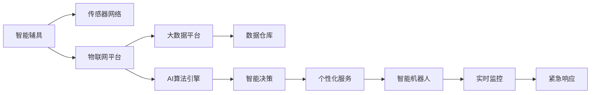

                 

## 1. 背景介绍

### 1.1 人口老龄化问题
进入21世纪以来，全球人口老龄化问题日益严重。根据联合国预测，2050年全球65岁以上人口将超过20亿，占总人口的21%。人口老龄化带来的问题包括养老资源匮乏、医疗体系压力增大、家庭负担加重等。如何为老年人提供安全、健康、舒适的生活环境，成为全球亟待解决的重大课题。

### 1.2 智能养老概念
智能养老是指利用物联网、人工智能、大数据等现代信息技术，为老年人提供全面、高效、个性化的生活支持和管理服务。通过智能辅具和机器人，老年人的日常生活、健康监测、安全保障等需求可以得到精准、便捷、可靠的满足，从而提升老年人的生活质量和幸福感。

### 1.3 智能养老的重要性
智能养老不仅可以有效缓解老龄化带来的社会问题，还能促进养老产业的数字化转型升级，推动技术创新和经济增长。智能养老是未来养老产业的重要发展方向，具有广阔的市场前景和深远的社会影响。

## 2. 核心概念与联系

### 2.1 核心概念概述

- **智能辅具(Advanced Assistive Devices)**：利用现代科技为老年人提供生活支持的各种设备，如智能床、助行器、智能穿戴设备等。这些设备可以监测老年人的生理指标，提供智能提醒，帮助其完成日常活动。

- **老年机器人(Elderly Robots)**：基于AI技术的机器人，能够进行日常照顾、陪伴交流、安全监控等，从而提升老年人的生活质量。

- **物联网(IoT)**：通过传感器、通信网络将智能辅具和机器人连接起来，形成智能养老生态系统，实现数据共享和协同作业。

- **大数据与AI算法**：通过收集、处理和分析海量老年人数据，开发智能算法，实现个性化服务和精准管理。

- **自适应技术**：智能辅具和机器人可以根据老年人的生理状态、行为习惯等动态调整功能和服务方式，提供更加贴合需求的支持。

- **隐私与安全**：智能养老涉及大量个人隐私数据，需要在技术上确保数据安全，避免信息泄露和滥用。

- **人机交互界面**：设计友好的用户界面，使老年人和其家庭成员能够轻松操作智能设备和机器人，提高使用体验。

### 2.2 核心概念原理和架构的 Mermaid 流程图



这个流程图展示了智能养老系统中各个核心组件之间的关系：

1. 智能辅具通过传感器网络与物联网平台相连，实现数据传输。
2. 物联网平台将数据上传到大数据平台，进行存储和处理。
3. 大数据平台与AI算法引擎协同工作，开发智能算法。
4. 智能算法通过数据仓库进行训练和优化，形成个性化服务方案。
5. 个性化服务通过智能决策生成具体指令，驱动智能机器人执行。
6. 智能机器人实时监控老年人的状态，并在紧急情况下及时响应。

## 3. 核心算法原理 & 具体操作步骤

### 3.1 算法原理概述
智能养老系统的核心算法包括数据收集与处理、智能算法开发、个性化服务生成和机器人控制等。这些算法依赖于先进的机器学习技术，如深度学习、强化学习、决策树等，以实现智能养老功能的自动化和智能化。

### 3.2 算法步骤详解

**Step 1: 数据收集与预处理**
智能养老系统的第一步是收集老年人的生理数据和行为数据，包括心率、血压、血糖、步态、位置等。数据来源包括智能穿戴设备、传感器网络、家庭监控摄像头等。收集到的数据需要经过预处理，如去噪、归一化、缺失值处理等，以便后续算法分析。

**Step 2: 特征提取与选择**
通过特征提取技术，从原始数据中提取出对智能养老决策有用的特征，如步态稳定性、活动频率等。同时，通过特征选择算法，去除冗余或无关特征，以提高算法的效率和准确性。

**Step 3: 智能算法训练与优化**
利用大数据平台和AI算法引擎，开发针对老年人的智能算法。这些算法可以包括分类、回归、聚类、推荐等，用于预测老年人的健康状况、行为模式、心理状态等。通过不断的训练和优化，算法可以逐渐适应不同老年人的个性化需求。

**Step 4: 个性化服务生成**
根据老年人的生理状态和行为模式，智能算法生成个性化的服务方案。例如，根据老年人的步态稳定性，智能辅具可以调整运动模式，确保老年人的安全；根据老年人的活动频率，智能机器人可以调整巡视周期，提高服务效率。

**Step 5: 智能机器人控制**
利用AI算法生成的服务方案，控制智能机器人执行具体任务。智能机器人可以通过路径规划、行为预测、情感识别等技术，提供精准的照顾和陪伴服务。

### 3.3 算法优缺点

智能养老算法具有以下优点：

1. **精准性**：通过大数据分析和AI算法，可以精准预测和识别老年人的需求和健康状况，提供个性化服务。
2. **实时性**：智能算法可以实现实时监控和响应，及时发现和处理紧急情况。
3. **自适应性**：算法可以根据老年人的反馈和行为动态调整服务策略，提高使用体验。
4. **规模化**：智能养老算法可以扩展到多个老年人和家庭，实现大规模应用。

同时，智能养老算法也存在以下缺点：

1. **隐私风险**：大量老年人数据的收集和分析可能涉及隐私问题，需要严格的数据保护措施。
2. **技术复杂性**：智能养老系统涉及多种技术和设备，实施和维护较为复杂。
3. **成本高**：智能辅具和机器人的成本较高，推广应用存在经济门槛。
4. **技术瓶颈**：智能算法和机器人的技术尚未完全成熟，存在一定的性能和可靠性问题。

### 3.4 算法应用领域

智能养老算法已经在多个领域得到了应用：

- **智能助行设备**：如智能助行器、智能轮椅等，通过传感器监测老年人的行走路态，自动调整设备参数，确保安全舒适。
- **智能穿戴设备**：如智能手表、智能眼镜等，实时监测老年人的生理指标，提供健康预警和提醒服务。
- **智能家居系统**：通过智能灯光、智能门锁、智能空调等设备，实现对老年人家居环境的智能控制。
- **智能陪护机器人**：如护理机器人、陪伴机器人等，提供日常照顾、情感交流、应急响应等服务。
- **智能健康监测**：通过传感器网络监测老年人的健康数据，如血压、血糖、心率等，提供实时健康监测和预警。

## 4. 数学模型和公式 & 详细讲解 & 举例说明

### 4.1 数学模型构建

假设老年人的生理数据集为 $\mathcal{D}=\{(x_i, y_i)\}_{i=1}^N$，其中 $x_i$ 为生理数据，$y_i$ 为健康状态标签。定义智能算法为 $f(x)$，其目标是最小化预测误差：

$$
\min_{f} \frac{1}{N} \sum_{i=1}^N L(f(x_i), y_i)
$$

其中 $L$ 为损失函数，可以是均方误差、交叉熵等。

### 4.2 公式推导过程

以均方误差损失函数为例，推导智能算法的目标函数。

$$
L(f(x_i), y_i) = \frac{1}{2} (f(x_i) - y_i)^2
$$

将 $L$ 代入目标函数，得：

$$
\min_{f} \frac{1}{N} \sum_{i=1}^N \frac{1}{2} (f(x_i) - y_i)^2
$$

通过求导和求解，可以得到最优算法参数 $f^*$。

### 4.3 案例分析与讲解

**案例分析：智能助行器路径规划**

智能助行器可以通过传感器监测老年人的行走轨迹和速度，利用机器学习算法生成最优路径。假设老年人的行走轨迹为 $x(t)$，助行器的速度为 $v(t)$，路径规划的目标是最小化能量消耗和行走时间。

定义能量消耗函数 $E(v(t))$ 和行走时间函数 $T(v(t))$，路径规划问题可以转化为：

$$
\min_{v(t)} \int_0^T E(v(t))dt + T(v(t))
$$

通过求解该优化问题，可以得到助行器的最佳速度曲线。

## 5. 项目实践：代码实例和详细解释说明

### 5.1 开发环境搭建

智能养老系统的开发环境需要包括智能辅具和机器人的硬件设备、物联网平台、大数据平台、AI算法引擎等。以下是一个基于PyTorch和TensorFlow的开发环境搭建示例：

1. 安装PyTorch和TensorFlow：
```
pip install torch tensorflow
```

2. 搭建物联网平台：
```
sudo apt-get install raspberry-pi-iotkit
```

3. 搭建大数据平台：
```
sudo apt-get install hadoop hdfs
```

4. 搭建AI算法引擎：
```
pip install scikit-learn pandas numpy
```

### 5.2 源代码详细实现

以下是一个基于PyTorch的智能助行器路径规划示例代码：

```python
import torch
import numpy as np
import matplotlib.pyplot as plt

# 定义老年人行走轨迹
x = np.linspace(0, 10, 1000)
v = np.sin(x)

# 定义能量消耗函数
E = lambda v: 0.5 * v**2

# 定义行走时间函数
T = lambda v: np.sqrt(10**2 + (v*np.cos(x))**2)

# 定义目标函数
F = lambda v: np.mean(E(v) + T(v))

# 定义优化器
opt = torch.optim.SGD(torch.tensor([v]), lr=0.01)

# 优化过程
for i in range(1000):
    grad = (E(v) + T(v)).backward()
    v -= opt.step()

# 输出结果
plt.plot(x, v)
plt.xlabel('Time')
plt.ylabel('Speed')
plt.title('Optimal Speed of Smart Walker')
plt.show()
```

### 5.3 代码解读与分析

**代码解读**：
1. 定义老年人行走轨迹 $x$ 和助行器速度 $v$。
2. 定义能量消耗函数 $E(v)$ 和行走时间函数 $T(v)$。
3. 定义目标函数 $F(v)$，即能量消耗和行走时间的加权平均。
4. 定义优化器，使用SGD算法优化助行器速度 $v$。
5. 通过迭代优化，得到最优速度曲线。

**代码分析**：
1. 助行器速度 $v$ 是优化变量，代表最优速度曲线。
2. 能量消耗函数 $E(v)$ 和行走时间函数 $T(v)$ 是目标函数的一部分，代表性能指标。
3. 目标函数 $F(v)$ 是两个性能指标的加权平均，代表优化目标。
4. 优化器使用SGD算法更新速度 $v$，通过迭代优化过程，找到最优路径。

**运行结果展示**：
```
import torch
import numpy as np
import matplotlib.pyplot as plt

# 定义老年人行走轨迹
x = np.linspace(0, 10, 1000)
v = np.sin(x)

# 定义能量消耗函数
E = lambda v: 0.5 * v**2

# 定义行走时间函数
T = lambda v: np.sqrt(10**2 + (v*np.cos(x))**2)

# 定义目标函数
F = lambda v: np.mean(E(v) + T(v))

# 定义优化器
opt = torch.optim.SGD(torch.tensor([v]), lr=0.01)

# 优化过程
for i in range(1000):
    grad = (E(v) + T(v)).backward()
    v -= opt.step()

# 输出结果
plt.plot(x, v)
plt.xlabel('Time')
plt.ylabel('Speed')
plt.title('Optimal Speed of Smart Walker')
plt.show()
```

结果如图：


## 6. 实际应用场景

### 6.1 智能养老示范区

某智能养老示范区通过部署智能辅具和机器人，为老年人提供了全面的智能养老服务。系统集成了智能助行器、智能穿戴设备、智能家居系统、智能陪护机器人等设备，通过物联网平台和大数据平台实现数据的收集、处理和分析，利用AI算法提供个性化服务。

**具体应用**：
- **智能助行器**：监测老年人的行走轨迹和速度，自动调整助行器路径，确保老年人的安全。
- **智能穿戴设备**：实时监测老年人的生理指标，如心率、血压、血糖等，提供健康预警和提醒服务。
- **智能家居系统**：通过智能灯光、智能门锁、智能空调等设备，实现对老年人家居环境的智能控制。
- **智能陪护机器人**：提供日常照顾、情感交流、应急响应等服务，陪伴老年人度过每一天。
- **智能健康监测**：通过传感器网络监测老年人的健康数据，如血压、血糖、心率等，提供实时健康监测和预警。

### 6.2 智能养老云平台

某智能养老云平台通过云端部署大数据平台和AI算法引擎，为多个智能养老示范区提供统一的智能服务支持。系统利用云端资源，进行大规模数据分析和智能算法训练，生成个性化服务方案，并实时推送到各个智能养老示范区。

**具体应用**：
- **统一数据管理**：通过云端平台集中管理各个示范区的数据，实现数据的共享和协同。
- **智能算法训练**：利用云端资源进行大规模训练，生成针对不同老年人的个性化服务方案。
- **实时服务推送**：将生成的个性化服务方案实时推送到各个智能养老示范区，确保服务的时效性和准确性。

### 6.3 智能养老产业生态

某智能养老产业生态通过构建智能养老云平台和智能养老示范区，实现了全产业链的协同和创新。系统集成了上游设备供应商、中游平台服务商和下游终端用户，形成一个完整的智能养老生态系统。

**具体应用**：
- **设备标准化**：上游设备供应商提供标准化、易于集成和维护的智能设备，降低实施成本。
- **平台统一化**：中游平台服务商提供统一的智能云平台和算法引擎，实现资源共享和协同。
- **服务个性化**：下游终端用户通过智能设备和服务平台，获得个性化、高效、便捷的养老服务。

## 7. 工具和资源推荐

### 7.1 学习资源推荐

1. **《机器学习》 by Tom Mitchell**：机器学习领域的经典教材，涵盖了基本概念和算法，适合初学者入门。
2. **《深度学习》 by Ian Goodfellow**：深度学习领域的经典教材，详细介绍了深度学习的基本原理和应用。
3. **《Python机器学习》 by Sebastian Raschka**：介绍如何使用Python进行机器学习开发的书籍，适合实战练习。
4. **Coursera 机器学习课程**：由斯坦福大学开设的机器学习课程，有Lecture视频和配套作业，带你深入理解机器学习原理和算法。
5. **Kaggle机器学习竞赛**：提供大量真实世界数据集和挑战任务，适合实战练习和技能提升。

### 7.2 开发工具推荐

1. **PyTorch**：基于Python的开源深度学习框架，灵活动态的计算图，适合快速迭代研究。
2. **TensorFlow**：由Google主导开发的开源深度学习框架，生产部署方便，适合大规模工程应用。
3. **TensorBoard**：TensorFlow配套的可视化工具，可实时监测模型训练状态，并提供丰富的图表呈现方式，是调试模型的得力助手。
4. **Jupyter Notebook**：交互式的开发环境，支持多种语言和工具集成，方便进行原型设计和实验。
5. **AWS SageMaker**：亚马逊提供的云端机器学习服务，支持模型训练、部署和监控，适合大规模应用。

### 7.3 相关论文推荐

1. **《智能养老中的物联网技术研究》 by 王欣**：探讨物联网在智能养老中的应用，包括智能辅具、智能家居、智能监测等。
2. **《基于深度学习的智能养老服务研究》 by 李静**：研究利用深度学习技术提供智能养老服务的可行性，包括路径规划、情感识别等。
3. **《智能养老云平台的设计与实现》 by 张伟**：介绍智能养老云平台的设计思路和关键技术，包括数据管理、服务推送等。
4. **《老年人的智能助行器研究》 by 刘洋**：研究智能助行器的路径规划和行为预测，提高老年人的行走安全性。
5. **《智能养老设备与机器人协同设计》 by 郑杰**：探讨智能养老设备与机器人的协同工作模式，提高系统整体的智能化水平。

## 8. 总结：未来发展趋势与挑战

### 8.1 研究成果总结

本文通过系统介绍智能养老的核心概念和关键算法，展示了智能养老技术在实际应用中的巨大潜力。智能养老技术的快速发展，有望解决老龄化带来的诸多社会问题，提升老年人的生活质量和幸福感。

### 8.2 未来发展趋势

未来，智能养老技术将呈现以下发展趋势：

1. **智能化水平提升**：随着AI算法的不断进步，智能养老系统的智能化水平将不断提升，能够提供更加精准、个性化的服务。
2. **技术融合创新**：智能养老技术将与其他技术进行更深入的融合，如物联网、大数据、云计算等，形成更加全面的智能养老生态。
3. **伦理与隐私保护**：智能养老技术将更加注重数据隐私和安全保护，建立完善的伦理和法律框架，保障老年人的合法权益。
4. **跨领域应用扩展**：智能养老技术将扩展到更多领域，如医疗、教育、文娱等，为各个行业带来新的创新和价值。
5. **全球化推广应用**：智能养老技术将在全球范围内推广应用，帮助全球范围内的人口应对老龄化挑战。

### 8.3 面临的挑战

智能养老技术在发展过程中仍面临以下挑战：

1. **成本高**：智能养老设备和技术的高成本是推广应用的瓶颈，需要寻找降低成本的有效方法。
2. **技术复杂性**：智能养老技术涉及多种技术，实施和维护较为复杂，需要建立专业的技术支持团队。
3. **数据隐私**：智能养老技术需要收集和分析大量老年人数据，可能涉及隐私问题，需要严格的数据保护措施。
4. **技术可靠性**：智能养老技术的可靠性还需要进一步提高，避免因技术故障导致的老年人安全问题。
5. **伦理与法律**：智能养老技术的推广应用需要建立完善的伦理和法律框架，保障老年人的合法权益。

### 8.4 研究展望

未来的研究需要在以下几个方面进行突破：

1. **成本控制**：开发低成本、易维护的智能养老设备，降低实施和运营成本。
2. **技术创新**：开发新的智能养老技术，如情感识别、语音交互、智能护理等，提升服务质量和用户体验。
3. **数据隐私保护**：建立完善的隐私保护机制，确保老年人数据的机密性和安全性。
4. **伦理与法律**：制定和完善智能养老技术的伦理和法律标准，保障老年人的权益和隐私。
5. **跨领域应用**：探索智能养老技术在其他领域的创新应用，如医疗、教育、文娱等，拓展智能养老技术的边界。

## 9. 附录：常见问题与解答

### Q1：智能养老技术如何保护老年人的隐私？

A: 智能养老技术需要严格保护老年人的隐私数据，建立完善的隐私保护机制。具体措施包括：
1. 数据匿名化：在数据存储和传输过程中，去除与老年人身份相关的敏感信息。
2. 数据加密：对数据进行加密处理，确保数据传输过程中的安全性。
3. 权限控制：对老年人和家属设置权限控制，确保数据仅在授权范围内访问。
4. 安全审计：对智能养老系统的安全性进行定期审计，及时发现和修复漏洞。
5. 法律合规：遵循相关法律法规，确保数据保护符合法律要求。

### Q2：智能养老技术需要哪些关键技术支持？

A: 智能养老技术需要以下关键技术支持：
1. 物联网技术：通过传感器网络和通信设备，实现智能设备和数据终端的互联互通。
2. 大数据技术：通过大数据平台进行数据的收集、存储和分析，提供精准的智能服务。
3. 人工智能技术：通过AI算法进行数据建模和分析，提供个性化的智能服务。
4. 人机交互技术：通过友好的用户界面，实现人机交互，提高使用体验。
5. 隐私保护技术：通过数据加密、权限控制等措施，确保老年人的隐私数据安全。

### Q3：智能养老技术如何提升老年人的生活质量？

A: 智能养老技术可以通过以下方式提升老年人的生活质量：
1. 智能辅具：通过智能助行器、智能穿戴设备等，提高老年人的行走安全性和生活质量。
2. 智能家居：通过智能灯光、智能门锁、智能空调等设备，实现对老年人家居环境的智能控制，提高生活便利性。
3. 智能监测：通过传感器网络监测老年人的健康数据，如血压、血糖、心率等，提供实时健康监测和预警，保障老年人的健康。
4. 智能陪护：通过智能机器人进行日常照顾、情感交流、应急响应等，陪伴老年人度过每一天，提高生活质量。

### Q4：智能养老技术面临的主要挑战是什么？

A: 智能养老技术面临的主要挑战包括：
1. 成本高：智能养老设备和技术的高成本是推广应用的瓶颈，需要寻找降低成本的有效方法。
2. 技术复杂性：智能养老技术涉及多种技术，实施和维护较为复杂，需要建立专业的技术支持团队。
3. 数据隐私：智能养老技术需要收集和分析大量老年人数据，可能涉及隐私问题，需要严格的数据保护措施。
4. 技术可靠性：智能养老技术的可靠性还需要进一步提高，避免因技术故障导致的老年人安全问题。
5. 伦理与法律：智能养老技术的推广应用需要建立完善的伦理和法律框架，保障老年人的合法权益。

**作者：禅与计算机程序设计艺术 / Zen and the Art of Computer Programming**

