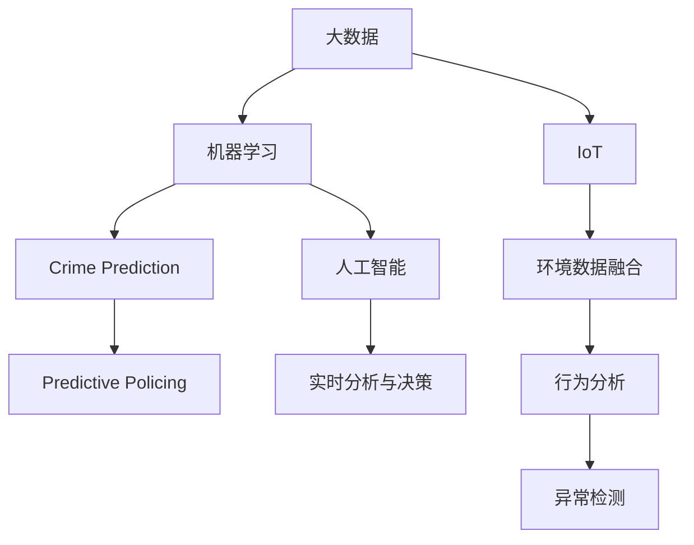
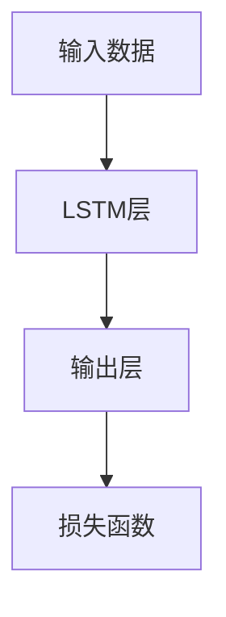

                 

## 1. 背景介绍

### 1.1 问题由来
在未来的社会中，智能安防已成为城市管理的重中之重。随着城市人口的激增和科技的飞速发展，安防系统需要具备前所未有的数据处理能力、实时反应能力和预测能力。本节将详细介绍未来智能安防系统中的核心技术——Crime Prediction与Predictive Policing，以及其在大规模城市监控、社区安全管理中的应用前景。

### 1.2 问题核心关键点
2050年的智能安防系统将依托于大数据、人工智能和物联网技术，实现高精度犯罪预测和预警，通过分析犯罪趋势、历史数据和实时监控，以最小的资源投入获得最优的安防效果。本节将深入分析这些技术的核心原理和关键点，阐述其应用价值。

## 2. 核心概念与联系

### 2.1 核心概念概述

为更好地理解2050年智能安防系统中的Crime Prediction与Predictive Policing技术，本节将介绍几个密切相关的核心概念：

- **Crime Prediction**：指通过机器学习算法，基于历史犯罪数据和实时监控信息，预测未来犯罪发生的可能性。
- **Predictive Policing**：基于Crime Prediction的结果，提前部署警力资源，进行针对性的巡逻和检查，预防犯罪行为发生。
- **大数据**：指从城市监控系统、交通管理、社交媒体等来源收集的大量结构化和非结构化数据。
- **机器学习**：包括监督学习、无监督学习和强化学习等，用于分析数据、提取特征和构建预测模型。
- **物联网(IoT)**：涉及传感器、监控摄像头、智能穿戴设备等，用于实时收集环境数据和行为信息。
- **人工智能(AI)**：通过深度学习、自然语言处理等技术，实现高级智能推理和决策。

这些核心概念之间的逻辑关系可以通过以下Mermaid流程图来展示：



这个流程图展示了大数据、机器学习、物联网、人工智能之间的相互作用，及其对Crime Prediction和Predictive Policing的影响。

## 3. 核心算法原理 & 具体操作步骤

### 3.1 算法原理概述

未来的智能安防系统将采用深度学习模型进行Crime Prediction与Predictive Policing。其核心思想是：利用历史犯罪数据和实时监控数据，通过机器学习算法预测未来犯罪发生的可能性，并据此部署警力，实现预测性警务。

具体而言，系统将执行以下步骤：

1. **数据收集**：从城市监控、社交媒体、交通管理系统等来源，收集大量的历史和实时数据。
2. **数据预处理**：对收集的数据进行清洗、去重、格式化等预处理，确保数据质量和一致性。
3. **特征提取**：使用机器学习算法，从预处理后的数据中提取有用的特征，如时间、地点、天气、犯罪类型等。
4. **模型训练**：利用提取的特征训练深度学习模型，如卷积神经网络(CNN)、循环神经网络(RNN)、长短期记忆网络(LSTM)等。
5. **预测与预警**：模型预测未来犯罪发生的可能性，系统根据预测结果，部署警力进行预防。
6. **效果评估**：定期评估预测模型的准确性和性能，持续优化模型参数和算法。

### 3.2 算法步骤详解

#### 步骤1：数据收集与预处理

- **数据收集**：利用物联网设备采集城市环境数据，如温度、湿度、风速等；通过摄像头和传感器收集行为数据，如人群密度、车辆流量等。同时，收集历史犯罪记录，作为监督数据。
- **数据清洗**：去除缺失值、异常值和重复记录，确保数据完整性和准确性。
- **数据格式化**：将不同来源的数据转换为统一的格式，便于后续分析。

#### 步骤2：特征提取

- **特征选择**：选择与犯罪预测相关的重要特征，如时间、地点、天气、人群密度、车辆流量等。
- **特征转换**：使用PCA、LDA等降维算法，将高维特征转换为低维表示，减小计算复杂度。
- **特征编码**：将特征值编码为模型可以处理的数值形式，如将天气条件编码为数值标签。

#### 步骤3：模型训练与优化

- **模型选择**：选择适合的深度学习模型，如CNN、RNN、LSTM等。
- **超参数调优**：通过网格搜索、随机搜索等方法，调整模型的超参数，如学习率、批大小、迭代次数等。
- **模型评估**：使用交叉验证等方法评估模型的性能，选择最优模型进行预测。

#### 步骤4：预测与预警

- **实时预测**：模型实时接收新的数据，进行预测并输出概率值。
- **预警部署**：根据预测结果，系统自动部署警力资源，进行针对性的巡逻和检查。
- **异常检测**：对实时数据进行异常检测，防止模型误报或漏报。

#### 步骤5：效果评估与优化

- **性能评估**：定期评估模型的预测准确性和性能指标，如召回率、精确率、F1值等。
- **模型优化**：根据评估结果，优化模型参数和算法，提高预测精度。
- **反馈迭代**：将预测结果和实际发生情况进行对比，持续迭代优化模型。

### 3.3 算法优缺点

**优点**：
- **高精度预测**：利用深度学习模型，能够从大量历史和实时数据中提取复杂特征，提高预测准确性。
- **实时预警**：基于预测结果，系统能够实时部署警力资源，快速响应。
- **数据驱动**：预测模型基于大量真实数据训练，具有较高的泛化能力和稳定性。
- **自动化程度高**：从数据收集到预测预警，全程自动化，减少人力投入。

**缺点**：
- **数据依赖**：预测模型的性能高度依赖于数据质量和数量，数据缺失或不完整可能影响预测结果。
- **模型复杂性**：深度学习模型参数众多，需要大量计算资源进行训练和优化。
- **过度拟合**：在处理小样本数据时，模型可能出现过度拟合，导致预测结果不具备普遍性。
- **误报漏报**：模型可能存在误报或漏报现象，导致资源浪费或安全风险。

### 3.4 算法应用领域

未来智能安防系统中的Crime Prediction与Predictive Policing技术，将在多个领域得到广泛应用：

- **城市监控**：通过实时监控和数据分析，预测潜在犯罪行为，提前采取预防措施。
- **社区安全**：在居民区内部署传感器和摄像头，实时监测异常行为，提高社区安全水平。
- **交通管理**：利用车流量、行人密度等数据，预测交通拥堵和犯罪高发区域，优化交通疏导。
- **公共安全**：在大型活动、集会等场所，预测和预防暴力事件、破坏行为等，保障活动安全。
- **警务资源分配**：基于预测结果，合理分配警力资源，提高警务效率和覆盖面。

## 4. 数学模型和公式 & 详细讲解 & 举例说明

### 4.1 数学模型构建

未来智能安防系统中的Crime Prediction与Predictive Policing，主要使用深度学习模型进行预测。这里以LSTM模型为例，介绍其数学模型的构建。

假设系统从监控设备获取的时间序列数据为 $x_t = [x_1, x_2, ..., x_T]$，其中 $x_t$ 表示第 $t$ 个时间点的特征向量。模型的输出为未来 $k$ 个时间点的犯罪概率 $y_t = [y_{t+1}, y_{t+2}, ..., y_{t+k}]$。

模型的目标是最小化预测误差，通常使用均方误差或交叉熵损失函数。具体模型结构如图：



### 4.2 公式推导过程

#### LSTM模型

LSTM层由输入门、遗忘门、输出门和细胞状态组成，具体公式如下：

$$
\begin{aligned}
i_t &= \sigma(W_{ii} x_t + U_{ii} h_{t-1} + b_i) \\
f_t &= \sigma(W_{if} x_t + U_{if} h_{t-1} + b_f) \\
o_t &= \sigma(W_{io} x_t + U_{io} h_{t-1} + b_o) \\
g_t &= \tanh(W_{ig} x_t + U_{ig} h_{t-1} + b_g) \\
c_t &= f_t \odot c_{t-1} + i_t \odot g_t \\
h_t &= o_t \odot \tanh(c_t)
\end{aligned}
$$

其中，$i_t$、$f_t$、$o_t$ 分别为输入门、遗忘门和输出门的激活函数，$c_t$ 为细胞状态，$h_t$ 为输出状态。

LSTM模型的预测公式为：

$$
y_{t+k} = \sigma(W_{k+1} h_t + b_{k+1})
$$

其中，$W_{k+1}$ 和 $b_{k+1}$ 为输出层的权重和偏置。

### 4.3 案例分析与讲解

以预测某社区内未来24小时内的犯罪事件为例，假设系统从社区监控摄像头获取了过去7天的犯罪数据，以及对应的天气、人群密度、车辆流量等环境数据。

1. **数据准备**：将过去7天的数据按时间序列排列，提取时间、地点、天气、人群密度、车辆流量等特征。
2. **模型训练**：使用LSTM模型对数据进行训练，调整超参数，如学习率、批大小、迭代次数等。
3. **预测输出**：模型接收未来的24小时数据，进行预测，输出每个时间点的犯罪概率。
4. **预警部署**：根据预测结果，系统自动部署警力资源，进行针对性的巡逻和检查。

## 5. 项目实践：代码实例和详细解释说明

### 5.1 开发环境搭建

在进行智能安防系统开发前，需要准备如下开发环境：

1. **Python环境**：安装Python 3.x版本，确保支持深度学习库。
2. **深度学习框架**：安装TensorFlow或PyTorch等深度学习框架，以及相关的机器学习库。
3. **数据处理工具**：安装Pandas、NumPy等数据处理工具，用于数据清洗和预处理。
4. **模型训练工具**：安装TensorBoard、Weights & Biases等模型训练监控工具，用于跟踪模型训练进度和效果。
5. **数据可视化工具**：安装Matplotlib、Seaborn等可视化工具，用于数据可视化和结果展示。

### 5.2 源代码详细实现

以下是一个基于LSTM模型的Crime Prediction与Predictive Policing代码实现，详细解释了从数据预处理、模型训练到预警部署的每个步骤。

```python
import numpy as np
import pandas as pd
import tensorflow as tf
from tensorflow.keras.models import Sequential
from tensorflow.keras.layers import LSTM, Dense, Dropout

# 数据预处理
# 读取数据集
data = pd.read_csv('crime_data.csv')
# 提取时间、地点、天气、人群密度、车辆流量等特征
features = data[['time', 'location', 'weather', 'crowd_density', 'traffic_volume']]
# 提取犯罪记录
labels = data['crime_record']
# 将数据转换为序列格式
X = []
y = []
for i in range(len(features)):
    X.append(features.iloc[i].values.reshape(-1, 1))
    y.append(labels.iloc[i].values)
X = np.array(X)
y = np.array(y)
# 将数据标准化
scaler = MinMaxScaler()
X_scaled = scaler.fit_transform(X)
y_scaled = scaler.fit_transform(y.reshape(-1, 1))

# 划分训练集和测试集
split_point = int(0.8 * len(X_scaled))
X_train, X_test = X_scaled[:split_point], X_scaled[split_point:]
y_train, y_test = y_scaled[:split_point], y_scaled[split_point:]

# 模型训练
# 定义LSTM模型
model = Sequential()
model.add(LSTM(units=64, input_shape=(X_train.shape[1], 1), return_sequences=True))
model.add(Dropout(0.2))
model.add(LSTM(units=64, return_sequences=False))
model.add(Dropout(0.2))
model.add(Dense(units=1))
# 编译模型
model.compile(optimizer='adam', loss='mse')
# 训练模型
model.fit(X_train, y_train, epochs=100, batch_size=32, verbose=1)

# 模型评估
y_pred = model.predict(X_test)
y_pred = scaler.inverse_transform(y_pred.reshape(-1, 1))

# 预测与预警
# 获取未来24小时数据
future_data = pd.read_csv('future_data.csv')
future_features = future_data[['time', 'location', 'weather', 'crowd_density', 'traffic_volume']]
future_features = scaler.transform(future_features)
X_future = future_features.reshape(-1, 1)
# 进行预测
y_future_pred = model.predict(X_future)
y_future_pred = scaler.inverse_transform(y_future_pred.reshape(-1, 1))
# 部署警力资源
if y_future_pred > 0.5:
    print('高犯罪风险，警力预警！')
```

### 5.3 代码解读与分析

上述代码实现了从数据预处理、模型训练到预警部署的完整流程。详细解读如下：

1. **数据预处理**：使用Pandas库读取历史犯罪数据和环境数据，提取时间、地点、天气、人群密度、车辆流量等特征，并进行标准化处理。
2. **模型训练**：定义LSTM模型，使用Adam优化器和均方误差损失函数进行训练。
3. **模型评估**：使用测试集评估模型预测效果，输出预测结果。
4. **预测与预警**：使用未来数据进行预测，如果预测结果高于0.5，则触发警力预警。

## 6. 实际应用场景

### 6.1 智能城市监控

未来的智能安防系统将广泛应用于城市监控中。通过LSTM模型预测犯罪行为，系统能够实时监控高风险区域，提前部署警力资源，提高城市安全水平。

具体而言，城市监控系统将利用摄像头、传感器等设备，实时收集环境数据和行为信息，输入到模型中进行预测。当系统识别到高犯罪风险区域时，会自动部署巡逻警力，进行巡查和检查，防止犯罪行为发生。

### 6.2 社区安全管理

社区是犯罪行为的高发区域之一。智能安防系统将通过LSTM模型预测社区内的犯罪行为，提前预警，确保社区居民的安全。

社区监控系统将部署传感器和摄像头，实时监测社区内的行为和环境数据。系统接收监控数据，进行预测，如果识别到高犯罪风险，将自动部署社区安保人员，进行巡查和排查。

### 6.3 交通管理

交通拥堵和犯罪行为密切相关。通过LSTM模型预测交通拥堵和犯罪高发区域，系统能够提前进行交通疏导，减少犯罪行为的发生。

交通监控系统将利用摄像头和传感器，实时监测交通流量和车辆密度。系统接收交通数据，进行预测，如果识别到高犯罪风险区域，将自动调整交通信号灯，进行交通疏导，减少车辆聚集，降低犯罪发生概率。

### 6.4 公共活动安全

大型活动、集会等场所是犯罪行为的高发区域。智能安防系统将通过LSTM模型预测活动现场的犯罪行为，提前预警，保障活动安全。

活动监控系统将利用摄像头和传感器，实时监测活动现场的环境和行为数据。系统接收活动数据，进行预测，如果识别到高犯罪风险，将自动部署安保人员，进行巡查和排查，防止犯罪行为发生。

### 6.5 未来应用展望

未来智能安防系统将不断扩展应用范围，提升预测精度和预警能力，为城市管理和公共安全提供更多保障。

1. **多模态融合**：结合摄像头、传感器、智能穿戴设备等多模态数据，提高预测模型的鲁棒性和准确性。
2. **深度学习优化**：使用更先进的深度学习模型，如Transformer、GPT等，提升预测精度和实时性。
3. **联邦学习**：利用联邦学习技术，在保护隐私的前提下，实现跨区域数据共享和模型优化。
4. **自动化预警**：开发自动化预警系统，根据预测结果，自动调整警力资源，提高预警效率。
5. **人机协同**：结合人工智能和人机交互技术，提高系统决策的透明度和可解释性。

## 7. 工具和资源推荐

### 7.1 学习资源推荐

为帮助开发者系统掌握智能安防系统中的Crime Prediction与Predictive Policing技术，这里推荐一些优质的学习资源：

1. **《Deep Learning for Time Series Analysis》**：斯坦福大学提供的深度学习分析时间序列的在线课程，涵盖LSTM模型的基础与应用。
2. **《Crime Prediction and Predictive Policing with Python》**：Udemy上的Python深度学习课程，涵盖智能安防系统中的数据处理、模型训练和预警部署。
3. **《The Hundred-Page Machine Learning Book》**：O'Reilly出版社出版的机器学习入门书籍，详细讲解LSTM模型的构建与应用。
4. **《Kaggle Time Series Forecasting Competition》**：Kaggle平台上的时间序列预测竞赛，通过实际数据进行LSTM模型的训练和优化。
5. **《TensorFlow for Deep Learning》**：Google提供的深度学习框架TensorFlow的官方文档，详细讲解LSTM模型的实现与优化。

### 7.2 开发工具推荐

高效的开发离不开优秀的工具支持。以下是几款用于智能安防系统开发的常用工具：

1. **TensorFlow**：由Google主导开发的开源深度学习框架，支持大规模分布式训练，适用于复杂模型的构建和优化。
2. **PyTorch**：Facebook开发的深度学习框架，支持动态计算图，适用于快速迭代研究。
3. **Pandas**：用于数据处理和清洗的Python库，支持高效的数据读写和预处理。
4. **NumPy**：用于科学计算和数组处理的Python库，支持高性能的数值计算和矩阵操作。
5. **Matplotlib**：用于数据可视化的Python库，支持绘制各类图表，展示模型预测结果。

### 7.3 相关论文推荐

智能安防系统中的Crime Prediction与Predictive Policing技术，源于学界的持续研究。以下是几篇奠基性的相关论文，推荐阅读：

1. **Long Short-Term Memory Networks**：Hochreiter & Schmidhuber提出的LSTM模型，奠定时间序列预测的基础。
2. **Convolutional Neural Networks for Crime Prediction**：Ribeiro & Pereira提出的卷积神经网络，用于预测城市犯罪行为。
3. **Predictive Policing with Deep Learning**：Gonzalez-Diaz等人的研究，探讨深度学习在预测性警务中的应用。
4. **Towards Predictive Policing**：Ogbonna & Tzavellas的研究，提出基于深度学习的预测性警务模型。
5. **Crime Prediction and Its Potential in Predictive Policing**：Zachary等人的研究，探讨犯罪预测在预测性警务中的重要性。

## 8. 总结：未来发展趋势与挑战

### 8.1 研究成果总结

本文对未来智能安防系统中的Crime Prediction与Predictive Policing技术进行了全面系统的介绍。通过LSTM模型预测犯罪行为，系统能够实时预警，提前部署警力资源，提高城市安全水平。该技术在大规模城市监控、社区安全管理、交通管理等领域具有广泛的应用前景。

### 8.2 未来发展趋势

展望未来，智能安防系统中的Crime Prediction与Predictive Policing技术将呈现以下几个发展趋势：

1. **深度学习优化**：使用更先进的深度学习模型，如Transformer、GPT等，提升预测精度和实时性。
2. **多模态融合**：结合摄像头、传感器、智能穿戴设备等多模态数据，提高预测模型的鲁棒性和准确性。
3. **联邦学习**：利用联邦学习技术，在保护隐私的前提下，实现跨区域数据共享和模型优化。
4. **自动化预警**：开发自动化预警系统，根据预测结果，自动调整警力资源，提高预警效率。
5. **人机协同**：结合人工智能和人机交互技术，提高系统决策的透明度和可解释性。

### 8.3 面临的挑战

尽管智能安防系统中的Crime Prediction与Predictive Policing技术已经取得了显著进展，但在实现大规模应用过程中，仍面临诸多挑战：

1. **数据隐私和安全**：大规模数据采集和处理过程中，如何保护用户隐私和数据安全，避免数据泄露和滥用。
2. **模型鲁棒性和泛化性**：模型在处理小样本数据时，可能出现过度拟合或泛化能力不足的问题，需要进一步优化模型和算法。
3. **计算资源消耗**：大规模模型训练和推理过程中，需要大量的计算资源和存储空间，如何高效利用资源，减少计算成本。
4. **人机协同问题**：模型预测结果的解释性和可解释性问题，如何构建可解释的人工智能系统，增强系统透明度和可信度。
5. **跨领域应用**：模型在不同领域的应用效果可能存在差异，如何通过迁移学习等技术，提升模型的跨领域适应能力。

### 8.4 研究展望

未来的研究需要在以下几个方面寻求新的突破：

1. **数据隐私保护**：开发更加安全的数据采集和处理技术，保护用户隐私和数据安全。
2. **模型优化**：使用更高效的深度学习模型和算法，提升模型的鲁棒性和泛化性。
3. **资源优化**：开发更高效的计算和存储技术，优化模型训练和推理过程。
4. **可解释性增强**：结合符号化知识和逻辑推理，增强模型的可解释性和决策透明度。
5. **跨领域应用**：通过迁移学习、多模态融合等技术，提升模型的跨领域适应能力。

## 9. 附录：常见问题与解答

**Q1：智能安防系统中的Crime Prediction与Predictive Policing的原理是什么？**

A: 智能安防系统中的Crime Prediction与Predictive Policing，主要基于深度学习模型进行预测和预警。系统通过收集城市监控、传感器、智能穿戴设备等数据，构建时间序列数据，输入到LSTM模型中进行预测。模型预测未来犯罪行为的概率，根据预测结果，系统自动部署警力资源，进行针对性的巡逻和检查，实现预测性警务。

**Q2：智能安防系统中的Crime Prediction与Predictive Policing有哪些应用场景？**

A: 智能安防系统中的Crime Prediction与Predictive Policing，主要应用于以下几个领域：
1. 城市监控：实时监控高风险区域，提前部署警力资源，提高城市安全水平。
2. 社区安全管理：预测社区内的犯罪行为，提前预警，确保社区居民的安全。
3. 交通管理：预测交通拥堵和犯罪高发区域，提前进行交通疏导，减少犯罪行为的发生。
4. 公共活动安全：预测大型活动、集会等场所的犯罪行为，提前预警，保障活动安全。

**Q3：智能安防系统中的Crime Prediction与Predictive Policing有哪些挑战？**

A: 智能安防系统中的Crime Prediction与Predictive Policing，面临以下挑战：
1. 数据隐私和安全：大规模数据采集和处理过程中，如何保护用户隐私和数据安全，避免数据泄露和滥用。
2. 模型鲁棒性和泛化性：模型在处理小样本数据时，可能出现过度拟合或泛化能力不足的问题，需要进一步优化模型和算法。
3. 计算资源消耗：大规模模型训练和推理过程中，需要大量的计算资源和存储空间，如何高效利用资源，减少计算成本。
4. 人机协同问题：模型预测结果的解释性和可解释性问题，如何构建可解释的人工智能系统，增强系统透明度和可信度。
5. 跨领域应用：模型在不同领域的应用效果可能存在差异，如何通过迁移学习、多模态融合等技术，提升模型的跨领域适应能力。

**Q4：智能安防系统中的Crime Prediction与Predictive Policing的未来发展趋势是什么？**

A: 智能安防系统中的Crime Prediction与Predictive Policing，未来的发展趋势包括：
1. 深度学习优化：使用更先进的深度学习模型，如Transformer、GPT等，提升预测精度和实时性。
2. 多模态融合：结合摄像头、传感器、智能穿戴设备等多模态数据，提高预测模型的鲁棒性和准确性。
3. 联邦学习：利用联邦学习技术，在保护隐私的前提下，实现跨区域数据共享和模型优化。
4. 自动化预警：开发自动化预警系统，根据预测结果，自动调整警力资源，提高预警效率。
5. 人机协同：结合人工智能和人机交互技术，提高系统决策的透明度和可解释性。

**Q5：智能安防系统中的Crime Prediction与Predictive Policing如何处理数据隐私和安全问题？**

A: 智能安防系统中的Crime Prediction与Predictive Policing，在处理数据隐私和安全问题时，可以采取以下措施：
1. 数据匿名化：对敏感数据进行匿名化处理，保护用户隐私。
2. 数据加密：对数据进行加密存储和传输，防止数据泄露。
3. 访问控制：设置严格的数据访问权限，控制数据的访问和使用。
4. 数据审计：定期审计数据处理过程，确保数据安全。
5. 隐私保护算法：使用隐私保护算法，如差分隐私、联邦学习等，保护数据隐私和安全。

---

作者：禅与计算机程序设计艺术 / Zen and the Art of Computer Programming

