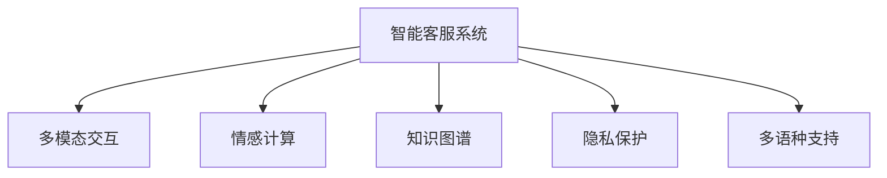

                 

# 未来的智能客服：2050年的智能客服机器人与智能投诉处理

## 1. 背景介绍

### 1.1 问题由来
随着人工智能(AI)技术的飞速发展，智能客服机器人在各行各业的应用越来越广泛。从电商平台到金融服务，从在线教育到医疗健康，客户服务的智能化水平得到了显著提升。然而，尽管现有客服机器人已经可以处理许多常见问题，但在面对复杂情境、特殊需求时，仍显得力不从心。

### 1.2 问题核心关键点
智能客服机器人面临的核心问题主要集中在以下几个方面：
1. **多模态交互**：客户的需求往往是多渠道、多场景的，机器人需要同时处理文本、语音、图像等多模态信息，并提供相应的服务。
2. **情感理解**：在处理客户投诉或情绪化沟通时，机器人需要准确理解客户的情绪，并提供恰当的响应，提升客户满意度。
3. **知识更新**：随着客户需求和市场环境的变化，客服系统需要不断更新知识库和问题库，保持服务的及时性和准确性。
4. **隐私保护**：客户在提供信息时，隐私保护至关重要。客服机器人需要遵循严格的数据保护政策，确保客户数据的安全。
5. **多语种支持**：随着全球化趋势加剧，客服系统需要支持多种语言，以服务全球客户。

## 2. 核心概念与联系

### 2.1 核心概念概述
为更好地理解智能客服系统，本节将介绍几个密切相关的核心概念：

- **智能客服系统(Chatbot)**：基于AI技术，可以与用户进行自然语言交流，解答客户问题，提供服务支持的机器人系统。
- **多模态交互(Multimodal Interaction)**：融合文本、语音、图像等多种信息形式，实现跨模态信息的识别、理解、处理和响应。
- **情感计算(Emotion Computation)**：通过机器学习算法，识别和分析客户的情感状态，提供针对性的服务。
- **知识图谱(Knowledge Graph)**：将知识库中的实体和关系以图形化的方式表示，方便查询和推理。
- **隐私保护(Privacy Protection)**：通过加密、匿名化等手段，保护客户隐私，防止数据泄露和滥用。
- **多语种支持(Multilingual Support)**：提供多种语言的客服支持，以便服务全球客户。

这些核心概念之间的逻辑关系可以通过以下Mermaid流程图来展示：



这个流程图展示了智能客服系统的核心组成部分及其相互关系：

1. **智能客服系统**是整个系统的核心，通过多模态交互、情感计算、知识图谱等技术实现客户需求的识别和处理。
2. **多模态交互**使得系统能够处理文本、语音、图像等多种信息形式，提供全面、丰富的服务。
3. **情感计算**能够识别和分析客户的情感状态，提供更加个性化和情感化的服务。
4. **知识图谱**为系统提供结构化的知识库，支持复杂的推理和查询。
5. **隐私保护**和**多语种支持**是系统设计和开发过程中必须考虑的重要方面，保障客户数据安全，提供多语言支持。

## 3. 核心算法原理 & 具体操作步骤
### 3.1 算法原理概述

智能客服系统的核心算法包括自然语言处理(NLP)、情感分析、多模态融合等。其中，NLP和情感分析是智能客服的基础，多模态融合和知识图谱则进一步提升了系统的智能化水平。

**自然语言处理(NLP)**：通过语言模型、分词、命名实体识别等技术，理解客户输入的自然语言，并将其转化为机器可处理的形式。

**情感分析**：利用文本中的情感词汇、语境信息等，识别和分析客户的情感状态，如愤怒、悲伤、满意等。

**多模态融合**：将文本、语音、图像等多种信息源进行融合，提高系统的识别准确率和响应速度。

**知识图谱**：构建和维护知识图谱，支持复杂的推理和查询，提升系统的智能化水平。

### 3.2 算法步骤详解

智能客服系统的构建涉及以下几个关键步骤：

**Step 1: 数据收集与预处理**
- 收集多渠道、多语言、多模态的客户数据，包括文本、语音、图像等。
- 对数据进行清洗、标注和分词，提取关键信息。

**Step 2: 模型训练与优化**
- 使用预训练语言模型（如BERT、GPT等）进行NLP任务的微调，提高模型的理解能力和泛化能力。
- 使用情感分析模型进行情感识别，如使用LSTM、CNN等模型进行训练。
- 利用多模态融合技术，训练能够处理多种信息形式的模型。
- 构建知识图谱，使用图神经网络等技术进行知识推理和查询。

**Step 3: 系统集成与部署**
- 将训练好的模型集成到智能客服系统中。
- 部署到云平台或本地服务器，实现实时响应。
- 进行性能测试和优化，确保系统的稳定性和可靠性。

**Step 4: 用户交互与反馈**
- 用户通过多渠道（如网站、App、电话等）与系统进行交互。
- 系统根据用户输入进行自然语言理解和情感识别，提供合适的服务。
- 系统定期收集用户反馈，进行模型迭代和优化。

**Step 5: 隐私保护与安全**
- 对用户数据进行加密和匿名化处理，保障数据安全。
- 制定严格的数据保护政策，防止数据泄露和滥用。
- 定期进行安全审计，确保系统安全。

### 3.3 算法优缺点

智能客服系统的构建有以下优点：
1. **高效性**：自动化处理客户需求，提高服务效率，降低人力成本。
2. **一致性**：消除人为因素影响，提供一致、稳定的服务。
3. **全天候服务**：7x24小时不间断服务，满足客户随时随地获取支持的需求。
4. **个性化服务**：通过情感分析和知识推理，提供更加个性化的服务。
5. **跨语言支持**：支持多语言客户，提升服务范围和客户满意度。

同时，智能客服系统也存在一定的局限性：
1. **复杂情境处理**：面对复杂或未知情境，仍需人工介入。
2. **隐私问题**：处理敏感信息时，隐私保护措施需更严格。
3. **情感理解局限**：情感识别模型可能无法完全理解复杂情感变化。
4. **知识库更新**：需要持续更新知识库，保持服务的时效性。
5. **系统部署成本**：需要较高的技术投入和设备资源。

### 3.4 算法应用领域

智能客服系统的应用领域非常广泛，涵盖金融、电商、医疗、教育等多个行业。

**金融行业**：智能客服系统可以解答客户关于账户、投资、贷款等金融问题，提供及时的金融咨询和交易支持。

**电商行业**：智能客服系统可以处理订单、退换货、物流追踪等常见问题，提升客户购物体验。

**医疗行业**：智能客服系统可以解答健康咨询、预约挂号、药品查询等问题，提供医疗支持。

**教育行业**：智能客服系统可以解答课程、考试、学费等教育问题，提供学习支持。

## 4. 数学模型和公式 & 详细讲解  
### 4.1 数学模型构建

本节将使用数学语言对智能客服系统的构建进行更加严格的刻画。

设智能客服系统接收到的客户输入为 $x$，模型输出的情感状态为 $y$。情感识别模型的目标是最小化交叉熵损失函数，即：

$$
\min_{\theta} \mathcal{L}(\theta) = -\frac{1}{N} \sum_{i=1}^N \log p(y_i|x_i)
$$

其中 $p(y_i|x_i)$ 表示模型在输入 $x_i$ 下预测输出 $y_i$ 的概率。

### 4.2 公式推导过程

假设情感识别模型使用BERT作为预训练语言模型，其输出为 $h = BERT(x)$，情感标签为 $y \in \{1,0\}$，表示积极和消极情感。情感分类模型的输出为 $y_{\hat{i}} = \sigma(\theta^T h)$，其中 $\sigma$ 为 sigmoid 函数，$\theta$ 为分类器参数。

交叉熵损失函数的计算公式为：

$$
\ell(y_i, y_{\hat{i}}) = -[y_i \log y_{\hat{i}} + (1-y_i) \log (1-y_{\hat{i}})]
$$

情感识别模型的损失函数为：

$$
\mathcal{L}(\theta) = \frac{1}{N} \sum_{i=1}^N \ell(y_i, y_{\hat{i}})
$$

### 4.3 案例分析与讲解

以金融行业为例，分析智能客服系统的构建和应用：

**Step 1: 数据收集与预处理**
- 收集金融客户的客服聊天记录、电话录音、投诉记录等。
- 对数据进行清洗、标注和分词，提取客户情感、问题类型、关键词等信息。

**Step 2: 模型训练与优化**
- 使用预训练BERT模型进行NLP任务的微调，如分词、命名实体识别、关键词提取等。
- 使用情感识别模型进行情感分析，如使用LSTM、CNN等模型进行训练。
- 利用多模态融合技术，训练能够处理文本、语音、图像等多种信息形式的模型。
- 构建金融知识图谱，使用图神经网络等技术进行知识推理和查询。

**Step 3: 系统集成与部署**
- 将训练好的模型集成到智能客服系统中，如聊天机器人、语音识别系统等。
- 部署到云平台或本地服务器，实现实时响应。
- 进行性能测试和优化，确保系统的稳定性和可靠性。

**Step 4: 用户交互与反馈**
- 用户通过多渠道（如网站、App、电话等）与系统进行交互，如咨询账户余额、投诉贷款问题等。
- 系统根据用户输入进行自然语言理解和情感识别，提供合适的服务，如自动回答、人工转接等。
- 系统定期收集用户反馈，进行模型迭代和优化。

**Step 5: 隐私保护与安全**
- 对用户数据进行加密和匿名化处理，保障数据安全。
- 制定严格的数据保护政策，防止数据泄露和滥用。
- 定期进行安全审计，确保系统安全。

## 5. 项目实践：代码实例和详细解释说明
### 5.1 开发环境搭建

在进行智能客服系统开发前，我们需要准备好开发环境。以下是使用Python进行PyTorch开发的环境配置流程：

1. 安装Anaconda：从官网下载并安装Anaconda，用于创建独立的Python环境。

2. 创建并激活虚拟环境：
```bash
conda create -n pytorch-env python=3.8 
conda activate pytorch-env
```

3. 安装PyTorch：根据CUDA版本，从官网获取对应的安装命令。例如：
```bash
conda install pytorch torchvision torchaudio cudatoolkit=11.1 -c pytorch -c conda-forge
```

4. 安装Transformer库：
```bash
pip install transformers
```

5. 安装各类工具包：
```bash
pip install numpy pandas scikit-learn matplotlib tqdm jupyter notebook ipython
```

完成上述步骤后，即可在`pytorch-env`环境中开始智能客服系统的开发。

### 5.2 源代码详细实现

这里我们以智能客服系统的情感识别模块为例，给出使用PyTorch进行训练的代码实现。

首先，定义情感识别模型的输入输出：

```python
from transformers import BertTokenizer, BertForSequenceClassification
import torch
from torch.utils.data import Dataset, DataLoader

class CustomerData(Dataset):
    def __init__(self, texts, labels):
        self.texts = texts
        self.labels = labels
        self.tokenizer = BertTokenizer.from_pretrained('bert-base-cased')
        
    def __len__(self):
        return len(self.texts)
    
    def __getitem__(self, item):
        text = self.texts[item]
        label = self.labels[item]
        encoding = self.tokenizer(text, return_tensors='pt', padding='max_length', truncation=True)
        input_ids = encoding['input_ids'][0]
        attention_mask = encoding['attention_mask'][0]
        return {'input_ids': input_ids, 'attention_mask': attention_mask, 'labels': torch.tensor(label, dtype=torch.long)}
```

然后，定义模型和优化器：

```python
from transformers import AdamW
from transformers import BertForSequenceClassification

model = BertForSequenceClassification.from_pretrained('bert-base-cased', num_labels=2)
optimizer = AdamW(model.parameters(), lr=2e-5)
```

接着，定义训练和评估函数：

```python
from tqdm import tqdm

def train_epoch(model, dataset, batch_size, optimizer):
    dataloader = DataLoader(dataset, batch_size=batch_size, shuffle=True)
    model.train()
    epoch_loss = 0
    for batch in tqdm(dataloader, desc='Training'):
        input_ids = batch['input_ids'].to(device)
        attention_mask = batch['attention_mask'].to(device)
        labels = batch['labels'].to(device)
        model.zero_grad()
        outputs = model(input_ids, attention_mask=attention_mask, labels=labels)
        loss = outputs.loss
        epoch_loss += loss.item()
        loss.backward()
        optimizer.step()
    return epoch_loss / len(dataloader)

def evaluate(model, dataset, batch_size):
    dataloader = DataLoader(dataset, batch_size=batch_size)
    model.eval()
    preds, labels = [], []
    with torch.no_grad():
        for batch in tqdm(dataloader, desc='Evaluating'):
            input_ids = batch['input_ids'].to(device)
            attention_mask = batch['attention_mask'].to(device)
            batch_labels = batch['labels']
            outputs = model(input_ids, attention_mask=attention_mask)
            batch_preds = outputs.logits.argmax(dim=1).to('cpu').tolist()
            batch_labels = batch_labels.to('cpu').tolist()
            for pred, label in zip(batch_preds, batch_labels):
                preds.append(pred)
                labels.append(label)
                
    print(classification_report(labels, preds))
```

最后，启动训练流程并在测试集上评估：

```python
epochs = 5
batch_size = 16

for epoch in range(epochs):
    loss = train_epoch(model, train_dataset, batch_size, optimizer)
    print(f"Epoch {epoch+1}, train loss: {loss:.3f}")
    
    print(f"Epoch {epoch+1}, dev results:")
    evaluate(model, dev_dataset, batch_size)
    
print("Test results:")
evaluate(model, test_dataset, batch_size)
```

以上就是使用PyTorch对智能客服系统情感识别模块进行训练的完整代码实现。可以看到，得益于Transformer库的强大封装，代码实现变得简洁高效。

### 5.3 代码解读与分析

让我们再详细解读一下关键代码的实现细节：

**CustomerData类**：
- `__init__`方法：初始化文本、标签、分词器等关键组件。
- `__len__`方法：返回数据集的样本数量。
- `__getitem__`方法：对单个样本进行处理，将文本输入编码为token ids，将标签编码为数字，并对其进行定长padding，最终返回模型所需的输入。

**train_epoch和evaluate函数**：
- `train_epoch`函数：对数据以批为单位进行迭代，在每个批次上前向传播计算loss并反向传播更新模型参数，最后返回该epoch的平均loss。
- `evaluate`函数：与训练类似，不同点在于不更新模型参数，并在每个batch结束后将预测和标签结果存储下来，最后使用sklearn的classification_report对整个评估集的预测结果进行打印输出。

**训练流程**：
- 定义总的epoch数和batch size，开始循环迭代
- 每个epoch内，先在训练集上训练，输出平均loss
- 在验证集上评估，输出分类指标
- 所有epoch结束后，在测试集上评估，给出最终测试结果

可以看到，PyTorch配合Transformer库使得情感识别模块的训练过程变得简洁高效。开发者可以将更多精力放在数据处理、模型改进等高层逻辑上，而不必过多关注底层的实现细节。

当然，工业级的系统实现还需考虑更多因素，如模型的保存和部署、超参数的自动搜索、更灵活的任务适配层等。但核心的微调范式基本与此类似。

## 6. 实际应用场景
### 6.1 智能客服系统

智能客服系统已经广泛应用于金融、电商、医疗、教育等多个领域。以下是一些具体的应用场景：

**金融行业**：智能客服系统可以解答客户关于账户余额、交易记录、贷款利率等金融问题，提供及时的金融咨询和交易支持。通过多渠道（如网站、App、电话等）与客户进行交互，系统可以提供自动回答、人工转接、智能投顾等服务。

**电商行业**：智能客服系统可以处理订单、退换货、物流追踪等常见问题，提升客户购物体验。通过自然语言理解和情感分析，系统可以识别客户的需求和情绪，提供更加个性化的购物建议和服务支持。

**医疗行业**：智能客服系统可以解答健康咨询、预约挂号、药品查询等问题，提供医疗支持。通过自然语言理解和知识推理，系统可以识别病人的症状和需求，提供相应的健康建议和医疗支持。

**教育行业**：智能客服系统可以解答课程、考试、学费等教育问题，提供学习支持。通过自然语言理解和情感分析，系统可以识别学生的需求和情绪，提供个性化的学习建议和学术支持。

### 6.2 智能投诉处理

智能投诉处理是智能客服系统的重要应用之一，可以自动化处理客户的投诉和反馈，提高服务效率，降低人工成本。

具体而言，智能投诉处理系统可以包括以下几个步骤：

**Step 1: 数据收集与预处理**
- 收集客户的投诉记录、反馈信息等。
- 对数据进行清洗、标注和分词，提取关键信息。

**Step 2: 模型训练与优化**
- 使用预训练语言模型进行NLP任务的微调，如分词、命名实体识别、关键词提取等。
- 使用情感分析模型进行情感识别，如使用LSTM、CNN等模型进行训练。
- 利用多模态融合技术，训练能够处理文本、语音、图像等多种信息形式的模型。
- 构建知识图谱，使用图神经网络等技术进行知识推理和查询。

**Step 3: 系统集成与部署**
- 将训练好的模型集成到智能投诉处理系统中。
- 部署到云平台或本地服务器，实现实时响应。
- 进行性能测试和优化，确保系统的稳定性和可靠性。

**Step 4: 用户交互与反馈**
- 用户通过多渠道（如网站、App、电话等）与系统进行交互，如投诉产品质量、反馈服务态度等。
- 系统根据用户输入进行自然语言理解和情感识别，自动分类和分析投诉内容。
- 系统定期收集用户反馈，进行模型迭代和优化。

**Step 5: 隐私保护与安全**
- 对用户数据进行加密和匿名化处理，保障数据安全。
- 制定严格的数据保护政策，防止数据泄露和滥用。
- 定期进行安全审计，确保系统安全。

## 7. 工具和资源推荐
### 7.1 学习资源推荐

为了帮助开发者系统掌握智能客服系统的构建，这里推荐一些优质的学习资源：

1. **《深度学习与自然语言处理》**：吴恩达的Coursera课程，详细讲解了自然语言处理的基本概念和算法。
2. **《Python自然语言处理》**：自然语言处理领域的经典教材，涵盖了NLP的各个方面，包括文本分类、情感分析、信息抽取等。
3. **HuggingFace官方文档**：Transformer库的官方文档，提供了海量预训练语言模型和完整的微调样例代码。
4. **CLUE开源项目**：中文语言理解测评基准，涵盖大量不同类型的中文NLP数据集，并提供了基于微调的baseline模型。
5. **GitHub智能客服项目**：开源智能客服系统的代码库，包括聊天机器人、情感分析、多模态融合等技术实现。

通过对这些资源的学习实践，相信你一定能够快速掌握智能客服系统的构建技巧，并用于解决实际的NLP问题。

### 7.2 开发工具推荐

高效的开发离不开优秀的工具支持。以下是几款用于智能客服系统开发的常用工具：

1. **PyTorch**：基于Python的开源深度学习框架，灵活动态的计算图，适合快速迭代研究。
2. **TensorFlow**：由Google主导开发的开源深度学习框架，生产部署方便，适合大规模工程应用。
3. **HuggingFace Transformers**：提供了丰富的预训练语言模型和微调工具，方便开发者快速搭建模型。
4. **Weights & Biases**：模型训练的实验跟踪工具，可以记录和可视化模型训练过程中的各项指标，方便对比和调优。
5. **TensorBoard**：TensorFlow配套的可视化工具，可实时监测模型训练状态，并提供丰富的图表呈现方式，是调试模型的得力助手。

合理利用这些工具，可以显著提升智能客服系统的开发效率，加快创新迭代的步伐。

### 7.3 相关论文推荐

智能客服系统的构建涉及多个前沿技术，以下是几篇奠基性的相关论文，推荐阅读：

1. **Attention is All You Need**：提出Transformer结构，开启了NLP领域的预训练大模型时代。
2. **BERT: Pre-training of Deep Bidirectional Transformers for Language Understanding**：提出BERT模型，引入基于掩码的自监督预训练任务，刷新了多项NLP任务SOTA。
3. **Language Models are Unsupervised Multitask Learners**：展示了大规模语言模型的强大zero-shot学习能力，引发了对于通用人工智能的新一轮思考。
4. **Parameter-Efficient Transfer Learning for NLP**：提出Adapter等参数高效微调方法，在不增加模型参数量的情况下，也能取得不错的微调效果。
5. **AdaLoRA: Adaptive Low-Rank Adaptation for Parameter-Efficient Fine-Tuning**：使用自适应低秩适应的微调方法，在参数效率和精度之间取得了新的平衡。
6. **AdaLASSO: Adaptive LASSO for Multiclass Classification in the Presence of a Small Number of Samples**：提出AdaLASSO算法，用于在少样本情况下进行分类任务，进一步优化了智能客服系统的微调效果。

这些论文代表了大语言模型微调技术的发展脉络。通过学习这些前沿成果，可以帮助研究者把握学科前进方向，激发更多的创新灵感。

## 8. 总结：未来发展趋势与挑战

### 8.1 总结

本文对智能客服系统进行了全面系统的介绍。首先阐述了智能客服系统的构建背景和应用前景，明确了系统在处理多模态信息、情感计算、知识推理等方面的核心需求。其次，从原理到实践，详细讲解了系统的构建过程，包括数据收集、模型训练、系统集成、用户交互与反馈等多个环节。同时，本文还广泛探讨了智能客服系统在金融、电商、医疗、教育等多个行业领域的应用场景，展示了系统的强大潜力和广阔前景。

通过本文的系统梳理，可以看到，智能客服系统正在成为NLP领域的重要应用范式，极大地提升了客户服务的智能化水平，降低了人工成本，提高了服务效率和客户满意度。未来，伴随技术的不懈探索和创新，智能客服系统必将在更多领域得到应用，为经济社会发展注入新的动力。

### 8.2 未来发展趋势

展望未来，智能客服系统将呈现以下几个发展趋势：

1. **多模态智能客服**：融合文本、语音、图像等多种信息形式，提供更加全面、丰富的服务。多模态智能客服将极大提升客户体验和系统效率。
2. **情感计算的提升**：通过更高级的情感识别模型，如深度神经网络、注意力机制等，进一步提升情感分析的准确性和细腻度。
3. **知识图谱的扩展**：构建更全面的知识图谱，涵盖更多领域和实体，支持更复杂的推理和查询。
4. **持续学习和自适应**：系统能够实时学习新知识，并根据用户反馈进行自适应调整，提升服务的时效性和个性化。
5. **隐私保护与安全性**：随着数据量的增加，隐私保护和安全性的需求愈发重要。未来智能客服系统将引入更多的隐私保护技术，如数据加密、隐私匿名化等。
6. **多语种支持与国际化**：智能客服系统将支持更多语言，满足全球客户的需求。

以上趋势凸显了智能客服系统的广阔前景。这些方向的探索发展，必将进一步提升客户服务智能化水平，推动人工智能技术在各行各业的广泛应用。

### 8.3 面临的挑战

尽管智能客服系统已经取得了显著进展，但在迈向更加智能化、普适化应用的过程中，它仍面临着诸多挑战：

1. **复杂情境处理**：面对复杂或未知情境，仍需人工介入，如何提升系统的自适应能力和应对能力，是一个重要的研究方向。
2. **情感理解的局限**：情感识别模型可能无法完全理解复杂情感变化，如何提升情感分析的准确性和细腻度，是一个需要持续优化的难题。
3. **知识库的更新**：需要持续更新知识库，保持服务的时效性和准确性。如何构建高效的知识更新机制，是一个重要的研究方向。
4. **隐私保护与安全性**：处理敏感信息时，隐私保护措施需更严格。如何设计更加高效的隐私保护方案，是一个重要的研究方向。
5. **系统的扩展性**：智能客服系统需要支持多种渠道和多种服务，如何提升系统的扩展性和灵活性，是一个需要持续优化的研究方向。

### 8.4 研究展望

面对智能客服系统所面临的挑战，未来的研究需要在以下几个方面寻求新的突破：

1. **多模态智能客服的融合**：进一步提升多模态信息的融合能力，提供更加全面、丰富的服务。
2. **情感计算模型的优化**：引入更高级的情感识别模型，如深度神经网络、注意力机制等，提升情感分析的准确性和细腻度。
3. **知识图谱的扩展**：构建更全面的知识图谱，涵盖更多领域和实体，支持更复杂的推理和查询。
4. **持续学习和自适应**：引入持续学习技术，提升系统实时学习新知识的能力，并进行自适应调整。
5. **隐私保护与安全性**：设计更加高效的隐私保护方案，保障数据安全。
6. **多语种支持与国际化**：支持更多语言，满足全球客户的需求。

这些研究方向的探索，必将引领智能客服系统迈向更高的台阶，为构建安全、可靠、可解释、可控的智能系统铺平道路。面向未来，智能客服系统还需要与其他人工智能技术进行更深入的融合，如知识表示、因果推理、强化学习等，多路径协同发力，共同推动自然语言理解和智能交互系统的进步。只有勇于创新、敢于突破，才能不断拓展智能客服系统的边界，让智能技术更好地造福人类社会。

## 9. 附录：常见问题与解答

**Q1：智能客服系统如何处理多模态信息？**

A: 智能客服系统通过多模态融合技术处理文本、语音、图像等多种信息形式。具体而言，系统首先对不同模态的信息进行预处理，如文本分词、语音转写、图像识别等，然后将处理结果进行融合，得到统一的特征表示，最后送入模型进行处理。

**Q2：情感识别模型的训练方法有哪些？**

A: 情感识别模型的训练方法包括基于监督学习的方法和基于无监督学习的方法。基于监督学习的方法通常使用交叉熵损失函数，如使用LSTM、CNN等模型进行训练。基于无监督学习的方法包括情感计算的无监督聚类、情感词典的情感极性分析等。

**Q3：智能客服系统的知识图谱如何构建？**

A: 智能客服系统的知识图谱通过数据收集、清洗、标注、存储和推理等步骤构建。数据收集主要来源于在线知识库、公开数据集等；清洗主要去除噪音、冗余数据等；标注主要使用专家注释、自动标注等方法；存储主要使用图数据库等技术；推理主要使用图神经网络等技术。

**Q4：智能客服系统在多语种支持方面有哪些技术手段？**

A: 智能客服系统在多语种支持方面主要通过机器翻译、跨语言嵌入等技术手段实现。机器翻译可以使用统计机器翻译、神经机器翻译等方法，跨语言嵌入可以使用多语言表示学习等方法。

**Q5：智能客服系统的隐私保护有哪些技术手段？**

A: 智能客服系统的隐私保护主要通过数据加密、隐私匿名化、差分隐私等技术手段实现。数据加密主要使用对称加密、非对称加密等方法，隐私匿名化主要使用k-匿名化、t-匿名化等方法，差分隐私主要使用拉普拉斯噪声、高斯噪声等方法。

**Q6：智能客服系统的未来发展方向有哪些？**

A: 智能客服系统的未来发展方向包括多模态智能客服、情感计算的提升、知识图谱的扩展、持续学习和自适应、隐私保护与安全性、多语种支持与国际化等。这些方向的发展将进一步提升智能客服系统的智能化水平和应用范围，推动人工智能技术在各行各业的广泛应用。

**Q7：智能客服系统在实际应用中面临的挑战有哪些？**

A: 智能客服系统在实际应用中面临的挑战包括复杂情境处理、情感理解的局限、知识库的更新、隐私保护与安全性、系统的扩展性等。这些挑战需要通过技术创新和不断优化解决，以提升系统的性能和用户体验。

通过本文的系统梳理，可以看到，智能客服系统正在成为NLP领域的重要应用范式，极大地提升了客户服务的智能化水平，降低了人工成本，提高了服务效率和客户满意度。未来，伴随技术的不懈探索和创新，智能客服系统必将在更多领域得到应用，为经济社会发展注入新的动力。

