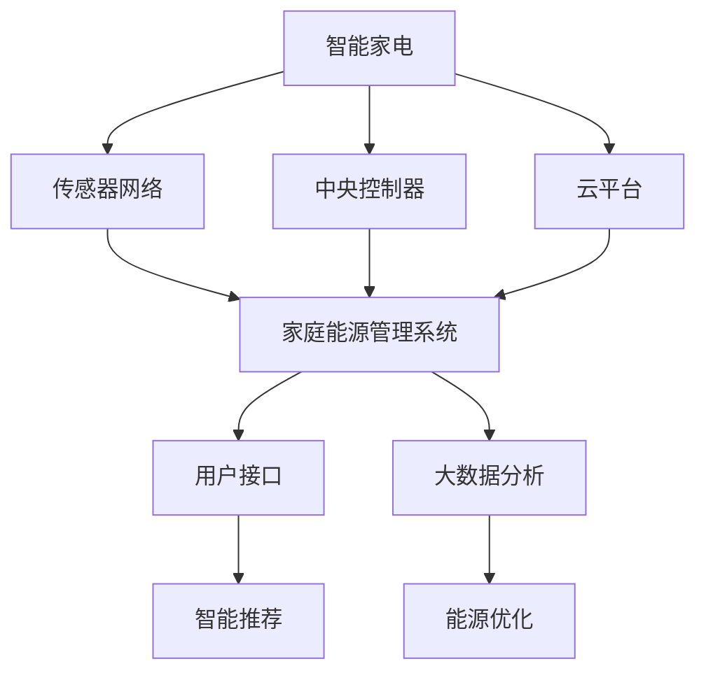

                 

# 未来的智能家居：2050年的智能家电与家庭能源管理

> 关键词：智能家居,智能家电,家庭能源管理,物联网,可持续发展,未来展望

## 1. 背景介绍

### 1.1 问题由来

随着人工智能、物联网、大数据等技术的不断进步，智能家居系统已逐渐从概念走向现实，正在全面渗透到我们的日常生活中。智能家居不仅仅是提升生活便利性，更关乎家庭生活的舒适度、安全性以及环保节能的实现。在2050年，智能家居系统将借助先进的智能技术，进一步提升智慧化水平，实现全面智能化，引领家居新潮流。

### 1.2 问题核心关键点

智能家居系统的主要目标包括提升生活质量、提高能源效率、实现环境友好，以及实现智能化的家庭生活。这些目标需要通过智能家电、家庭能源管理系统以及物联网的协同工作来实现。

### 1.3 问题研究意义

2050年的智能家居系统，将基于最新的人工智能和物联网技术，实现更加智能化、个性化和可持续化的家庭生活。通过对智能家电与家庭能源管理的深入研究，可以为未来的智能家居技术提供理论和实践指导，推动智能家居行业的持续创新和商业化应用。

## 2. 核心概念与联系

### 2.1 核心概念概述

为更好地理解2050年智能家居系统的技术框架，本节将介绍几个核心概念及其相互联系：

- **智能家电**：基于物联网技术，通过传感器、通信网络和中央控制器，实现智能化控制的家用电器。如智能冰箱、智能洗衣机、智能空调等。

- **家庭能源管理**：利用智能算法和设备，实现家庭用电、用水、用气的智能化控制和优化，以提高能源利用效率和减少浪费。

- **物联网(IoT)**：通过互联网将各种智能设备连接起来，实现设备间的信息交互和协同工作。

- **人工智能(AI)**：利用机器学习、深度学习等技术，使智能家居系统能够自动分析和决策，提高系统的智能化水平。

- **可持续发展**：在智能家居系统中，通过智能化的能源管理和家电控制，实现资源节约和环境友好。

- **大数据分析**：利用大数据技术，对家庭成员的生活习惯、能源消耗等数据进行分析和挖掘，实现更加精准的智能推荐和服务。

这些核心概念共同构成了智能家居系统的技术框架，使得系统能够实现高度自动化、个性化和可持续化的家庭生活。

### 2.2 核心概念原理和架构的 Mermaid 流程图



这个流程图展示了智能家居系统的主要组件和它们之间的联系。智能家电通过传感器网络获取数据，中央控制器整合数据并传输到家庭能源管理系统，云平台进行数据分析和优化，最终通过用户接口实现智能推荐和能源优化。

## 3. 核心算法原理 & 具体操作步骤
### 3.1 算法原理概述

基于物联网和人工智能技术的智能家居系统，通过家庭能源管理和智能家电控制，实现能源的高效利用和家庭生活的智能化。算法原理主要包括以下几个部分：

- **数据采集与处理**：智能家电和传感器通过网络将数据传输到中央控制器。
- **数据分析与预测**：云平台对收集的数据进行分析，预测家庭能源消耗和设备使用情况。
- **智能决策与控制**：根据分析结果，智能家居系统自动调整家电和能源设备的状态，以实现最优的能源利用和家庭环境控制。

### 3.2 算法步骤详解

#### 步骤1：数据采集与预处理

智能家居系统通过传感器和智能家电获取家庭内部的各项数据。这些数据可能包括：

- 室内外温度、湿度、光照强度
- 家电的运行状态和能源消耗
- 家庭成员的生活习惯和行为模式

在数据采集后，需要进行预处理，包括数据清洗、去噪、归一化等，以便后续分析和建模。

#### 步骤2：数据分析与建模

基于预处理后的数据，云平台应用机器学习、深度学习等技术，构建预测模型，进行能源消耗预测和设备使用预测。常见的分析模型包括：

- 时间序列预测模型，如ARIMA、LSTM等
- 多变量回归模型，如多元线性回归、随机森林等
- 强化学习模型，如Q-learning、Deep Q Network等

#### 步骤3：智能决策与控制

根据数据分析结果，智能家居系统应用智能决策算法，对家电和能源设备进行自动化控制。常见的智能决策算法包括：

- 自适应控制算法，根据家庭成员的行为模式自动调整家电状态
- 需求响应算法，根据电网情况自动调整家电能源使用
- 能源优化算法，通过多目标优化实现能源消耗的最低化

### 3.3 算法优缺点

智能家居系统的算法具有以下优点：

- 高度自动化：智能算法能够自动处理大量数据，实现家电和能源设备的自动化控制。
- 个性化服务：通过分析家庭成员的生活习惯，提供个性化的服务和推荐。
- 能源效率高：通过优化能源消耗，实现能源的高效利用。

然而，也存在一些缺点：

- 数据隐私和安全：大量的数据采集和处理可能引发隐私泄露和安全问题。
- 系统复杂度高：高度自动化的系统需要高精度和稳定性的算法支持。
- 初始成本高：智能设备和传感器的部署和维护需要较高的初始投资。

### 3.4 算法应用领域

智能家居系统的算法主要应用于以下领域：

- 家庭能源管理：实现家庭用电、用水、用气的智能化控制，提高能源利用效率。
- 家电控制：实现智能家电的自动化控制，提升家庭生活便捷性。
- 环境监控：通过传感器网络，实时监控家庭内部环境，保障健康和安全。
- 智能推荐：根据家庭成员的行为数据，提供个性化的服务和推荐。

## 4. 数学模型和公式 & 详细讲解

### 4.1 数学模型构建

智能家居系统的数学模型主要包括以下几个部分：

- 时间序列预测模型：用于预测能源消耗和设备使用情况，如LSTM模型。
- 多变量回归模型：用于分析多种因素对能源消耗的影响，如随机森林模型。
- 强化学习模型：用于动态调整家电和能源设备的使用，如Deep Q Network模型。

### 4.2 公式推导过程

以LSTM模型为例，其公式推导过程如下：

假设有一个时间序列数据 $x_t$，其中 $t=1,2,\ldots,T$。LSTM模型的目标是通过历史数据 $x_1,x_2,\ldots,x_{t-1}$ 预测未来数据 $x_t$。LSTM模型的基本结构包括输入门、遗忘门和输出门，公式如下：

$$
\begin{aligned}
& i_t = \sigma(W_i x_{t-1} + b_i + U_i h_{t-1} + b_i) \\
& f_t = \sigma(W_f x_{t-1} + b_f + U_f h_{t-1} + b_f) \\
& o_t = \sigma(W_o x_{t-1} + b_o + U_o h_{t-1} + b_o) \\
& g_t = \tanh(W_g x_{t-1} + b_g + U_g h_{t-1} + b_g) \\
& h_t = f_t \cdot h_{t-1} + i_t \cdot g_t \\
& y_t = o_t \cdot h_t
\end{aligned}
$$

其中 $\sigma$ 为激活函数，$W_i,W_f,W_o,W_g$ 为权重矩阵，$b_i,b_f,b_o,b_g$ 为偏置项，$h_t$ 为当前时间步的隐藏状态，$y_t$ 为当前时间步的预测输出。

### 4.3 案例分析与讲解

以智能空调控制为例，分析如何使用LSTM模型进行能源消耗预测和智能控制。假设智能空调的历史能源消耗数据为 $x_1,x_2,\ldots,x_{t-1}$，目标预测 $x_t$ 的能源消耗。

1. 数据预处理：对原始数据进行归一化处理，以便LSTM模型能够处理。
2. 模型训练：使用历史数据 $x_1,x_2,\ldots,x_{t-1}$ 训练LSTM模型，得到预测模型 $y_t$。
3. 预测和控制：根据预测结果 $y_t$ 和当前环境状态，自动调整空调的设定温度，以实现能源消耗的优化。

## 5. 项目实践：代码实例和详细解释说明

### 5.1 开发环境搭建

在进行智能家居系统开发前，需要先准备好开发环境。以下是使用Python进行PyTorch开发的环境配置流程：

1. 安装Anaconda：从官网下载并安装Anaconda，用于创建独立的Python环境。

2. 创建并激活虚拟环境：
```bash
conda create -n pytorch-env python=3.8 
conda activate pytorch-env
```

3. 安装PyTorch：根据CUDA版本，从官网获取对应的安装命令。例如：
```bash
conda install pytorch torchvision torchaudio cudatoolkit=11.1 -c pytorch -c conda-forge
```

4. 安装TensorFlow：
```bash
pip install tensorflow
```

5. 安装TensorFlow.js：
```bash
pip install tensorflowjs
```

6. 安装TensorBoard：
```bash
pip install tensorboard
```

完成上述步骤后，即可在`pytorch-env`环境中开始智能家居系统的开发。

### 5.2 源代码详细实现

以下是使用PyTorch进行智能家居系统开发的代码实现。

```python
import torch
import torch.nn as nn
import torch.optim as optim
import numpy as np
from sklearn.metrics import mean_squared_error

# 定义LSTM模型
class LSTM(nn.Module):
    def __init__(self, input_size, hidden_size, output_size):
        super(LSTM, self).__init__()
        self.input_size = input_size
        self.hidden_size = hidden_size
        self.output_size = output_size
        
        self.lstm = nn.LSTM(input_size, hidden_size, 2)
        self.fc = nn.Linear(hidden_size, output_size)
        
    def forward(self, x, h0):
        out, (hn, cn) = self.lstm(x, h0)
        out = self.fc(out)
        return out, hn

# 定义损失函数和优化器
criterion = nn.MSELoss()
optimizer = optim.Adam(model.parameters(), lr=0.01)

# 训练函数
def train(model, train_data, epochs=10, batch_size=32):
    train_losses = []
    val_losses = []
    
    for epoch in range(epochs):
        model.train()
        train_loss = 0
        val_loss = 0
        
        for i in range(len(train_data)//batch_size):
            inputs, targets = train_data[i*batch_size:(i+1)*batch_size]
            
            h0 = torch.zeros(1, 1, model.hidden_size).to(device)
            c0 = torch.zeros(1, 1, model.hidden_size).to(device)
            
            inputs = torch.tensor(inputs, dtype=torch.float).to(device)
            targets = torch.tensor(targets, dtype=torch.float).to(device)
            
            outputs, _ = model(inputs, (h0, c0))
            loss = criterion(outputs, targets)
            
            optimizer.zero_grad()
            loss.backward()
            optimizer.step()
            
            train_loss += loss.item()
        
        train_loss /= len(train_data)
        train_losses.append(train_loss)
        
        with torch.no_grad():
            model.eval()
            val_loss = 0
            for i in range(len(val_data)//batch_size):
                inputs, targets = val_data[i*batch_size:(i+1)*batch_size]
                
                h0 = torch.zeros(1, 1, model.hidden_size).to(device)
                c0 = torch.zeros(1, 1, model.hidden_size).to(device)
                
                inputs = torch.tensor(inputs, dtype=torch.float).to(device)
                targets = torch.tensor(targets, dtype=torch.float).to(device)
                
                outputs, _ = model(inputs, (h0, c0))
                val_loss += criterion(outputs, targets).item()
            
            val_loss /= len(val_data)
            val_losses.append(val_loss)
        
        print(f"Epoch {epoch+1}, Train Loss: {train_loss:.4f}, Val Loss: {val_loss:.4f}")
    
    return train_losses, val_losses

# 测试函数
def test(model, test_data, batch_size=32):
    model.eval()
    test_loss = 0
    
    with torch.no_grad():
        for i in range(len(test_data)//batch_size):
            inputs, targets = test_data[i*batch_size:(i+1)*batch_size]
            
            h0 = torch.zeros(1, 1, model.hidden_size).to(device)
            c0 = torch.zeros(1, 1, model.hidden_size).to(device)
            
            inputs = torch.tensor(inputs, dtype=torch.float).to(device)
            targets = torch.tensor(targets, dtype=torch.float).to(device)
            
            outputs, _ = model(inputs, (h0, c0))
            test_loss += criterion(outputs, targets).item()
    
    test_loss /= len(test_data)
    return test_loss
```

### 5.3 代码解读与分析

让我们再详细解读一下关键代码的实现细节：

**LSTM模型定义**：
- `nn.LSTM` 类定义了LSTM层的基本结构，包括输入门、遗忘门、输出门和隐藏状态。
- `nn.Linear` 类定义了全连接层，用于将LSTM的输出映射到目标输出空间。

**训练函数实现**：
- 使用Adam优化器进行模型参数更新，并在每个epoch记录训练损失和验证损失。
- 在每个batch中，将输入数据和目标数据传递给模型进行预测，并计算损失。
- 在训练过程中，使用均方误差损失函数，并记录训练和验证损失。

**测试函数实现**：
- 使用测试数据集进行模型测试，计算测试损失。
- 在测试过程中，使用均方误差损失函数，并记录测试损失。

## 6. 实际应用场景

### 6.1 智能空调控制

智能空调是智能家居系统中应用最广泛的设备之一。通过LSTM模型对历史能源消耗数据进行分析，智能空调能够自动调整设定温度，以实现能源消耗的优化。具体实现过程如下：

1. 数据采集：智能空调通过传感器获取室内外温度、湿度等数据。
2. 数据预处理：对原始数据进行归一化处理。
3. 模型训练：使用历史数据训练LSTM模型，得到能源消耗预测模型。
4. 智能控制：根据预测结果自动调整空调设定温度，以实现能源消耗的最低化。

### 6.2 智能冰箱管理

智能冰箱通过物联网技术实现食品存储管理和自动补货功能。具体实现过程如下：

1. 数据采集：智能冰箱通过摄像头、重量传感器等设备采集食品存储信息。
2. 数据预处理：对原始数据进行去噪、归一化处理。
3. 模型训练：使用历史数据训练深度学习模型，预测食品保质期和补货时间。
4. 智能管理：根据预测结果自动控制冰箱的冷藏、保鲜功能，实现食品管理智能化。

### 6.3 家庭能源管理

家庭能源管理通过智能算法和设备，实现家庭用电、用水、用气的智能化控制，以提高能源利用效率。具体实现过程如下：

1. 数据采集：智能电表、水表、燃气表等设备通过物联网传输数据到中央控制器。
2. 数据预处理：对原始数据进行去噪、归一化处理。
3. 模型训练：使用历史数据训练多变量回归模型，预测能源消耗情况。
4. 智能控制：根据预测结果自动调整家电和能源设备的使用，实现能源消耗的优化。

### 6.4 未来应用展望

随着物联网、人工智能等技术的不断进步，未来的智能家居系统将更加智能化、个性化和可持续化。以下是一些未来应用展望：

1. 环境感知：通过传感器网络，实现对室内外环境的实时感知，提供更加智能化的环境控制和健康监测。
2. 智能安全：通过物联网设备，实现家庭安全的智能监控和预警，保障家庭成员的人身安全。
3. 智能医疗：通过智能健康设备，实现健康数据的实时监测和分析，提供个性化的健康管理服务。
4. 智能娱乐：通过智能娱乐设备，实现个性化推荐和内容定制，提升家庭娱乐体验。

## 7. 工具和资源推荐

### 7.1 学习资源推荐

为了帮助开发者系统掌握智能家居系统的开发理论基础和实践技巧，这里推荐一些优质的学习资源：

1. 《深度学习与智能家居》书籍：全面介绍了智能家居系统中的深度学习技术和应用案例。
2. 《物联网与智能家居》课程：涵盖智能家居系统中的物联网技术和应用场景。
3. TensorFlow官方文档：提供了丰富的智能家居系统开发样例和资源。
4. PyTorch官方文档：提供了智能家居系统开发中的深度学习模型实现和应用。
5. Coursera智能家居系统课程：介绍了智能家居系统中的数据采集、处理和分析技术。

通过对这些资源的学习实践，相信你一定能够快速掌握智能家居系统的开发方法，并将其应用于实际项目中。

### 7.2 开发工具推荐

高效的开发离不开优秀的工具支持。以下是几款用于智能家居系统开发的常用工具：

1. PyTorch：基于Python的开源深度学习框架，灵活动态的计算图，适合快速迭代研究。大部分智能家居系统中的深度学习模型都有PyTorch版本的实现。
2. TensorFlow：由Google主导开发的开源深度学习框架，生产部署方便，适合大规模工程应用。同样有丰富的智能家居系统资源。
3. TensorFlow.js：将TensorFlow模型部署到Web环境，方便在浏览器中运行智能家居系统。
4. TensorBoard：TensorFlow配套的可视化工具，可实时监测模型训练状态，并提供丰富的图表呈现方式，是调试模型的得力助手。
5. IoT平台：如ThingWorx、IoTThings等，提供智能家居系统的物联网设备和数据管理服务。

合理利用这些工具，可以显著提升智能家居系统开发效率，加快创新迭代的步伐。

### 7.3 相关论文推荐

智能家居系统的发展源于学界的持续研究。以下是几篇奠基性的相关论文，推荐阅读：

1. Smart homes: A survey of concepts and frameworks（IEEE交易）：综述了智能家居系统的概念和技术框架。
2. The Internet of Things: Principles and Concepts（Springer）：介绍了物联网技术的基本原理和应用场景。
3. Deep Learning for Energy Management in Smart Grids（IEEE交易）：探讨了深度学习技术在智能电网中的应用。
4. A Survey of Smart Home Techniques and Systems（IEEE交易）：综述了智能家居系统中的技术和管理方法。

这些论文代表了大规模智能家居系统的研究方向，阅读这些论文有助于深入理解智能家居系统的技术背景和前沿发展。

## 8. 总结：未来发展趋势与挑战

### 8.1 总结

本文对2050年智能家居系统的技术框架进行了全面系统的介绍。首先阐述了智能家居系统的发展背景和研究意义，明确了智能家电与家庭能源管理系统的核心概念和技术联系。其次，从原理到实践，详细讲解了智能家居系统的算法原理和操作步骤，给出了智能家居系统开发的完整代码实例。同时，本文还广泛探讨了智能家居系统的实际应用场景和未来展望，展示了智能家居系统的广阔前景。

通过本文的系统梳理，可以看到，2050年的智能家居系统将基于最新的人工智能和物联网技术，实现更加智能化、个性化和可持续化的家庭生活。未来，伴随技术的发展，智能家居系统的智能化水平将持续提升，成为智慧城市的重要组成部分。

### 8.2 未来发展趋势

展望未来，智能家居系统将呈现以下几个发展趋势：

1. 高度智能化：基于深度学习和智能算法，实现更加精细和个性化的家庭管理。
2. 全面互联化：通过物联网技术，实现家电、设备和数据的全面互联，提升家庭生活的智能化水平。
3. 可持续化发展：通过智能化能源管理和家电控制，实现节能环保的可持续化发展。
4. 场景定制化：根据不同场景和用户需求，提供定制化的智能家居解决方案。

### 8.3 面临的挑战

尽管智能家居系统的发展前景广阔，但在迈向更加智能化、普适化应用的过程中，它仍面临着诸多挑战：

1. 数据隐私和安全：大量的数据采集和处理可能引发隐私泄露和安全问题。
2. 系统复杂度高：高度自动化的系统需要高精度和稳定性的算法支持。
3. 初始成本高：智能设备和传感器的部署和维护需要较高的初始投资。

### 8.4 研究展望

面对智能家居系统面临的挑战，未来的研究需要在以下几个方面寻求新的突破：

1. 数据隐私保护：研究数据加密、匿名化等技术，保护用户隐私和数据安全。
2. 算法优化：开发更加高效、鲁棒的深度学习算法，提升智能家居系统的性能和稳定性。
3. 系统优化：研究智能家居系统的架构设计和优化方法，提高系统的效率和可扩展性。
4. 可持续性研究：研究智能家居系统的能耗优化和环境影响，实现绿色智能家居。
5. 用户体验优化：研究用户界面和交互设计，提升智能家居系统的易用性和用户满意度。

这些研究方向的探索，必将引领智能家居系统迈向更高的台阶，为未来智能化家庭生活提供技术支撑。面向未来，智能家居系统还需要与其他智能技术进行更深入的融合，如人工智能、物联网、区块链等，共同推动智能家居行业的持续创新和商业化应用。

## 9. 附录：常见问题与解答

**Q1：智能家居系统的安全性如何保障？**

A: 智能家居系统的安全性保障主要通过以下几个方面实现：

1. 数据加密：采用数据加密技术，保护数据传输过程中的安全。
2. 身份认证：通过指纹、面部识别等生物识别技术，实现用户身份认证。
3. 访问控制：设置访问权限，限制未授权用户访问系统。
4. 异常检测：实时监控系统状态，及时发现和响应异常行为。

**Q2：智能家居系统如何实现个性化服务？**

A: 智能家居系统通过以下方式实现个性化服务：

1. 数据采集：收集家庭成员的生活习惯、行为数据等。
2. 数据挖掘：通过大数据分析，挖掘出家庭成员的兴趣、偏好等信息。
3. 智能推荐：根据分析结果，提供个性化的服务和推荐，如智能推荐电视节目、音乐等。

**Q3：智能家居系统如何实现节能环保？**

A: 智能家居系统通过以下方式实现节能环保：

1. 能源监测：实时监测家电的能源消耗情况，发现能源浪费点。
2. 智能控制：根据监测结果，自动调整家电的使用状态，实现能源消耗的优化。
3. 能源反馈：通过用户接口，提供能源使用情况反馈，引导用户实现节能环保。

**Q4：智能家居系统如何实现智能化管理？**

A: 智能家居系统通过以下方式实现智能化管理：

1. 数据采集：通过传感器、智能家电等设备，获取家庭内部的各项数据。
2. 数据预处理：对原始数据进行清洗、去噪、归一化等处理。
3. 数据分析：应用机器学习、深度学习等技术，分析数据并提取有用信息。
4. 智能决策：根据分析结果，自动调整家电和能源设备的使用，实现智能管理。

**Q5：智能家居系统如何实现跨设备协同？**

A: 智能家居系统通过以下方式实现跨设备协同：

1. 数据共享：通过物联网技术，实现设备之间的数据共享和协同。
2. 设备互联：将智能家电、传感器、控制系统等设备互联，实现设备间的信息交互和协同工作。
3. 集成平台：开发智能家居系统集成平台，实现设备的统一管理和控制。

通过这些技术手段，智能家居系统能够实现跨设备协同，提升家庭生活的智能化水平。

---

作者：禅与计算机程序设计艺术 / Zen and the Art of Computer Programming

