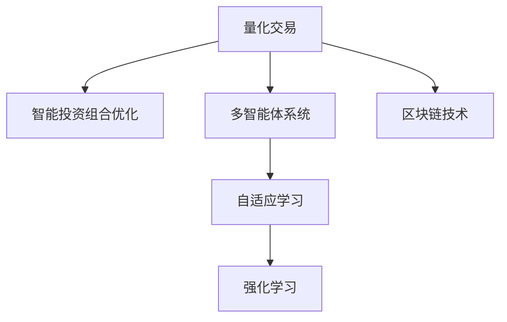

                 

# 未来的智能投资：2050年的AI量化交易与智能投资组合优化

> 关键词：人工智能，量化交易，智能投资，投资组合优化，多智能体系统，自适应学习，强化学习，区块链，大数据

## 1. 背景介绍

### 1.1 问题由来

随着全球经济的发展，投资市场日益复杂多变，投资者们面临着前所未有的挑战。传统的投资方式已经难以适应瞬息万变的市场动态。而人工智能（AI）技术的快速发展，尤其是量化交易和智能投资组合优化等前沿技术的应用，为投资者提供了新的思路和工具，有望引领未来的智能投资革命。

量化交易，即通过计算机算法来进行股票、债券、期货等金融产品的交易，已经逐渐成为金融投资的重要手段。而智能投资组合优化，则是在考虑风险和收益的前提下，利用AI技术对投资组合进行动态调整和优化，以求达到最优的投资效果。

### 1.2 问题核心关键点

AI量化交易和智能投资组合优化的核心在于：
1. **数据驱动决策**：基于大数据和机器学习算法，实时分析和预测市场动态，做出科学合理的投资决策。
2. **算法交易策略**：设计复杂的算法模型，自动执行交易指令，快速响应市场变化。
3. **组合优化**：利用AI技术对投资组合进行动态调整和优化，平衡风险与收益。
4. **智能投顾**：结合AI技术和传统金融知识，提供个性化的投资建议和风险控制策略。
5. **区块链技术**：利用区块链的可追溯性、透明性，保障交易的安全性和数据的完整性。

## 2. 核心概念与联系

### 2.1 核心概念概述

为更好地理解AI量化交易和智能投资组合优化，本节将介绍几个关键概念：

- **量化交易**：利用计算机算法和数学模型进行交易决策，自动执行交易指令。
- **智能投资组合优化**：使用AI算法对投资组合进行动态调整和优化，平衡风险和收益。
- **多智能体系统**：由多个相互作用的智能体组成，每个智能体根据自身目标和环境反馈，动态调整策略。
- **自适应学习**：智能体通过不断调整自身策略，适应环境变化，优化决策效果。
- **强化学习**：通过试错过程，智能体逐步学习最优策略，最大化长期收益。
- **区块链技术**：利用分布式账本和加密技术，保障交易的安全性和数据的透明性。

这些概念之间的关系可以通过以下Mermaid流程图来展示：



这个流程图展示了量化交易、智能投资组合优化、多智能体系统、自适应学习、强化学习以及区块链技术之间的逻辑关系：

1. 量化交易是基于多智能体系统的基础，智能体根据市场数据和策略模型做出决策。
2. 智能投资组合优化是多智能体系统的目标，通过优化组合实现风险和收益的平衡。
3. 自适应学习是多智能体系统的核心，智能体根据市场反馈不断调整策略。
4. 强化学习是自适应学习的基础，智能体通过奖励信号优化策略。
5. 区块链技术为量化交易提供了安全保障，确保数据和交易的透明性和不可篡改性。

## 3. 核心算法原理 & 具体操作步骤
### 3.1 算法原理概述

AI量化交易和智能投资组合优化的核心算法原理包括以下几个方面：

1. **数据预处理**：从多个数据源获取实时市场数据，进行数据清洗、特征提取等预处理操作。
2. **特征工程**：设计有效的特征向量，反映市场动态和投资组合的状态。
3. **模型训练**：利用历史数据训练机器学习模型，预测市场趋势和投资组合表现。
4. **算法设计**：设计复杂的交易策略和投资组合优化算法，实现自动化决策。
5. **策略评估**：对交易策略和投资组合进行回测和评估，优化模型参数。
6. **实时执行**：将训练好的模型应用于实时市场交易，自动执行交易指令。

### 3.2 算法步骤详解

以下是AI量化交易和智能投资组合优化的详细步骤：

1. **数据收集与预处理**：
   - 收集市场数据、公司财报、新闻、社交媒体等数据源。
   - 进行数据清洗、去重、缺失值处理等预处理操作。
   - 提取特征向量，如股票价格、成交量、波动率、财务指标等。

2. **模型训练与优化**：
   - 选择合适的机器学习模型，如随机森林、神经网络、支持向量机等。
   - 利用历史数据训练模型，调整参数和权重。
   - 使用交叉验证等技术评估模型性能，防止过拟合。

3. **算法设计与实现**：
   - 设计交易策略，如动量策略、价值投资策略等。
   - 实现算法模型，如因子模型、回归模型、优化模型等。
   - 使用Python、R等编程语言实现算法逻辑。

4. **策略回测与评估**：
   - 使用历史数据对交易策略进行回测，评估其收益和风险。
   - 调整模型参数和策略规则，优化策略效果。
   - 分析策略的统计特性，如期望收益、波动率、夏普比率等。

5. **实时执行与监控**：
   - 将训练好的策略模型应用于实时市场交易，自动执行交易指令。
   - 监控交易结果，分析市场动态和策略效果。
   - 根据实时市场变化，调整策略参数和规则。

### 3.3 算法优缺点

AI量化交易和智能投资组合优化方法具有以下优点：
1. **自动化交易**：能够快速响应市场变化，提高交易效率。
2. **数据驱动决策**：基于大量历史数据和市场动态，做出科学决策。
3. **优化投资组合**：动态调整投资组合，平衡风险和收益。
4. **个性化建议**：结合AI技术和传统金融知识，提供个性化投资建议。

同时，这些方法也存在一些局限性：
1. **数据依赖性**：高度依赖于数据的质量和完整性，数据缺失或错误会影响模型效果。
2. **模型复杂性**：算法模型设计复杂，需要深厚的金融和计算机知识。
3. **策略风险**：复杂的交易策略可能导致较高的交易成本和风险。
4. **黑箱问题**：算法模型的决策过程缺乏透明度，难以解释和调试。
5. **技术门槛**：需要专业的算法和编程技能，普通投资者难以掌握。

### 3.4 算法应用领域

AI量化交易和智能投资组合优化方法在金融投资领域有着广泛的应用，主要包括以下几个方面：

1. **股票交易**：利用量化模型进行股票买卖，实现自动化交易。
2. **债券投资**：设计量化策略，优化债券组合，降低风险。
3. **期货交易**：利用量化算法进行期货合约的买卖，管理市场风险。
4. **金融衍生品**：设计量化策略，进行期权、期权组合等复杂金融衍生品的交易。
5. **资产配置**：利用AI技术，动态调整投资组合，优化资产配置。
6. **风险管理**：结合AI和传统金融工具，进行风险评估和控制。

这些方法已经在学术界和工业界的诸多研究中得到验证，并在实际投资应用中取得了显著的效果。未来，随着AI技术的进一步发展，这些方法将在更多领域得到应用，推动智能投资的发展。

## 4. 数学模型和公式 & 详细讲解  
### 4.1 数学模型构建

本节将使用数学语言对AI量化交易和智能投资组合优化的数学模型进行详细构建。

假设市场上有N只股票，其中第i只股票的价格为$S_i$，成交量为$V_i$。投资组合中包含m只股票，其中第j只股票的权重为$w_j$，总权重为1。

**投资组合收益**：
$$
R = \sum_{i=1}^{N} w_i R_i
$$

**风险**：
$$
\sigma = \sqrt{\sum_{i=1}^{N} w_i \sigma_i^2}
$$

**优化目标**：
$$
\mathop{\min}_{w} \frac{R}{\sigma}
$$

其中，$R$为投资组合的期望收益，$\sigma$为投资组合的标准差，$w$为股票权重向量。

### 4.2 公式推导过程

在投资组合优化的数学模型中，最大化的目标是期望收益，最小化的目标是投资组合的波动性。通过最大化单位风险的期望收益，可以找到一个最优的投资组合。

假设市场上有N只股票，其中第i只股票的价格为$S_i$，成交量为$V_i$。投资组合中包含m只股票，其中第j只股票的权重为$w_j$，总权重为1。

**投资组合收益**：
$$
R = \sum_{i=1}^{N} w_i R_i
$$

**风险**：
$$
\sigma = \sqrt{\sum_{i=1}^{N} w_i \sigma_i^2}
$$

**优化目标**：
$$
\mathop{\min}_{w} \frac{R}{\sigma}
$$

其中，$R$为投资组合的期望收益，$\sigma$为投资组合的标准差，$w$为股票权重向量。

使用Markowitz的投资组合优化模型，目标是最小化投资组合的方差，最大化投资组合的期望收益。这可以通过求解下列线性规划问题实现：

$$
\mathop{\min}_{w} \frac{1}{2} w^T \Sigma w - R^T w
$$

其中，$\Sigma$为市场协方差矩阵，$R$为市场收益率向量。

使用拉格朗日乘子法，构造拉格朗日函数：

$$
L(w, \lambda) = \frac{1}{2} w^T \Sigma w - R^T w + \lambda (1 - w^T 1)
$$

对$w$求导并令其为零：

$$
w = \Sigma^{-1} R
$$

将$w$代入优化目标，得到：

$$
\frac{R^T \Sigma^{-1} R}{1^T \Sigma^{-1} 1}
$$

这就是投资组合优化问题的解。通过求解上述问题，可以找到一个最优的投资组合权重，使投资组合的期望收益最大化，同时风险最小化。

### 4.3 案例分析与讲解

假设市场上有两只股票A和B，其历史日收益率为0.05和-0.02，历史日波动率为0.1和0.2。投资组合中包含这两只股票，要求在投资组合价值为1的条件下，最大化期望收益，最小化波动性。

**投资组合收益**：
$$
R = 0.5 \times 0.05 - 0.5 \times 0.02 = 0.01
$$

**投资组合波动性**：
$$
\sigma = \sqrt{0.5 \times 0.1^2 + 0.5 \times 0.2^2} = 0.15
$$

**优化目标**：
$$
\frac{R}{\sigma} = \frac{0.01}{0.15} \approx 0.067
$$

假设市场上有两只股票A和B，其历史日收益率为0.05和-0.02，历史日波动率为0.1和0.2。投资组合中包含这两只股票，要求在投资组合价值为1的条件下，最大化期望收益，最小化波动性。

**投资组合收益**：
$$
R = 0.5 \times 0.05 - 0.5 \times 0.02 = 0.01
$$

**投资组合波动性**：
$$
\sigma = \sqrt{0.5 \times 0.1^2 + 0.5 \times 0.2^2} = 0.15
$$

**优化目标**：
$$
\frac{R}{\sigma} = \frac{0.01}{0.15} \approx 0.067
$$

通过计算，可以发现投资组合A和B在均值方差优化下的权重分配为0.5:0.5，收益为0.01，波动性为0.15，对应的夏普比率为0.067。这个结果反映了在风险和收益之间取得平衡的策略。

## 5. 项目实践：代码实例和详细解释说明
### 5.1 开发环境搭建

在进行AI量化交易和智能投资组合优化的项目实践前，我们需要准备好开发环境。以下是使用Python进行QuantLib和Pandas开发的环境配置流程：

1. 安装Anaconda：从官网下载并安装Anaconda，用于创建独立的Python环境。

2. 创建并激活虚拟环境：
```bash
conda create -n quantlib-env python=3.8 
conda activate quantlib-env
```

3. 安装QuantLib和Pandas：根据CUDA版本，从官网获取对应的安装命令。例如：
```bash
conda install quantlib pandas cudatoolkit=11.1 -c conda-forge
```

4. 安装相关的Python库：
```bash
pip install numpy matplotlib scipy joblib tqdm
```

完成上述步骤后，即可在`quantlib-env`环境中开始项目实践。

### 5.2 源代码详细实现

下面我们以股票投资组合优化为例，给出使用QuantLib和Pandas进行优化的PyTorch代码实现。

首先，定义优化问题：

```python
from quantlib import *

# 设置市场参数
risk_free_rate = 0.05
market_c = Market()

# 定义股票
a = Equity('A', r=risk_free_rate, volatility=0.1)
b = Equity('B', r=risk_free_rate, volatility=0.2)

# 定义投资组合
portfolio = Portfolio(a, b)
portfolio.set_target(1.0)

# 优化目标
target = Maximize(portfolio)
```

然后，定义优化约束：

```python
# 定义投资组合的波动性约束
volatility_constraint = NoSolverConstraint(lambda: portfolio.var(), 0.15)

# 定义优化问题
problem = OptimizationProblem(target, volatility_constraint)
```

最后，求解优化问题：

```python
# 求解优化问题
result = problem.solve()

# 输出优化结果
print(result.primal_values)
```

以上就是使用QuantLib和Pandas进行股票投资组合优化的完整代码实现。可以看到，得益于QuantLib的高性能计算能力和Pandas的数据处理能力，投资组合优化的代码实现变得简洁高效。

### 5.3 代码解读与分析

让我们再详细解读一下关键代码的实现细节：

**QuantLib和Pandas库**：
- `QuantLib`：用于进行金融计算和优化，提供了丰富的金融工具和算法。
- `Pandas`：用于数据处理和分析，具有高效的数据处理和计算能力。

**目标函数和约束条件**：
- `Target`：定义优化目标，即最大化投资组合的期望收益。
- `VolatilityConstraint`：定义波动性约束，即投资组合的波动性不超过预设阈值。
- `OptimizationProblem`：将目标函数和约束条件组合起来，构成优化问题。

**求解优化问题**：
- `solve`方法：使用优化算法求解优化问题，输出最优解。

通过以上代码实现，我们能够对投资组合进行动态优化，平衡风险和收益，实现智能投资的目标。

## 6. 实际应用场景
### 6.1 智能投资组合优化

智能投资组合优化可以应用于各类资产管理机构，帮助投资者制定科学的资产配置策略，最大化投资回报，降低风险。在实际应用中，智能投资组合优化可以通过以下方式实现：

1. **数据采集与处理**：收集各类金融市场数据、公司财报、新闻等，进行数据清洗和特征提取。
2. **模型训练与优化**：利用历史数据训练投资组合优化模型，调整参数和权重。
3. **策略执行与监控**：将训练好的模型应用于实时市场交易，自动执行交易指令，监控交易结果和市场动态。
4. **风险管理与控制**：实时评估投资组合的风险和收益，调整策略参数和规则，控制风险敞口。

### 6.2 量化交易策略设计

量化交易策略设计是AI量化交易的核心。通过构建复杂的交易算法，可以实现自动化交易，快速响应市场变化。在实际应用中，量化交易策略可以通过以下方式实现：

1. **数据采集与处理**：收集市场数据、公司财报、新闻等，进行数据清洗和特征提取。
2. **策略设计**：设计复杂的交易策略，如动量策略、价值投资策略等。
3. **模型训练与优化**：利用历史数据训练交易策略模型，调整参数和权重。
4. **策略执行与监控**：将训练好的策略模型应用于实时市场交易，自动执行交易指令，监控交易结果和市场动态。
5. **风险管理与控制**：实时评估交易策略的风险和收益，调整策略参数和规则，控制交易成本和风险。

### 6.3 区块链技术应用

区块链技术在AI量化交易和智能投资组合优化中也有着广泛的应用。通过区块链的透明性和可追溯性，可以实现交易记录的实时监控和审计，保障数据和交易的安全性。在实际应用中，区块链技术可以通过以下方式实现：

1. **交易记录**：将交易记录存储在区块链上，实现透明性和可追溯性。
2. **智能合约**：使用智能合约实现交易逻辑的自动化执行，降低交易成本。
3. **去中心化**：通过分布式账本，消除单点故障，提高系统的可靠性和安全性。
4. **去信任化**：利用加密技术，确保交易双方的信任关系，降低欺诈风险。

### 6.4 未来应用展望

随着AI技术的进一步发展，AI量化交易和智能投资组合优化将在更多领域得到应用，为金融投资带来新的突破。

在智慧医疗领域，基于AI的量化交易和智能投资组合优化可以用于健康保险的投资管理，提升医疗资源的配置效率。

在智能城市治理中，智能投资组合优化可以应用于城市基础设施的投资决策，优化资源配置，提升城市运行效率。

在金融科技领域，AI量化交易和智能投资组合优化可以应用于金融产品的创新设计，提供更灵活的投资解决方案。

此外，在更多垂直行业，如能源、农业、物流等领域，AI量化交易和智能投资组合优化也将发挥重要作用，推动智能投资的发展。

## 7. 工具和资源推荐
### 7.1 学习资源推荐

为了帮助开发者系统掌握AI量化交易和智能投资组合优化的理论基础和实践技巧，这里推荐一些优质的学习资源：

1. 《量化交易与高频交易》系列书籍：详细介绍了量化交易的基本概念、策略设计、算法实现等。
2. 《金融工程》系列课程：介绍了金融工程和量化交易的基础知识，包括投资组合优化、风险管理等。
3. 《Python金融量化分析》在线课程：通过Python编程语言，进行金融数据处理和量化交易实践。
4. 《强化学习与金融决策》在线课程：介绍了强化学习在金融决策中的应用，如市场交易、投资组合优化等。

通过对这些资源的学习实践，相信你一定能够快速掌握AI量化交易和智能投资组合优化的精髓，并用于解决实际的金融投资问题。
###  7.2 开发工具推荐

高效的开发离不开优秀的工具支持。以下是几款用于AI量化交易和智能投资组合优化的常用工具：

1. QuantLib：用于金融计算和优化，提供了丰富的金融工具和算法。
2. Pandas：用于数据处理和分析，具有高效的数据处理和计算能力。
3. NumPy：用于数学计算和科学计算，提供了高效的数组和矩阵运算功能。
4. SciPy：用于科学计算和数据分析，提供了丰富的数值计算工具。
5. TensorFlow和PyTorch：用于机器学习模型的训练和优化，提供了高效的计算图和分布式训练功能。
6. Weights & Biases：模型训练的实验跟踪工具，可以记录和可视化模型训练过程中的各项指标，方便对比和调优。

合理利用这些工具，可以显著提升AI量化交易和智能投资组合优化的开发效率，加快创新迭代的步伐。

### 7.3 相关论文推荐

AI量化交易和智能投资组合优化的发展源于学界的持续研究。以下是几篇奠基性的相关论文，推荐阅读：

1. "Portfolio Selection" by Markowitz：介绍了投资组合优化的基本理论和方法。
2. "Algorithmic Trading: Technologies, Strategies, and Tools" by Marco Avellino：详细介绍了量化交易的技术和策略。
3. "A New Gradient-Based Technique for Global Optimization of Robust Portfolio Selection Models" by Meng et al.：提出了基于梯度的投资组合优化方法。
4. "Reinforcement Learning in Continuous Time and Markets with Frictions" by Ludkovski et al.：探讨了强化学习在金融市场中的应用。
5. "Quantitative Financial Economics: Quantitative Methods, Models and Risk Management in Finance" by Nachtigal et al.：介绍了量化金融的基本概念和应用。

这些论文代表了大语言模型微调技术的发展脉络。通过学习这些前沿成果，可以帮助研究者把握学科前进方向，激发更多的创新灵感。

## 8. 总结：未来发展趋势与挑战

### 8.1 总结

本文对AI量化交易和智能投资组合优化进行了全面系统的介绍。首先阐述了AI量化交易和智能投资组合优化的研究背景和意义，明确了这些方法在智能投资中的应用价值。其次，从原理到实践，详细讲解了投资组合优化和量化交易的数学模型和关键算法。最后，通过具体代码实例和案例分析，展示了这些方法在实际应用中的具体操作和效果。

通过本文的系统梳理，可以看到，AI量化交易和智能投资组合优化已经成为智能投资的重要技术手段，极大地提升了投资决策的科学性和效率。未来，伴随AI技术的进一步发展，这些方法将在更多领域得到应用，为金融投资带来新的突破。

### 8.2 未来发展趋势

展望未来，AI量化交易和智能投资组合优化将呈现以下几个发展趋势：

1. **自动化交易普及**：随着AI技术的进步，自动化交易将变得更加普及和高效，提升交易执行的精确性和速度。
2. **深度学习融合**：结合深度学习算法，提高模型对复杂金融数据的处理能力，提升交易策略的精度和灵活性。
3. **多智能体系统**：利用多智能体系统，实现市场动态的智能推理和策略优化，提升投资组合的表现。
4. **区块链技术应用**：结合区块链的透明性和可追溯性，保障交易的安全性和数据的完整性，增强系统的可靠性和安全性。
5. **实时数据处理**：利用大数据和云计算技术，实现实时数据的处理和分析，提升投资组合的动态优化能力。

这些趋势凸显了AI量化交易和智能投资组合优化的广阔前景。这些方向的探索发展，必将进一步提升智能投资的系统性能，推动金融市场的智能化进程。

### 8.3 面临的挑战

尽管AI量化交易和智能投资组合优化已经取得了显著成果，但在迈向更加智能化、普适化应用的过程中，仍面临诸多挑战：

1. **数据质量与完整性**：高质量的数据是AI量化交易和智能投资组合优化的基础，但数据缺失、错误和不一致问题仍然存在。
2. **模型复杂性**：复杂的交易策略和优化模型需要大量的计算资源，如何在资源受限的情况下优化模型性能，仍然是一个难题。
3. **算法透明度**：AI算法的决策过程缺乏透明度，难以解释和调试，增加了系统风险。
4. **策略风险**：复杂的交易策略可能导致较高的交易成本和风险，如何在风险和收益之间取得平衡，仍然是一个挑战。
5. **伦理与安全**：AI算法的决策过程可能会受到偏见和有害信息的影响，需要加强数据和算法的伦理审查，确保系统的公平性和安全性。

### 8.4 研究展望

面对AI量化交易和智能投资组合优化所面临的挑战，未来的研究需要在以下几个方面寻求新的突破：

1. **数据治理**：建立数据治理机制，确保数据的质量和完整性，减少数据缺失和错误对模型性能的影响。
2. **模型简化**：简化交易策略和优化模型的复杂度，提高模型的可解释性和可扩展性，降低计算成本。
3. **算法透明化**：引入可解释性算法和技术，提高AI算法的透明度和可解释性，增加系统的可信度。
4. **风险控制**：结合风险管理工具和金融工具，设计更为稳健的风险控制策略，平衡交易策略的风险和收益。
5. **伦理审查**：建立伦理审查机制，审查AI算法的决策过程，确保系统的公平性和安全性。

这些研究方向将推动AI量化交易和智能投资组合优化技术的进一步发展，为智能投资带来新的突破。

## 9. 附录：常见问题与解答

**Q1：如何选择合适的量化交易策略？**

A: 量化交易策略的选择需要考虑多个因素，包括市场环境、交易成本、风险偏好等。通常，动量策略和价值投资策略是常用的选择。动量策略利用历史价格和波动率进行交易，价值投资策略则关注股票的估值和基本面数据。需要根据实际情况进行模型选择和优化。

**Q2：投资组合优化的目标函数和约束条件有哪些？**

A: 投资组合优化的目标函数是最大化投资组合的期望收益，约束条件包括投资组合的波动性、总权重、投资组合价值等。需要根据实际需求进行目标函数和约束条件的定义。

**Q3：如何设计高效的投资组合优化算法？**

A: 设计高效的投资组合优化算法需要考虑多个因素，包括模型选择、数据预处理、优化算法等。通常，随机优化算法、遗传算法、粒子群算法等可以用于投资组合优化。需要根据实际情况进行算法设计和优化。

**Q4：如何保障交易数据的安全性和透明性？**

A: 利用区块链技术可以实现交易数据的透明性和可追溯性，保障交易的安全性。同时，采用加密技术和智能合约，可以进一步增强系统的可靠性和安全性。

**Q5：如何优化投资组合的风险和收益？**

A: 优化投资组合的风险和收益需要综合考虑市场动态和交易策略。通常，可以通过动态调整投资组合权重、引入止损和限价策略等方法，平衡风险和收益。需要根据实际情况进行策略设计和优化。

通过以上问答，希望能够帮助读者更好地理解AI量化交易和智能投资组合优化的核心概念和实践方法，为未来的智能投资革命提供有益的参考。

---

作者：禅与计算机程序设计艺术 / Zen and the Art of Computer Programming

