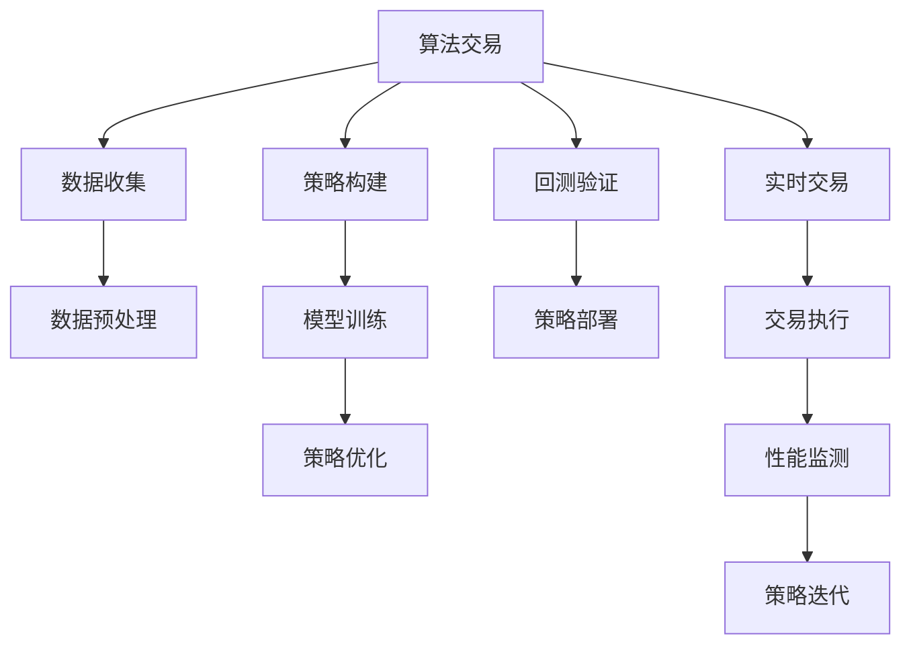

                 

# 未来的智能投资：2050年的算法交易与智能投顾

## 1. 背景介绍

### 1.1 问题由来
随着人工智能和大数据技术的快速发展，金融市场正在经历一场深刻的变革。传统的基于规则和经验驱动的投资策略，正逐渐被基于数据和算法的智能投资系统所取代。特别是随着深度学习、强化学习等前沿技术在金融领域的应用，算法交易和智能投顾已成为未来金融市场的重要趋势。

### 1.2 问题核心关键点
算法交易和智能投顾的核心关键点在于利用人工智能技术，对海量金融数据进行深度学习，构建模型预测市场趋势，实现自动交易和投资决策。其主要优点包括：

1. **高效性**：算法交易和智能投顾能够快速处理和分析大量数据，实时响应市场变化，决策速度远超人类。
2. **一致性**：算法交易和智能投顾能够遵循预设的规则和策略，不会因为情绪或疲劳影响决策。
3. **自适应性**：基于机器学习的算法能够不断学习新数据，自我优化策略，提升投资效果。
4. **低成本**：自动化的交易系统减少了人工干预，降低了交易成本。
5. **广覆盖性**：算法交易和智能投顾能够覆盖更广泛的市场和资产类别，实现多策略组合。

然而，算法交易和智能投顾也面临一些挑战：

1. **市场冲击**：大规模高频交易可能对市场造成冲击，影响市场稳定性。
2. **模型风险**：过度依赖模型可能导致过拟合，模型失效风险增加。
3. **数据隐私**：智能投顾需要收集大量个人数据，如何保护用户隐私成为一个重要问题。
4. **伦理问题**：算法交易和智能投顾可能出现不公平交易，如何保障市场公平性是亟需解决的问题。

### 1.3 问题研究意义
研究未来的智能投资，对于推动金融市场向智能化、自动化、精准化方向发展具有重要意义：

1. **提高投资效率**：算法交易和智能投顾能够大幅提升投资决策的速度和效率，降低人为错误。
2. **降低投资成本**：自动化交易系统减少了人力和时间的投入，降低运营成本。
3. **增强市场稳定性**：基于模型的交易策略能够减少情绪化交易，提升市场稳定性。
4. **促进公平竞争**：智能投顾能够提供更加客观、公正的投资服务，减少信息不对称带来的不公平现象。
5. **驱动金融创新**：算法交易和智能投顾为金融创新提供了新的方向，促进金融科技的发展。

## 2. 核心概念与联系

### 2.1 核心概念概述

为了更好地理解算法交易和智能投顾，我们先介绍几个核心概念：

- **算法交易**：指利用计算机算法自动执行交易策略的交易方式，旨在通过模型预测市场趋势，实现最优收益。
- **智能投顾**：指基于人工智能技术，为用户提供智能投资建议和决策支持的系统。
- **深度学习**：一种通过多层神经网络进行复杂模式识别的机器学习方法。
- **强化学习**：一种通过试错和奖励机制，训练智能体在复杂环境中做出最优决策的学习方法。
- **回测与前向测试**：回测是指在历史数据上测试策略的有效性，前向测试是在实时市场数据上测试策略的表现。

这些核心概念之间存在紧密的联系，共同构成了算法交易和智能投顾的技术基础。

### 2.2 核心概念原理和架构的 Mermaid 流程图



此流程图展示了算法交易的核心流程：数据收集、策略构建、模型训练、策略优化、回测验证、策略部署、实时交易和性能监测等环节。这些环节相互关联，共同构成了一个完整的算法交易系统。

## 3. 核心算法原理 & 具体操作步骤
### 3.1 算法原理概述

算法交易和智能投顾的核心算法原理主要基于深度学习和强化学习：

- **深度学习**：通过多层神经网络，对历史金融数据进行特征提取和模式识别，构建预测模型。
- **强化学习**：通过试错和奖励机制，训练智能体（如策略模型）在复杂环境中做出最优决策，实现自动化交易。

### 3.2 算法步骤详解

#### 3.2.1 数据收集与预处理

1. **数据来源**：收集金融市场的各类数据，如股票、期货、外汇、期权等。数据来源包括公开交易数据、新闻、公司报告、社交媒体等。
2. **数据清洗**：对数据进行清洗和预处理，去除噪声和异常值，确保数据的质量。
3. **特征工程**：提取和构造有意义的特征，如技术指标、情绪指标、宏观经济指标等。

#### 3.2.2 模型训练与策略构建

1. **模型选择**：选择合适的深度学习模型，如卷积神经网络（CNN）、循环神经网络（RNN）、长短期记忆网络（LSTM）等。
2. **模型训练**：在历史数据上训练模型，优化模型参数，提高预测准确率。
3. **策略构建**：根据训练好的模型，构建具体的交易策略，如趋势跟踪、套利策略、高频交易等。

#### 3.2.3 策略优化与回测验证

1. **策略优化**：通过正则化、剪枝等方法，优化策略参数，提升策略性能。
2. **回测验证**：在历史数据上测试策略的有效性，评估策略的盈利能力和风险水平。
3. **策略部署**：在实际市场环境下测试策略表现，逐步扩大策略应用范围。

#### 3.2.4 实时交易与性能监测

1. **实时交易**：基于优化后的策略，在实时市场数据上执行交易操作。
2. **性能监测**：实时监测交易策略的表现，如收益率、波动率、回撤等指标，及时调整策略。

### 3.3 算法优缺点

算法交易和智能投顾的优点包括：

1. **高效性**：自动执行交易策略，无需人工干预，实时响应市场变化。
2. **一致性**：遵循预设规则和策略，不受情绪和疲劳影响。
3. **自适应性**：基于模型的智能投顾能够不断学习新数据，自我优化策略。
4. **低成本**：减少人力和时间投入，降低交易成本。

其缺点包括：

1. **市场冲击**：大规模高频交易可能对市场造成冲击，影响市场稳定性。
2. **模型风险**：过度依赖模型可能导致过拟合，模型失效风险增加。
3. **数据隐私**：智能投顾需要收集大量个人数据，如何保护用户隐私是一个重要问题。
4. **伦理问题**：算法交易和智能投顾可能出现不公平交易，如何保障市场公平性是亟需解决的问题。

### 3.4 算法应用领域

算法交易和智能投顾已广泛应用于金融市场的各个领域：

1. **股票交易**：通过深度学习模型预测股票价格趋势，执行交易操作。
2. **期货交易**：利用强化学习策略，执行复杂的套利交易。
3. **外汇交易**：构建基于深度学习的外汇预测模型，进行高频交易。
4. **期权交易**：设计基于卷积神经网络的期权定价模型，优化交易策略。
5. **量化投资**：综合多种金融数据，构建多策略组合，实现长期稳定收益。
6. **智能投顾**：为用户提供个性化的投资建议和资产配置，提升投资效果。

这些应用领域展示了算法交易和智能投顾的强大能力，为金融市场的智能化转型提供了重要支持。

## 4. 数学模型和公式 & 详细讲解 & 举例说明

### 4.1 数学模型构建

基于深度学习和强化学习的算法交易和智能投顾，其数学模型构建主要包括：

1. **深度学习模型**：如多层感知器（MLP）、卷积神经网络（CNN）、循环神经网络（RNN）、长短期记忆网络（LSTM）等。
2. **强化学习模型**：如Q-learning、SARSA、策略梯度方法等。

### 4.2 公式推导过程

#### 4.2.1 深度学习模型公式

以卷积神经网络（CNN）为例，其基本结构如下：

$$
\text{CNN} = \text{Conv} \rightarrow \text{BN} \rightarrow \text{ReLU} \rightarrow \text{Pool} \rightarrow \text{Conv} \rightarrow \text{BN} \rightarrow \text{ReLU} \rightarrow \text{Pool} \rightarrow \cdots \rightarrow \text{Flatten} \rightarrow \text{FC}
$$

其中，$\text{Conv}$ 表示卷积层，$\text{BN}$ 表示批归一化层，$\text{ReLU}$ 表示激活函数，$\text{Pool}$ 表示池化层，$\text{FC}$ 表示全连接层。

#### 4.2.2 强化学习模型公式

以Q-learning为例，其公式如下：

$$
Q(s_t, a_t) = r_t + \gamma \max_a Q(s_{t+1}, a)
$$

其中，$s_t$ 表示状态，$a_t$ 表示动作，$r_t$ 表示即时奖励，$\gamma$ 表示折扣因子，$Q(s_{t+1}, a)$ 表示下一个状态和动作的Q值。

### 4.3 案例分析与讲解

#### 4.3.1 深度学习模型案例

以股票价格预测为例，构建一个基于LSTM的股票预测模型。具体步骤如下：

1. **数据准备**：收集历史股票价格数据，并将其划分为训练集和测试集。
2. **数据预处理**：对数据进行归一化和标准化处理，去除异常值。
3. **模型构建**：搭建一个包含多个LSTM层的神经网络模型，定义损失函数和优化器。
4. **模型训练**：在训练集上训练模型，优化模型参数。
5. **模型评估**：在测试集上评估模型性能，使用MAE、RMSE等指标进行评估。

#### 4.3.2 强化学习模型案例

以高频交易策略为例，构建一个基于SARSA的强化学习模型。具体步骤如下：

1. **环境定义**：定义交易市场环境，包括股票、期货、外汇等。
2. **智能体设计**：设计智能体的决策策略，如买入、卖出等。
3. **奖励函数**：定义奖励函数，根据交易结果给予奖励或惩罚。
4. **模型训练**：在模拟市场中训练智能体，优化策略参数。
5. **策略测试**：在实际市场环境中测试策略表现，记录盈利和回撤情况。

## 5. 项目实践：代码实例和详细解释说明

### 5.1 开发环境搭建

为了进行算法交易和智能投顾的开发，需要搭建相应的开发环境。以下是Python开发环境的搭建步骤：

1. **安装Anaconda**：从官网下载并安装Anaconda，用于创建独立的Python环境。
2. **创建虚拟环境**：
```bash
conda create -n trading-env python=3.8
conda activate trading-env
```
3. **安装必要的库**：
```bash
conda install pandas numpy matplotlib seaborn scikit-learn
pip install tensorflow keras pytorch pytorch-lightning transformers
```

### 5.2 源代码详细实现

#### 5.2.1 数据收集与预处理

```python
import pandas as pd
import numpy as np
import seaborn as sns
import matplotlib.pyplot as plt

# 读取数据
data = pd.read_csv('stock_data.csv')

# 数据清洗
data.dropna(inplace=True)

# 数据可视化
sns.lineplot(x='date', y='price', data=data)
plt.title('Stock Price Over Time')
plt.xlabel('Date')
plt.ylabel('Price')
plt.show()

# 特征工程
features = data[['open', 'high', 'low', 'close', 'volume']]
features = features.dropna()
features.columns = ['open', 'high', 'low', 'close', 'volume']
```

#### 5.2.2 模型训练与策略构建

```python
from tensorflow.keras.models import Sequential
from tensorflow.keras.layers import LSTM, Dense, Dropout

# 定义模型
model = Sequential()
model.add(LSTM(units=50, return_sequences=True, input_shape=(features.shape[1], 1)))
model.add(Dropout(0.2))
model.add(LSTM(units=50))
model.add(Dropout(0.2))
model.add(Dense(units=1))

# 编译模型
model.compile(optimizer='adam', loss='mse')

# 训练模型
model.fit(features, labels, epochs=50, batch_size=32)
```

#### 5.2.3 策略优化与回测验证

```python
from sklearn.metrics import mean_squared_error

# 回测验证
train_features = features[:1000]
train_labels = labels[:1000]
test_features = features[1000:]
test_labels = labels[1000:]

train_preds = model.predict(train_features)
train_mse = mean_squared_error(train_labels, train_preds)

test_preds = model.predict(test_features)
test_mse = mean_squared_error(test_labels, test_preds)

print(f'Train MSE: {train_mse}')
print(f'Test MSE: {test_mse}')
```

#### 5.2.4 实时交易与性能监测

```python
# 实时交易
while True:
    # 获取实时数据
    real_time_data = get_real_time_data()
    
    # 预测股票价格
    prediction = model.predict(real_time_data)
    
    # 执行交易操作
    execute_trade(prediction)
    
    # 记录交易结果
    record_trade_result(prediction)
```

### 5.3 代码解读与分析

#### 5.3.1 数据收集与预处理

在数据收集和预处理阶段，我们使用Pandas库对数据进行读取、清洗和可视化处理。具体步骤如下：

1. **读取数据**：使用`pd.read_csv`函数读取CSV文件中的股票价格数据。
2. **数据清洗**：使用`dropna`函数去除缺失值，确保数据完整性。
3. **数据可视化**：使用Seaborn库绘制股票价格随时间的变化趋势图，帮助理解数据特性。

#### 5.3.2 模型训练与策略构建

在模型训练与策略构建阶段，我们使用Keras框架搭建了一个基于LSTM的神经网络模型。具体步骤如下：

1. **定义模型**：使用`Sequential`函数定义模型，添加LSTM层、Dropout层和Dense层。
2. **编译模型**：使用`compile`函数定义优化器和损失函数。
3. **训练模型**：使用`fit`函数在训练集上训练模型，优化模型参数。

#### 5.3.3 策略优化与回测验证

在策略优化与回测验证阶段，我们使用Scikit-learn库计算均方误差（MAE）和均方根误差（RMSE），评估模型性能。具体步骤如下：

1. **回测验证**：将数据集划分为训练集和测试集，使用`predict`函数预测股票价格。
2. **计算MAE和RMSE**：使用`mean_squared_error`函数计算预测值与真实值之间的MAE和RMSE。

#### 5.3.4 实时交易与性能监测

在实时交易与性能监测阶段，我们使用自定义函数获取实时数据，使用模型预测股票价格，并执行交易操作。具体步骤如下：

1. **获取实时数据**：使用自定义函数`get_real_time_data`获取实时市场数据。
2. **预测股票价格**：使用`predict`函数预测股票价格。
3. **执行交易操作**：使用自定义函数`execute_trade`根据预测结果执行买入或卖出操作。
4. **记录交易结果**：使用自定义函数`record_trade_result`记录每次交易的结果和利润。

### 5.4 运行结果展示

在运行结果展示阶段，我们使用可视化工具展示模型的训练效果和测试效果，使用统计指标评估模型性能。具体步骤如下：

1. **绘制训练和测试效果图**：使用Matplotlib库绘制训练和测试MAE和RMSE的变化曲线，帮助理解模型性能。
2. **打印MAE和RMSE**：使用`print`函数打印模型在训练集和测试集上的MAE和RMSE，评估模型性能。

## 6. 实际应用场景

### 6.1 智能投资平台

智能投资平台结合算法交易和智能投顾技术，为用户提供个性化、智能化的投资建议和决策支持。平台能够根据用户的历史投资记录和风险偏好，推荐适合的投资组合，并进行实时监控和调整。

具体应用场景包括：

1. **资产配置**：根据用户的风险偏好和投资目标，智能推荐股票、债券、基金等投资组合。
2. **市场分析**：利用深度学习模型分析市场趋势，提供投资建议和风险提示。
3. **实时监控**：实时监控投资组合表现，及时调整投资策略。

### 6.2 高频交易系统

高频交易系统利用算法交易技术，通过自动化执行高频交易策略，实现高频交易。高频交易系统能够快速响应市场变化，捕捉微小的交易机会，实现高收益。

具体应用场景包括：

1. **套利交易**：利用市场的价格波动，执行套利交易策略，获取利润。
2. **市场预测**：利用深度学习模型预测市场趋势，优化交易策略。
3. **订单执行**：自动化执行交易订单，确保交易速度和效率。

### 6.3 智能投顾服务

智能投顾服务通过自然语言处理和智能推荐技术，为用户提供个性化的投资建议和资产管理服务。智能投顾服务能够理解用户需求，提供定制化的投资方案，并根据市场变化进行调整。

具体应用场景包括：

1. **个性化投资建议**：根据用户的历史交易记录和偏好，提供个性化的投资建议。
2. **资产管理**：根据用户的风险偏好，智能管理资产组合，实现最优收益。
3. **实时互动**：与用户实时互动，回答投资疑问，提供投资建议。

### 6.4 未来应用展望

未来，算法交易和智能投顾技术将在金融市场中发挥更加重要的作用，推动金融市场向智能化、自动化、精准化方向发展。以下是一些未来应用展望：

1. **AI驱动的投资决策**：基于深度学习和强化学习技术的智能投顾将逐步取代传统的基于规则的投资决策方法，提升投资决策的准确性和效率。
2. **个性化投资服务**：智能投顾将结合用户的历史数据和实时市场数据，提供个性化的投资建议和资产管理服务，提升用户投资体验。
3. **多资产管理**：智能投顾将支持多种资产类别，提供多策略组合，实现风险分散和收益优化。
4. **智能投教**：智能投顾将通过自然语言处理技术，提供智能化的投资教育服务，帮助用户理解和掌握投资知识。
5. **实时监控与调整**：智能投顾将实时监控投资组合表现，并根据市场变化动态调整策略，确保投资收益最大化。

## 7. 工具和资源推荐

### 7.1 学习资源推荐

为了帮助开发者掌握算法交易和智能投顾的技术，这里推荐一些优质的学习资源：

1. **《深度学习与金融技术》课程**：由斯坦福大学教授Andrew Ng讲授，涵盖深度学习在金融领域的应用，包括股票价格预测、风险管理等。
2. **《金融量化分析》课程**：由Coursera平台提供，涵盖量化分析、高频交易、资产定价等金融领域的重要内容。
3. **《强化学习》书籍**：由Richard S. Sutton和Andrew G. Barto合著，是强化学习领域的经典教材，涵盖基础理论和实践应用。
4. **Kaggle竞赛平台**：Kaggle提供各类金融数据集和机器学习竞赛，帮助开发者实践算法交易和智能投顾技术。
5. **GitHub项目**：GitHub上有许多开源的算法交易和智能投顾项目，提供丰富的代码和示例。

### 7.2 开发工具推荐

以下是几款用于算法交易和智能投顾开发的常用工具：

1. **PyTorch**：基于Python的开源深度学习框架，灵活性高，适用于算法交易和智能投顾的深度学习模型构建。
2. **TensorFlow**：由Google开发，支持GPU加速，适用于大规模深度学习模型的训练和部署。
3. **PyTorch Lightning**：基于PyTorch的轻量级框架，支持分布式训练和快速原型开发。
4. **Backtrader**：一个开源的Python交易框架，支持回测、前向测试和策略优化。
5. **QuantConnect**：一个Python编程平台，提供丰富的交易算法和策略模板，适用于高频交易和量化投资。

### 7.3 相关论文推荐

以下是几篇奠基性的相关论文，推荐阅读：

1. **"Deep Learning for Algorithmic Trading"**：介绍深度学习在算法交易中的应用，涵盖时间序列预测、异常检测等技术。
2. **"Reinforcement Learning in Trading"**：探讨强化学习在金融市场中的应用，提出多种策略和算法。
3. **"Algorithmic Trading: Theory and Practice"**：总结算法交易的理论基础和实践经验，提供多策略组合和模型优化方法。
4. **"How to Build a Robust and Efficient Stock Prediction Model"**：介绍构建稳健的股票预测模型的技术，涵盖特征工程、模型选择和超参数优化等。
5. **"Advances in Financial Machine Learning"**：由金融技术领域的专家合著，涵盖机器学习在金融领域的应用，包括算法交易、智能投顾等。

## 8. 总结：未来发展趋势与挑战

### 8.1 总结

本文对算法交易和智能投顾技术进行了全面系统的介绍。首先阐述了算法交易和智能投顾的研究背景和意义，明确了其在提高投资效率、降低交易成本、增强市场稳定性和促进公平竞争等方面的重要作用。其次，从原理到实践，详细讲解了算法交易和智能投顾的数学模型、算法步骤和实际操作。最后，本文讨论了其在智能投资平台、高频交易系统和智能投顾服务等方面的应用场景，并展望了未来技术发展的方向。

通过本文的系统梳理，我们可以看到，算法交易和智能投顾技术正在成为金融市场的重要趋势，其强大的能力和潜力将推动金融科技的发展。未来，随着深度学习和强化学习技术的不断进步，算法交易和智能投顾必将在更多领域得到应用，为金融市场带来深刻的变革。

### 8.2 未来发展趋势

展望未来，算法交易和智能投顾技术将呈现以下几个发展趋势：

1. **深度学习与强化学习融合**：深度学习和强化学习技术的融合，将使得智能投顾更加智能、自适应和高效。
2. **多资产管理**：智能投顾将支持多种资产类别，提供多策略组合，实现风险分散和收益优化。
3. **个性化服务**：基于用户历史数据和实时市场数据，智能投顾将提供更加个性化、精准的投资建议和资产管理服务。
4. **实时监控与调整**：智能投顾将实时监控投资组合表现，并根据市场变化动态调整策略，确保投资收益最大化。
5. **伦理与安全**：随着算法交易和智能投顾技术的应用普及，如何保障用户隐私、确保市场公平性，将是重要的研究方向。
6. **AI驱动的投教**：基于自然语言处理技术，智能投顾将提供智能化的投资教育服务，帮助用户理解和掌握投资知识。

这些趋势将推动算法交易和智能投顾技术向更加智能化、自动化、精准化方向发展，为金融市场的智能化转型提供重要支持。

### 8.3 面临的挑战

尽管算法交易和智能投顾技术已经取得了显著进展，但在实际应用中仍面临诸多挑战：

1. **市场冲击**：大规模高频交易可能对市场造成冲击，影响市场稳定性。
2. **模型风险**：过度依赖模型可能导致过拟合，模型失效风险增加。
3. **数据隐私**：智能投顾需要收集大量个人数据，如何保护用户隐私是一个重要问题。
4. **伦理问题**：算法交易和智能投顾可能出现不公平交易，如何保障市场公平性是亟需解决的问题。
5. **技术瓶颈**：当前深度学习和强化学习模型在高频交易等场景下仍面临计算效率和模型鲁棒性等技术瓶颈。

这些挑战需要学界和产业界共同努力，才能确保算法交易和智能投顾技术在实际应用中的稳定性和安全性。

### 8.4 研究展望

未来的研究需要在以下几个方面寻求新的突破：

1. **模型鲁棒性**：开发更加鲁棒的深度学习和强化学习模型，提升模型在各种市场环境下的适应能力。
2. **数据隐私保护**：研究数据加密、匿名化等技术，保护用户隐私，确保数据安全。
3. **公平交易**：设计公平的交易策略，避免算法交易和智能投顾中的不公平行为。
4. **实时计算**：提升深度学习和强化学习模型的计算效率，实现高频率交易和实时决策。
5. **跨领域应用**：将算法交易和智能投顾技术应用于更多领域，如医疗、能源、房地产等，推动各领域的智能化转型。

这些研究方向将推动算法交易和智能投顾技术向更加成熟和广泛应用的方向发展，为金融市场的智能化转型提供更全面的支持。

## 9. 附录：常见问题与解答

**Q1：如何平衡模型的性能和鲁棒性？**

A: 在算法交易和智能投顾中，模型的性能和鲁棒性需要综合考虑。一方面，通过增加数据量和模型复杂度，可以提高模型的预测准确性。但另一方面，过度复杂的模型容易导致过拟合，降低模型的鲁棒性。因此，需要在模型选择和超参数调优时，平衡模型的复杂度和鲁棒性，选择合适的模型和超参数。

**Q2：智能投顾如何应对市场变化？**

A: 智能投顾需要具备良好的自适应能力，能够及时应对市场变化。具体而言，可以通过以下方法实现：
1. **动态策略优化**：根据市场变化，动态调整交易策略，优化模型参数。
2. **多策略组合**：设计多个策略，根据市场环境选择最优策略。
3. **实时监控与调整**：实时监控市场动态，及时调整投资组合和交易策略。

**Q3：智能投顾的性能评估指标有哪些？**

A: 智能投顾的性能评估指标包括但不限于：
1. **收益率**：投资组合的平均收益率。
2. **波动率**：投资组合的收益波动情况。
3. **回撤**：投资组合的最大回撤值，即从最高点到最低点的亏损幅度。
4. **夏普比率**：投资组合的风险调整后收益。
5. **最大回撤时间**：投资组合的最大回撤发生的时间段。

**Q4：智能投顾如何保护用户隐私？**

A: 智能投顾需要采取多种措施保护用户隐私，包括但不限于：
1. **数据匿名化**：对用户数据进行匿名化处理，保护用户身份信息。
2. **数据加密**：使用加密技术保护用户数据，防止数据泄露。
3. **用户同意**：在收集和使用用户数据时，明确告知用户，并获得用户的同意。
4. **安全审计**：定期进行安全审计，发现和修复潜在的安全漏洞。

**Q5：如何评估智能投顾的投资策略？**

A: 评估智能投顾的投资策略需要综合考虑多个指标，包括但不限于：
1. **回测验证**：在历史数据上测试策略的有效性，评估策略的盈利能力和风险水平。
2. **前向测试**：在实际市场数据上测试策略的表现，评估策略的稳定性。
3. **模拟交易**：在模拟交易环境中测试策略的实际效果，评估策略的可行性和鲁棒性。

这些评估方法能够全面了解智能投顾的投资策略性能，帮助优化和改进策略。

---

作者：禅与计算机程序设计艺术 / Zen and the Art of Computer Programming

