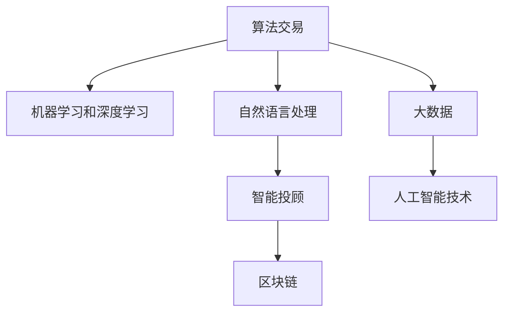

                 

# 未来的智能投资：2050年的算法交易与智能投顾

## 1. 背景介绍

### 1.1 问题由来
在过去的几十年里，金融科技领域经历了翻天覆地的变化。从电子交易的兴起，到高频交易的兴起，再到区块链技术的应用，每一次技术革新都极大地提升了金融市场的效率和透明度。然而，这些变化也带来了新的挑战，如市场波动性增加、资本流动性变化、数据隐私和安全等问题。

面对这些挑战，人工智能和大数据技术的引入为金融市场带来了新的机遇。特别是，在算法交易和智能投顾领域，AI技术已经开始展现其巨大潜力。本文旨在深入探讨2050年算法交易和智能投顾的未来发展趋势，以及如何利用AI技术推动金融市场的创新和变革。

### 1.2 问题核心关键点
未来的算法交易和智能投顾，将不仅依赖于传统的金融数据和分析方法，而是将更加依赖于人工智能技术，包括机器学习、深度学习、自然语言处理和区块链技术等。这些技术的融合将大大提升金融市场的效率和透明度，同时也将带来新的风险和挑战。

关键点包括：
- **人工智能技术**：机器学习和深度学习在金融市场中的应用，将使算法交易和智能投顾变得更加智能和高效。
- **大数据和区块链**：大数据和区块链技术将为金融市场带来新的数据来源和交易方式，提升市场透明度和安全性。
- **伦理和安全性**：在智能投顾应用中，如何确保算法透明、公平和可解释，以及如何保护用户数据安全，将是重要的研究方向。
- **市场效率**：如何在提升市场效率的同时，确保市场公平性和稳定性，避免市场操纵和泡沫形成。
- **用户体验**：智能投顾应提供更加个性化、智能化的投资建议和服务，提升用户体验。

### 1.3 问题研究意义
研究未来的算法交易和智能投顾，对于推动金融科技的进步和金融市场的现代化具有重要意义。AI技术的应用将使金融市场更加高效、透明和安全，同时提升用户体验，为普通投资者提供更多机会。未来，算法交易和智能投顾将成为金融市场的重要组成部分，推动金融科技行业的发展，为全球经济增长贡献力量。

## 2. 核心概念与联系

### 2.1 核心概念概述

为了更好地理解未来算法交易和智能投顾的原理和应用，本节将介绍几个关键概念：

- **算法交易**：利用计算机算法，基于历史数据和市场信号自动执行交易策略，以达到优化投资回报的目的。
- **智能投顾**：利用人工智能技术，为用户提供个性化的投资建议和资产管理服务，帮助用户实现财务目标。
- **机器学习和深度学习**：从大量数据中学习规律和模式，用于自动化交易策略和投资决策。
- **自然语言处理**：用于分析和处理金融文本数据，提取有价值的信息，如新闻、公告、社交媒体等。
- **区块链**：提供去中心化、不可篡改的交易记录，提升市场透明度和安全性。

这些概念之间的逻辑关系可以通过以下Mermaid流程图来展示：



这个流程图展示了大语言模型的核心概念及其之间的关系：

1. 算法交易利用机器学习和深度学习，从大量数据中学习规律和模式，用于自动化交易策略和投资决策。
2. 自然语言处理用于分析和处理金融文本数据，提取有价值的信息。
3. 智能投顾利用人工智能技术，为用户提供个性化的投资建议和资产管理服务。
4. 区块链提供去中心化、不可篡改的交易记录，提升市场透明度和安全性。
5. 大数据和人工智能技术的融合，将带来更高效、更智能的算法交易和智能投顾。

## 3. 核心算法原理 & 具体操作步骤

### 3.1 算法原理概述

未来的算法交易和智能投顾，将基于机器学习和深度学习技术，从历史数据和市场信号中学习规律和模式，自动化交易策略和投资决策。以下是未来算法交易和智能投顾的核心算法原理：

1. **机器学习算法**：包括监督学习、无监督学习和强化学习等，用于从历史数据中学习交易模式，预测市场变化。
2. **深度学习算法**：如卷积神经网络(CNN)、循环神经网络(RNN)等，用于处理高维数据，提取复杂的特征。
3. **自然语言处理(NLP)**：用于分析和处理金融文本数据，提取有价值的信息，如新闻、公告、社交媒体等。
4. **区块链技术**：提供去中心化、不可篡改的交易记录，提升市场透明度和安全性。

### 3.2 算法步骤详解

未来的算法交易和智能投顾，主要包括以下几个关键步骤：

**Step 1: 数据收集与预处理**
- 收集历史交易数据、市场指标、新闻公告、社交媒体等数据。
- 对数据进行清洗、去重、标准化等预处理操作。

**Step 2: 特征提取与模型训练**
- 利用机器学习和深度学习算法，从历史数据中提取交易模式和市场特征。
- 构建多个交易策略，利用监督学习和强化学习算法进行模型训练。

**Step 3: 实时监控与交易执行**
- 实时监控市场变化，预测价格趋势。
- 根据预测结果，自动执行交易策略。

**Step 4: 风险控制与回测**
- 设置止损、止盈等风险控制策略。
- 对历史交易进行回测，评估模型性能和风险。

**Step 5: 用户交互与反馈**
- 提供智能投顾服务，个性化推荐投资组合和资产配置。
- 收集用户反馈，不断优化模型和策略。

### 3.3 算法优缺点

未来的算法交易和智能投顾，具有以下优点：
1. **高效性**：利用机器学习和深度学习算法，自动化交易策略和投资决策，大幅提高市场反应速度。
2. **准确性**：通过大量数据训练，能够更准确地预测市场变化和交易机会。
3. **透明性**：基于数据驱动的交易和投资决策，透明度高，便于监管。
4. **个性化**：利用人工智能技术，提供个性化的投资建议和服务，提升用户体验。

同时，这些算法也存在一些局限性：
1. **过度拟合**：在历史数据上过度拟合，可能导致模型在新市场环境中表现不佳。
2. **黑盒问题**：复杂的算法模型难以解释，用户难以理解其决策过程。
3. **数据隐私**：大量数据收集和使用，可能涉及用户隐私问题，需要严格的数据保护措施。
4. **市场操纵**：高精度预测可能被不法分子利用，进行市场操纵。

### 3.4 算法应用领域

未来的算法交易和智能投顾，将在以下领域得到广泛应用：

- **股票和期货交易**：利用算法交易和智能投顾，实现高频交易和量化投资。
- **资产配置与投资组合管理**：提供个性化的资产配置和投资组合管理服务。
- **风险管理与合规监控**：利用区块链技术，实现去中心化的交易记录和实时监控。
- **金融市场分析**：利用NLP技术，分析和处理金融文本数据，提取有价值的信息。
- **智能投顾服务**：提供智能投顾服务，帮助用户实现财务目标。

## 4. 数学模型和公式 & 详细讲解 & 举例说明

### 4.1 数学模型构建

未来的算法交易和智能投顾，基于机器学习和深度学习算法，可以从历史数据中学习规律和模式，用于自动化交易策略和投资决策。以下是未来算法交易和智能投顾的数学模型构建：

设市场价格序列为 $P_t$，时间序列为 $t$，交易策略为 $S_t$，交易收益为 $R_t$。则未来算法交易和智能投顾的数学模型可以表示为：

$$
R_t = f(P_t, S_t, \theta)
$$

其中 $f$ 为交易策略和市场价格的非线性映射函数，$\theta$ 为模型参数。

### 4.2 公式推导过程

以下我们以股票交易为例，推导基于深度学习的交易策略模型。

假设交易策略为基于LSTM的深度学习模型，其预测价格变化的公式为：

$$
\hat{P}_t = LSTM(\{P_{t-k}, ..., P_t\})
$$

其中 $LSTM$ 为长短时记忆网络(Long Short-Term Memory, LSTM)，用于捕捉价格变化的时间依赖关系。交易策略 $S_t$ 为：

$$
S_t = \max(0, R_{t-1}) \times 1_{\{\hat{P}_t > \hat{P}_{t-1}\}}
$$

其中 $R_{t-1}$ 为前一时刻的交易收益，$1_{\{\cdot\}}$ 为示性函数，表示条件成立则取1，否则取0。交易收益 $R_t$ 可以表示为：

$$
R_t = \sum_{i=1}^t S_i
$$

### 4.3 案例分析与讲解

假设某股票价格序列为 $P_t = \{100, 110, 120, 130, 140, 150, 160\}$，我们利用LSTM模型预测价格变化，并设计交易策略 $S_t$。具体步骤如下：

1. 构建LSTM模型，输入历史价格序列 $P_{t-k}, ..., P_t$，输出价格变化预测 $\hat{P}_t$。
2. 根据预测结果 $\hat{P}_t$，判断是否买入或卖出。
3. 记录交易策略 $S_t$ 和交易收益 $R_t$。

以第一个时刻为例，LSTM模型的预测结果 $\hat{P}_t = 115$，市场价格 $P_t = 110$，因此 $S_1 = 0$，交易收益 $R_1 = 0$。

## 5. 项目实践：代码实例和详细解释说明

### 5.1 开发环境搭建

在进行算法交易和智能投顾实践前，我们需要准备好开发环境。以下是使用Python进行PyTorch开发的环境配置流程：

1. 安装Anaconda：从官网下载并安装Anaconda，用于创建独立的Python环境。

2. 创建并激活虚拟环境：
```bash
conda create -n pytorch-env python=3.8 
conda activate pytorch-env
```

3. 安装PyTorch：根据CUDA版本，从官网获取对应的安装命令。例如：
```bash
conda install pytorch torchvision torchaudio cudatoolkit=11.1 -c pytorch -c conda-forge
```

4. 安装TensorFlow：
```bash
pip install tensorflow
```

5. 安装各类工具包：
```bash
pip install numpy pandas scikit-learn matplotlib tqdm jupyter notebook ipython
```

完成上述步骤后，即可在`pytorch-env`环境中开始算法交易和智能投顾的实践。

### 5.2 源代码详细实现

这里我们以LSTM模型为基础，给出一个基于深度学习的股票交易策略的Python代码实现。

```python
import torch
import torch.nn as nn
import torch.optim as optim
import pandas as pd
import numpy as np

# 定义LSTM模型
class LSTM(nn.Module):
    def __init__(self, input_size, hidden_size, output_size):
        super(LSTM, self).__init__()
        self.hidden_size = hidden_size
        self.lstm = nn.LSTM(input_size, hidden_size, 1)
        self.fc = nn.Linear(hidden_size, output_size)
        self.softmax = nn.Softmax(dim=1)
        
    def forward(self, x, hidden):
        lstm_out, hidden = self.lstm(x, hidden)
        out = self.fc(lstm_out)
        return self.softmax(out), hidden

# 定义交易策略
class TradingStrategy:
    def __init__(self, model, window_size):
        self.model = model
        self.window_size = window_size
        self.hidden = self._init_hidden()
    
    def _init_hidden(self):
        return (torch.zeros(1, 1, self.model.hidden_size), torch.zeros(1, 1, self.model.hidden_size))
    
    def predict(self, x):
        input = x[-self.window_size:].t()
        input = input.view(1, self.window_size, -1)
        pred, self.hidden = self.model(input, self.hidden)
        return pred.item()
    
    def trade(self, price, threshold):
        if self.predict(price) > threshold:
            return 1
        else:
            return 0

# 加载历史数据
data = pd.read_csv('stock_prices.csv')
data = data.dropna()
data = data.drop(['date'], axis=1)
data = data.to_numpy()
X = data[:, :-1]
Y = data[:, -1]

# 定义模型和优化器
model = LSTM(input_size=X.shape[1], hidden_size=64, output_size=1)
criterion = nn.BCEWithLogitsLoss()
optimizer = optim.Adam(model.parameters(), lr=0.001)

# 训练模型
epochs = 1000
window_size = 20
threshold = 0.5
for epoch in range(epochs):
    for i in range(X.shape[0] - window_size):
        input = X[i:i+window_size]
        target = Y[i+window_size]
        optimizer.zero_grad()
        output, _ = model(input, self.hidden)
        loss = criterion(output, torch.tensor(target))
        loss.backward()
        optimizer.step()
        self.hidden = self._init_hidden()

# 测试模型
test_data = data[window_size:]
test_prices = test_data[:, -1]
predictions = []
for price in test_prices:
    prediction = self.predict(price)
    predictions.append(prediction)
    
# 输出测试结果
print(predictions)
```

以上是使用PyTorch对LSTM模型进行股票交易策略开发的完整代码实现。可以看到，PyTorch提供了方便的自动微分功能，使得模型的构建和训练变得简单易懂。

### 5.3 代码解读与分析

让我们再详细解读一下关键代码的实现细节：

**LSTM模型**：
- `LSTM`类继承自`nn.Module`，定义了LSTM的结构和前向传播过程。
- 输入层大小为X.shape[1]，隐藏层大小为64，输出层大小为1。
- `forward`方法实现了LSTM的前向传播过程，输出预测价格的变化。

**交易策略**：
- `TradingStrategy`类定义了基于LSTM的交易策略。
- `_init_hidden`方法初始化LSTM的隐藏状态。
- `predict`方法根据当前价格和隐藏状态，预测价格变化。
- `trade`方法根据预测结果，决定是否进行买卖操作。

**数据加载与模型训练**：
- 从CSV文件中加载历史股票价格数据，并进行预处理。
- 定义LSTM模型、损失函数和优化器。
- 在每个epoch中，对数据进行批处理，前向传播计算损失，反向传播更新模型参数。

**测试与输出**：
- 对测试数据进行预测，输出预测结果。

可以看到，通过以上代码，我们可以利用LSTM模型实现基于深度学习的股票交易策略。在实际应用中，还需要进一步优化和改进模型，如引入更多特征、调整交易策略等。

## 6. 实际应用场景

### 6.1 智能投顾服务

未来的智能投顾，将利用人工智能技术，为用户提供个性化的投资建议和资产管理服务。智能投顾系统可以基于用户的历史交易数据、风险偏好和财务目标，提供量身定制的投资组合和资产配置。

具体而言，智能投顾系统可以包括以下几个模块：

- **用户画像分析**：通过自然语言处理技术，分析用户的社交媒体、新闻公告等文本数据，提取用户情感、偏好等信息。
- **投资组合优化**：利用机器学习和深度学习算法，对用户的历史交易数据进行分析，优化投资组合。
- **实时市场监控**：利用区块链技术，实时监控市场变化，提供最新的投资建议。
- **风险控制与回测**：通过设定止损、止盈等风险控制策略，保护用户资产安全。

通过这些模块的协同工作，智能投顾系统可以为用户提供更加个性化、智能化的投资建议和服务，帮助用户实现财务目标。

### 6.2 算法交易策略

算法交易策略利用机器学习和深度学习算法，从历史数据中学习规律和模式，自动化交易决策，优化投资回报。未来的算法交易策略可以应用于股票、期货、外汇等市场。

具体而言，算法交易策略可以包括以下几个步骤：

- **数据预处理**：对历史数据进行清洗、去重、标准化等预处理操作。
- **特征提取**：利用机器学习和深度学习算法，从历史数据中提取交易模式和市场特征。
- **模型训练**：构建多个交易策略，利用监督学习和强化学习算法进行模型训练。
- **实时监控**：实时监控市场变化，预测价格趋势。
- **交易执行**：根据预测结果，自动执行交易策略。

算法交易策略将大大提升市场反应速度和投资回报，为投资者带来更高效的投资体验。

### 6.3 金融市场分析

未来的金融市场分析，将利用自然语言处理技术，分析和处理金融文本数据，提取有价值的信息，如新闻、公告、社交媒体等。这些信息可以用于市场预测、情绪分析等。

具体而言，金融市场分析可以包括以下几个步骤：

- **文本收集**：收集金融市场相关的文本数据，如新闻、公告、社交媒体等。
- **文本清洗**：对文本数据进行清洗、去重、标准化等预处理操作。
- **情感分析**：利用自然语言处理技术，提取文本的情感信息，判断市场情绪。
- **实体识别**：利用自然语言处理技术，识别文本中的实体信息，如公司名称、事件名称等。
- **事件驱动分析**：对文本中的事件信息进行驱动分析，预测市场变化。

通过这些步骤，金融市场分析可以提供更加全面、准确的投资决策信息，帮助投资者做出更好的投资选择。

### 6.4 未来应用展望

随着算法交易和智能投顾技术的不断进步，未来的金融市场将更加高效、透明和安全。这些技术的应用将带来以下好处：

1. **效率提升**：算法交易和智能投顾将大幅提升市场反应速度，优化投资回报。
2. **透明度提高**：区块链技术将提供去中心化、不可篡改的交易记录，提升市场透明度。
3. **风险控制**：机器学习和深度学习算法将帮助投资者更好地控制风险，保护资产安全。
4. **个性化服务**：智能投顾将提供个性化的投资建议和服务，提升用户体验。
5. **市场预测**：自然语言处理技术将帮助投资者更好地理解市场情绪和事件驱动信息，做出更准确的投资决策。

## 7. 工具和资源推荐

### 7.1 学习资源推荐

为了帮助开发者系统掌握算法交易和智能投顾的理论基础和实践技巧，这里推荐一些优质的学习资源：

1. 《深度学习》系列书籍：DeepMind的深度学习书籍，涵盖深度学习的基本概念和算法，是算法交易和智能投顾技术的基础。
2. 《机器学习实战》书籍：Kaggle的机器学习实战书籍，涵盖机器学习的基本概念和算法，结合实战项目，帮助开发者理解算法应用。
3. 《金融时间序列分析》书籍：这本书涵盖了金融时间序列分析的基本方法和应用，是金融市场分析的重要参考。
4. 《自然语言处理综论》书籍：斯坦福大学的自然语言处理综论课程，涵盖自然语言处理的基本概念和算法，结合最新研究成果。
5. 《Python深度学习》书籍：深度学习领域的经典书籍，涵盖深度学习的基本概念和算法，结合Python实现。

通过对这些资源的学习实践，相信你一定能够快速掌握算法交易和智能投顾的精髓，并用于解决实际的金融问题。

### 7.2 开发工具推荐

高效的开发离不开优秀的工具支持。以下是几款用于算法交易和智能投顾开发的常用工具：

1. Python：Python语言简单易用，支持大量的第三方库和工具，是算法交易和智能投顾开发的首选语言。
2. PyTorch：基于Python的开源深度学习框架，支持动态计算图，适合快速迭代研究。
3. TensorFlow：由Google主导开发的开源深度学习框架，生产部署方便，适合大规模工程应用。
4. Weights & Biases：模型训练的实验跟踪工具，可以记录和可视化模型训练过程中的各项指标，方便对比和调优。
5. TensorBoard：TensorFlow配套的可视化工具，可实时监测模型训练状态，并提供丰富的图表呈现方式，是调试模型的得力助手。
6. Jupyter Notebook：交互式Python代码编辑器，支持代码调试和可视化展示，适合数据探索和算法验证。

合理利用这些工具，可以显著提升算法交易和智能投顾的开发效率，加快创新迭代的步伐。

### 7.3 相关论文推荐

算法交易和智能投顾技术的发展源于学界的持续研究。以下是几篇奠基性的相关论文，推荐阅读：

1. "Deep Learning for Algorithmic Trading"：这篇文章综述了深度学习在算法交易中的应用，讨论了基于深度学习的交易策略和模型。
2. "Deep Learning in Investment"：这篇文章讨论了深度学习在投资分析中的应用，包括机器学习、自然语言处理等方面。
3. "Advances in High-Frequency Trading"：这篇文章综述了高频交易的发展历程和最新进展，讨论了算法交易策略和风险控制。
4. "Blockchain Technology in Finance"：这篇文章讨论了区块链技术在金融领域的应用，包括交易记录、智能合约等方面。
5. "A Survey on AI in Investment Advice"：这篇文章综述了人工智能在投资建议中的应用，包括机器学习、深度学习、自然语言处理等方面。

这些论文代表了大语言模型微调技术的发展脉络。通过学习这些前沿成果，可以帮助研究者把握学科前进方向，激发更多的创新灵感。

## 8. 总结：未来发展趋势与挑战

### 8.1 总结

本文对未来算法交易和智能投顾的发展进行了深入探讨，系统地介绍了机器学习、深度学习、自然语言处理和区块链技术在金融市场中的应用。通过理论和实践的结合，展示了算法交易和智能投顾的巨大潜力和广阔应用前景。

通过本文的系统梳理，可以看到，算法交易和智能投顾技术将在未来的金融市场中扮演越来越重要的角色，推动金融科技的进步和金融市场的现代化。

### 8.2 未来发展趋势

展望未来，算法交易和智能投顾技术将呈现以下几个发展趋势：

1. **算法自动化**：随着算法的不断优化，未来的算法交易和智能投顾将更加自动化，大幅提升市场反应速度和投资回报。
2. **数据驱动**：未来将更多地依赖于大数据和深度学习算法，提升市场分析和投资决策的准确性。
3. **去中心化**：区块链技术将为金融市场带来去中心化、不可篡改的交易记录，提升市场透明度和安全性。
4. **多模态融合**：未来的金融市场分析将融合多模态数据，包括文本、图像、音频等，提供更加全面、准确的市场信息。
5. **个性化服务**：智能投顾将提供更加个性化、智能化的投资建议和服务，提升用户体验。

这些趋势凸显了算法交易和智能投顾技术的广阔前景。这些方向的探索发展，将进一步提升金融市场的效率和透明度，为投资者带来更多机会。

### 8.3 面临的挑战

尽管算法交易和智能投顾技术已经取得了瞩目成就，但在迈向更加智能化、普适化应用的过程中，它仍面临着诸多挑战：

1. **数据隐私**：大量数据收集和使用，可能涉及用户隐私问题，需要严格的数据保护措施。
2. **模型鲁棒性**：在历史数据上过度拟合，可能导致模型在新市场环境中表现不佳。
3. **市场操纵**：高精度预测可能被不法分子利用，进行市场操纵。
4. **算法透明性**：复杂的算法模型难以解释，用户难以理解其决策过程。
5. **系统安全性**：智能投顾系统需要确保安全性，避免被恶意攻击。

这些挑战需要通过不断的技术创新和制度完善来解决，确保算法交易和智能投顾技术在金融市场中的应用安全可靠。

### 8.4 研究展望

面对算法交易和智能投顾技术面临的挑战，未来的研究需要在以下几个方面寻求新的突破：

1. **数据隐私保护**：开发更加安全、高效的数据收集和处理技术，保护用户隐私。
2. **模型鲁棒性提升**：开发鲁棒性强、泛化能力好的算法模型，适应新市场环境。
3. **市场操纵防范**：研究防范市场操纵的技术和方法，确保市场公平性。
4. **算法透明性增强**：开发可解释、可解释的算法模型，提升用户信任度。
5. **系统安全性加强**：研究增强系统安全性的技术和方法，确保智能投顾系统稳定运行。

这些研究方向的探索，将推动算法交易和智能投顾技术的不断进步，为金融市场的现代化和智能化提供有力支持。

## 9. 附录：常见问题与解答

**Q1：算法交易和智能投顾技术是否会取代传统的投资顾问？**

A: 算法交易和智能投顾技术将提供更加高效、个性化的投资建议和服务，但不会完全取代传统的投资顾问。传统的投资顾问具有丰富的行业经验和人际交往能力，能够提供多方面的投资建议。算法交易和智能投顾技术主要提供数据驱动的投资决策，两者可以互补，共同为投资者提供全方位的服务。

**Q2：算法交易和智能投顾技术是否存在风险？**

A: 算法交易和智能投顾技术虽然大幅提升了市场效率和投资回报，但也存在一定的风险。主要包括：
- **算法风险**：算法模型的过度拟合和漏洞可能带来不可预测的风险。
- **市场操纵**：高精度预测可能被不法分子利用，进行市场操纵。
- **系统安全**：智能投顾系统需要确保安全性，避免被恶意攻击。
- **数据隐私**：大量数据收集和使用，可能涉及用户隐私问题。
- **市场波动性**：市场波动性增加，可能导致算法交易的频繁调整和波动。

需要采取多种措施，如设定止损、止盈等风险控制策略，引入多模型集成和对抗样本等方法，确保算法交易和智能投顾技术的安全可靠。

**Q3：如何确保算法交易和智能投顾技术的公平性？**

A: 确保算法交易和智能投顾技术的公平性，需要采取以下措施：
- **算法透明**：确保算法的透明性和可解释性，让用户理解其决策过程。
- **数据公平**：使用公平、无偏见的数据进行训练，避免算法偏见。
- **市场监管**：加强市场监管，防止市场操纵和不公平竞争。
- **用户反馈**：收集用户反馈，不断优化算法和策略，确保公平性。

这些措施可以帮助确保算法交易和智能投顾技术的公平性和可靠性，提升用户信任度。

**Q4：如何开发高性能、高安全性的智能投顾系统？**

A: 开发高性能、高安全性的智能投顾系统，需要采取以下措施：
- **高性能算法**：优化算法模型，提升市场分析和投资决策的准确性。
- **数据隐私保护**：使用数据加密和去标识化技术，保护用户隐私。
- **系统安全性**：采用安全、可靠的系统架构，防止系统被攻击和篡改。
- **多模型融合**：引入多模型集成和对抗样本等技术，提升系统的鲁棒性和安全性。
- **用户反馈**：收集用户反馈，不断优化系统功能和用户体验。

这些措施可以帮助确保智能投顾系统的性能和安全性，提升用户体验。

**Q5：如何评估算法交易和智能投顾技术的性能？**

A: 评估算法交易和智能投顾技术的性能，可以从以下几个方面进行：
- **回测效果**：使用历史数据进行回测，评估算法的投资回报和风险控制效果。
- **市场模拟**：在真实的市场环境中进行模拟测试，评估算法在实际市场中的表现。
- **用户反馈**：收集用户的投资体验和满意度反馈，评估算法的用户体验和可靠性。
- **风险控制**：评估算法的风险控制效果，确保系统的稳定性和可靠性。

这些评估方法可以帮助全面评估算法交易和智能投顾技术的性能，确保其在实际应用中的效果。

---

作者：禅与计算机程序设计艺术 / Zen and the Art of Computer Programming

