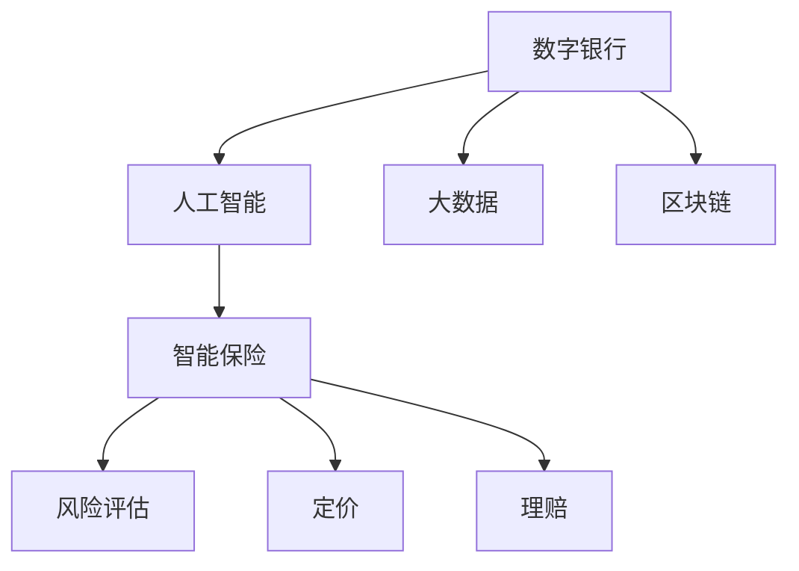

                 

# 未来的智能金融：2050年的数字银行与智能保险

## 1. 背景介绍

### 1.1 问题由来
随着金融科技的迅猛发展，数字银行和智能保险成为了未来的发展趋势。在2050年的金融领域，数字化和智能化将成为主流，技术将在金融服务的各个环节发挥核心作用。本文将探讨未来智能金融的关键技术，包括数字银行和智能保险的发展方向，以及它们在2050年的具体应用。

### 1.2 问题核心关键点
未来智能金融的核心关键点包括以下几个方面：

- **数字银行的崛起**：以云计算、大数据、人工智能等为核心的技术，推动了数字银行的兴起，使得银行能够提供更加便捷、高效、个性化的金融服务。

- **智能保险的发展**：通过大数据、机器学习等技术，智能保险能够实现风险评估、定价、理赔等环节的自动化和智能化，为用户提供更加精准和透明的保险服务。

- **区块链的应用**：作为去中心化的分布式账本技术，区块链将改变金融交易的信任机制，提高交易透明度和安全性。

- **人工智能的深度融合**：在风险管理、客户服务、市场营销等方面，人工智能将发挥重要作用，提升金融服务的质量和效率。

## 2. 核心概念与联系

### 2.1 核心概念概述

为更好地理解未来智能金融的实现，本节将介绍几个密切相关的核心概念：

- **数字银行**：基于互联网技术的银行服务模式，通过电子渠道提供金融服务，包括网上银行、手机银行、自助服务终端等。

- **智能保险**：利用大数据、人工智能等技术，实现风险评估、定价、理赔等环节的智能化，提供更加精准和透明的保险服务。

- **区块链**：一种分布式账本技术，通过去中心化的方式记录交易信息，保障数据的透明和安全。

- **人工智能**：包括机器学习、深度学习、自然语言处理等技术，应用于金融服务的各个环节，提升金融服务的智能化水平。

- **大数据**：包含金融交易数据、客户行为数据、市场数据等，用于分析客户需求、评估风险、优化决策等。

这些核心概念之间的逻辑关系可以通过以下Mermaid流程图来展示：



这个流程图展示了大金融的核心概念及其之间的关系：

1. 数字银行通过互联网技术提供服务。
2. 人工智能和大数据技术提升服务质量和效率。
3. 区块链技术保障交易安全透明。
4. 智能保险通过智能化手段实现风险评估、定价和理赔。

这些概念共同构成了未来智能金融的实现基础，推动金融服务向更加智能化、个性化和高效化发展。

## 3. 核心算法原理 & 具体操作步骤

### 3.1 算法原理概述

未来智能金融的实现离不开算法技术的支持。以下是几个核心算法的原理概述：

- **人工智能算法**：包括机器学习、深度学习等算法，用于客户行为分析、风险评估、智能推荐等。

- **大数据分析算法**：包括数据挖掘、统计分析等算法，用于客户画像构建、市场分析、金融预测等。

- **区块链算法**：包括共识算法、加密算法等，用于确保交易的安全性和可靠性。

- **自然语言处理算法**：用于客户服务、智能客服等场景的文本处理和理解。

这些算法通过综合应用，可以实现金融服务的智能化和自动化，提升金融服务的质量和效率。

### 3.2 算法步骤详解

下面以智能保险中的风险评估为例，详细介绍算法步骤：

1. **数据收集**：收集客户的年龄、健康状况、生活习惯等数据，用于构建风险评估模型。

2. **特征工程**：对收集到的数据进行清洗、特征提取等处理，生成可用于训练模型的特征集合。

3. **模型训练**：使用机器学习算法（如决策树、随机森林、神经网络等）训练风险评估模型。

4. **模型评估**：使用验证集对模型进行评估，调整模型参数以提高预测准确率。

5. **风险定价**：根据风险评估结果，计算保险费用，实现个性化定价。

6. **理赔处理**：在理赔环节，使用自然语言处理和图像识别技术，自动化审核理赔申请，提高理赔效率。

### 3.3 算法优缺点

未来智能金融算法具有以下优点：

- **高效性**：通过自动化和智能化手段，大幅提升金融服务的效率。

- **个性化**：能够根据客户行为和偏好，提供个性化的金融服务。

- **透明性**：利用大数据和区块链技术，确保交易的透明和安全。

- **可扩展性**：能够根据需求，灵活扩展和升级算法模型。

同时，这些算法也存在一些局限性：

- **数据隐私**：在使用大数据和人工智能时，需要确保数据的隐私和安全。

- **模型复杂度**：算法的复杂度和计算资源需求较大，需要高水平的技术支持。

- **算法可解释性**：部分算法的决策过程难以解释，可能影响用户的信任。

- **技术依赖**：依赖于先进的算法和技术，对技术的掌握和应用要求较高。

### 3.4 算法应用领域

未来智能金融的核心算法在多个领域得到了广泛应用，包括但不限于：

- **数字银行**：智能客服、个性化推荐、风险管理、欺诈检测等。

- **智能保险**：风险评估、定价、理赔、客户服务等。

- **供应链金融**：信用评估、风险控制、供应链优化等。

- **金融监管**：反洗钱、合规监测、市场分析等。

## 4. 数学模型和公式 & 详细讲解 & 举例说明

### 4.1 数学模型构建

在智能保险的风险评估中，常用的数学模型包括决策树、随机森林、神经网络等。这里以神经网络为例，介绍数学模型的构建过程。

设输入数据为 $x_1, x_2, ..., x_n$，其中 $n$ 为特征维度，输出为保险费率 $y$。神经网络模型包含输入层、隐藏层和输出层，模型的目标是通过学习输入数据和输出数据之间的映射关系，预测新的输入数据的输出。

### 4.2 公式推导过程

假设神经网络模型包含 $k$ 个隐藏层，每个隐藏层包含 $m$ 个神经元，输出层包含 $l$ 个神经元。设神经元的激活函数为 $f$，则神经网络模型的前向传播过程可以表示为：

$$
y = f^{[l]}(f^{[l-1]}(\ldots f^{[1]}(x) \ldots))
$$

其中 $f^{[l]}$ 表示第 $l$ 层神经元的激活函数。

### 4.3 案例分析与讲解

以智能保险的风险评估为例，假设输入数据为客户的年龄、性别、生活习惯等，输出为保险费率。神经网络模型可以设计为以下结构：

1. **输入层**：将输入数据映射到神经网络中。

2. **隐藏层**：通过多层的线性变换和激活函数，提取特征和建立映射关系。

3. **输出层**：将隐藏层的输出映射为保险费率。

在训练神经网络模型时，通常使用交叉熵损失函数，最小化预测输出与真实输出之间的差异。具体公式如下：

$$
L(y, \hat{y}) = -\sum_{i=1}^n y_i \log \hat{y}_i
$$

其中 $y$ 为真实输出，$\hat{y}$ 为模型预测输出。

## 5. 项目实践：代码实例和详细解释说明

### 5.1 开发环境搭建

在进行智能保险的风险评估开发前，我们需要准备好开发环境。以下是使用Python进行TensorFlow开发的环境配置流程：

1. 安装Anaconda：从官网下载并安装Anaconda，用于创建独立的Python环境。

2. 创建并激活虚拟环境：
```bash
conda create -n tf-env python=3.8 
conda activate tf-env
```

3. 安装TensorFlow：根据CUDA版本，从官网获取对应的安装命令。例如：
```bash
conda install tensorflow -c pytorch -c conda-forge
```

4. 安装各类工具包：
```bash
pip install numpy pandas scikit-learn matplotlib tqdm jupyter notebook ipython
```

完成上述步骤后，即可在`tf-env`环境中开始智能保险的风险评估开发。

### 5.2 源代码详细实现

下面我们以智能保险的风险评估为例，给出使用TensorFlow进行开发的PyTorch代码实现。

首先，定义训练数据和标签：

```python
import tensorflow as tf
from tensorflow.keras.datasets import mnist
from tensorflow.keras.utils import to_categorical

(X_train, y_train), (X_test, y_test) = mnist.load_data()

X_train = X_train.reshape(-1, 784).astype('float32') / 255.0
X_test = X_test.reshape(-1, 784).astype('float32') / 255.0

y_train = to_categorical(y_train)
y_test = to_categorical(y_test)
```

然后，定义神经网络模型：

```python
model = tf.keras.Sequential([
    tf.keras.layers.Dense(128, activation='relu', input_shape=(784,)),
    tf.keras.layers.Dense(64, activation='relu'),
    tf.keras.layers.Dense(10, activation='softmax')
])
```

接着，定义损失函数和优化器：

```python
loss_fn = tf.keras.losses.CategoricalCrossentropy()
optimizer = tf.keras.optimizers.Adam()
```

最后，定义训练过程：

```python
epochs = 10
batch_size = 128

for epoch in range(epochs):
    for i in range(0, len(X_train), batch_size):
        batch_X = X_train[i:i+batch_size]
        batch_y = y_train[i:i+batch_size]
        with tf.GradientTape() as tape:
            logits = model(batch_X)
            loss_value = loss_fn(batch_y, logits)
        grads = tape.gradient(loss_value, model.trainable_variables)
        optimizer.apply_gradients(zip(grads, model.trainable_variables))
```

以上代码实现了使用神经网络对MNIST数据集进行训练的过程。通过调整网络结构、损失函数和优化器，可以实现更加复杂和高效的风险评估模型。

### 5.3 代码解读与分析

让我们再详细解读一下关键代码的实现细节：

- **数据预处理**：将输入数据归一化到0-1之间，使用`to_categorical`函数将标签转换为one-hot编码。

- **模型定义**：使用`tf.keras.Sequential`定义神经网络模型，包含多个全连接层和激活函数。

- **损失函数**：使用交叉熵损失函数，衡量模型预测输出与真实输出之间的差异。

- **优化器**：使用Adam优化器，自适应调整学习率。

- **训练过程**：通过循环迭代，每次选取一批数据进行前向传播和反向传播，更新模型参数。

## 6. 实际应用场景

### 6.1 智能银行

在数字银行的应用中，智能客服、风险管理、欺诈检测等功能将大大提升用户体验和银行的安全性。例如，智能客服可以通过自然语言处理技术，实时解答客户的咨询问题，提供个性化的金融服务。在风险管理方面，利用机器学习算法对客户的行为进行监测和分析，及时发现异常行为并采取措施。在欺诈检测方面，通过深度学习模型对交易数据进行分析和识别，及时发现和阻止欺诈行为。

### 6.2 智能保险

智能保险将通过大数据和人工智能技术，实现风险评估、定价、理赔等环节的智能化。例如，通过收集客户的健康数据、生活习惯等，使用机器学习算法建立风险评估模型，实现个性化定价。在理赔环节，利用图像识别和自然语言处理技术，自动化审核理赔申请，提高理赔效率。同时，智能保险还可以提供实时的风险评估和预警服务，帮助客户更好地管理风险。

### 6.3 供应链金融

供应链金融中的信用评估、风险控制、供应链优化等环节，都可以通过大数据和人工智能技术实现智能化。例如，通过分析供应链各个环节的交易数据，使用机器学习算法评估信用风险，实现更精准的贷款审批。利用深度学习模型对供应链数据进行分析和优化，实现供应链的智能化管理。

### 6.4 未来应用展望

未来智能金融的发展将进一步深化人工智能和大数据的应用，推动金融服务的智能化和个性化。以下是未来智能金融的发展趋势：

- **人工智能和区块链的深度融合**：结合人工智能和区块链技术，实现更高效、安全的金融服务。

- **个性化金融服务的普及**：通过大数据和人工智能技术，实现个性化的金融服务，提升用户体验。

- **智能监管和合规管理**：利用人工智能和大数据技术，实现智能监管和合规管理，提升金融市场的透明度和安全性。

## 7. 工具和资源推荐

### 7.1 学习资源推荐

为了帮助开发者系统掌握智能金融的理论基础和实践技巧，这里推荐一些优质的学习资源：

1. **TensorFlow官方文档**：提供详细的TensorFlow API和示例代码，是学习智能金融算法的必备资源。

2. **深度学习框架比较**：比较TensorFlow、PyTorch、Keras等深度学习框架，帮助选择合适的工具。

3. **人工智能与金融**：介绍人工智能在金融领域的应用，涵盖智能客服、风险管理、智能投顾等内容。

4. **大数据在金融中的应用**：讲解大数据在金融分析、金融监管、金融预测中的应用，提供丰富的案例和代码示例。

5. **智能金融书籍**：如《金融科技：数字货币、区块链与智能合约》、《智能金融：大数据与机器学习在金融领域的应用》等，提供系统性的学习资料。

通过对这些资源的学习实践，相信你一定能够快速掌握智能金融的关键技术，并用于解决实际的金融问题。

### 7.2 开发工具推荐

高效的开发离不开优秀的工具支持。以下是几款用于智能金融开发的常用工具：

1. **TensorFlow**：基于Python的开源深度学习框架，灵活的计算图和分布式训练功能，适合智能金融算法的开发和优化。

2. **PyTorch**：基于Python的开源深度学习框架，动态计算图和高效的GPU加速功能，适合复杂的神经网络模型开发。

3. **Jupyter Notebook**：开源的交互式笔记本环境，支持Python、R、Scala等多种编程语言，便于调试和分享代码。

4. **Anaconda**：开源的Python发行版，提供虚拟环境管理和依赖包管理功能，方便开发和部署。

5. **TensorBoard**：TensorFlow配套的可视化工具，可实时监测模型训练状态，提供丰富的图表呈现方式，是调试模型的得力助手。

6. **Weights & Biases**：模型训练的实验跟踪工具，可以记录和可视化模型训练过程中的各项指标，方便对比和调优。

这些工具为智能金融的开发提供了强大的支持，帮助开发者快速迭代和优化模型。

### 7.3 相关论文推荐

智能金融的研究源于学界的持续研究。以下是几篇奠基性的相关论文，推荐阅读：

1. **《神经网络与深度学习》**：深度学习领域的经典教材，讲解了神经网络的基本原理和应用。

2. **《深度学习在金融领域的应用》**：介绍了深度学习在金融领域的应用，涵盖智能客服、风险管理、智能投顾等内容。

3. **《大数据在金融中的应用》**：讲解了大数据在金融分析、金融监管、金融预测中的应用，提供丰富的案例和代码示例。

4. **《区块链技术在金融中的应用》**：介绍区块链技术在金融领域的应用，涵盖智能合约、去中心化金融等内容。

5. **《智能金融：大数据与机器学习在金融领域的应用》**：系统介绍大数据和机器学习在金融领域的应用，提供实际案例和代码示例。

这些论文代表了大金融领域的研究进展，通过学习这些前沿成果，可以帮助研究者把握学科前进方向，激发更多的创新灵感。

## 8. 总结：未来发展趋势与挑战

### 8.1 总结

本文对未来智能金融的关键技术进行了全面系统的介绍。首先阐述了智能金融的背景和意义，明确了智能银行和智能保险的关键技术。其次，从原理到实践，详细讲解了神经网络、大数据和区块链等核心技术，给出了智能保险的风险评估代码实现。同时，本文还广泛探讨了智能金融在金融服务、供应链金融等领域的应用前景，展示了智能金融的广阔前景。

通过对这些关键技术的掌握，相信你一定能够快速构建智能金融系统，推动金融服务的智能化和个性化。

### 8.2 未来发展趋势

展望未来，智能金融技术将呈现以下几个发展趋势：

1. **人工智能与区块链的深度融合**：结合人工智能和区块链技术，实现更高效、安全的金融服务。

2. **个性化金融服务的普及**：通过大数据和人工智能技术，实现个性化的金融服务，提升用户体验。

3. **智能监管和合规管理**：利用人工智能和大数据技术，实现智能监管和合规管理，提升金融市场的透明度和安全性。

4. **智能金融产品的创新**：利用人工智能和大数据技术，开发新型智能金融产品，如智能投顾、智能合约等。

5. **跨界合作与创新**：跨界融合人工智能、大数据、区块链等技术，推动金融与各行业的深度合作，实现技术创新。

这些趋势凸显了智能金融技术的广阔前景，将推动金融服务向更加智能化、个性化和高效化发展。

### 8.3 面临的挑战

尽管智能金融技术已经取得了瞩目成就，但在迈向更加智能化、普适化应用的过程中，它仍面临着诸多挑战：

1. **数据隐私和安全**：在使用大数据和人工智能时，需要确保数据的隐私和安全。

2. **算法可解释性**：部分算法的决策过程难以解释，可能影响用户的信任。

3. **技术依赖**：依赖于先进的算法和技术，对技术的掌握和应用要求较高。

4. **法律法规**：需要符合金融领域的法律法规，确保算法的合法合规性。

5. **市场接受度**：需要充分市场调研和用户反馈，确保算法的实用性和可靠性。

6. **伦理和道德**：需要考虑算法的伦理和道德问题，确保算法的公正性和公平性。

### 8.4 研究展望

未来研究需要在以下几个方面寻求新的突破：

1. **深度融合人工智能与区块链**：探索如何结合人工智能和区块链技术，实现更高效、安全的金融服务。

2. **提升算法可解释性**：开发更可解释的算法模型，增强用户对金融服务的信任。

3. **优化数据隐私和安全**：探索如何保护用户数据隐私，确保金融交易的安全性。

4. **开发更高效的算法**：开发更高效、更准确的算法模型，提升金融服务的质量和效率。

5. **强化伦理和道德约束**：确保算法的公正性和公平性，避免算法偏见和歧视。

这些研究方向的探索，必将引领智能金融技术迈向更高的台阶，为构建安全、可靠、可解释、可控的智能系统铺平道路。面向未来，智能金融技术还需要与其他人工智能技术进行更深入的融合，如知识表示、因果推理、强化学习等，多路径协同发力，共同推动自然语言理解和智能交互系统的进步。只有勇于创新、敢于突破，才能不断拓展语言模型的边界，让智能技术更好地造福人类社会。

## 9. 附录：常见问题与解答

**Q1：智能金融是否适用于所有金融业务？**

A: 智能金融技术在大多数金融业务上都能取得显著效果，特别是数据量大、计算需求高的业务，如贷款审批、投资分析等。但部分业务如现金交易等，可能还需要依靠传统的业务模式。

**Q2：如何确保智能金融算法的可解释性？**

A: 确保算法可解释性的方法包括：
1. 使用可解释性更高的算法模型，如决策树、线性回归等。
2. 对算法模型进行可视化分析，如特征重要性分析、解释图等。
3. 提供用户友好的界面，展示算法的决策过程。

**Q3：智能金融的应用场景有哪些？**

A: 智能金融的应用场景包括但不限于：
1. 智能客服：利用自然语言处理技术，实时解答客户咨询问题。
2. 风险管理：利用机器学习算法，监测客户行为，及时发现异常。
3. 智能投顾：利用算法模型，提供个性化的投资建议。
4. 智能合约：利用区块链技术，实现智能合约的自动化执行。

**Q4：智能金融的开发难点有哪些？**

A: 智能金融的开发难点包括：
1. 数据质量：需要收集和处理高质量的数据，确保数据的准确性和完整性。
2. 算法模型：需要选择合适的算法模型，并进行充分的模型训练和调优。
3. 技术集成：需要将多种技术和工具进行有机集成，实现功能模块的协同工作。
4. 法规合规：需要符合金融行业的法律法规，确保算法的合法合规性。

**Q5：智能金融的实际应用效果如何？**

A: 智能金融在实际应用中取得了显著的效果，提升了金融服务的效率和质量。例如，智能客服系统可以24小时在线服务，大幅提升了客户满意度。智能投顾系统能够提供个性化的投资建议，提升了投资回报率。智能合约系统实现了自动化的合约执行，降低了交易成本。

---

作者：禅与计算机程序设计艺术 / Zen and the Art of Computer Programming

