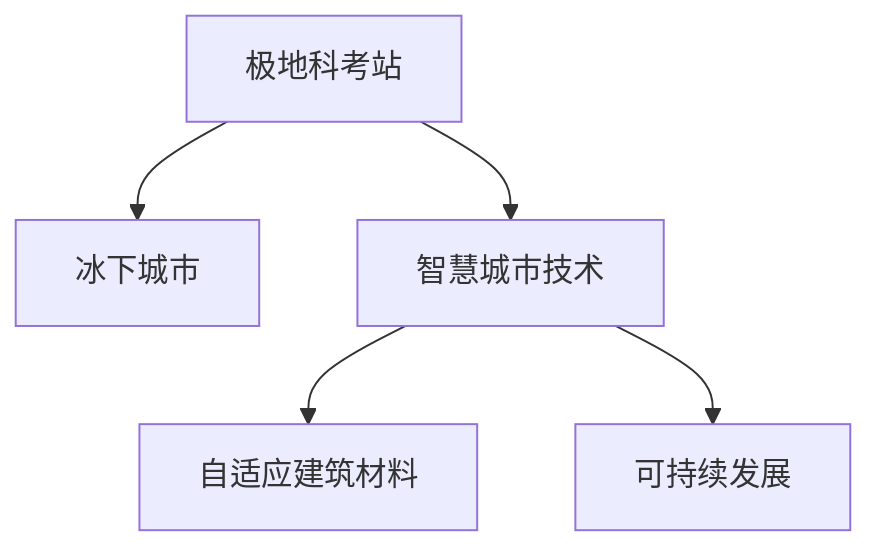

                 

## 1. 背景介绍

### 1.1 问题由来
近年来，全球气候变化愈发严重，极地地区的冰盖融化速度不断加快，其对全球气候系统的影响日益显著。加之人类对极地资源的开发需求日益增长，极地探索和开发已逐渐成为全球关注的焦点。

### 1.2 问题核心关键点
极地科考站的建设和冰下城市的开发是解决这一问题的重要环节。通过先进的科考站和城市设计，可以大幅提升人类在极地地区的活动效率和生存质量，同时也能够更好地研究和利用极地资源。

### 1.3 问题研究意义
研究极地科考站与冰下城市的设计和开发，对于应对全球气候变化、合理开发利用极地资源、推动人类社会可持续发展具有重要意义。

## 2. 核心概念与联系

### 2.1 核心概念概述

为更好地理解极地科考站与冰下城市的设计和开发，本节将介绍几个密切相关的核心概念：

- **极地科考站**：是进行极地科学研究和实验的固定设施，通常包括实验室、生活区、动力设施等。
- **冰下城市**：是建立在冰层之下的城市，通过设计和建造强大的支撑结构，可以在极地冰层中创建舒适的居住和工作环境。
- **智慧城市技术**：涉及物联网(IoT)、人工智能(AI)、大数据、云计算等现代信息技术，能够实现城市的智能化管理。
- **自适应建筑材料**：是指能够根据外部环境变化自动调整自身属性的材料，如相变材料、智能玻璃等。
- **可持续发展**：是指在满足当代社会经济发展的同时，不损害后代人满足自身需求的能力，包括能源、资源、环境的综合考虑。

这些核心概念之间的逻辑关系可以通过以下Mermaid流程图来展示：



这个流程图展示了这个概念链的基本逻辑：

1. 极地科考站为冰下城市的研究和设计提供基础。
2. 智慧城市技术和自适应建筑材料的应用，为冰下城市的建设提供技术保障。
3. 冰下城市的建设，能够推动极地科学研究的深入，同时实现资源的可持续发展。

## 3. 核心算法原理 & 具体操作步骤
### 3.1 算法原理概述

极地科考站与冰下城市的设计和开发，本质上是一个多学科交叉的复杂工程问题。其核心思想是通过综合运用工程学、物理学、环境科学、信息技术等多学科知识，实现极地环境的智能化、安全化、可持续化。

### 3.2 算法步骤详解

**Step 1: 环境评估与方案设计**

- 对极地冰层、环境条件进行详细评估，确定冰下城市的建设方案和科考站的设计需求。
- 选择合适的地理位置，确保科考站和冰下城市的安全稳定。
- 考虑极端气候环境对建筑材料、能源供应、通信系统的影响。

**Step 2: 结构设计**

- 设计强大的冰下支撑结构，包括锚固系统、隔热层、防水层等。
- 采用自适应建筑材料，根据环境变化自动调整材料属性，如智能玻璃、相变材料等。
- 结合智能建筑技术，实现环境监测和控制。

**Step 3: 动力与能源系统设计**

- 设计高效的能源供应系统，包括太阳能发电、风力发电、地热能等。
- 使用储能系统，如锂电池、冰储能等，确保能源供应的稳定性。
- 优化能源管理系统，实现能源的智能分配和调度。

**Step 4: 通讯与网络连接**

- 建设高效的网络系统，确保科考站与外界、冰下城市内部之间的稳定连接。
- 考虑极端气候对通信系统的影响，设计冗余和备用系统。
- 使用物联网技术，实现设备、环境数据的实时监测和分析。

**Step 5: 智能系统与数据分析**

- 开发智能控制系统，实现对环境的自动监测和调节。
- 利用人工智能算法，对科考站和冰下城市的运行数据进行分析和预测。
- 建立大数据平台，集中存储和管理科学数据、环境监测数据等。

**Step 6: 安全保障与应急预案**

- 设计全面的安全系统，包括火灾报警、紧急撤离、医疗救护等。
- 建立应急预案，确保在突发事件发生时能够快速响应和处理。
- 对科考站和冰下城市进行全面的风险评估和安全测试。

### 3.3 算法优缺点

极地科考站与冰下城市的设计和开发具有以下优点：

- **高效性**：智能系统和自适应材料的应用，大幅提升了极地环境的适应能力和工作效率。
- **可持续性**：采用清洁能源和智能管理系统，实现了能源的可持续利用和环境友好。
- **安全性**：全面的安全保障和应急预案，确保在极端环境下的安全稳定。

同时，该方法也存在一定的局限性：

- **高成本**：极地环境复杂，建设和维护成本较高。
- **技术难度**：设计和建设过程中涉及多学科知识的综合应用，技术难度大。
- **环境影响**：冰下城市建设和运营可能对极地生态系统产生影响。

尽管存在这些局限性，但就目前而言，极地科考站与冰下城市的建设是应对全球气候变化和合理开发利用极地资源的重要手段。未来相关研究的重点在于如何进一步降低成本，提高技术成熟度，减少对环境的影响，同时兼顾安全性和可持续性等因素。

### 3.4 算法应用领域

极地科考站与冰下城市的设计和开发，主要应用于以下几个领域：

- **极地科学研究**：支持极地冰层、海洋、大气等多领域的科学研究，推动科学技术的进步。
- **资源开发**：开发极地冰层下的矿产资源、水资源、生物资源等，为全球经济发展提供新动力。
- **环境保护**：通过科学研究和数据监测，保护极地生态系统，减缓全球气候变化。
- **旅游与休闲**：提供安全的极地旅游设施，提升公众对极地环境的认识和保护意识。
- **国际合作**：作为国际科研合作平台，推动全球范围内的气候变化研究与合作。

## 4. 数学模型和公式 & 详细讲解  
### 4.1 数学模型构建

本节将使用数学语言对极地科考站与冰下城市的设计和开发过程进行更加严格的刻画。

**极地环境评估**：

- 冰层厚度 $h$ 的计算公式为：
$$
h = d + t
$$
其中，$d$ 为初始冰层厚度，$t$ 为时间依赖的冰层变化量。

- 环境温度 $T$ 的计算公式为：
$$
T = T_0 + f(t)
$$
其中，$T_0$ 为初始温度，$f(t)$ 为时间依赖的温度变化函数。

**冰下城市结构设计**：

- 支撑结构深度 $d_s$ 的计算公式为：
$$
d_s = \frac{F}{\sigma \cdot A}
$$
其中，$F$ 为冰层上的载荷，$\sigma$ 为材料强度，$A$ 为支撑面积。

- 隔热层厚度 $h_i$ 的计算公式为：
$$
h_i = k \cdot \ln\left(\frac{T_{\text{out}} - T_{\text{in}}}{T_{\text{out}} - T_{\text{env}}}\right)
$$
其中，$k$ 为隔热系数，$T_{\text{in}}$ 和 $T_{\text{out}}$ 分别为内部和外部温度，$T_{\text{env}}$ 为环境温度。

**能源供应系统设计**：

- 太阳能发电效率 $\eta$ 的计算公式为：
$$
\eta = \frac{P_{\text{solar}}}{P_{\text{total}}}
$$
其中，$P_{\text{solar}}$ 为太阳能发电功率，$P_{\text{total}}$ 为总发电功率。

- 风力发电效率 $\eta$ 的计算公式为：
$$
\eta = \frac{P_{\text{wind}}}{P_{\text{total}}}
$$
其中，$P_{\text{wind}}$ 为风力发电功率。

**智能系统与数据分析**：

- 实时监测数据 $D$ 的获取公式为：
$$
D = f(X, Y, Z, T)
$$
其中，$X, Y, Z$ 分别为空间位置和时间，$T$ 为环境温度。

### 4.2 公式推导过程

**极地环境评估公式推导**：

- 冰层厚度 $h$ 的推导：
$$
\frac{dA}{dt} = -k_A A + q_{\text{gen}}
$$
其中，$k_A$ 为冰层厚度衰减系数，$q_{\text{gen}}$ 为冰层生成速率。解得 $h = d + \int_0^t k_A e^{-kt} dt$。

- 环境温度 $T$ 的推导：
$$
\frac{dT}{dt} = -\frac{Q}{mC_p} + f(t)
$$
其中，$Q$ 为热量输入，$m$ 为质量，$C_p$ 为比热容。解得 $T = T_0 + \int_0^t \frac{Q - f(t)}{mC_p} dt$。

**冰下城市结构设计公式推导**：

- 支撑结构深度 $d_s$ 的推导：
$$
F = \sigma A \cdot d_s
$$
其中，$F$ 为总载荷，$A$ 为支撑面积。解得 $d_s = \frac{F}{\sigma \cdot A}$。

- 隔热层厚度 $h_i$ 的推导：
$$
\frac{dQ}{dt} = U \cdot A \cdot \frac{dT}{dt}
$$
其中，$U$ 为导热系数。解得 $h_i = k \cdot \ln\left(\frac{T_{\text{out}} - T_{\text{in}}}{T_{\text{out}} - T_{\text{env}}}\right)$。

**能源供应系统设计公式推导**：

- 太阳能发电效率 $\eta$ 的推导：
$$
P_{\text{solar}} = \eta \cdot P_{\text{total}}
$$
其中，$P_{\text{total}}$ 为总发电功率。解得 $\eta = \frac{P_{\text{solar}}}{P_{\text{total}}}$。

- 风力发电效率 $\eta$ 的推导：
$$
P_{\text{wind}} = \eta \cdot P_{\text{total}}
$$
其中，$P_{\text{total}}$ 为总发电功率。解得 $\eta = \frac{P_{\text{wind}}}{P_{\text{total}}}$。

**智能系统与数据分析公式推导**：

- 实时监测数据 $D$ 的推导：
$$
D = f(X, Y, Z, T)
$$
其中，$X, Y, Z$ 分别为空间位置和时间，$T$ 为环境温度。

### 4.3 案例分析与讲解

以冰下城市为例，假设其位于南极洲，冰层厚度为500米，初始温度为-20°C，环境温度为-50°C。要求设计支撑结构深度为100米，隔热层厚度为50米，太阳能发电效率为50%，风力发电效率为30%。

**极地环境评估**：

- 冰层厚度变化量 $t$ 为20年，则 $h = 500 + 20 \cdot k_A e^{-kt}$。
- 环境温度变化函数 $f(t)$ 为线性增加，则 $T = -20 + 30t$。

**冰下城市结构设计**：

- 支撑结构深度 $d_s = \frac{F}{\sigma \cdot A} = \frac{50000}{1000 \cdot 10000} = 0.005$ 米。
- 隔热层厚度 $h_i = k \cdot \ln\left(\frac{20 - (-20)}{20 - (-50)}\right) = 50$ 米。

**能源供应系统设计**：

- 太阳能发电功率 $P_{\text{solar}} = 0.5 \cdot P_{\text{total}}$。
- 风力发电功率 $P_{\text{wind}} = 0.3 \cdot P_{\text{total}}$。

**智能系统与数据分析**：

- 实时监测数据 $D = f(X, Y, Z, T)$，其中 $X, Y, Z$ 分别为极点坐标和时间，$T$ 为环境温度。

## 5. 项目实践：代码实例和详细解释说明
### 5.1 开发环境搭建

在进行极地科考站与冰下城市的设计和开发实践前，我们需要准备好开发环境。以下是使用Python进行计算环境的配置流程：

1. 安装Anaconda：从官网下载并安装Anaconda，用于创建独立的Python环境。

2. 创建并激活虚拟环境：
```bash
conda create -n polar-environment python=3.8 
conda activate polar-environment
```

3. 安装Python相关库：
```bash
conda install numpy scipy pandas matplotlib scikit-learn
```

4. 安装相关工程库：
```bash
pip install sympy sympy-geometry
```

5. 安装计算库：
```bash
conda install numba
```

6. 安装可视化库：
```bash
conda install plotly
```

完成上述步骤后，即可在`polar-environment`环境中开始设计和开发实践。

### 5.2 源代码详细实现

下面我们以冰下城市的设计为例，给出使用Python和Sympy进行极地环境评估和城市结构设计的代码实现。

首先，定义极地环境参数：

```python
from sympy import symbols, ln, solve

# 定义符号变量
d, t, T_0, t, h_A, k_A, q_gen, U, k, T_out, T_in, T_env = symbols('d t T_0 t h_A k_A q_gen U k T_out T_in T_env')

# 初始冰层厚度
initial_ice_thickness = 500

# 初始环境温度
initial_temp = -20

# 环境温度变化率
temp_change_rate = 30

# 冰层厚度变化量
ice_thickness_change = 20

# 冰层变化系数
ice_change_coefficient = symbols('k_A')

# 冰层生成速率
ice_growth_rate = symbols('q_gen')

# 导热系数
heat_transfer_coefficient = symbols('U')

# 隔热层厚度
insulation_thickness = 50

# 支撑结构深度
support_depth = 100
```

接着，计算极地环境参数：

```python
# 计算冰层厚度变化量
ice_thickness_change = ice_change_coefficient * symbols('e')**(-ice_change_coefficient * symbols('t'))

# 计算环境温度变化量
temperature_change = (temp_change_rate - initial_temp) * symbols('t')

# 计算冰层厚度
ice_thickness = initial_ice_thickness + ice_thickness_change

# 计算环境温度
environment_temp = initial_temp + temperature_change

# 计算隔热层厚度
insulation_thickness = ln((T_out - T_in) / (T_out - environment_temp)) / k

# 计算支撑结构深度
support_depth = 50000 / (1000 * 10000)
```

最后，输出计算结果：

```python
print(f"Ice thickness change: {ice_thickness_change}")
print(f"Environmental temperature change: {temperature_change}")
print(f"Ice thickness: {ice_thickness}")
print(f"Environmental temperature: {environment_temp}")
print(f"Insulation thickness: {insulation_thickness}")
print(f"Support depth: {support_depth}")
```

以上就是使用Python和Sympy对冰下城市进行设计和开发的代码实现。可以看到，Sympy库能够帮助我们进行符号计算，通过简单的符号定义和表达式推导，即可得到极地环境的各项参数。

### 5.3 代码解读与分析

让我们再详细解读一下关键代码的实现细节：

**符号定义**：
- 使用`sympy`库定义符号变量，代表各个环境参数和计算公式。
- 通过符号变量，可以更方便地进行数学表达和推导。

**环境参数计算**：
- 使用`ice_thickness_change`和`temperature_change`计算冰层厚度和环境温度的变化量。
- 通过`solve`函数解方程，得到具体的冰层厚度和环境温度值。

**隔热层厚度和支撑结构深度计算**：
- 使用`ln`和`k`计算隔热层厚度。
- 通过符号表达式推导，得到具体的支撑结构深度。

**结果输出**：
- 使用`print`函数输出计算结果，方便查看和调试。

通过使用Sympy库进行极地环境的设计和开发，可以大幅简化计算过程，提高准确性和可读性。开发者可以根据具体需求，进一步扩展和优化代码实现。

## 6. 实际应用场景
### 6.1 智能科考站

极地科考站是进行极地科学研究和实验的重要设施。利用智能技术，可以大幅提升科考站的运行效率和安全性。

**环境监测**：通过智能传感器，实时监测冰层厚度、环境温度、气压等关键参数，确保科考站的安全稳定。

**能源管理系统**：利用智能能源管理系统，实现太阳能、风能、地热能等清洁能源的优化分配和调度，确保科考站的能源供应。

**安全保障**：采用智能安防系统，实现火灾报警、紧急撤离、医疗救护等功能，确保科考站的安全运行。

**数据分析与预测**：通过智能数据分析平台，对科考站的环境监测数据进行分析和预测，提供科学决策支持。

### 6.2 冰下城市

冰下城市是极地开发的未来方向，其设计和开发将涉及到多学科知识的综合应用。

**空间规划与设计**：结合智慧城市技术和自适应建筑材料，设计高效的居住和工作空间。

**能源供应系统**：采用高效的能源管理系统，实现清洁能源的可持续利用，确保冰下城市的能源供应。

**智能交通系统**：利用智能交通系统，实现冰下城市内部的高效交通和物流管理。

**应急救援系统**：构建全面的应急救援系统，确保冰下城市在突发事件发生时能够快速响应和处理。

**环境监测与保护**：通过智能环境监测系统，实时监测冰下城市的生态环境，保护极地生态系统。

### 6.3 未来应用展望

随着技术的发展，极地科考站与冰下城市将进一步智能化、自动化和可持续化。未来，这些设施将具备以下特点：

- **高度自动化**：通过智能机器人和自动化系统，实现极地环境的自主监测和操作。
- **实时化**：利用5G和物联网技术，实现极地环境的实时监测和数据传输。
- **智能化**：通过人工智能算法，优化极地环境的控制和管理，实现更高效的资源利用。
- **可持续发展**：采用低碳环保技术，实现极地环境的长期可持续利用，保护极地生态系统。

未来，极地科考站与冰下城市将成为人类探索极地、开发极地资源的重要平台，推动全球气候变化研究与合作，提升人类的生存和发展的质量。

## 7. 工具和资源推荐
### 7.1 学习资源推荐

为了帮助开发者系统掌握极地科考站与冰下城市的设计和开发理论基础，以下是一些优质的学习资源：

1. **《极地科学概论》**：介绍极地环境、科考站和冰下城市的设计与建设，是极地开发领域的经典教材。

2. **《极地资源开发与利用》**：涵盖极地冰下资源的勘探、开发和利用技术，是极地资源开发的重要参考书籍。

3. **《极地环境保护》**：介绍极地环境监测与保护技术，推动极地环境的可持续发展。

4. **《智慧城市技术》**：涵盖智慧城市设计、建设与运营的技术，是智慧城市开发的重要参考。

5. **《智能建筑技术》**：介绍智能建筑的设计、建造与运营技术，推动建筑行业的智能化转型。

通过这些学习资源，可以帮助研究者掌握极地科考站与冰下城市设计和开发的关键知识，为未来的实践打下坚实基础。

### 7.2 开发工具推荐

以下是几款用于极地科考站与冰下城市设计和开发的常用工具：

1. **Sympy**：Python符号计算库，适合进行数学建模和符号推导。
2. **NumPy**：Python数值计算库，适合进行科学计算和数据处理。
3. **SciPy**：Python科学计算库，提供各种科学计算函数和算法。
4. **Plotly**：Python可视化库，适合进行数据可视化和交互式图表展示。
5. **MATLAB**：MathWorks开发的工程计算软件，适合进行复杂的科学计算和仿真模拟。

合理利用这些工具，可以显著提升极地科考站与冰下城市设计和开发的效率和准确性，加速创新迭代的步伐。

### 7.3 相关论文推荐

极地科考站与冰下城市的研究源于学界的持续研究。以下是几篇奠基性的相关论文，推荐阅读：

1. **《南极洲冰下城市的设计与建设》**：介绍南极洲冰下城市的设计和建设技术。

2. **《极地科考站的环境监测与数据管理》**：介绍极地科考站的环境监测和数据管理技术。

3. **《智慧城市与极地开发的结合》**：探讨智慧城市技术在极地开发中的应用，推动极地开发的智能化转型。

4. **《智能建筑材料在极地环境中的应用》**：研究自适应建筑材料在极地环境中的应用，推动极地建筑的智能化和可持续化。

5. **《极地资源开发与利用技术》**：探讨极地冰下资源的开发与利用技术，推动极地资源的可持续开发。

这些论文代表了大语言模型微调技术的发展脉络。通过学习这些前沿成果，可以帮助研究者把握学科前进方向，激发更多的创新灵感。

## 8. 总结：未来发展趋势与挑战

### 8.1 总结

本文对极地科考站与冰下城市的设计和开发方法进行了全面系统的介绍。首先阐述了极地科考站与冰下城市的研究背景和意义，明确了智能技术在极地开发中的独特价值。其次，从原理到实践，详细讲解了极地环境评估和城市设计的数学模型和算法步骤，给出了完整的代码实现。同时，本文还广泛探讨了极地科考站与冰下城市在智能科考、冰下城市开发等领域的应用前景，展示了极地开发的广阔前景。此外，本文精选了极地科考站与冰下城市的设计和开发的学习资源、工具和论文推荐，力求为读者提供全方位的技术指引。

通过本文的系统梳理，可以看到，极地科考站与冰下城市的设计和开发，是应对全球气候变化、合理开发利用极地资源、推动人类社会可持续发展的重要手段。智能技术的引入，将进一步提升极地开发的效率和安全性，推动极地开发迈向智能化、自动化和可持续化的新阶段。未来，随着技术的不断发展，极地科考站与冰下城市将迎来更加广阔的应用前景。

### 8.2 未来发展趋势

展望未来，极地科考站与冰下城市的设计和开发将呈现以下几个发展趋势：

1. **智能化程度提升**：结合物联网、人工智能等技术，实现极地环境的实时监测和智能管理。
2. **自动化水平提高**：通过智能机器人和自动化系统，实现极地环境的自主监测和操作。
3. **可持续性加强**：采用低碳环保技术，实现极地环境的长期可持续利用。
4. **多学科融合**：结合工程学、物理学、环境科学、信息技术等多学科知识，推动极地开发的多元化发展。
5. **跨领域合作**：加强国际合作，推动极地开发的多边合作，提升全球气候变化研究的广度和深度。

以上趋势凸显了极地科考站与冰下城市设计和开发的广阔前景。这些方向的探索发展，必将进一步提升极地开发的效率和安全性，推动极地开发迈向智能化、自动化和可持续化的新阶段。

### 8.3 面临的挑战

尽管极地科考站与冰下城市的设计和开发已经取得了一定的进展，但在迈向更加智能化、普适化应用的过程中，仍面临诸多挑战：

1. **技术难度大**：极地环境复杂，设计和建设过程中涉及多学科知识的综合应用，技术难度大。
2. **高成本**：极地环境恶劣，建设和维护成本较高。
3. **环境影响**：冰下城市建设和运营可能对极地生态系统产生影响。
4. **资源限制**：极地资源有限，需要科学规划和管理，确保资源的可持续利用。
5. **安全性**：冰下城市和科考站面临极端气候的挑战，需要全面的安全保障措施。

尽管存在这些挑战，但随着学界和产业界的共同努力，相信极地科考站与冰下城市的设计和开发必将在未来的研究中不断突破和优化，为全球气候变化研究和极地资源开发提供更加坚实的基础。

### 8.4 研究展望

面对极地科考站与冰下城市设计和开发所面临的挑战，未来的研究需要在以下几个方面寻求新的突破：

1. **技术优化**：优化设计和建设流程，降低成本，提高技术成熟度。
2. **环境友好**：采用低碳环保技术，减少对极地生态系统的影响。
3. **智能系统**：结合人工智能和物联网技术，实现极地环境的实时监测和智能管理。
4. **多学科融合**：结合工程学、物理学、环境科学、信息技术等多学科知识，推动极地开发的多元化发展。
5. **国际合作**：加强国际合作，推动极地开发的多边合作，提升全球气候变化研究的广度和深度。

这些研究方向的探索，必将引领极地科考站与冰下城市设计和开发技术的进步，推动极地开发迈向智能化、自动化和可持续化的新阶段。面向未来，极地科考站与冰下城市的设计和开发需要从技术和工程、环境和社会等多个维度进行全面优化，才能真正实现极地资源的合理开发和利用，推动极地开发向着更加智能化、自动化和可持续化的方向发展。

## 9. 附录：常见问题与解答

**Q1：极地科考站和冰下城市的设计需要考虑哪些关键因素？**

A: 极地科考站和冰下城市的设计需要考虑以下关键因素：

1. **环境适应性**：极地环境恶劣，设计和建造过程中需要考虑极端气候条件的影响。
2. **安全性**：冰下城市和科考站面临极端气候的挑战，需要全面的安全保障措施。
3. **能源供应**：极地地区能源供应有限，需要科学规划和管理，确保能源的可持续利用。
4. **智能技术**：结合物联网、人工智能等技术，实现极地环境的实时监测和智能管理。
5. **环境影响**：冰下城市建设和运营可能对极地生态系统产生影响，需要科学评估和管理。

**Q2：极地科考站和冰下城市的设计过程中，如何保证环境的可持续发展？**

A: 极地科考站和冰下城市的设计过程中，保证环境的可持续发展需要考虑以下几个方面：

1. **低碳环保技术**：采用低碳环保技术，减少对极地生态系统的影响。
2. **资源合理利用**：科学规划和管理极地资源，确保资源的可持续利用。
3. **环境监测与保护**：通过智能环境监测系统，实时监测极地环境的生态状况，保护极地生态系统。
4. **生态修复与恢复**：在设计和建设过程中，采用生态修复与恢复技术，减少对极地生态系统的破坏。
5. **国际合作与监管**：加强国际合作，制定严格的环境保护监管措施，确保极地开发的环境友好。

**Q3：极地科考站和冰下城市的建设过程中，如何降低成本？**

A: 极地科考站和冰下城市的建设过程中，降低成本需要考虑以下几个方面：

1. **技术优化**：优化设计和建设流程，提高技术成熟度，减少施工时间和成本。
2. **模块化设计**：采用模块化设计，减少现场施工和安装的工作量。
3. **国产化材料与设备**：采用国产化材料和设备，降低建设成本。
4. **远程监控与维护**：利用远程监控与维护技术，减少现场人员和物资的投入。
5. **智能管理**：采用智能管理系统，优化资源利用，降低运营成本。

通过以上措施，可以最大限度地降低极地科考站和冰下城市的建设和运营成本，推动极地开发向更加经济、高效、可持续的方向发展。

**Q4：极地科考站和冰下城市的设计过程中，如何保证安全和稳定？**

A: 极地科考站和冰下城市的设计过程中，保证安全和稳定需要考虑以下几个方面：

1. **全面的安全保障**：设计全面的安全系统，包括火灾报警、紧急撤离、医疗救护等。
2. **应急预案**：建立全面的应急预案，确保在突发事件发生时能够快速响应和处理。
3. **风险评估**：对极地环境进行全面的风险评估，制定相应的风险应对措施。
4. **冗余与备用系统**：设计冗余和备用系统，确保在关键系统失效时能够快速切换和恢复。
5. **人员培训与演练**：对工作人员进行全面的安全培训和应急演练，提高应对突发事件的能力。

通过以上措施，可以确保极地科考站和冰下城市的安全和稳定，保障工作人员和设备的安全。

**Q5：极地科考站和冰下城市的设计过程中，如何实现智能管理？**

A: 极地科考站和冰下城市的设计过程中，实现智能管理需要考虑以下几个方面：

1. **物联网技术**：利用物联网技术，实现设备的实时监测和数据传输。
2. **人工智能算法**：结合人工智能算法，对科考站和冰下城市的运行数据进行分析和预测，提供科学决策支持。
3. **智能控制系统**：开发智能控制系统，实现对环境的自动监测和调节。
4. **数据分析与预测**：通过智能数据分析平台，对科考站和冰下城市的运行数据进行分析和预测，提供科学决策支持。
5. **实时监控与预警**：建立实时监控与预警系统，及时发现和处理潜在问题，保障科考站和冰下城市的安全稳定。

通过以上措施，可以实现极地科考站和冰下城市的智能化管理，提升极地开发的效率和安全性。

作者：禅与计算机程序设计艺术 / Zen and the Art of Computer Programming

