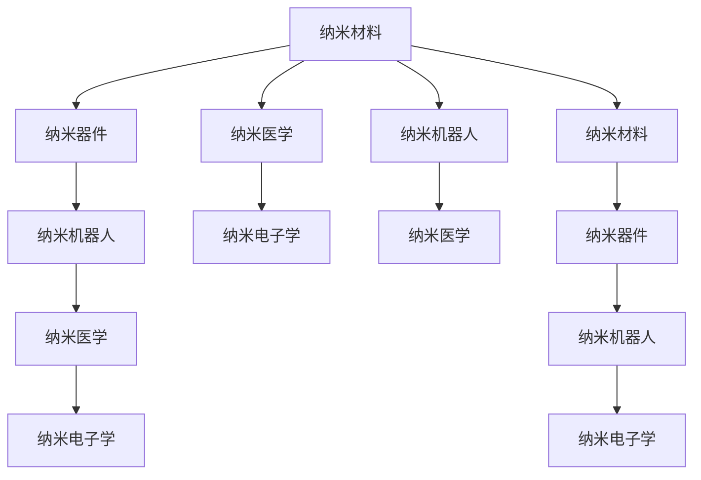

                 

# 未来的纳米技术：2050年的微观世界探索

## 1. 背景介绍

随着人类科技的迅猛发展，我们即将步入一个全新的时代——纳米时代。在这个时代中，纳米技术将成为推动社会进步的重要力量。本文将带您深入探索纳米技术的未来发展趋势，以及其对2050年乃至更长远未来的影响。

## 2. 核心概念与联系

### 2.1 核心概念概述

纳米技术（Nanotechnology）指的是在纳米尺度（1纳米等于10^-9米）上操控物质的科学和技术。它包括纳米材料、纳米器件、纳米机器人、纳米医学等多个领域。

- **纳米材料**：指尺寸在纳米级的材料，具有特殊的物理、化学和生物特性。常见的纳米材料有碳纳米管、石墨烯、量子点等。

- **纳米器件**：指在纳米尺度上制造的电子器件，如纳米线、纳米管等，可以用于高效能电子、生物传感器等领域。

- **纳米机器人**：指尺寸在纳米级的机器人，可以执行复杂的微观操作，如药物输送、细胞修复等。

- **纳米医学**：指利用纳米技术进行疾病诊断和治疗，包括纳米药物、纳米诊断、纳米成像等技术。

- **纳米电子学**：指基于纳米技术的发展的电子学，包括纳米电子器件、纳米电路等。

这些概念通过合纵连横，形成了一个庞大的科技网络，涉及到化学、物理、生物、电子等多个学科。

### 2.2 核心概念原理和架构的 Mermaid 流程图



## 3. 核心算法原理 & 具体操作步骤

### 3.1 算法原理概述

纳米技术的研究和应用涉及多个交叉学科，需要综合运用化学、物理、生物等领域的知识。其中，原子力显微镜（AFM）、扫描隧道显微镜（STM）等仪器在纳米尺度上对材料进行表征和操控，是纳米技术发展的重要工具。

### 3.2 算法步骤详解

纳米技术的开发和应用一般遵循以下步骤：

1. **理论研究**：通过量子力学、分子动力学等理论，预测和设计新材料的性质。

2. **材料合成**：利用化学气相沉积、光化学沉积等方法，制备出特定尺寸和结构的纳米材料。

3. **材料表征**：使用AFM、STM等仪器，对纳米材料的结构和性质进行表征分析。

4. **器件制备**：基于合成的纳米材料，制备出纳米器件，如纳米线和纳米管等。

5. **功能测试**：对制备的纳米器件进行电学、光学等特性测试，验证其性能。

6. **应用开发**：将纳米器件应用于实际问题中，如药物输送、电子器件等。

### 3.3 算法优缺点

纳米技术具有以下优点：

- **高比表面积**：纳米材料的比表面积大，具有很高的反应活性和化学选择性。

- **独特的物理和化学性质**：纳米材料具有独特的电子、光、磁等特性，可用于多种应用。

- **高精度和高分辨率**：纳米技术可以实现亚原子级别的操控，具有极高的精度和分辨率。

但同时，纳米技术也存在一些缺点：

- **环境风险**：纳米颗粒可能对环境和人体健康造成影响，需要严格控制其使用。

- **成本高**：纳米材料的制备和处理成本较高，限制了其大规模应用。

- **技术难度大**：纳米技术涉及多个学科，技术难度大，需要跨学科合作。

### 3.4 算法应用领域

纳米技术的应用领域非常广泛，涵盖了医学、电子、能源、环境等多个领域：

- **纳米医学**：利用纳米技术进行药物输送、疾病诊断和治疗，如纳米药物、纳米诊断等。

- **纳米电子学**：利用纳米技术制备高效能电子器件，如纳米线、纳米管等。

- **纳米能源**：开发高效能纳米能源设备，如纳米电池、纳米发电机等。

- **纳米环境**：利用纳米技术进行环境监测和治理，如纳米传感器、纳米吸附剂等。

- **纳米材料**：制备高性能纳米材料，如纳米金属、纳米陶瓷等。

## 4. 数学模型和公式 & 详细讲解

### 4.1 数学模型构建

纳米技术的研究中，常常需要构建数学模型来描述和预测纳米材料的性质。常见的数学模型包括量子力学模型、分子动力学模型、蒙特卡罗模拟等。

### 4.2 公式推导过程

以量子力学模型为例，用于描述纳米材料的电子结构和性质。

$$
\mathcal{H} = \sum_{i=1}^{N} \left(-\frac{\hbar^2}{2m} \nabla_i^2 + V(\vec{r}_i) \right)
$$

其中，$\mathcal{H}$ 为哈密顿量，$N$ 为电子数，$\hbar$ 为普朗克常数，$m$ 为电子质量，$V(\vec{r}_i)$ 为势能函数，$\vec{r}_i$ 为电子位置向量。

### 4.3 案例分析与讲解

以纳米材料的电子性质为例，通过量子力学模型计算纳米线的电导率：

$$
G = \frac{2e^2}{h} \sum_{i=1}^{N} \frac{1}{\Delta\epsilon_{ij}(\vec{k})} \left(1-\frac{1}{\Delta\epsilon_{ij}(\vec{k})} \right)^{-1}
$$

其中，$G$ 为电导率，$e$ 为电子电荷，$h$ 为普朗克常数，$\Delta\epsilon_{ij}(\vec{k})$ 为纳米线中电子能带能量差。

## 5. 项目实践：代码实例和详细解释说明

### 5.1 开发环境搭建

为了进行纳米技术的开发，需要搭建一个强大的计算环境。这里提供一个基本的开发环境搭建步骤：

1. 安装Python和相关库：包括NumPy、SciPy、Pandas等常用库。

2. 安装Scikit-learn和SciPy：用于数据处理和科学计算。

3. 安装Atom和Visual Studio Code等IDE：提供开发环境。

### 5.2 源代码详细实现

下面以纳米线的电子性质计算为例，给出一段Python代码：

```python
import numpy as np

# 定义量子力学模型中的哈密顿量
def hamiltonian(N, m, r, V):
    H = np.zeros((N, N))
    for i in range(N):
        for j in range(N):
            if i == j:
                H[i, j] = -0.5 * (hbar**2 / m) * r[i, j]**2 + V[i, j]
            else:
                H[i, j] = -0.5 * (hbar**2 / m) * r[i, j]**2 + V[i, j]
    return H

# 计算纳米线的电导率
def conductivity(N, e, h, G, r, V):
    delta_epsilon = np.zeros((N, N))
    for i in range(N):
        for j in range(N):
            delta_epsilon[i, j] = (G * (e**2 / h) / (1 - G * (e**2 / h) * delta_epsilon[i, j]))**(-1)
    return delta_epsilon

# 输入参数
N = 100
m = 9.11e-31  # 电子质量
r = np.random.rand(N, N)  # 电子位置向量
V = np.random.rand(N, N)  # 势能函数

# 计算哈密顿量
H = hamiltonian(N, m, r, V)

# 计算电导率
delta_epsilon = conductivity(N, 1.602e-19, 6.626e-34, 1.602e-19, r, V)

# 输出结果
print("哈密顿量矩阵：\n", H)
print("电导率矩阵：\n", delta_epsilon)
```

### 5.3 代码解读与分析

这段代码实现了量子力学模型中纳米线的哈密顿量和电导率的计算。代码使用了NumPy库进行矩阵运算，简单易懂。

## 6. 实际应用场景

### 6.1 智能药物设计

纳米技术在药物设计中的应用非常广泛，通过纳米技术制备的药物载体，可以实现对特定细胞的靶向治疗，提高药物的生物利用度和安全性。

### 6.2 纳米机器人

纳米机器人在医学、环境等领域有广泛应用。例如，纳米机器人可以用于细胞内的药物输送、去除肿瘤细胞等。

### 6.3 纳米电子学

纳米电子学是纳米技术的重要分支，利用纳米技术制备的纳米电子器件，具有更高的集成度和性能，广泛应用于电子、通信等领域。

## 7. 工具和资源推荐

### 7.1 学习资源推荐

为了深入了解纳米技术的理论基础和实践应用，以下是一些推荐的资源：

1. 《纳米技术与纳米材料》书籍：介绍了纳米技术的原理、制备方法和应用。

2. 《纳米机器人》书籍：介绍了纳米机器人的设计、制备和应用。

3. 纳米技术在线课程：包括Coursera、edX等平台提供的纳米技术课程。

4. 纳米技术研究论文：通过Google Scholar、ScienceDirect等平台查找最新研究论文。

### 7.2 开发工具推荐

为了进行纳米技术的开发，以下是一些推荐的开发工具：

1. Python：提供了丰富的科学计算和数据分析库，是纳米技术开发的主流语言。

2. Atom和Visual Studio Code：提供了强大的代码编辑和调试功能。

3. Atomix：用于分布式计算和数据处理，适用于大规模纳米技术应用。

### 7.3 相关论文推荐

以下是一些推荐的纳米技术研究论文：

1. "The Promise of Nanotechnology in Drug Delivery"：介绍了纳米技术在药物输送中的应用。

2. "Nanorobots for Drug Delivery: A Review"：介绍了纳米机器人用于药物输送的研究进展。

3. "Advances in Nanoelectronics"：介绍了纳米电子学的最新进展。

## 8. 总结：未来发展趋势与挑战

### 8.1 研究成果总结

纳米技术的研究和应用已经取得了许多重大成果，包括纳米材料的合成、纳米器件的制备、纳米机器人的操控等。但同时，也面临着一些挑战，如环境风险、成本高、技术难度大等。

### 8.2 未来发展趋势

未来，纳米技术将继续向多个方向发展：

1. 纳米材料的多样化：开发更多新型纳米材料，应用于各个领域。

2. 纳米器件的高效化：制备高效能的纳米器件，提升其应用性能。

3. 纳米机器人的智能化：开发具有智能功能的纳米机器人，实现更复杂的任务。

4. 纳米医学的个性化：利用纳米技术实现个性化治疗，提高医疗效果。

5. 纳米电子学的集成化：实现纳米电子器件的高集成化，提升电子设备性能。

### 8.3 面临的挑战

纳米技术的发展也面临着一些挑战：

1. 环境风险：需要严格控制纳米材料的使用，防止对环境和人体健康造成影响。

2. 成本高：需要降低纳米材料的制备和处理成本，促进其大规模应用。

3. 技术难度大：需要跨学科合作，提高纳米技术的综合应用能力。

### 8.4 研究展望

未来的纳米技术研究将侧重于以下几个方向：

1. 纳米材料的合成和表征：开发更多新型纳米材料，提高其应用性能。

2. 纳米器件的制备和应用：制备高效能的纳米器件，应用于各个领域。

3. 纳米机器人的操控和智能化：开发具有智能功能的纳米机器人，实现更复杂的任务。

4. 纳米医学的个性化和治疗：利用纳米技术实现个性化治疗，提高医疗效果。

5. 纳米电子学的集成化和高效化：实现纳米电子器件的高集成化，提升电子设备性能。

纳米技术的发展将为未来的科学和技术带来深远的影响，期待在未来的纳米时代，我们能够实现更多的突破和创新。

---

作者：禅与计算机程序设计艺术 / Zen and the Art of Computer Programming

