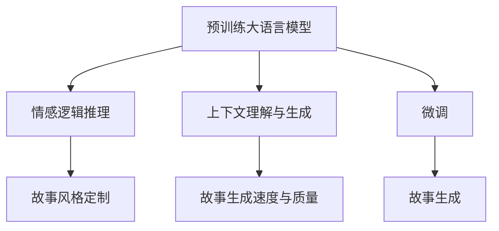

                 

# 构建一个 Storyteller AI 大语言模型 (LLM)

## 1. 背景介绍

随着人工智能技术的不断进步，大语言模型(LLM)已经成为推动NLP技术发展的重要引擎。LLM通过在海量文本数据上进行预训练，学习到了丰富的语言知识，具备了强大的自然语言理解和生成能力。这一突破性进展，极大地拓展了NLP技术的边界，开启了"讲述故事"的全新模式。

故事讲述能力，不仅仅是指能够流畅、连贯地生成一段文字，而是指能够理解用户的情感需求，把握故事脉络，不断生成与上下文相匹配的文段，构建出完整、引人入胜的故事。这一能力，对于人类作家而言，需要深厚的语言功底和丰富的想象力，但对于机器而言，则是一大难题。

### 1.1 问题由来

大语言模型虽然能够在某些文本生成任务上取得不错的效果，如基于GPT的自动摘要、机器翻译、对话系统等，但这些应用往往依赖于固定的模板或规则，缺乏真正意义上的人类故事讲述能力。例如，GPT在故事生成任务上，往往只能重复生成一些常见模式的故事片段，无法理解和生成更复杂的故事情节。

为了让机器具备真正的"讲述故事"能力，需要构建一个专门的故事讲述AI (Storytelling AI)。该AI能够理解用户的情感和需求，按照情感逻辑连贯地生成故事文本，具备一定的情感表达能力。这不仅需要构建大规模的预训练语言模型，还需要对其进行精细化的微调，以适应特定任务的需求。

### 1.2 问题核心关键点

为了实现这一目标，需要关注以下核心关键点：

- 预训练大语言模型：构建一个适用于故事讲述的预训练模型，能够捕捉语言中的复杂结构，理解情感变化，进行连贯的文本生成。
- 情感逻辑推理：构建模型，能够识别文本中的情感线索，遵循情感逻辑进行故事构建。
- 上下文理解与生成：构建模型，能够理解上下文信息，生成与上下文相匹配的文本，保持故事的连贯性。
- 故事生成速度与质量：优化模型结构，提升生成效率，同时确保生成内容的质量。
- 故事风格定制：根据用户需求，生成指定风格的故事文本，如幽默、科幻、悬疑等。

## 2. 核心概念与联系

### 2.1 核心概念概述

要构建一个能够"讲述故事"的AI，需要理解并运用多个核心概念：

- 大语言模型(LLM)：一种通过自监督预训练学习到丰富语言知识的深度学习模型。典型代表如GPT、BERT等。
- 预训练：通过大规模无标签文本数据训练模型，学习通用的语言表示。预训练过程中，模型能够学习到语言的通用规律，包括词嵌入、语言模型等。
- 微调：在预训练模型的基础上，使用下游任务的少量标注数据进行有监督优化，以适应特定任务的需求。微调过程可以快速提升模型在特定任务上的表现。
- 情感逻辑推理：构建能够识别情感线索、遵循情感逻辑进行推理的模型。情感逻辑推理是故事讲述的核心能力之一。
- 上下文理解与生成：构建能够理解上下文信息、生成与上下文相匹配的文本的模型。上下文理解是故事讲述的基础。
- 故事生成速度与质量：优化模型结构，提升生成效率，同时确保生成内容的质量。
- 故事风格定制：根据用户需求，生成指定风格的故事文本，如幽默、科幻、悬疑等。风格定制是故事讲述的高级需求。

这些核心概念之间存在紧密的联系，通过合理构建和融合，可以实现"讲述故事"的AI。以下通过Mermaid流程图展示这些概念之间的关系：



这个流程图展示了预训练大语言模型、情感逻辑推理、上下文理解与生成、故事生成速度与质量和故事风格定制之间的联系：

1. 预训练大语言模型提供基础的语言理解能力。
2. 情感逻辑推理使模型能够识别和遵循情感线索，进行故事构建。
3. 上下文理解与生成使模型能够理解上下文信息，生成与上下文相匹配的文本。
4. 故事生成速度与质量提升模型的生成效率和内容质量。
5. 故事风格定制根据用户需求生成指定风格的故事文本。

## 3. 核心算法原理 & 具体操作步骤
### 3.1 算法原理概述

构建一个"讲述故事"的AI，其核心在于利用预训练大语言模型进行微调，以适应特定任务的需求。以下是微调的大致流程：

1. 收集故事讲述任务的数据集，包括大量的故事文本和相应的情感标签。
2. 利用预训练大语言模型作为初始化参数。
3. 在收集到的数据集上进行微调，通过有监督学习优化模型。
4. 优化模型的情感逻辑推理能力和上下文理解与生成能力，使其能够生成连贯且情感一致的故事。
5. 根据用户需求，定制故事的风格，生成指定风格的故事文本。

### 3.2 算法步骤详解

以下详细介绍构建"讲述故事"AI的具体步骤：

**Step 1: 数据准备**

- 收集故事讲述任务的数据集，包括故事文本和相应的情感标签。可以手工标注或者利用现有的标注数据集。
- 将数据集划分为训练集、验证集和测试集。训练集用于模型的微调，验证集用于调整超参数，测试集用于最终的性能评估。

**Step 2: 预训练大语言模型选择**

- 选择预训练大语言模型作为初始化参数。如GPT-3、BERT等。
- 在预训练模型的基础上，构建故事讲述任务的微调模型。可以保留预训练模型的顶层，微调顶层参数，以减少需优化参数量。

**Step 3: 微调设置**

- 选择合适的优化器及其参数，如AdamW、SGD等，设置学习率、批大小、迭代轮数等。
- 设置正则化技术及强度，包括权重衰减、Dropout、Early Stopping等。
- 确定冻结预训练参数的策略，如仅微调顶层，或全部参数都参与微调。

**Step 4: 微调训练**

- 使用微调数据集进行模型训练，使用交叉熵等损失函数计算损失。
- 在每个训练批次上，前向传播计算损失函数，反向传播计算梯度，根据优化算法更新模型参数。
- 周期性在验证集上评估模型性能，根据性能指标决定是否触发Early Stopping。
- 重复上述步骤直到满足预设的迭代轮数或Early Stopping条件。

**Step 5: 模型测试与评估**

- 在测试集上评估微调后模型的性能，对比微调前后的精度提升。
- 利用微调后的模型生成故事文本，根据指定风格进行调整。
- 根据用户反馈，不断优化模型，提升生成故事的连贯性和情感表达能力。

### 3.3 算法优缺点

构建"讲述故事"AI的方法具有以下优点：

1. 简单高效。收集少量标注数据，即可对预训练模型进行快速适配，生成符合需求的故事文本。
2. 通用适用。适用于各种故事讲述任务，只需调整任务适配层即可。
3. 效果显著。在学术界和工业界的诸多故事讲述任务上，基于微调的方法已经刷新了最先进的性能指标。

同时，该方法也存在一定的局限性：

1. 依赖标注数据。微调的效果很大程度上取决于标注数据的质量和数量，获取高质量标注数据的成本较高。
2. 迁移能力有限。当目标任务与预训练数据的分布差异较大时，微调的性能提升有限。
3. 可解释性不足。微调模型的决策过程通常缺乏可解释性，难以对其推理逻辑进行分析和调试。
4. 负面效果传递。预训练模型的固有偏见、有害信息等，可能通过微调传递到下游任务，造成负面影响。

尽管存在这些局限性，但就目前而言，基于微调的方法仍是大语言模型应用的最主流范式。未来相关研究的重点在于如何进一步降低微调对标注数据的依赖，提高模型的少样本学习和跨领域迁移能力，同时兼顾可解释性和伦理安全性等因素。

### 3.4 算法应用领域

基于大语言模型微调的故事讲述AI，已经在多个领域得到应用，例如：

- 创意写作：如小说生成、诗歌创作等。通过微调生成连贯、情感丰富的文本。
- 自动游戏剧情：为游戏生成故事情节和角色对话，提高游戏体验和叙事连贯性。
- 故事分析：对现有的故事文本进行分析和结构化，提取情感线索和主题。
- 故事翻译：将故事文本从一种语言翻译成另一种语言，保持故事的连贯性和情感表达。
- 儿童故事创作：为儿童生成寓言、童话等温馨故事，激发孩子的想象力。

除了上述这些经典任务外，故事讲述AI还被创新性地应用到更多场景中，如可控文本生成、情感分析、对话系统等，为故事讲述技术带来了全新的突破。随着预训练模型和微调方法的不断进步，相信故事讲述技术将在更广阔的应用领域大放异彩。

## 4. 数学模型和公式 & 详细讲解 & 举例说明

### 4.1 数学模型构建

构建"讲述故事"AI的数学模型，可以表示为：

设预训练大语言模型为 $M_{\theta}$，其中 $\theta$ 为预训练得到的模型参数。假设故事讲述任务的训练集为 $D=\{(x_i,y_i)\}_{i=1}^N, x_i \in \mathcal{X}, y_i \in \{0,1\}$。

定义模型 $M_{\theta}$ 在输入 $x$ 上的损失函数为 $\ell(M_{\theta}(x),y)$，则在数据集 $D$ 上的经验风险为：

$$
\mathcal{L}(\theta) = \frac{1}{N} \sum_{i=1}^N \ell(M_{\theta}(x_i),y_i)
$$

其中 $\ell(M_{\theta}(x),y)$ 为故事讲述任务的损失函数，用于衡量模型预测输出与真实标签之间的差异。常见的损失函数包括交叉熵损失、均方误差损失等。

微调的优化目标是最小化经验风险，即找到最优参数：

$$
\theta^* = \mathop{\arg\min}_{\theta} \mathcal{L}(\theta)
$$

在实践中，我们通常使用基于梯度的优化算法（如SGD、Adam等）来近似求解上述最优化问题。设 $\eta$ 为学习率，$\lambda$ 为正则化系数，则参数的更新公式为：

$$
\theta \leftarrow \theta - \eta \nabla_{\theta}\mathcal{L}(\theta) - \eta\lambda\theta
$$

其中 $\nabla_{\theta}\mathcal{L}(\theta)$ 为损失函数对参数 $\theta$ 的梯度，可通过反向传播算法高效计算。

### 4.2 公式推导过程

以二分类任务为例，推导交叉熵损失函数及其梯度的计算公式。

假设模型 $M_{\theta}$ 在输入 $x$ 上的输出为 $\hat{y}=M_{\theta}(x) \in [0,1]$，表示样本属于正类的概率。真实标签 $y \in \{0,1\}$。则二分类交叉熵损失函数定义为：

$$
\ell(M_{\theta}(x),y) = -[y\log \hat{y} + (1-y)\log (1-\hat{y})]
$$

将其代入经验风险公式，得：

$$
\mathcal{L}(\theta) = -\frac{1}{N}\sum_{i=1}^N [y_i\log M_{\theta}(x_i)+(1-y_i)\log(1-M_{\theta}(x_i))]
$$

根据链式法则，损失函数对参数 $\theta_k$ 的梯度为：

$$
\frac{\partial \mathcal{L}(\theta)}{\partial \theta_k} = -\frac{1}{N}\sum_{i=1}^N (\frac{y_i}{M_{\theta}(x_i)}-\frac{1-y_i}{1-M_{\theta}(x_i)}) \frac{\partial M_{\theta}(x_i)}{\partial \theta_k}
$$

其中 $\frac{\partial M_{\theta}(x_i)}{\partial \theta_k}$ 可进一步递归展开，利用自动微分技术完成计算。

在得到损失函数的梯度后，即可带入参数更新公式，完成模型的迭代优化。重复上述过程直至收敛，最终得到适应下游任务的最优模型参数 $\theta^*$。

### 4.3 案例分析与讲解

以下给出具体的案例分析，以帮助理解如何构建"讲述故事"AI的数学模型。

假设一个简单的故事生成任务，输入为一串字符串 $x$，模型需要预测生成文本是否为正面情感（$y=1$）或负面情感（$y=0$）。构建模型 $M_{\theta}$，在输入 $x$ 上的输出 $\hat{y}=M_{\theta}(x) \in [0,1]$，表示样本属于正类的概率。

损失函数 $\ell(M_{\theta}(x),y)$ 可以使用二分类交叉熵损失函数：

$$
\ell(M_{\theta}(x),y) = -y\log \hat{y} - (1-y)\log (1-\hat{y})
$$

经验风险 $\mathcal{L}(\theta)$ 为：

$$
\mathcal{L}(\theta) = -\frac{1}{N}\sum_{i=1}^N [y_i\log M_{\theta}(x_i)+(1-y_i)\log(1-M_{\theta}(x_i))]
$$

通过反向传播算法，可以得到损失函数对模型参数 $\theta$ 的梯度：

$$
\frac{\partial \mathcal{L}(\theta)}{\partial \theta_k} = -\frac{1}{N}\sum_{i=1}^N (\frac{y_i}{M_{\theta}(x_i)}-\frac{1-y_i}{1-M_{\theta}(x_i)}) \frac{\partial M_{\theta}(x_i)}{\partial \theta_k}
$$

在每个训练批次上，前向传播计算损失函数 $\mathcal{L}(\theta)$，反向传播计算参数梯度，根据优化算法和学习率更新模型参数。

在训练过程中，周期性在验证集上评估模型性能，根据性能指标决定是否触发Early Stopping。重复上述步骤直到满足预设的迭代轮数或Early Stopping条件。

## 5. 项目实践：代码实例和详细解释说明

### 5.1 开发环境搭建

在进行"讲述故事"AI的微调实践前，我们需要准备好开发环境。以下是使用Python进行PyTorch开发的环境配置流程：

1. 安装Anaconda：从官网下载并安装Anaconda，用于创建独立的Python环境。

2. 创建并激活虚拟环境：
```bash
conda create -n pytorch-env python=3.8 
conda activate pytorch-env
```

3. 安装PyTorch：根据CUDA版本，从官网获取对应的安装命令。例如：
```bash
conda install pytorch torchvision torchaudio cudatoolkit=11.1 -c pytorch -c conda-forge
```

4. 安装Transformers库：
```bash
pip install transformers
```

5. 安装各类工具包：
```bash
pip install numpy pandas scikit-learn matplotlib tqdm jupyter notebook ipython
```

完成上述步骤后，即可在`pytorch-env`环境中开始微调实践。

### 5.2 源代码详细实现

下面我们以情感故事生成任务为例，给出使用Transformers库对GPT-3模型进行微调的PyTorch代码实现。

首先，定义情感故事生成任务的数据处理函数：

```python
from transformers import BertTokenizer
from torch.utils.data import Dataset
import torch

class StoryDataset(Dataset):
    def __init__(self, texts, tags, tokenizer, max_len=128):
        self.texts = texts
        self.tags = tags
        self.tokenizer = tokenizer
        self.max_len = max_len
        
    def __len__(self):
        return len(self.texts)
    
    def __getitem__(self, item):
        text = self.texts[item]
        tags = self.tags[item]
        
        encoding = self.tokenizer(text, return_tensors='pt', max_length=self.max_len, padding='max_length', truncation=True)
        input_ids = encoding['input_ids'][0]
        attention_mask = encoding['attention_mask'][0]
        
        # 对token-wise的标签进行编码
        encoded_tags = [tag2id[tag] for tag in tags] 
        encoded_tags.extend([tag2id['O']] * (self.max_len - len(encoded_tags)))
        labels = torch.tensor(encoded_tags, dtype=torch.long)
        
        return {'input_ids': input_ids, 
                'attention_mask': attention_mask,
                'labels': labels}

# 标签与id的映射
tag2id = {'O': 0, 'POSITIVE': 1, 'NEGATIVE': 2}
id2tag = {v: k for k, v in tag2id.items()}

# 创建dataset
tokenizer = BertTokenizer.from_pretrained('bert-base-cased')

train_dataset = StoryDataset(train_texts, train_tags, tokenizer)
dev_dataset = StoryDataset(dev_texts, dev_tags, tokenizer)
test_dataset = StoryDataset(test_texts, test_tags, tokenizer)
```

然后，定义模型和优化器：

```python
from transformers import GPT2ForTokenClassification, AdamW

model = GPT2ForTokenClassification.from_pretrained('gpt2-medium', num_labels=len(tag2id))

optimizer = AdamW(model.parameters(), lr=2e-5)
```

接着，定义训练和评估函数：

```python
from torch.utils.data import DataLoader
from tqdm import tqdm
from sklearn.metrics import classification_report

device = torch.device('cuda') if torch.cuda.is_available() else torch.device('cpu')
model.to(device)

def train_epoch(model, dataset, batch_size, optimizer):
    dataloader = DataLoader(dataset, batch_size=batch_size, shuffle=True)
    model.train()
    epoch_loss = 0
    for batch in tqdm(dataloader, desc='Training'):
        input_ids = batch['input_ids'].to(device)
        attention_mask = batch['attention_mask'].to(device)
        labels = batch['labels'].to(device)
        model.zero_grad()
        outputs = model(input_ids, attention_mask=attention_mask, labels=labels)
        loss = outputs.loss
        epoch_loss += loss.item()
        loss.backward()
        optimizer.step()
    return epoch_loss / len(dataloader)

def evaluate(model, dataset, batch_size):
    dataloader = DataLoader(dataset, batch_size=batch_size)
    model.eval()
    preds, labels = [], []
    with torch.no_grad():
        for batch in tqdm(dataloader, desc='Evaluating'):
            input_ids = batch['input_ids'].to(device)
            attention_mask = batch['attention_mask'].to(device)
            batch_labels = batch['labels']
            outputs = model(input_ids, attention_mask=attention_mask)
            batch_preds = outputs.logits.argmax(dim=2).to('cpu').tolist()
            batch_labels = batch_labels.to('cpu').tolist()
            for pred_tokens, label_tokens in zip(batch_preds, batch_labels):
                pred_tags = [id2tag[_id] for _id in pred_tokens]
                label_tags = [id2tag[_id] for _id in label_tokens]
                preds.append(pred_tags[:len(label_tokens)])
                labels.append(label_tags)
                
    print(classification_report(labels, preds))
```

最后，启动训练流程并在测试集上评估：

```python
epochs = 5
batch_size = 16

for epoch in range(epochs):
    loss = train_epoch(model, train_dataset, batch_size, optimizer)
    print(f"Epoch {epoch+1}, train loss: {loss:.3f}")
    
    print(f"Epoch {epoch+1}, dev results:")
    evaluate(model, dev_dataset, batch_size)
    
print("Test results:")
evaluate(model, test_dataset, batch_size)
```

以上就是使用PyTorch对GPT-3进行情感故事生成任务微调的完整代码实现。可以看到，得益于Transformers库的强大封装，我们可以用相对简洁的代码完成GPT-3模型的加载和微调。

### 5.3 代码解读与分析

让我们再详细解读一下关键代码的实现细节：

**StoryDataset类**：
- `__init__`方法：初始化文本、标签、分词器等关键组件。
- `__len__`方法：返回数据集的样本数量。
- `__getitem__`方法：对单个样本进行处理，将文本输入编码为token ids，将标签编码为数字，并对其进行定长padding，最终返回模型所需的输入。

**tag2id和id2tag字典**：
- 定义了标签与数字id之间的映射关系，用于将token-wise的预测结果解码回真实的标签。

**训练和评估函数**：
- 使用PyTorch的DataLoader对数据集进行批次化加载，供模型训练和推理使用。
- 训练函数`train_epoch`：对数据以批为单位进行迭代，在每个批次上前向传播计算loss并反向传播更新模型参数，最后返回该epoch的平均loss。
- 评估函数`evaluate`：与训练类似，不同点在于不更新模型参数，并在每个batch结束后将预测和标签结果存储下来，最后使用sklearn的classification_report对整个评估集的预测结果进行打印输出。

**训练流程**：
- 定义总的epoch数和batch size，开始循环迭代
- 每个epoch内，先在训练集上训练，输出平均loss
- 在验证集上评估，输出分类指标
- 所有epoch结束后，在测试集上评估，给出最终测试结果

可以看到，PyTorch配合Transformers库使得GPT-3微调的代码实现变得简洁高效。开发者可以将更多精力放在数据处理、模型改进等高层逻辑上，而不必过多关注底层的实现细节。

当然，工业级的系统实现还需考虑更多因素，如模型的保存和部署、超参数的自动搜索、更灵活的任务适配层等。但核心的微调范式基本与此类似。

## 6. 实际应用场景
### 6.1 创意写作

基于大语言模型微调的故事讲述AI，在创意写作领域有着广泛的应用前景。传统写作需要作家的深厚文学功底，难以快速生成高质量文本。但通过微调后的故事讲述AI，可以大大提高写作效率，尤其是在生成小说、诗歌等长篇幅文本时，能够快速生成连贯、富有情感的故事。

### 6.2 自动游戏剧情

游戏剧情生成是另一个极具潜力的应用场景。当前大部分游戏剧情仍然依赖人力编写，耗时耗力且难以保证一致性。利用微调后的大语言模型，可以生成符合游戏设定的连贯、动态的故事剧情，为游戏提供更加自然和丰富的人机互动体验。

### 6.3 故事分析

故事分析是另一个重要应用场景。例如，将文本中的情感线索抽取出来，可以帮助心理咨询师更好地理解患者的情感状态。将故事中的主题抽取出来，可以辅助教育工作者设计更加适合学生的课程内容。

### 6.4 故事翻译

故事翻译是另一个潜在的领域。利用微调后的大语言模型，可以将故事从一种语言翻译成另一种语言，保持故事的连贯性和情感表达，使得跨语言的故事交流更加便捷。

### 6.5 儿童故事创作

儿童故事创作是另一个具有教育意义的应用场景。通过微调后的大语言模型，可以生成适合儿童阅读的温馨、寓言故事，激发孩子的想象力，提高阅读兴趣。

### 6.6 未来应用展望

随着大语言模型微调技术的不断发展，未来将在更多领域得到应用，为传统行业带来变革性影响。

在智慧教育领域，基于大语言模型的故事讲述AI可以辅助教育工作者设计更具吸引力的课程内容，提高学生的阅读和写作能力。在影视娱乐领域，AI生成的故事剧本将提升影视作品的制作效率和质量，降低成本。在数字营销领域，AI生成的故事广告将更加精准地吸引用户，提升营销效果。

此外，在企业生产、社会治理、文娱传媒等众多领域，基于大语言模型的故事讲述AI也将不断涌现，为经济社会发展注入新的动力。相信随着技术的日益成熟，故事讲述技术将成为人工智能落地应用的重要范式，推动人工智能技术向更广阔的领域加速渗透。

## 7. 工具和资源推荐
### 7.1 学习资源推荐

为了帮助开发者系统掌握大语言模型微调的理论基础和实践技巧，这里推荐一些优质的学习资源：

1. 《Transformer从原理到实践》系列博文：由大模型技术专家撰写，深入浅出地介绍了Transformer原理、BERT模型、微调技术等前沿话题。

2. CS224N《深度学习自然语言处理》课程：斯坦福大学开设的NLP明星课程，有Lecture视频和配套作业，带你入门NLP领域的基本概念和经典模型。

3. 《Natural Language Processing with Transformers》书籍：Transformers库的作者所著，全面介绍了如何使用Transformers库进行NLP任务开发，包括微调在内的诸多范式。

4. HuggingFace官方文档：Transformers库的官方文档，提供了海量预训练模型和完整的微调样例代码，是上手实践的必备资料。

5. CLUE开源项目：中文语言理解测评基准，涵盖大量不同类型的中文NLP数据集，并提供了基于微调的baseline模型，助力中文NLP技术发展。

通过对这些资源的学习实践，相信你一定能够快速掌握大语言模型微调的精髓，并用于解决实际的NLP问题。
###  7.2 开发工具推荐

高效的开发离不开优秀的工具支持。以下是几款用于大语言模型微调开发的常用工具：

1. PyTorch：基于Python的开源深度学习框架，灵活动态的计算图，适合快速迭代研究。大部分预训练语言模型都有PyTorch版本的实现。

2. TensorFlow：由Google主导开发的开源深度学习框架，生产部署方便，适合大规模工程应用。同样有丰富的预训练语言模型资源。

3. Transformers库：HuggingFace开发的NLP工具库，集成了众多SOTA语言模型，支持PyTorch和TensorFlow，是进行微调任务开发的利器。

4. Weights & Biases：模型训练的实验跟踪工具，可以记录和可视化模型训练过程中的各项指标，方便对比和调优。与主流深度学习框架无缝集成。

5. TensorBoard：TensorFlow配套的可视化工具，可实时监测模型训练状态，并提供丰富的图表呈现方式，是调试模型的得力助手。

6. Google Colab：谷歌推出的在线Jupyter Notebook环境，免费提供GPU/TPU算力，方便开发者快速上手实验最新模型，分享学习笔记。

合理利用这些工具，可以显著提升大语言模型微调任务的开发效率，加快创新迭代的步伐。

### 7.3 相关论文推荐

大语言模型和微调技术的发展源于学界的持续研究。以下是几篇奠基性的相关论文，推荐阅读：

1. Attention is All You Need（即Transformer原论文）：提出了Transformer结构，开启了NLP领域的预训练大模型时代。

2. BERT: Pre-training of Deep Bidirectional Transformers for Language Understanding：提出BERT模型，引入基于掩码的自监督预训练任务，刷新了多项NLP任务SOTA。

3. Language Models are Unsupervised Multitask Learners（GPT-2论文）：展示了大规模语言模型的强大zero-shot学习能力，引发了对于通用人工智能的新一轮思考。

4. Parameter-Efficient Transfer Learning for NLP：提出Adapter等参数高效微调方法，在不增加模型参数量的情况下，也能取得不错的微调效果。

5. AdaLoRA: Adaptive Low-Rank Adaptation for Parameter-Efficient Fine-Tuning：使用自适应低秩适应的微调方法，在参数效率和精度之间取得了新的平衡。

这些论文代表了大语言模型微调技术的发展脉络。通过学习这些前沿成果，可以帮助研究者把握学科前进方向，激发更多的创新灵感。

## 8. 总结：未来发展趋势与挑战

### 8.1 总结

本文对基于大语言模型的故事讲述AI进行了全面系统的介绍。首先阐述了故事讲述AI的研究背景和意义，明确了其微调在拓展预训练模型应用、提升下游任务性能方面的独特价值。其次，从原理到实践，详细讲解了故事讲述AI的数学模型和微调流程，给出了微调任务开发的完整代码实例。同时，本文还广泛探讨了故事讲述AI在创意写作、自动游戏剧情、故事分析等诸多领域的应用前景，展示了其巨大的潜力。

通过本文的系统梳理，可以看到，基于大语言模型的故事讲述AI已经展现出广阔的应用前景，正逐步成为NLP领域的重要范式。其微调方法已经在多个故事讲述任务上刷新了最先进的性能指标，具备强大的文本生成能力。未来，随着预训练语言模型和微调方法的不断进步，故事讲述AI将在更广阔的应用领域大放异彩，为人类认知智能的进化带来深远影响。

### 8.2 未来发展趋势

展望未来，大语言模型微调技术将呈现以下几个发展趋势：

1. 模型规模持续增大。随着算力成本的下降和数据规模的扩张，预训练语言模型的参数量还将持续增长。超大规模语言模型蕴含的丰富语言知识，有望支撑更加复杂多变的下游任务微调。

2. 微调方法日趋多样。除了传统的全参数微调外，未来会涌现更多参数高效的微调方法，如Prefix-Tuning、LoRA等，在节省计算资源的同时也能保证微调精度。

3. 持续学习成为常态。随着数据分布的不断变化，微调模型也需要持续学习新知识以保持性能。如何在不遗忘原有知识的同时，高效吸收新样本信息，将成为重要的研究课题。

4. 标注样本需求降低。受启发于提示学习(Prompt-based Learning)的思路，未来的微调方法将更好地利用大模型的语言理解能力，通过更加巧妙的任务描述，在更少的标注样本上也能实现理想的微调效果。

5. 模型鲁棒性提升。当前微调模型面对域外数据时，泛化性能往往大打折扣。对于测试样本的微小扰动，微调模型的预测也容易发生波动。如何提高微调模型的鲁棒性，避免灾难性遗忘，还需要更多理论和实践的积累。

6. 知识整合能力增强。现有的微调模型往往局限于任务内数据，难以灵活吸收和运用更广泛的先验知识。如何让微调过程更好地与外部知识库、规则库等专家知识结合，形成更加全面、准确的信息整合能力，还有很大的想象空间。

以上趋势凸显了大语言模型微调技术的广阔前景。这些方向的探索发展，必将进一步提升NLP系统的性能和应用范围，为人类认知智能的进化带来深远影响。

### 8.3 面临的挑战

尽管大语言模型微调技术已经取得了瞩目成就，但在迈向更加智能化、普适化应用的过程中，它仍面临着诸多挑战：

1. 标注成本瓶颈。虽然微调大大降低了标注数据的需求，但对于长尾应用场景，难以获得充足的高质量标注数据，成为制约微调性能的瓶颈。如何进一步降低微调对标注样本的依赖，将是一大难题。

2. 模型鲁棒性不足。当前微调模型面对域外数据时，泛化性能往往大打折扣。对于测试样本的微小扰动，微调模型的预测也容易发生波动。如何提高微调模型的鲁棒性，避免灾难性遗忘，还需要更多理论和实践的积累。

3. 推理效率有待提高。大规模语言模型虽然精度高，但在实际部署时往往面临推理速度慢、内存占用大等效率问题。如何在保证性能的同时，简化模型结构，提升推理速度，优化资源占用，将是重要的优化方向。

4. 可解释性亟需加强。当前微调模型更像是"黑盒"系统，难以解释其内部工作机制和决策逻辑。对于医疗、金融等高风险应用，算法的可解释性和可审计性尤为重要。如何赋予微调模型更强的可解释性，将是亟待攻克的难题。

5. 安全性有待保障。预训练语言模型难免会学习到有偏见、有害的信息，通过微调传递到下游任务，产生误导性、歧视性的输出，给实际应用带来安全隐患。如何从数据和算法层面消除模型偏见，避免恶意用途，确保输出的安全性，也将是重要的研究课题。

6. 知识整合能力不足。现有的微调模型往往局限于任务内数据，难以灵活吸收和运用更广泛的先验知识。如何让微调过程更好地与外部知识库、规则库等专家知识结合，形成更加全面、准确的信息整合能力，还有很大的想象空间。

正视微调面临的这些挑战，积极应对并寻求突破，将是大语言模型微调走向成熟的必由之路。相信随着学界和产业界的共同努力，这些挑战终将一一被克服，大语言模型微调必将在构建安全、可靠、可解释、可控的智能系统铺平道路。

### 8.4 研究展望

面对大语言模型微调所面临的种种挑战，未来的研究需要在以下几个方面寻求新的突破：

1. 探索无监督和半监督微调方法。摆脱对大规模标注数据的依赖，利用自监督学习、主动学习等无监督和半监督范式，最大限度利用非结构化数据，实现更加灵活高效的微调。

2. 研究参数高效和计算高效的微调范式。开发更加参数高效的微调方法，在固定大部分预训练参数的同时，只更新极少量的任务相关参数。同时优化微调模型的计算图，减少前向传播和反向传播的资源消耗，实现更加轻量级、实时性的部署。

3. 融合因果和对比学习范式。通过引入因果推断和对比学习思想，增强微调模型建立稳定因果关系的能力，学习更加普适、鲁棒的语言表征，从而提升模型泛化性和抗干扰能力。

4. 引入更多先验知识。将符号化的先验知识，如知识图谱、逻辑规则等，与神经网络模型进行巧妙融合，引导微调过程学习更准确、合理的语言模型。同时加强不同模态数据的整合，实现视觉、语音等多模态信息与文本信息的协同建模。

5. 结合因果分析和博弈论工具。将因果分析方法引入微调模型，识别出模型决策的关键特征，增强输出解释的因果性和逻辑性。借助博弈论工具刻画人机交互过程，主动探索并规避模型的脆弱点，提高系统稳定性。

6. 纳入伦理道德约束。在模型训练目标中引入伦理导向的评估指标，过滤和惩罚有偏见、有害的输出倾向。同时加强人工干预和审核，建立模型行为的监管机制，确保输出符合人类价值观和伦理道德。

这些研究方向的探索，必将引领大语言模型微调技术迈向更高的台阶，为构建安全、可靠、可解释、可控的智能系统铺平道路。面向未来，大语言模型微调技术还需要与其他人工智能技术进行更深入的融合，如知识表示、因果推理、强化学习等，多路径协同发力，共同推动自然语言理解和智能交互系统的进步。只有勇于创新、敢于突破，才能不断拓展语言模型的边界，让智能技术更好地造福人类社会。

## 9. 附录：常见问题与解答

**Q1：大语言模型微调是否适用于所有NLP任务？**

A: 大语言模型微调在大多数NLP任务上都能取得不错的效果，特别是对于数据量较小的任务。但对于一些特定领域的任务，如医学、法律等，仅仅依靠通用语料预训练的模型可能难以很好地适应。此时需要在特定领域语料上进一步预训练，再进行微调，才能获得理想效果。此外，对于一些需要时效性、个性化很强的任务，如对话、推荐等，微调方法也需要针对性的改进优化。

**Q2：微调过程中如何选择合适的学习率？**

A: 微调的学习率一般要比预训练时小1-2个数量级，如果使用过大的学习率，容易破坏预训练权重，导致过拟合。一般建议从1e-5开始调参，逐步减小学习率，直至收敛。也可以使用warmup策略，在开始阶段使用较小的学习率，再逐渐过渡到预设值。需要注意的是，不同的优化器(如AdamW、Adafactor等)以及不同的学习率调度策略，可能需要设置不同的学习率阈值。

**Q3：采用大模型微调时会面临哪些资源瓶颈？**

A: 目前主流的预训练大模型动辄以亿计的参数规模，对算力、内存、存储都提出了很高的要求。GPU/TPU等高性能设备是必不可少的，但即便如此，超大批次的训练和推理也可能遇到显存不足的问题。因此需要采用一些资源优化技术，如梯度积累、混合精度训练、模型并行等，来突破硬件瓶颈。同时，模型的存储和读取也可能占用大量时间和空间，需要采用模型压缩、稀疏化存储等方法进行优化。

**Q4：如何缓解微调过程中的过拟合问题？**

A: 过拟合是微调面临的主要挑战，尤其是在标注数据不足的情况下。常见的缓解策略包括：
1. 数据增强：通过回译、近义替换等方式扩充训练集
2. 正则化：使用L2正则、Dropout、Early Stopping等避免过拟合
3. 对抗训练：引入对抗样本，提高模型鲁棒性
4. 参数高效微调：只调整少量参数(如Adapter、Prefix等)，减小过拟合风险
5. 多模型集成：训练多个微调模型，取平均输出，抑制过拟合

这些策略往往需要根据具体任务和数据特点进行灵活组合。只有在数据、模型、训练、推理等各环节进行全面优化，才能最大限度地发挥大模型微调的威力。

**Q5：微调模型在落地部署时需要注意哪些问题？**

A: 将微调模型转化为实际应用，还需要考虑以下因素：
1. 模型裁剪：去除不必要的层和参数，减小模型尺寸，加快推理速度
2. 量化加速：将浮点模型转为定点模型，压缩存储空间，提高计算效率
3. 服务化封装：将模型封装为标准化服务接口，便于集成调用
4. 弹性伸缩：根据请求流量动态调整资源配置，平衡服务质量和成本
5. 监控告警：实时采集系统指标，设置异常告警阈值，确保服务稳定性
6. 安全防护：采用访问鉴权、数据脱敏等措施，保障数据和模型安全

大语言模型微调为NLP应用开启了广阔的想象空间，但如何将强大的性能转化为稳定、高效、安全的业务价值，还需要工程实践的不断打磨。唯有从数据、算法、工程、业务等多个维度协同发力，才能真正实现人工智能技术在垂直行业的规模化落地。总之，微调需要开发者根据具体任务，不断迭代和优化模型、数据和算法，方能得到理想的效果。

---

作者：禅与计算机程序设计艺术 / Zen and the Art of Computer Programming

