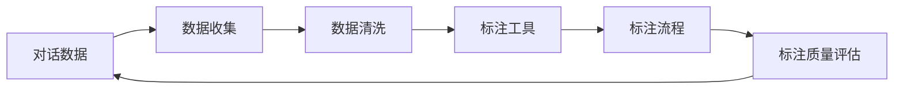

                 

# 标记和注释对话数据：最佳实践

## 1. 背景介绍

在自然语言处理（NLP）领域，对话数据被广泛应用于各种任务中，如自动问答、对话系统、智能客服等。然而，高质量的对话数据对于训练和优化这些模型的效果至关重要。对话数据的质量很大程度上取决于数据的标注质量。有效的标记和注释是构建高性能对话系统的关键。本文将探讨对话数据的标记和注释最佳实践，包括标签体系设计、数据收集、数据清洗、标注工具和流程优化等。

## 2. 核心概念与联系

### 2.1 核心概念概述

在对话数据标记和注释过程中，涉及以下几个核心概念：

- **对话数据**：对话数据是两个或多个参与者之间的交互记录，包括文本、语音、视频等多种形式。对话数据可用于训练对话模型，如自动问答系统、聊天机器人等。

- **标签体系**：标签体系是用于描述和标记对话数据的框架。不同的任务和应用可能需要不同的标签体系，如意图识别、实体识别、情感分析等。

- **数据收集**：数据收集是获取高质量对话数据的过程。这可能涉及爬取网络数据、记录用户交互、创建合成对话等。

- **数据清洗**：数据清洗是去除噪声和无关数据的过程，以提高数据质量。这包括去除重复数据、错误数据、无关数据等。

- **标注工具**：标注工具是用于标记和注释对话数据的软件或平台。这些工具通常支持多种标注任务和标签体系。

- **标注流程**：标注流程是标注过程的管理和监控机制。有效的标注流程可以保证标注质量，提高标注效率。

- **标注质量评估**：标注质量评估是评估标注结果准确性和一致性的过程。通常通过抽样检查、计算指标等方式进行。

### 2.2 核心概念原理和架构的 Mermaid 流程图



## 3. 核心算法原理 & 具体操作步骤

### 3.1 算法原理概述

对话数据的标记和注释涉及以下几个核心算法原理：

- **意图识别**：意图识别是识别用户输入对话的目的。通常使用监督学习模型，如支持向量机（SVM）、决策树、神经网络等。

- **实体识别**：实体识别是从对话中识别出关键信息，如人名、地点、组织等。常用的方法包括规则匹配、基于模板的方法、深度学习模型等。

- **情感分析**：情感分析是识别对话中的情感倾向。常用的方法包括情感词典、基于机器学习的方法等。

- **上下文感知模型**：上下文感知模型考虑上下文信息，如前文或后文信息，以提高标记的准确性。

### 3.2 算法步骤详解

对话数据的标记和注释一般包括以下几个关键步骤：

**Step 1: 定义标签体系**

- 根据任务需求，定义合适的标签体系。例如，对于意图识别任务，可能包括询问、预订、投诉等标签。

**Step 2: 数据收集**

- 使用爬虫、调查问卷、日志记录等方式收集对话数据。确保数据的丰富性和多样性，覆盖各种应用场景。

**Step 3: 数据清洗**

- 去除无关数据、错误数据、重复数据等。通常使用文本清洗、语音去噪、视频剪辑等技术。

**Step 4: 标注工具选择**

- 根据标签体系和标注任务选择合适的标注工具。常用的工具包括LabelBox、Prodigy、HanLP等。

**Step 5: 标注流程设计**

- 设计标注流程，明确标注任务的分配、标注人员的角色、标注进度管理等。确保标注过程高效、有序。

**Step 6: 标注结果评估**

- 随机抽取部分标注数据，使用人工标注进行校验。计算指标如准确率、召回率、F1分数等，评估标注结果质量。

**Step 7: 标注结果合并**

- 将多个人的标注结果进行合并和融合，确保标注结果的一致性和可靠性。

**Step 8: 标注结果反馈**

- 对标注结果进行反馈，指出标注错误和遗漏，提高标注质量。

**Step 9: 标注结果应用**

- 将标注结果应用到模型训练中，优化对话模型的性能。

### 3.3 算法优缺点

对话数据的标记和注释具有以下优点：

- 提供高质量的训练数据，有助于提高对话模型的准确性和泛化能力。
- 可以灵活设计标签体系，满足各种任务需求。
- 可以使用多种标注工具和流程，提高标注效率和质量。

同时，也存在以下缺点：

- 标注成本较高，需要大量人力和时间。
- 标注过程中可能存在主观偏差，影响标注结果的一致性。
- 标注流程设计复杂，需要专业知识和管理经验。

### 3.4 算法应用领域

对话数据的标记和注释广泛应用于以下领域：

- **自动问答系统**：用于训练自动问答模型，如知识图谱、问答机器人的实体抽取和意图识别。
- **聊天机器人**：用于训练聊天机器人的对话策略和意图识别。
- **智能客服系统**：用于训练智能客服的问答识别和意图分类。
- **对话分析**：用于分析客户对话中的情感倾向和反馈意见。

## 4. 数学模型和公式 & 详细讲解 & 举例说明

### 4.1 数学模型构建

对话数据的标注和注释可以构建以下数学模型：

设对话数据集为 $D = \{(x_i, y_i)\}_{i=1}^N$，其中 $x_i$ 为对话记录，$y_i$ 为对话标签。标注任务通常为分类任务，可以表示为：

$$
\min_{\theta} \frac{1}{N} \sum_{i=1}^N \ell(f_{\theta}(x_i), y_i)
$$

其中 $\ell$ 为损失函数，$f_{\theta}$ 为模型函数。常见的损失函数包括交叉熵损失、均方误差损失等。

### 4.2 公式推导过程

以情感分析为例，假设模型为 $\theta$，输入为 $x$，输出为 $y$，损失函数为交叉熵损失 $L$，则模型的优化目标为：

$$
\min_{\theta} \frac{1}{N} \sum_{i=1}^N L(\theta(x_i), y_i)
$$

其中 $L(\theta(x_i), y_i) = -y_i\log(\theta(x_i)) - (1-y_i)\log(1-\theta(x_i))$。

### 4.3 案例分析与讲解

假设有一个包含10000个对话的标注数据集，其中50个对话属于正情感，50个对话属于负情感。使用一个简单的神经网络模型进行标注和注释：

1. 首先定义标签体系，包含正情感和负情感两个标签。

2. 使用标注工具（如LabelBox）进行人工标注，每个对话由3名标注人员进行标注，共标注了3000次。

3. 计算每个标注人员的平均准确率、召回率和F1分数，确保标注质量。

4. 将标注结果进行合并，计算最终的总准确率、召回率和F1分数。

5. 将标注结果应用到模型训练中，训练情感分析模型。

6. 使用测试集对模型进行评估，计算准确率、召回率和F1分数，评估模型效果。

## 5. 项目实践：代码实例和详细解释说明

### 5.1 开发环境搭建

在进行对话数据的标注和注释实践前，需要准备好开发环境。以下是使用Python进行PyTorch开发的环境配置流程：

1. 安装Anaconda：从官网下载并安装Anaconda，用于创建独立的Python环境。

2. 创建并激活虚拟环境：
```bash
conda create -n pytorch-env python=3.8 
conda activate pytorch-env
```

3. 安装PyTorch：根据CUDA版本，从官网获取对应的安装命令。例如：
```bash
conda install pytorch torchvision torchaudio cudatoolkit=11.1 -c pytorch -c conda-forge
```

4. 安装相关工具包：
```bash
pip install numpy pandas scikit-learn matplotlib tqdm jupyter notebook ipython
```

完成上述步骤后，即可在`pytorch-env`环境中开始标注实践。

### 5.2 源代码详细实现

以下是使用PyTorch对对话数据进行情感分析的标注和注释的Python代码实现。

首先，定义标签体系：

```python
from sklearn.metrics import accuracy_score, precision_score, recall_score, f1_score

POSITIVE = "positive"
NEGATIVE = "negative"
```

然后，定义模型和优化器：

```python
from torch import nn, optim
from torch.utils.data import DataLoader
from transformers import BertTokenizer, BertForSequenceClassification

model = BertForSequenceClassification.from_pretrained('bert-base-cased', num_labels=2)
optimizer = optim.Adam(model.parameters(), lr=1e-5)
```

接着，定义数据处理函数：

```python
from transformers import BertTokenizer

tokenizer = BertTokenizer.from_pretrained('bert-base-cased')

def preprocess(text):
    tokens = tokenizer(text, truncation=True, padding='max_length', max_length=128)
    return tokens['input_ids']
```

然后，定义训练和评估函数：

```python
def train_epoch(model, data_loader, optimizer):
    model.train()
    for batch in data_loader:
        input_ids = preprocess(batch[0])
        labels = batch[1]
        optimizer.zero_grad()
        outputs = model(input_ids)
        loss = outputs.loss
        loss.backward()
        optimizer.step()
    return loss.item()

def evaluate(model, data_loader):
    model.eval()
    total_loss = 0
    total_num = 0
    for batch in data_loader:
        input_ids = preprocess(batch[0])
        labels = batch[1]
        with torch.no_grad():
            outputs = model(input_ids)
            loss = outputs.loss
            total_loss += loss.item() * len(batch[0])
            total_num += len(batch[0])
    return total_loss / total_num
```

最后，启动训练流程并在测试集上评估：

```python
epochs = 5
batch_size = 16

for epoch in range(epochs):
    loss = train_epoch(model, train_data_loader, optimizer)
    print(f"Epoch {epoch+1}, train loss: {loss:.3f}")
    
    print(f"Epoch {epoch+1}, test loss: {evaluate(model, test_data_loader)}")
```

以上就是使用PyTorch对对话数据进行情感分析的标注和注释的完整代码实现。可以看到，得益于Transformer的强大封装，我们可以用相对简洁的代码完成模型的加载和标注。

### 5.3 代码解读与分析

让我们再详细解读一下关键代码的实现细节：

**定义标签体系**：
- 定义了POSITIVE和NEGATIVE两个标签，用于表示对话情感。

**定义模型和优化器**：
- 使用BertForSequenceClassification模型作为情感分析模型。
- 使用Adam优化器进行模型训练。

**数据处理函数**：
- 使用BertTokenizer将对话文本转换为模型可以处理的token ids。

**训练和评估函数**：
- 使用PyTorch的DataLoader对数据集进行批次化加载。
- 训练函数`train_epoch`：对每个批次的数据进行前向传播和反向传播，更新模型参数。
- 评估函数`evaluate`：在测试集上评估模型性能，计算平均损失。

**训练流程**：
- 定义总的epoch数和batch size，开始循环迭代。
- 每个epoch内，先在训练集上训练，输出平均损失。
- 在测试集上评估，输出测试损失。

可以看到，PyTorch配合Transformer库使得对话数据的标注和注释的代码实现变得简洁高效。开发者可以将更多精力放在数据处理、模型改进等高层逻辑上，而不必过多关注底层的实现细节。

## 6. 实际应用场景

对话数据的标记和注释在以下场景中具有广泛应用：

### 6.1 自动问答系统

自动问答系统用于回答用户提出的问题。通过标注对话数据，可以训练意图识别和实体识别模型，提高系统的回答准确性。

### 6.2 聊天机器人

聊天机器人用于与用户进行自然对话。通过标注对话数据，可以训练对话策略和意图识别模型，提高机器人的对话能力和用户体验。

### 6.3 智能客服系统

智能客服系统用于解决用户的问题。通过标注对话数据，可以训练意图识别和实体识别模型，提高客服系统的回答准确性。

### 6.4 未来应用展望

未来，对话数据的标记和注释将进一步扩展到以下领域：

- **多模态对话**：结合语音、视频等多种模态，提供更丰富的对话体验。
- **多语言对话**：支持多种语言的对话数据标注和注释，扩展全球用户群体。
- **个性化对话**：结合用户历史数据，提供个性化的对话体验。
- **情感分析**：结合情感词典和机器学习模型，提供情感分析能力，帮助用户了解对话情感倾向。

## 7. 工具和资源推荐

### 7.1 学习资源推荐

为了帮助开发者系统掌握对话数据的标记和注释的理论基础和实践技巧，这里推荐一些优质的学习资源：

1. 《自然语言处理综论》系列博文：由自然语言处理专家撰写，深入浅出地介绍了自然语言处理的基本概念和前沿技术。

2. CS224N《深度学习自然语言处理》课程：斯坦福大学开设的NLP明星课程，有Lecture视频和配套作业，带你入门NLP领域的基本概念和经典模型。

3. 《深度学习与自然语言处理》书籍：斯坦福大学教授NIPS课程的内容整理，全面介绍了深度学习在自然语言处理中的应用。

4. LabelBox官方文档：标注工具的官方文档，提供了海量标注教程和样例代码，是上手实践的必备资料。

5. Weights & Biases：模型训练的实验跟踪工具，可以记录和可视化模型训练过程中的各项指标，方便对比和调优。

### 7.2 开发工具推荐

对话数据的标记和注释需要依赖多种工具进行支持。以下是几款常用的工具：

1. LabelBox：用于标注对话数据的工具，支持多种标注任务和标签体系，易于使用。

2. Prodigy：用于标注对话数据的工具，支持自然语言处理任务，提供了丰富的可视化功能。

3. HanLP：用于中文自然语言处理的工具，提供了分词、命名实体识别、情感分析等功能。

4. TensorBoard：TensorFlow配套的可视化工具，可实时监测模型训练状态，并提供丰富的图表呈现方式。

5. Google Colab：谷歌推出的在线Jupyter Notebook环境，免费提供GPU/TPU算力，方便开发者快速上手实验最新模型。

合理利用这些工具，可以显著提升对话数据的标注和注释任务的开发效率，加快创新迭代的步伐。

### 7.3 相关论文推荐

对话数据的标记和注释技术的发展源于学界的持续研究。以下是几篇奠基性的相关论文，推荐阅读：

1. Attention is All You Need（即Transformer原论文）：提出了Transformer结构，开启了自然语言处理的预训练大模型时代。

2. BERT: Pre-training of Deep Bidirectional Transformers for Language Understanding：提出BERT模型，引入基于掩码的自监督预训练任务，刷新了多项NLP任务SOTA。

3. The Role of Logical Forms in Improving Neural Machine Translation：研究了逻辑形式在机器翻译中的应用，提高了机器翻译的质量。

4. Neural Network Machine Translation with Attention and Inattention：提出了基于注意力机制的神经网络机器翻译模型，提高了机器翻译的准确性。

5. Sequence-to-Sequence Learning with Neural Networks：研究了序列到序列学习的应用，如机器翻译、问答系统等，提供了神经网络处理序列数据的通用框架。

这些论文代表了大语言模型微调技术的发展脉络。通过学习这些前沿成果，可以帮助研究者把握学科前进方向，激发更多的创新灵感。

## 8. 总结：未来发展趋势与挑战

### 8.1 总结

本文对对话数据的标记和注释方法进行了全面系统的介绍。首先阐述了对话数据的重要性和标记和注释的必要性，明确了标注过程的关键步骤和具体方法。其次，从原理到实践，详细讲解了对话数据标记和注释的数学模型和标注流程，给出了标注任务开发的完整代码实例。同时，本文还探讨了对话数据标记和注释在智能问答、聊天机器人、智能客服等多个领域的应用前景，展示了其在构建高效、智能对话系统中的重要作用。

通过本文的系统梳理，可以看到，对话数据的标记和注释技术已经广泛应用于NLP领域，是构建高性能对话系统的关键步骤。未来，伴随技术的发展和应用场景的拓展，对话数据的标记和注释技术必将进一步提升对话系统的智能化水平，为人类认知智能的进化带来深远影响。

### 8.2 未来发展趋势

展望未来，对话数据的标记和注释技术将呈现以下几个发展趋势：

1. **多模态标注**：结合语音、视频等多种模态，提供更丰富的对话体验。

2. **个性化标注**：结合用户历史数据，提供个性化的对话体验。

3. **跨语言标注**：支持多种语言的对话数据标注和注释，扩展全球用户群体。

4. **自动化标注**：结合自然语言处理技术，自动化标注对话数据，提高标注效率。

5. **情感分析**：结合情感词典和机器学习模型，提供情感分析能力，帮助用户了解对话情感倾向。

6. **深度标注**：结合深度学习模型，进行更深入的对话数据分析和标注。

以上趋势凸显了对话数据标记和注释技术的广阔前景。这些方向的探索发展，必将进一步提升对话系统的智能化水平，为人类认知智能的进化带来深远影响。

### 8.3 面临的挑战

尽管对话数据的标记和注释技术已经取得了瞩目成就，但在迈向更加智能化、普适化应用的过程中，它仍面临诸多挑战：

1. **标注成本瓶颈**：标注对话数据需要大量人力和时间，标注成本较高。如何降低标注成本，提高标注效率，是一个亟待解决的问题。

2. **标注质量保证**：标注过程中可能存在主观偏差，影响标注结果的一致性。如何确保标注结果的准确性和一致性，是一个重要的研究方向。

3. **标注流程设计**：标注流程设计复杂，需要专业知识和管理经验。如何设计高效的标注流程，确保标注过程的高效和有序，是一个重要的挑战。

4. **标注结果应用**：标注结果应用到模型训练中，可能存在过拟合和泛化能力不足的问题。如何优化标注结果应用，提高模型的泛化能力，是一个重要的研究方向。

5. **标注结果解释**：标注结果应用到模型训练中，模型的决策过程难以解释。如何赋予模型更强的可解释性，是一个重要的研究方向。

6. **标注结果保护**：标注结果涉及用户隐私，如何保护用户隐私，是一个重要的研究方向。

正视对话数据标记和注释技术面临的这些挑战，积极应对并寻求突破，将是大语言模型微调走向成熟的必由之路。相信随着学界和产业界的共同努力，这些挑战终将一一被克服，对话数据标记和注释技术必将在构建智能对话系统中发挥更大的作用。

### 8.4 研究展望

面向未来，对话数据的标记和注释技术需要在以下几个方面寻求新的突破：

1. **自动化标注**：结合自然语言处理技术，自动化标注对话数据，提高标注效率。

2. **多模态标注**：结合语音、视频等多种模态，提供更丰富的对话体验。

3. **情感分析**：结合情感词典和机器学习模型，提供情感分析能力，帮助用户了解对话情感倾向。

4. **个性化标注**：结合用户历史数据，提供个性化的对话体验。

5. **跨语言标注**：支持多种语言的对话数据标注和注释，扩展全球用户群体。

6. **标注结果解释**：赋予模型更强的可解释性，提高模型的可解释性和可解释性。

这些研究方向的探索，必将引领对话数据的标记和注释技术迈向更高的台阶，为构建安全、可靠、可解释、可控的智能对话系统铺平道路。面向未来，对话数据的标记和注释技术还需要与其他人工智能技术进行更深入的融合，如知识表示、因果推理、强化学习等，多路径协同发力，共同推动自然语言理解和智能交互系统的进步。

## 9. 附录：常见问题与解答

**Q1：对话数据的标记和注释是否适用于所有NLP任务？**

A: 对话数据的标记和注释在大多数NLP任务上都能取得不错的效果，特别是对于对话系统和智能客服等任务。但对于一些特定领域的任务，如医学、法律等，仅仅依靠通用语料预训练的模型可能难以很好地适应。此时需要在特定领域语料上进一步预训练，再进行微调，才能获得理想效果。

**Q2：如何选择合适的标签体系？**

A: 选择合适的标签体系需要考虑任务需求和应用场景。例如，对于意图识别任务，可能包括询问、预订、投诉等标签。对于实体识别任务，可能包括人名、地名、机构名等标签。标签体系的设计需要简洁明了，易于理解和应用。

**Q3：对话数据的标注成本如何降低？**

A: 降低对话数据的标注成本需要采用多种策略：

1. **自动化标注**：结合自然语言处理技术，自动化标注对话数据，提高标注效率。

2. **半监督标注**：结合少量标注数据和大量无标签数据，利用半监督学习方法提高标注质量。

3. **众包标注**：利用众包平台，招募大量标注人员进行标注，提高标注效率。

4. **多标注人员合作**：多标注人员合作，利用多方标注结果的融合，提高标注质量。

**Q4：如何提高标注结果的准确性和一致性？**

A: 提高标注结果的准确性和一致性需要采用多种策略：

1. **标注工具**：选择适合的标注工具，支持多种标注任务和标签体系，提高标注效率和质量。

2. **标注流程设计**：设计标注流程，明确标注任务的分配、标注人员的角色、标注进度管理等，确保标注过程高效、有序。

3. **标注结果评估**：随机抽取部分标注数据，使用人工标注进行校验，计算指标如准确率、召回率、F1分数等，评估标注结果质量。

4. **标注结果反馈**：对标注结果进行反馈，指出标注错误和遗漏，提高标注质量。

**Q5：标注结果如何应用到模型训练中？**

A: 标注结果应用到模型训练中，需要进行以下步骤：

1. **数据预处理**：将标注结果转换为模型可以处理的格式，如token ids。

2. **模型训练**：将标注结果作为训练数据，训练对话模型。

3. **模型评估**：使用测试集对模型进行评估，计算准确率、召回率、F1分数等，评估模型效果。

4. **模型优化**：根据模型评估结果，调整模型参数，优化模型性能。

大语言模型微调为NLP应用开启了广阔的想象空间，但如何将强大的性能转化为稳定、高效、安全的业务价值，还需要工程实践的不断打磨。只有从数据、算法、工程、业务等多个维度协同发力，才能真正实现人工智能技术在垂直行业的规模化落地。总之，对话数据的标记和注释需要开发者根据具体任务，不断迭代和优化标注数据和算法，方能得到理想的效果。

---

作者：禅与计算机程序设计艺术 / Zen and the Art of Computer Programming

