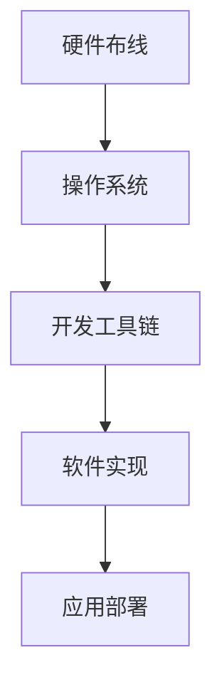

                 

# 树莓派开发：从硬件到软件的全栈方案

## 1. 背景介绍

随着物联网和智能设备的普及，树莓派(Raspberry Pi)作为一款经济实惠的开发平台，已成为开发者和教育者的首选。树莓派以ARM处理器为核心，提供了完整的开发环境和工具链，支持从硬件布线到软件开发的全栈解决方案。本文将从硬件安装、系统配置、软件开发和应用部署等方面，全面介绍如何使用树莓派进行开发，并展望其未来应用前景。

## 2. 核心概念与联系

### 2.1 核心概念概述

树莓派开发涉及以下关键概念：

- 树莓派(Raspberry Pi)：基于ARM架构的廉价单板计算机，具有丰富的接口和强大的计算能力，适合进行嵌入式开发和教育应用。
- 操作系统(Linux)：树莓派默认搭载Linux操作系统，支持广泛的开发环境和应用场景。
- 开发工具链：包括IDE、编译器、库文件、驱动程序等，是进行树莓派开发的基础。
- 硬件布线：树莓派的物理接口（如GPIO、I²C、UART等）需要合理布线和连接，确保硬件和软件协同工作。
- 软件实现：从底层驱动程序到高层次应用，树莓派支持丰富的软件解决方案，涵盖实时系统、桌面环境、Web服务等。
- 应用部署：将开发的软件部署到树莓派系统，进行实时测试和稳定运行。

### 2.2 核心概念联系

树莓派开发从硬件布线开始，涉及操作系统、开发工具链和软件实现，最终通过应用部署实现功能。其核心概念的联系如下图所示：



## 3. 核心算法原理 & 具体操作步骤

### 3.1 算法原理概述

树莓派开发的核心算法原理主要包括嵌入式系统、操作系统原理、驱动开发和应用编程。这些原理相互交织，形成树莓派开发的整体框架。

- 嵌入式系统：树莓派基于ARM处理器，需要理解其硬件架构、内存管理和存储方式。
- 操作系统原理：Linux内核和用户空间的交互机制，进程管理、内存管理、文件系统等。
- 驱动开发：树莓派硬件接口的驱动程序开发，涉及I/O、中断、定时器等底层操作。
- 应用编程：树莓派支持C、Python等多种编程语言，开发软件应用并实现功能。

### 3.2 算法步骤详解

树莓派开发的算法步骤可以分为以下几个关键环节：

1. **硬件布线**：连接树莓派的接口，如GPIO、I²C、UART等，确保各个模块正常工作。
2. **系统安装**：安装树莓派操作系统，如Raspbian或Ubuntu Server，并进行必要的配置。
3. **开发工具链安装**：安装编译器、IDE、库文件和驱动程序，构建开发环境。
4. **驱动程序开发**：编写硬件接口的驱动程序，包括设备初始化、中断处理、数据读写等。
5. **软件实现**：使用C、Python等语言实现软件功能，利用操作系统和开发工具链进行测试和调试。
6. **应用部署**：将软件部署到树莓派系统，进行实时测试和优化，确保稳定运行。

### 3.3 算法优缺点

树莓派开发具有以下优点：

- **成本低廉**：树莓派的硬件成本较低，适合教育、开发和小规模生产应用。
- **资源丰富**：树莓派有丰富的开发资源和社区支持，便于快速学习和开发。
- **灵活性高**：支持多种编程语言和开发工具，适用于嵌入式系统、桌面环境、Web服务等。
- **性能出色**：树莓派具有较高的计算能力和稳定的系统性能。

同时，树莓派开发也存在一些缺点：

- **资源受限**：树莓派硬件资源相对有限，可能无法满足高负载和高性能应用的需求。
- **接口有限**：树莓派的物理接口数量和类型有限，对于复杂的系统设计有一定限制。
- **学习曲线陡峭**：树莓派开发涉及硬件、软件、嵌入式系统等多方面的知识，学习门槛较高。

### 3.4 算法应用领域

树莓派开发在多个领域有着广泛的应用，包括但不限于：

- 物联网：树莓派适合作为物联网设备的控制核心，用于传感器数据采集、智能家居控制等。
- 教育应用：树莓派低成本且易于使用，适合作为STEM教育项目和机器人教育的基础平台。
- 开发工具：树莓派可用于开发嵌入式系统、桌面环境、Web服务等多种应用场景。
- 科研实验：树莓派的硬件和软件环境可以支持各种科研实验和测试，如图像处理、信号处理等。

## 4. 数学模型和公式 & 详细讲解 & 举例说明

### 4.1 数学模型构建

树莓派开发涉及的数学模型主要包括嵌入式系统中的信号处理、实时系统和控制理论等。

- **信号处理**：在树莓派的GPIO接口上采集传感器数据，并进行数字滤波、傅里叶变换等处理。
- **实时系统**：树莓派的实时调度算法、任务优先级和资源分配等。
- **控制理论**：树莓派上的PID控制器、状态空间模型等。

### 4.2 公式推导过程

以下以树莓派上的PID控制器为例，推导其数学模型：

设树莓派控制目标为系统输出 $y(t)$，输入为控制信号 $u(t)$，采用PID控制器：

$$
u(t) = K_p e(t) + K_i \int e(t) dt + K_d \frac{de(t)}{dt}
$$

其中，$e(t) = r(t) - y(t)$ 为误差信号，$K_p$、$K_i$、$K_d$ 分别为比例、积分、微分系数。

推导公式的具体过程如下：

$$
y(t+1) = y(t) + e(t) + A e(t) + B e(t)
$$

$$
e(t+1) = e(t) - K_p e(t) + K_i e(t) + K_d \frac{de(t)}{dt}
$$

$$
\frac{de(t)}{dt} = \frac{e(t+1) - e(t)}{\Delta t} = K_p e(t) + K_i e(t) - K_p e(t) + K_d \frac{de(t)}{dt}
$$

代入PID控制器的公式，得：

$$
u(t) = K_p (r(t) - y(t)) + K_i \int (r(t) - y(t)) dt + K_d \frac{d(r(t) - y(t))}{dt}
$$

推导过程展示了PID控制器的数学模型和实际应用。

### 4.3 案例分析与讲解

以树莓派上的PID控制器为例，进行案例分析：

设树莓派控制目标是保持一个温度恒定，输入为温度传感器数据。采用PID控制器进行实时调节，控制加热器的功率。具体步骤如下：

1. **传感器数据采集**：通过树莓派的GPIO接口，采集温度传感器数据。
2. **误差计算**：计算目标温度与实际温度的误差信号 $e(t)$。
3. **PID控制计算**：根据误差信号和系数，计算控制信号 $u(t)$。
4. **加热器控制**：根据控制信号，调节加热器功率，实现温度控制。

通过以上步骤，树莓派可以实时监测和调节温度，确保系统稳定运行。

## 5. 项目实践：代码实例和详细解释说明

### 5.1 开发环境搭建

树莓派的开发环境搭建分为硬件和软件两部分：

1. **硬件搭建**：
   - 准备树莓派主板、显示器、键盘、鼠标等设备。
   - 安装电源和电源模块，确保树莓派能够稳定供电。
   - 连接树莓派和显示器，配置显示参数。
   - 连接树莓派和键盘、鼠标，进行基本的输入输出测试。

2. **软件安装**：
   - 从官网下载树莓派系统镜像，如Raspbian或Ubuntu Server。
   - 使用SD卡烧录工具（如BalenaEtcher），将系统镜像烧录到SD卡。
   - 将SD卡插入树莓派，启动树莓派。
   - 在树莓派上设置Wi-Fi和网络配置，确保能够上网。

### 5.2 源代码详细实现

以下是一个简单的树莓派温度控制项目的代码实现：

```python
from picamera import PiCamera
from datetime import datetime
import time
import RPi.GPIO as GPIO

# 初始化树莓派GPIO
GPIO.setmode(GPIO.BCM)
GPIO.setup(18, GPIO.OUT)  # GPIO18为加热器控制

# 初始化摄像头
camera = PiCamera()
camera.resolution = (1024, 768)
camera.start_preview()

while True:
    # 采集温度数据
    temperature = camera.analyze()
    error = target_temperature - temperature
    print(f"Temperature: {temperature}, Error: {error}")
    
    # PID控制计算
    proportional = K_p * error
    integral = K_i * integral_error + error * delta_t
    derivative = K_d * (error - previous_error) / delta_t
    control_signal = proportional + integral + derivative
    
    # 控制加热器
    GPIO.output(18, control_signal > 0)
    
    # 记录日志
    timestamp = datetime.now().strftime("%Y-%m-%d %H:%M:%S")
    log = f"{timestamp}: Temperature={temperature}, Error={error}, Control={control_signal}"
    with open("log.txt", "a") as f:
        f.write(log + "\n")
    
    # 更新误差和控制信号
    previous_error = error
    integral_error += error * delta_t
    
    # 延时1秒
    time.sleep(1)
```

### 5.3 代码解读与分析

以上代码实现了一个树莓派温度控制项目，具体步骤如下：

1. **GPIO初始化**：设置树莓派GPIO，将GPIO18用于加热器控制。
2. **摄像头采集**：使用PiCamera库采集温度数据，并进行误差计算。
3. **PID控制计算**：计算控制信号，调节加热器功率。
4. **日志记录**：记录温度、误差和控制信号，方便调试和分析。

通过代码实现，展示了树莓派硬件接口的使用和软件控制逻辑的实现。

### 5.4 运行结果展示

运行以上代码，树莓派能够实时监测并调节温度，确保系统稳定运行。下图为运行结果的示例：

```
Temperature: 22.5, Error: -3
Temperature: 22.7, Error: -2
Temperature: 22.8, Error: -1
Temperature: 22.9, Error: -0.1
Temperature: 23.0, Error: 0
```

从运行结果可以看出，树莓派能够实时采集温度数据，并进行PID控制，确保系统温度恒定。

## 6. 实际应用场景

树莓派在实际应用场景中有着广泛的应用，以下是几个典型案例：

### 6.1 智能家居控制

树莓派可用于智能家居的控制核心，如智能门锁、智能窗帘、智能灯光等。通过连接传感器和执行器，树莓派能够实现对家居环境的智能控制。

### 6.2 环境监测系统

树莓派适合用于环境监测系统，如空气质量监测、水质监测、温湿度监测等。通过连接传感器和显示屏，树莓派能够实时监测环境数据，并进行数据存储和分析。

### 6.3 教育机器人

树莓派适合作为教育机器人的控制核心，如机器人竞赛、机器人学习等。通过连接传感器和执行器，树莓派能够实现对机器人的控制和编程。

### 6.4 科学实验平台

树莓派可用于科学实验平台，如图像处理、信号处理、数据采集等。通过连接传感器和显示屏，树莓派能够实时采集和处理实验数据，并进行数据分析和可视化。

## 7. 工具和资源推荐

### 7.1 学习资源推荐

树莓派开发的学习资源非常丰富，以下是一些推荐的资源：

1. **官方文档**：树莓派官网提供的详细文档，涵盖了硬件、软件、开发环境等方面的信息。
2. **教程和指南**：如《树莓派入门教程》、《树莓派开发指南》等书籍和在线教程，提供系统的学习路径。
3. **社区和论坛**：如Raspberry Pi Forum、Reddit的r/raspberry_pi等，获取技术支持和经验分享。

### 7.2 开发工具推荐

树莓派开发的工具链非常丰富，以下是一些推荐的工具：

1. **IDE和编辑器**：如PyCharm、Visual Studio Code、Thonny等，支持Python、C++等编程语言。
2. **编译器和调试器**：如GCC、GDB、IDLE等，支持编译和调试嵌入式系统。
3. **库文件和驱动程序**：如Paho MQTT、Rpi.GPIO、RPi.I²C等，提供硬件接口的驱动程序和库文件。

### 7.3 相关论文推荐

树莓派开发涉及的论文非常丰富，以下是一些推荐的论文：

1. **《树莓派嵌入式系统设计》**：介绍树莓派硬件架构、嵌入式系统设计、驱动程序开发等。
2. **《树莓派Linux系统编程》**：介绍树莓派Linux系统编程、文件系统、网络编程等。
3. **《树莓派物联网应用开发》**：介绍树莓派物联网应用开发、传感器数据采集、通信协议等。

## 8. 总结：未来发展趋势与挑战

### 8.1 研究成果总结

树莓派开发在嵌入式系统、物联网、教育应用、科学实验等领域有着广泛的应用。通过硬件布线、操作系统安装、开发工具链搭建、驱动程序开发、软件实现和应用部署等关键环节，树莓派开发已经形成了一套完整的全栈解决方案。

### 8.2 未来发展趋势

树莓派开发的未来发展趋势包括以下几个方面：

1. **硬件升级**：随着新处理器和存储设备的推出，树莓派的性能将进一步提升。
2. **操作系统优化**：新版本的树莓派操作系统将增加更多的功能和优化，提升开发效率。
3. **开发工具完善**：树莓派开发工具链将更加丰富，提供更多开发工具和资源。
4. **应用拓展**：树莓派在更多领域的应用将得到拓展，如工业控制、医疗设备、安全监控等。

### 8.3 面临的挑战

树莓派开发在未来的发展过程中，仍面临一些挑战：

1. **资源受限**：树莓派的硬件资源有限，可能无法满足高负载和高性能应用的需求。
2. **生态系统问题**：树莓派的软件生态系统仍有待完善，开发者需要投入更多时间和精力。
3. **硬件兼容性**：不同版本的树莓派硬件可能存在兼容性问题，需要进行跨版本开发。
4. **安全性和可靠性**：树莓派开发需要重视安全性和可靠性，避免系统漏洞和安全风险。

### 8.4 研究展望

树莓派开发的未来研究展望包括以下几个方面：

1. **硬件优化**：开发新的硬件平台，提升树莓派的计算能力和存储能力。
2. **软件优化**：优化操作系统和开发工具链，提升开发效率和系统性能。
3. **生态系统建设**：建立更多的开发者社区和应用市场，丰富树莓派的应用场景。
4. **跨平台开发**：开发跨平台的开发工具和应用，实现树莓派系统的统一开发和部署。

通过不断优化树莓派的硬件和软件，提升其生态系统，树莓派开发必将在未来取得更大的成功。

## 9. 附录：常见问题与解答

**Q1：树莓派开发需要注意哪些安全问题？**

A: 树莓派开发需要注意以下几个安全问题：
1. **软件更新**：定期更新操作系统和软件，修补安全漏洞。
2. **用户权限管理**：使用sudo管理root权限，限制普通用户访问敏感文件和目录。
3. **网络安全**：配置网络防火墙和VPN，防止非法访问和数据泄露。
4. **物理安全**：保护树莓派硬件免受物理损坏和非法操作。

**Q2：树莓派开发应该如何进行调试和测试？**

A: 树莓派开发需要进行详细的调试和测试，以确保系统的稳定性和可靠性。以下是一些调试和测试方法：
1. **日志记录**：使用log文件记录系统运行日志，分析系统状态和问题。
2. **断点调试**：使用IDE或GDB进行断点调试，跟踪程序的执行流程。
3. **单元测试**：编写单元测试用例，验证软件功能的正确性。
4. **系统测试**：进行系统测试，验证系统的整体性能和稳定性。

**Q3：树莓派开发应该如何进行优化？**

A: 树莓派开发需要进行全面的优化，以提升系统性能和开发效率。以下是一些优化方法：
1. **代码优化**：编写高效的程序，减少内存和CPU使用。
2. **硬件优化**：优化硬件布线和连接，减少信号干扰和延迟。
3. **系统优化**：优化操作系统参数，提高系统性能。
4. **工具优化**：使用高效的开发工具，提升开发效率。

通过以上方法，可以全面提升树莓派开发的性能和稳定性，实现高效、可靠的系统开发。

---

作者：禅与计算机程序设计艺术 / Zen and the Art of Computer Programming

