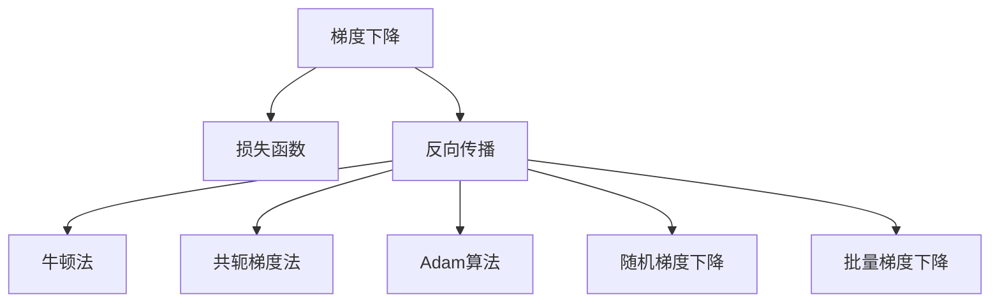

                 

# 梯度下降优化：从理论到实践

> 关键词：梯度下降，优化算法，损失函数，反向传播，牛顿法，共轭梯度法，Adam，随机梯度下降，批量梯度下降

## 1. 背景介绍

### 1.1 问题由来

在机器学习和深度学习中，模型参数的优化是一个核心问题。无论是线性回归、逻辑回归，还是神经网络，其目标都是通过最小化损失函数来优化模型参数，从而使得模型预测结果更加接近真实值。而如何高效、稳定地进行参数优化，成为各类优化算法的研究热点。

梯度下降（Gradient Descent, GD）作为机器学习中最基础且应用最广泛的优化算法之一，其基本思想是沿着损失函数梯度的反方向迭代更新模型参数，直到收敛到一个局部最优解。本文将从梯度下降的原理出发，深入探讨其理论基础和实际应用，重点分析不同梯度下降方法的特性和适用场景，并结合具体项目实例进行详细讲解。

## 2. 核心概念与联系

### 2.1 核心概念概述

为更好地理解梯度下降优化方法，本节将介绍几个密切相关的核心概念：

- 梯度下降（Gradient Descent）：一种常用的优化算法，通过迭代更新参数，最小化损失函数。梯度指向函数值增加最快的方向，因此通过反向传播计算梯度，沿梯度反方向更新参数，可以有效地降低损失值。

- 损失函数（Loss Function）：定义在输入和输出之间的函数，用于衡量模型的预测结果与真实值之间的误差。常见的损失函数包括均方误差、交叉熵、对数损失等。

- 反向传播（Backpropagation）：一种基于链式法则的计算方法，用于计算损失函数对模型参数的梯度，是梯度下降算法的核心步骤。

- 牛顿法（Newton's Method）：一种基于二阶导数的优化算法，通过求解二阶泰勒展开式的驻点来逼近最优解。适用于凸函数且函数值变化较平稳的场景。

- 共轭梯度法（Conjugate Gradient）：一种基于线性方程组求解的优化算法，具有快速收敛的性质，适用于大规模矩阵计算和稀疏矩阵问题。

- Adam算法（Adaptive Moment Estimation）：一种基于动量加自适应学习率的优化算法，在深度学习中表现优异，具有快速收敛、抗噪声能力强等优点。

- 随机梯度下降（Stochastic Gradient Descent, SGD）：梯度下降的一种变体，每次迭代使用一个样本计算梯度，适用于大数据集和计算资源有限的情况。

- 批量梯度下降（Batch Gradient Descent, BGD）：梯度下降的一种变体，每次迭代使用全部样本计算梯度，适用于数据量较小的情况。

这些核心概念之间的逻辑关系可以通过以下Mermaid流程图来展示：



这个流程图展示了大语言模型的核心概念及其之间的关系：

1. 梯度下降是机器学习中常用的优化方法。
2. 损失函数是评估模型预测与真实值之间差异的函数。
3. 反向传播是计算损失函数对模型参数梯度的关键技术。
4. 牛顿法和共轭梯度法是利用函数二阶导数的优化算法。
5. Adam算法是结合动量和自适应学习率的优化算法。
6. 随机梯度和批量梯度下降是梯度下降的变体，适用于不同场景。

这些概念共同构成了优化算法的框架，使得模型能够通过参数更新逐步逼近最优解。通过理解这些核心概念，我们可以更好地把握梯度下降优化的精髓和应用方向。

## 3. 核心算法原理 & 具体操作步骤

### 3.1 算法原理概述

梯度下降算法的基本思想是：通过不断迭代，使得模型参数接近于损失函数的极小值点。其核心步骤如下：

1. 随机初始化模型参数 $\theta_0$。
2. 计算损失函数 $L(\theta)$ 对参数 $\theta$ 的梯度 $\nabla_{\theta}L(\theta)$。
3. 以学习率 $\eta$ 更新参数，生成新的参数 $\theta_{k+1}=\theta_k-\eta\nabla_{\theta}L(\theta_k)$。
4. 重复步骤2和3，直到收敛。

其中，学习率 $\eta$ 的选择对算法的性能至关重要。如果 $\eta$ 过大，可能导致算法发散；如果 $\eta$ 过小，算法收敛速度会非常缓慢。因此，需要根据具体情况选择合适的学习率。

### 3.2 算法步骤详解

基于梯度下降的优化算法通常包括以下几个关键步骤：

**Step 1: 初始化模型参数**
- 随机初始化模型参数 $\theta_0$，通常使用均值为0的高斯分布。

**Step 2: 计算梯度**
- 使用反向传播算法计算损失函数 $L(\theta)$ 对参数 $\theta$ 的梯度 $\nabla_{\theta}L(\theta)$。
- 对于大规模问题，可以采用随机梯度下降（SGD）或批量梯度下降（BGD）来计算梯度，以节省计算时间。

**Step 3: 更新参数**
- 根据梯度 $\nabla_{\theta}L(\theta)$ 和学习率 $\eta$，计算新的参数值 $\theta_{k+1}=\theta_k-\eta\nabla_{\theta}L(\theta_k)$。
- 通过不断迭代，逐步逼近损失函数的极小值点。

**Step 4: 收敛检测**
- 设置最大迭代次数或预设的收敛条件，当满足收敛条件时停止迭代。
- 常见的收敛条件包括损失函数值的变化小于某个阈值，或梯度的大小小于某个阈值。

**Step 5: 输出结果**
- 输出最终的模型参数 $\theta^*$，作为模型的最优解。

以上是梯度下降优化算法的一般流程。在实际应用中，还需要针对具体问题进行优化设计，如设置合适的学习率、引入动量、使用自适应学习率等，以进一步提升算法的性能。

### 3.3 算法优缺点

梯度下降算法具有以下优点：
1. 简单易实现。梯度下降算法结构简单，容易理解和实现。
2. 适用于大多数优化问题。梯度下降算法适用于凸优化问题，而深度学习中的非凸问题也可以使用梯度下降算法进行求解。
3. 可解释性高。梯度下降算法的每一步更新都有明确的数学意义，易于理解和调试。

同时，梯度下降算法也存在一定的局限性：
1. 需要手动设置学习率。学习率的选择对算法性能影响较大，需要经验和调试来确定。
2. 容易陷入局部最优解。梯度下降算法容易陷入局部最优解，需要通过多种策略来跳出局部最优解。
3. 计算复杂度高。对于大规模问题，梯度下降算法的计算复杂度较高，需要优化以提高计算效率。

尽管存在这些局限性，但梯度下降算法仍是深度学习中最基础且最广泛使用的优化算法之一。

### 3.4 算法应用领域

梯度下降算法在机器学习和深度学习中得到了广泛应用，主要用于以下领域：

1. 线性回归：通过最小化均方误差损失函数，优化线性模型参数。
2. 逻辑回归：通过最小化对数损失函数，优化逻辑回归模型参数。
3. 神经网络：通过最小化交叉熵损失函数，优化神经网络模型参数。
4. 自然语言处理：通过最小化语言模型损失函数，优化NLP模型参数。
5. 计算机视觉：通过最小化分类损失函数，优化图像分类模型参数。

除了以上应用，梯度下降算法在优化问题的求解中也有广泛应用，如线性规划、最优化问题等。

## 4. 数学模型和公式 & 详细讲解 & 举例说明

### 4.1 数学模型构建

考虑一个简单的线性回归模型，定义损失函数为均方误差损失：

$$
L(\theta) = \frac{1}{2m} \sum_{i=1}^m (y_i - \theta^T x_i)^2
$$

其中，$y$ 为真实标签，$x$ 为输入特征，$m$ 为样本数量，$\theta$ 为模型参数。

根据梯度下降算法，我们需要计算损失函数对模型参数的梯度：

$$
\nabla_{\theta}L(\theta) = \frac{1}{m} \sum_{i=1}^m (y_i - \theta^T x_i) x_i
$$

其中，$x_i$ 为第 $i$ 个样本的特征向量，$y_i$ 为第 $i$ 个样本的真实标签。

### 4.2 公式推导过程

根据梯度下降算法，每次迭代更新模型参数的公式为：

$$
\theta_{k+1} = \theta_k - \eta \nabla_{\theta}L(\theta_k)
$$

其中，$\eta$ 为学习率，$\nabla_{\theta}L(\theta_k)$ 为损失函数对模型参数的梯度。

具体推导过程如下：

1. 计算梯度：

$$
\nabla_{\theta}L(\theta) = \frac{1}{m} \sum_{i=1}^m (y_i - \theta^T x_i) x_i
$$

2. 更新参数：

$$
\theta_{k+1} = \theta_k - \eta \frac{1}{m} \sum_{i=1}^m (y_i - \theta_k^T x_i) x_i
$$

### 4.3 案例分析与讲解

以简单的线性回归模型为例，我们通过具体的计算过程来理解梯度下降算法的工作原理。

假设有一个样本集 $\{(1,2),(3,4),(5,6)\}$，定义一个线性模型 $\theta = [\theta_1, \theta_2]^T$，损失函数为均方误差损失。

假设初始参数 $\theta_0 = [1,1]^T$，学习率 $\eta = 0.01$。

1. 计算梯度：

$$
\nabla_{\theta}L(\theta_0) = \frac{1}{3} \left( (2-1 \cdot 1)(1) + (4-1 \cdot 3)(3) + (6-1 \cdot 5)(5) \right) = \frac{1}{3} (1 + 3 + 5) = 3
$$

2. 更新参数：

$$
\theta_1 = \theta_{0_1} - \eta \nabla_{\theta}L(\theta_0) = 1 - 0.01 \cdot 3 = 0.99
$$

$$
\theta_2 = \theta_{0_2} - \eta \nabla_{\theta}L(\theta_0) = 1 - 0.01 \cdot 3 = 0.99
$$

3. 重复上述过程，直到收敛。

通过具体的计算过程，我们可以看到，每次迭代都是沿着损失函数的梯度方向更新参数，使得损失值逐步减小，最终收敛到一个最优解。

## 5. 项目实践：代码实例和详细解释说明

### 5.1 开发环境搭建

在进行梯度下降优化算法实践前，我们需要准备好开发环境。以下是使用Python进行TensorFlow开发的环境配置流程：

1. 安装Anaconda：从官网下载并安装Anaconda，用于创建独立的Python环境。

2. 创建并激活虚拟环境：
```bash
conda create -n tf-env python=3.8 
conda activate tf-env
```

3. 安装TensorFlow：根据CUDA版本，从官网获取对应的安装命令。例如：
```bash
conda install tensorflow tensorflow-gpu -c tf
```

4. 安装各类工具包：
```bash
pip install numpy pandas scikit-learn matplotlib tqdm jupyter notebook ipython
```

完成上述步骤后，即可在`tf-env`环境中开始梯度下降优化算法实践。

### 5.2 源代码详细实现

下面以TensorFlow实现梯度下降优化算法为例，给出完整的代码实现。

```python
import tensorflow as tf
import numpy as np

# 定义损失函数
def squared_loss(y_true, y_pred):
    return tf.reduce_mean(tf.square(y_true - y_pred))

# 定义模型
model = tf.keras.Sequential([
    tf.keras.layers.Dense(1, input_shape=(1,))
])

# 定义训练数据
x_train = np.array([1., 2., 3., 4., 5., 6.], dtype=np.float32)
y_train = np.array([2., 4., 6., 8., 10., 12.], dtype=np.float32)

# 定义优化器
optimizer = tf.keras.optimizers.SGD(learning_rate=0.1)

# 定义训练过程
@tf.function
def train_step(x, y):
    with tf.GradientTape() as tape:
        y_pred = model(x)
        loss = squared_loss(y, y_pred)
    gradients = tape.gradient(loss, model.trainable_variables)
    optimizer.apply_gradients(zip(gradients, model.trainable_variables))
    return loss

# 定义训练过程
epochs = 1000
for epoch in range(epochs):
    for i in range(len(x_train)):
        x_batch = x_train[i:i+1]
        y_batch = y_train[i:i+1]
        loss = train_step(x_batch, y_batch)

    if (epoch + 1) % 100 == 0:
        print("Epoch:", epoch+1, "Loss:", loss.numpy())
```

这段代码实现了一个简单的线性回归模型，通过梯度下降优化算法进行参数更新。代码的详细解释如下：

1. 首先定义了一个均方误差损失函数 `squared_loss`。
2. 然后定义了一个包含一个线性层的模型，输入为1维特征，输出为1维预测值。
3. 接着定义了训练数据 `x_train` 和 `y_train`，其中 `x_train` 为输入特征，`y_train` 为真实标签。
4. 定义了一个随机梯度下降优化器 `optimizer`，学习率为0.1。
5. 定义了一个训练过程 `train_step`，使用梯度下降算法更新模型参数。
6. 定义了训练循环，迭代1000次，每次迭代在训练数据上更新模型参数，并输出损失值。

### 5.3 代码解读与分析

让我们再详细解读一下关键代码的实现细节：

**定义损失函数**：
- 使用TensorFlow内置的 `tf.keras.losses.mean_squared_error` 函数计算均方误差损失。

**定义模型**：
- 使用 `tf.keras.Sequential` 定义了一个包含一个线性层的模型，输入为1维特征，输出为1维预测值。

**定义训练数据**：
- 定义了训练数据 `x_train` 和 `y_train`，其中 `x_train` 为输入特征，`y_train` 为真实标签。

**定义优化器**：
- 使用 `tf.keras.optimizers.SGD` 定义了一个随机梯度下降优化器，学习率为0.1。

**定义训练过程**：
- 使用 `tf.function` 定义了一个函数式接口 `train_step`，使用梯度下降算法更新模型参数。
- 在 `train_step` 函数中，首先计算损失值，然后使用 `tf.GradientTape` 计算梯度，最后使用 `optimizer.apply_gradients` 更新模型参数。

**定义训练循环**：
- 迭代1000次，每次迭代在训练数据上更新模型参数，并输出损失值。

通过这段代码，我们可以看到，TensorFlow提供了简单易用的接口，使得梯度下降算法的实现变得非常直观。

## 6. 实际应用场景

### 6.1 线性回归

线性回归是梯度下降算法最常见的应用场景之一。线性回归通过最小化损失函数，优化线性模型的参数，从而实现对数据趋势的拟合。在金融、经济、市场营销等领域，线性回归广泛应用于预测变量值，如股票价格、销售量、广告收入等。

### 6.2 神经网络

梯度下降算法是神经网络训练的核心优化算法。神经网络通过反向传播算法计算损失函数对模型参数的梯度，并使用梯度下降算法更新参数，从而实现对复杂非线性关系的拟合。在计算机视觉、自然语言处理、语音识别等领域，神经网络已广泛应用于图像分类、文本分类、语音识别等任务。

### 6.3 机器学习模型

除了神经网络，梯度下降算法还广泛应用于其他机器学习模型，如逻辑回归、支持向量机、决策树等。这些模型通过最小化损失函数，优化模型参数，从而实现对数据的分类、回归等任务。

## 7. 工具和资源推荐

### 7.1 学习资源推荐

为了帮助开发者系统掌握梯度下降优化理论基础和实践技巧，这里推荐一些优质的学习资源：

1. 《深度学习》（Ian Goodfellow等著）：该书是深度学习领域的经典教材，系统介绍了深度学习的理论基础和算法实现，包括梯度下降算法。

2. 《Python深度学习》（François Chollet著）：该书介绍了使用TensorFlow和Keras进行深度学习的实践，详细讲解了梯度下降算法的使用。

3. 《机器学习》（Tom Mitchell著）：该书介绍了机器学习的基本概念和算法，包括梯度下降算法。

4. 《神经网络与深度学习》（Michael Nielsen著）：该书介绍了神经网络的基本原理和算法，包括梯度下降算法。

5. Coursera《机器学习》课程（Andrew Ng主讲）：斯坦福大学开设的机器学习课程，讲解了梯度下降算法的基本原理和实际应用。

通过对这些资源的学习实践，相信你一定能够快速掌握梯度下降算法的精髓，并用于解决实际的机器学习和深度学习问题。

### 7.2 开发工具推荐

高效的开发离不开优秀的工具支持。以下是几款用于梯度下降算法开发的常用工具：

1. TensorFlow：由Google主导开发的开源深度学习框架，生产部署方便，适合大规模工程应用。支持各种深度学习模型和优化算法。

2. PyTorch：基于Python的开源深度学习框架，灵活动态的计算图，适合快速迭代研究。支持各种深度学习模型和优化算法。

3. Keras：基于TensorFlow和Theano的高层次深度学习框架，简单易用，适合初学者和快速原型开发。支持各种深度学习模型和优化算法。

4. Weights & Biases：模型训练的实验跟踪工具，可以记录和可视化模型训练过程中的各项指标，方便对比和调优。与主流深度学习框架无缝集成。

5. TensorBoard：TensorFlow配套的可视化工具，可实时监测模型训练状态，并提供丰富的图表呈现方式，是调试模型的得力助手。

6. Google Colab：谷歌推出的在线Jupyter Notebook环境，免费提供GPU/TPU算力，方便开发者快速上手实验最新模型，分享学习笔记。

合理利用这些工具，可以显著提升梯度下降算法的开发效率，加快创新迭代的步伐。

### 7.3 相关论文推荐

梯度下降算法在机器学习和深度学习中得到了广泛应用，以下是几篇奠基性的相关论文，推荐阅读：

1. Gradient Descent (1960)：梯度下降算法的历史渊源，介绍了梯度下降的基本思想和实现方法。

2. Adaptive Subgradient Methods for Online Learning and Stochastic Optimization (2011)：梯度下降算法的一种改进，提出了AdaGrad算法，实现了自适应学习率的优化。

3. On the Importance of Initialization and Momentum in Deep Learning (2015)：研究了初始化和动量对梯度下降算法的影响，提出了Nesterov动量算法。

4. Momentum (1998)：梯度下降算法的一种改进，提出了动量算法，加速了收敛过程。

5. RMSProp (2012)：梯度下降算法的一种改进，提出了RMSProp算法，实现了自适应学习率的优化。

6. AdaDelta (2012)：梯度下降算法的一种改进，提出了AdaDelta算法，实现了自适应学习率和动量的优化。

这些论文代表了大模型微调技术的发展脉络。通过学习这些前沿成果，可以帮助研究者把握学科前进方向，激发更多的创新灵感。

## 8. 总结：未来发展趋势与挑战

### 8.1 总结

本文对梯度下降优化算法进行了全面系统的介绍。首先阐述了梯度下降算法的基本思想和理论基础，明确了其在机器学习和深度学习中的核心地位。其次，从原理到实践，详细讲解了梯度下降算法的数学模型和具体实现步骤，给出了具体的代码实例和详细解释。同时，本文还探讨了梯度下降算法在不同领域的应用，展示了其在实际问题中的强大能力。

通过本文的系统梳理，我们可以看到，梯度下降算法作为深度学习中最基础且最广泛使用的优化算法之一，其应用领域广泛，影响深远。未来的研究需要在如何在不同场景下优化梯度下降算法，提升其计算效率和收敛性能，保持其在深度学习中的核心地位。

### 8.2 未来发展趋势

展望未来，梯度下降算法的未来发展趋势包括：

1. 自适应学习率的优化：自适应学习率算法，如AdaGrad、RMSProp、Adam等，通过自动调整学习率，显著提升了梯度下降算法的收敛速度和稳定性。未来将探索更多自适应学习率算法，以应对更复杂的优化问题。

2. 动量的改进：动量算法通过引入动量项，加速了梯度下降的收敛过程，减小了震荡。未来将探索更多动量改进方法，如Nesterov动量、动量衰减等，进一步提升梯度下降算法的性能。

3. 分布式优化的发展：随着大数据时代的到来，分布式优化算法成为梯度下降算法的必然趋势。未来将探索更多分布式优化方法，如分布式SGD、分布式Adam等，以支持大规模数据的优化问题。

4. 低精度计算的普及：低精度计算，如半精度浮点数计算，可以显著提高梯度下降算法的计算效率。未来将探索更多低精度计算方法，以支持高效计算。

5. 混合精度训练的推广：混合精度训练通过将浮点数据和定点数据混合计算，大大提高了计算效率和模型精度。未来将推广混合精度训练，以支持更大规模的深度学习模型。

这些趋势展示了梯度下降算法在未来深度学习中的重要地位，也预示了未来研究的方向和重点。

### 8.3 面临的挑战

尽管梯度下降算法在深度学习中已得到广泛应用，但在应用过程中仍面临一些挑战：

1. 模型过拟合：梯度下降算法容易陷入局部最优解，导致模型过拟合。未来需要探索更多优化方法，如自适应学习率、动量改进等，以应对过拟合问题。

2. 计算资源限制：大规模深度学习模型的训练需要大量的计算资源，未来需要探索更多优化方法，如分布式优化、低精度计算等，以支持大规模模型的训练。

3. 计算效率问题：梯度下降算法计算复杂度高，未来需要探索更多优化方法，如动量改进、混合精度训练等，以提高计算效率。

4. 学习率的选择：学习率的选择对梯度下降算法的性能影响较大，未来需要探索更多自适应学习率算法，以自动调整学习率。

5. 模型泛化能力不足：梯度下降算法对数据的分布变化敏感，未来需要探索更多优化方法，以提升模型的泛化能力。

这些挑战展示了梯度下降算法在实际应用中的一些问题，也预示了未来研究的重点和方向。

### 8.4 研究展望

面对梯度下降算法面临的挑战，未来的研究需要在以下几个方面寻求新的突破：

1. 探索更多自适应学习率算法：自适应学习率算法通过自动调整学习率，显著提升了梯度下降算法的收敛速度和稳定性。未来将探索更多自适应学习率算法，以应对更复杂的优化问题。

2. 改进动量算法：动量算法通过引入动量项，加速了梯度下降的收敛过程，减小了震荡。未来将探索更多动量改进方法，如Nesterov动量、动量衰减等，进一步提升梯度下降算法的性能。

3. 发展分布式优化算法：随着大数据时代的到来，分布式优化算法成为梯度下降算法的必然趋势。未来将探索更多分布式优化方法，如分布式SGD、分布式Adam等，以支持大规模数据的优化问题。

4. 推广低精度计算和混合精度训练：低精度计算和混合精度训练可以显著提高梯度下降算法的计算效率和模型精度。未来将推广这些技术，以支持更大规模的深度学习模型。

5. 研究梯度下降算法的理论基础：梯度下降算法的理论基础仍需深入研究，如收敛速度、收敛条件、稳定性等。未来将进一步研究这些理论问题，以提升梯度下降算法的科学性和可靠性。

这些研究方向展示了梯度下降算法未来可能的发展方向，也预示了未来研究的重点和难点。相信在研究者的不懈努力下，梯度下降算法将在深度学习中继续发挥其核心地位，推动深度学习技术的发展。

## 9. 附录：常见问题与解答

**Q1：梯度下降算法的学习率如何设置？**

A: 学习率的选择对梯度下降算法的性能影响较大，一般需要根据具体问题进行调整。常见的学习率选择方法包括手动调整、学习率衰减、自适应学习率等。学习率衰减可以通过定期降低学习率，防止学习率过快衰减；自适应学习率算法如AdaGrad、RMSProp、Adam等，可以自动调整学习率，提升算法性能。

**Q2：梯度下降算法的收敛速度如何？**

A: 梯度下降算法的收敛速度受到多种因素的影响，如学习率、动量、函数性质等。对于凸函数，梯度下降算法能够保证快速收敛；对于非凸函数，梯度下降算法可能陷入局部最优解。因此，在实际应用中，需要根据具体情况选择合适的优化方法和参数。

**Q3：梯度下降算法是否适用于大规模数据集？**

A: 梯度下降算法对于大规模数据集需要进行优化，以避免计算资源不足的问题。常用的优化方法包括随机梯度下降（SGD）、批量梯度下降（BGD）、小批量梯度下降等。这些方法通过每次迭代使用部分数据，减小了计算量，同时能够保持较好的收敛性能。

**Q4：梯度下降算法能否避免过拟合？**

A: 梯度下降算法容易陷入局部最优解，可能导致模型过拟合。为了避免过拟合，可以引入正则化技术，如L2正则化、Dropout等；或者使用自适应学习率算法，自动调整学习率；或者采用分布式优化算法，加速收敛过程。

**Q5：梯度下降算法有哪些变种？**

A: 梯度下降算法有多种变种，如批量梯度下降（BGD）、随机梯度下降（SGD）、小批量梯度下降等。此外，还有动量改进的算法，如Nesterov动量、动量衰减等；自适应学习率的算法，如AdaGrad、RMSProp、Adam等；以及分布式优化算法，如分布式SGD、分布式Adam等。

通过这些学习资源、开发工具和论文推荐，相信你一定能够快速掌握梯度下降算法的精髓，并用于解决实际的机器学习和深度学习问题。总之，梯度下降算法在深度学习中的应用广泛，影响深远，未来仍将保持其核心地位。

