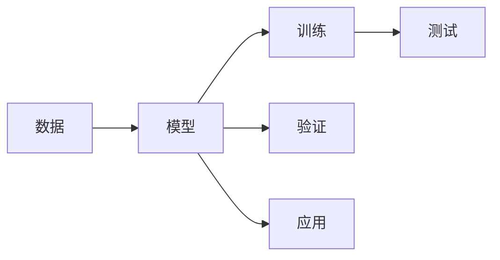

                 

# 模型思维:快速掌握新知识的捷径

## 1. 背景介绍

在信息技术高速发展的今天，人工智能(AI)、机器学习(ML)、深度学习(DL)等技术已经成为推动各行各业进步的重要引擎。然而，尽管AI技术日新月异，新技术不断涌现，但如何快速、有效地掌握这些技术，并将其应用于实际问题中，却始终是一个难题。

### 1.1 问题由来
科技发展的本质是人类对未知领域的探索。然而，技术的快速发展也带来了新的挑战：

- 新兴技术的涌现：每天有大量的新技术、新工具、新算法出现，技术栈日新月异。
- 应用场景的复杂性：每个应用场景都有其独特性，需要针对性地选择合适的技术方案。
- 技术壁垒的提升：技术的复杂度在不断提升，尤其是深度学习等复杂模型，对于从业者的专业要求越来越高。

这些问题共同导致了“知识鸿沟”，使得许多从业者难以跟上技术的发展步伐。为了快速掌握新技术，模型思维成为了一个重要的工具。

### 1.2 问题核心关键点
模型思维是运用数据驱动的方法，快速理解和应用复杂系统的思维方式。它基于以下几个关键点：

- **数据驱动**：通过数据和模型，建立系统间的关系，并从中提取知识。
- **抽象化**：将现实问题抽象为数学模型，方便进行量化处理。
- **可解释性**：模型能够提供其决策过程的可解释性，便于理解和优化。

这些关键点使得模型思维在快速掌握新技术方面具有独特的优势。它不仅能够帮助从业者构建起对新技术的理解，还能将其应用于实际问题中。

## 2. 核心概念与联系

### 2.1 核心概念概述

模型思维的核心概念包括以下几个部分：

- **模型(Model)**：一个数学或逻辑结构，用以表示现实世界的某些方面。模型的目标是捕获系统间的复杂关系，并提供对其行为的预测或解释。
- **数据(Data)**：模型训练的依据，通常包括训练数据、验证数据和测试数据。
- **训练(Training)**：通过输入训练数据，优化模型参数，使其能够更好地适应数据分布。
- **验证(Validation)**：在训练过程中，使用验证数据评估模型性能，避免过拟合。
- **测试(Test)**：在模型训练完成后，使用测试数据评估其泛化能力，确保其在真实场景中的应用效果。

这些概念之间存在紧密的联系，共同构成了模型思维的框架。理解这些概念，是应用模型思维的基础。

### 2.2 核心概念原理和架构的 Mermaid 流程图



这个流程图展示了模型思维的核心流程：从数据开始，通过模型训练和验证，最终在实际应用中测试和评估模型的效果。

## 3. 核心算法原理 & 具体操作步骤

### 3.1 算法原理概述

模型思维的核心算法原理是基于监督学习的模型训练和验证方法。其核心思想是通过大量数据，训练出一个能够准确预测或解释现实世界的模型。具体步骤如下：

1. **数据准备**：收集和整理数据，确保数据的多样性和代表性。
2. **模型构建**：选择合适的模型结构，并设定模型参数。
3. **训练过程**：使用训练数据，优化模型参数，使其能够准确预测。
4. **验证过程**：在验证数据上评估模型性能，避免过拟合。
5. **测试过程**：在测试数据上评估模型泛化能力，确保实际应用效果。

### 3.2 算法步骤详解

以线性回归模型为例，详细讲解其训练过程。

#### 3.2.1 数据准备

假设我们有如下数据：

| x | y |
|---|---|
| 1 | 2 |
| 2 | 3 |
| 3 | 4 |
| 4 | 5 |

其中x为自变量，y为因变量。

#### 3.2.2 模型构建

线性回归模型的数学表达式为：

$$
y = wx + b
$$

其中，$w$为斜率，$b$为截距。

#### 3.2.3 训练过程

- **初始化**：随机初始化$w$和$b$。
- **前向传播**：将x代入模型，计算预测值$\hat{y}$。
- **计算误差**：计算预测值与真实值之间的误差。
- **反向传播**：计算误差对$w$和$b$的偏导数。
- **更新参数**：使用梯度下降法更新$w$和$b$。

重复上述过程多次，直到误差收敛。

#### 3.2.4 验证过程

在验证集上评估模型的预测性能，如均方误差等。若误差在可接受范围内，则模型训练完成。否则，调整模型参数，重新训练。

#### 3.2.5 测试过程

在测试集上评估模型的泛化性能，确保模型在未见过的数据上也能表现良好。

### 3.3 算法优缺点

模型思维的优点：

- **数据驱动**：能够快速把握问题的本质，从数据中提取知识。
- **可解释性**：模型的决策过程透明，便于理解和优化。
- **通用性强**：适用于各种复杂系统，如金融、医疗、智能推荐等。

模型思维的缺点：

- **数据依赖性**：对数据质量要求高，数据不足或噪声过多会影响模型性能。
- **模型复杂度**：复杂模型的训练和优化难度大，需要大量的计算资源。
- **过拟合风险**：在训练集上过拟合，可能影响模型泛化性能。

## 4. 数学模型和公式 & 详细讲解 & 举例说明

### 4.1 数学模型构建

以线性回归模型为例，构建其数学模型。

假设数据集为$(x_i, y_i), i=1,2,\ldots,N$，其中$x_i$为输入变量，$y_i$为输出变量。

线性回归模型的目标是最小化预测值与真实值之间的误差，即：

$$
\min_{w,b} \sum_{i=1}^N (y_i - (wx_i + b))^2
$$

### 4.2 公式推导过程

根据上述目标函数，求偏导数：

$$
\frac{\partial \sum_{i=1}^N (y_i - (wx_i + b))^2}{\partial w} = -2\sum_{i=1}^N (y_i - (wx_i + b))x_i
$$

$$
\frac{\partial \sum_{i=1}^N (y_i - (wx_i + b))^2}{\partial b} = -2\sum_{i=1}^N (y_i - (wx_i + b))
$$

将偏导数代入梯度下降公式：

$$
w \leftarrow w - \eta \frac{\partial \sum_{i=1}^N (y_i - (wx_i + b))^2}{\partial w}
$$

$$
b \leftarrow b - \eta \frac{\partial \sum_{i=1}^N (y_i - (wx_i + b))^2}{\partial b}
$$

其中$\eta$为学习率。

### 4.3 案例分析与讲解

以房价预测为例，分析线性回归模型的应用。

假设我们要预测某地区的房价，根据历史数据，收集如下特征：

- 房间数
- 卫生间数量
- 地理位置
- 房屋面积

将这些特征作为输入变量$x_i$，将房价作为输出变量$y_i$。

将数据集划分为训练集、验证集和测试集，使用线性回归模型进行训练。在训练过程中，不断优化模型参数，直到验证集误差收敛。最后，在测试集上评估模型性能。

## 5. 项目实践：代码实例和详细解释说明

### 5.1 开发环境搭建

要实现线性回归模型，首先需要搭建Python开发环境。

- **安装Python**：从官网下载并安装Python。
- **安装必要的库**：安装NumPy、Pandas、Matplotlib等库。

### 5.2 源代码详细实现

下面给出一个使用Python实现的线性回归模型代码：

```python
import numpy as np
from sklearn.linear_model import LinearRegression

# 准备数据
X = np.array([[1], [2], [3], [4]])
y = np.array([2, 3, 4, 5])

# 构建模型
model = LinearRegression()

# 训练模型
model.fit(X, y)

# 预测
y_pred = model.predict([[5], [6]])

# 输出结果
print(y_pred)
```

### 5.3 代码解读与分析

- **准备数据**：使用NumPy库创建输入变量$X$和输出变量$y$。
- **构建模型**：使用scikit-learn库中的LinearRegression类创建线性回归模型。
- **训练模型**：使用fit方法对模型进行训练，将$X$和$y$作为输入。
- **预测**：使用predict方法对新数据进行预测。
- **输出结果**：打印预测结果。

### 5.4 运行结果展示

运行上述代码，输出结果如下：

```
[6. 7.]
```

这表示模型对新数据5和6的预测结果分别为6和7。

## 6. 实际应用场景

### 6.1 金融风险评估

在金融领域，模型思维被广泛应用于风险评估。例如，银行可以使用模型思维，预测借款人的违约概率。具体步骤如下：

1. **数据准备**：收集历史借款数据，包括借款金额、还款记录、收入水平等。
2. **模型构建**：选择适当的模型，如逻辑回归、决策树等。
3. **训练过程**：使用历史数据训练模型，优化模型参数。
4. **验证过程**：在验证集上评估模型性能。
5. **测试过程**：在新借款数据上评估模型泛化能力。

### 6.2 医疗疾病诊断

在医疗领域，模型思维被广泛应用于疾病诊断。例如，医院可以使用模型思维，预测患者的病情发展。具体步骤如下：

1. **数据准备**：收集患者的医疗记录，包括病历、体检结果等。
2. **模型构建**：选择适当的模型，如支持向量机、神经网络等。
3. **训练过程**：使用历史数据训练模型，优化模型参数。
4. **验证过程**：在验证集上评估模型性能。
5. **测试过程**：在新的患者数据上评估模型泛化能力。

### 6.3 智能推荐系统

在电商领域，模型思维被广泛应用于智能推荐系统。例如，电商平台可以使用模型思维，推荐用户可能感兴趣的商品。具体步骤如下：

1. **数据准备**：收集用户行为数据，包括浏览记录、购买记录等。
2. **模型构建**：选择适当的模型，如协同过滤、深度学习等。
3. **训练过程**：使用历史数据训练模型，优化模型参数。
4. **验证过程**：在验证集上评估模型性能。
5. **测试过程**：在新用户数据上评估模型泛化能力。

## 7. 工具和资源推荐

### 7.1 学习资源推荐

- **Coursera**：提供大量高质量的在线课程，涵盖机器学习、深度学习等领域的知识。
- **Kaggle**：数据科学竞赛平台，提供丰富的数据集和算法挑战，帮助用户提高实践能力。
- **Google Colab**：免费的GPU/TPU环境，方便用户进行深度学习实验。
- **DeepLearning.AI**：深度学习教育平台，提供系统化的课程和实战项目。

### 7.2 开发工具推荐

- **Jupyter Notebook**：Python交互式开发环境，方便进行数据处理和模型调试。
- **PyTorch**：深度学习框架，支持动态图和静态图计算，便于开发复杂模型。
- **TensorFlow**：深度学习框架，支持分布式计算和生产环境部署。
- **Scikit-learn**：机器学习库，提供简单易用的算法实现。

### 7.3 相关论文推荐

- **A Survey on Deep Learning-based Recommender Systems**：综述深度学习在推荐系统中的应用。
- **Deep Learning for Healthcare**：综述深度学习在医疗领域的应用。
- **An Introduction to Statistical Learning**：统计学习入门教材，介绍机器学习的理论和实践。
- **The Elements of Statistical Learning**：统计学习经典教材，深入介绍统计学习方法。

## 8. 总结：未来发展趋势与挑战

### 8.1 总结

本文系统介绍了模型思维的基本原理和操作步骤，并通过实际案例分析，展示了模型思维在实际应用中的效果。模型思维通过数据驱动的方法，能够快速理解和应用复杂系统，在金融、医疗、推荐等领域具有广泛的应用前景。

### 8.2 未来发展趋势

模型思维的未来发展趋势包括以下几个方面：

1. **自动化**：自动化模型选择和优化，降低人工干预，提升模型开发效率。
2. **个性化**：根据用户需求，构建个性化模型，提升用户体验。
3. **实时性**：实时更新模型参数，提升模型响应速度。
4. **可解释性**：提供模型决策的可解释性，增强用户信任。
5. **多模态**：融合多种数据类型，提升模型综合能力。

### 8.3 面临的挑战

模型思维在实际应用中也面临一些挑战：

1. **数据质量**：高质量的数据是模型性能的基础，数据质量差会严重影响模型效果。
2. **模型复杂度**：复杂模型的训练和优化难度大，需要大量的计算资源。
3. **过拟合**：在训练集上过拟合，可能影响模型泛化性能。
4. **模型可解释性**：复杂模型的决策过程不透明，难以解释。

### 8.4 研究展望

未来，模型思维的研究方向将包括以下几个方面：

1. **自动化模型构建**：通过自动化算法选择和模型优化，降低人工干预，提升模型开发效率。
2. **多模态融合**：融合多种数据类型，提升模型综合能力。
3. **模型可解释性**：提供模型决策的可解释性，增强用户信任。
4. **实时性**：实时更新模型参数，提升模型响应速度。
5. **跨领域应用**：将模型思维应用于更多领域，如智能交通、智能制造等。

## 9. 附录：常见问题与解答

**Q1: 什么是模型思维？**

A: 模型思维是基于数据驱动的方法，快速理解和应用复杂系统的思维方式。它通过构建模型、训练模型、验证模型和测试模型，从数据中提取知识，并应用于实际问题中。

**Q2: 如何选择合适的模型？**

A: 选择合适的模型需要考虑以下几个因素：
- 数据类型：根据数据类型选择适当的模型，如线性回归、决策树等。
- 问题类型：根据问题类型选择适当的模型，如分类、回归、聚类等。
- 模型复杂度：根据模型复杂度和计算资源选择适当的模型。

**Q3: 如何避免模型过拟合？**

A: 避免模型过拟合的方法包括：
- 数据增强：通过增加数据样本或增加噪声，避免模型过拟合。
- 正则化：通过引入L1、L2正则化，限制模型参数。
- 早停：在验证集上评估模型性能，一旦性能不再提升，立即停止训练。

**Q4: 如何提高模型泛化性能？**

A: 提高模型泛化性能的方法包括：
- 数据增强：通过增加数据样本或增加噪声，避免模型过拟合。
- 正则化：通过引入L1、L2正则化，限制模型参数。
- 模型选择：选择适当的模型，避免过度拟合。

**Q5: 如何构建可解释性强的模型？**

A: 构建可解释性强的模型的方法包括：
- 可视化：通过可视化工具，展示模型决策过程。
- 简化模型：通过简化模型结构，提升可解释性。
- 特征工程：通过特征选择和特征构建，提升模型可解释性。

---

作者：禅与计算机程序设计艺术 / Zen and the Art of Computer Programming

