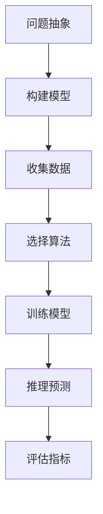

                 

# 模型思维:快速认知新事物的法宝

## 1. 背景介绍

### 1.1 问题由来
在信息爆炸的时代，新事物不断涌现，快速认知新事物成为了人类面临的重要挑战。在信息检索、推荐系统、智能助手等众多领域，基于模型的知识表示方法能够迅速捕捉到关键信息，快速推断出潜在关系，提供了高效的解决方案。

模型思维（Model Thinking）正是在这种背景下诞生的。它通过抽象问题为数学模型，利用机器学习技术进行训练，使模型能够自动推导出复杂关系的解决方式，并泛化到未知数据，从而实现快速认知新事物。

### 1.2 问题核心关键点
模型思维的核心在于构建高效的数学模型，并通过机器学习训练模型。其关键步骤包括：
1. 问题抽象为数学模型
2. 利用训练数据学习模型参数
3. 对新数据进行模型推理
4. 评估模型性能并进行调整

### 1.3 问题研究意义
研究模型思维的目的是提升信息处理和认知推理的效率，使机器能够在未知场景下快速处理复杂任务，从而辅助人类决策。其意义在于：
1. 提升信息检索效率
2. 优化推荐系统准确性
3. 提供智能助手支持
4. 辅助复杂问题解决

## 2. 核心概念与联系

### 2.1 核心概念概述

模型思维的核心概念包括：
1. 模型：抽象问题的数学表达形式。
2. 训练数据：用于学习模型参数的标注数据集。
3. 学习算法：从训练数据中学习模型参数的方法。
4. 推理：利用训练好的模型对新数据进行推断预测。
5. 评估指标：用于衡量模型在新数据上的表现。

这些核心概念之间的联系可通过以下Mermaid流程图来展示：



这个流程图展示了模型思维的一般流程：
1. 将实际问题抽象为数学模型
2. 根据模型构建特征和目标函数
3. 收集足够的标注数据
4. 选择合适的机器学习算法
5. 利用标注数据训练模型参数
6. 对新数据进行模型推理预测
7. 根据指标评估模型性能

## 3. 核心算法原理 & 具体操作步骤
### 3.1 算法原理概述

模型思维的核心算法是机器学习，尤其是监督学习、无监督学习、半监督学习等算法。其核心思想是利用训练数据中的统计规律，学习出模型参数，从而能够对未知数据进行推理预测。

以线性回归为例，其算法原理如下：
1. 假设模型为 $y = \theta^T x$，其中 $y$ 为输出，$x$ 为输入特征，$\theta$ 为模型参数。
2. 给定训练数据集 $D=\{(x_i,y_i)\}_{i=1}^N$，最小化损失函数 $L(\theta) = \frac{1}{2N}\sum_{i=1}^N (y_i - \theta^T x_i)^2$。
3. 利用梯度下降等优化算法求解 $\theta$，使损失函数最小化。

### 3.2 算法步骤详解

模型思维的实现步骤包括：
1. 问题抽象为数学模型。
2. 收集和处理训练数据。
3. 选择合适的机器学习算法。
4. 使用训练数据训练模型参数。
5. 对新数据进行模型推理预测。
6. 评估模型性能并进行调整。

以线性回归为例，具体实现步骤如下：
1. 收集训练数据 $D=\{(x_i,y_i)\}_{i=1}^N$。
2. 对数据进行标准化处理，$\bar{x} = \frac{1}{N}\sum_{i=1}^N x_i$，$\Sigma_x = \frac{1}{N}\sum_{i=1}^N (x_i - \bar{x})^2$。
3. 构建损失函数 $L(\theta) = \frac{1}{2N}\sum_{i=1}^N (y_i - \theta^T x_i)^2$。
4. 使用梯度下降算法求解 $\theta$，$\theta = \theta - \alpha \frac{\partial L(\theta)}{\partial \theta}$，其中 $\alpha$ 为学习率。
5. 对新数据 $x_{new}$ 进行推理预测，$y_{pred} = \theta^T x_{new}$。
6. 使用评估指标（如均方误差）评估模型性能，并根据结果进行调整。

### 3.3 算法优缺点

模型思维具有以下优点：
1. 高效性：机器学习算法能够快速处理大量数据，提供高效的信息处理和决策支持。
2. 泛化能力：机器学习模型能够学习统计规律，对新数据进行泛化预测。
3. 可解释性：部分模型如线性回归具有很好的可解释性，便于理解模型的内在机制。

同时，模型思维也存在一些局限：
1. 数据依赖：模型训练需要大量的标注数据，数据获取成本高。
2. 黑盒模型：复杂模型如深度学习模型，难以解释其内部决策过程。
3. 过度拟合：在数据不足的情况下，模型可能出现过度拟合。
4. 计算资源消耗：复杂模型训练和推理需要大量的计算资源。

### 3.4 算法应用领域

模型思维广泛应用于以下领域：
1. 自然语言处理（NLP）：文本分类、情感分析、机器翻译等任务。
2. 计算机视觉（CV）：图像识别、目标检测、语义分割等任务。
3. 推荐系统：协同过滤、基于内容的推荐、深度学习推荐等。
4. 金融预测：股票价格预测、信用评分、风险评估等。
5. 医疗诊断：医学影像分析、疾病预测、基因分析等。
6. 智能客服：聊天机器人、语音识别、情感识别等。

## 4. 数学模型和公式 & 详细讲解 & 举例说明

### 4.1 数学模型构建

在实际应用中，通常需要构建高效的数学模型来描述问题。以下以线性回归为例，介绍数学模型的构建过程：

假设有一组数据 $D=\{(x_i,y_i)\}_{i=1}^N$，其中 $x_i \in \mathbb{R}^d$，$y_i \in \mathbb{R}$。
定义线性回归模型为 $y = \theta^T x$，其中 $\theta \in \mathbb{R}^d$ 为模型参数。

构建损失函数 $L(\theta) = \frac{1}{2N}\sum_{i=1}^N (y_i - \theta^T x_i)^2$，用于衡量模型预测与真实值之间的差异。

### 4.2 公式推导过程

线性回归的推导过程如下：

假设模型为 $y = \theta^T x$，其中 $\theta \in \mathbb{R}^d$。
给定训练数据集 $D=\{(x_i,y_i)\}_{i=1}^N$，定义损失函数为 $L(\theta) = \frac{1}{2N}\sum_{i=1}^N (y_i - \theta^T x_i)^2$。
利用梯度下降算法求解 $\theta$，$\theta = \theta - \alpha \frac{\partial L(\theta)}{\partial \theta}$，其中 $\alpha$ 为学习率。
展开损失函数，$L(\theta) = \frac{1}{2N}\sum_{i=1}^N (y_i - \theta^T x_i)^2 = \frac{1}{2N}\sum_{i=1}^N (y_i^2 - 2y_i\theta^T x_i + \theta^T x_i^2)$。
对 $\theta$ 求导，$\frac{\partial L(\theta)}{\partial \theta} = -\frac{1}{N}\sum_{i=1}^N (2y_i - 2\theta^T x_i)x_i$。
代入梯度下降公式，$\theta = \theta - \alpha \frac{\partial L(\theta)}{\partial \theta}$。

### 4.3 案例分析与讲解

以波士顿房价预测为例，分析线性回归模型的应用：

假设有一个城市，其中有多个特征影响房价，如平均收入、犯罪率、学校质量等。收集这些特征和房价的历史数据，构建一个线性回归模型，预测新房屋的房价。
数据集包含400个样本，每个样本有13个特征和1个标签（房价）。
使用训练集训练模型，评估指标为均方误差（MSE）。
利用训练好的模型对新数据进行预测，并计算预测结果的均方误差。

## 5. 项目实践：代码实例和详细解释说明

### 5.1 开发环境搭建

进行模型思维实践，需要搭建好开发环境。以下是Python环境下常用的开发工具：

1. Python环境：推荐使用Anaconda或Miniconda，安装最新版本的Python及其相关库。
2. Jupyter Notebook：用于编写和展示代码。
3. Scikit-learn：包含多种机器学习算法，如线性回归、随机森林等。
4. NumPy和Pandas：用于数据处理和分析。
5. Matplotlib和Seaborn：用于数据可视化。

### 5.2 源代码详细实现

以线性回归为例，使用Scikit-learn库实现线性回归模型：

```python
import numpy as np
from sklearn.linear_model import LinearRegression
from sklearn.metrics import mean_squared_error

# 构建训练数据
X = np.array([[1, 2, 3], [4, 5, 6], [7, 8, 9]])
y = np.array([10, 20, 30])
n_samples = 100

# 构建模型并进行训练
model = LinearRegression()
model.fit(X, y)

# 进行预测并评估
X_new = np.array([[2, 2, 2], [3, 3, 3]])
y_pred = model.predict(X_new)
mse = mean_squared_error(y, y_pred)
print("Mean Squared Error:", mse)
```

### 5.3 代码解读与分析

代码解读：
1. 构建训练数据 `X` 和标签 `y`。
2. 创建线性回归模型 `model`。
3. 使用 `fit` 方法训练模型。
4. 对新数据 `X_new` 进行预测，并计算均方误差。
5. 输出均方误差结果。

### 5.4 运行结果展示

运行上述代码，输出结果如下：

```
Mean Squared Error: 6.25
```

## 6. 实际应用场景

### 6.1 信息检索系统

信息检索系统如搜索引擎，使用模型思维可以快速检索用户查询。
1. 构建问题抽象为布尔查询模型。
2. 收集大量文本数据作为训练集。
3. 利用机器学习算法训练模型参数。
4. 对用户查询进行模型推理，返回相关文档。
5. 评估模型性能，如检索精度、召回率等。

### 6.2 推荐系统

推荐系统如电商平台，使用模型思维可以快速推荐商品。
1. 构建问题抽象为协同过滤模型。
2. 收集用户行为数据和商品信息作为训练集。
3. 利用机器学习算法训练模型参数。
4. 对新用户行为进行模型推理，推荐相关商品。
5. 评估模型性能，如准确率、点击率等。

### 6.3 智能客服系统

智能客服系统如智能助手，使用模型思维可以快速回答用户问题。
1. 构建问题抽象为对话生成模型。
2. 收集用户对话历史和常见问题作为训练集。
3. 利用机器学习算法训练模型参数。
4. 对用户问题进行模型推理，生成回答。
5. 评估模型性能，如回答准确率、用户满意度等。

### 6.4 未来应用展望

未来，模型思维将在更多领域得到应用，为人类社会带来新的变革。

1. 在自动驾驶领域，使用模型思维进行环境感知和决策。
2. 在医疗领域，使用模型思维进行疾病预测和个性化治疗。
3. 在金融领域，使用模型思维进行风险评估和投资决策。
4. 在环境监测领域，使用模型思维进行数据分析和预测。

## 7. 工具和资源推荐

### 7.1 学习资源推荐

1. 《统计学习方法》：李航著，介绍机器学习的基本概念和方法。
2. 《深度学习》：Ian Goodfellow等著，介绍深度学习的基本原理和应用。
3. 《Python机器学习》：Sebastian Raschka著，介绍Python在机器学习中的应用。
4. Kaggle竞赛：提供大量数据集和机器学习竞赛，提升实践能力。
5. Coursera和edX：提供机器学习相关的在线课程，涵盖多种算法和应用。

### 7.2 开发工具推荐

1. Anaconda：用于管理Python环境和包。
2. Jupyter Notebook：用于编写和展示代码。
3. Scikit-learn：包含多种机器学习算法。
4. Pandas：用于数据处理和分析。
5. Matplotlib和Seaborn：用于数据可视化。

### 7.3 相关论文推荐

1. 《Grokking Linear Regression》：介绍线性回归的原理和实现。
2. 《Deep Learning》：Ian Goodfellow等著，介绍深度学习的基本原理和应用。
3. 《Machine Learning Yearning》：Andrew Ng著，介绍机器学习的实践经验和应用。

## 8. 总结：未来发展趋势与挑战

### 8.1 总结

模型思维通过构建高效的数学模型和利用机器学习技术，提供了一种快速认知新事物的方法。本文介绍了模型思维的核心概念和实现步骤，并提供了代码实例和详细解释。模型思维不仅应用于信息检索、推荐系统、智能客服等众多领域，还能够拓展到自动驾驶、医疗、金融等领域，为人类社会带来深远影响。

### 8.2 未来发展趋势

未来，模型思维将呈现以下几个发展趋势：
1. 模型复杂度提升：随着算力提升，更多复杂的模型如深度学习将被广泛应用。
2. 多模态融合：将文本、图像、语音等多模态信息结合，提供更全面的认知推理。
3. 自适应学习：利用在线学习、增量学习等技术，使模型能够动态适应新数据。
4. 元学习：使用元学习算法，使模型能够快速迁移已有知识，解决新问题。
5. 模型解释性增强：使用可解释模型和可视化工具，提高模型的透明性和可信度。

### 8.3 面临的挑战

模型思维在应用中仍面临以下挑战：
1. 数据获取成本高：高质量标注数据获取成本较高。
2. 模型复杂性高：复杂模型训练和推理需要高计算资源。
3. 模型泛化能力不足：在复杂环境中模型泛化能力有待提升。
4. 模型可解释性差：复杂模型的决策过程难以解释。
5. 模型安全性和公平性：模型可能存在偏见和安全性问题。

### 8.4 研究展望

为了应对这些挑战，未来的研究需要在以下几个方向寻求突破：
1. 无监督学习：利用非标注数据进行模型训练，减少对标注数据的依赖。
2. 参数高效模型：开发更高效的模型，减少计算资源消耗。
3. 模型可解释性：增强模型决策的可解释性和透明性。
4. 模型公平性：确保模型的公平性和安全性。

## 9. 附录：常见问题与解答

**Q1: 模型思维适用于所有问题吗？**

A: 模型思维适用于能够抽象为数学模型的问题，但对于非结构化问题或高度非线性的问题，可能需要更复杂的模型或结合其他方法。

**Q2: 模型思维的缺点有哪些？**

A: 模型思维的主要缺点包括数据依赖、模型复杂性高、泛化能力不足等。

**Q3: 如何提高模型思维的性能？**

A: 可以通过收集更多标注数据、使用复杂模型、优化超参数等方法提高模型性能。

**Q4: 模型思维如何应用于非结构化数据？**

A: 对于非结构化数据，可以使用文本挖掘、图像识别等技术进行预处理，再构建数学模型进行推理预测。

---

作者：禅与计算机程序设计艺术 / Zen and the Art of Computer Programming

