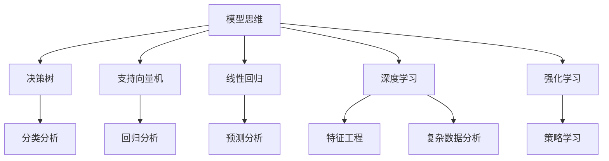

                 

# 模型思维在决策分析中的运用

> 关键词：模型思维,决策分析,机器学习,深度学习,强化学习,特征工程,大数据,数据分析

## 1. 背景介绍

### 1.1 问题由来
在当今信息爆炸的时代，决策者们面临着前所未有的复杂性。无论是企业战略制定、市场营销策略，还是金融投资选择，决策的正确性都直接关系到最终的成败。过去依赖经验与直觉的决策方式，已经无法适应日益复杂的数据环境。因此，一种将模型思维与决策分析相结合的新方法应运而生。这种结合能够将数据的客观分析与决策者的主观判断巧妙地融合，为复杂环境下的决策提供强有力的支持。

### 1.2 问题核心关键点
本节将探讨模型思维在决策分析中的运用，分析如何通过机器学习、深度学习、强化学习等先进技术，构建数据驱动的决策模型。这些模型不仅能够处理大量数据，还能自动发现数据中的模式和规律，从而辅助决策者做出更为精准的判断。

### 1.3 问题研究意义
将模型思维引入决策分析，有助于：
- **提升决策质量**：通过数据驱动的模型，决策者可以获得更为准确的分析结果，减少主观判断的偏差。
- **优化决策效率**：自动化模型能够快速处理海量数据，提供实时分析支持，极大地提升了决策效率。
- **增强决策可解释性**：模型的输出结果能够提供详细的解释和建议，帮助决策者理解决策背后的逻辑。
- **应对不确定性**：通过多种模型的结合和验证，决策者能够更好地应对市场波动和不确定性，做出更为稳健的决策。

## 2. 核心概念与联系

### 2.1 核心概念概述

为更好地理解模型思维在决策分析中的运用，本节将介绍几个密切相关的核心概念：

- **模型思维**：将复杂问题抽象为数学模型，通过数据和算法求解，辅助决策过程的一种思维方式。
- **决策树**：一种基于树形结构的机器学习模型，用于分类和回归分析。
- **支持向量机(SVM)**：一种常用的分类和回归模型，利用边界的最大间隔进行优化。
- **线性回归**：一种用于建立输入和输出之间线性关系的模型，常用于预测和分析。
- **深度学习**：一种通过多层次神经网络进行学习和预测的模型，常用于处理复杂和高维数据。
- **强化学习**：一种通过与环境互动，学习最优策略的模型，适用于动态和交互性强的问题。

这些核心概念之间的逻辑关系可以通过以下Mermaid流程图来展示：



这个流程图展示了几大核心概念之间的关系：

1. 模型思维是核心，通过不同的模型（如决策树、SVM、线性回归、深度学习和强化学习）解决不同类型的决策问题。
2. 特征工程是关键步骤，对数据进行特征提取和转换，提升模型效果。
3. 分类、回归、预测和策略学习是模型思维在不同场景中的应用，每个模型都有其特定的优势和适用领域。

## 3. 核心算法原理 & 具体操作步骤
### 3.1 算法原理概述

模型思维在决策分析中的运用，主要通过构建数据驱动的决策模型来实现。这些模型能够自动从数据中学习，并发现数据中的模式和规律，从而辅助决策者做出更加精准的决策。

形式化地，假设有一组数据集 $D=\{(x_i,y_i)\}_{i=1}^N$，其中 $x_i$ 为输入特征，$y_i$ 为对应输出（目标变量）。决策模型的目标是找到最优的函数 $f(x)$，使得模型在 $D$ 上的预测准确度最高。

常用的模型包括：
- **决策树**：通过树形结构划分特征空间，最终输出预测结果。
- **支持向量机**：寻找最优超平面，将不同类别数据分开。
- **线性回归**：建立输入与输出之间的线性关系，用于预测连续数值。
- **深度学习**：通过多层神经网络对数据进行学习，提取特征和规律。
- **强化学习**：通过与环境的交互，学习最优策略，适用于动态环境。

### 3.2 算法步骤详解

模型思维在决策分析中的具体步骤包括：

1. **数据准备**：收集和处理数据，确保数据质量和完整性。
2. **特征工程**：对数据进行特征提取和转换，提升模型性能。
3. **模型选择**：根据问题类型和数据特点，选择合适的模型。
4. **模型训练**：使用训练集数据，通过优化算法训练模型参数。
5. **模型验证**：在验证集上评估模型性能，调整超参数。
6. **模型应用**：使用测试集评估模型最终性能，并将其应用于实际决策场景。

### 3.3 算法优缺点

模型思维在决策分析中的运用具有以下优点：
- **自动化分析**：模型能够自动化地处理大量数据，提升分析效率。
- **可解释性强**：模型输出的结果可以提供详细的解释和建议，提高决策透明度。
- **通用性强**：适用于各种类型的数据和问题，适用范围广。

同时，这种技术也存在一些局限性：
- **数据依赖**：模型的效果依赖于数据的质量和数量，数据偏差会影响结果。
- **模型复杂**：复杂的模型可能需要大量的计算资源和时间，难以实时处理。
- **可解释性有限**：某些模型（如深度学习）的决策过程复杂，难以解释。

### 3.4 算法应用领域

模型思维在决策分析中的应用领域广泛，涵盖：

- **金融风险管理**：通过分析历史数据，构建风险评估模型，预测市场波动。
- **市场营销策略**：通过消费者行为数据，建立用户画像，优化营销策略。
- **供应链优化**：通过供应链数据，构建预测和优化模型，提升运营效率。
- **医疗诊断**：通过患者数据，建立诊断模型，辅助医生决策。
- **智能制造**：通过生产数据，优化生产计划和资源分配。

## 4. 数学模型和公式 & 详细讲解 & 举例说明（备注：数学公式请使用latex格式，latex嵌入文中独立段落使用 $$，段落内使用 $)
### 4.1 数学模型构建

假设我们有一个线性回归模型 $y = \beta_0 + \beta_1x_1 + \beta_2x_2 + \ldots + \beta_px_p + \epsilon$，其中 $\beta_i$ 为回归系数，$\epsilon$ 为随机误差。模型目标是最小化预测值与真实值之间的平方误差，即：

$$
\min_{\beta} \sum_{i=1}^N (y_i - (\beta_0 + \beta_1x_{i1} + \beta_2x_{i2} + \ldots + \beta_px_{ip}))^2
$$

### 4.2 公式推导过程

线性回归模型的参数 $\beta$ 可以通过最小二乘法求解：

$$
\hat{\beta} = (X^TX)^{-1}X^Ty
$$

其中 $X$ 为自变量矩阵，$y$ 为目标变量向量。

### 4.3 案例分析与讲解

以金融风险管理为例，假设我们有一组历史贷款数据，包括借款人信用评分、贷款额度、收入等信息，以及贷款是否违约的标签。我们可以使用线性回归模型预测贷款违约的概率：

- **数据准备**：收集贷款历史数据，包括特征（如信用评分、贷款额度、收入）和目标变量（违约/不违约）。
- **特征工程**：对数据进行标准化处理，提取有用特征。
- **模型训练**：使用训练集数据，通过最小二乘法求解模型参数 $\hat{\beta}$。
- **模型验证**：在验证集上评估模型性能，调整超参数。
- **模型应用**：使用测试集评估模型最终性能，并应用于新贷款的风险评估。

## 5. 项目实践：代码实例和详细解释说明
### 5.1 开发环境搭建

在进行模型思维在决策分析中的实践前，我们需要准备好开发环境。以下是使用Python进行Scikit-learn开发的Python环境配置流程：

1. 安装Anaconda：从官网下载并安装Anaconda，用于创建独立的Python环境。
2. 创建并激活虚拟环境：
```bash
conda create -n skl-env python=3.8
conda activate skl-env
```

3. 安装Scikit-learn：
```bash
pip install -U scikit-learn
```

4. 安装各类工具包：
```bash
pip install numpy pandas matplotlib seaborn statsmodels tqdm jupyter notebook ipython
```

完成上述步骤后，即可在`skl-env`环境中开始项目实践。

### 5.2 源代码详细实现

下面我们以金融风险管理为例，给出使用Scikit-learn进行线性回归模型构建的Python代码实现。

首先，定义数据准备函数：

```python
import pandas as pd
from sklearn.model_selection import train_test_split
from sklearn.preprocessing import StandardScaler
from sklearn.linear_model import LinearRegression

def load_and_preprocess_data(path):
    data = pd.read_csv(path)
    features = data[['credit_score', 'loan_amount', 'income']]
    target = data['default']
    
    scaler = StandardScaler()
    features = scaler.fit_transform(features)
    
    return train_test_split(features, target, test_size=0.2, random_state=42)
```

然后，定义模型训练和评估函数：

```python
from sklearn.metrics import mean_squared_error, r2_score

def train_and_evaluate_model(X_train, X_test, y_train, y_test):
    model = LinearRegression()
    model.fit(X_train, y_train)
    
    y_pred = model.predict(X_test)
    mse = mean_squared_error(y_test, y_pred)
    r2 = r2_score(y_test, y_pred)
    
    return mse, r2
```

最后，启动模型训练和评估流程：

```python
X_train, X_test, y_train, y_test = load_and_preprocess_data('data.csv')
mse, r2 = train_and_evaluate_model(X_train, X_test, y_train, y_test)
print(f"MSE: {mse:.4f}, R2 Score: {r2:.4f}")
```

以上就是使用Scikit-learn对金融风险管理模型进行线性回归训练的完整代码实现。可以看到，Scikit-learn封装了线性回归模型的训练、评估等核心功能，使得模型思维在决策分析中的应用变得简洁高效。

### 5.3 代码解读与分析

让我们再详细解读一下关键代码的实现细节：

**load_and_preprocess_data函数**：
- 读取数据集，并将特征和目标变量分开。
- 对特征进行标准化处理，使其均值为0，方差为1。
- 将数据集划分为训练集和测试集。

**train_and_evaluate_model函数**：
- 实例化线性回归模型，使用训练集数据拟合模型。
- 在测试集上预测目标变量，计算均方误差（MSE）和决定系数（R2 Score）。

**训练流程**：
- 定义测试集和训练集的路径，调用数据准备函数进行数据加载和预处理。
- 调用模型训练函数进行模型训练，并输出均方误差和R2 Score。

可以看到，Scikit-learn提供了便捷的API接口，使得线性回归模型的训练和评估变得简单易行。开发者可以将更多精力放在数据处理、模型改进等高层逻辑上，而不必过多关注底层的实现细节。

当然，工业级的系统实现还需考虑更多因素，如模型的保存和部署、超参数的自动搜索、更灵活的任务适配层等。但核心的模型思维和决策分析逻辑基本与此类似。

## 6. 实际应用场景
### 6.1 金融风险管理

基于模型思维的金融风险管理，能够利用历史数据预测贷款违约风险，为银行等金融机构提供风险评估支持。具体而言，通过收集贷款历史数据，利用线性回归等模型，可以建立违约概率预测模型，根据借款人的信用评分、贷款额度、收入等信息，预测其违约概率。银行可以根据模型输出，制定相应的风险控制策略，减少不良贷款的发生。

### 6.2 市场营销策略

企业可以通过分析消费者行为数据，建立消费者画像，优化市场营销策略。例如，通过收集用户的浏览历史、购买记录、社交媒体互动等信息，使用聚类算法（如K-Means）将用户分为不同的群体，并针对不同群体进行个性化营销。通过不断优化模型，企业可以提升广告点击率、销售额等关键指标。

### 6.3 供应链优化

供应链管理中，通过分析历史订单数据，可以建立预测和优化模型，提升供应链运营效率。例如，使用时间序列模型（如ARIMA）预测需求量，优化库存水平。通过模型评估和调整，企业可以降低库存成本，提高物流效率。

### 6.4 医疗诊断

在医疗诊断中，通过收集患者的医疗记录和生理指标，使用支持向量机等模型，可以辅助医生进行疾病诊断。例如，使用SVM模型对患者的症状和病历进行分类，预测疾病类型。医生可以根据模型输出，结合临床经验，做出更为准确的诊断。

### 6.5 智能制造

智能制造中，通过分析生产数据，可以建立预测和优化模型，提升生产效率。例如，使用时间序列模型预测设备故障，优化维护计划。通过模型评估和调整，制造企业可以降低停机时间，提高生产效率。

## 7. 工具和资源推荐
### 7.1 学习资源推荐

为了帮助开发者系统掌握模型思维在决策分析中的运用，这里推荐一些优质的学习资源：

1. 《统计学习方法》书籍：李航教授所著，系统介绍了机器学习和统计学习的基本概念和算法。
2. 《机器学习实战》书籍：Peter Harrington所著，通过实际案例，介绍了Scikit-learn等常用机器学习库的使用。
3. 《深度学习》课程：斯坦福大学Andrew Ng教授的Coursera课程，深入讲解了深度学习的基本原理和应用。
4. Kaggle平台：提供丰富的数据集和比赛，帮助开发者实践和提升模型思维能力。
5. GitHub资源：GitHub上开源了大量机器学习和决策分析的项目，提供学习和参考的范例。

通过对这些资源的学习实践，相信你一定能够快速掌握模型思维在决策分析中的精髓，并用于解决实际的决策问题。
###  7.2 开发工具推荐

高效的开发离不开优秀的工具支持。以下是几款用于模型思维在决策分析中的开发的常用工具：

1. Scikit-learn：基于Python的开源机器学习库，提供了丰富的模型选择和评估功能，支持多种算法。
2. TensorFlow：由Google主导开发的开源深度学习框架，生产部署方便，适合大规模工程应用。
3. Keras：基于TensorFlow和Theano等深度学习库的高层API，易于使用。
4. PyTorch：基于Python的开源深度学习框架，灵活动态的计算图，适合快速迭代研究。
5. Jupyter Notebook：交互式的数据科学环境，支持Python、R等多种语言，提供代码编写和结果展示的便利。

合理利用这些工具，可以显著提升模型思维在决策分析中的应用效率，加快创新迭代的步伐。

### 7.3 相关论文推荐

模型思维在决策分析中的应用源于学界的持续研究。以下是几篇奠基性的相关论文，推荐阅读：

1. "Regression Analysis by Example" by Rayher & Rodriguez (2017)：介绍了回归分析的基本原理和应用。
2. "Support Vector Machines" by Schölkopf & Smola (2002)：介绍了支持向量机的基本原理和算法。
3. "The Elements of Statistical Learning" by Hastie, Tibshirani & Friedman (2009)：全面介绍了统计学习的基本概念和算法。
4. "Pattern Recognition and Machine Learning" by Bishop (2006)：介绍了模式识别和机器学习的基本原理和应用。
5. "Neural Networks and Deep Learning" by Goodfellow, Bengio & Courville (2016)：介绍了深度学习的基本原理和应用。

这些论文代表了大数据和模型思维在决策分析中的应用趋势，通过学习这些前沿成果，可以帮助研究者把握学科前进方向，激发更多的创新灵感。

## 8. 总结：未来发展趋势与挑战

### 8.1 总结

本文对模型思维在决策分析中的运用进行了全面系统的介绍。首先阐述了模型思维的广泛应用背景和其对决策分析的重要意义。接着，从原理到实践，详细讲解了线性回归、支持向量机、深度学习等核心算法的原理和步骤，并给出了模型思维在金融风险管理、市场营销、供应链优化等多个领域的应用实例。此外，本文还精选了学习资源和开发工具，力求为读者提供全方位的技术指引。

通过本文的系统梳理，可以看到，模型思维在决策分析中的运用已经成为数据驱动决策的重要手段。这种结合了数据驱动和人类智慧的决策方式，将极大地提升决策的科学性和准确性，推动各行各业向智能化方向发展。

### 8.2 未来发展趋势

展望未来，模型思维在决策分析中的运用将呈现以下几个发展趋势：

1. **算法自动化**：随着自动化机器学习（AutoML）和深度学习技术的发展，决策模型将更加自动化和智能化，能够自动优化模型参数和算法选择。
2. **模型可解释性**：为了应对决策过程中的不确定性和风险，模型输出的可解释性将成为重要研究方向。通过可解释性技术，决策者能够更好地理解和信任模型结果。
3. **多模态融合**：未来的决策模型将能够融合多种数据源（如文本、图像、语音等），形成多模态决策支持系统。这种多模态融合将极大地提升决策的全面性和准确性。
4. **实时决策支持**：随着云计算和大数据技术的发展，实时决策支持将成为可能。通过实时数据流处理和模型推理，决策者可以迅速响应市场变化和动态需求。
5. **跨领域应用**：模型思维在决策分析中的应用将扩展到更多领域，如城市管理、交通规划、智能家居等，推动各行各业向智能化方向发展。

### 8.3 面临的挑战

尽管模型思维在决策分析中的应用已经取得了显著进展，但在迈向更加智能化、普适化应用的过程中，仍面临诸多挑战：

1. **数据隐私与安全**：大规模数据收集和使用过程中，数据隐私和安全问题将成为重要挑战。如何在保障数据隐私的同时，实现数据驱动的决策支持，将是未来的重要研究方向。
2. **模型复杂性**：决策模型的复杂性将不断增加，如何在保持模型灵活性的同时，提升模型的可解释性和可理解性，将是重要挑战。
3. **模型偏差与公平性**：模型在训练和应用过程中可能引入偏见，导致决策不公平。如何设计公平、透明的决策模型，将是重要研究方向。
4. **动态环境适应**：模型在面对动态和复杂环境时，可能难以适应变化。如何设计能够自动学习和适应的决策模型，将是重要挑战。
5. **计算资源限制**：大规模数据和复杂模型将消耗大量计算资源，如何优化计算效率和资源利用率，将是重要挑战。

### 8.4 研究展望

面对模型思维在决策分析中面临的挑战，未来的研究需要在以下几个方面寻求新的突破：

1. **自动化决策**：通过自动化机器学习和模型优化技术，提升决策模型的自动化和智能化水平。
2. **可解释性技术**：开发可解释性算法和技术，提升模型的可理解性和决策透明度。
3. **多模态融合**：研究多模态数据融合技术，提升决策模型的全面性和准确性。
4. **实时决策支持**：开发实时数据流处理和推理技术，支持动态决策环境。
5. **跨领域应用**：将模型思维应用于更多领域，推动各行各业向智能化方向发展。

这些研究方向的探索，必将引领模型思维在决策分析中的运用走向新的高度，为构建安全、可靠、智能的决策支持系统铺平道路。面向未来，模型思维和决策分析的结合，将为人类社会带来更深远的变革，推动智能时代的到来。

## 9. 附录：常见问题与解答

**Q1：模型思维在决策分析中的适用场景有哪些？**

A: 模型思维适用于各种需要量化分析的决策场景，如金融风险管理、市场营销策略、供应链优化、医疗诊断、智能制造等。模型能够帮助决策者从数据中挖掘规律，提高决策的科学性和准确性。

**Q2：如何选择合适的模型？**

A: 选择合适的模型需要考虑数据类型、问题类型和模型性能等因素。例如，线性回归适用于预测连续数值；支持向量机适用于分类问题；深度学习适用于处理复杂和高维数据。此外，还需要根据数据量和计算资源选择适当的模型规模和复杂度。

**Q3：如何优化模型参数？**

A: 优化模型参数通常使用交叉验证和网格搜索等技术。交叉验证可以在验证集上评估模型性能，网格搜索可以在参数空间中搜索最优参数组合。此外，自动化机器学习（AutoML）技术能够自动优化模型参数和算法选择，提升模型效果。

**Q4：模型在实际应用中需要注意哪些问题？**

A: 模型在实际应用中需要注意数据隐私和安全问题，模型复杂性和可解释性问题，模型偏差和公平性问题，动态环境适应问题和计算资源限制问题。这些问题需要通过数据预处理、算法设计、模型评估等手段进行综合考虑和解决。

**Q5：未来模型思维在决策分析中的发展方向有哪些？**

A: 未来模型思维在决策分析中的发展方向包括算法自动化、模型可解释性、多模态融合、实时决策支持和跨领域应用。这些方向将推动模型思维向更加智能化和普适化的方向发展，为人类社会的智能化转型提供有力支持。

---

作者：禅与计算机程序设计艺术 / Zen and the Art of Computer Programming

