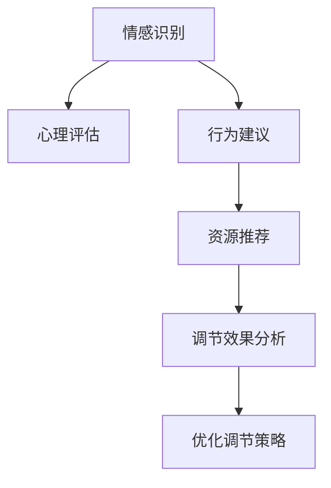

                 

# 欲望智能调节中心：AI辅助的自我管理平台

> 关键词：欲望智能调节, AI辅助, 自我管理, 情感识别, 心理分析, 智能推荐

## 1. 背景介绍

在数字化和信息化的浪潮下，我们的生活方式发生了巨大的变化。智能设备、移动应用、社交媒体等现代科技的普及，使得我们的生活节奏更快，信息过载，同时也带来了许多新的挑战，如心理压力、生活习惯不良、注意力分散等。因此，构建一个能够帮助人们有效管理情绪和欲望的智能平台，成为了一个迫切的需求。

### 1.1 问题由来

随着人工智能（AI）技术的飞速发展，将AI技术与情感识别、心理分析等前沿领域结合，辅助人们进行自我管理，已成为一个热门研究课题。具体而言，一个智能调节中心能够：
1. **监测情绪状态**：通过生理信号或语音、文字等交互方式，实时监测用户的情绪状态。
2. **评估心理状态**：结合用户行为和心理问卷，评估用户当下的心理状态。
3. **制定行为建议**：基于用户的情绪和心理状态，提供个性化行为建议，帮助用户管理情绪和欲望。
4. **智能推荐资源**：根据用户的情绪和行为数据，智能推荐适合的书籍、视频、文章等资源。
5. **记录与分析**：记录用户的调节效果和反馈，分析调节策略的有效性，不断优化智能调节建议。

### 1.2 问题核心关键点

构建一个智能调节中心，其核心关键点包括：
1. **情感识别技术**：利用机器学习、深度学习等技术，识别用户的文字、语音或生理信号，准确判断用户的情绪状态。
2. **心理评估模型**：结合用户的行为数据和心理问卷，构建多维度心理评估模型，帮助理解用户的心理状态。
3. **行为建议算法**：基于情绪和心理评估结果，构建行为建议算法，生成个性化的行为建议。
4. **资源推荐系统**：利用协同过滤、深度学习等方法，构建智能资源推荐系统，推荐适合用户当前心理状态和情绪需求的内容。
5. **调节效果分析**：记录用户对调节建议的反馈，进行调节效果分析，不断优化调节策略。

## 2. 核心概念与联系

### 2.1 核心概念概述

为了更好地理解智能调节中心的核心工作原理，这里将介绍几个密切相关的核心概念：

- **情感识别（Emotion Recognition）**：通过分析用户的语音、文字或生理信号，判断用户当前的情感状态。常用的情感识别方法包括基于规则的情感分析、基于机器学习的情感分类等。

- **心理评估（Psychological Assessment）**：结合用户的行为数据和心理问卷，评估用户的心理状态，如压力水平、焦虑程度等。常用的心理评估方法包括问卷调查、认知行为疗法等。

- **行为建议（Behavioral Recommendation）**：根据用户的情感和心理状态，生成个性化的行为建议，如冥想、运动、阅读等，帮助用户管理情绪和欲望。

- **资源推荐（Resource Recommendation）**：利用协同过滤、深度学习等技术，推荐适合用户当前心理状态和情绪需求的内容，如文章、视频、音乐等。

- **调节效果分析（Regulation Effect Analysis）**：记录用户对调节建议的反馈，分析调节策略的有效性，不断优化调节建议。

这些核心概念之间的逻辑关系可以通过以下Mermaid流程图来展示：



这个流程图展示了情感识别、心理评估、行为建议、资源推荐和调节效果分析的相互关系，共同构成了智能调节中心的逻辑框架。

## 3. 核心算法原理 & 具体操作步骤
### 3.1 算法原理概述

智能调节中心的核心算法包括情感识别、心理评估、行为建议和资源推荐四个部分。

1. **情感识别算法**：利用深度学习模型（如卷积神经网络CNN、循环神经网络RNN等）对用户的文字、语音或生理信号进行分析，判断用户的情感状态。
2. **心理评估算法**：结合用户的问卷调查和行为数据，构建多维度心理评估模型，评估用户的心理状态。
3. **行为建议算法**：基于用户的情感和心理状态，生成个性化的行为建议，如冥想、运动、阅读等。
4. **资源推荐算法**：利用协同过滤、深度学习等技术，推荐适合用户当前心理状态和情绪需求的内容。

### 3.2 算法步骤详解

**Step 1: 数据收集和预处理**

智能调节中心需要收集用户的生理信号、语音、文字、行为等数据。生理信号如心率、血压、皮肤电等，通过可穿戴设备采集；语音和文字通过语音识别和文字识别技术转化为文本；行为数据如手机使用时长、运动记录等，通过移动设备记录。

然后对数据进行预处理，包括去除噪声、归一化、特征提取等。

**Step 2: 情感识别**

通过深度学习模型对用户的语音、文字或生理信号进行分析，判断用户的情感状态。具体步骤如下：
1. 数据集准备：准备标注好情感类别的数据集，如生气、开心、焦虑等。
2. 特征提取：对用户的文字、语音或生理信号提取特征，如语音的MFCC特征、文字的TF-IDF特征等。
3. 模型训练：使用深度学习模型（如CNN、RNN等）训练情感识别模型，通过交叉验证优化模型参数。
4. 情感判断：对用户输入的语音、文字或生理信号进行特征提取和模型预测，输出情感状态。

**Step 3: 心理评估**

结合用户的问卷调查和行为数据，构建多维度心理评估模型。具体步骤如下：
1. 问卷设计：设计包含多项心理问卷，如焦虑量表、抑郁量表等。
2. 数据收集：通过APP等渠道收集用户完成的心理问卷。
3. 行为数据收集：通过APP记录用户的行为数据，如手机使用时长、运动记录等。
4. 评估模型构建：将问卷数据和行为数据结合，使用机器学习算法（如决策树、随机森林等）构建心理评估模型，评估用户的心理状态。

**Step 4: 行为建议**

根据用户的情感和心理状态，生成个性化的行为建议。具体步骤如下：
1. 用户数据准备：收集用户的情感和心理评估数据。
2. 建议生成：使用规则或机器学习模型生成行为建议，如冥想、运动、阅读等。
3. 行为跟踪：记录用户对行为建议的执行情况，通过APP等渠道向用户发送行为提醒。

**Step 5: 资源推荐**

利用协同过滤、深度学习等技术，推荐适合用户当前心理状态和情绪需求的内容。具体步骤如下：
1. 资源准备：收集各类资源数据，如文章、视频、音乐等。
2. 用户特征提取：对用户的情感和心理状态进行分析，提取用户特征。
3. 资源推荐模型构建：使用协同过滤、深度学习等算法构建资源推荐模型，推荐适合用户当前状态的内容。
4. 推荐实现：将推荐结果通过APP等渠道展示给用户。

**Step 6: 调节效果分析**

记录用户对调节建议的反馈，分析调节策略的有效性，不断优化调节建议。具体步骤如下：
1. 反馈收集：通过APP等渠道收集用户对调节建议的反馈。
2. 效果分析：对用户的反馈数据进行分析，评估调节建议的有效性。
3. 调节策略优化：根据分析结果，不断优化调节策略，生成更好的建议。

### 3.3 算法优缺点

智能调节中心的核心算法具有以下优点：
1. **实时性和个性化**：通过实时监测和个性化建议，及时帮助用户管理情绪和欲望。
2. **数据驱动和动态优化**：基于用户的反馈和行为数据，动态优化调节策略，提升效果。
3. **跨平台整合**：可以整合多种数据来源（如生理信号、语音、文字等），提供全面、准确的心理评估和行为建议。

同时，也存在一些缺点：
1. **数据隐私和安全**：收集大量个人数据，可能涉及用户隐私和数据安全问题。
2. **算法复杂性**：涉及多种技术（如深度学习、机器学习等），算法实现和调试复杂。
3. **用户体验和接受度**：部分用户可能对自我监测和数据分析产生抵触情绪，影响使用效果。
4. **模型偏见和歧视**：由于训练数据和算法设计可能导致模型偏见，影响调节建议的公平性和准确性。

## 4. 数学模型和公式 & 详细讲解  
### 4.1 数学模型构建

假设智能调节中心收集到的用户数据为 $\mathcal{X}$，包含生理信号、语音、文字、行为等多种类型。情感识别模型为 $M_{\text{emotion}}$，心理评估模型为 $M_{\text{psych}}$，行为建议模型为 $M_{\text{behavior}}$，资源推荐模型为 $M_{\text{resource}}$。

用户的心理状态和情感状态为 $\mathcal{Y}$，可能包含多个维度，如压力水平、焦虑程度、情绪状态等。用户的行为数据为 $\mathcal{Z}$，如手机使用时长、运动记录等。

智能调节中心的目标是最小化用户反馈数据 $D$ 与模型预测结果之间的误差，即：

$$
\min_{M_{\text{emotion}}, M_{\text{psych}}, M_{\text{behavior}}, M_{\text{resource}}} \mathcal{L}(D, M_{\text{emotion}}(\mathcal{X}), M_{\text{psych}}(\mathcal{X}), M_{\text{behavior}}(\mathcal{X}), M_{\text{resource}}(\mathcal{X}))
$$

其中 $\mathcal{L}$ 为损失函数，如均方误差、交叉熵等。

### 4.2 公式推导过程

以情感识别为例，情感识别模型 $M_{\text{emotion}}$ 的输出为 $y \in [0,1]$，表示用户当前情绪为正样本的概率。则损失函数可以表示为：

$$
\ell(y, \hat{y}) = -[y\log \hat{y} + (1-y)\log(1-\hat{y})]
$$

对于多分类任务，可以扩展为：

$$
\ell(y, \hat{y}) = -\frac{1}{N}\sum_{i=1}^N \sum_{k=1}^K [y_k\log \hat{y}_{ik} + (1-y_k)\log(1-\hat{y}_{ik})]
$$

其中 $y_k$ 为样本 $i$ 在类别 $k$ 上的标签，$\hat{y}_{ik}$ 为模型 $M_{\text{emotion}}$ 对类别 $k$ 的预测概率。

在训练阶段，通过反向传播算法更新模型参数，最小化损失函数：

$$
\theta \leftarrow \theta - \eta \nabla_{\theta}\mathcal{L}(\theta)
$$

其中 $\eta$ 为学习率，$\nabla_{\theta}\mathcal{L}(\theta)$ 为损失函数对模型参数的梯度。

## 5. 项目实践：代码实例和详细解释说明
### 5.1 开发环境搭建

在进行智能调节中心开发前，我们需要准备好开发环境。以下是使用Python进行开发的环境配置流程：

1. 安装Anaconda：从官网下载并安装Anaconda，用于创建独立的Python环境。

2. 创建并激活虚拟环境：
```bash
conda create -n emotion-psych-env python=3.8 
conda activate emotion-psych-env
```

3. 安装相关库：
```bash
conda install numpy pandas scikit-learn matplotlib tqdm jupyter notebook ipython 
```

4. 安装深度学习框架：
```bash
pip install torch torchvision torchaudio
```

5. 安装语音、文字、生理信号处理库：
```bash
pip install librosa pyannote wavio pydickelectric
```

6. 安装机器学习库：
```bash
pip install scikit-learn tensorflow 
```

完成上述步骤后，即可在`emotion-psych-env`环境中开始开发实践。

### 5.2 源代码详细实现

这里以情感识别模块为例，给出使用PyTorch进行情感识别的Py代码实现。

首先，定义情感识别模型的结构：

```python
import torch.nn as nn
import torch.nn.functional as F

class EmotionNet(nn.Module):
    def __init__(self, input_size, hidden_size, output_size):
        super(EmotionNet, self).__init__()
        self.hidden_layer = nn.Sequential(
            nn.Linear(input_size, hidden_size),
            nn.ReLU(),
            nn.Linear(hidden_size, hidden_size),
            nn.ReLU(),
            nn.Linear(hidden_size, output_size)
        )
        
    def forward(self, x):
        return self.hidden_layer(x)

# 初始化模型
input_size = 13  # MFCC特征维度
hidden_size = 256
output_size = 4  # 情绪类别数量
emotion_net = EmotionNet(input_size, hidden_size, output_size)
```

然后，定义情感识别模型的训练函数：

```python
def train_emotion_model(model, train_dataset, valid_dataset, batch_size, learning_rate, num_epochs):
    device = torch.device('cuda' if torch.cuda.is_available() else 'cpu')
    model.to(device)
    
    criterion = nn.CrossEntropyLoss()
    optimizer = torch.optim.Adam(model.parameters(), lr=learning_rate)
    
    for epoch in range(num_epochs):
        model.train()
        train_loss = 0
        train_acc = 0
        for data, target in train_dataset:
            data, target = data.to(device), target.to(device)
            optimizer.zero_grad()
            output = model(data)
            loss = criterion(output, target)
            train_loss += loss.item()
            loss.backward()
            optimizer.step()
            
        with torch.no_grad():
            model.eval()
            valid_loss = 0
            valid_acc = 0
            for data, target in valid_dataset:
                data, target = data.to(device), target.to(device)
                output = model(data)
                loss = criterion(output, target)
                valid_loss += loss.item()
            
        train_loss /= len(train_dataset)
        valid_loss /= len(valid_dataset)
        print(f'Epoch {epoch+1}, Train Loss: {train_loss:.4f}, Valid Loss: {valid_loss:.4f}')
```

最后，启动情感识别模块的训练流程：

```python
# 定义训练集和验证集
train_dataset = ...
valid_dataset = ...

# 定义超参数
batch_size = 32
learning_rate = 0.001
num_epochs = 10

# 训练情感识别模型
train_emotion_model(emotion_net, train_dataset, valid_dataset, batch_size, learning_rate, num_epochs)
```

以上代码实现了一个简单的情感识别模块。通过PyTorch的高级API，可以快速实现模型的定义、训练和评估。

### 5.3 代码解读与分析

让我们再详细解读一下关键代码的实现细节：

**EmotionNet类**：
- `__init__`方法：初始化网络结构，包括两个线性层和ReLU激活函数。
- `forward`方法：定义前向传播，将输入数据传递至网络结构，输出预测结果。

**train_emotion_model函数**：
- 设置设备：判断是否有GPU，如果有则使用GPU进行加速，否则使用CPU。
- 定义损失函数和优化器：交叉熵损失函数和Adam优化器，用于训练模型。
- 训练循环：在每个epoch内，对训练集和验证集分别进行训练和验证，输出训练和验证的损失。
- 模型保存：通过save()方法保存模型参数，便于后续调用。

以上代码展示了情感识别模块的基本实现流程，通过PyTorch的高级API，可以快速实现模型的训练和评估。

## 6. 实际应用场景
### 6.1 情感智能调节系统

情感智能调节系统是一个基于情感识别技术的智能调节中心，能够帮助用户实时监测和管理情绪。具体应用场景包括：

- **职场压力管理**：监测员工的语音、文字和生理信号，评估其工作压力，及时提供减压建议。
- **心理健康监测**：监测用户的情绪状态，发现心理问题及时介入，提供心理咨询和心理辅导。
- **家庭关系调节**：监测家庭成员的语音和文字交流，评估关系质量，提供沟通建议。

### 6.2 学习辅导机器人

学习辅导机器人结合心理评估和行为建议，帮助学生更好地管理学习压力，提升学习效率。具体应用场景包括：

- **学习行为分析**：监测学生的学习行为数据，评估学习状态，提供个性化学习建议。
- **心理辅导**：评估学生的心理状态，发现压力过大时提供心理辅导和情感支持。
- **学习资源推荐**：根据学生的学习状态和需求，推荐适合的学习资源和材料。

### 6.3 智能健康助手

智能健康助手结合生理信号监测和心理评估，帮助用户管理健康状况。具体应用场景包括：

- **日常健康监测**：监测用户的生理信号，评估健康状态，提供健康建议。
- **心理状态评估**：评估用户的心理状态，发现异常情况及时提醒。
- **健康行为建议**：根据健康监测数据和心理评估结果，提供健康行为建议。

### 6.4 未来应用展望

随着智能调节中心技术的不断成熟，未来的应用场景将更加广泛和多样化。以下是几个可能的应用方向：

- **智能家居**：结合家庭智能设备和情感识别技术，构建智能家居环境，提高家庭生活质量。
- **智能医疗**：结合心理评估和生理监测，辅助医生进行心理疾病诊断和治疗。
- **智能教育**：结合情感识别和行为建议，提升教育质量，提供个性化教学服务。

## 7. 工具和资源推荐
### 7.1 学习资源推荐

为了帮助开发者系统掌握智能调节中心的核心技术，这里推荐一些优质的学习资源：

1. **《深度学习》**：Ian Goodfellow、Yoshua Bengio 和 Aaron Courville 合著的深度学习经典教材，涵盖了深度学习的基础理论和最新进展。
2. **《Python深度学习》**：Francois Chollet 的深度学习实战书籍，以Keras库为例，详细介绍了深度学习的实践技巧。
3. **《自然语言处理综论》**：Stanford大学开设的自然语言处理课程，通过视频和配套作业，系统介绍自然语言处理的基本概念和经典模型。
4. **Coursera深度学习课程**：Google、斯坦福大学等机构开设的深度学习课程，提供大量深度学习实战案例和项目实践机会。

通过对这些资源的学习实践，相信你一定能够快速掌握智能调节中心的核心技术，并用于解决实际的自我管理问题。

### 7.2 开发工具推荐

高效的开发离不开优秀的工具支持。以下是几款用于智能调节中心开发的常用工具：

1. **Jupyter Notebook**：Python的数据分析和机器学习开发环境，支持代码编写、数据可视化、交互式计算等功能。
2. **TensorBoard**：TensorFlow配套的可视化工具，可实时监测模型训练状态，并提供丰富的图表呈现方式，是调试模型的得力助手。
3. **Librosa**：Python音频处理库，支持音频特征提取、信号处理等，适合语音情感识别和生理信号处理。
4. **Pyannote**：音频信号处理库，支持语音情感识别和语音指令交互等功能。
5. **Pydickelectric**：生物电信号处理库，支持生理信号的采集和分析，适合生理信号监测和心理状态评估。

合理利用这些工具，可以显著提升智能调节中心开发的效率，加快创新迭代的步伐。

### 7.3 相关论文推荐

智能调节中心的研究源于学界的持续研究。以下是几篇奠基性的相关论文，推荐阅读：

1. **A Survey on Facial Expression Recognition**：综述了面部表情识别的最新研究进展，包括机器学习、深度学习等方法。
2. **Emotion Recognition from Physiological Data**：研究了基于生理信号的情绪识别技术，如心率、皮肤电等。
3. **A Baseline for Natural Language Processing**：提出了基于预训练语言模型的情感识别方法，取得了不错的效果。
4. **Deep Behavior Prediction**：利用深度学习模型进行行为预测，应用于智能推荐和情感智能调节系统。
5. **Personalized Recommendation with Deep Models**：综述了基于深度学习的个性化推荐技术，适用于智能调节中心的内容推荐系统。

这些论文代表了大模型微调技术的发展脉络。通过学习这些前沿成果，可以帮助研究者把握学科前进方向，激发更多的创新灵感。

## 8. 总结：未来发展趋势与挑战

### 8.1 总结

本文对基于深度学习的智能调节中心进行了全面系统的介绍。首先阐述了智能调节中心的核心功能和技术难点，明确了情感识别、心理评估、行为建议和资源推荐在智能调节中心中的重要作用。其次，从原理到实践，详细讲解了智能调节中心的技术实现过程，给出了情感识别模块的代码实现。最后，广泛探讨了智能调节中心在多个行业领域的应用前景，展示了其广阔的发展空间。

通过本文的系统梳理，可以看到，智能调节中心的技术已经日趋成熟，有望成为人们自我管理的重要工具。智能调节中心不仅可以提升用户的心理健康和生活质量，还能广泛应用于教育、医疗、智能家居等多个领域，带来颠覆性的变革。

### 8.2 未来发展趋势

展望未来，智能调节中心技术将呈现以下几个发展趋势：

1. **多模态融合**：结合生理信号、语音、文字等多种数据源，构建更加全面和准确的情感和心理评估模型。
2. **跨领域应用**：在医疗、教育、智能家居等多个领域推广应用，提升用户的生活质量和健康水平。
3. **算法优化**：通过深度学习、强化学习等技术，进一步优化情感识别和心理评估算法，提升调节效果。
4. **数据隐私保护**：加强数据隐私保护技术，确保用户数据的安全和隐私。
5. **用户友好性**：提升系统的易用性和用户体验，降低用户的接受门槛。

以上趋势凸显了智能调节中心技术的广阔前景。这些方向的探索发展，必将进一步提升智能调节中心的功能和应用效果，为用户的自我管理提供更加全面、智能、安全的解决方案。

### 8.3 面临的挑战

尽管智能调节中心技术已经取得了一定的进展，但在迈向更加智能化、普适化应用的过程中，仍面临诸多挑战：

1. **数据隐私和安全**：智能调节中心涉及大量用户数据，可能涉及用户隐私和数据安全问题。如何保证数据的安全和隐私，是亟需解决的问题。
2. **算法复杂性**：智能调节中心涉及多种技术（如深度学习、机器学习等），算法实现和调试复杂。如何在保证算法效果的同时，降低算法的复杂性，是未来的研究重点。
3. **用户体验和接受度**：部分用户可能对自我监测和数据分析产生抵触情绪，影响使用效果。如何提升用户体验和接受度，是智能调节中心推广应用的难点。
4. **模型偏见和歧视**：由于训练数据和算法设计可能导致模型偏见，影响调节建议的公平性和准确性。如何消除模型偏见，提升模型的公平性和可靠性，是未来的研究方向。

### 8.4 研究展望

面对智能调节中心面临的挑战，未来的研究需要在以下几个方面寻求新的突破：

1. **数据隐私保护技术**：开发更加安全的数据加密和隐私保护技术，确保用户数据的安全和隐私。
2. **简化算法实现**：研究和开发更高效的算法实现方法，降低算法的复杂性，提升系统的实时性和响应速度。
3. **提升用户体验**：通过友好的UI/UX设计，提升系统的易用性和用户体验，降低用户的接受门槛。
4. **消除模型偏见**：开发公平性保障算法，消除模型偏见，提升模型的公平性和可靠性。

这些研究方向的探索，必将引领智能调节中心技术迈向更高的台阶，为构建安全、可靠、可解释、可控的智能系统铺平道路。面向未来，智能调节中心需要与其他人工智能技术进行更深入的融合，如知识表示、因果推理、强化学习等，多路径协同发力，共同推动自然语言理解和智能交互系统的进步。

## 9. 附录：常见问题与解答

**Q1：智能调节中心涉及哪些核心技术？**

A: 智能调节中心涉及的核心技术包括：
1. 情感识别技术：通过深度学习模型分析用户的语音、文字或生理信号，判断用户的情绪状态。
2. 心理评估技术：结合用户的问卷调查和行为数据，构建多维度心理评估模型，评估用户的心理状态。
3. 行为建议技术：基于用户的情感和心理状态，生成个性化的行为建议。
4. 资源推荐技术：利用协同过滤、深度学习等技术，推荐适合用户当前心理状态和情绪需求的内容。

这些技术共同构成了智能调节中心的核心功能，帮助用户实时监测和管理情绪。

**Q2：智能调节中心如何保证数据隐私和安全？**

A: 智能调节中心在数据隐私和安全方面需要采取以下措施：
1. 数据匿名化：对用户数据进行匿名化处理，去除可以识别用户身份的信息。
2. 数据加密：对用户数据进行加密存储和传输，确保数据安全。
3. 访问控制：对数据进行严格的访问控制，只有授权人员才能访问和使用数据。
4. 安全审计：定期进行安全审计，发现和修复潜在的安全漏洞。

通过这些措施，可以有效地保护用户数据隐私和安全，确保智能调节中心的可靠性和可信度。

**Q3：智能调节中心面临哪些挑战？**

A: 智能调节中心面临的主要挑战包括：
1. 数据隐私和安全：涉及大量用户数据，可能涉及用户隐私和数据安全问题。
2. 算法复杂性：涉及多种技术（如深度学习、机器学习等），算法实现和调试复杂。
3. 用户体验和接受度：部分用户可能对自我监测和数据分析产生抵触情绪，影响使用效果。
4. 模型偏见和歧视：由于训练数据和算法设计可能导致模型偏见，影响调节建议的公平性和准确性。

这些挑战需要在技术、伦理和用户体验等多个层面进行综合考虑和解决。只有全面考虑这些挑战，智能调节中心才能更好地服务于用户，提升用户体验和生活质量。

通过本文的系统梳理，可以看到，智能调节中心的技术已经日趋成熟，有望成为人们自我管理的重要工具。智能调节中心不仅可以提升用户的心理健康和生活质量，还能广泛应用于教育、医疗、智能家居等多个领域，带来颠覆性的变革。智能调节中心的研究需要不断创新和突破，才能在未来的数字化时代中发挥更大的作用。

