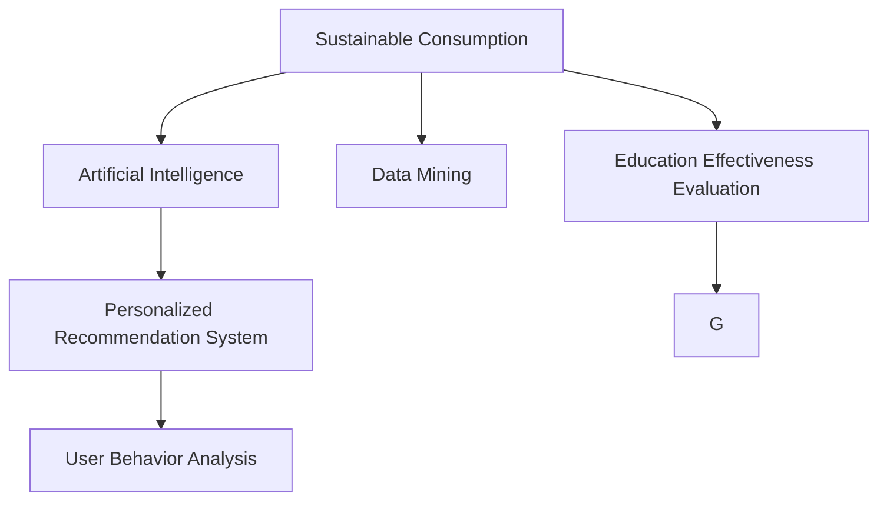

                 

# 欲望生态意识培养师：AI驱动的可持续消费教育专家

## 1. 背景介绍

### 1.1 问题由来
在全球面临资源枯竭和环境破坏的严峻形势下，可持续消费和生态意识培养逐渐成为全球关注的焦点。随着数字化技术的快速演进，人工智能(AI)的应用深度和广度不断拓展，为可持续消费教育提供了新的可能性。然而，目前关于AI在可持续消费教育中的应用还处于起步阶段，存在诸多问题和挑战。

### 1.2 问题核心关键点
当前，AI在可持续消费教育中的主要问题包括：

- 数据获取与处理：如何高效获取并处理大规模的消费数据，以便进行个性化推荐和精准教育？
- 模型选择与优化：不同AI模型在可持续消费教育中的表现和适用性有何差异？
- 教育效果评估：如何科学评估AI驱动的可持续消费教育的效果和用户满意度？
- 隐私与安全：如何保障用户数据的安全和隐私，避免数据滥用？

### 1.3 问题研究意义
AI驱动的可持续消费教育具有以下重要意义：

- 个性化推荐：通过分析用户的消费行为和偏好，AI可以提供量身定制的可持续消费建议，提升用户接受度和教育效果。
- 精准教育：AI可以实时监测用户反馈，动态调整教育内容和策略，确保教育效果最大化。
- 数据驱动：通过大数据分析，AI可以揭示消费行为背后的深层次规律，为政策制定和商业决策提供依据。
- 普及教育：AI可以大规模推广可持续消费知识，加速生态意识在全社会的普及和实践。

## 2. 核心概念与联系

### 2.1 核心概念概述

为更好地理解AI在可持续消费教育中的应用，本节将介绍几个密切相关的核心概念：

- 可持续消费(Sustainable Consumption)：指在满足基本生活需求的同时，保护环境、节约资源，实现经济发展与环境保护的平衡。
- 人工智能(Artificial Intelligence, AI)：通过模拟人类智能行为，实现机器的自主学习、推理、决策等能力。
- 数据挖掘(Data Mining)：从大规模数据中提取有用信息和知识的过程，广泛应用于消费行为分析。
- 个性化推荐系统(Personalized Recommendation System)：基于用户的历史行为数据，推荐符合其兴趣和需求的消费品和服务。
- 用户行为分析(User Behavior Analysis)：通过数据分析技术，揭示用户的消费习惯和心理特征。
- 教育效果评估(Educational Effectiveness Evaluation)：通过科学方法和工具，评估教育活动的效果和改进空间。

这些核心概念之间的逻辑关系可以通过以下Mermaid流程图来展示：



这个流程图展示了大规模可持续消费数据的应用流程：

1. 收集和挖掘消费数据，为AI模型提供数据源。
2. AI模型通过数据分析和挖掘，生成个性化推荐和精准教育内容。
3. 分析用户行为，优化教育策略和内容。
4. 评估教育效果，不断改进和优化教育过程。

## 3. 核心算法原理 & 具体操作步骤
### 3.1 算法原理概述

AI在可持续消费教育中的应用，核心在于利用大规模数据和先进算法，为用户提供个性化的可持续消费建议和教育内容。具体而言，主要包括以下几个步骤：

1. 数据收集与预处理：从用户行为、社交媒体、电商平台等渠道，收集用户消费数据。预处理数据，清洗噪声和异常值。
2. 特征提取与选择：利用机器学习算法，提取和选择关键特征，如消费频次、消费金额、偏好类别等。
3. 模型训练与优化：使用机器学习或深度学习算法，训练模型，优化预测效果。
4. 教育内容生成：根据模型预测结果，生成个性化的教育内容和推荐方案。
5. 效果评估与改进：通过科学方法评估教育效果，收集用户反馈，不断改进模型和教育策略。

### 3.2 算法步骤详解

以下详细阐述AI在可持续消费教育中的应用流程。

**Step 1: 数据收集与预处理**
- 收集用户的历史消费数据，包括交易记录、浏览历史、评论反馈等。
- 从社交媒体、新闻网站等渠道收集用户的公开消费信息。
- 对数据进行清洗和标准化，去除噪声和异常值。

**Step 2: 特征提取与选择**
- 使用特征提取算法，如TF-IDF、LDA等，从原始数据中提取关键特征。
- 使用特征选择算法，如卡方检验、信息增益等，选择与目标变量（如可持续消费行为）关系密切的特征。

**Step 3: 模型训练与优化**
- 选择合适的机器学习或深度学习模型，如线性回归、决策树、随机森林、神经网络等。
- 使用交叉验证等技术，评估模型的预测性能，并根据评估结果调整模型参数。
- 引入正则化技术，如L1正则、Dropout等，避免过拟合。

**Step 4: 教育内容生成**
- 根据模型预测结果，生成个性化的教育内容和推荐方案。如针对高碳消费行为，推荐低碳环保产品，并进行可持续发展理念教育。
- 将教育内容展示给用户，可以是文章、视频、互动游戏等多种形式。

**Step 5: 效果评估与改进**
- 使用科学方法评估教育效果，如问卷调查、行为跟踪等。
- 收集用户反馈，了解用户对教育内容和推荐方案的接受度。
- 根据评估和反馈结果，不断改进和优化教育内容和策略。

### 3.3 算法优缺点

AI在可持续消费教育中的应用具有以下优点：

1. 个性化推荐：根据用户历史行为和偏好，提供定制化教育内容和推荐，提高用户接受度和满意度。
2. 数据驱动：通过大数据分析，揭示消费行为背后的规律和趋势，为政策制定和商业决策提供依据。
3. 实时反馈：通过实时监测和反馈机制，动态调整教育策略和内容，确保教育效果最大化。
4. 自动化程度高：AI可以自动化处理大规模数据，减轻人工工作负担，提高效率。

同时，也存在一些局限性：

1. 数据隐私问题：在数据收集和处理过程中，可能涉及用户隐私和数据安全问题。
2. 模型复杂性：复杂模型需要更多的计算资源和专业知识，普通用户和组织难以应用。
3. 效果评估困难：教育效果评估和改进需要科学方法和长时间跟踪，难以在短期内见效。
4. 技术门槛高：需要具备一定的机器学习和深度学习知识，普通用户难以自行实现。

尽管存在这些局限性，但AI在可持续消费教育中的应用前景广阔，未来有很大的发展潜力。

### 3.4 算法应用领域

AI驱动的可持续消费教育主要应用于以下几个领域：

- 电子商务平台：利用用户行为分析，生成个性化推荐和教育内容，提升平台转化率和用户满意度。
- 社交媒体平台：分析用户社交媒体行为，推荐环保产品，传播可持续消费理念。
- 教育机构：通过大数据分析，定制化教育内容，提高学生对可持续消费的认识和实践能力。
- 政府和非政府组织：利用AI技术，监测和评估公众可持续消费行为，推动政策制定和宣传教育。
- 企业：分析员工消费行为，推广可持续消费，提升企业环保形象和员工满意度。

这些应用领域展示了AI在可持续消费教育中的广泛适用性，未来有望在更多场景中发挥重要作用。

## 4. 数学模型和公式 & 详细讲解  
### 4.1 数学模型构建

本节将使用数学语言对AI在可持续消费教育中的应用进行更加严格的刻画。

设用户的历史消费数据为 $\{D_t\}_{t=1}^N$，其中 $D_t=(x_t,y_t)$，$x_t$ 为特征向量，$y_t$ 为目标变量。假设使用线性回归模型，其形式为：

$$
y_t = \sum_{i=1}^p \theta_i x_{ti} + \epsilon_t
$$

其中 $\theta_i$ 为模型参数，$\epsilon_t$ 为误差项。模型的最小二乘估计量为：

$$
\hat{\theta} = \arg\min_{\theta} \frac{1}{N} \sum_{t=1}^N (y_t - \sum_{i=1}^p \theta_i x_{ti})^2
$$

模型的预测值为：

$$
\hat{y} = \sum_{i=1}^p \theta_i x_{ti}
$$

### 4.2 公式推导过程

以线性回归为例，推导其最小二乘估计量的计算公式。

根据最小二乘原理，最小化预测误差平方和：

$$
\mathcal{L}(\theta) = \frac{1}{N} \sum_{t=1}^N (y_t - \sum_{i=1}^p \theta_i x_{ti})^2
$$

对 $\mathcal{L}(\theta)$ 关于 $\theta$ 求偏导，得：

$$
\frac{\partial \mathcal{L}(\theta)}{\partial \theta_i} = \frac{2}{N} \sum_{t=1}^N (y_t - \sum_{j=1}^p \theta_j x_{tj}) x_{ti}
$$

令导数为0，解得：

$$
\hat{\theta} = (\mathbf{X}^T\mathbf{X})^{-1}\mathbf{X}^T\mathbf{y}
$$

其中 $\mathbf{X}=[x_{1t}, x_{2t}, ..., x_{pt}]^T$，$\mathbf{y}=[y_1, y_2, ..., y_N]^T$。

使用矩阵运算，得到最终的最小二乘估计量。

### 4.3 案例分析与讲解

以一个简单的案例说明线性回归在可持续消费教育中的应用。

假设某电商平台收集了用户的历史消费数据，包括购物频率、消费金额、产品类型等。希望通过线性回归模型，预测用户是否倾向于购买环保产品。

1. 数据收集：收集电商平台用户的购物记录，包括购物日期、商品类别、购物金额等。
2. 特征提取：选择关键特征，如购物频率、商品类别、购物金额等，构建特征向量 $\mathbf{x}$。
3. 模型训练：使用最小二乘估计量，训练线性回归模型，得到模型参数 $\hat{\theta}$。
4. 预测分析：利用训练好的模型，对新用户进行预测，判断其是否倾向于购买环保产品。

## 5. 项目实践：代码实例和详细解释说明
### 5.1 开发环境搭建

在进行AI驱动的可持续消费教育项目开发前，需要先准备好开发环境。以下是使用Python进行Scikit-Learn开发的环境配置流程：

1. 安装Anaconda：从官网下载并安装Anaconda，用于创建独立的Python环境。

2. 创建并激活虚拟环境：
```bash
conda create -n pytorch-env python=3.8 
conda activate pytorch-env
```

3. 安装Scikit-Learn：
```bash
pip install scikit-learn
```

4. 安装各类工具包：
```bash
pip install numpy pandas scikit-learn matplotlib tqdm jupyter notebook ipython
```

完成上述步骤后，即可在`pytorch-env`环境中开始项目实践。

### 5.2 源代码详细实现

下面以电商平台为例，给出使用Scikit-Learn对用户数据进行线性回归模型训练和预测的Python代码实现。

```python
import pandas as pd
from sklearn.linear_model import LinearRegression
from sklearn.model_selection import train_test_split
from sklearn.metrics import mean_squared_error
from sklearn.preprocessing import StandardScaler

# 加载数据集
df = pd.read_csv('user_browsing_data.csv')

# 提取特征和标签
X = df[['frequency', 'category', 'amount']]
y = df['tends_to_buy_earth_friendly']

# 数据标准化
scaler = StandardScaler()
X_scaled = scaler.fit_transform(X)

# 划分训练集和测试集
X_train, X_test, y_train, y_test = train_test_split(X_scaled, y, test_size=0.2, random_state=42)

# 训练线性回归模型
model = LinearRegression()
model.fit(X_train, y_train)

# 预测新用户行为
new_user = [[3, 2, 100]]  # 新用户特征
new_user_scaled = scaler.transform(new_user)
predicted = model.predict(new_user_scaled)

# 输出预测结果
print(f"新用户预测是否倾向于购买环保产品：{predicted[0] > 0}")
```

以上代码实现了线性回归模型的基本流程，包括数据加载、特征提取、模型训练、预测和输出结果。

### 5.3 代码解读与分析

让我们再详细解读一下关键代码的实现细节：

**数据加载**：使用Pandas库加载用户消费数据，包括购物频率、商品类别、购物金额等特征。

**特征提取**：选择关键特征，构建特征向量 $\mathbf{x}$，用于模型训练。

**数据标准化**：使用StandardScaler对特征进行标准化，确保模型训练的稳定性和收敛速度。

**模型训练**：使用LinearRegression模型进行训练，得到模型参数 $\hat{\theta}$。

**预测分析**：利用训练好的模型，对新用户进行预测，判断其是否倾向于购买环保产品。

**结果输出**：输出预测结果，展示新用户是否倾向于购买环保产品。

可以看到，Scikit-Learn使得线性回归模型的实现变得简洁高效。开发者可以将更多精力放在数据处理、模型改进等高层逻辑上，而不必过多关注底层的实现细节。

当然，工业级的系统实现还需考虑更多因素，如模型的保存和部署、超参数的自动搜索、更灵活的任务适配层等。但核心的训练流程基本与此类似。

## 6. 实际应用场景
### 6.1 电商平台

AI驱动的可持续消费教育在电商平台中的应用，可以显著提升用户购物体验和环保意识。传统电商平台往往只能基于用户的浏览和购买行为，进行简单的推荐，而无法深入分析用户偏好和行为动机。通过AI技术，电商平台可以深度挖掘用户数据，生成个性化的环保产品推荐和教育内容。

具体而言，电商平台可以：

1. 分析用户消费行为，识别环保消费倾向。
2. 推荐环保产品，提供详细的产品介绍和环保优势。
3. 推送环保教育内容，如碳足迹计算、可持续消费指南等。

这些措施不仅提高了用户的环保意识，也提升了平台的用户满意度和忠诚度。

### 6.2 在线教育平台

在线教育平台可以通过AI技术，提供个性化的可持续消费教育课程和互动游戏。传统在线教育主要依赖于固定课程和视频内容，难以满足用户个性化的学习需求。

具体应用场景包括：

1. 根据用户的学习进度和反馈，动态调整课程内容。
2. 利用AI技术，生成互动游戏和模拟场景，提高学习的趣味性和互动性。
3. 通过数据分析，了解学生的学习效果和问题，进行针对性辅导。

这些措施可以显著提升学生的学习效果和可持续消费意识。

### 6.3 社交媒体平台

社交媒体平台可以利用AI技术，分析用户社交媒体行为，传播环保理念。传统社交媒体往往只关注用户的社交网络关系，无法深入分析用户的环保意识和行为。

具体应用场景包括：

1. 分析用户的社交媒体行为，识别环保意识较高的用户群体。
2. 推送环保话题和内容，提升用户的环保意识和参与度。
3. 利用数据分析，发现用户关注的环保热点和趋势，进行针对性推广。

这些措施可以提高用户的环保意识，推动社会整体的可持续发展。

### 6.4 未来应用展望

随着AI技术的不断进步，未来AI驱动的可持续消费教育将具有以下发展趋势：

1. 更加智能化：AI技术将进一步提升用户行为的分析和预测能力，生成更加精准的教育内容和推荐方案。
2. 更加个性化：根据用户的历史数据和行为，AI可以提供量身定制的教育内容和推荐，提高用户的接受度和满意度。
3. 更加自动化：AI技术将实现教育和推荐的自动化，减轻人工工作负担，提高效率。
4. 更加普及化：AI技术将加速环保知识的普及和传播，推动社会整体的可持续发展。
5. 更加高效化：AI技术将提高资源利用效率，降低教育成本，推动可持续消费的规模化落地。

这些趋势将进一步拓展AI在可持续消费教育中的应用场景，推动环保意识的普及和实践。

## 7. 工具和资源推荐
### 7.1 学习资源推荐

为了帮助开发者系统掌握AI在可持续消费教育中的应用，这里推荐一些优质的学习资源：

1. 《Python数据科学手册》系列博文：全面介绍了Python在数据科学和机器学习中的应用，包括数据预处理、模型训练、效果评估等。
2. Coursera《机器学习》课程：由斯坦福大学开设的机器学习入门课程，系统讲解机器学习的基础知识和经典算法。
3. 《深度学习》书籍：Ian Goodfellow等人所著，深入介绍深度学习的基本原理和前沿技术，是深度学习领域的经典教材。
4. TensorFlow官方文档：Google开发的深度学习框架，提供丰富的模型库和工具，适用于工业级的深度学习应用开发。
5. Scikit-Learn官方文档：Python科学计算库，包含多种机器学习算法和数据处理工具，适用于科研和生产级的应用开发。

通过对这些资源的学习实践，相信你一定能够快速掌握AI在可持续消费教育中的应用方法，并用于解决实际的环保问题。
###  7.2 开发工具推荐

高效的开发离不开优秀的工具支持。以下是几款用于AI在可持续消费教育开发的常用工具：

1. Python：Python语言简单易学，拥有丰富的数据科学和机器学习库，是AI开发的首选语言。
2. Jupyter Notebook：免费的交互式编程环境，支持多语言编程，适合快速原型设计和数据分析。
3. Scikit-Learn：Python科学计算库，包含多种机器学习算法和数据处理工具，适用于科研和生产级的应用开发。
4. TensorFlow：由Google主导开发的深度学习框架，生产部署方便，适合大规模工程应用。
5. PyTorch：Facebook开发的深度学习框架，灵活性高，适用于科研和快速原型开发。

合理利用这些工具，可以显著提升AI在可持续消费教育任务的开发效率，加快创新迭代的步伐。

### 7.3 相关论文推荐

AI在可持续消费教育的应用领域涉及到多个学科，以下是几篇奠基性的相关论文，推荐阅读：

1. "Human-Computer Interaction: Key Concepts and Paradigms"：Larry Sussman等所著，介绍了人机交互的基本概念和设计原则。
2. "Sustainable Consumption and Environmental Protection: A Systematic Review"：Marie Yves Pitel等所著，全面回顾了可持续消费的研究现状和未来方向。
3. "A Survey of Personalized Recommendation Technologies"：Mukkamala Subbarao等所著，介绍了个性化推荐技术的研究现状和前沿方法。
4. "Educational Data Mining and Knowledge Discovery"：Juan Luis Corral等所著，介绍了教育数据分析和知识发现的方法和应用。
5. "Machine Learning for Sustainable Development"：Tomas Chambers等所著，介绍了机器学习在可持续发展中的应用案例和方法。

这些论文代表了大规模可持续消费数据的应用流程。通过学习这些前沿成果，可以帮助研究者把握学科前进方向，激发更多的创新灵感。

## 8. 总结：未来发展趋势与挑战

### 8.1 研究成果总结

本文对AI在可持续消费教育中的应用进行了全面系统的介绍。首先阐述了可持续消费教育的研究背景和意义，明确了AI在其中的独特价值。其次，从原理到实践，详细讲解了AI在可持续消费教育中的应用流程，给出了实际应用的代码实例和分析。同时，本文还广泛探讨了AI技术在电商、教育、社交媒体等多个行业领域的应用前景，展示了AI在可持续消费教育中的广泛适用性。最后，本文精选了AI在可持续消费教育领域的各类学习资源，力求为读者提供全方位的技术指引。

通过本文的系统梳理，可以看到，AI在可持续消费教育中的应用具有广阔的前景，不仅能够提升用户的环境意识和行为，还能推动社会整体的可持续发展。AI技术的应用将使可持续消费教育更加智能化、个性化和普及化，为环境保护和资源节约做出更大贡献。

### 8.2 未来发展趋势

展望未来，AI在可持续消费教育中将呈现以下几个发展趋势：

1. 更加智能化：AI技术将进一步提升用户行为的分析和预测能力，生成更加精准的教育内容和推荐方案。
2. 更加个性化：根据用户的历史数据和行为，AI可以提供量身定制的教育内容和推荐，提高用户的接受度和满意度。
3. 更加自动化：AI技术将实现教育和推荐的自动化，减轻人工工作负担，提高效率。
4. 更加普及化：AI技术将加速环保知识的普及和传播，推动社会整体的可持续发展。
5. 更加高效化：AI技术将提高资源利用效率，降低教育成本，推动可持续消费的规模化落地。

这些趋势将进一步拓展AI在可持续消费教育中的应用场景，推动环保意识的普及和实践。

### 8.3 面临的挑战

尽管AI在可持续消费教育中具有广阔的前景，但在迈向更加智能化、普适化应用的过程中，仍面临诸多挑战：

1. 数据获取瓶颈：AI技术需要大量的消费数据进行训练和优化，但数据获取和处理过程可能面临隐私和数据安全的风险。
2. 模型复杂性：复杂模型需要更多的计算资源和专业知识，普通用户和组织难以应用。
3. 效果评估困难：教育效果评估和改进需要科学方法和长时间跟踪，难以在短期内见效。
4. 技术门槛高：需要具备一定的机器学习和深度学习知识，普通用户难以自行实现。
5. 模型公平性：AI模型可能存在偏见和歧视，需要对其公平性和公正性进行评估和改进。

尽管存在这些挑战，但随着学界和产业界的共同努力，AI在可持续消费教育中的应用将不断突破，推动环保意识的普及和实践。

### 8.4 研究展望

未来研究需要在以下几个方面寻求新的突破：

1. 探索数据获取和处理的新方法：开发高效、低成本、高隐私保护的数据获取技术，降低AI应用的数据门槛。
2. 研究模型选择和优化策略：开发更加高效、低资源消耗的AI模型，提高AI应用的普及性和可访问性。
3. 引入更多先验知识：将符号化的先验知识，如知识图谱、逻辑规则等，与神经网络模型进行巧妙融合，引导AI模型学习更准确、合理的环保知识。
4. 研究智能推荐和教育策略：开发智能推荐算法和教育策略，提高AI在可持续消费教育中的应用效果和用户满意度。
5. 引入因果分析和博弈论工具：将因果分析方法引入AI模型，识别出模型决策的关键特征，增强输出解释的因果性和逻辑性。

这些研究方向的探索，必将引领AI在可持续消费教育技术的不断发展，为构建安全、可靠、可解释、可控的智能系统铺平道路。面向未来，AI在可持续消费教育中必将发挥更大的作用，推动环保意识的普及和实践。

## 9. 附录：常见问题与解答

**Q1：AI在可持续消费教育中的应用是否适用于所有行业？**

A: AI在可持续消费教育中的应用具有广泛适用性，但不同行业的应用场景和需求存在差异。在电商、教育、社交媒体等领域，AI可以发挥重要作用，而在传统制造业、农业等产业，则需要结合具体的业务需求，选择合适的AI应用方案。

**Q2：AI在可持续消费教育中是否需要大量的数据支持？**

A: AI在可持续消费教育中确实需要大量的数据支持，包括用户的消费数据、行为数据、反馈数据等。数据量越大，模型的预测和教育效果越好。但数据获取和处理过程中，需要注意隐私和数据安全问题。

**Q3：AI在可持续消费教育中的应用效果如何评估？**

A: AI在可持续消费教育中的应用效果评估，可以通过多种方式进行：
1. 用户反馈：通过用户问卷调查、满意度调查等方式，了解用户对教育内容和推荐方案的接受度和满意度。
2. 行为跟踪：通过跟踪用户的消费行为，评估其环保行为的变化和提升。
3. 数据分析：通过数据分析，评估模型的预测效果和教育内容的实际影响。
4. 实验比较：通过A/B测试等方法，比较不同AI模型和教育策略的效果，选择最优方案。

**Q4：AI在可持续消费教育中是否需要人工干预？**

A: AI在可持续消费教育中需要一定的人工干预，以确保教育内容的科学性和公平性。AI模型可能存在偏见和歧视，需要进行人工评估和改进。同时，AI模型的复杂性和预测准确性也需要人工验证和优化。

**Q5：AI在可持续消费教育中是否具有安全性和可靠性？**

A: AI在可持续消费教育中的安全性和可靠性，需要从多个方面进行保障：
1. 数据隐私：在数据收集和处理过程中，需要严格遵守数据隐私和安全法规，保护用户隐私。
2. 模型公平性：AI模型可能存在偏见和歧视，需要进行公平性评估和改进，确保模型的公正性。
3. 系统稳定性：在AI系统开发和部署过程中，需要进行充分的测试和验证，确保系统的稳定性和可靠性。

---

作者：禅与计算机程序设计艺术 / Zen and the Art of Computer Programming

