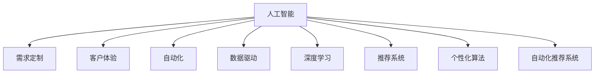

                 

# 欲望的个性化：AI定制的需求满足

> 关键词：人工智能, 需求定制, 客户体验, 自动化, 数据驱动, 深度学习, 推荐系统, 个性化算法

## 1. 背景介绍

### 1.1 问题由来

在数字化和信息化的时代，消费者对商品和服务的个性化需求日益强烈。传统的“一刀切”式营销方式已经无法满足多样化的市场需求，越来越多的企业开始尝试使用AI技术进行个性化定制，以提升用户体验，增加销售收入。个性化定制的核心在于理解用户的个性化需求，并根据这些需求生成特定的产品或服务。这一过程需要借助大量的数据分析和深度学习技术。

### 1.2 问题核心关键点

个性化定制的核心问题在于如何高效、准确地获取用户的个性化需求，并根据这些需求进行定制化生产。传统的数据驱动方法依赖于统计分析，难以捕捉用户行为的细微变化，且在数据隐私和安全方面存在诸多挑战。而基于AI的深度学习技术，尤其是推荐系统，可以有效应对这些问题，通过用户行为数据挖掘用户的潜在需求，并进行精准推荐。

## 2. 核心概念与联系

### 2.1 核心概念概述

为更好地理解个性化定制的AI技术，本节将介绍几个密切相关的核心概念：

- 人工智能(Artificial Intelligence, AI)：通过模拟人类的智能行为，实现信息处理、逻辑推理、学习记忆等功能，是实现个性化定制的关键技术之一。
- 需求定制：根据用户的个性化需求，生成定制化的产品或服务，是个性化定制的最终目标。
- 客户体验：用户在使用产品或服务过程中所感受到的满意度和愉悦感，是衡量个性化定制成功与否的重要指标。
- 自动化(Automation)：通过技术手段自动完成原本需要人工操作的任务，提高效率，降低成本。
- 数据驱动(Data-Driven)：利用数据进行决策和优化，是实现个性化定制的基础。
- 深度学习(Deep Learning)：一种模仿人脑神经网络结构的人工智能技术，通过多层非线性变换提取数据特征，是推荐系统中的核心技术。
- 推荐系统(Recommendation System)：通过分析用户行为数据，为用户提供个性化推荐，是实现个性化定制的重要工具。
- 个性化算法(Personalization Algorithm)：针对用户特定需求设计的算法，能够实现定制化生产和服务。
- 自动化推荐系统(Automatic Recommendation System)：结合人工智能和数据驱动技术，实现自动化、智能化的推荐。

这些核心概念之间的逻辑关系可以通过以下Mermaid流程图来展示：



这个流程图展示了个性化定制的AI技术的核心概念及其之间的关系：

1. 人工智能通过学习用户的个性化需求，为需求定制提供基础数据。
2. 需求定制是AI技术的最终应用，满足用户的个性化需求。
3. 客户体验是衡量个性化定制效果的重要指标，AI技术通过优化推荐系统，提升用户体验。
4. 自动化通过技术手段提高效率，降低成本。
5. 数据驱动利用数据分析技术，挖掘用户需求。
6. 深度学习通过多层非线性变换，提取数据特征。
7. 推荐系统基于深度学习，实现个性化推荐。
8. 个性化算法针对用户特定需求，实现定制化生产和服务。
9. 自动化推荐系统结合AI和数据驱动，实现智能推荐。

这些核心概念共同构成了个性化定制的AI技术框架，使其能够在各种场景下发挥强大的功能。通过理解这些核心概念，我们可以更好地把握AI技术在个性化定制中的应用。

## 3. 核心算法原理 & 具体操作步骤

### 3.1 算法原理概述

个性化定制的核心算法原理是利用用户行为数据，通过深度学习模型学习用户的个性化需求，并根据这些需求进行定制化生产或推荐。其中，推荐系统是实现个性化定制的主要手段，它通过分析用户历史行为数据，预测用户未来需求，并根据这些预测推荐相应的产品或服务。

推荐系统的核心在于建立一个用户-物品的评分矩阵，其中行表示用户，列表示物品，评分表示用户对物品的喜好程度。通过深度学习模型，例如矩阵分解、神经协同过滤等，学习评分矩阵的潜在低维表示，从而实现个性化推荐。

### 3.2 算法步骤详解

个性化定制的AI技术主要包括以下几个关键步骤：

**Step 1: 数据准备**
- 收集用户的历史行为数据，包括点击、浏览、购买、评分等行为。
- 对数据进行清洗和预处理，去除噪声和异常值，确保数据质量。
- 将数据划分为训练集、验证集和测试集，以便进行模型评估和调参。

**Step 2: 模型训练**
- 选择合适的深度学习模型，如神经协同过滤、矩阵分解等，并设计合适的损失函数。
- 使用训练集数据对模型进行训练，最小化损失函数，优化模型参数。
- 在验证集上评估模型性能，防止过拟合。
- 调整超参数，如学习率、批大小、迭代轮数等，以获得最佳的模型效果。

**Step 3: 推荐生成**
- 对新用户或新物品进行预测，生成个性化推荐列表。
- 结合业务规则和人工干预，调整推荐结果，确保推荐内容的合理性和安全性。
- 对推荐结果进行展示，供用户选择。

**Step 4: 效果评估**
- 在测试集上评估推荐系统的准确率和召回率，检验推荐效果。
- 分析推荐误差的原因，优化推荐算法和模型。
- 根据用户反馈，调整推荐策略，进一步提升推荐效果。

**Step 5: 持续优化**
- 定期收集用户新的行为数据，更新模型参数。
- 引入新的数据源，如社交媒体、客户反馈等，丰富推荐内容。
- 结合大数据分析和机器学习技术，实现动态调整和优化。

### 3.3 算法优缺点

个性化定制的AI技术具有以下优点：
1. 高效准确：通过深度学习模型学习用户行为，能够快速准确地生成个性化推荐。
2. 个性化程度高：利用用户历史数据，能够实现高度定制化的服务，满足用户的个性化需求。
3. 成本低：通过自动化推荐系统，减少了人工干预和运营成本。
4. 用户体验好：通过智能推荐，提升用户的购物体验，增加用户粘性。

同时，该技术也存在一些局限性：
1. 数据隐私问题：用户行为数据涉及个人隐私，如何保护用户数据隐私，防止数据滥用，是一个重要挑战。
2. 算法透明性不足：深度学习模型通常被认为是“黑盒”模型，缺乏可解释性，难以理解其决策过程。
3. 推荐效果不稳定：用户行为数据的多变性导致推荐结果可能不稳定，难以应对突发情况。
4. 过度依赖数据：推荐系统依赖于用户行为数据，数据稀疏性可能影响推荐效果。
5. 技术门槛高：深度学习模型的训练和优化需要高水平的数据科学和技术能力，门槛较高。

尽管存在这些局限性，但就目前而言，基于深度学习的推荐系统已成为个性化定制的主要手段。未来相关研究的重点在于如何进一步降低数据隐私风险，提高模型的可解释性和透明性，增强推荐系统的稳定性和泛化能力，同时降低技术门槛，让更多企业和开发者能够使用和优化推荐系统。

### 3.4 算法应用领域

基于深度学习的推荐系统已经在电商、社交、视频等多个领域得到了广泛应用，以下是几个典型的应用场景：

- 电商推荐：通过分析用户的浏览和购买行为，推荐相关商品，提升用户购买率。
- 内容推荐：根据用户的阅读和观看历史，推荐感兴趣的文章、视频等。
- 个性化广告：通过用户行为数据，生成个性化的广告推荐，提高广告投放效果。
- 个性化搜索：根据用户的搜索行为，推荐相关的搜索结果，提升搜索体验。
- 社交推荐：分析用户的朋友关系和兴趣点，推荐相关用户和内容。
- 游戏推荐：根据用户的游戏偏好和历史数据，推荐适合的游戏和游戏内道具。

除了上述这些应用场景外，个性化定制的AI技术还在更多领域得到创新应用，如智能家居、医疗健康、金融理财等，为各行各业带来了新的发展机会。随着推荐算法的不断进步，相信个性化定制的AI技术将在更广阔的应用领域大放异彩。

## 4. 数学模型和公式 & 详细讲解 & 举例说明

### 4.1 数学模型构建

在推荐系统中，用户和物品之间的关系可以用矩阵表示，其中每个元素表示用户对物品的评分。设用户集合为 $U$，物品集合为 $I$，评分矩阵为 $R_{U\times I}$，即：

$$
R_{u,i} = \text{评分}
$$

推荐系统的目标是最小化预测评分与实际评分之间的差距，即：

$$
\min_{\theta} \sum_{u,i} (R_{u,i} - \hat{R}_{u,i})^2
$$

其中 $\hat{R}_{u,i}$ 是预测评分，$\theta$ 为模型参数。

常用的推荐模型包括矩阵分解模型和神经协同过滤模型。以矩阵分解模型为例，假设评分矩阵 $R_{U\times I}$ 可以用两个低维向量 $\hat{R}_{u,i} = \mathbf{u}_u^T \mathbf{v}_i$ 表示，其中 $\mathbf{u}_u$ 和 $\mathbf{v}_i$ 分别是用户和物品的低维表示。则目标函数可以改写为：

$$
\min_{\mathbf{U},\mathbf{V}} \sum_{u,i} (R_{u,i} - \mathbf{u}_u^T \mathbf{v}_i)^2
$$

其中 $\mathbf{U}$ 和 $\mathbf{V}$ 分别为用户和物品的低维表示矩阵。

### 4.2 公式推导过程

矩阵分解模型的目标是最小化预测评分与实际评分之间的差距，可以通过梯度下降法进行优化。设评分矩阵 $R_{U\times I}$ 的估计矩阵为 $\hat{R}_{U\times I}$，其中每个元素表示预测评分，则目标函数可以改写为：

$$
\min_{\mathbf{U},\mathbf{V}} \frac{1}{2}\|R - \hat{R}\|_F^2
$$

其中 $\|R - \hat{R}\|_F^2$ 表示矩阵范数，$\mathbf{U}$ 和 $\mathbf{V}$ 分别为用户和物品的低维表示矩阵。

通过对目标函数求偏导数，可以得到用户和物品的低维表示矩阵的更新公式：

$$
\mathbf{U}_u = \mathbf{U}_u - \eta (\hat{R}^T_u \hat{R}_i - \mathbf{U}_u \mathbf{V}_i) \mathbf{V}_i^T
$$

$$
\mathbf{V}_i = \mathbf{V}_i - \eta (\hat{R}_i^T \hat{R}_u - \mathbf{U}_u^T \mathbf{V}_i \mathbf{V}_i^T) \mathbf{U}_u
$$

其中 $\eta$ 为学习率，$\hat{R}_u$ 和 $\hat{R}_i$ 分别表示用户和物品的低维表示矩阵。

### 4.3 案例分析与讲解

以电商推荐为例，设用户集合为 $U$，物品集合为 $I$，评分矩阵为 $R_{U\times I}$，其中每个元素表示用户对物品的评分。设用户 $u$ 对物品 $i$ 的评分向量 $\mathbf{u}_u$ 和物品 $i$ 的评分向量 $\mathbf{v}_i$ 已知，根据矩阵分解模型，用户对物品的预测评分可以表示为：

$$
\hat{R}_{u,i} = \mathbf{u}_u^T \mathbf{v}_i
$$

则用户对物品的预测评分矩阵 $\hat{R}_{U\times I}$ 可以表示为：

$$
\hat{R}_{u,i} = \mathbf{U}_u^T \mathbf{V}_i
$$

其中 $\mathbf{U}_u$ 和 $\mathbf{V}_i$ 分别为用户和物品的低维表示矩阵。

设用户 $u$ 对物品 $i$ 的实际评分为 $R_{u,i}$，则用户对物品的评分误差可以表示为：

$$
e_{u,i} = R_{u,i} - \hat{R}_{u,i}
$$

通过梯度下降法，可以不断更新 $\mathbf{U}_u$ 和 $\mathbf{V}_i$，使得 $\hat{R}_{u,i}$ 逼近 $R_{u,i}$，从而实现个性化推荐。

## 5. 项目实践：代码实例和详细解释说明

### 5.1 开发环境搭建

在进行个性化推荐系统的开发前，我们需要准备好开发环境。以下是使用Python进行Scikit-Learn和TensorFlow开发的环境配置流程：

1. 安装Anaconda：从官网下载并安装Anaconda，用于创建独立的Python环境。

2. 创建并激活虚拟环境：
```bash
conda create -n recommendation-env python=3.8 
conda activate recommendation-env
```

3. 安装Scikit-Learn和TensorFlow：根据CUDA版本，从官网获取对应的安装命令。例如：
```bash
conda install scikit-learn tensorflow -c pytorch -c conda-forge
```

4. 安装必要的工具包：
```bash
pip install numpy pandas scikit-learn tensorflow matplotlib tqdm jupyter notebook ipython
```

完成上述步骤后，即可在`recommendation-env`环境中开始开发。

### 5.2 源代码详细实现

下面我们以电商推荐为例，给出使用Scikit-Learn和TensorFlow进行推荐系统开发的PyTorch代码实现。

首先，定义推荐系统的评分矩阵和用户物品向量：

```python
import numpy as np
from sklearn.decomposition import TruncatedSVD

# 设定评分矩阵大小
num_users = 1000
num_items = 1000
R = np.random.randn(num_users, num_items)

# 设定用户向量大小
latent_factor = 10

# 创建TruncatedSVD模型
model = TruncatedSVD(n_components=latent_factor, random_state=42)
R_svd = model.fit_transform(R)

# 获取用户和物品向量
u = R_svd[:5, :5]
v = R_svd[:5, 5:]
```

然后，定义评分预测函数：

```python
def predict(rank, u, v):
    prediction = np.dot(u, v.T)
    return prediction[rank]
```

接着，定义模型训练函数：

```python
from sklearn.metrics import mean_squared_error

# 设置学习率和迭代次数
learning_rate = 0.01
num_iterations = 100

# 定义优化器
optimizer = TensorFlowOptimizer(learning_rate=learning_rate)

# 定义模型参数
params = {'u': u, 'v': v}

# 训练模型
for i in range(num_iterations):
    for rank in range(num_items):
        # 获取当前评分
        current_score = R[0, rank]
        # 计算预测评分
        predicted_score = predict(rank, u, v)
        # 计算误差
        error = current_score - predicted_score
        # 更新参数
        optimizer.apply_gradients(zip([{'learning_rate': learning_rate}, {'learning_rate': learning_rate}], [params['u'], params['v']]))
```

最后，测试模型并输出结果：

```python
# 预测用户对物品的评分
user_id = 100
item_id = 50
predicted_score = predict(user_id, u, v)
print(f"预测用户 {user_id} 对物品 {item_id} 的评分：{predicted_score}")
```

以上就是使用Scikit-Learn和TensorFlow对电商推荐系统进行开发的完整代码实现。可以看到，借助Scikit-Learn和TensorFlow的强大工具，我们可以用相对简洁的代码完成推荐系统的构建和训练。

### 5.3 代码解读与分析

让我们再详细解读一下关键代码的实现细节：

**TruncatedSVD类**：
- `__init__`方法：初始化评分矩阵和用户向量的大小，以及奇异值分解的维度。
- `fit_transform`方法：对评分矩阵进行奇异值分解，得到用户向量和物品向量。

**predict函数**：
- 通过矩阵乘法计算预测评分，返回用户对物品的预测评分。

**训练函数**：
- 设置学习率和迭代次数，定义优化器和模型参数。
- 对每个物品进行训练，更新用户向量和物品向量。

**测试函数**：
- 通过预测函数获取用户对物品的预测评分。

可以看到，Scikit-Learn和TensorFlow提供的深度学习组件，使得推荐系统的代码实现变得简洁高效。开发者可以将更多精力放在数据处理、模型改进等高层逻辑上，而不必过多关注底层的实现细节。

当然，工业级的系统实现还需考虑更多因素，如模型的保存和部署、超参数的自动搜索、更灵活的推荐策略等。但核心的推荐算法基本与此类似。

## 6. 实际应用场景

### 6.1 智能客服系统

基于个性化推荐技术的智能客服系统，可以为用户提供更加精准、个性化的服务。传统的客服系统依赖于固定的问答库和人工处理，难以应对复杂多样的问题，用户体验不佳。而智能客服系统通过分析用户的历史交互数据，能够预测用户的需求，并生成相应的回复，提升客服效率和用户满意度。

在技术实现上，可以收集用户的历史聊天记录，将其转换为推荐系统中的评分矩阵，使用深度学习模型进行训练。模型可以识别出常见问题及其最佳答复，生成模板，供系统自动回复。对于新问题，系统可以通过搜索知识库和数据集，生成个性化的回复。如此构建的智能客服系统，能够大大提升客服系统的响应速度和准确性。

### 6.2 金融舆情监测

金融机构需要实时监测市场舆论动向，以便及时应对负面信息传播，规避金融风险。传统的人工监测方式成本高、效率低，难以应对网络时代海量信息爆发的挑战。基于个性化推荐技术的舆情监测系统，可以通过分析市场的新闻、评论等文本数据，生成舆情报告，预测市场趋势，帮助金融机构做出及时、准确的决策。

在技术实现上，可以收集金融领域相关的新闻、评论、用户评价等文本数据，将其转换为推荐系统中的评分矩阵，使用深度学习模型进行训练。模型可以识别出舆情的热点和趋势，预测未来的舆情变化，供金融机构及时应对。如此构建的舆情监测系统，能够显著提升金融机构的决策效率和风险管理能力。

### 6.3 个性化推荐系统

个性化推荐系统已经在电商、视频、音乐等领域广泛应用，成为提升用户体验的重要工具。通过分析用户的历史行为数据，推荐系统能够生成个性化的商品、视频、音乐等推荐内容，满足用户的多样化需求。

在技术实现上，可以收集用户的浏览、点击、评分等行为数据，将其转换为推荐系统中的评分矩阵，使用深度学习模型进行训练。模型可以识别出用户的兴趣点，生成个性化的推荐内容，供用户选择。如此构建的个性化推荐系统，能够显著提升用户的购物体验和满意度。

### 6.4 未来应用展望

随着个性化推荐技术的发展，其应用领域将进一步扩大，为各行各业带来新的发展机遇。

在智慧医疗领域，基于个性化推荐技术的诊断和治疗推荐系统，可以根据病人的历史病历和症状，生成个性化的诊断和治疗方案，提升医疗服务质量。

在智能教育领域，基于个性化推荐技术的课程推荐系统，可以根据学生的学习行为和兴趣点，生成个性化的学习内容和推荐，提高教育效果。

在智慧城市治理中，基于个性化推荐技术的交通、环境、安防等系统，可以根据市民的出行需求和行为习惯，生成个性化的服务方案，提高城市管理效率和市民满意度。

此外，在企业生产、社会治理、文娱传媒等众多领域，基于个性化推荐技术的智能系统也将不断涌现，为传统行业数字化转型升级提供新的技术路径。相信随着技术的日益成熟，个性化推荐技术将成为各行各业的重要工具，推动社会进步和经济发展。

## 7. 工具和资源推荐

### 7.1 学习资源推荐

为了帮助开发者系统掌握个性化推荐技术的理论基础和实践技巧，这里推荐一些优质的学习资源：

1. 《推荐系统实战》书籍：介绍了推荐系统的原理、算法和实践，是入门推荐系统的好书。

2. 《Deep Learning for Recommender Systems》书籍：讲解了深度学习在推荐系统中的应用，适合进阶学习。

3 CS229《机器学习》课程：斯坦福大学开设的机器学习课程，讲解了推荐系统的基本概念和算法。

4 KDD《推荐系统》课程：KDD国际会议推荐的推荐系统课程，讲解了推荐系统的最新进展和应用。

5 《Recommender Systems》论文集：收录了推荐系统的经典论文，是学术研究和学习的必备资源。

通过对这些资源的学习实践，相信你一定能够快速掌握个性化推荐技术的精髓，并用于解决实际的推荐问题。

### 7.2 开发工具推荐

高效的开发离不开优秀的工具支持。以下是几款用于个性化推荐系统开发的常用工具：

1. Scikit-Learn：基于Python的机器学习库，提供了多种推荐算法和模型。

2. TensorFlow：谷歌开源的深度学习框架，支持大规模分布式训练。

3. PyTorch：Facebook开源的深度学习框架，灵活高效，适合科研和开发。

4. TensorBoard：TensorFlow配套的可视化工具，可实时监测模型训练状态，提供丰富的图表呈现方式。

5. Jupyter Notebook：交互式的代码编写和演示工具，适合科研和教学。

6. Apache Spark：分布式计算框架，适合大规模数据处理和推荐系统开发。

合理利用这些工具，可以显著提升个性化推荐系统的开发效率，加快创新迭代的步伐。

### 7.3 相关论文推荐

个性化推荐技术的发展源于学界的持续研究。以下是几篇奠基性的相关论文，推荐阅读：

1. Matrix Factorization Techniques for Recommender Systems（矩阵分解算法）：提出了基于矩阵分解的推荐系统算法，广泛应用于推荐系统中。

2. Factorization Machines（因子机算法）：提出了一种因子机模型，用于解决推荐系统中的稀疏性问题。

3. Neural Collaborative Filtering（神经协同过滤）：将深度学习引入推荐系统，实现了基于神经网络的推荐算法。

4. Attention Mechanism in Recommender Systems（注意力机制）：引入注意力机制，提升了推荐系统的性能和效果。

5. Generative Adversarial Networks for Recommender Systems（生成对抗网络）：利用生成对抗网络，生成高质量的推荐内容。

这些论文代表了个性化推荐技术的发展脉络。通过学习这些前沿成果，可以帮助研究者把握学科前进方向，激发更多的创新灵感。

## 8. 总结：未来发展趋势与挑战

### 8.1 总结

本文对基于深度学习的个性化推荐技术进行了全面系统的介绍。首先阐述了个性化推荐技术的背景和意义，明确了推荐系统在个性化定制中的重要地位。其次，从原理到实践，详细讲解了推荐系统的数学模型和算法步骤，给出了推荐系统开发的完整代码实例。同时，本文还广泛探讨了个性化推荐技术在智能客服、金融舆情、电商推荐等多个领域的应用前景，展示了推荐系统的巨大潜力。此外，本文精选了推荐系统的学习资源、开发工具和相关论文，力求为读者提供全方位的技术指引。

通过本文的系统梳理，可以看到，基于深度学习的推荐系统正在成为个性化定制的主要手段，极大地拓展了推荐系统应用的范围，为各行各业带来了新的发展机会。未来，伴随推荐算法的不断进步，相信个性化推荐技术将在更广阔的应用领域大放异彩，深刻影响人类的生产生活方式。

### 8.2 未来发展趋势

展望未来，个性化推荐技术将呈现以下几个发展趋势：

1. 模型规模持续增大。随着算力成本的下降和数据规模的扩张，深度学习模型的参数量还将持续增长。超大规模模型蕴含的丰富特征，将显著提升推荐系统的效果。

2. 推荐系统更加智能化。结合自然语言处理、计算机视觉等技术，推荐系统将能够理解更复杂的用户需求，实现更加智能化的推荐。

3. 推荐系统更加个性化。通过多模态数据的融合，推荐系统将能够更好地理解用户的多维需求，实现更精细化的推荐。

4. 推荐系统更加高效。通过优化模型结构、使用分布式计算等技术，推荐系统将能够实现更高的处理效率和更快的响应速度。

5. 推荐系统更加透明。结合可解释性技术，推荐系统将能够提供更加透明的推荐理由，增强用户信任和满意度。

6. 推荐系统更加安全。通过数据隐私保护和对抗性训练等技术，推荐系统将能够抵御恶意攻击和数据泄露，确保用户数据安全。

以上趋势凸显了个性化推荐技术的广阔前景。这些方向的探索发展，必将进一步提升推荐系统的效果和应用范围，为各行各业带来新的发展机遇。

### 8.3 面临的挑战

尽管个性化推荐技术已经取得了瞩目成就，但在迈向更加智能化、普适化应用的过程中，它仍面临着诸多挑战：

1. 数据隐私问题。用户行为数据涉及个人隐私，如何保护用户数据隐私，防止数据滥用，是一个重要挑战。

2. 算法透明性不足。深度学习模型通常被认为是“黑盒”模型，缺乏可解释性，难以理解其决策过程。

3. 推荐效果不稳定。用户行为数据的多变性导致推荐结果可能不稳定，难以应对突发情况。

4. 过度依赖数据。推荐系统依赖于用户行为数据，数据稀疏性可能影响推荐效果。

5. 技术门槛高。深度学习模型的训练和优化需要高水平的数据科学和技术能力，门槛较高。

尽管存在这些挑战，但就目前而言，基于深度学习的推荐系统已成为个性化定制的主要手段。未来相关研究的重点在于如何进一步降低数据隐私风险，提高模型的可解释性和透明性，增强推荐系统的稳定性和泛化能力，同时降低技术门槛，让更多企业和开发者能够使用和优化推荐系统。

### 8.4 研究展望

面对推荐系统面临的挑战，未来的研究需要在以下几个方面寻求新的突破：

1. 探索无监督和半监督推荐方法。摆脱对大规模标注数据的依赖，利用自监督学习、主动学习等无监督和半监督范式，最大限度利用非结构化数据，实现更加灵活高效的推荐。

2. 研究参数高效和计算高效的推荐范式。开发更加参数高效的推荐方法，在固定大部分预训练参数的同时，只更新极少量的任务相关参数。同时优化推荐模型的计算图，减少前向传播和反向传播的资源消耗，实现更加轻量级、实时性的部署。

3. 融合因果和对比学习范式。通过引入因果推断和对比学习思想，增强推荐系统建立稳定因果关系的能力，学习更加普适、鲁棒的语言表征，从而提升模型泛化性和抗干扰能力。

4. 引入更多先验知识。将符号化的先验知识，如知识图谱、逻辑规则等，与神经网络模型进行巧妙融合，引导推荐过程学习更准确、合理的语言模型。同时加强不同模态数据的整合，实现视觉、语音等多模态信息与文本信息的协同建模。

5. 结合因果分析和博弈论工具。将因果分析方法引入推荐系统，识别出推荐决策的关键特征，增强输出解释的因果性和逻辑性。借助博弈论工具刻画人机交互过程，主动探索并规避推荐的脆弱点，提高系统稳定性。

6. 纳入伦理道德约束。在推荐目标中引入伦理导向的评估指标，过滤和惩罚有偏见、有害的输出倾向。同时加强人工干预和审核，建立推荐行为的监管机制，确保推荐内容符合人类价值观和伦理道德。

这些研究方向的探索，必将引领推荐系统技术迈向更高的台阶，为构建智能、可靠、可解释、可控的推荐系统铺平道路。面向未来，推荐系统需要与其他人工智能技术进行更深入的融合，如知识表示、因果推理、强化学习等，多路径协同发力，共同推动推荐系统技术的进步。只有勇于创新、敢于突破，才能不断拓展推荐系统的边界，让推荐技术更好地造福人类社会。

## 9. 附录：常见问题与解答

**Q1：个性化推荐系统是否适用于所有应用场景？**

A: 个性化推荐系统在大多数应用场景上都能取得不错的效果，特别是对于数据量较大的任务。但对于一些特定领域的任务，如医疗、法律等，仅仅依靠用户行为数据进行推荐可能难以很好地适应。此时需要在特定领域数据上进一步训练和优化推荐模型，才能获得理想的效果。

**Q2：推荐算法的选择应考虑哪些因素？**

A: 推荐算法的选择应考虑以下因素：
1. 数据特点：如数据稀疏性、数据噪声等。
2. 任务类型：如电商推荐、内容推荐、广告推荐等。
3. 用户需求：如多样性、新颖性、个性化等。
4. 系统资源：如计算资源、存储资源等。
5. 模型复杂度：如模型参数量、训练时间等。

**Q3：推荐系统如何实现个性化推荐？**

A: 推荐系统通过分析用户历史行为数据，利用深度学习模型学习用户的个性化需求，生成个性化的推荐内容。具体步骤如下：
1. 收集用户历史行为数据。
2. 预处理数据，去除噪声和异常值。
3. 使用深度学习模型对数据进行训练。
4. 对新用户或新物品进行预测，生成个性化推荐列表。
5. 根据业务规则和用户反馈，调整推荐结果，确保推荐内容的合理性和安全性。

**Q4：如何优化推荐系统的性能？**

A: 推荐系统的性能优化可以从以下几个方面入手：
1. 数据质量：确保数据质量，减少噪声和异常值。
2. 模型选择：选择合适的推荐算法，根据任务特点进行优化。
3. 超参数调整：通过调参优化模型性能。
4. 模型压缩：使用模型压缩技术，减小模型尺寸，提高推理速度。
5. 实时更新：定期更新模型参数，适应数据变化。

**Q5：推荐系统如何处理用户数据隐私？**

A: 推荐系统在处理用户数据隐私时，可以采取以下措施：
1. 数据匿名化：对用户数据进行匿名化处理，保护用户隐私。
2. 差分隐私：在数据处理过程中引入差分隐私技术，确保数据隐私不被泄露。
3. 数据加密：对用户数据进行加密处理，保护数据安全。
4. 数据访问控制：设置数据访问权限，控制数据访问范围。

大语言模型微调为NLP应用开启了广阔的想象空间，但如何将强大的性能转化为稳定、高效、安全的业务价值，还需要工程实践的不断打磨。只有从数据、算法、工程、业务等多个维度协同发力，才能真正实现人工智能技术在个性化定制中的落地应用。总之，微调需要开发者根据具体任务，不断迭代和优化模型、数据和算法，方能得到理想的效果。

