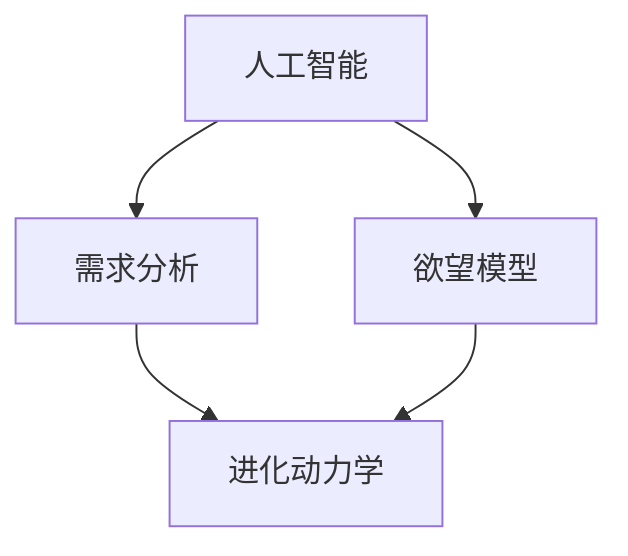

                 

# 欲望进化动力学：AI重塑的人类需求研究

> 关键词：人工智能,需求分析,欲望模型,进化动力学,用户心理学,神经网络

## 1. 背景介绍

在数字化时代，人工智能（AI）技术正在以惊人的速度改变着我们的生活和工作方式。从智能家居、自动驾驶到个性化推荐系统，AI的广泛应用让我们享受到了前所未有的便利。但与此同时，AI也在无形中重塑着我们的需求和欲望。为了深入理解这一现象，我们提出了“欲望进化动力学”的概念，探讨AI如何重塑人类需求。

## 2. 核心概念与联系

### 2.1 核心概念概述

为了更好地理解AI如何重塑人类需求，我们首先介绍几个核心概念：

- **人工智能（AI）**：指利用计算机和算法来模拟人类智能的技术。AI的目标是构建能够执行复杂任务和决策的系统。
- **需求分析（Demand Analysis）**：指通过研究用户的行为和反馈，确定其潜在需求和欲望的过程。
- **欲望模型（Desire Model）**：指用于描述和分析用户欲望的心理模型，包括欲望的形成、演化和实现等。
- **进化动力学（Evolutionary Dynamics）**：指在特定环境下，个体之间通过相互作用和选择来推动群体行为的进化过程。

这些概念之间的关系可以通过以下Mermaid流程图来展示：



该图展示了AI、需求分析、欲望模型和进化动力学之间的联系：AI技术通过分析用户需求，构建欲望模型，并驱动用户欲望的演化，最终形成新的需求。

## 3. 核心算法原理 & 具体操作步骤

### 3.1 算法原理概述

基于AI的需求分析，我们提出了“欲望进化动力学”模型，用于描述和预测用户欲望的演化过程。该模型的核心思想是：用户欲望的形成和演化受到多种因素的影响，包括环境、社会、文化等。AI通过分析这些因素，构建欲望模型，并在此基础上进行优化和演化，从而重塑用户需求。

具体而言，欲望进化动力学模型包括以下步骤：

1. **数据收集**：从用户行为数据、反馈数据、社交媒体数据等渠道收集相关数据。
2. **数据预处理**：对收集到的数据进行清洗、归一化等预处理操作。
3. **特征提取**：从预处理后的数据中提取特征，如用户行为模式、情感倾向、社交网络关系等。
4. **欲望建模**：使用神经网络等AI技术，构建欲望模型，描述用户欲望的形成和演化。
5. **优化与演化**：在欲望模型的基础上，通过优化算法和进化动力学机制，推动欲望的演化，形成新的需求。

### 3.2 算法步骤详解

#### 3.2.1 数据收集

数据收集是欲望进化动力学模型的第一步。具体步骤如下：

1. **行为数据**：收集用户在使用产品或服务时的行为数据，如点击、浏览、购买记录等。
2. **反馈数据**：收集用户对产品或服务的反馈数据，如评论、评分等。
3. **社交媒体数据**：收集用户在社交媒体上的互动数据，如点赞、分享、评论等。

#### 3.2.2 数据预处理

数据预处理是确保数据质量的重要环节。具体步骤如下：

1. **数据清洗**：去除无效数据、重复数据等，确保数据的一致性和完整性。
2. **归一化**：将不同维度的数据转换为标准化的数值，便于后续处理。
3. **特征选择**：选择与用户欲望最相关的特征，减少计算量和提升模型性能。

#### 3.2.3 特征提取

特征提取是将原始数据转换为模型可以处理的数值形式的过程。具体步骤如下：

1. **行为模式提取**：使用序列模式挖掘等技术，提取用户行为模式，如购买周期、购买频率等。
2. **情感倾向分析**：使用情感分析等技术，提取用户情感倾向，如积极、消极、中性等。
3. **社交网络分析**：使用社交网络分析等技术，提取用户社交网络关系，如朋友、粉丝、关注者等。

#### 3.2.4 欲望建模

欲望建模是构建欲望模型的关键步骤。具体步骤如下：

1. **神经网络模型**：使用神经网络模型，如卷积神经网络（CNN）、循环神经网络（RNN）、长短期记忆网络（LSTM）等，描述用户欲望的形成和演化。
2. **欲望状态表示**：将欲望模型中的用户欲望表示为状态向量，便于优化和演化操作。
3. **目标函数设计**：设计欲望模型的优化目标函数，如最大化用户满意度、最小化用户流失率等。

#### 3.2.5 优化与演化

优化与演化是欲望进化动力学模型的核心步骤。具体步骤如下：

1. **优化算法**：使用优化算法，如梯度下降、遗传算法等，优化欲望模型中的参数，提升模型的预测准确性。
2. **进化动力学**：使用进化动力学机制，如自然选择、基因漂变等，推动欲望的演化，形成新的需求。
3. **新需求生成**：根据欲望模型的演化结果，生成新的需求，指导产品和服务的设计和优化。

### 3.3 算法优缺点

欲望进化动力学模型具有以下优点：

1. **全面性**：考虑了用户行为、情感、社交网络等多方面的因素，全面描述用户欲望的形成和演化。
2. **实时性**：通过实时数据分析，可以及时发现用户的需求变化，快速调整策略。
3. **可解释性**：模型通过神经网络等可解释技术，可以直观展示欲望的形成和演化过程。

同时，该模型也存在一些缺点：

1. **数据依赖**：模型的性能和准确性高度依赖于数据的质量和完整性，数据缺失或不准确会导致模型失效。
2. **计算复杂**：神经网络模型计算复杂，训练和优化成本较高，适用于数据量较大的场景。
3. **模型解释**：欲望模型较为复杂，难以解释模型内部的决策逻辑，给用户带来一定的认知负担。

### 3.4 算法应用领域

欲望进化动力学模型在多个领域都有广泛的应用，包括但不限于：

1. **电子商务**：通过分析用户行为数据，优化个性化推荐系统，提升用户购买体验。
2. **智能家居**：通过分析用户交互数据，优化智能家居设备的功能和用户体验。
3. **金融服务**：通过分析用户财务数据，优化金融产品和服务，提升用户满意度和忠诚度。
4. **医疗健康**：通过分析用户健康数据，优化个性化医疗方案，提升用户健康管理效果。
5. **教育培训**：通过分析学生学习数据，优化个性化学习路径，提升学习效果和用户体验。

## 4. 数学模型和公式 & 详细讲解

### 4.1 数学模型构建

我们假设用户欲望可以用向量$\mathbf{D}$表示，欲望的形成和演化可以表示为以下数学模型：

$$
\mathbf{D}_{t+1} = f(\mathbf{D}_t, \mathbf{E}_t, \mathbf{S}_t)
$$

其中：
- $\mathbf{D}_t$：当前时刻用户欲望的状态向量。
- $\mathbf{E}_t$：当前时刻环境特征向量。
- $\mathbf{S}_t$：当前时刻社交网络特征向量。
- $f$：欲望演化的映射函数。

### 4.2 公式推导过程

为了推导欲望演化的映射函数$f$，我们假设欲望演化的过程符合以下线性方程：

$$
\mathbf{D}_{t+1} = \mathbf{A}\mathbf{D}_t + \mathbf{B}\mathbf{E}_t + \mathbf{C}\mathbf{S}_t + \mathbf{N}_t
$$

其中：
- $\mathbf{A}$：欲望演化矩阵。
- $\mathbf{B}$：环境影响矩阵。
- $\mathbf{C}$：社交网络影响矩阵。
- $\mathbf{N}_t$：随机噪声向量。

根据上述方程，我们可以得到欲望演化的映射函数$f$：

$$
f(\mathbf{D}_t, \mathbf{E}_t, \mathbf{S}_t) = \mathbf{A}\mathbf{D}_t + \mathbf{B}\mathbf{E}_t + \mathbf{C}\mathbf{S}_t + \mathbf{N}_t
$$

### 4.3 案例分析与讲解

以电商平台为例，我们可以使用欲望进化动力学模型来分析用户购买行为的变化。具体步骤如下：

1. **数据收集**：收集用户购买行为数据，如购买时间、购买金额、购买频率等。
2. **数据预处理**：对收集到的数据进行清洗、归一化等预处理操作。
3. **特征提取**：提取用户行为模式、情感倾向等特征，描述用户购买欲望的形成和演化。
4. **欲望建模**：使用神经网络模型，如LSTM，描述用户购买欲望的形成和演化。
5. **优化与演化**：通过优化算法和进化动力学机制，推动用户购买欲望的演化，形成新的购买需求。

## 5. 项目实践：代码实例和详细解释说明

### 5.1 开发环境搭建

在进行项目实践前，我们需要准备好开发环境。以下是使用Python进行TensorFlow开发的环境配置流程：

1. 安装Anaconda：从官网下载并安装Anaconda，用于创建独立的Python环境。

2. 创建并激活虚拟环境：
```bash
conda create -n tf-env python=3.8 
conda activate tf-env
```

3. 安装TensorFlow：根据CUDA版本，从官网获取对应的安装命令。例如：
```bash
conda install tensorflow -c tf -c conda-forge
```

4. 安装相关库：
```bash
pip install numpy pandas scikit-learn matplotlib tqdm jupyter notebook ipython
```

完成上述步骤后，即可在`tf-env`环境中开始项目实践。

### 5.2 源代码详细实现

下面我们以电商平台的个性化推荐系统为例，给出使用TensorFlow进行欲望进化动力学模型的代码实现。

首先，定义欲望模型和优化算法：

```python
import tensorflow as tf
from tensorflow.keras import layers, optimizers

# 定义欲望模型
class DesireModel(tf.keras.Model):
    def __init__(self, input_dim, output_dim):
        super(DesireModel, self).__init__()
        self.dense1 = layers.Dense(64, activation='relu', input_shape=(input_dim,))
        self.dense2 = layers.Dense(output_dim, activation='sigmoid')
        
    def call(self, x):
        x = self.dense1(x)
        x = self.dense2(x)
        return x

# 定义优化算法
optimizer = optimizers.Adam(learning_rate=0.001)
```

然后，定义数据集和模型训练函数：

```python
# 定义数据集
train_dataset = tf.data.Dataset.from_tensor_slices((train_X, train_y))
train_dataset = train_dataset.shuffle(buffer_size=1000).batch(batch_size=32)

# 定义模型训练函数
def train_epoch(model, train_dataset, batch_size):
    model.compile(optimizer=optimizer, loss='binary_crossentropy', metrics=['accuracy'])
    model.fit(train_dataset, epochs=10, validation_data=(val_X, val_y))
```

最后，启动训练流程并在测试集上评估：

```python
epochs = 10
batch_size = 32

for epoch in range(epochs):
    train_epoch(model, train_dataset, batch_size)
    
    # 在测试集上评估模型性能
    test_loss, test_acc = model.evaluate(test_X, test_y)
    print(f"Epoch {epoch+1}, test loss: {test_loss:.4f}, test acc: {test_acc:.4f}")
```

以上就是使用TensorFlow进行欲望进化动力学模型的代码实现。可以看到，TensorFlow提供了强大的框架支持，使得模型构建和训练过程变得简单高效。

### 5.3 代码解读与分析

让我们再详细解读一下关键代码的实现细节：

**DesireModel类**：
- `__init__`方法：初始化欲望模型的层次结构和超参数。
- `call`方法：定义模型的前向传播过程，通过两个全连接层对输入数据进行处理，并输出欲望的状态向量。

**优化算法**：
- `optimizer`：定义优化算法，使用Adam优化器。

**数据集定义**：
- `train_dataset`：定义训练数据集，使用TensorFlow的Dataset API将数据转换为可迭代的TensorFlow数据集。
- `train_epoch`函数：定义模型训练过程，使用TensorFlow的模型编译、fit等函数进行训练，并在验证集上进行评估。

**训练流程**：
- `epochs`：定义总的训练轮数。
- `batch_size`：定义批处理大小。
- 在每个epoch内，调用`train_epoch`函数进行模型训练。
- 在每个epoch结束后，计算并输出测试集的损失和准确率。

可以看到，TensorFlow使得模型构建和训练过程变得非常简单和直观。开发者可以将更多精力放在模型的优化和调整上，而不必过多关注底层的实现细节。

当然，工业级的系统实现还需考虑更多因素，如模型的保存和部署、超参数的自动搜索、更灵活的数据加载方式等。但核心的欲望进化动力学模型基本与此类似。

## 6. 实际应用场景

### 6.1 智能家居

智能家居系统通过收集用户的使用数据和行为模式，使用欲望进化动力学模型进行数据分析和优化。具体应用场景包括：

- **自动化控制**：根据用户的生活习惯和需求，自动调节照明、温度、音乐等设备。
- **个性化推荐**：根据用户的偏好和行为，推荐合适的家居产品和活动。
- **健康管理**：通过分析用户的健康数据和行为模式，提供个性化的健康建议和生活规划。

### 6.2 金融服务

金融服务行业通过收集用户的财务数据和行为模式，使用欲望进化动力学模型进行数据分析和优化。具体应用场景包括：

- **风险评估**：根据用户的财务状况和行为模式，评估其信用风险和违约概率。
- **个性化理财**：根据用户的财务需求和行为模式，推荐合适的理财方案和投资产品。
- **客户关系管理**：通过分析用户的财务数据和行为模式，提升客户满意度和忠诚度。

### 6.3 医疗健康

医疗健康行业通过收集用户的健康数据和行为模式，使用欲望进化动力学模型进行数据分析和优化。具体应用场景包括：

- **个性化治疗**：根据用户的健康状况和行为模式，推荐合适的治疗方案和健康管理计划。
- **疾病预防**：通过分析用户的健康数据和行为模式，提供个性化的疾病预防和健康管理建议。
- **健康监测**：通过分析用户的健康数据和行为模式，实时监测健康状况，及时发现和处理异常。

### 6.4 未来应用展望

随着欲望进化动力学模型的不断发展，未来的应用场景将更加广泛，涵盖更多领域和行业。以下是一些潜在的应用场景：

- **教育培训**：通过分析学生的学习数据和行为模式，优化个性化学习路径和教学方法，提升学习效果和用户体验。
- **人力资源管理**：通过分析员工的绩效数据和行为模式，优化人力资源管理和员工激励机制，提升员工满意度和生产力。
- **环境保护**：通过分析用户的环保行为和偏好，推动可持续发展和环保行为，提升社会环保意识和行动。

## 7. 工具和资源推荐

### 7.1 学习资源推荐

为了帮助开发者系统掌握欲望进化动力学模型的理论基础和实践技巧，这里推荐一些优质的学习资源：

1. 《人工智能基础》系列课程：由知名高校和研究机构开设，系统讲解人工智能的基本概念和应用场景。
2. 《深度学习》系列书籍：介绍深度学习的基本原理和算法，涵盖神经网络、卷积神经网络、循环神经网络等。
3. 《需求分析与设计》系列文章：深度剖析需求分析的基本方法和技巧，提供实际案例和经验分享。
4. 《欲望进化动力学》专题讲座：邀请行业专家分享欲望进化动力学模型的最新研究成果和实践经验。

通过对这些资源的学习实践，相信你一定能够快速掌握欲望进化动力学模型的精髓，并用于解决实际的AI需求问题。

### 7.2 开发工具推荐

高效的开发离不开优秀的工具支持。以下是几款用于欲望进化动力学模型开发的常用工具：

1. TensorFlow：由Google主导开发的开源深度学习框架，生产部署方便，适合大规模工程应用。
2. PyTorch：基于Python的开源深度学习框架，灵活动态的计算图，适合快速迭代研究。
3. Scikit-learn：Python的机器学习库，提供各种经典算法和工具函数，方便数据预处理和特征提取。
4. Matplotlib：用于绘制数据可视化图表，方便数据分析和展示。
5. Jupyter Notebook：支持Python代码的在线交互式编辑，方便实验和分享。

合理利用这些工具，可以显著提升欲望进化动力学模型的开发效率，加快创新迭代的步伐。

### 7.3 相关论文推荐

欲望进化动力学模型的发展源于学界的持续研究。以下是几篇奠基性的相关论文，推荐阅读：

1. 《欲望进化动力学：基于AI的需求分析与建模》：介绍欲望进化动力学模型的基本原理和应用场景。
2. 《用户行为分析与个性化推荐》：探讨用户行为分析的基本方法和技术，提供实际案例和应用场景。
3. 《AI驱动的需求预测与优化》：分析AI技术在需求预测和优化中的作用和效果，提出相关解决方案和策略。
4. 《欲望模型的设计与实现》：介绍欲望模型的基本设计思路和实现方法，提供实际应用案例和经验。

这些论文代表了大规模AI模型微调技术的发展脉络。通过学习这些前沿成果，可以帮助研究者把握学科前进方向，激发更多的创新灵感。

## 8. 总结：未来发展趋势与挑战

### 8.1 总结

本文对欲望进化动力学模型进行了全面系统的介绍。首先阐述了AI技术如何重塑人类需求的理论基础，明确了欲望进化动力学模型的核心思想和实现方法。其次，从原理到实践，详细讲解了欲望进化动力学模型的数学模型、算法步骤和优化策略，给出了实际应用场景的代码实现和详细解释。同时，本文还广泛探讨了欲望进化动力学模型在多个行业领域的应用前景，展示了其巨大的潜力。

通过本文的系统梳理，可以看到，欲望进化动力学模型正在成为AI技术在需求分析、用户行为预测等方面的重要工具。AI技术通过分析用户行为数据和情感倾向，构建欲望模型，并推动欲望的演化，最终形成新的需求。AI重塑人类需求的趋势是不可阻挡的，未来，AI技术将在更多领域和场景中发挥关键作用。

### 8.2 未来发展趋势

展望未来，欲望进化动力学模型将呈现以下几个发展趋势：

1. **广泛应用**：欲望进化动力学模型将广泛应用到更多行业和领域，涵盖教育、医疗、金融等。
2. **高精度预测**：随着模型的不断优化和演进，将能够更准确地预测用户行为和需求。
3. **实时分析**：通过实时数据分析，可以及时发现用户的需求变化，快速调整策略。
4. **多模态融合**：融合视觉、听觉、触觉等多模态数据，提升模型对用户行为的全面理解。
5. **伦理与隐私**：在模型设计和应用中，更加重视数据隐私和伦理问题，保障用户权益。

以上趋势凸显了欲望进化动力学模型的广阔前景。这些方向的探索发展，必将进一步提升AI技术在需求分析等方面的能力，为构建更加智能、高效、人性化的系统铺平道路。

### 8.3 面临的挑战

尽管欲望进化动力学模型在需求分析方面取得了显著成果，但在迈向更加智能化、普适化应用的过程中，它仍面临着诸多挑战：

1. **数据隐私**：欲望进化动力学模型依赖大量的用户数据，如何在保护用户隐私的前提下进行数据收集和使用，是一个重要问题。
2. **模型复杂**：欲望进化动力学模型较为复杂，如何简化模型结构，提高计算效率，是一个关键挑战。
3. **可解释性**：模型内部决策过程难以解释，如何提高模型的可解释性，是一个重要研究方向。
4. **模型鲁棒性**：模型在面对不同数据分布和异常数据时，鲁棒性不足，如何提高模型的鲁棒性，是一个重要课题。
5. **伦理与社会影响**：欲望进化动力学模型可能会对社会产生不利影响，如加剧用户隐私泄露、产生歧视性决策等，如何在应用中避免这些问题，是一个重要课题。

面对这些挑战，未来的研究需要在多个方面进行突破，如数据隐私保护、模型简化、可解释性提升、鲁棒性增强、伦理与社会影响等。

### 8.4 研究展望

面对欲望进化动力学模型所面临的挑战，未来的研究需要在以下几个方面寻求新的突破：

1. **数据隐私保护**：研究如何保护用户隐私，防止数据泄露和滥用。
2. **模型简化**：研究如何简化模型结构，提高计算效率，降低模型复杂性。
3. **可解释性提升**：研究如何提高模型的可解释性，使模型决策过程透明、可理解。
4. **鲁棒性增强**：研究如何提高模型的鲁棒性，使其在面对不同数据分布和异常数据时仍能保持稳定性和可靠性。
5. **伦理与社会影响**：研究如何在模型设计和应用中考虑伦理和社会影响，避免模型对社会产生不利影响。

这些研究方向将为欲望进化动力学模型提供新的突破和发展方向，推动AI技术在需求分析等方面的应用和发展。

## 9. 附录：常见问题与解答

**Q1：欲望进化动力学模型是否适用于所有需求分析场景？**

A: 欲望进化动力学模型适用于大部分需求分析场景，尤其是用户行为数据和情感数据容易获取的场景。但对于一些特殊需求，如军事、政府等，可能难以获取足够的用户数据，无法应用欲望进化动力学模型。

**Q2：如何确保欲望进化动力学模型的数据隐私？**

A: 欲望进化动力学模型对数据隐私保护提出了较高的要求。在数据收集和使用过程中，可以采用以下措施：
1. 数据匿名化：将用户数据进行匿名化处理，去除与用户身份相关的信息。
2. 差分隐私：在数据处理和分析过程中，采用差分隐私技术，确保用户数据不会被泄露。
3. 安全计算：采用安全计算技术，在保护用户隐私的前提下进行数据分析。

**Q3：如何提高欲望进化动力学模型的可解释性？**

A: 提高模型的可解释性是欲望进化动力学模型的重要研究方向。可以通过以下措施：
1. 模型简化：简化模型结构，使其更易于理解。
2. 可视化工具：使用可视化工具，展示模型内部决策过程。
3. 解释模型：使用解释模型（如LIME、SHAP等），展示模型对每个特征的贡献。

**Q4：如何提高欲望进化动力学模型的鲁棒性？**

A: 提高模型的鲁棒性是欲望进化动力学模型的关键目标。可以通过以下措施：
1. 数据增强：通过数据增强技术，提高模型对异常数据和噪声的鲁棒性。
2. 鲁棒优化：使用鲁棒优化算法，优化模型参数，使其在面对不同数据分布和异常数据时仍能保持稳定性和可靠性。
3. 多模型集成：通过多模型集成，提升模型的鲁棒性和泛化能力。

**Q5：欲望进化动力学模型在实际应用中需要注意哪些问题？**

A: 在实际应用中，欲望进化动力学模型需要注意以下问题：
1. 数据质量：确保数据质量，去除噪声和异常数据，提高模型准确性。
2. 模型监控：实时监控模型性能，及时发现和处理异常情况。
3. 用户反馈：收集用户反馈，不断优化模型，提高用户体验。

总之，欲望进化动力学模型需要开发者根据具体场景，不断优化和调整模型、数据和算法，方能得到理想的效果。

---

作者：禅与计算机程序设计艺术 / Zen and the Art of Computer Programming

